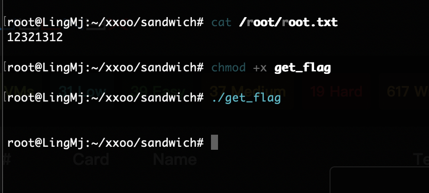
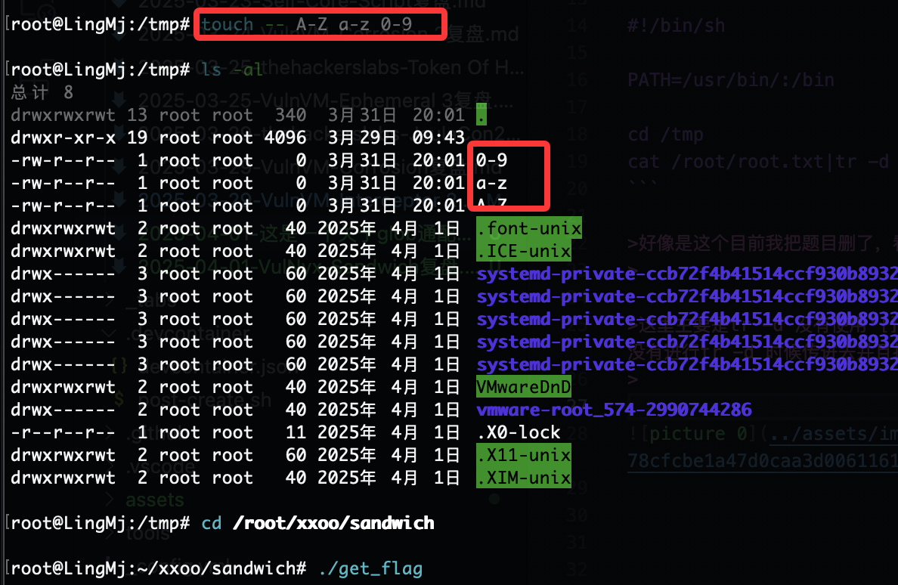
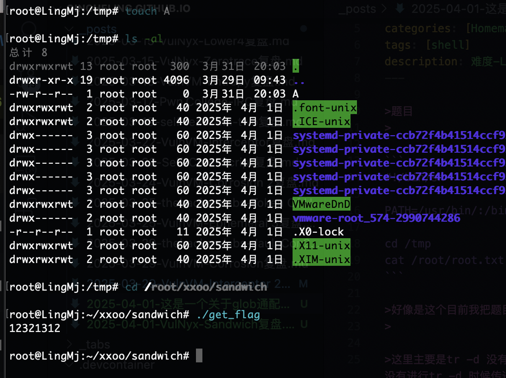

>题目
>

```
#!/bin/sh

PATH=/usr/bin/:/bin

cd /tmp
cat /root/root.txt|tr -d [A-Za-z0-9]
```

>好像是这个目前我把题目删了，看一下聊天记录的,检查了一下是这个
>

>这里主要是tr -d 没有使用'[]',而第一步是进入tmp，当我我研究我使用a-z A-Z 0-9为对应的文件很明显失败了它并没有进行tr -d 时候传进去并且报错返回root.txt，当时挺疑惑的
>

  

  

>很明显我设计的时候就是没触发，但是我得到的答案确实是这条路，之需要一个就够了
>

  

>具体我是怎么理解的，首先[A-Za-z0-9]它是一个集合吧，当存在一个值匹配到里面它就会变成那个匹配到值，而A-Z为什么没成功呢,我认为它目录创建A-Z是一个完整的不对应A..Z的任何一项所以通配符没有匹配成功导致失败
>


