## 网段扫描
```
root@LingMj:~# arp-scan -l
Interface: eth0, type: EN10MB, MAC: 00:0c:29:d1:27:55, IPv4: 192.168.137.190
Starting arp-scan 1.10.0 with 256 hosts (https://github.com/royhills/arp-scan)
192.168.137.1	3e:21:9c:12:bd:a3	(Unknown: locally administered)
192.168.137.131	3e:21:9c:12:bd:a3	(Unknown: locally administered)
192.168.137.203	a0:78:17:62:e5:0a	Apple, Inc.

6 packets received by filter, 0 packets dropped by kernel
Ending arp-scan 1.10.0: 256 hosts scanned in 2.037 seconds (125.68 hosts/sec). 3 responded
```

## 端口扫描

```
root@LingMj:~# nmap -p- -sV -sC 192.168.137.131
Starting Nmap 7.95 ( https://nmap.org ) at 2025-04-05 23:14 EDT
Nmap scan report for debian.mshome.net (192.168.137.131)
Host is up (0.038s latency).
Not shown: 65533 closed tcp ports (reset)
PORT   STATE SERVICE VERSION
22/tcp open  ssh     OpenSSH 9.2p1 Debian 2+deb12u5 (protocol 2.0)
| ssh-hostkey: 
|   256 39:0d:70:e0:55:cb:20:de:ad:f7:10:d8:1f:76:4d:9d (ECDSA)
|_  256 df:e2:94:52:e9:3d:eb:69:2d:b4:a5:a9:2c:3e:63:46 (ED25519)
80/tcp open  http    Apache httpd 2.4.62 ((Debian))
|_http-title: Apache2 Debian Default Page: It works
|_http-server-header: Apache/2.4.62 (Debian)
MAC Address: 3E:21:9C:12:BD:A3 (Unknown)
Service Info: OS: Linux; CPE: cpe:/o:linux:linux_kernel
```

## 获取webshell
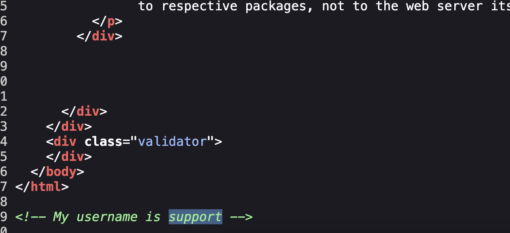  
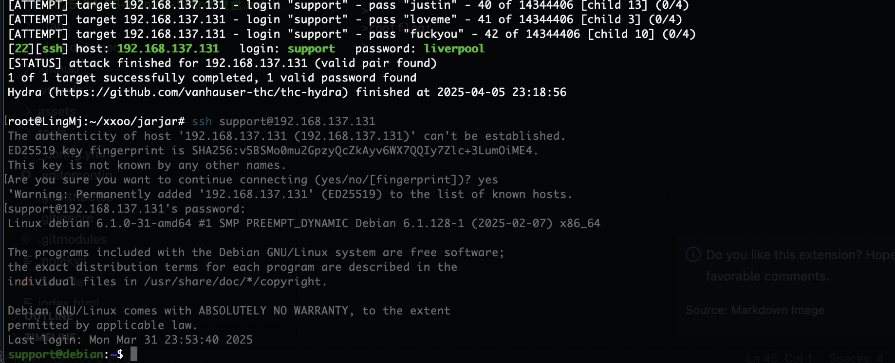  

>没啥好说的
>


## 提权

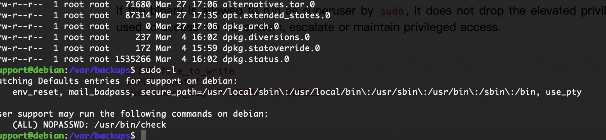  
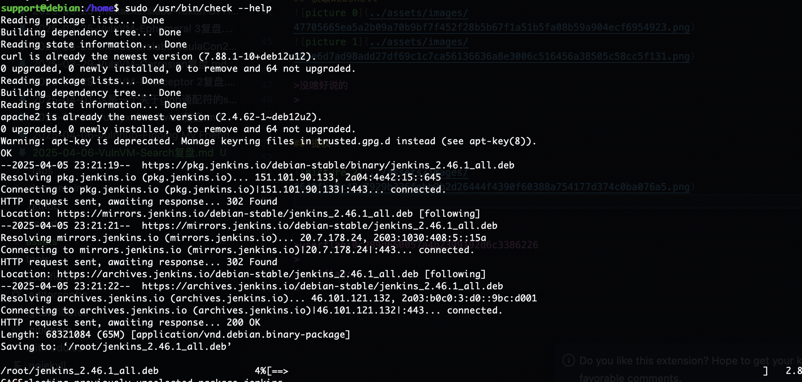  

>一个下载的东西，算了直接看看程序
>

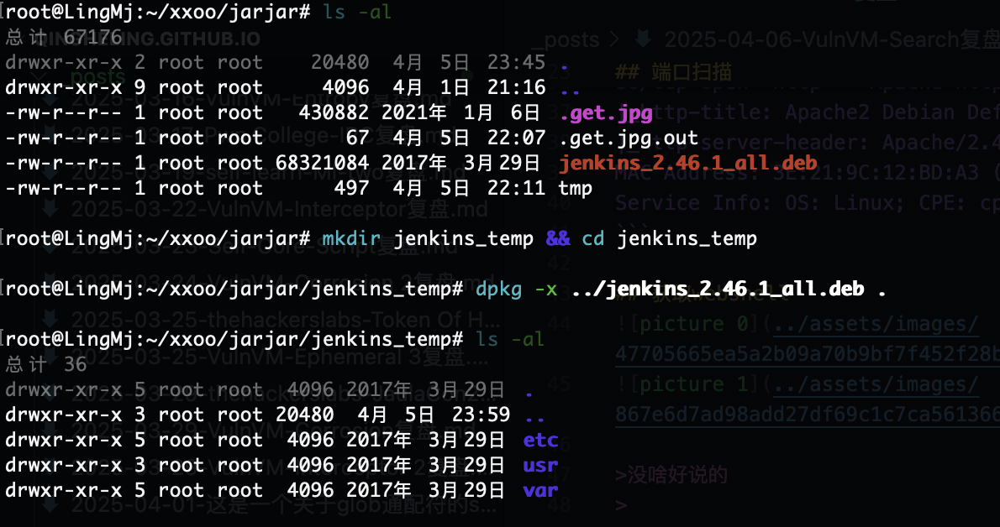  

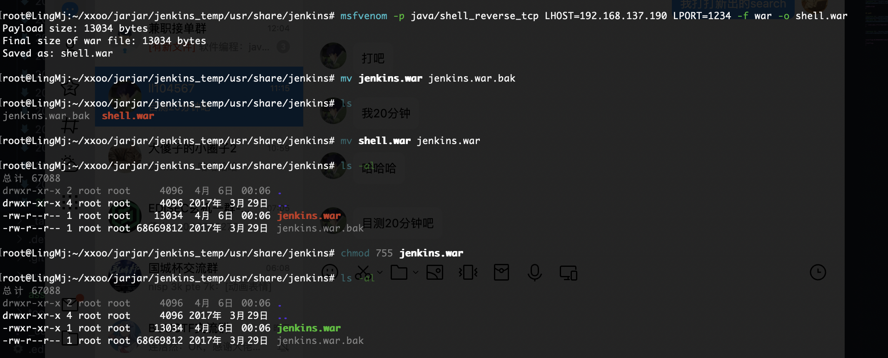  

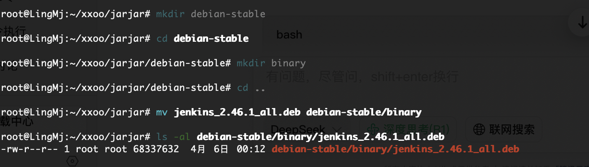  

>构造恶意的deb包
>

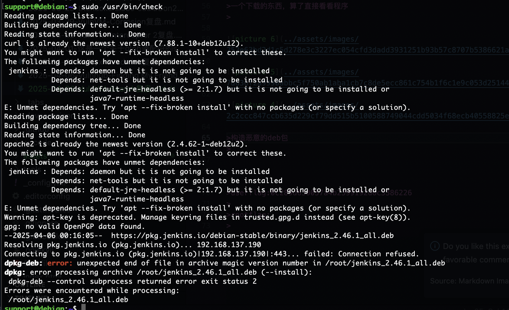  

>算了头疼搁置了反正就这个思路构建不成功，主要是我好像没打过构建deb的靶机差不到具体流程
>

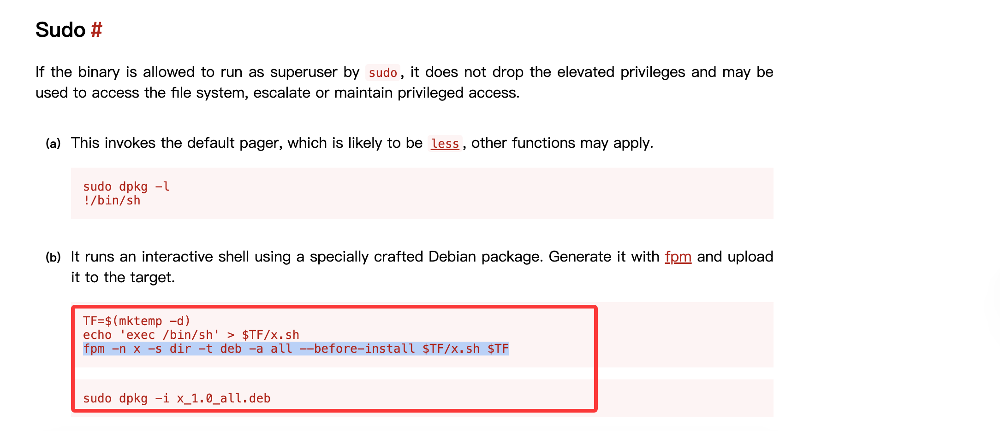  


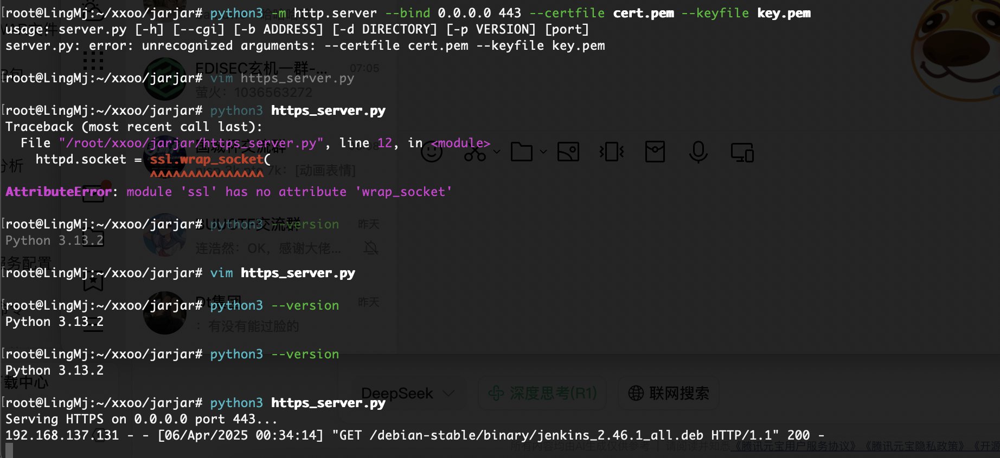  

>需要https端口，具体操作找gtp
>

```
import http.server
import ssl

# 配置地址、端口、证书路径
bind_address = '0.0.0.0'
port = 443
certfile = 'cert.pem'
keyfile = 'key.pem'

# 创建 HTTP 服务器
httpd = http.server.HTTPServer((bind_address, port), http.server.SimpleHTTPRequestHandler)

# 创建 SSL 上下文并加载证书
context = ssl.SSLContext(ssl.PROTOCOL_TLS_SERVER)
context.load_cert_chain(certfile=certfile, keyfile=keyfile)

# 用 SSL 上下文包装 socket
httpd.socket = context.wrap_socket(httpd.socket, server_side=True)

print(f"Serving HTTPS on {bind_address} port {port}...")
httpd.serve_forever()
```

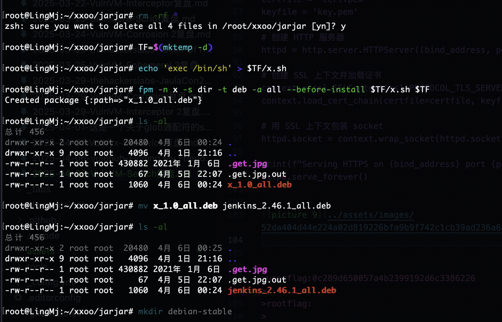  


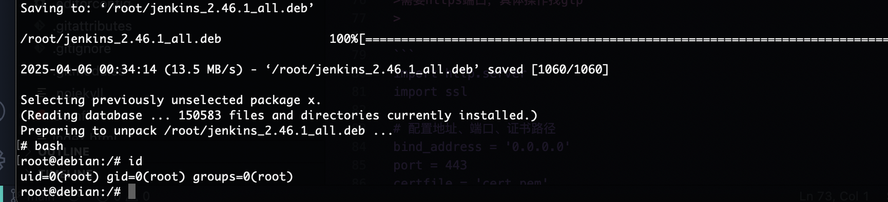  

>来自大佬提示完成
>

>userflag:0c289d650057a4b2399192d6c3386226
>
>rootflag:42b8499e0709ef45c5e9ede616271e53
>