## 网段扫描
```
root@LingMj:~/xxoo/jarjar# arp-scan -l
Interface: eth0, type: EN10MB, MAC: 00:0c:29:d1:27:55, IPv4: 192.168.137.190
Starting arp-scan 1.10.0 with 256 hosts (https://github.com/royhills/arp-scan)
192.168.137.1	3e:21:9c:12:bd:a3	(Unknown: locally administered)
192.168.137.165	3e:21:9c:12:bd:a3	(Unknown: locally administered)
192.168.137.203	a0:78:17:62:e5:0a	Apple, Inc.

9 packets received by filter, 0 packets dropped by kernel
Ending arp-scan 1.10.0: 256 hosts scanned in 2.082 seconds (122.96 hosts/sec). 3 responded
```

## 端口扫描

```
root@LingMj:~/xxoo/jarjar# nmap -p- -sV -sC 192.168.137.165
Starting Nmap 7.95 ( https://nmap.org ) at 2025-04-05 22:02 EDT
Nmap scan report for findingmyfriend.mshome.net (192.168.137.165)
Host is up (0.041s latency).
Not shown: 65532 closed tcp ports (reset)
PORT   STATE SERVICE VERSION
21/tcp open  ftp     vsftpd 3.0.3
22/tcp open  ssh     OpenSSH 7.2p2 Ubuntu 4ubuntu2.10 (Ubuntu Linux; protocol 2.0)
| ssh-hostkey: 
|   2048 ce:19:b7:da:b3:c5:10:73:a7:43:3c:7e:93:50:74:3d (RSA)
|   256 35:25:f6:bb:df:1d:b6:fd:cd:0b:df:4b:30:14:3d:3b (ECDSA)
|_  256 ac:c6:71:53:6b:b5:4a:0a:3a:85:ae:67:32:5d:e2:04 (ED25519)
80/tcp open  http    Apache httpd 2.4.18 ((Ubuntu))
|_http-server-header: Apache/2.4.18 (Ubuntu)
|_http-title: Site doesn't have a title (text/html).
MAC Address: 3E:21:9C:12:BD:A3 (Unknown)
Service Info: OSs: Unix, Linux; CPE: cpe:/o:linux:linux_kernel

Service detection performed. Please report any incorrect results at https://nmap.org/submit/ .
Nmap done: 1 IP address (1 host up) scanned in 26.03 seconds
```

## 获取webshell
  
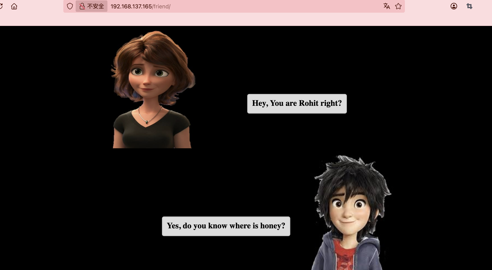  
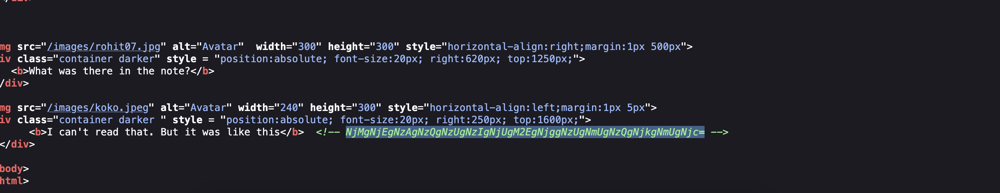  
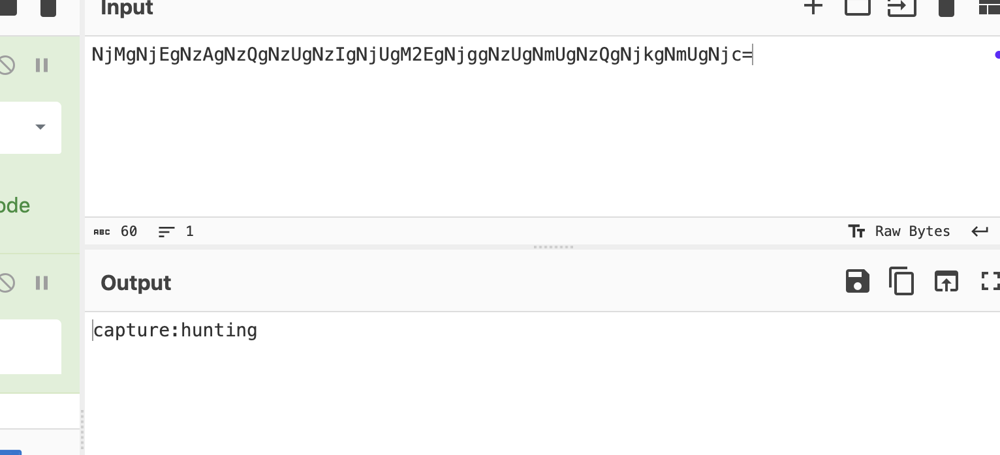  
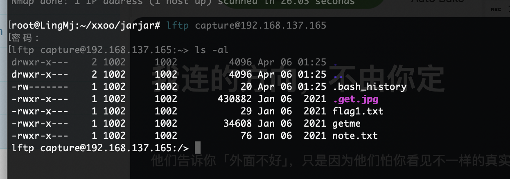  
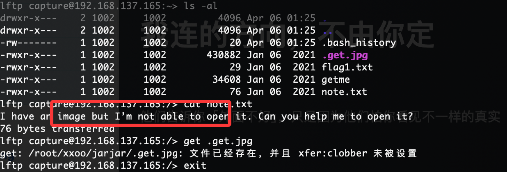  
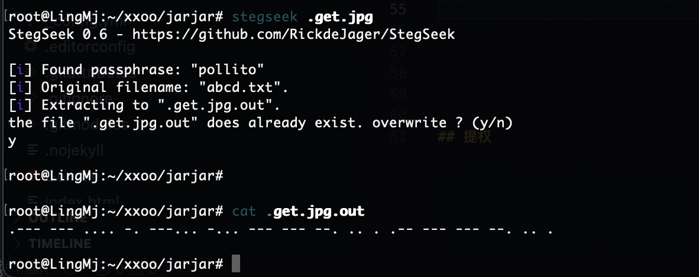  
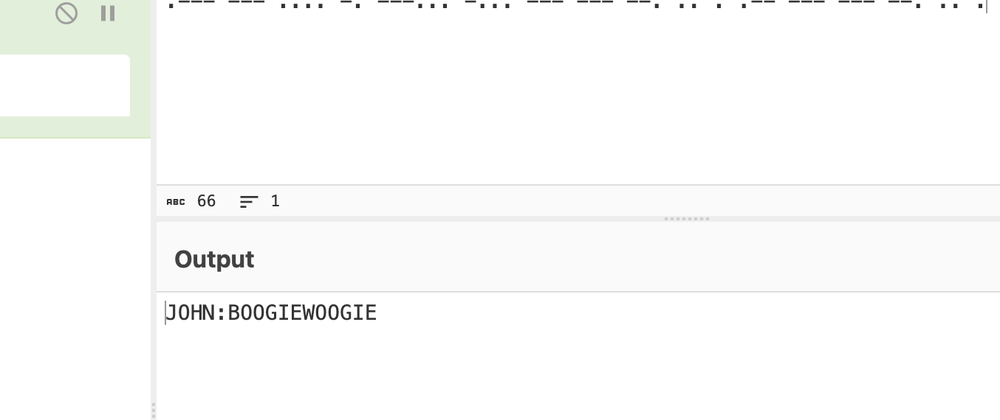  

## 提权

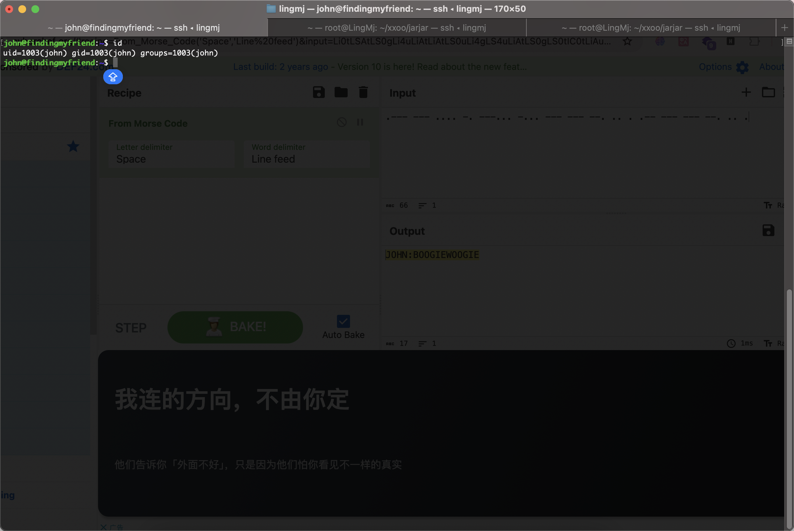  
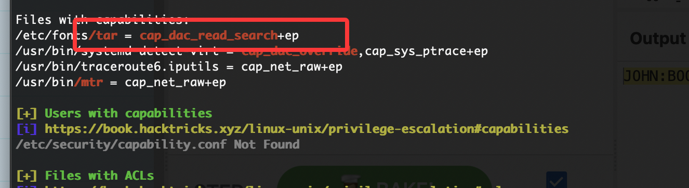  
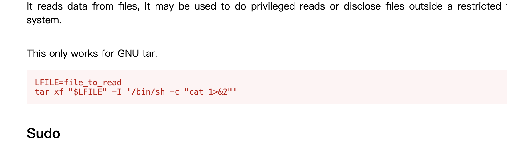  
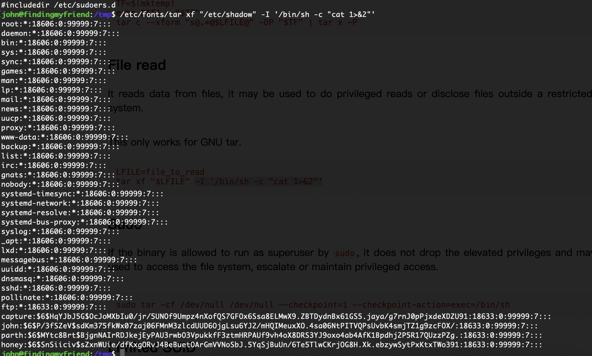  
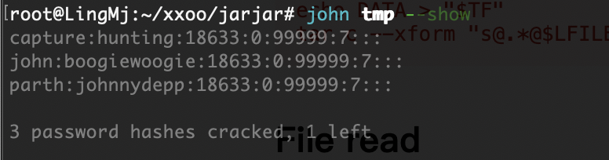  
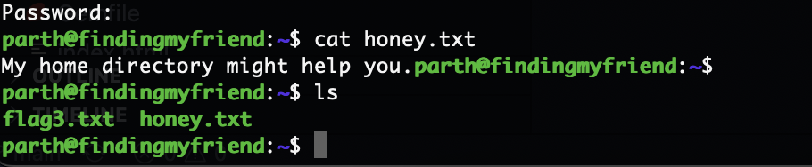  
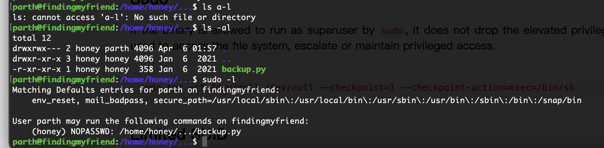  
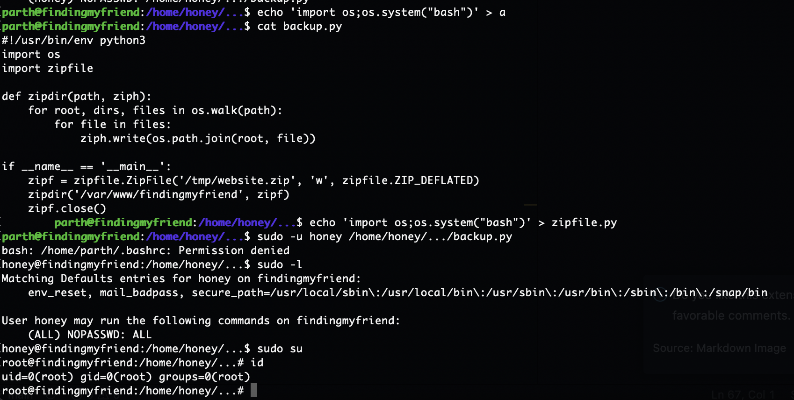  


>没啥好说的都是研究过的知识，整体是个low只不过看花多长时间，我花时间挺长预期之外
>