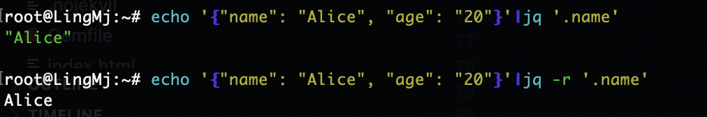
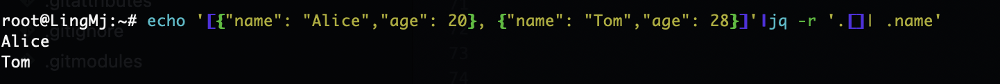
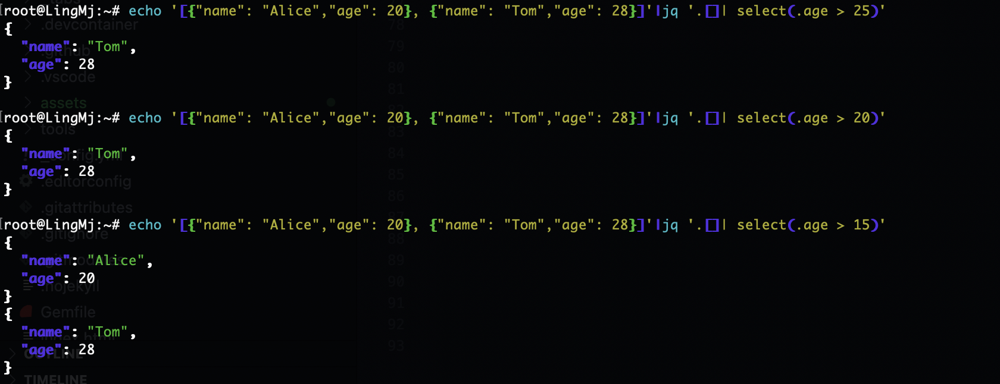
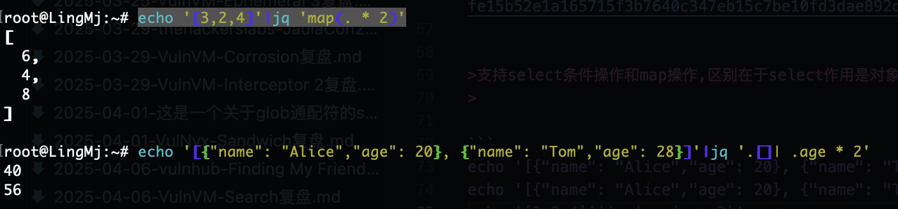
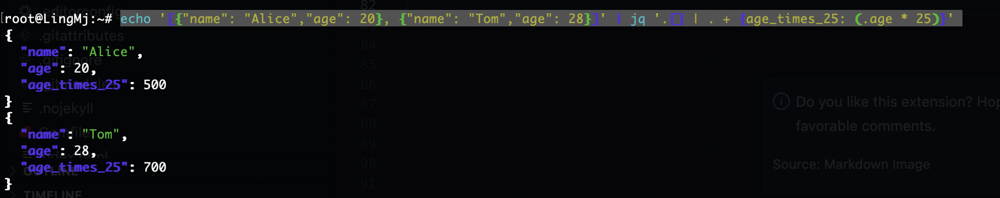
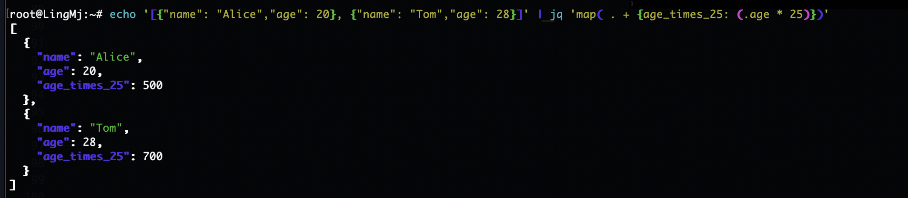
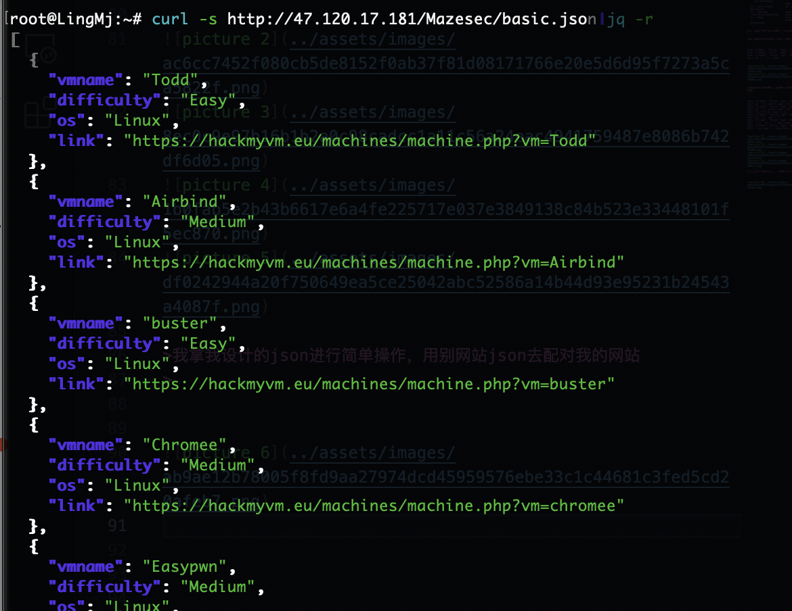
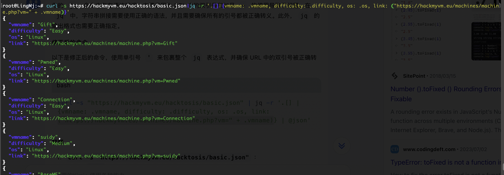

## jq研究

>jq呢是对json数据的操作，主要让数据能轻松美化
>

```
  -n, --null-input          use `null` as the single input value;
  -R, --raw-input           read each line as string instead of JSON;
  -s, --slurp               read all inputs into an array and use it as
                            the single input value;
  -c, --compact-output      compact instead of pretty-printed output;
  -r, --raw-output          output strings without escapes and quotes;
      --raw-output0         implies -r and output NUL after each output;
  -j, --join-output         implies -r and output without newline after
                            each output;
  -a, --ascii-output        output strings by only ASCII characters
                            using escape sequences;
  -S, --sort-keys           sort keys of each object on output;
  -C, --color-output        colorize JSON output;
  -M, --monochrome-output   disable colored output;
      --tab                 use tabs for indentation;
      --indent n            use n spaces for indentation (max 7 spaces);
      --unbuffered          flush output stream after each output;
      --stream              parse the input value in streaming fashion;
      --stream-errors       implies --stream and report parse error as
                            an array;
      --seq                 parse input/output as application/json-seq;
  -f, --from-file file      load filter from the file;
  -L directory              search modules from the directory;
      --arg name value      set $name to the string value;
      --argjson name value  set $name to the JSON value;
      --slurpfile name file set $name to an array of JSON values read
                            from the file;
      --rawfile name file   set $name to string contents of file;
      --args                consume remaining arguments as positional
                            string values;
      --jsonargs            consume remaining arguments as positional
                            JSON values;
  -e, --exit-status         set exit status code based on the output;
  -V, --version             show the version;
  --build-configuration     show jq's build configuration;
  -h, --help                show the help;
  --                        terminates argument processing;
```

>从简单到难的过渡，我先每一个命令操作输出一下看看效果
>

>先是提取对应字段的值，效果像键值一样
>

```
echo '{"name": "Alice", "age": "20"}'|jq '.name'
echo '{"name": "Alice", "age": "20"}'|jq -r '.name'
echo '[{"name": "Alice","age": 20}, {"name": "Tom","age": 28}]'|jq -r '.[]| .name'
```

  
  


>支持select条件操作和map操作,区别在于select作用是对象，map作用是元素
>

```
echo '[{"name": "Alice","age": 20}, {"name": "Tom","age": 28}]'|jq '.[]| select(.age > 25)'
echo '[{"name": "Alice","age": 20}, {"name": "Tom","age": 28}]'|jq '.[]| select(.age > 15)'
echo '[3,2,4]'|jq 'map(. * 2)'
echo '[{"name": "Alice","age": 20}, {"name": "Tom","age": 28}]'|jq '.[]| .age * 2'
echo '[{"name": "Alice","age": 20}, {"name": "Tom","age": 28}]' | jq '.[] | . + {age_times_25: (.age * 25)}' 
echo '[{"name": "Alice","age": 20}, {"name": "Tom","age": 28}]' | jq 'map( . + {age_times_25: (.age * 25)})'
```

  
  
  
  

>我拿我设计的json进行简单操作，用别网站json去配对我的网站
>

  


  

>可以看到一个倒序就能完成一摸一样的效果
>


