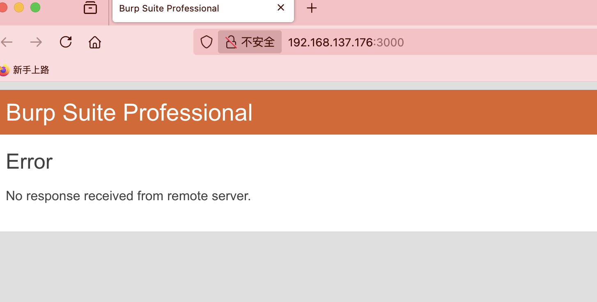
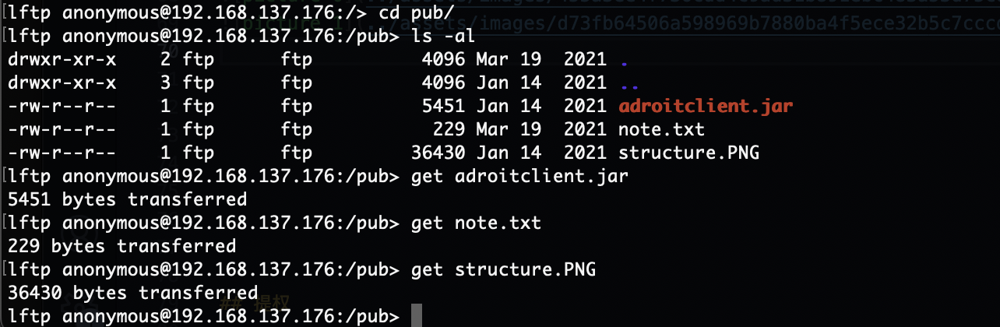
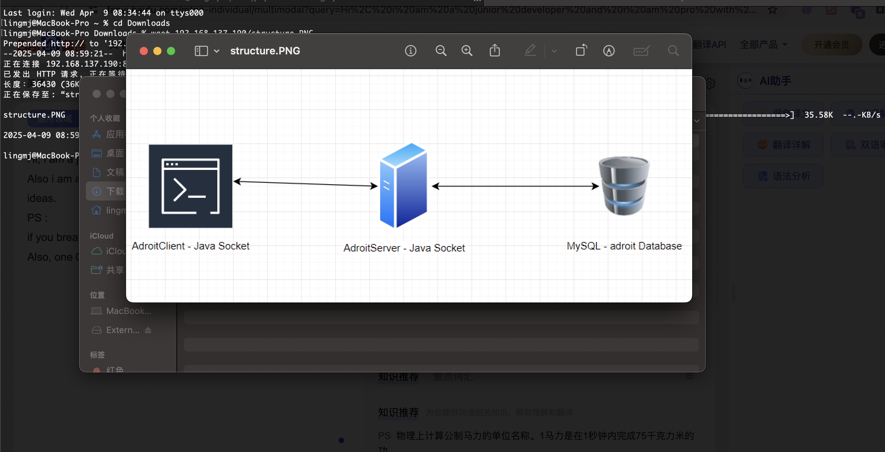
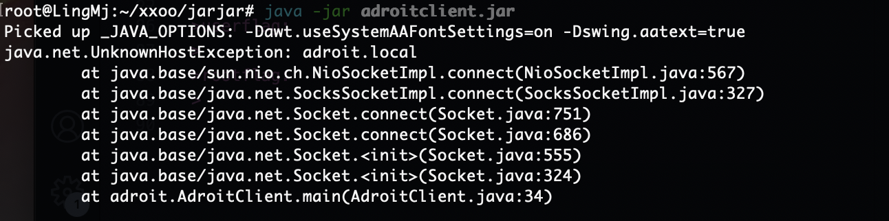
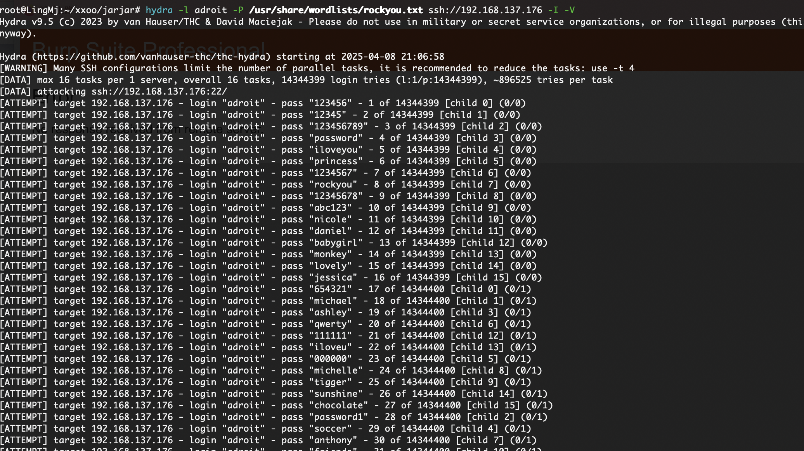
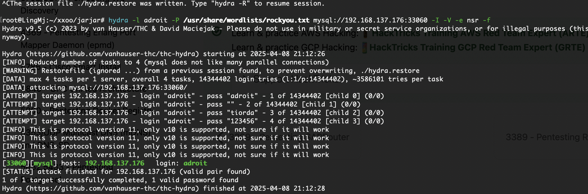

## 网段扫描
```
root@LingMj:~# arp-scan -l
Interface: eth0, type: EN10MB, MAC: 00:0c:29:d1:27:55, IPv4: 192.168.137.190
Starting arp-scan 1.10.0 with 256 hosts (https://github.com/royhills/arp-scan)
192.168.137.1	3e:21:9c:12:bd:a3	(Unknown: locally administered)
192.168.137.176	3e:21:9c:12:bd:a3	(Unknown: locally administered)
192.168.137.203	a0:78:17:62:e5:0a	Apple, Inc.

4 packets received by filter, 0 packets dropped by kernel
Ending arp-scan 1.10.0: 256 hosts scanned in 2.110 seconds (121.33 hosts/sec). 3 responded
```

## 端口扫描

```
root@LingMj:~# nmap -p- -sV -sC  192.168.137.176
Starting Nmap 7.95 ( https://nmap.org ) at 2025-04-08 20:45 EDT
Nmap scan report for adroit.mshome.net (192.168.137.176)
Host is up (0.031s latency).
Not shown: 65530 closed tcp ports (reset)
PORT      STATE SERVICE VERSION
21/tcp    open  ftp     vsftpd 3.0.3
| ftp-anon: Anonymous FTP login allowed (FTP code 230)
|_drwxr-xr-x    2 ftp      ftp          4096 Mar 19  2021 pub
| ftp-syst: 
|   STAT: 
| FTP server status:
|      Connected to ::ffff:192.168.137.190
|      Logged in as ftp
|      TYPE: ASCII
|      No session bandwidth limit
|      Session timeout in seconds is 300
|      Control connection is plain text
|      Data connections will be plain text
|      At session startup, client count was 2
|      vsFTPd 3.0.3 - secure, fast, stable
|_End of status
22/tcp    open  ssh     OpenSSH 7.9p1 Debian 10+deb10u2 (protocol 2.0)
| ssh-hostkey: 
|   2048 d2:32:82:0f:82:48:cd:c2:33:a2:a2:72:09:c5:28:91 (RSA)
|   256 4e:8a:9a:49:b9:23:c2:cd:ac:89:4f:44:b2:0b:0b:db (ECDSA)
|_  256 32:88:82:fc:84:79:98:1d:b2:27:96:26:96:5a:68:6b (ED25519)
3000/tcp  open  ppp?
3306/tcp  open  mysql   MySQL (unauthorized)
33060/tcp open  mysqlx  MySQL X protocol listener
MAC Address: 3E:21:9C:12:BD:A3 (Unknown)
Service Info: OSs: Unix, Linux; CPE: cpe:/o:linux:linux_kernel

Service detection performed. Please report any incorrect results at https://nmap.org/submit/ .
Nmap done: 1 IP address (1 host up) scanned in 18.29 seconds
```

## 获取webshell

>两个mysql？应该有某些东西的区别
>

  
  
  
  
  
  

>有点难不过倒不是没有方向只是我知道用户名和用户数据库可以跑一下
>

  
  

>没啥线索在找找，找了一伙我认为是java反编译了但是我目前设备不支持先搁置换一个靶机打了
>


## 提权


>userflag:
>
>rootflag:
>
