## 网段扫描
```
root@LingMj:~/xxoo/jarjar# arp-scan -l
Interface: eth0, type: EN10MB, MAC: 00:0c:29:d1:27:55, IPv4: 192.168.137.190
Starting arp-scan 1.10.0 with 256 hosts (https://github.com/royhills/arp-scan)
192.168.137.1	3e:21:9c:12:bd:a3	(Unknown: locally administered)
192.168.137.203	a0:78:17:62:e5:0a	Apple, Inc.
192.168.137.201	3e:21:9c:12:bd:a3	(Unknown: locally administered)

8 packets received by filter, 0 packets dropped by kernel
Ending arp-scan 1.10.0: 256 hosts scanned in 2.081 seconds (123.02 hosts/sec). 3 responded
```

## 端口扫描

```
root@LingMj:~/xxoo/jarjar# nmap -p- -sV -sC 192.168.137.201                                                                      
Starting Nmap 7.95 ( https://nmap.org ) at 2025-04-11 20:08 EDT
Nmap scan report for lower5.mshome.net (192.168.137.201)
Host is up (0.019s latency).
Not shown: 65533 closed tcp ports (reset)
PORT   STATE SERVICE VERSION
22/tcp open  ssh     OpenSSH 9.2p1 Debian 2+deb12u5 (protocol 2.0)
| ssh-hostkey: 
|   256 a9:a8:52:f3:cd:ec:0d:5b:5f:f3:af:5b:3c:db:76:b6 (ECDSA)
|_  256 73:f5:8e:44:0c:b9:0a:e0:e7:31:0c:04:ac:7e:ff:fd (ED25519)
80/tcp open  http    Apache httpd 2.4.62 ((Debian))
|_http-title: vTeam a Corporate Multipurpose Free Bootstrap Responsive template
|_http-server-header: Apache/2.4.62 (Debian)
MAC Address: 3E:21:9C:12:BD:A3 (Unknown)
Service Info: OS: Linux; CPE: cpe:/o:linux:linux_kernel

Service detection performed. Please report any incorrect results at https://nmap.org/submit/ .
Nmap done: 1 IP address (1 host up) scanned in 39.07 seconds
```

## 获取webshell

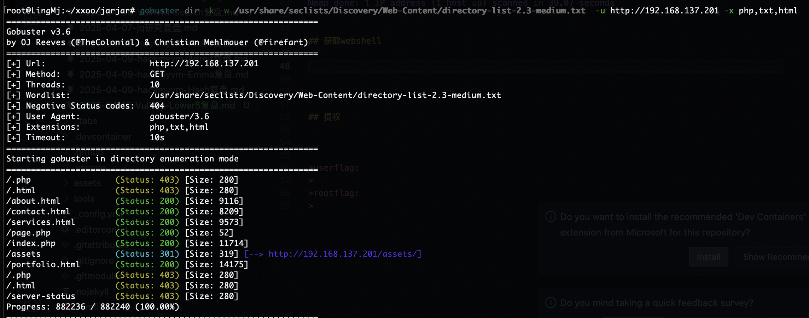  

>爆破ssh失败和尝试wfuzz没有东西看来洞藏起来了
>

  

>看起来像cupp
>

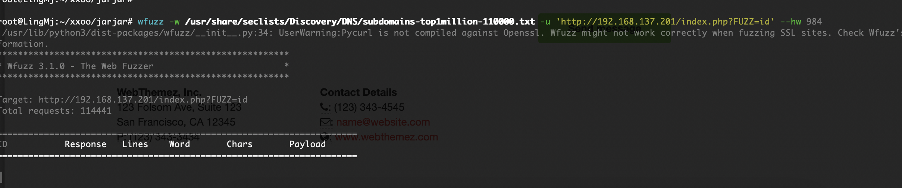  
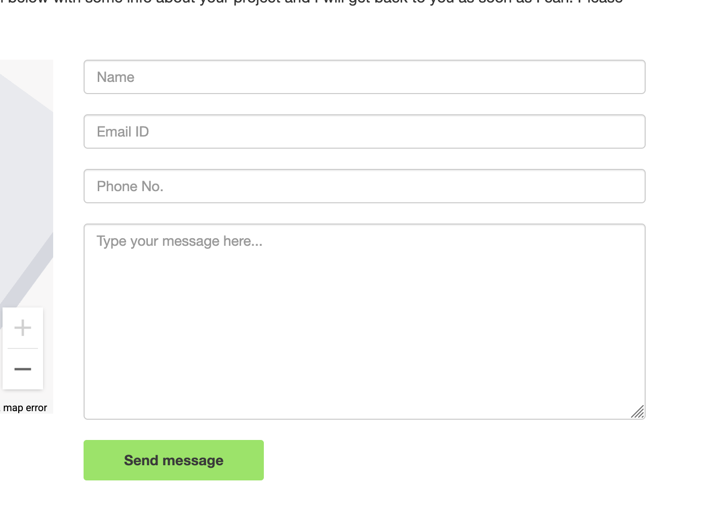  

>都没成功开始怀疑不在这里了,看看udp先
>

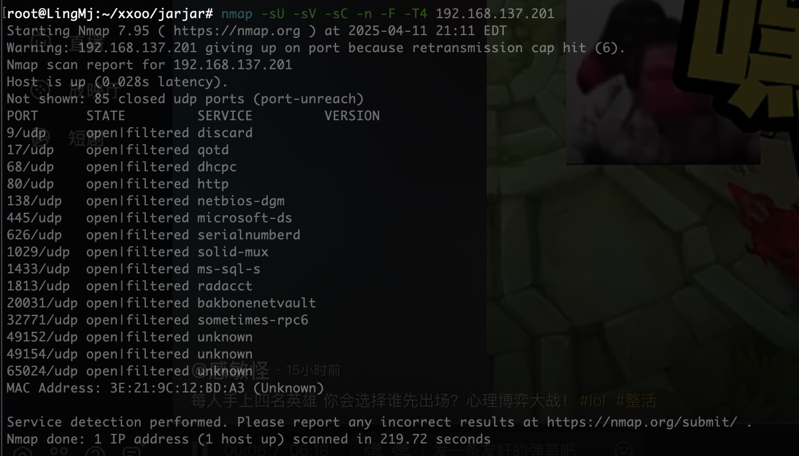  

>慢慢想慢慢找了,话说能自己访问自己么
>

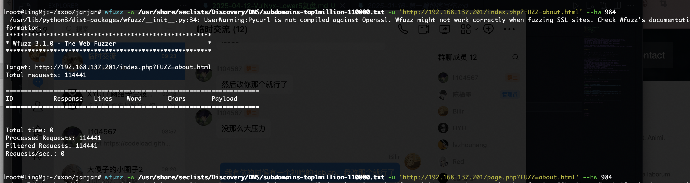  
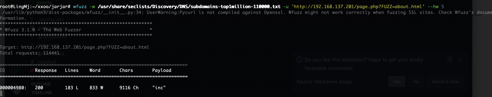  
  

>我发现个问题，原来打过这个东西
>

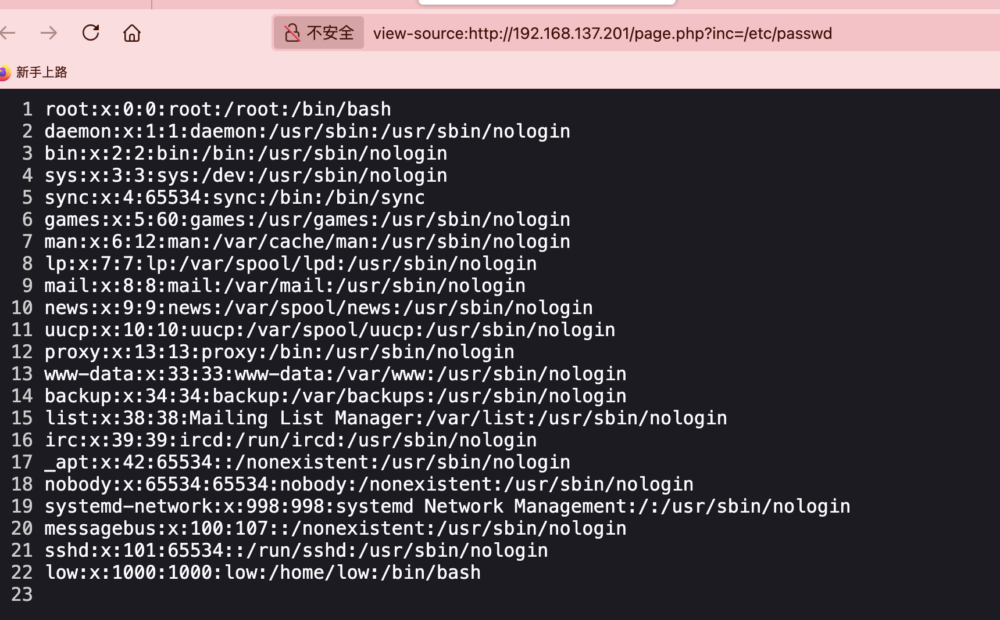  

>没见phpfilter直接利用,爆破ssh密码了
>

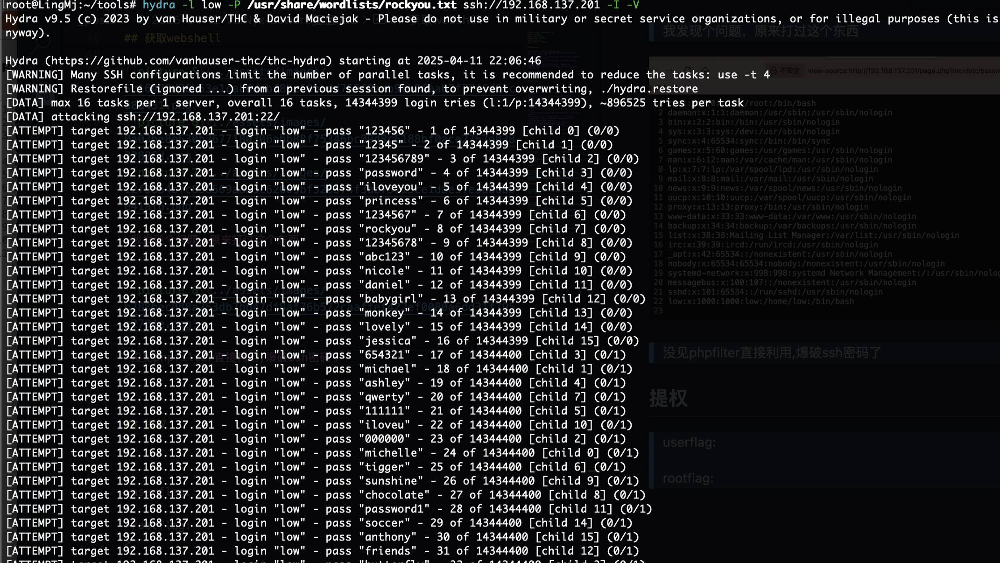  

>bp可读路径只有/etc/passwd
>

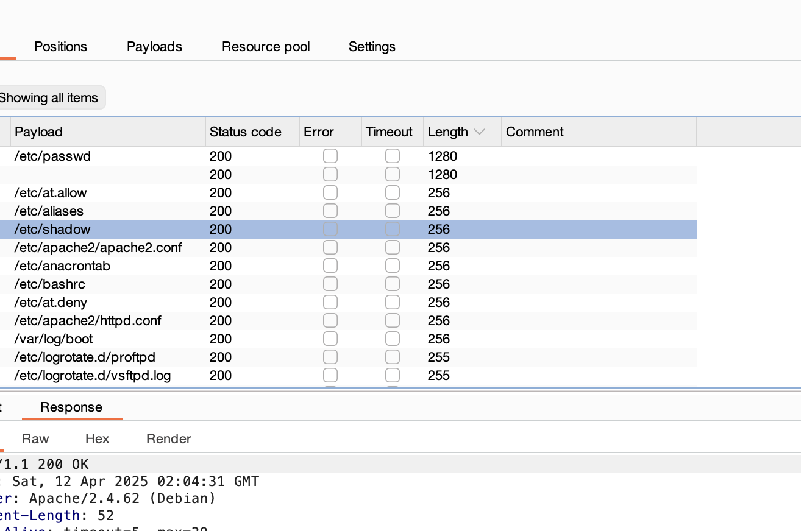  

>还没爆出密码我开始怀疑这条路了
>

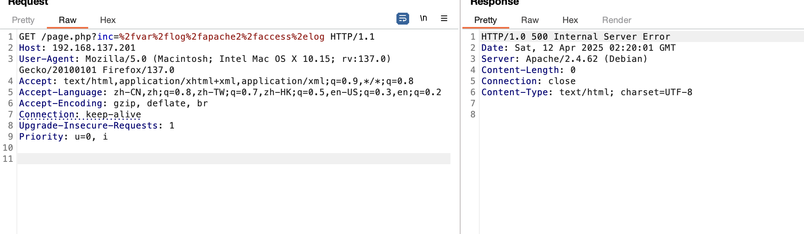  

>这个是500，难道靶机出bug了？
>

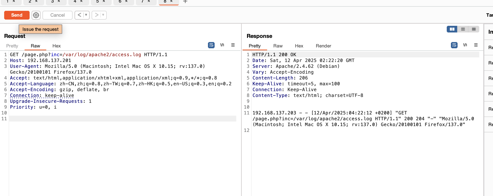  

>重启一下好了，又是日志注入，看来
>

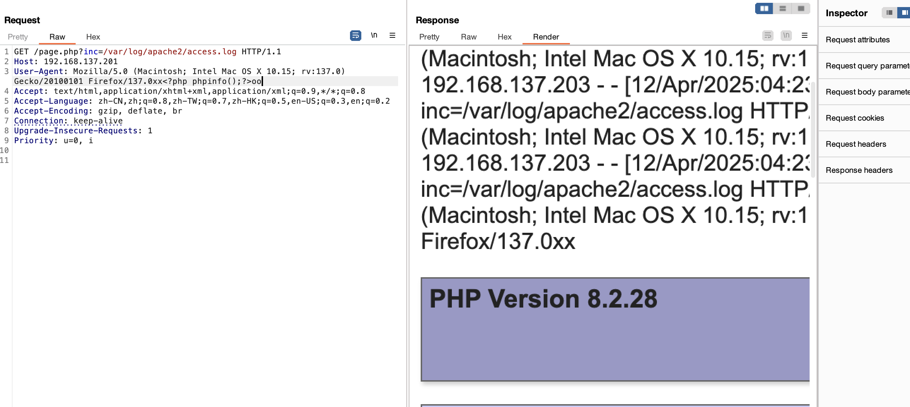  

>注入成功了
>

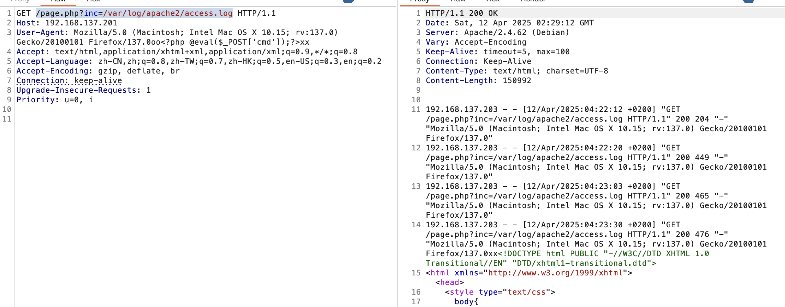  

>命令执行就失败，好奇怪啊,好了又死了这个服务
>

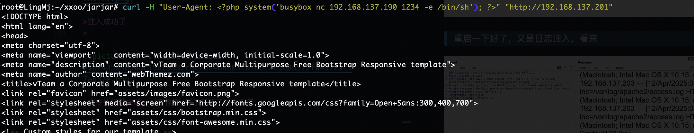  

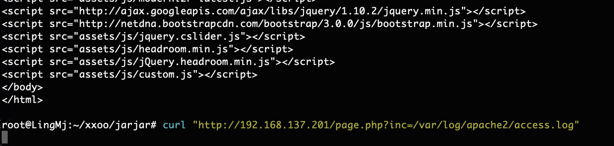  
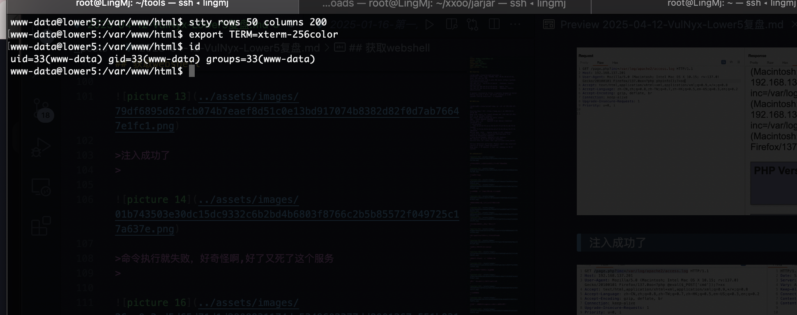  

>搞了半天这样才成功去看了wp，忘记咋使用这个log注入了
>

## 提权

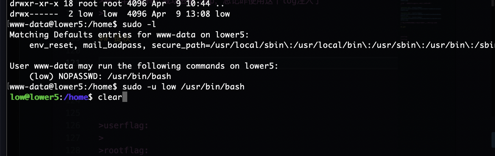  

 1](../assets/images/5c126f9ca72daee4f0370d6b557a1e34230fea7ee1cafa17e92dce87026919fb.png)  


```
low@lower5:~$ sudo -u root /usr/bin/pass --help
============================================
= pass: the standard unix password manager =
=                                          =
=                  v1.7.4                  =
=                                          =
=             Jason A. Donenfeld           =
=               Jason@zx2c4.com            =
=                                          =
=      http://www.passwordstore.org/       =
============================================

Usage:
    pass init [--path=subfolder,-p subfolder] gpg-id...
        Initialize new password storage and use gpg-id for encryption.
        Selectively reencrypt existing passwords using new gpg-id.
    pass [ls] [subfolder]
        List passwords.
    pass find pass-names...
    	List passwords that match pass-names.
    pass [show] [--clip[=line-number],-c[line-number]] pass-name
        Show existing password and optionally put it on the clipboard.
        If put on the clipboard, it will be cleared in 45 seconds.
    pass grep [GREPOPTIONS] search-string
        Search for password files containing search-string when decrypted.
    pass insert [--echo,-e | --multiline,-m] [--force,-f] pass-name
        Insert new password. Optionally, echo the password back to the console
        during entry. Or, optionally, the entry may be multiline. Prompt before
        overwriting existing password unless forced.
    pass edit pass-name
        Insert a new password or edit an existing password using editor.
    pass generate [--no-symbols,-n] [--clip,-c] [--in-place,-i | --force,-f] pass-name [pass-length]
        Generate a new password of pass-length (or 25 if unspecified) with optionally no symbols.
        Optionally put it on the clipboard and clear board after 45 seconds.
        Prompt before overwriting existing password unless forced.
        Optionally replace only the first line of an existing file with a new password.
    pass rm [--recursive,-r] [--force,-f] pass-name
        Remove existing password or directory, optionally forcefully.
    pass mv [--force,-f] old-path new-path
        Renames or moves old-path to new-path, optionally forcefully, selectively reencrypting.
    pass cp [--force,-f] old-path new-path
        Copies old-path to new-path, optionally forcefully, selectively reencrypting.
    pass git git-command-args...
        If the password store is a git repository, execute a git command
        specified by git-command-args.
    pass help
        Show this text.
    pass version
        Show version information.
```


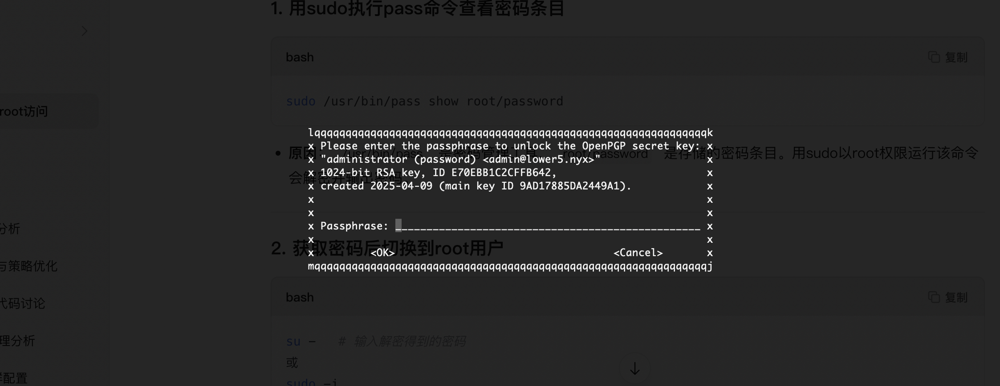  

>什么东西
>

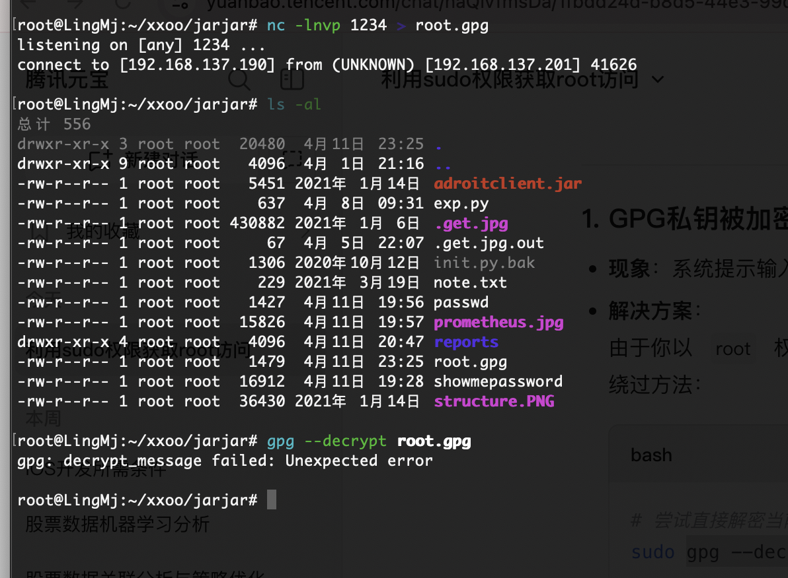  

>没解开
>

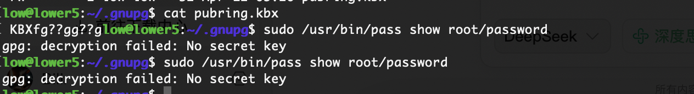  

>应该还有什么方式可以处理比如删除密码或者改密码
>

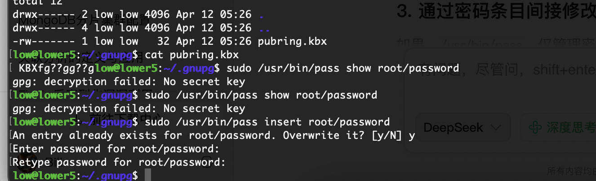  
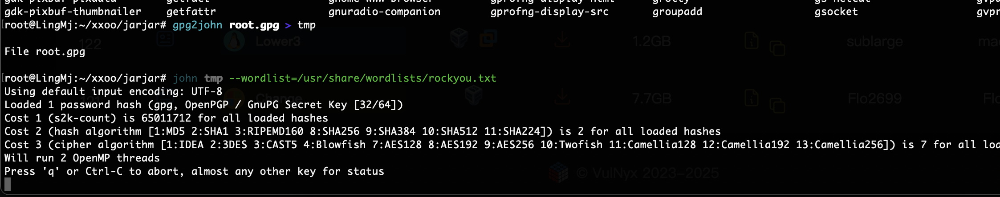  

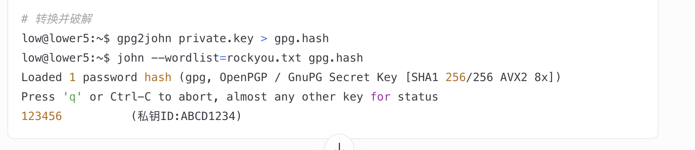  


>查一下发现这个
>

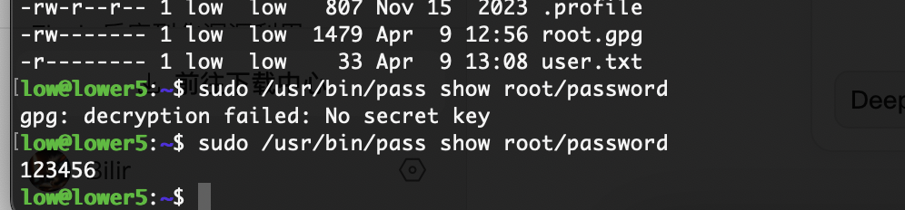  

>密码被我改了哈哈哈哈，没有root密码了重装了
>

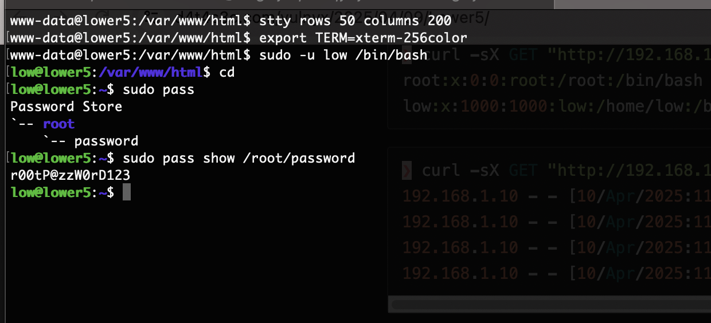  

>重装之后就完事了
>

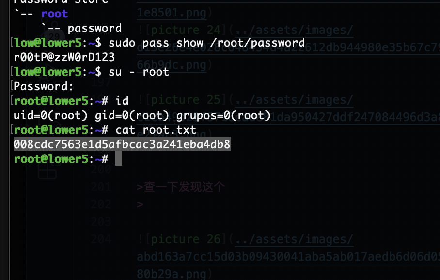  

>结束了顺便看一下完整wp看看有其他路线不
>

>userflag:30a7b18992fef054ca6d904769fac413
>
>rootflag:008cdc7563e1d5afbcac3a241eba4db8
>