## 网段扫描
```
root@LingMj:~# arp-scan -l
Interface: eth0, type: EN10MB, MAC: 00:0c:29:d1:27:55, IPv4: 192.168.137.190
Starting arp-scan 1.10.0 with 256 hosts (https://github.com/royhills/arp-scan)
192.168.137.1	3e:21:9c:12:bd:a3	(Unknown: locally administered)
192.168.137.107	3e:21:9c:12:bd:a3	(Unknown: locally administered)
192.168.137.55	62:2f:e8:e4:77:5d	(Unknown: locally administered)
192.168.137.135	a0:78:17:62:e5:0a	Apple, Inc.

9 packets received by filter, 0 packets dropped by kernel
Ending arp-scan 1.10.0: 256 hosts scanned in 1.990 seconds (128.64 hosts/sec). 4 responded
```

## 端口扫描

```
root@LingMj:~# nmap -p- -sV -sC 192.168.137.107 
Starting Nmap 7.95 ( https://nmap.org ) at 2025-04-25 03:46 EDT
Nmap scan report for Anjv.mshome.net (192.168.137.107)
Host is up (0.043s latency).
Not shown: 65533 closed tcp ports (reset)
PORT   STATE SERVICE VERSION
22/tcp open  ssh     OpenSSH 8.4p1 Debian 5+deb11u3 (protocol 2.0)
| ssh-hostkey: 
|   3072 f6:a3:b6:78:c4:62:af:44:bb:1a:a0:0c:08:6b:98:f7 (RSA)
|   256 bb:e8:a2:31:d4:05:a9:c9:31:ff:62:f6:32:84:21:9d (ECDSA)
|_  256 3b:ae:34:64:4f:a5:75:b9:4a:b9:81:f9:89:76:99:eb (ED25519)
80/tcp open  http    Apache httpd 2.4.62 ((Debian))
|_http-title: \xF0\x9F\x9B\xA1\xEF\xB8\x8F ULTRA SECURITY SCANNER v12.7
|_http-server-header: Apache/2.4.62 (Debian)
MAC Address: 3E:21:9C:12:BD:A3 (Unknown)
Service Info: OS: Linux; CPE: cpe:/o:linux:linux_kernel

Service detection performed. Please report any incorrect results at https://nmap.org/submit/ .
Nmap done: 1 IP address (1 host up) scanned in 17.95 seconds
```

## 获取webshell
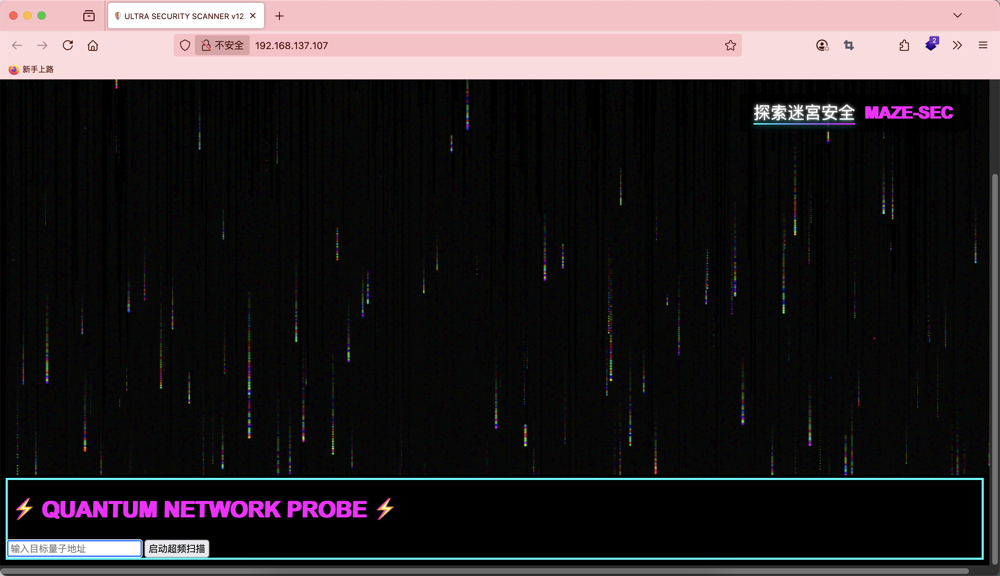  
  
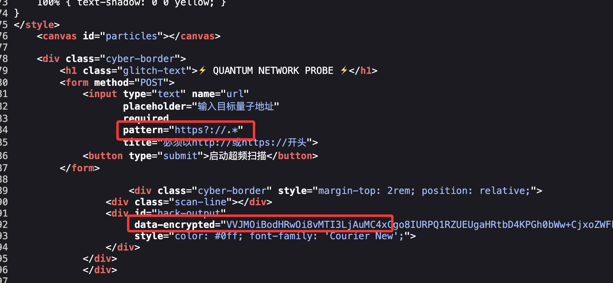  

>逻辑是前面这个既可以http://也可以是https://，我测试了一下直接get我们自己，但是没有无法进行文件书写，只能读取文件才行尝试files
>

  
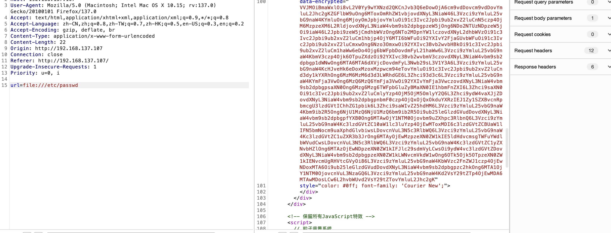  
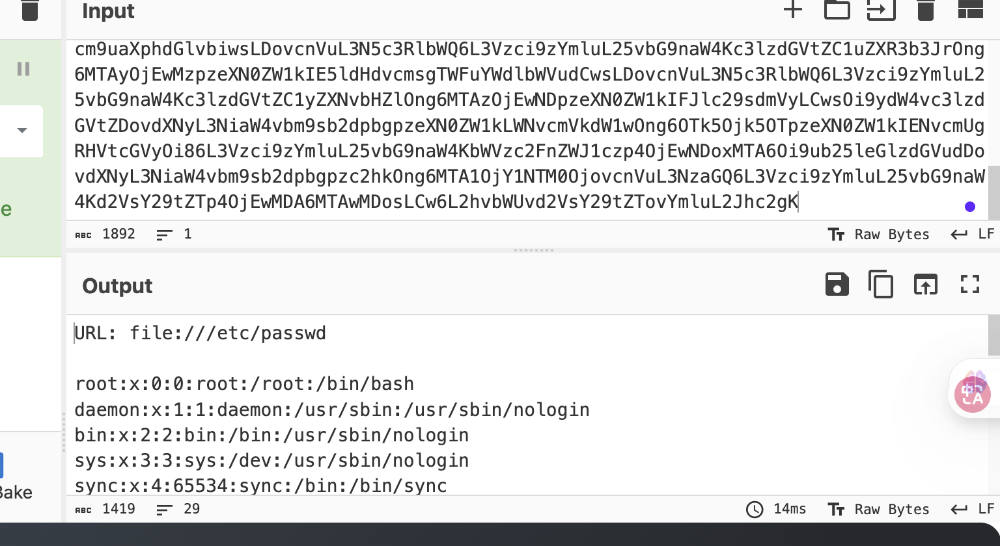  

>尝试读取用户信息
>

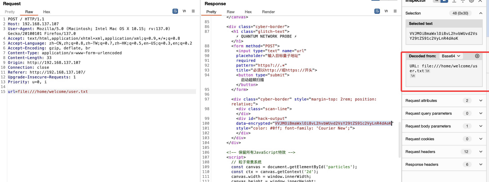  
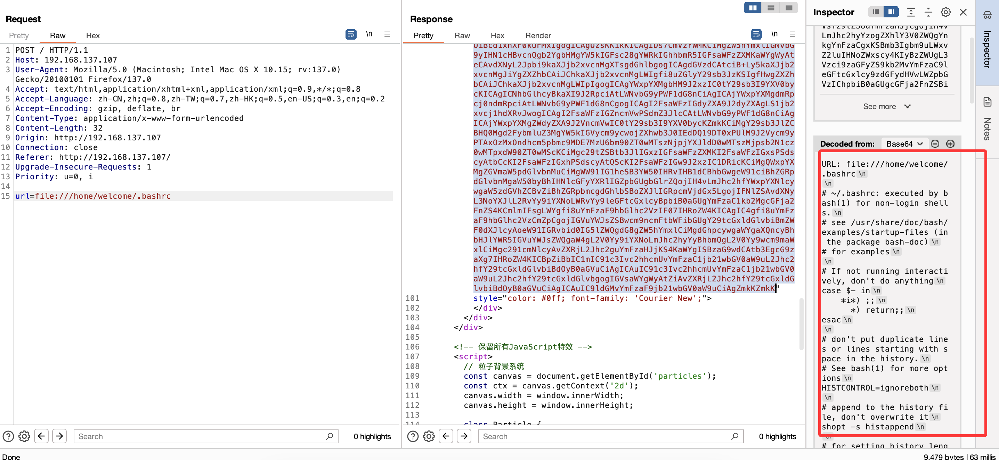  

>读私钥了
>

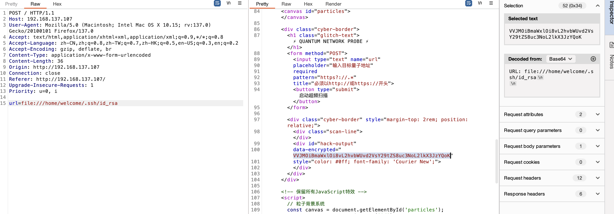  

>没有么
>

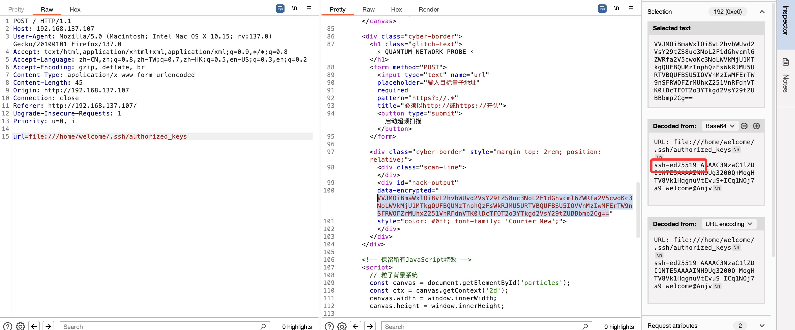  
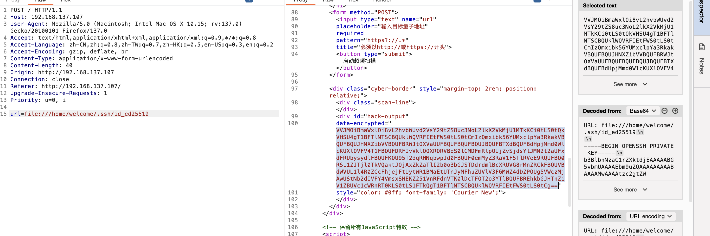  

>OK结束了
>


## 提权
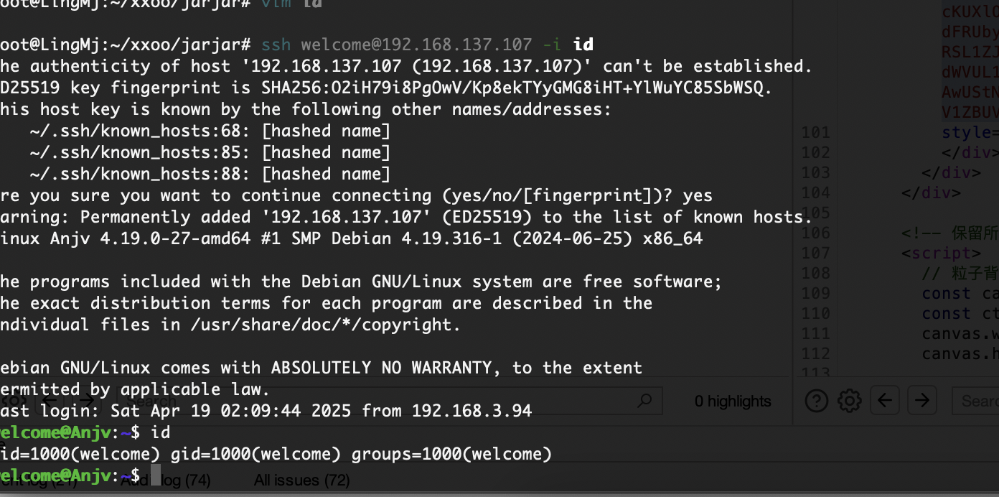  
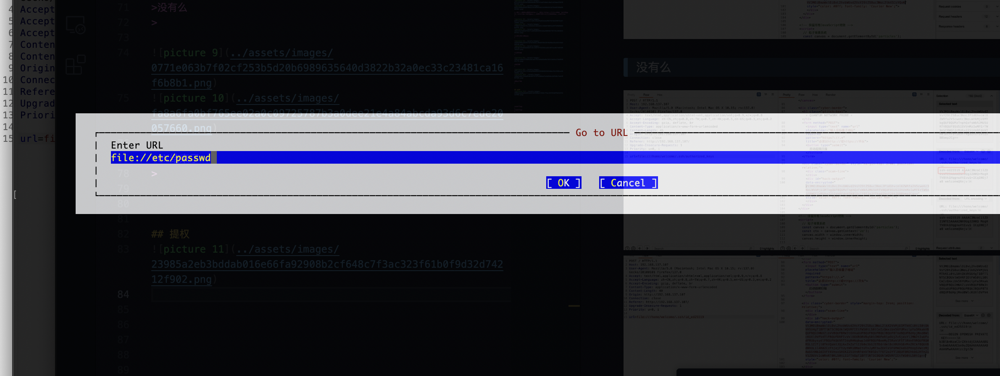  
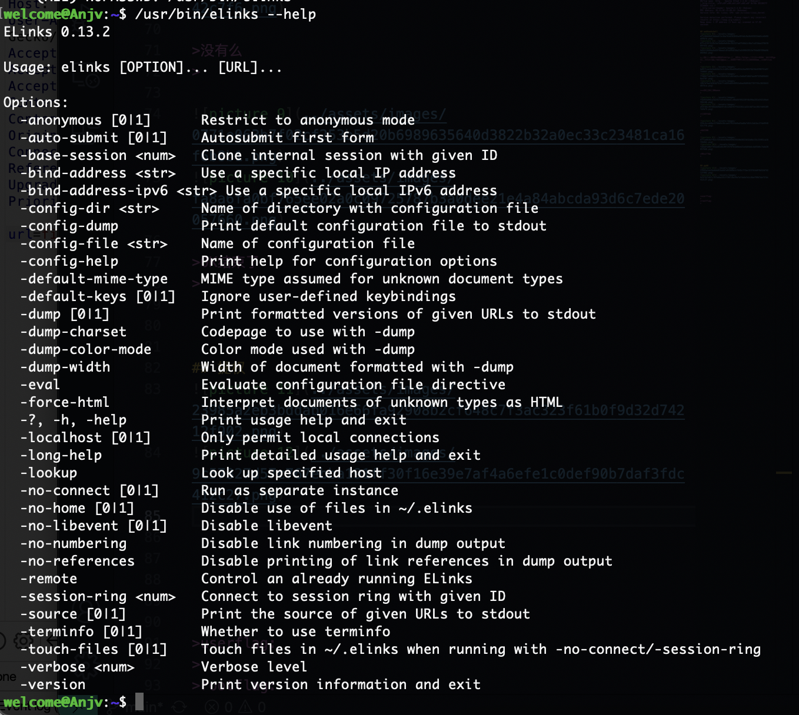  
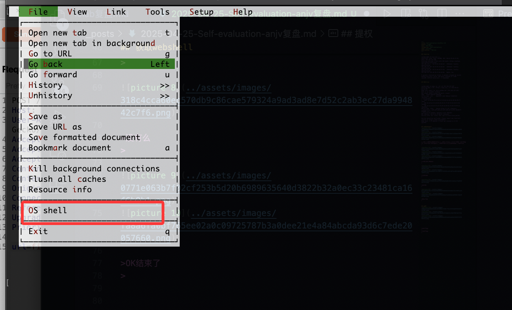  
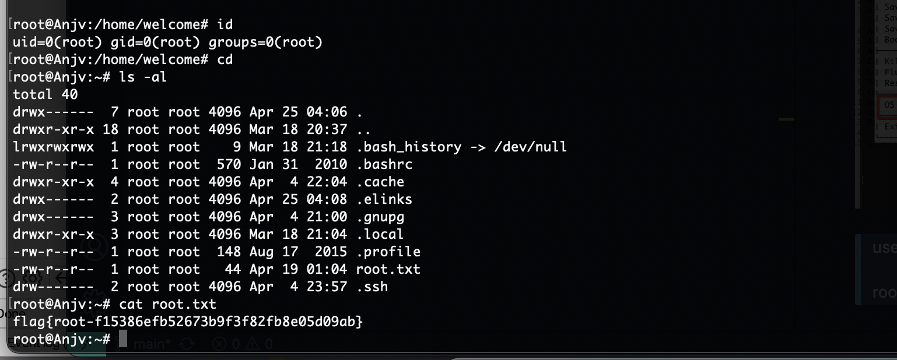  

>我好像打过这个东西之前就有这个问题一个vulnyx靶机，所以结束
>


>userflag:flag{user-f15386efb52673b9f3f82fb8e05d09ab}
>
>rootflag:flag{root-f15386efb52673b9f3f82fb8e05d09ab}
>