## 网段扫描
```
root@LingMj:~# arp-scan -l
Interface: eth0, type: EN10MB, MAC: 00:0c:29:d1:27:55, IPv4: 192.168.137.190
Starting arp-scan 1.10.0 with 256 hosts (https://github.com/royhills/arp-scan)
192.168.137.1	3e:21:9c:12:bd:a3	(Unknown: locally administered)
192.168.137.16	3e:21:9c:12:bd:a3	(Unknown: locally administered)
192.168.137.135	a0:78:17:62:e5:0a	Apple, Inc.

8 packets received by filter, 0 packets dropped by kernel
Ending arp-scan 1.10.0: 256 hosts scanned in 2.152 seconds (118.96 hosts/sec). 3 responded
```

## 端口扫描

```
root@LingMj:~# nmap -p- -sV -sC 192.168.137.16  
Starting Nmap 7.95 ( https://nmap.org ) at 2025-04-25 20:17 EDT
Nmap scan report for mathdop.mshome.net (192.168.137.16)
Host is up (0.026s latency).
Not shown: 65534 closed tcp ports (reset)
PORT   STATE SERVICE VERSION
22/tcp open  ssh     OpenSSH 7.4 (protocol 2.0)
| ssh-hostkey: 
|   2048 ac:78:16:74:49:a1:68:9d:54:84:8a:59:e9:38:10:bc (RSA)
|   256 06:0c:4d:9d:2c:32:43:d2:3d:f7:4f:82:c8:15:85:60 (ECDSA)
|_  256 3b:cd:fc:1f:dd:48:0f:ee:17:78:9a:f1:09:cb:8c:ec (ED25519)
MAC Address: 3E:21:9C:12:BD:A3 (Unknown)

Service detection performed. Please report any incorrect results at https://nmap.org/submit/ .

Nmap done: 1 IP address (1 host up) scanned in 327.56 seconds
root@LingMj:~# nmap -p- -sV -sC 192.168.137.16
Starting Nmap 7.95 ( https://nmap.org ) at 2025-04-25 20:25 EDT
Nmap scan report for mathdop.mshome.net (192.168.137.16)
Host is up (0.15s latency).

22/tcp   open  ssh     OpenSSH 7.4 (protocol 2.0)
| ssh-hostkey: 
|   2048 ac:78:16:74:49:a1:68:9d:54:84:8a:59:e9:38:10:bc (RSA)
|   256 06:0c:4d:9d:2c:32:43:d2:3d:f7:4f:82:c8:15:85:60 (ECDSA)
|_  256 3b:cd:fc:1f:dd:48:0f:ee:17:78:9a:f1:09:cb:8c:ec (ED25519)
7577/tcp open  http    Apache Tomcat (language: en)
| http-methods: 
|_  Potentially risky methods: PUT PATCH DELETE
| http-title: Site doesn't have a title (application/hal+json).
|_Requested resource was http://mathdop.mshome.net:7577/api
9393/tcp open  http    Apache Tomcat (language: en)
|_http-title: Site doesn't have a title (application/hal+json).
| http-methods: 
|_  Potentially risky methods: PUT PATCH DELETE
MAC Address: 3E:21:9C:12:BD:A3 (Unknown)

Service detection performed. Please report any incorrect results at https://nmap.org/submit/ .
Nmap done: 1 IP address (1 host up) scanned in 18.65 seconds
```

## 获取webshell

>发个mathdop的解法目前wp不出意外全身brute走的哈哈哈哈哈，发个标准解数学题的解法，题目来自决策与预测书本原题，我就不翻书拍出来了，知道不是我瞎编就行。
>

>前面是docker开启根据自身电脑，因为我之前搞也是有时开有时慢
>

>docker开得真慢很有问题
>

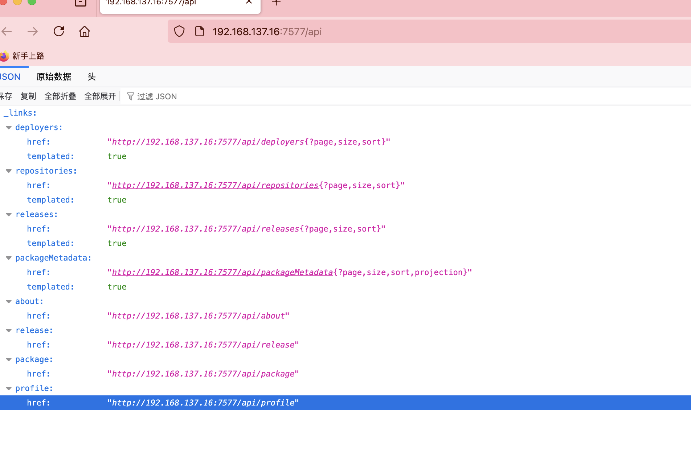  

>可以看到我们已经获取到api了，可以尝试进行一下漏洞利用
>

  

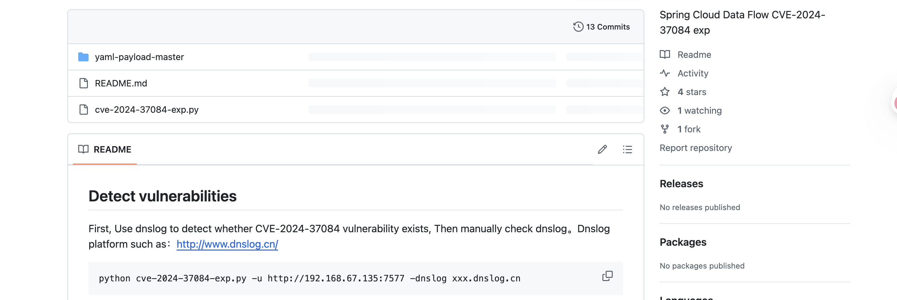  
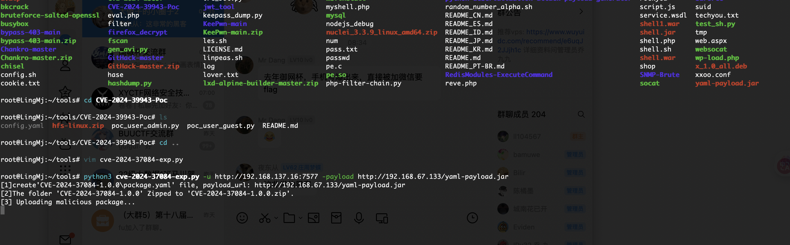  
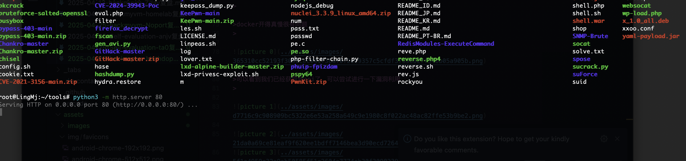  

>想偷懒直接用原来那个成功的不行没有其他特殊环境失败了
>
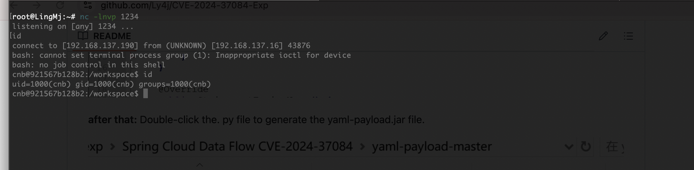  

>地址填错了，白重构了
>

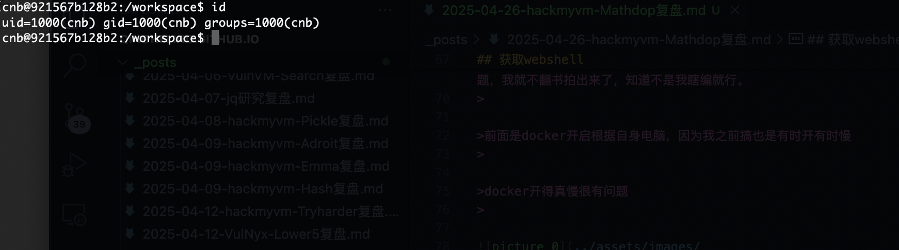  

>好了有点小不稳定
>


## 提权

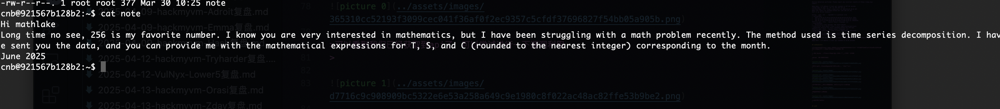  

>这个意思是email有个道数学题，解开是密码用户是mathlake
>

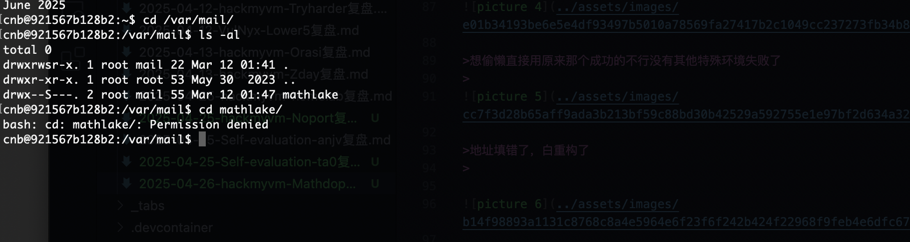  

>没权限先提权
>

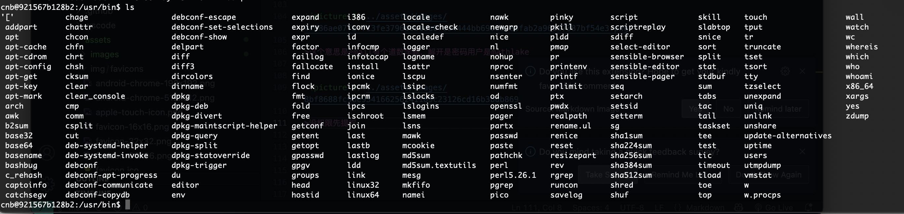  

>这里啥工具也没有，无法使用工具跑,这种情况我大概率复制粘贴linpeas.sh因为是脚本不乱码，不过我就不跑了local有提权
>

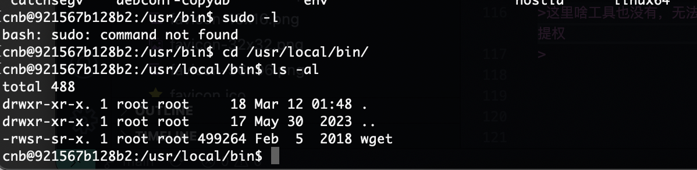  
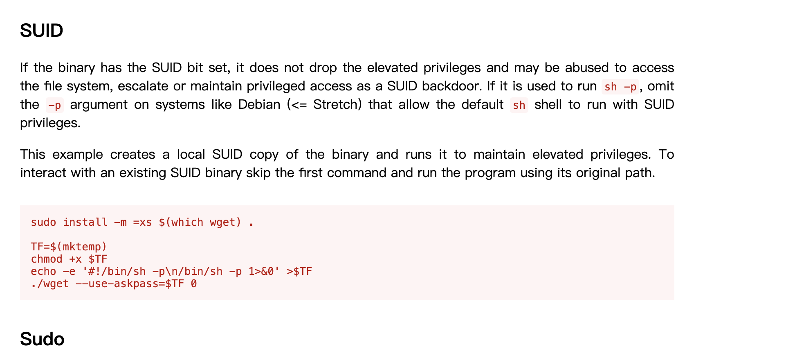  

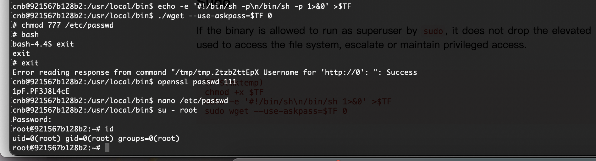  
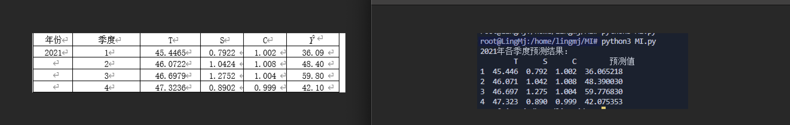  

>2个图片，主要是证明一下可以做出来奥一个是题目原图片一个是我当时做的
>

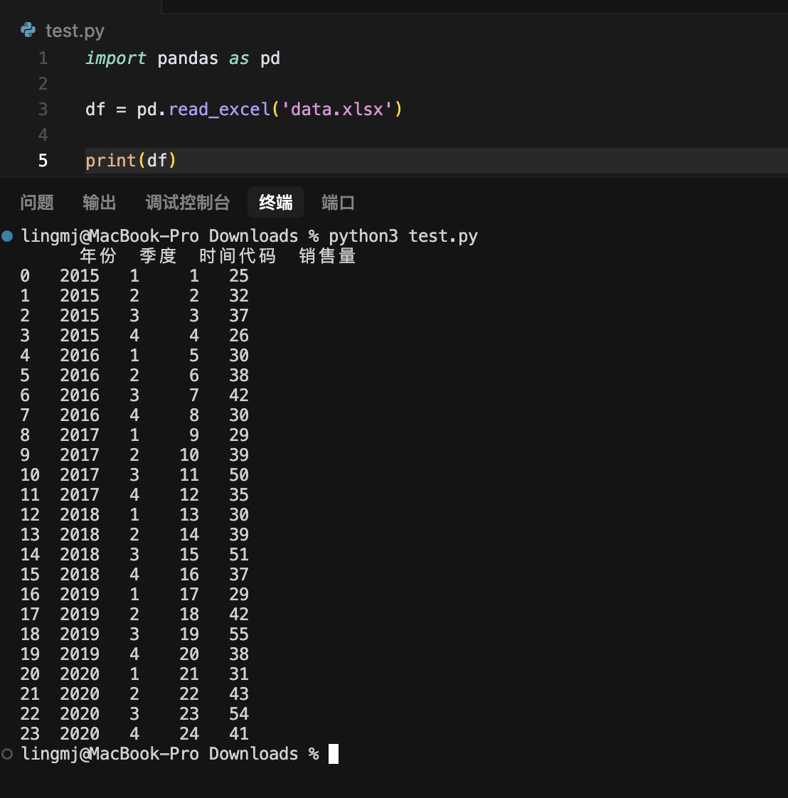  

>这台电脑没有安装excel，凑合着使用脚本做了
>

>先画散点图
>

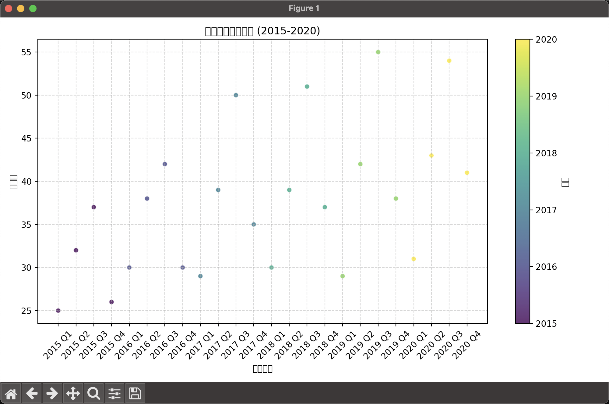  

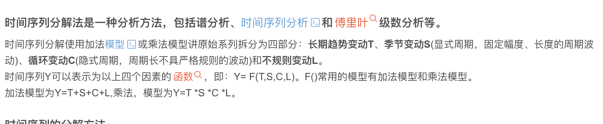  

>因为T是长期趋势我们可以看到它时存在线性上升趋势选择线性函数推算
>

```
X = df[['时间代码']] 
y = df['销售量']     

model = LinearRegression()

model.fit(X, y)

b0 = model.intercept_ 
b1 = model.coef_[0]

time_codes_2021 = [25, 26, 27, 28]

predictions_2021 = [b0 + b1 * tc for tc in time_codes_2021]

for i, value in enumerate(predictions_2021, start=1):
    print(f"2021 年第 {i} 季度预测销售量 (T值): {value:.4f}")
```

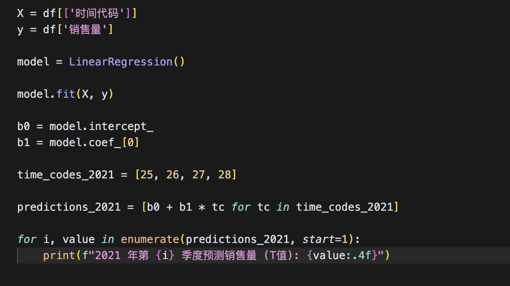  

>写了个线性回归的代码用于处理T的，
>

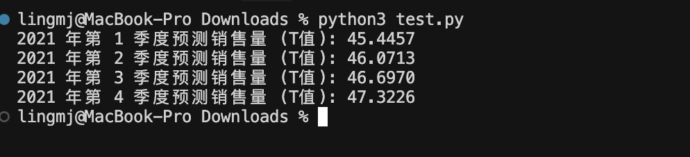  

>得到的答案去对比true的值发现成功拟合，这个时候我就可以简单算一下T在2025年的值时间代码时1开始所以我们只用算2025年6月的时间代码，所以时间代码应该是42
>

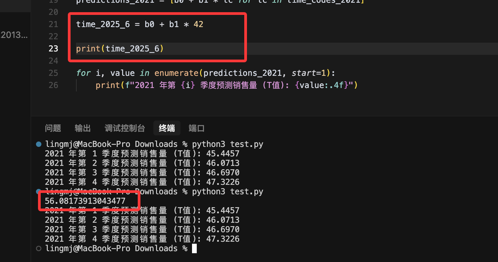  

>此时我们得到T的值为56.0817，题目取整为56
>

>接下来算一下S的值，S是季节的平均移动这个直接使用机器学习包即可算出这个不用特地去处理数据
>

```
df = pd.read_excel('data.xlsx')


df['年份'] = df['年份'].ffill() 
df['时间代码'] = df['时间代码'].astype(int)
df['日期'] = pd.to_datetime(df['年份'].astype(int).astype(str) + '-' + df['季度'].astype(int).astype(str) + '-1', format='%Y-%m-%d')
df.set_index('日期', inplace=True)

sales_series = df['销售量']

decomposition = seasonal_decompose(sales_series, model='multiplicative', period=4)
seasonal = decomposition.seasonal.dropna() 

seasonal_values = seasonal.values[:4] 

for i, value in enumerate(seasonal_values, start=1):
    print(f"2021 年第 {i} 季度预测销售量 (S值): {value:.4f}")
```

>这个是对应的代码
>

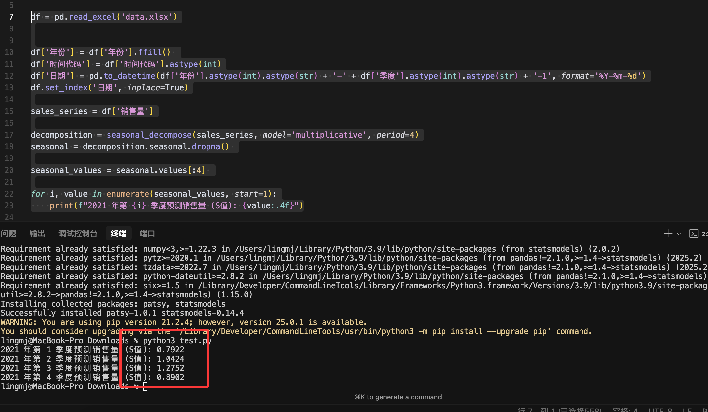  

>得到的数值进行true图片比对，是一致说明上面的代码可以计算出对应的答案，现在主要问题是C的值（原设计没有C因为这个我算都很难前面两个的代码都很轻松）由于将答案变成正数所以我就将C加回来
>

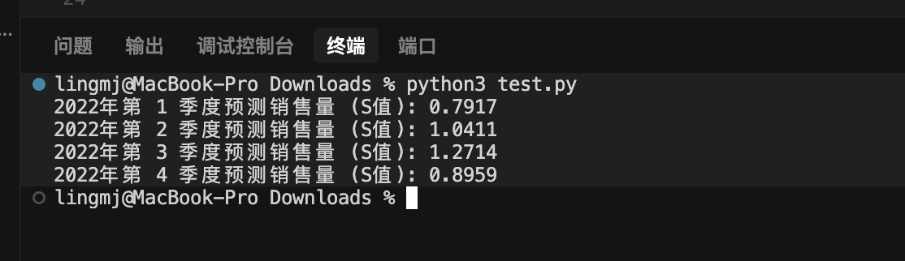  

>我们要把S算出来需要将值不断更新才行,我先换一下设备先这个设备很不支持
>

>现在开始算一下C的值不断补充完成剩下的操作
>

```
fore_averages = []

for i in range(3,len(df)):
    average = (df['销售量'][i-3] + df['销售量'][i-2] + df['销售量'][i-1] + df['销售量'][i])/4
    fore_averages.append(average)

df['四项居中平均'] = [None] * 2 + fore_averages + [None]

averages = []

for i in range(2,len(df)-2):
    averag = (df['四项居中平均'][i] + df['四项居中平均'][i+1])/2
    averages.append(averag)

df['居中平均'] = [None] * 2 + averages + [None] + [None]

X = df[['时间代码']] 
y = df['销售量']     

model = LinearRegression()

model.fit(X, y)

b0 = model.intercept_ 
b1 = model.coef_[0]   

predictions_T = [b0 + b1 * tc for tc in range(3, len(df['时间代码'])+1)]

prediction_T = []

for i, value in enumerate(predictions_T, start=1):
    prediction_T.append(round(value, 4))    

df['T'] = [None] * 2 + prediction_T


predictions_C = []

for i in range(2, len(df['T'])):
    prediction_C = (df['居中平均'][i]/df['T'][i])
    predictions_C.append(round(prediction_C, 4))

df['C'] = [None] * 2 + predictions_C

with pd.ExcelWriter(file_path, engine='openpyxl', mode='a', if_sheet_exists='replace') as writer:
    df.to_excel(writer, sheet_name='Sheet1', index=False)
```

>这样创造你的原来数据表即可多出对应的C值，C值按季节平均即可为C的预测值
>

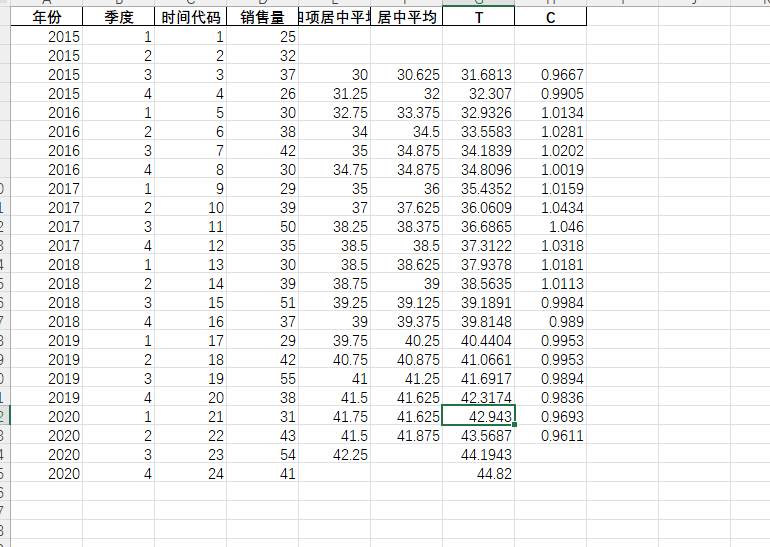  
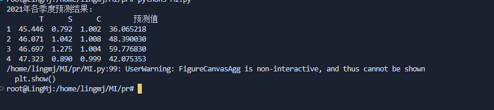  

>这样即可算出C的答案现在要做的是对比C值，可以看到也是一致的
>

>接着补充数据值完成下一个操作
>

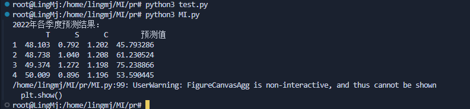  
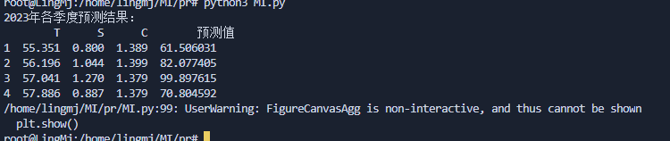  

>当时不严谨了哈哈哈哈，题目答案计算错误了
>

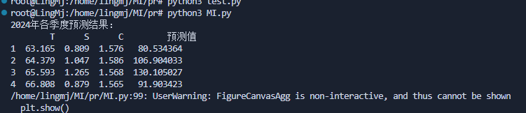  

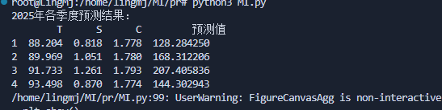  

>最后应该是90*1*2的sha256值才对，不过错误了我原来以为直接可以预测所以答案为56*1*1的值，出题不严谨了
>

>最后拿着56*1*1的sha256登录mathdop，里面提权是个脚本可以使用base64的date -f 读取任意文件，没留下root.txt,读取shadow可以获取密码值得等待结束这个靶机
>

>userflag:
>
>rootflag:
>