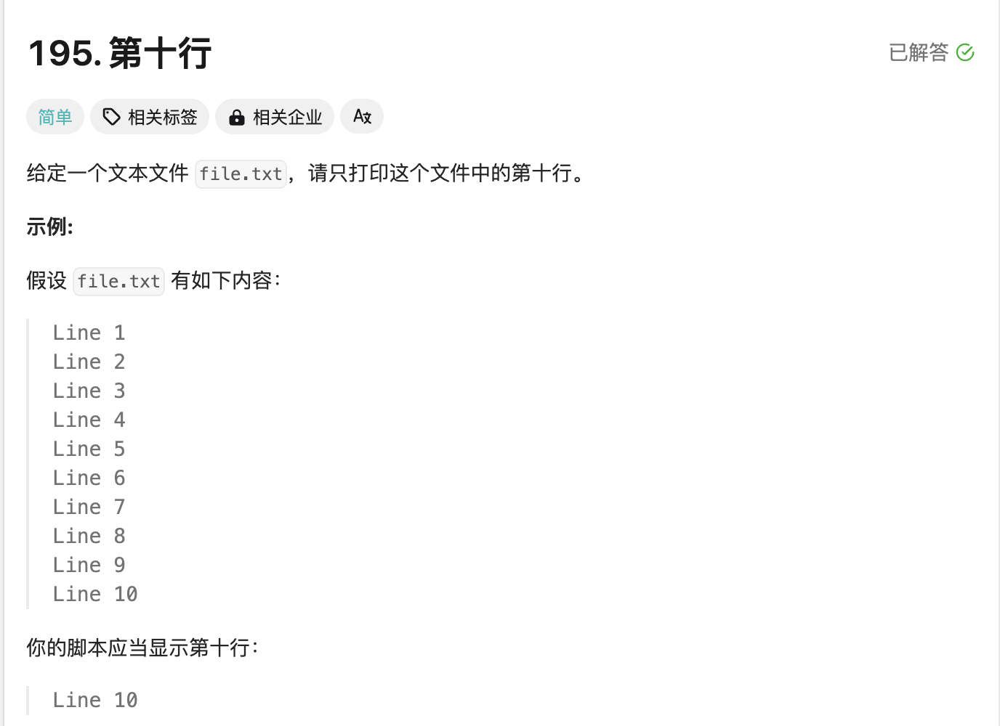
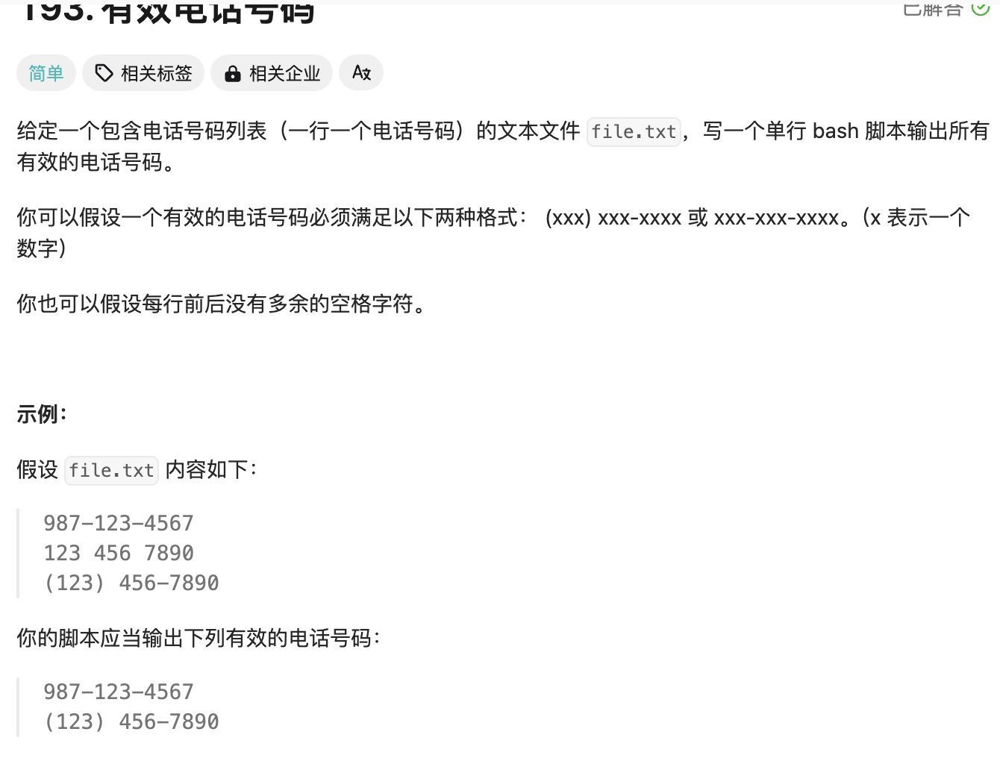
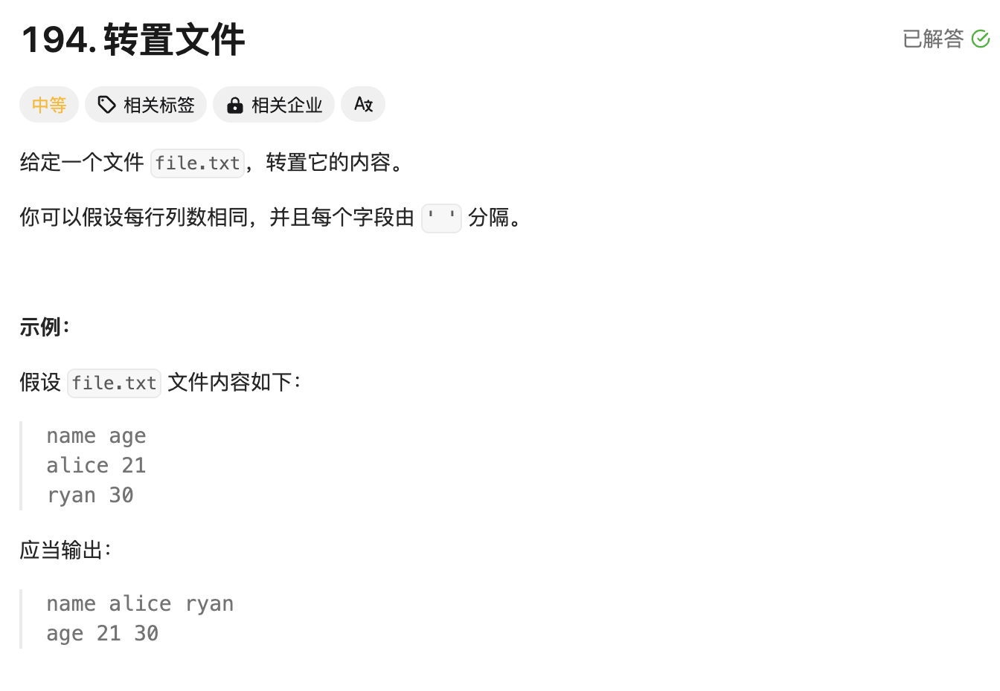
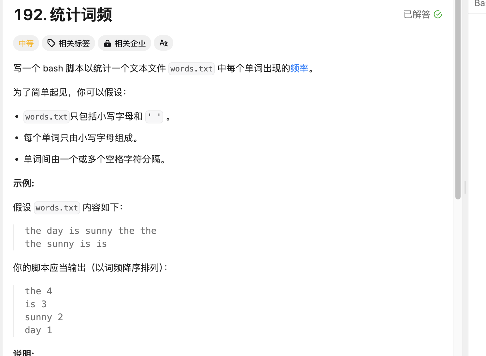

## LeetCode题目练习

>尝试一下LeetCode的shell题目，正常普通一共四道题，我做了一下感觉不如群主出的题目有意思不过练习一下还行，我的方式很普通所以你有好的点子或者你的方法优雅可以联系我，我很愿意接受知识，哈哈哈
>

## 题目一

  

>这里我一看直接head加tail即可，但是这个题目埋了一个位置是不满足10算最后一个所以我将方法直接使用为sed,同样awk也是可以完成的
>

```
sed -n '10p' file.txt||sed -n '$p' file.txt
awk 'NR==10{print;exit}END{if(!NR)print}' file.txt
```

## 题目二

  

>这个我一开始就使用了grep的笨方法但是我记得可以进行统一部分不动异或动形式但是没通过
>

```
grep -E '^([0-9]{3}-[0-9]{3}-[0-9]{4}|\([0-9]{3}\) [0-9]{3}-[0-9]{4})$' file.txt
grep -P '^([0-9]{3}-|\([0-9]{3}\) )?[0-9]{3}-[0-9]{4}$' file.txt
awk '/^[0-9]{3}-[0-9]{3}-[0-9]{4}$|^\([0-9]{3}\) [0-9]{3}-[0-9]{4}$/' file.txt
```

## 题目三

  

>这个我真没啥思路，看了gtp思路是awk加for，当然我觉得不优雅而且肯定有更好方案，不过我不会，希望有大佬提供方案
>

```
awk '{
    for(i=1; i<=NF; i++){
        a[i] = (a[i] ? a[i] " " $i : $i)
    }
} END {
    for(i=1; i<=NF; i++) print a[i]
}' file.txt
```

## 题目四

  

>这个的话先进行换行操作，让数据一行一个，然后去除空行，接着awk进行操作，sort -k2 nr进行按第二列降序,不过我觉得还有更好的方案，目前没想到希望有大佬给我来点操作
>

```
cat words.txt| tr ' ' '\n' | sed '/^$/d' | awk '{word[$1]++} END {for (i in word) print i, word[i]}' | sort -k2 -nr
```


>由于leetcode就四道shell题，所以这个文章到这里结束了
>

