## 地址获取

```
root@LingMj:~# arp-scan -l
Interface: eth0, type: EN10MB, MAC: 00:0c:29:d1:27:55, IPv4: 192.168.137.190
Starting arp-scan 1.10.0 with 256 hosts (https://github.com/royhills/arp-scan)
192.168.137.1	3e:21:9c:12:bd:a3	(Unknown: locally administered)
192.168.137.135	a0:78:17:62:e5:0a	Apple, Inc.
192.168.137.195	3e:21:9c:12:bd:a3	(Unknown: locally administered)

6 packets received by filter, 0 packets dropped by kernel
Ending arp-scan 1.10.0: 256 hosts scanned in 2.157 seconds (118.68 hosts/sec). 3 responded
```

## 端口扫描

```
root@LingMj:~# nmap -p- -sV -sC 192.168.137.195 
Starting Nmap 7.95 ( https://nmap.org ) at 2025-04-27 04:26 EDT
Nmap scan report for 192.168.137.195
Host is up (0.034s latency).
Not shown: 65532 closed tcp ports (reset)
PORT     STATE SERVICE                  VERSION
22/tcp   open  ssh                      OpenSSH 8.4p1 Debian 5+deb11u3 (protocol 2.0)
| ssh-hostkey: 
|   3072 f6:a3:b6:78:c4:62:af:44:bb:1a:a0:0c:08:6b:98:f7 (RSA)
|   256 bb:e8:a2:31:d4:05:a9:c9:31:ff:62:f6:32:84:21:9d (ECDSA)
|_  256 3b:ae:34:64:4f:a5:75:b9:4a:b9:81:f9:89:76:99:eb (ED25519)
80/tcp   open  http                     Apache httpd 2.4.62 ((Debian))
|_http-title: \xE5\xAE\x89\xE5\x85\xA8\xE9\xAA\x8C\xE8\xAF\x81\xE9\x97\xA8\xE6\x88\xB7 - \xE8\xBF\xB7\xE5\xAE\xAB\xE5\xAE\x89\xE5\x85\xA8\xE5\xAE\x9E\xE9\xAA\x8C\xE5\xAE\xA4
|_http-server-header: Apache/2.4.62 (Debian)
1883/tcp open  mosquitto version 2.0.11
| mqtt-subscribe: 
|   Topics and their most recent payloads: 
|     $SYS/broker/load/publish/received/15min: 0.48
|     $SYS/broker/load/bytes/sent/1min: 5.66
|     $SYS/broker/load/messages/sent/15min: 0.48
|     $SYS/broker/load/messages/received/1min: 4.25
|     $SYS/broker/publish/bytes/received: 352
|     $SYS/broker/store/messages/bytes: 200
|     $SYS/broker/version: mosquitto version 2.0.11
|     $SYS/broker/load/connections/1min: 1.42
|     $SYS/broker/clients/active: 1
|     $SYS/broker/load/sockets/1min: 2.33
|     $SYS/broker/messages/sent: 8
|     $SYS/broker/load/publish/received/1min: 1.42
|     $SYS/broker/bytes/received: 552
|     $SYS/broker/load/bytes/received/1min: 97.68
|     $SYS/broker/heap/current: 47504
|     $SYS/broker/load/messages/sent/5min: 1.05
|     $SYS/broker/load/messages/received/15min: 1.38
|     $SYS/broker/load/bytes/received/5min: 72.12
|     $SYS/broker/clients/disconnected: 0
|     $SYS/broker/load/bytes/sent/15min: 1.84
|     $SYS/broker/publish/messages/received: 8
|     config: Topic: chat
|     $SYS/broker/uptime: 261 seconds
|     $SYS/broker/clients/inactive: 0
|     $SYS/broker/load/sockets/15min: 0.53
|     $SYS/broker/load/connections/5min: 1.05
|     $SYS/broker/load/bytes/sent/5min: 4.18
|     $SYS/broker/load/messages/received/5min: 3.14
|     $SYS/broker/load/sockets/5min: 1.24
|     $SYS/broker/load/messages/sent/1min: 1.42
|     $SYS/broker/load/bytes/received/15min: 31.77
|     $SYS/broker/load/publish/received/5min: 1.05
|     $SYS/broker/clients/connected: 1
|     $SYS/broker/bytes/sent: 32
|     $SYS/broker/load/connections/15min: 0.48
|_    $SYS/broker/messages/received: 24
MAC Address: 3E:21:9C:12:BD:A3 (Unknown)
Service Info: OS: Linux; CPE: cpe:/o:linux:linux_kernel

Service detection performed. Please report any incorrect results at https://nmap.org/submit/ .
Nmap done: 1 IP address (1 host up) scanned in 49.97 seconds
```

## 提权

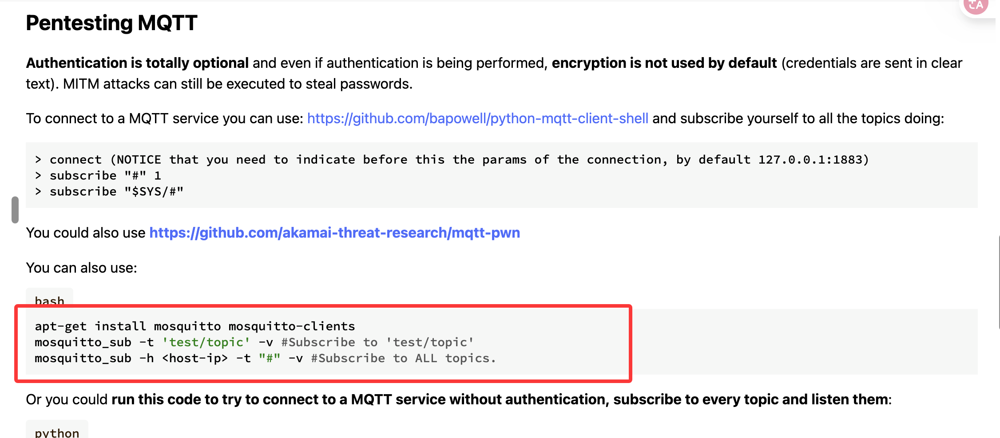  

>可以看看在这个端口发送什么信息
>

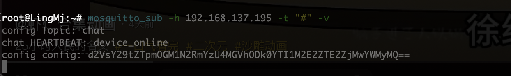  
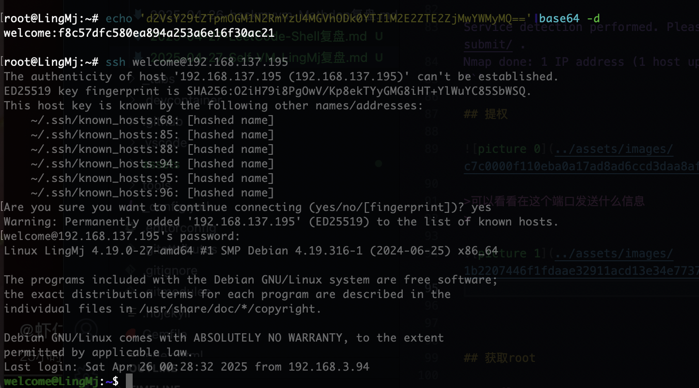  
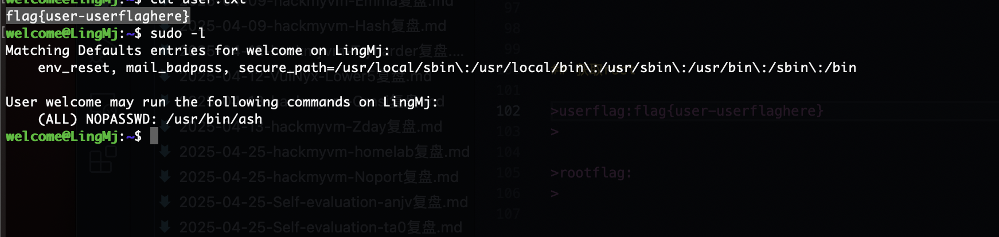  
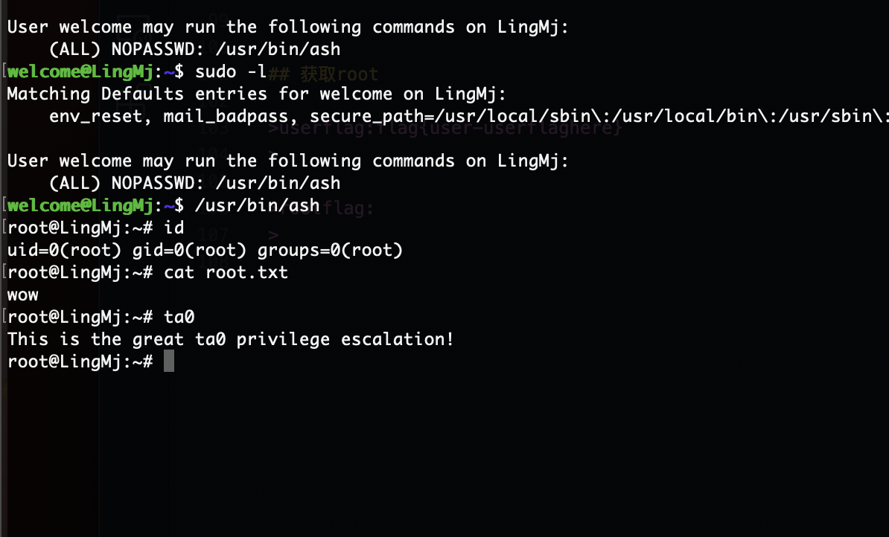  

>这个部分是彩蛋部分
>

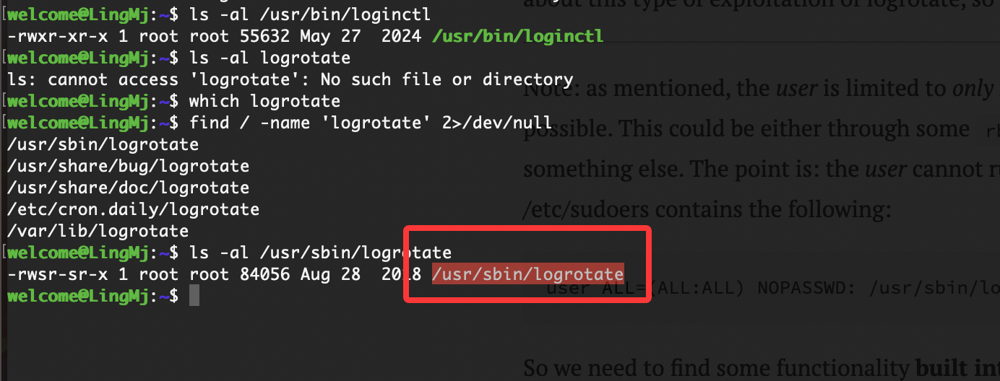  

>存在彩蛋，这个程序是存在suid所以能利用它执行root控制
>

```
welcome@LingMj:~$ /usr/sbin/logrotate --help
Usage: logrotate [OPTION...] <configfile>
  -d, --debug               Don't do anything, just test and print debug messages
  -f, --force               Force file rotation
  -m, --mail=command        Command to send mail (instead of `/usr/bin/mail')
  -s, --state=statefile     Path of state file
  -v, --verbose             Display messages during rotation
  -l, --log=logfile         Log file or 'syslog' to log to syslog
      --version             Display version information

Help options:
  -?, --help                Show this help message
      --usage               Display brief usage message
```


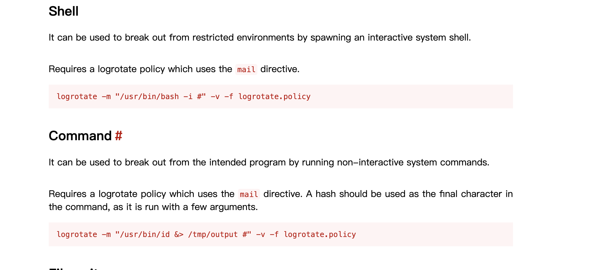  


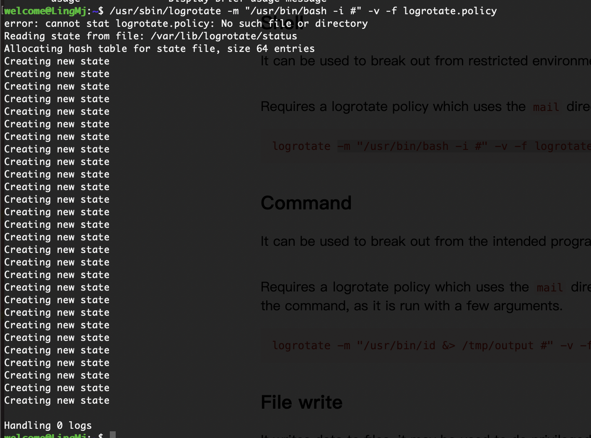  

>没成功
>

## 获取root

>这里才是方法，他会遍历目录文件
>

  
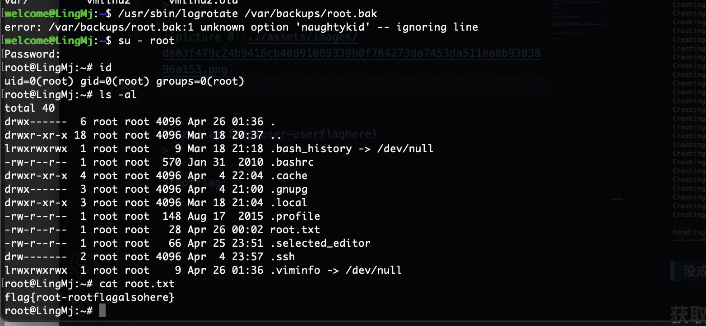  


>密码，不过差点，因为这个东西还是可以控制文件权限
>

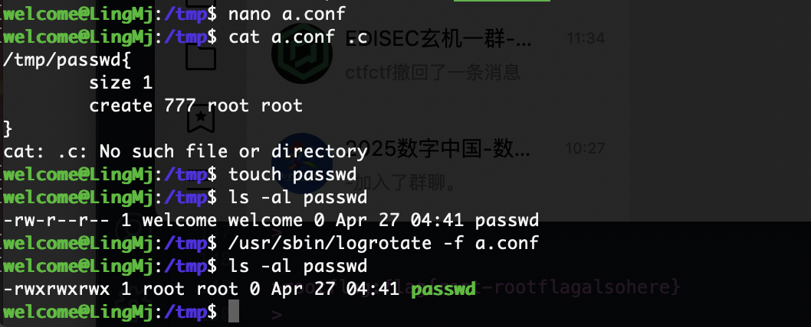  

>可以看到我们可以控制文化权限而且是否为root
>

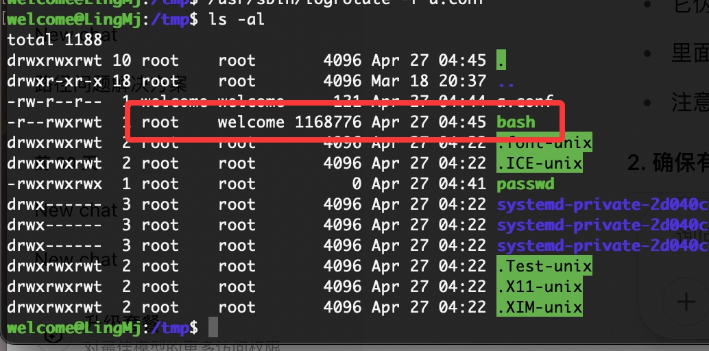  

>无法做到写入同时控制权限保证+s所以导致这个没成功哈哈哈，但是可以给passwd换成777，也可以控制sudo的ash
>

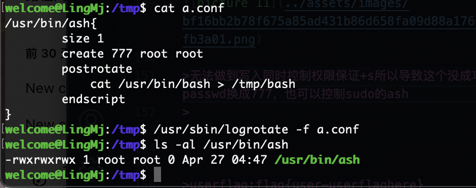  
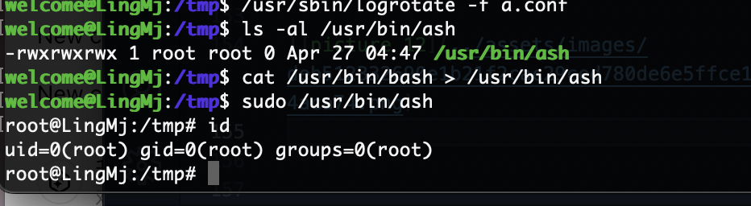  

>剩下就不用我做了因为都是这个方案
>


>userflag:flag{user-userflaghere}
>

>rootflag:flag{root-rootflagalsohere}
>
