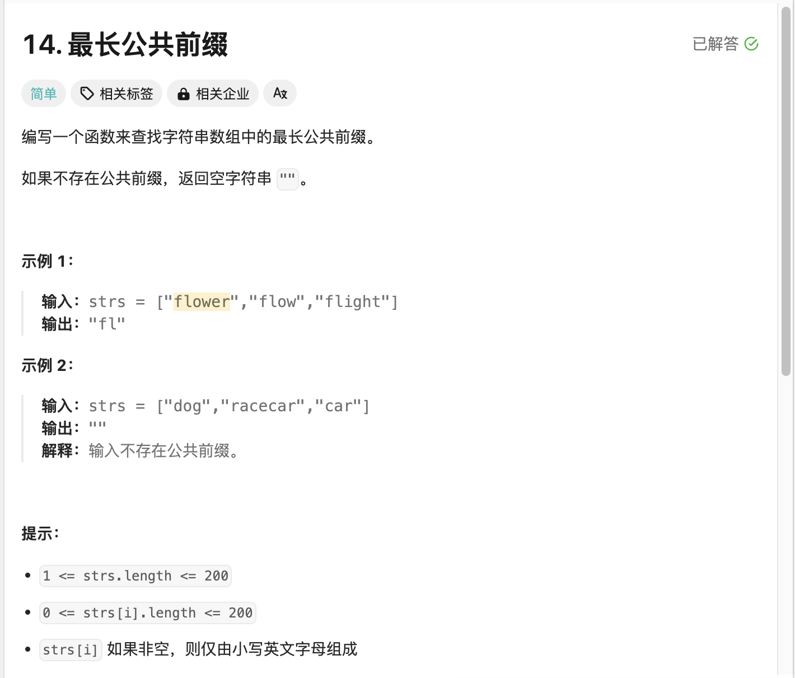
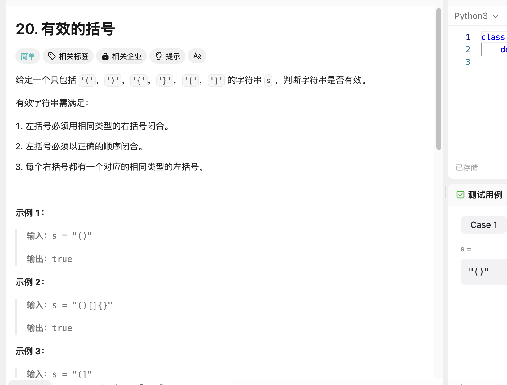
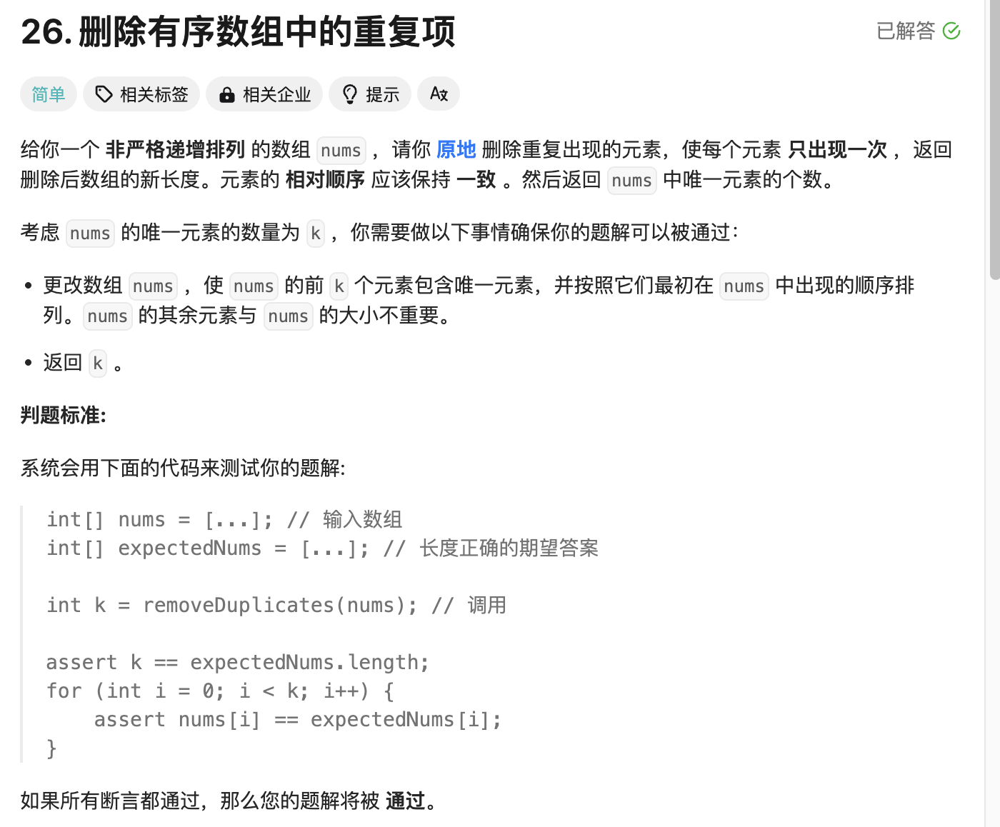
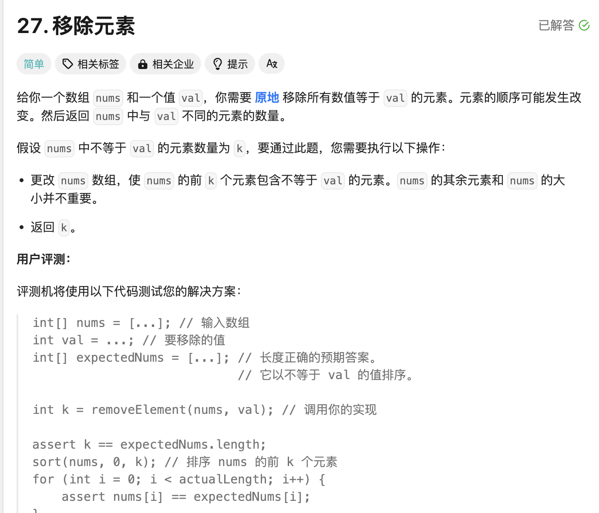

## 新开始学习算法在leetcode第一天

>开个模块学习一下算法让自己别老是依赖ai编程现在编程都没思路了从头开始刷题学习，控制每天只是3道题（虽然有点少），代码可能写得不好
>

## 第一题 最长公共前缀

  

>使用python代码进行操作提高写脚本能力
>

```
from typing import List

class Solution:
    def longestCommonPrefix(self, strs: List[str]) -> str:
        if not strs:
            return ""
        prefix = []
        for chars in zip(*strs):
            if len(set(chars)) == 1:
                prefix.append(chars[0])
            else:
                break
        return ''.join(prefix)
```

>解释一下代码，这个代码使用python内置函数zip让它进行元组分组判断是否唯一，这样如果等于1的时候代表符合前缀直接增加到数组输出
>

## 第二题 有效的括号

  

```
class Solution:
    def isValid(self, s: str) -> bool:
        stack = []
        mapping = {")":"(","]":"[","}":"{"}
        for char in s:
            if char in mapping.values():
                stack.append(char)
            elif char in mapping.keys():
                if not stack or stack.pop() != mapping[char]:
                    return False
            else:
                return False
        return not stack
```

>解释一下代码，先定义一个空栈，再定义对应的字典，循环数组，如果第一个字典的值为左括弧则加入空栈，进行下一个判断如果是字典的键右括弧，判断是否存在左括弧或者左括弧的值不是对应的键值则返回flase，如果都不满足false，最后返回栈是否为空，空是false，有值是true
>

## 第三题 删除有序数组中的重复项

  


```
class Solution:
    def removeDuplicates(self, nums: List[int]) -> int:
        if not nums:
            return 0
        slow = 1
        for i in range(1, len(nums)):
            if nums[i] != nums[i-1]:
                nums[slow] = nums[i]
                slow += 1
        return slow
```

>这里我用到慢指针移动去记录单一元素并且保存，先判断数组是否为空，设计慢指针为1用于继续移动，循环从1开始的数组，判断现在的数组值是否等于前一个如果不等于则把不同值进行依次覆盖，并进行指针移动
>

## 第四题 移除元素

  


```
class Solution:
    def removeElement(self, nums: List[int], val: int) -> int:
        slow = 0
        for fast in range(len(nums)):
            if nums[fast] != val:
                nums[slow] = nums[fast]
                slow += 1
        return slow   
```


>设计慢指针，使用循环快指针判断值是否等于val，如果等于将快指针的值赋值快指针，输出慢指针，慢指针移动
>


