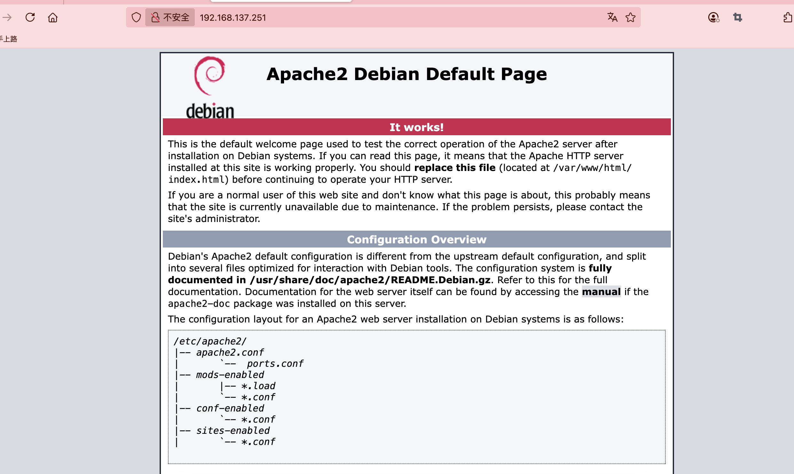
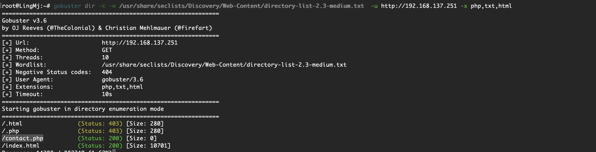
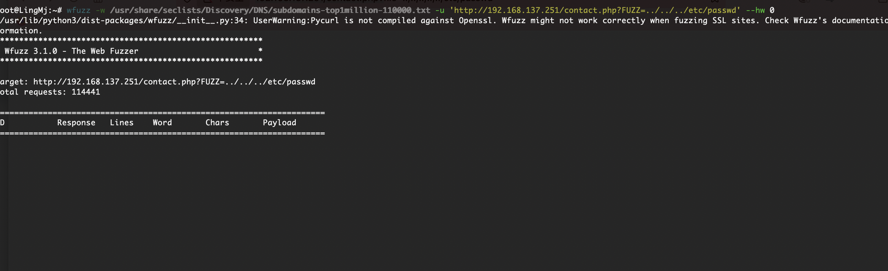
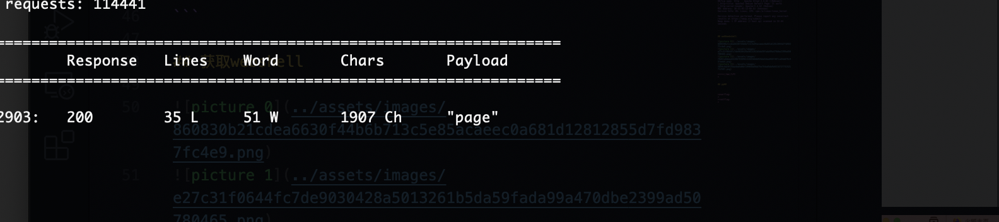
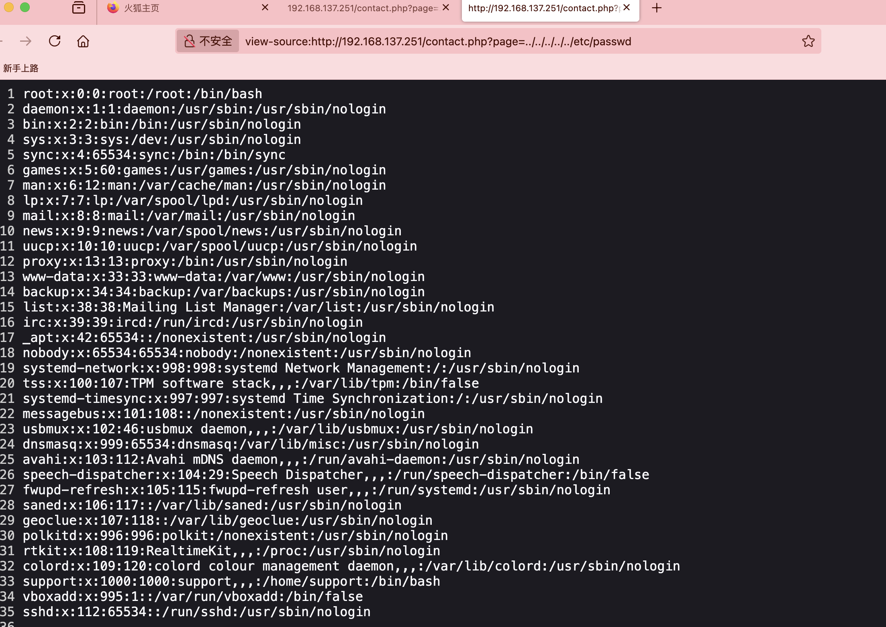
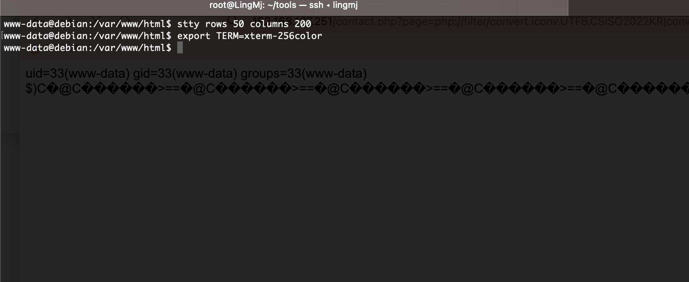
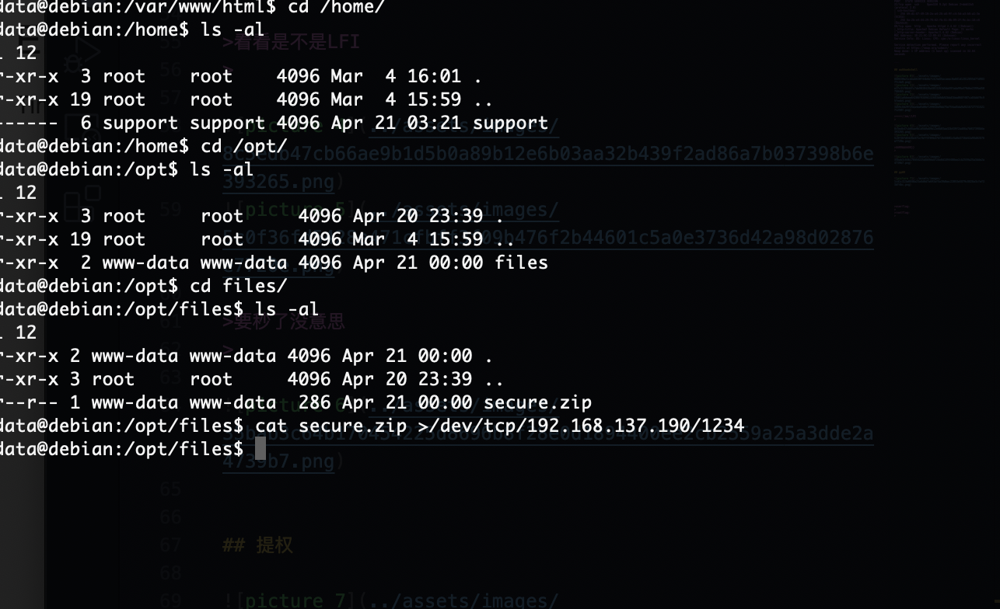
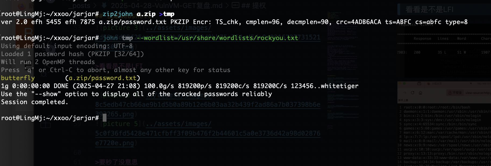
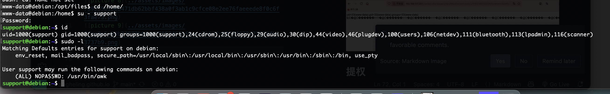
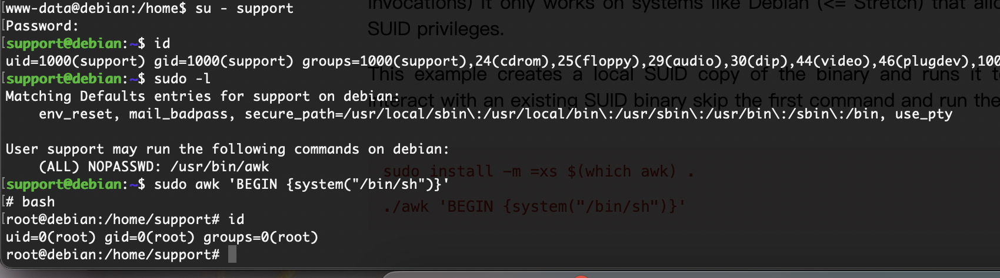

## 网段扫描
```
root@LingMj:~# arp-scan -l
Interface: eth0, type: EN10MB, MAC: 00:0c:29:d1:27:55, IPv4: 192.168.137.190
Starting arp-scan 1.10.0 with 256 hosts (https://github.com/royhills/arp-scan)
192.168.137.1	3e:21:9c:12:bd:a3	(Unknown: locally administered)
192.168.137.135	a0:78:17:62:e5:0a	Apple, Inc.
192.168.137.149	62:2f:e8:e4:77:5d	(Unknown: locally administered)
192.168.137.251	3e:21:9c:12:bd:a3	(Unknown: locally administered)

7 packets received by filter, 0 packets dropped by kernel
Ending arp-scan 1.10.0: 256 hosts scanned in 2.035 seconds (125.80 hosts/sec). 4 responded
```

## 端口扫描

```
root@LingMj:~# nmap -p- -sV -sC 192.168.137.251 
Starting Nmap 7.95 ( https://nmap.org ) at 2025-04-27 20:59 EDT
Nmap scan report for 192.168.137.251
Host is up (0.015s latency).
Not shown: 65533 closed tcp ports (reset)
PORT   STATE SERVICE VERSION
22/tcp open  ssh     OpenSSH 9.2p1 Debian 2+deb12u5 (protocol 2.0)
| ssh-hostkey: 
|   256 69:dc:67:49:10:2a:a4:26:a8:9f:c4:5d:a3:b8:a1:3e (ECDSA)
|_  256 6a:2b:e4:44:29:78:62:fb:61:0b:09:2f:9c:bc:18:c6 (ED25519)
80/tcp open  http    Apache httpd 2.4.62 ((Debian))
|_http-title: Apache2 Debian Default Page: It works
|_http-server-header: Apache/2.4.62 (Debian)
MAC Address: 3E:21:9C:12:BD:A3 (Unknown)
Service Info: OS: Linux; CPE: cpe:/o:linux:linux_kernel

Service detection performed. Please report any incorrect results at https://nmap.org/submit/ .
Nmap done: 1 IP address (1 host up) scanned in 32.64 seconds
                                                               
```

## 获取webshell

  
  
  
  

>看看是不是LFI
>

  
  

>要秒了没意思
>

  


## 提权

  
  
  
  
  

>10分钟靶机吧我用一下fuzz了，真水不如LingMj的靶机，哈哈哈哈哈哈哈哈哈哈
>


>userflag:e90bf53819288566309a9a2757ebaa5c
>
>rootflag:6cc1e28198647796d8b450542d1847ff
>