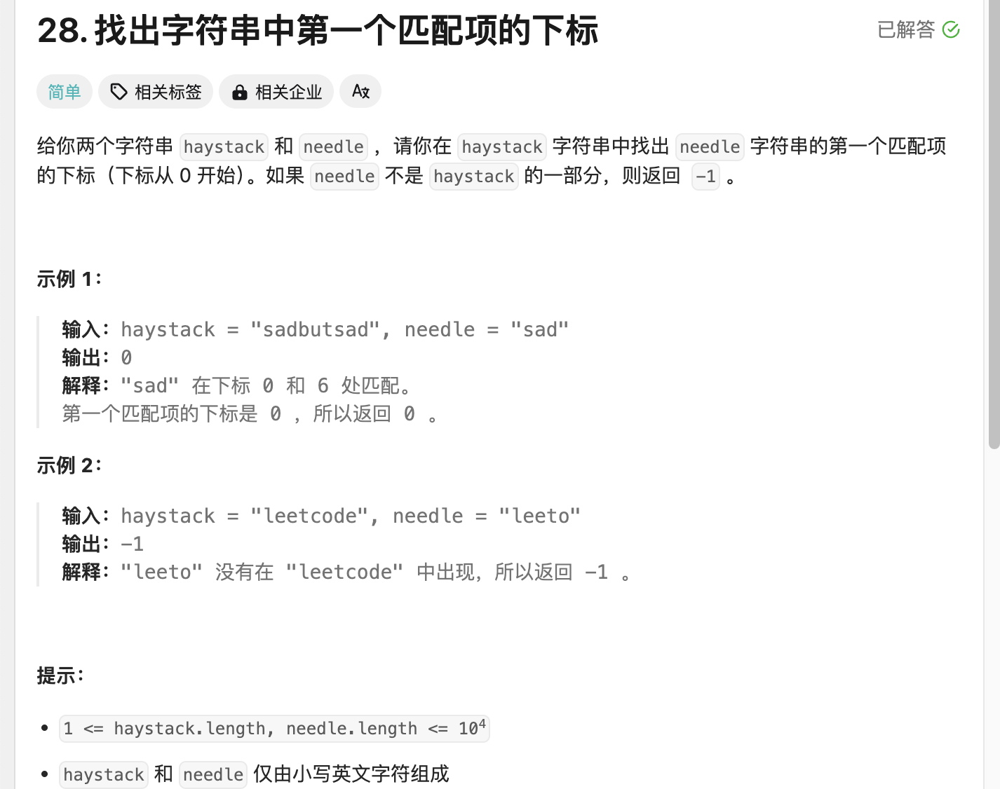
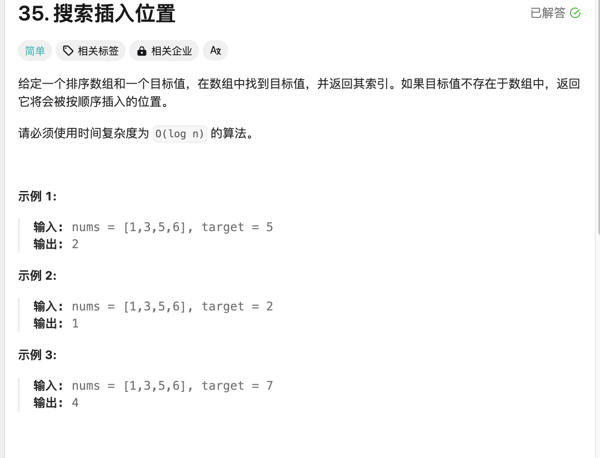
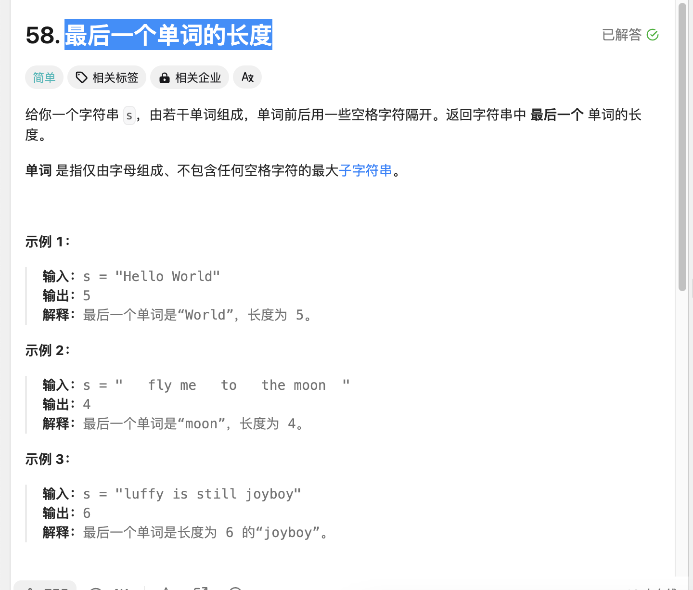
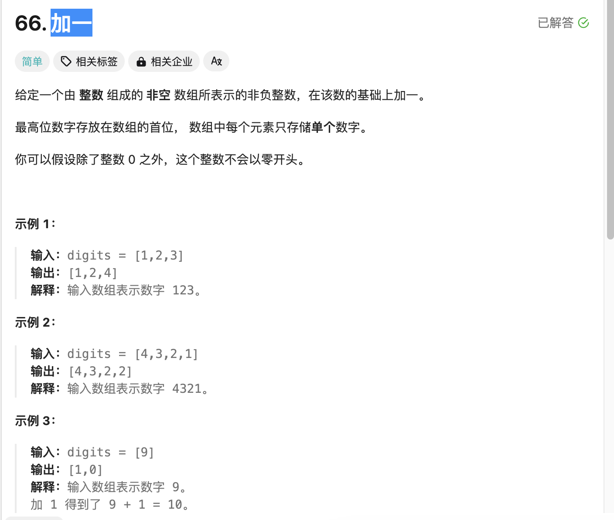
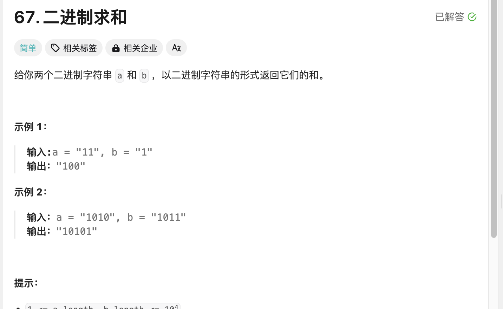

## 学习算法在leetcode第二天

>继续学习争取多做几道题
>


## 第一题 找出字符串中第一个匹配项的下标

  

```
class Solution:
    def strStr(self, haystack: str, needle: str) -> int:
        if not needle:
            return 0
        n, m = len(haystack), len(needle)
        if m > n:
            return -1
        for i in range(n - m + 1):
            if haystack[i:i+m] == needle:
                return i
        return -1
```

>这个的话先判断需要对应的字符串是否为空，为空则返回0，接着需要知道配对值和查找字符串值进行对比如果配对值大于查找值则不可能找到则返回-1，循环遍历截止到needle长度之前这样抱着每次循环判断存在needle长度的值进行判断，返回好的值如果都不满足则返回-1
>

## 第二题 搜索插入位置

  

```
class Solution:
    def searchInsert(self, nums: List[int], target: int) -> int:
        if target > nums[len(nums)-1]:
            return len(nums)
        for i in range(len(nums)):
            if nums[i] >= target:
                return i
```

>这个的话就单纯判断值是否大等于target值是则返回当前的i即可，当然需要预测值是否在里面如果不在并且大于里面的值则返回数组长度
>

## 第三题 最后一个单词的长度

  


```
class Solution:
    def lengthOfLastWord(self, s: str) -> int:
        word = s.split()
        if not word:
            return 0
        return len(word[-1])
```

>这道题就是先按空格分隔，判断是否为空不为空返回最后一个长度值，否则为0
>


## 第四题 加一

  

```
class Solution:
    def plusOne(self, digits: List[int]) -> List[int]:
        n = len(digits)
        for i in range(n-1, -1, -1):
            if digits[i] != 9:
                digits[i] += 1
                return digits
            digits[i] = 0
        return [1] + digits
```

>这个主要反过来遍历如果最后一个为9，往前加一自己变成9，不然直接最后一个加一就返回值，最后如果全是9的话加一个1的数组在前面
>

## 第五题  二进制求和

  


```
class Solution:
    def addBinary(self, a: str, b: str) -> str:
        result = []
        i = len(a) - 1
        j = len(b) - 1
        carry = 0
    
        while i >= 0 or j >= 0 or carry:
            total = carry
            if i >= 0:
                total += int(a[i])
                i -= 1
            if j >= 0:
                total += int(b[j])
                j -= 1
            result.append(str(total % 2))
            carry = total // 2
    
        return ''.join(reversed(result))      
```

