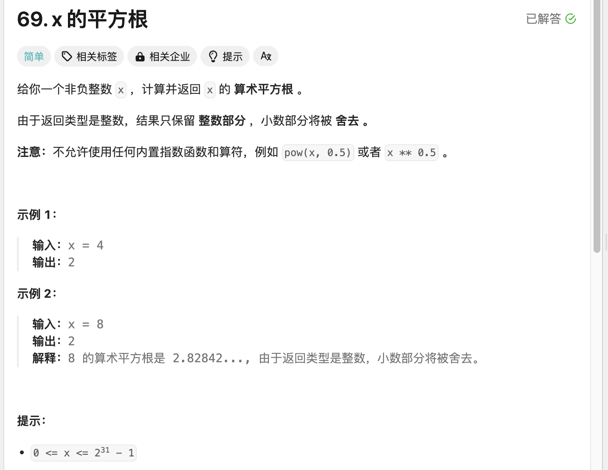
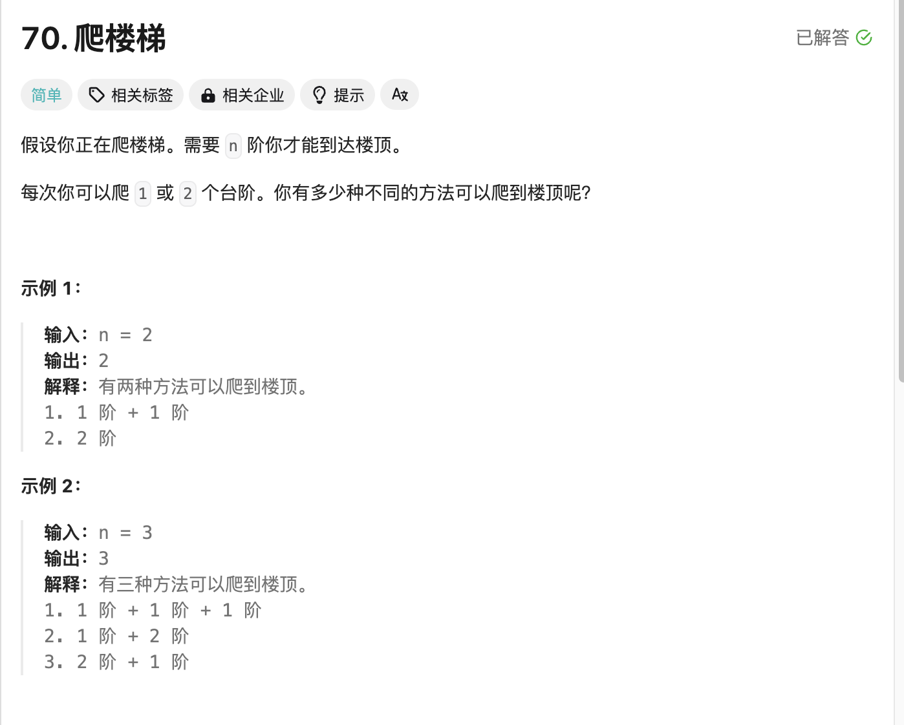
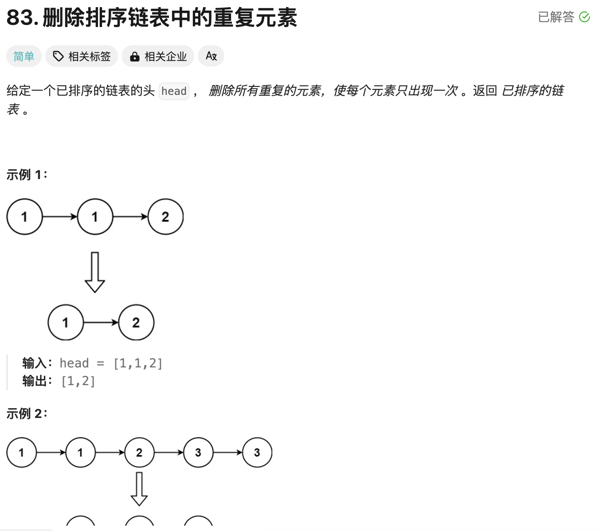

## 学习算法在leetcode第三天

>保持热爱继续学习
>

## 第一题 x 的平方根 

  

```
class Solution:
    def mySqrt(self, x: int) -> int:
        left, right, ans = 0, x, 0
        while left <= right:
            mid = (left + right) // 2
            if mid * mid <= x:
                ans = mid
                left = mid + 1
            else:
                right = mid - 1
        return ans
```

>这个代码单纯利用二分的方式进行操作，只需要在循环判断中间值乘中间值判断如果小于x值则加大左边，如果大于则减小右边值
>

## 第二题 爬楼梯

  

```
class Solution:
    def climbStairs(self, n: int) -> int:
        if n == 1:
            return 1
        if n == 2:
            return 2
        a, b = 1, 2
        for _ in range(3, n + 1):
            c = a + b
            a = b
            b = c
        return b
```

>这里1和2是固定的，使用反向的递归进行操作即可然后每次都加迭代到n阶直
>

## 第三题 删除排序链表中的重复元素

  

```
# Definition for singly-linked list.
# class ListNode:
#     def __init__(self, val=0, next=None):
#         self.val = val
#         self.next = next
class Solution:
    def deleteDuplicates(self, head: Optional[ListNode]) -> Optional[ListNode]:
        if not head:
            return head
        current = head
        while current.next:
            if current.val == current.next.val:
                current.next = current.next.next
            else:
                current = current.next
        return head
```

>这个的话还挺有意思，先判断是否为空，如果为空则直接返回，如果定义一下，不断变遍历，如果下一个指针的值等于这个则指针直接移动到下下个，否则移动下一个返回head因为会默认断指针删除
>


