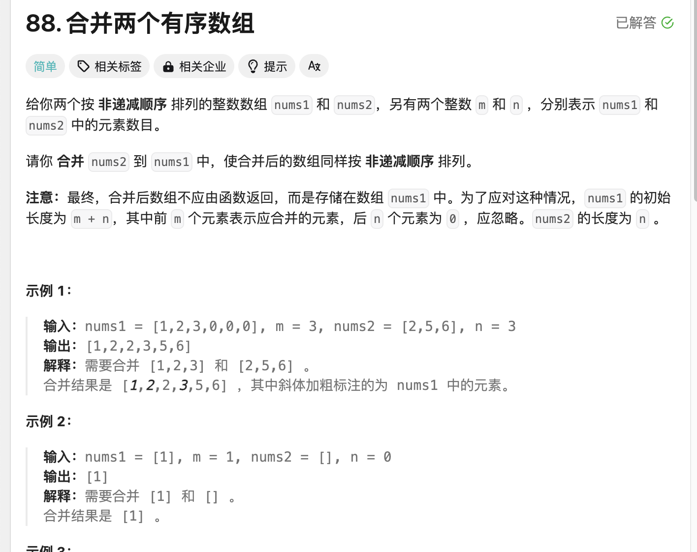
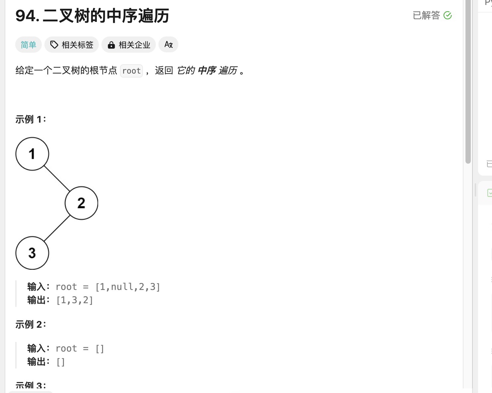
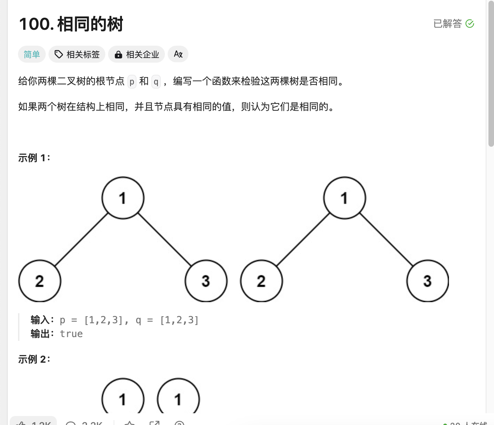
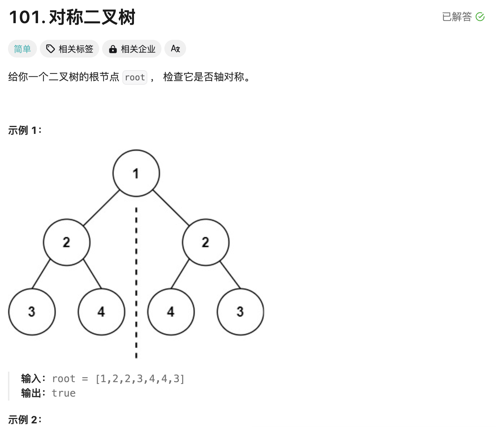
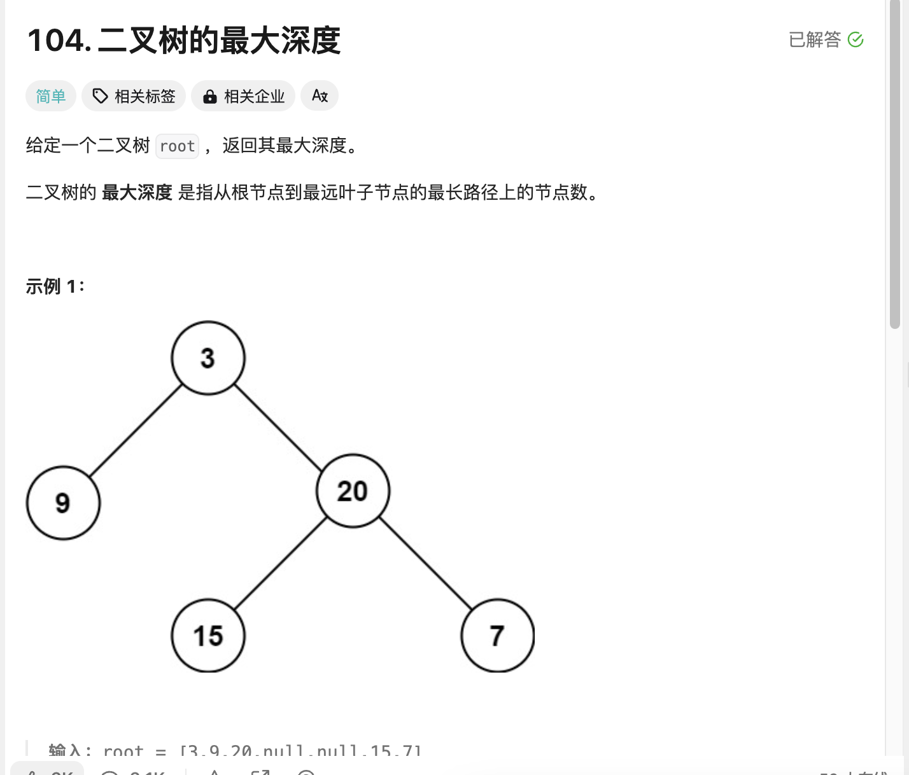
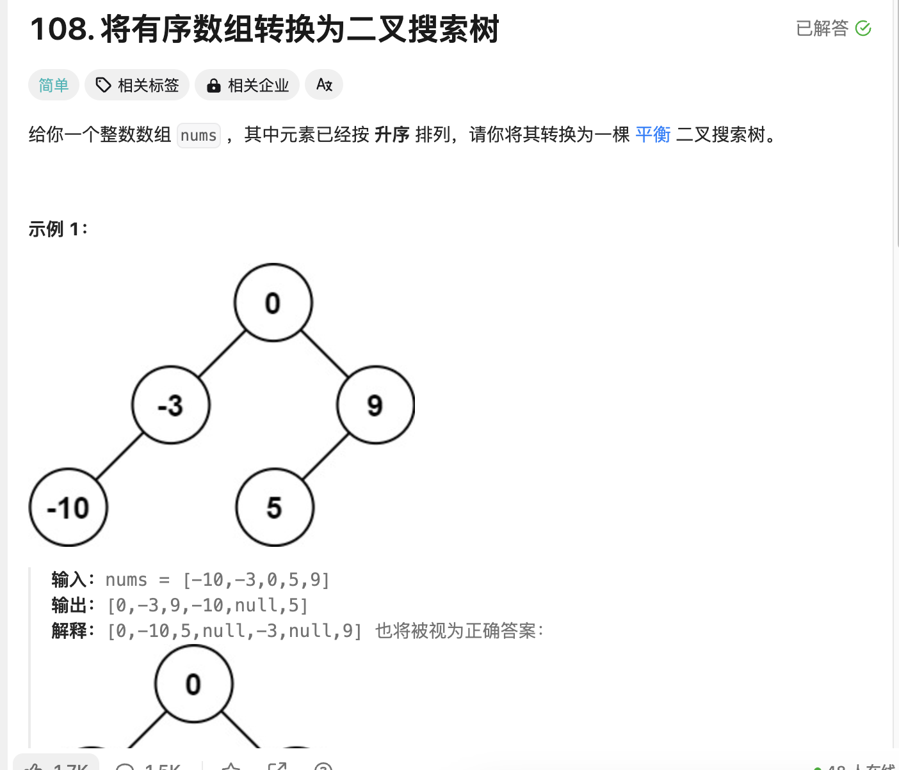
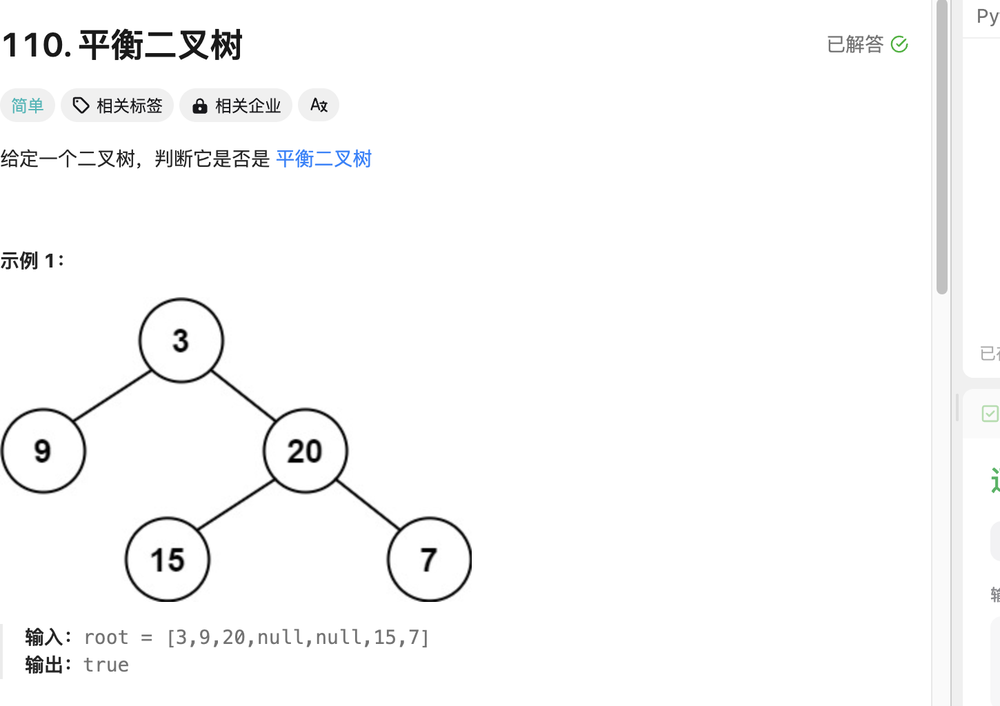
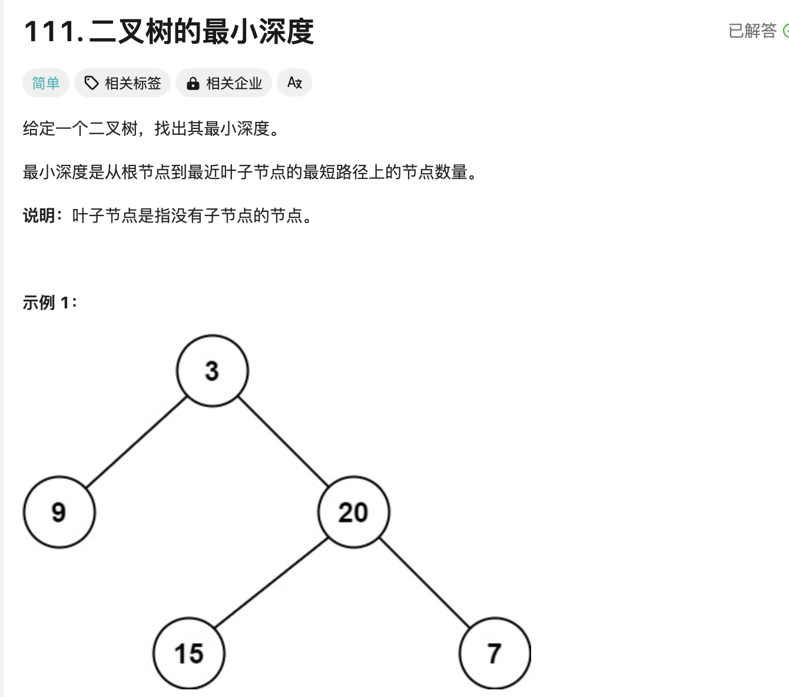

## 学习算法在leetcode第四天

>昨天懈怠了，进行继续学习
>

## 第一题 合并两个有序数组

  


```
class Solution:
    def merge(self, nums1: List[int], m: int, nums2: List[int], n: int) -> None:
        """
        Do not return anything, modify nums1 in-place instead.
        """
        for i in range(n):
            nums1[m + i] = nums2[i]
        nums1.sort()
        return nums1
```

>这个的话就是将数组2加入到数组1接着进行sort排序，当然创建一个空循环遍历2个加入判断其实也可以不过不如这个快
>

## 第二题 二叉树的中序遍历

  


```
# Definition for a binary tree node.
# class TreeNode:
#     def __init__(self, val=0, left=None, right=None):
#         self.val = val
#         self.left = left
#         self.right = right
class Solution:
    def inorderTraversal(self, root: Optional[TreeNode]) -> List[int]:
        result = []
        
        def traverse(node):
            if not node:
                return
            traverse(node.left)    # 左子树
            result.append(node.val) # 根节点
            traverse(node.right)   # 右子树
        
        traverse(root)
        return result
```

>这个的话对树理解一下就很简单，但我理解不深得研究一伙，这样的顺序先建立空数组存放，接着开始进行树遍历的操作利用函数可以快速解决这个问题，先判断树是否为空，接着不为空的情况进行左子树，根节点加入空数组，右节点的顺序这样可以进行空值退回，有点解释不明白（比如图一为1，null，2，3）先进行左树，发现在1节点左树没有东西则加的为根节点1，但是2有左树为3直接加入，有判断右树发现没有为根节点2
>

## 第三题 相同的树

  

```
# Definition for a binary tree node.
# class TreeNode:
#     def __init__(self, val=0, left=None, right=None):
#         self.val = val
#         self.left = left
#         self.right = right
class Solution:
    def isSameTree(self, p: Optional[TreeNode], q: Optional[TreeNode]) -> bool:
        if not p and not q:
            return True
        if not p or not q:
            return False
        if p.val != q.val:
            return False
        return self.isSameTree(p.left, q.left) and self.isSameTree(p.right, q.right)
```

>先判断是否都为空或者是否有一个不为空的判断，接着判断值如果值不等于则flase，最后用self判断树的的左树右树是否相同
>


## 第四题 对称二叉树

  

```
# Definition for a binary tree node.
# class TreeNode:
#     def __init__(self, val=0, left=None, right=None):
#         self.val = val
#         self.left = left
#         self.right = right
class Solution:
    def isSymmetric(self, root: Optional[TreeNode]) -> bool:
        def isMirror(left: Optional[TreeNode], right: Optional[TreeNode]) -> bool:
            if not left and not right:
                return True
            
            if not left or not right:
                return False
            
            return (left.val == right.val) and isMirror(left.left, right.right) and isMirror(left.right, right.left)

        return isMirror(root.left, root.right) if root else True


```

>捅进树窝了，全是树刚好补补课了,发现如果是判断树的话先看是否为空，接着对树两边操作因为要对称所以左和右相同所以对left和right就得对应一下
>

## 第五题 二叉树的最大深度

  


```
# Definition for a binary tree node.
# class TreeNode:
#     def __init__(self, val=0, left=None, right=None):
#         self.val = val
#         self.left = left
#         self.right = right
class Solution:
    def maxDepth(self, root: Optional[TreeNode]) -> int:
        if not root:
            return 0
        left_depth = self.maxDepth(root.left)
        right_depth = self.maxDepth(root.right)
        return max(left_depth, right_depth) + 1
```

>这个的话就是先判断是否为空，空为1，接着定义左深，右深，取最大值加1返回
>

## 第六题 将有序数组转换为二叉搜索树

  

```
# Definition for a binary tree node.
# class TreeNode:
#     def __init__(self, val=0, left=None, right=None):
#         self.val = val
#         self.left = left
#         self.right = right
class Solution:
    def sortedArrayToBST(self, nums: List[int]) -> Optional[TreeNode]:
        def helper(left, right):
            if left > right:
                return None
            mid = (left + right) // 2
            root = TreeNode(nums[mid])
            root.left = helper(left, mid-1)
            root.right = helper(mid+1, right)
            return root
        
        return helper(0, len(nums)-1)
```

>这个的话好像有点难度，它必须得做到左小右的值，否则就为None，接着进行中间数的排列，去中间数断开，左边mid-1，右边mid+1，因为原数组就是按照大小排列的
>


## 第七题  平衡二叉树

  


```
# Definition for a binary tree node.
# class TreeNode:
#     def __init__(self, val=0, left=None, right=None):
#         self.val = val
#         self.left = left
#         self.right = right
class Solution:
    def isBalanced(self, root: Optional[TreeNode]) -> bool:
        def check(node):
            if not node:
                return 0, True
            
            left_height, left_balanced = check(node.left)
            right_height, right_balanced = check(node.right)
            
            current_balanced = abs(left_height - right_height) <= 1

            return max(left_height, right_height) + 1, (current_balanced and left_balanced and right_balanced)
        
        return check(root)[1] if root else True 

```


>首先先判断是否为空，如果空为True，定义左高和左平衡，右高和右平衡，定义通常平衡，主要是利用平衡树的就是每一个节点的左右树高 <= 1，return 最大高度 + 1和平衡，如果等于root则返回True
>


## 第八题 

  


```
# Definition for a binary tree node.
# class TreeNode:
#     def __init__(self, val=0, left=None, right=None):
#         self.val = val
#         self.left = left
#         self.right = right
class Solution:
    def minDepth(self, root: Optional[TreeNode]) -> int:
        if not root:
            return 0
        
        if not root.left:
            return self.minDepth(root.right) + 1
        
        if not root.right:
            return self.minDepth(root.left) + 1

        return min(self.minDepth(root.left), self.minDepth(root.right)) + 1
```

>
>


