## 地址获取

```
root@LingMj:~/xxoo/jarjar# arp-scan -l
Interface: eth0, type: EN10MB, MAC: 00:0c:29:d1:27:55, IPv4: 192.168.137.190
Starting arp-scan 1.10.0 with 256 hosts (https://github.com/royhills/arp-scan)
192.168.137.1	3e:21:9c:12:bd:a3	(Unknown: locally administered)
192.168.137.59	a0:78:17:62:e5:0a	Apple, Inc.
192.168.137.78	3e:21:9c:12:bd:a3	(Unknown: locally administered)

3 packets received by filter, 0 packets dropped by kernel
Ending arp-scan 1.10.0: 256 hosts scanned in 2.133 seconds (120.02 hosts/sec). 3 responded
```


## 端口扫描

```
root@LingMj:~/xxoo/jarjar# nmap -p- -sV -sC 192.168.137.78
Starting Nmap 7.95 ( https://nmap.org ) at 2025-05-04 04:57 EDT
Nmap scan report for Umz.mshome.net (192.168.137.78)
Host is up (0.0081s latency).
Not shown: 65533 closed tcp ports (reset)
PORT   STATE SERVICE VERSION
22/tcp open  ssh     OpenSSH 8.4p1 Debian 5+deb11u3 (protocol 2.0)
| ssh-hostkey: 
|   3072 f6:a3:b6:78:c4:62:af:44:bb:1a:a0:0c:08:6b:98:f7 (RSA)
|   256 bb:e8:a2:31:d4:05:a9:c9:31:ff:62:f6:32:84:21:9d (ECDSA)
|_  256 3b:ae:34:64:4f:a5:75:b9:4a:b9:81:f9:89:76:99:eb (ED25519)
80/tcp open  http    Apache httpd 2.4.62 ((Debian))
|_http-title: cyber fortress 9000
|_http-server-header: Apache/2.4.62 (Debian)
MAC Address: 3E:21:9C:12:BD:A3 (Unknown)
Service Info: OS: Linux; CPE: cpe:/o:linux:linux_kernel

Service detection performed. Please report any incorrect results at https://nmap.org/submit/ .
Nmap done: 1 IP address (1 host up) scanned in 17.15 seconds
```

## 获取webshell
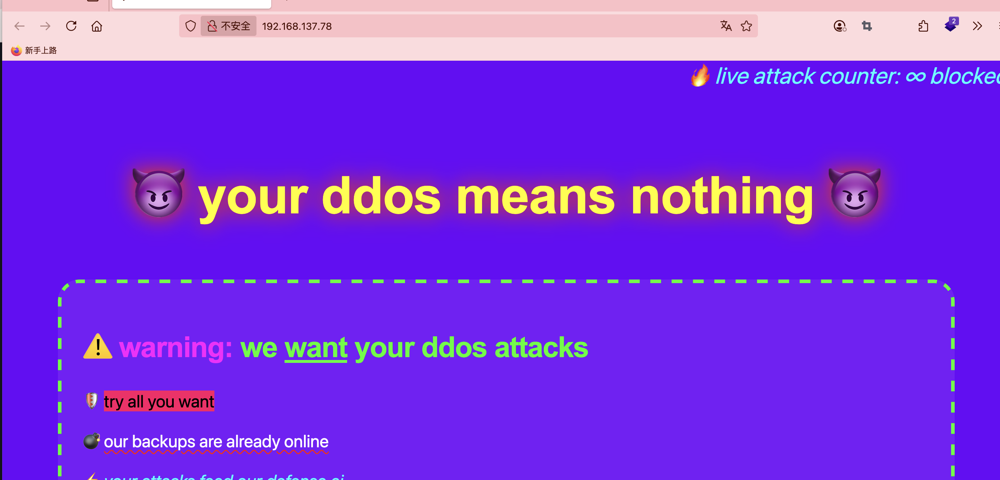  
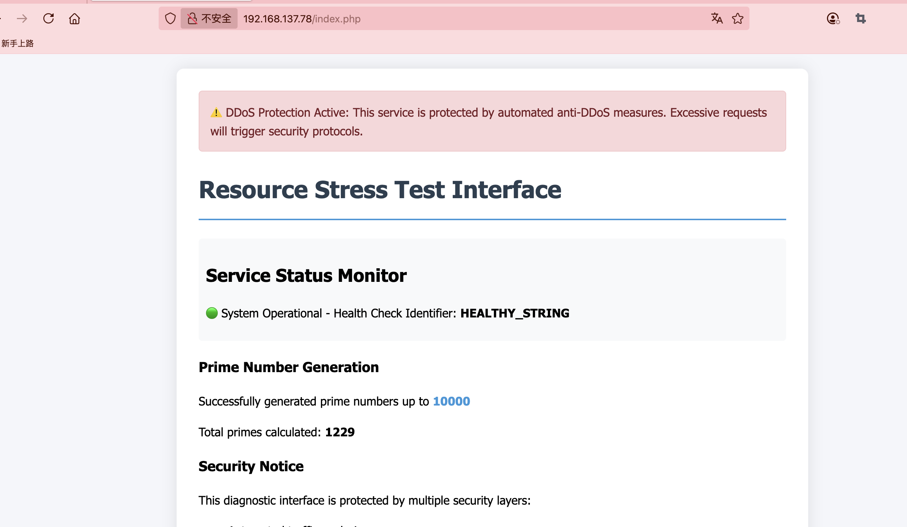  

>这里提示是ddos，但是我试了一早没啥用，要了提示方案和工具，这里要用很大的线程操作才行，我原来都给50以为很大哈哈哈
>

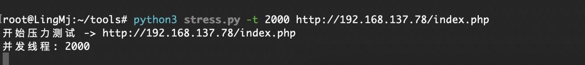  
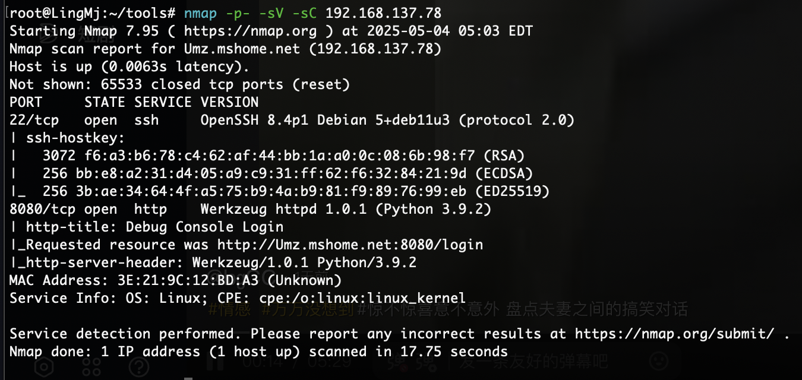  
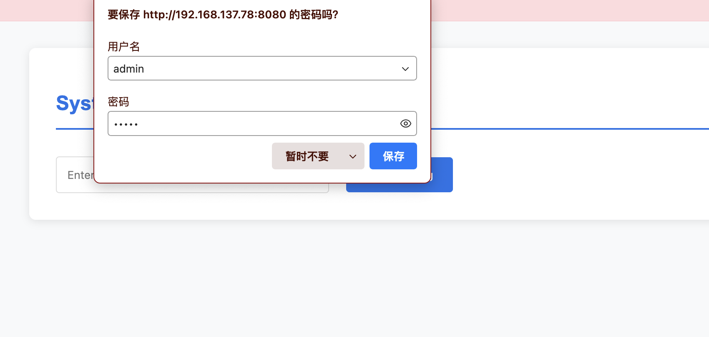  

>密码admin
>

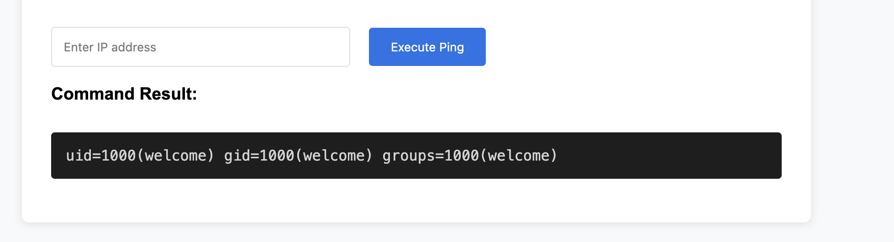  
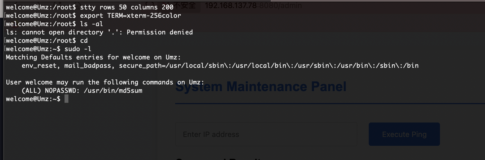  
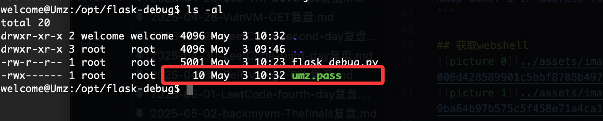  

>这里要注意的问题是字符长度，因为md5sum默认使用换行操作的，我这里一开始没考虑md5比对，我直接suforce跑了很久一半了，但是肯定没有比对快这里说明一下
>

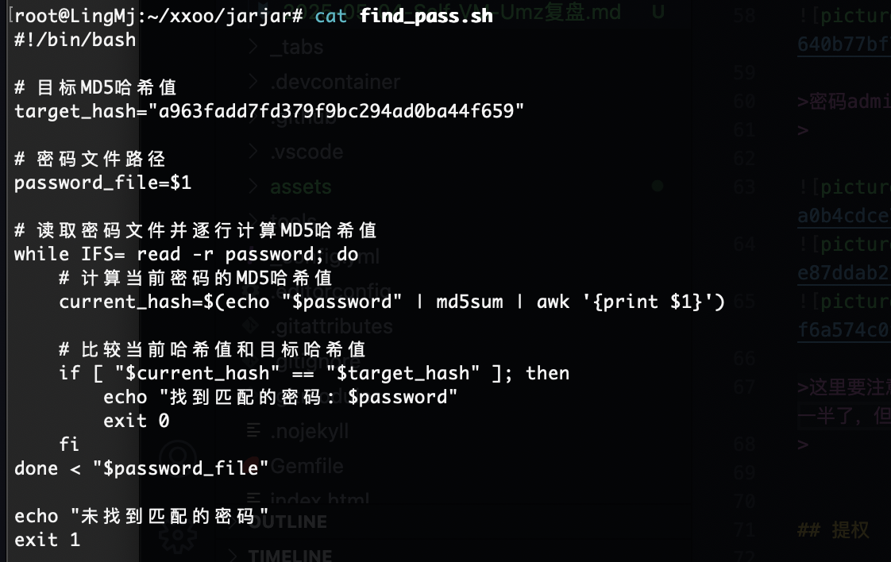  

>简单脚步进行比对因为两遍没有进行换行处理所以直接md5sum
>
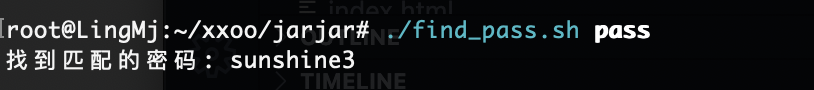  

>也就2秒出来了
>


## 提权

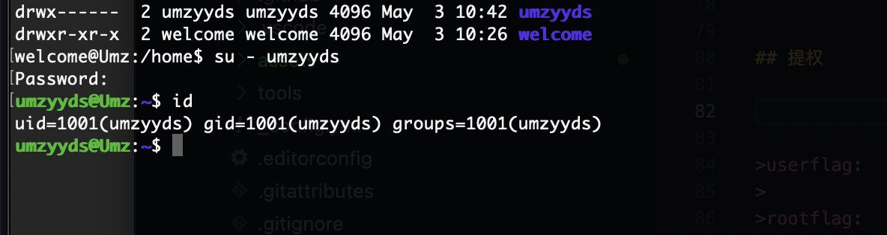  

>这里的密码是另外一个用户的
>

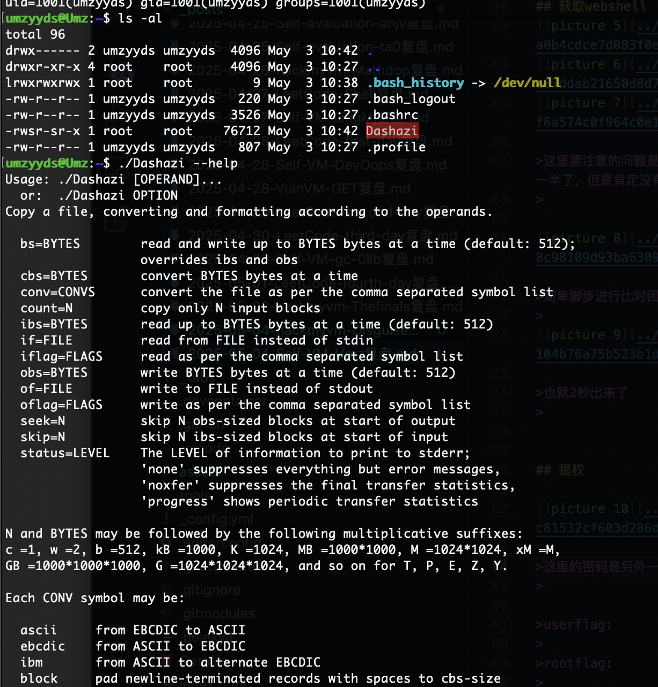  

>这个我看着很眼熟查了一下是dd
>

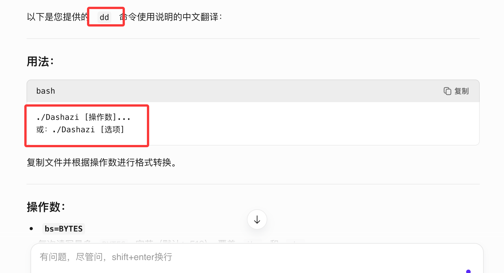  

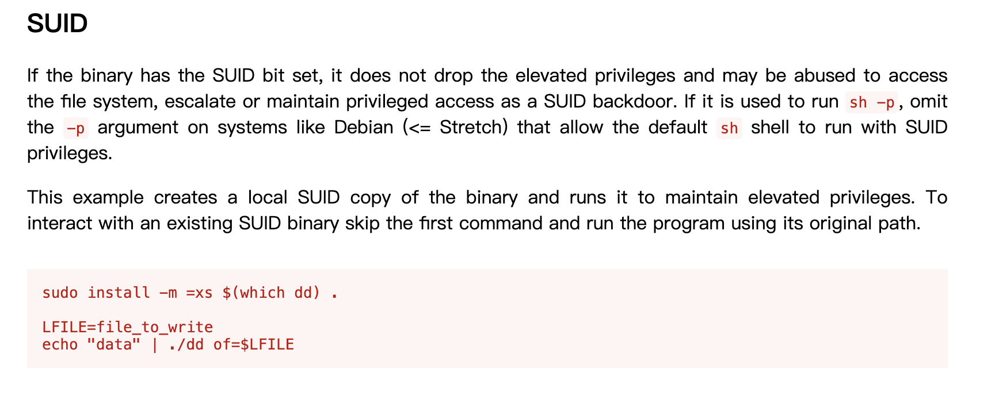  


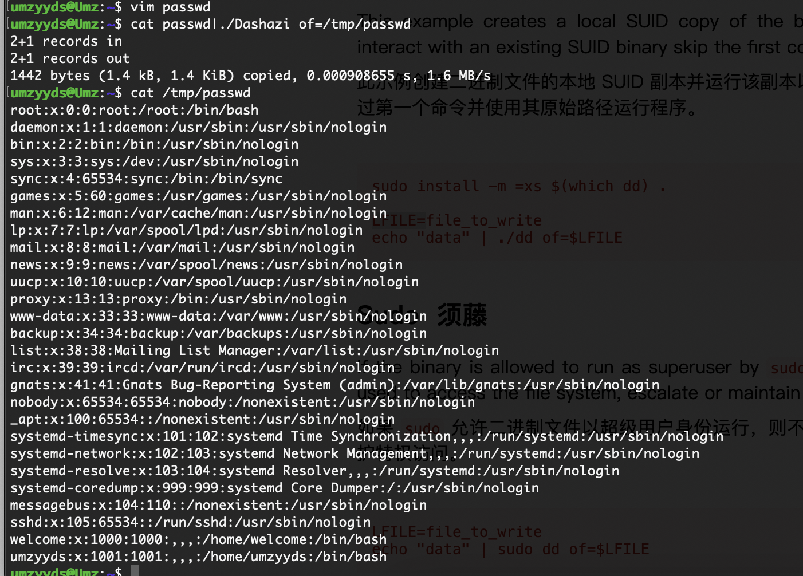  
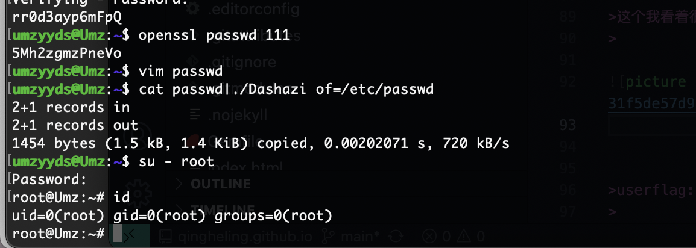  

>好了整体难度是easy的
>


>userflag:
>
>rootflag:
>

