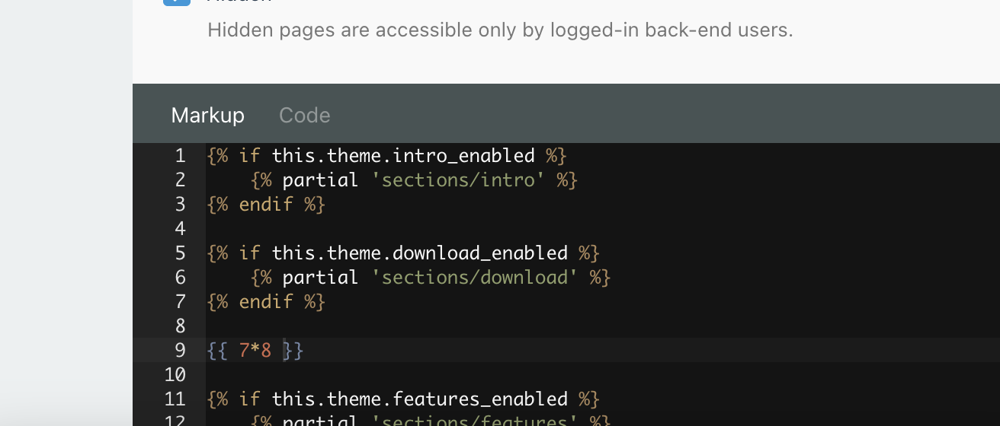
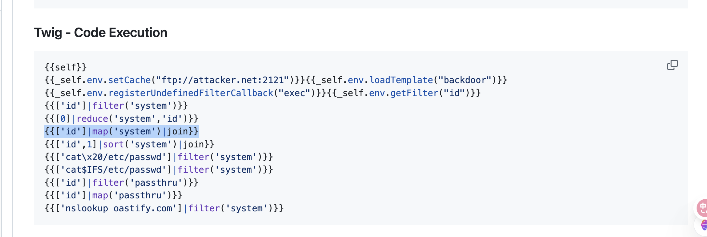
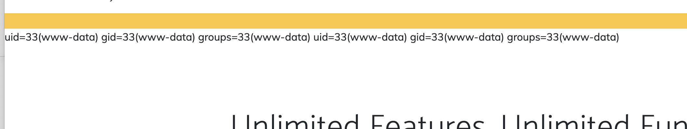
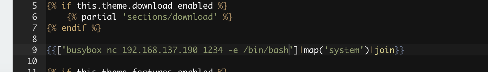
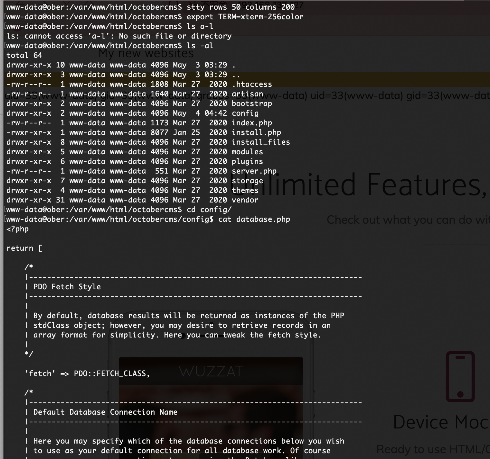
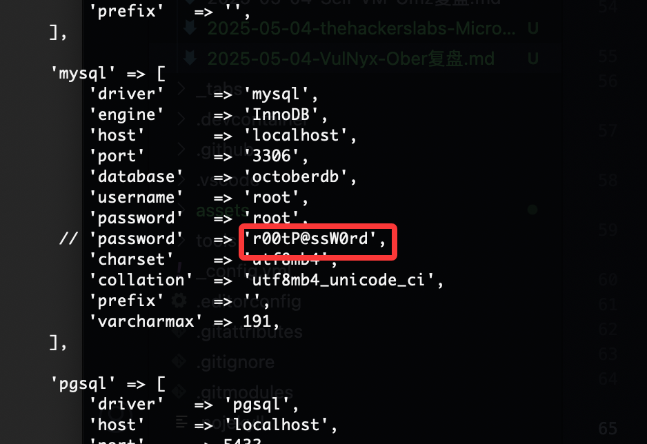

## 网段扫描
```
Interface: eth0, type: EN10MB, MAC: 00:0c:29:d1:27:55, IPv4: 192.168.137.190
Starting arp-scan 1.10.0 with 256 hosts (https://github.com/royhills/arp-scan)
192.168.137.1	3e:21:9c:12:bd:a3	(Unknown: locally administered)
192.168.137.59	a0:78:17:62:e5:0a	Apple, Inc.
192.168.137.127	3e:21:9c:12:bd:a3	(Unknown: locally administered)
```

## 端口扫描

```
Starting Nmap 7.95 ( https://nmap.org ) at 2025-05-04 07:25 EDT
Nmap scan report for ober.mshome.net (192.168.137.127)
Host is up (0.0062s latency).
Not shown: 65532 closed tcp ports (reset)
PORT     STATE SERVICE VERSION
22/tcp   open  ssh     OpenSSH 7.9p1 Debian 10+deb10u2 (protocol 2.0)
| ssh-hostkey: 
|   2048 27:21:9e:b5:39:63:e9:1f:2c:b2:6b:d3:3a:5f:31:7b (RSA)
|   256 bf:90:8a:a5:d7:e5:de:89:e6:1a:36:a1:93:40:18:57 (ECDSA)
|_  256 95:1f:32:95:78:08:50:45:cd:8c:7c:71:4a:d4:6c:1c (ED25519)
80/tcp   open  http    Apache httpd 2.4.38 ((Debian))
|_http-title: Page not found
|_http-server-header: Apache/2.4.38 (Debian)
8080/tcp open  http    Apache httpd 2.4.38 ((Debian))
|_http-server-header: Apache/2.4.38 (Debian)
|_http-title: Site doesn't have a title (text/html).
|_http-open-proxy: Proxy might be redirecting requests
MAC Address: 3E:21:9C:12:BD:A3 (Unknown)
Service Info: OS: Linux; CPE: cpe:/o:linux:linux_kernel

Service detection performed. Please report any incorrect results at https://nmap.org/submit/ .
Nmap done: 1 IP address (1 host up) scanned in 18.11 seconds
```

## 获取webshell
  
  
  

>admin：admin
>

  

  
  
  
  


## 提权

  
  
  

>结束了，不如群主的靶机
>


>userflag:
>
>rootflag:
>