## 网段扫描
```
root@LingMj:~/xxoo/jarjar# arp-scan -l
Interface: eth0, type: EN10MB, MAC: 00:0c:29:d1:27:55, IPv4: 192.168.137.190
Starting arp-scan 1.10.0 with 256 hosts (https://github.com/royhills/arp-scan)
192.168.137.1	3e:21:9c:12:bd:a3	(Unknown: locally administered)
192.168.137.59	a0:78:17:62:e5:0a	Apple, Inc.
192.168.137.224	3e:21:9c:12:bd:a3	(Unknown: locally administered)

8 packets received by filter, 0 packets dropped by kernel
Ending arp-scan 1.10.0: 256 hosts scanned in 2.111 seconds (121.27 hosts/sec). 3 responded
```

## 端口扫描

```
root@LingMj:~/xxoo/jarjar# nmap -p- -sV -sC 192.168.137.224     
Starting Nmap 7.95 ( https://nmap.org ) at 2025-05-03 22:00 EDT
Nmap scan report for disguise.mshome.net (192.168.137.224)
Host is up (0.0074s latency).
Not shown: 65533 closed tcp ports (reset)
PORT   STATE SERVICE VERSION
22/tcp open  ssh     OpenSSH 7.9p1 Debian 10+deb10u4 (protocol 2.0)
| ssh-hostkey: 
|   2048 93:a4:92:55:72:2b:9b:4a:52:66:5c:af:a9:83:3c:fd (RSA)
|   256 1e:a7:44:0b:2c:1b:0d:77:83:df:1d:9f:0e:30:08:4d (ECDSA)
|_  256 d0:fa:9d:76:77:42:6f:91:d3:bd:b5:44:72:a7:c9:71 (ED25519)
80/tcp open  http    Apache httpd 2.4.59 ((Debian))
|_http-generator: WordPress 6.7.2
|_http-server-header: Apache/2.4.59 (Debian)
|_http-title: Just a simple wordpress site
| http-robots.txt: 1 disallowed entry 
|_/wp-admin/
MAC Address: 3E:21:9C:12:BD:A3 (Unknown)
Service Info: OS: Linux; CPE: cpe:/o:linux:linux_kernel

Service detection performed. Please report any incorrect results at https://nmap.org/submit/ .
Nmap done: 1 IP address (1 host up) scanned in 35.48 seconds
```

## 获取webshell
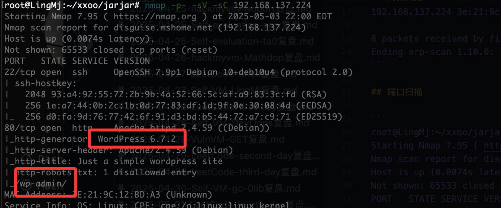  
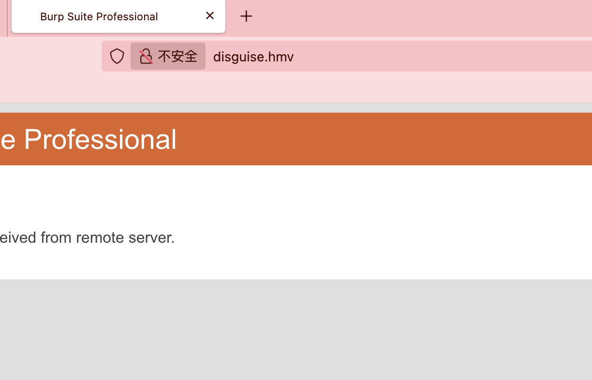  
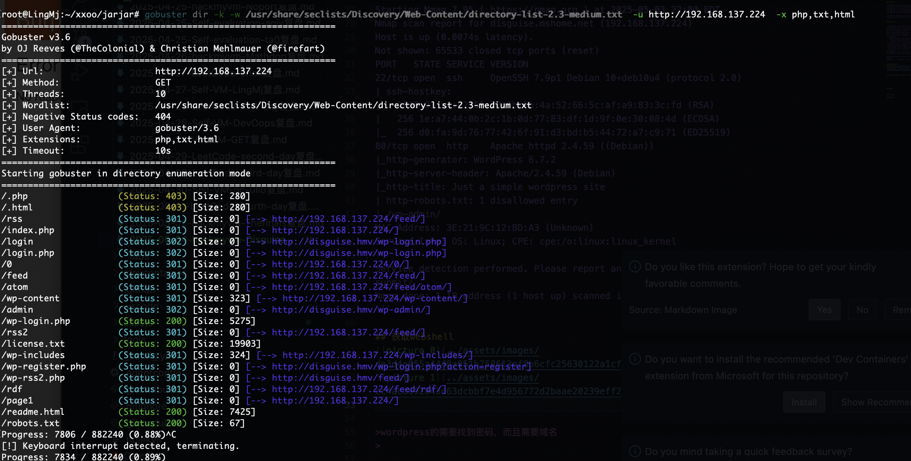  

>wordpress的需要找到密码，而且需要域名
>

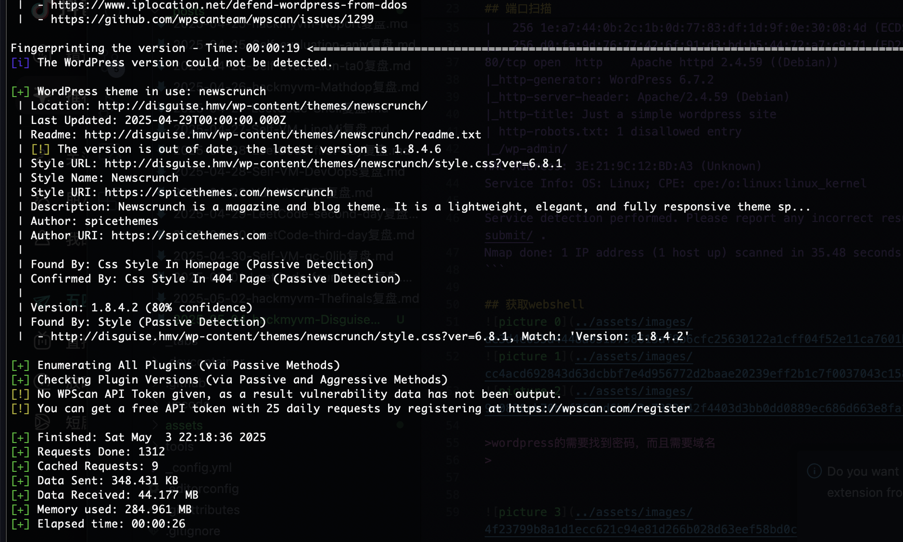  

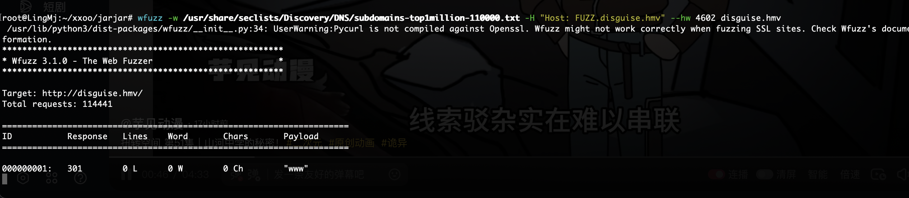  
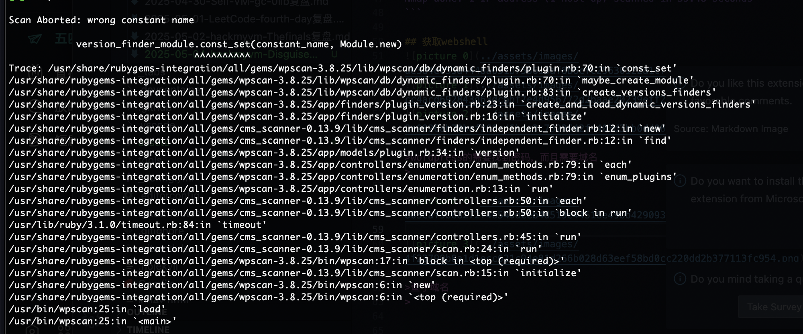  
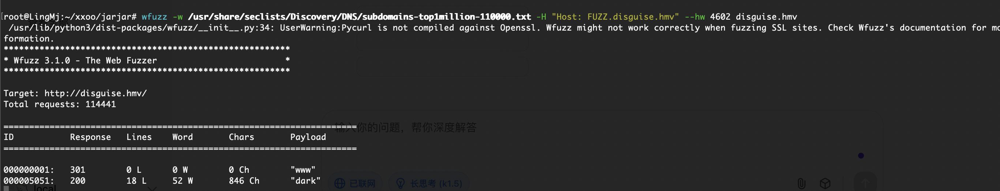  
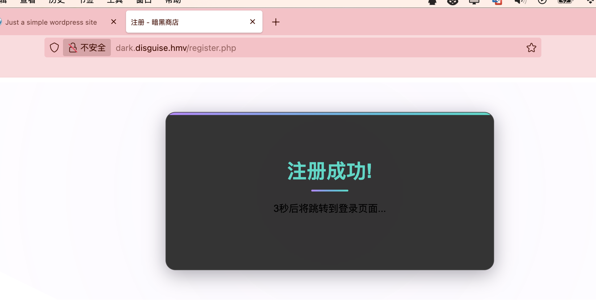  
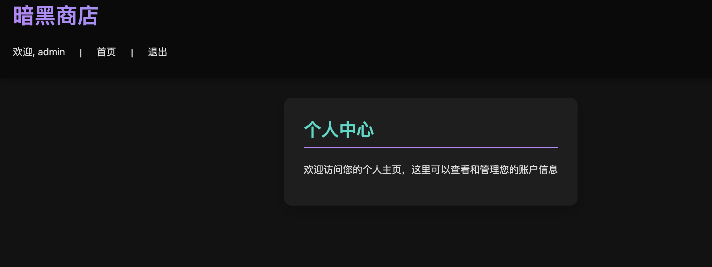  

>查子域名
>

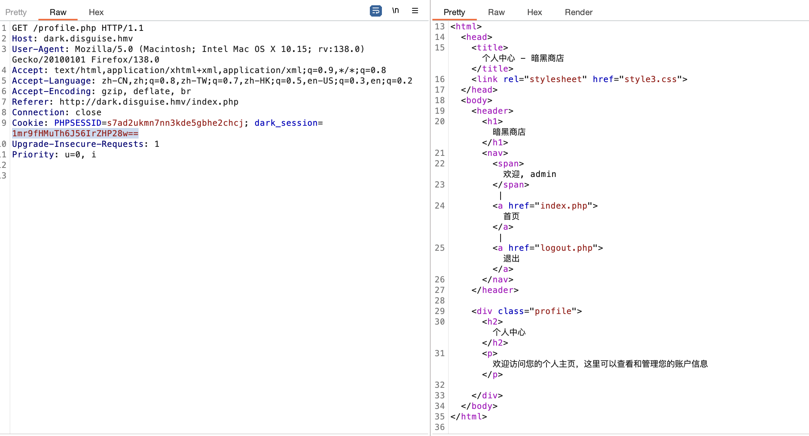  

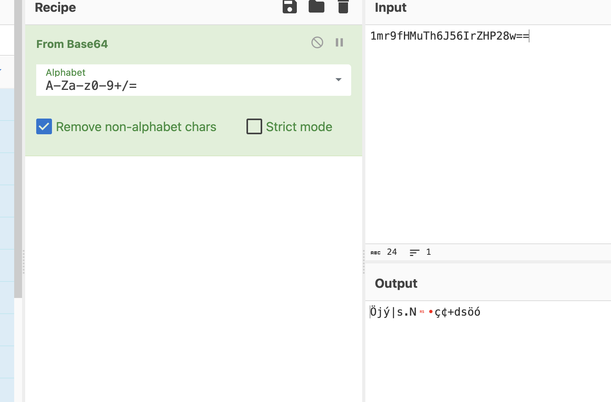  


## 提权


>userflag:
>
>rootflag:
>