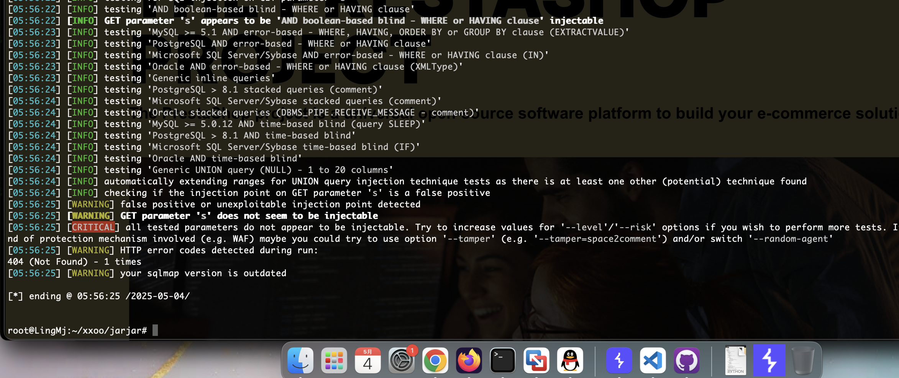
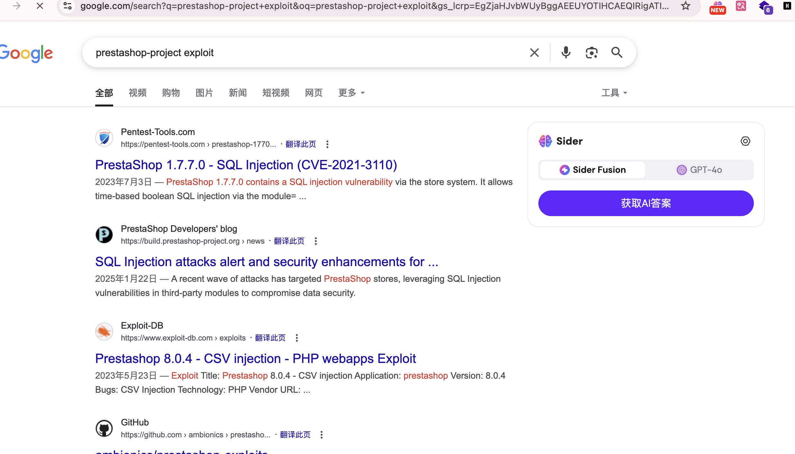
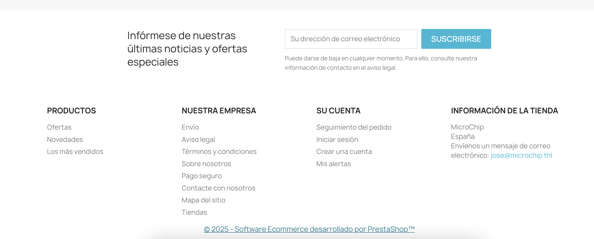
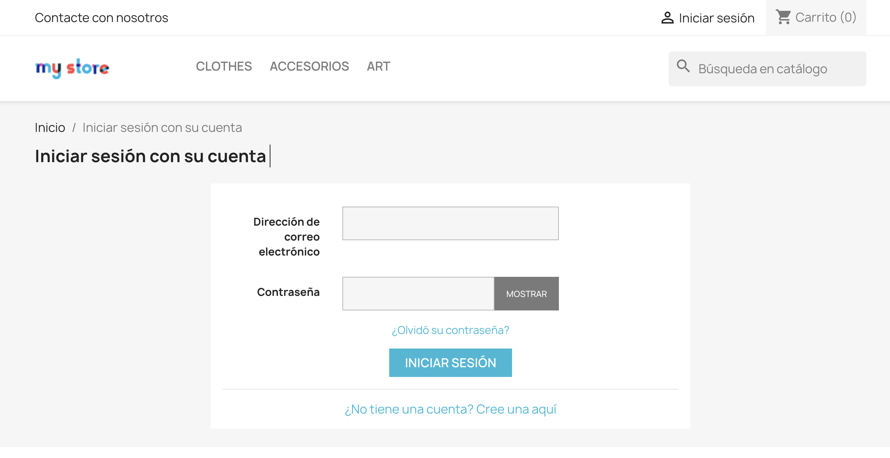
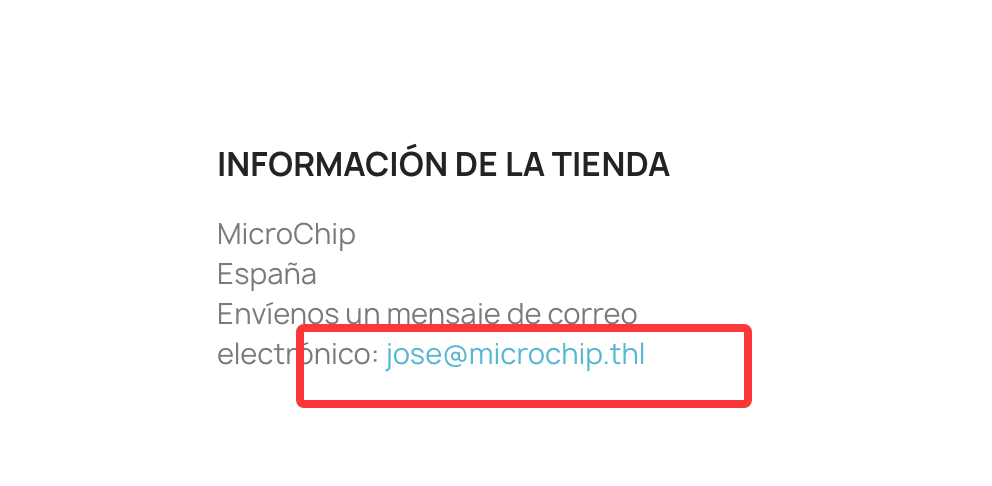
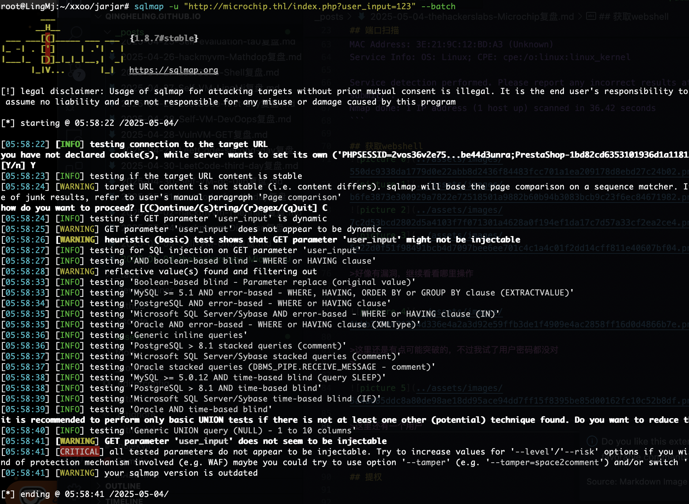
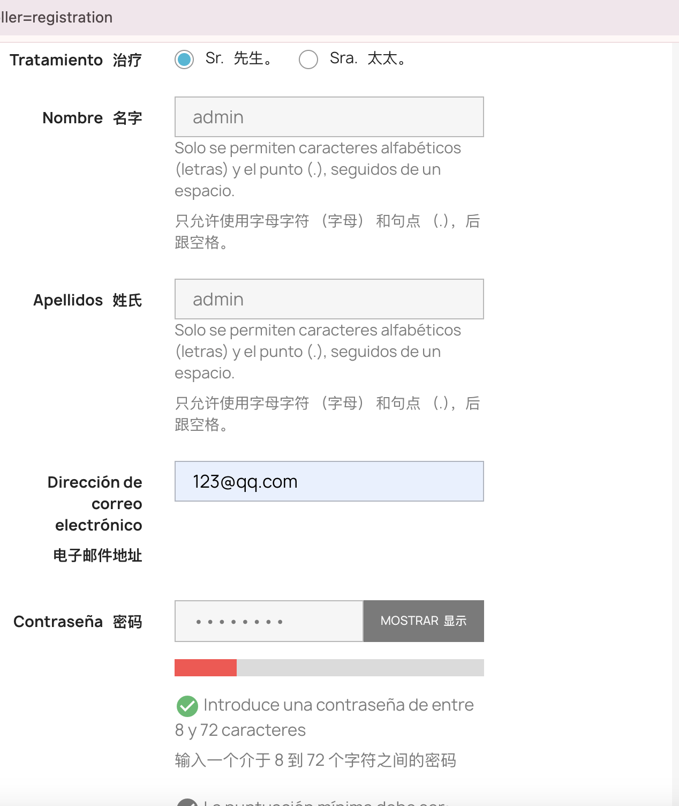
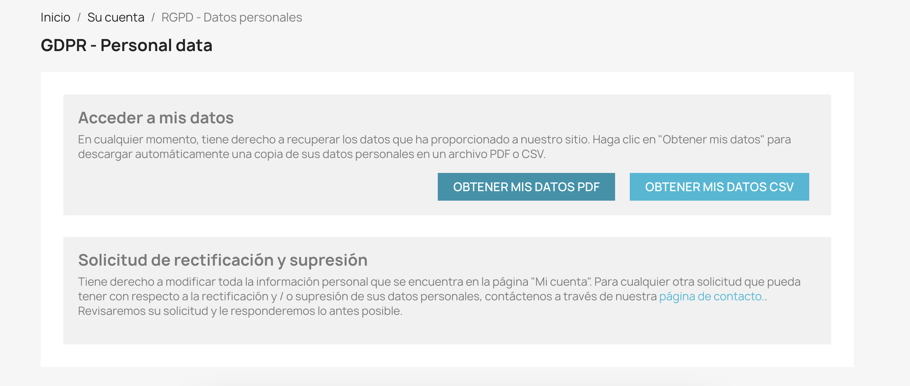
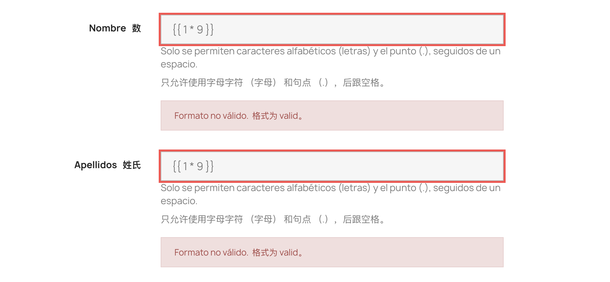
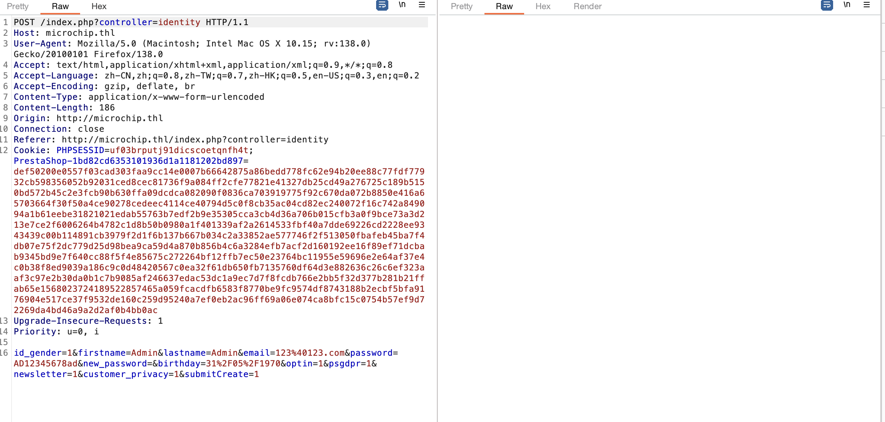

## 网段扫描
```
root@LingMj:~/xxoo/jarjar# arp-scan -l
Interface: eth0, type: EN10MB, MAC: 00:0c:29:d1:27:55, IPv4: 192.168.137.190
Starting arp-scan 1.10.0 with 256 hosts (https://github.com/royhills/arp-scan)
192.168.137.1	3e:21:9c:12:bd:a3	(Unknown: locally administered)
192.168.137.59	a0:78:17:62:e5:0a	Apple, Inc.
192.168.137.230	3e:21:9c:12:bd:a3	(Unknown: locally administered)

6 packets received by filter, 0 packets dropped by kernel
Ending arp-scan 1.10.0: 256 hosts scanned in 2.077 seconds (123.25 hosts/sec). 3 responded
```

## 端口扫描

```
root@LingMj:~/xxoo/jarjar# nmap -p- -sV -sC 192.168.137.230
Starting Nmap 7.95 ( https://nmap.org ) at 2025-05-04 05:47 EDT
Nmap scan report for microchip.thl (192.168.137.230)
Host is up (0.0094s latency).
Not shown: 65530 closed tcp ports (reset)
PORT      STATE SERVICE VERSION
22/tcp    open  ssh     OpenSSH 9.2p1 Debian 2+deb12u5 (protocol 2.0)
| ssh-hostkey: 
|   256 af:79:a1:39:80:45:fb:b7:cb:86:fd:8b:62:69:4a:64 (ECDSA)
|_  256 6d:d4:9d:ac:0b:f0:a1:88:66:b4:ff:f6:42:bb:f2:e5 (ED25519)
80/tcp    open  http    Apache httpd 2.4.58 ((Ubuntu))
|_http-server-header: Apache/2.4.58 (Ubuntu)
| http-robots.txt: 62 disallowed entries (15 shown)
| /*?order= /*?tag= /*?id_currency= /*?search_query= 
| /*?back= /*?n= /*&order= /*&tag= /*&id_currency= 
| /*&search_query= /*&back= /*&n= /*controller=addresses 
|_/*controller=address /*controller=authentication
| http-title: MicroChip
|_Requested resource was http://microchip.thl/index.php
3306/tcp  open  mysql   MySQL 8.0.42
|_ssl-date: TLS randomness does not represent time
| ssl-cert: Subject: commonName=MySQL_Server_8.0.42_Auto_Generated_Server_Certificate
| Not valid before: 2025-04-23T17:42:38
|_Not valid after:  2035-04-21T17:42:38
| mysql-info: 
|   Protocol: 10
|   Version: 8.0.42
|   Thread ID: 10
|   Capabilities flags: 65535
|   Some Capabilities: SupportsTransactions, IgnoreSigpipes, ConnectWithDatabase, Speaks41ProtocolNew, ODBCClient, IgnoreSpaceBeforeParenthesis, LongColumnFlag, Support41Auth, InteractiveClient, SwitchToSSLAfterHandshake, Speaks41ProtocolOld, LongPassword, SupportsCompression, FoundRows, SupportsLoadDataLocal, DontAllowDatabaseTableColumn, SupportsMultipleStatments, SupportsMultipleResults, SupportsAuthPlugins
|   Status: Autocommit
|   Salt: \x01~|LZ/Al,\x01
| }\x11\x13\x7F!*\x08:8
|_  Auth Plugin Name: caching_sha2_password
9000/tcp  open  http    Gophish httpd
|_http-title: Portainer
33060/tcp open  mysqlx  MySQL X protocol listener
MAC Address: 3E:21:9C:12:BD:A3 (Unknown)
Service Info: OS: Linux; CPE: cpe:/o:linux:linux_kernel

Service detection performed. Please report any incorrect results at https://nmap.org/submit/ .
Nmap done: 1 IP address (1 host up) scanned in 36.42 seconds
```

## 获取webshell
  
  
  
  

>好像有漏洞，继续看看哪里操作
>

  

>这里还是有点可能突破的，不过我试了用户密码都没对
>

  

>这里还有一个用户
>

  
  

>注册一下
>

  
  
  

>这里会输出pdf跟那个之前一个靶机很像
>

  
  


## 提权


>userflag:
>
>rootflag:
>