## 网段扫描
```
nterface: eth0, type: EN10MB, MAC: 00:0c:29:d1:27:55, IPv4: 192.168.137.190
Starting arp-scan 1.10.0 with 256 hosts (https://github.com/royhills/arp-scan)
192.168.137.1	3e:21:9c:12:bd:a3	(Unknown: locally administered)
192.168.137.59	a0:78:17:62:e5:0a	Apple, Inc.
192.168.137.132	3e:21:9c:12:bd:a3	(Unknown: locally administered)

7 packets received by filter, 0 packets dropped by kernel
Ending arp-scan 1.10.0: 256 hosts scanned in 2.135 seconds (119.91 hosts/sec). 3 responded
```

## 端口扫描

```
Starting Nmap 7.95 ( https://nmap.org ) at 2025-05-04 21:27 EDT
Nmap scan report for Bamuwe.mshome.net (192.168.137.132)
Host is up (0.013s latency).
Not shown: 65533 closed tcp ports (reset)
PORT   STATE SERVICE VERSION
22/tcp open  ssh     OpenSSH 8.4p1 Debian 5+deb11u3 (protocol 2.0)
| ssh-hostkey: 
|   3072 f6:a3:b6:78:c4:62:af:44:bb:1a:a0:0c:08:6b:98:f7 (RSA)
|   256 bb:e8:a2:31:d4:05:a9:c9:31:ff:62:f6:32:84:21:9d (ECDSA)
|_  256 3b:ae:34:64:4f:a5:75:b9:4a:b9:81:f9:89:76:99:eb (ED25519)
80/tcp open  http    Apache httpd 2.4.62 ((Debian))
|_http-title: Library Membership Registration
|_http-server-header: Apache/2.4.62 (Debian)
MAC Address: 3E:21:9C:12:BD:A3 (Unknown)
Service Info: OS: Linux; CPE: cpe:/o:linux:linux_kernel

Service detection performed. Please report any incorrect results at https://nmap.org/submit/ .
Nmap done: 1 IP address (1 host up) scanned in 23.66 seconds
```

## 获取webshell
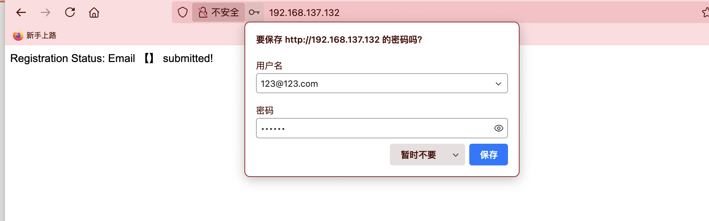  
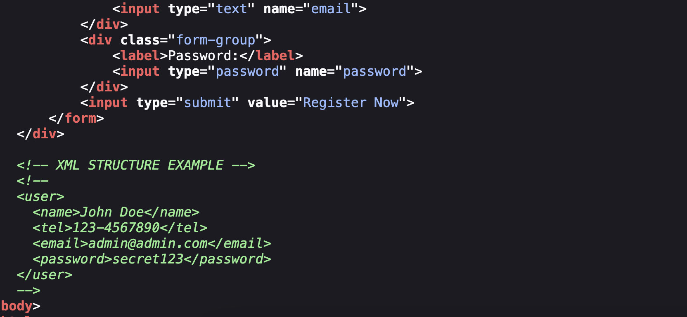  
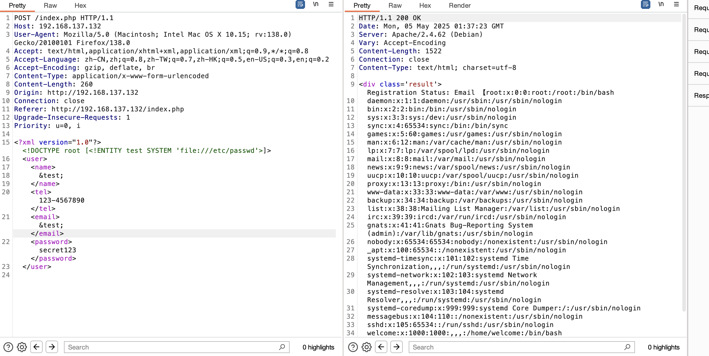  

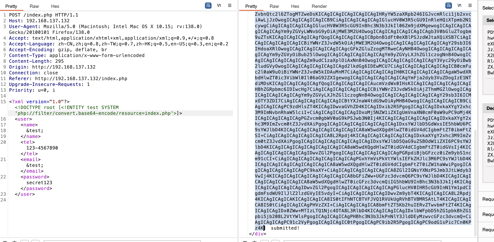  


```
<?php
// register.php
header("Content-Type: text/html; charset=utf-8");
libxml_disable_entity_loader(false);  // Preserved vulnerability point

if ($_SERVER['REQUEST_METHOD'] === 'POST') {
    $xml = file_get_contents('php://input');
    try {
        $dom = new DOMDocument();
        $dom->loadXML($xml, LIBXML_NOENT | LIBXML_DTDLOAD);
        $data = simplexml_import_dom($dom);
        $email = (string)$data->email;
        echo "<div class='result'>Registration Status: Email 【".htmlspecialchars($email)."】 submitted!</div>";
    } catch (Exception $e) {
        die("XML Parse Error");
    }
} else {
    echo '<!DOCTYPE html>
    <html>
    <head>
        <title>Library Membership Registration</title>
        <style>
            body {
                background: #f0f2f5;
                font-family: "Helvetica Neue", Arial, sans-serif;
                margin: 0;
                padding: 20px;
            }
            .container {
                max-width: 500px;
                margin: 40px auto;
                background: white;
                padding: 40px;
                border-radius: 12px;
                box-shadow: 0 2px 10px rgba(0,0,0,0.1);
            }
            h2 {
                color: #1a73e8;
                margin-bottom: 30px;
                text-align: center;
            }
            .form-group {
                margin-bottom: 20px;
            }
            label {
                display: block;
                margin-bottom: 8px;
                color: #5f6368;
                font-weight: 500;
            }
            input[type="text"], 
            input[type="password"] {
                width: 100%;
                padding: 12px;
                border: 1px solid #dadce0;
                border-radius: 6px;
                font-size: 16px;
                transition: border-color 0.2s;
            }
            input[type="text"]:focus, 
            input[type="password"]:focus {
                border-color: #1a73e8;
                outline: none;
            }
            input[type="submit"] {
                background: #1a73e8;
                color: white;
                padding: 14px 24px;
                border: none;
                border-radius: 6px;
                font-size: 16px;
                cursor: pointer;
                width: 100%;
                transition: background 0.2s;
            }
            input[type="submit"]:hover {
                background: #1557b0;
            }
            .result {
                padding: 20px;
                background: #e8f0fe;
                border-radius: 6px;
                color: #1967d2;
                margin-top: 20px;
            }
        </style>
    </head>
    <body>
        <div class="container">
            <h2>Member Registration</h2>
            <form method="post">
                <div class="form-group">
                    <label>Full Name:</label>
                    <input type="text" name="name">
                </div>
                <div class="form-group">
                    <label>Phone Number:</label>
                    <input type="text" name="tel">
                </div>
                <div class="form-group">
                    <label>Email Address:</label>
                    <input type="text" name="email">
                </div>
                <div class="form-group">
                    <label>Password:</label>
                    <input type="password" name="password">
                </div>
                <input type="submit" value="Register Now">
            </form>
        </div>
        
        <!-- XML STRUCTURE EXAMPLE -->
        <!--
        <user>
          <name>John Doe</name>
          <tel>123-4567890</tel>
          <email>admin@admin.com</email>
          <password>secret123</password>
        </user>
        -->
    </body>
    </html>';
}
?>

```

>input应该可以执行命令
>

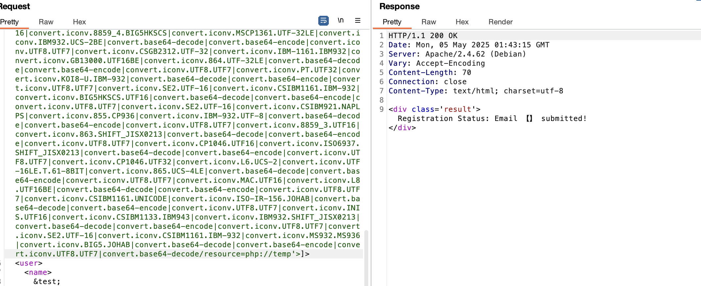  
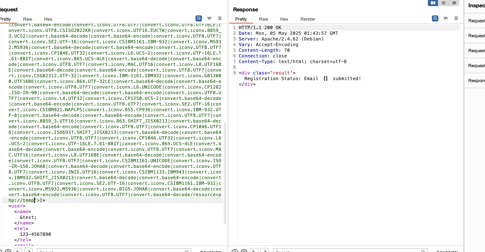  
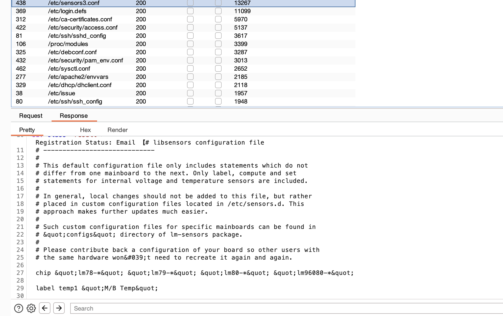  

>爆破一下没啥东西，2条路一个phpfilter研究一个是继续爆破查能看什么
>

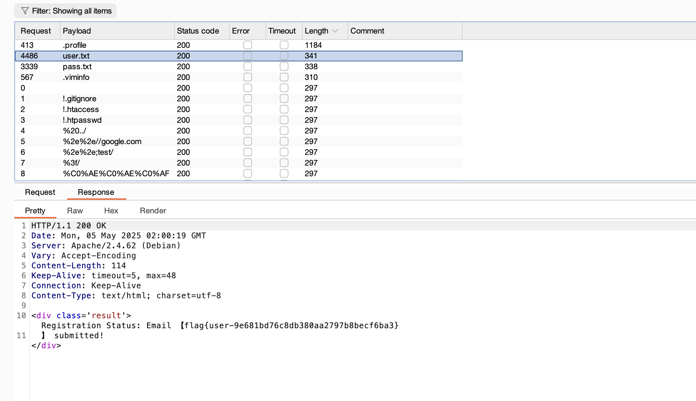  
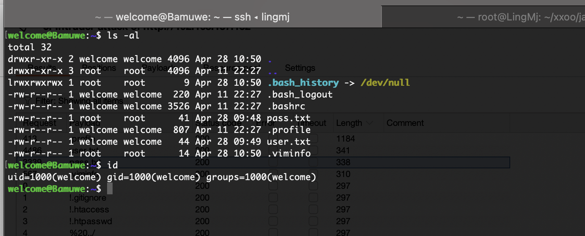  
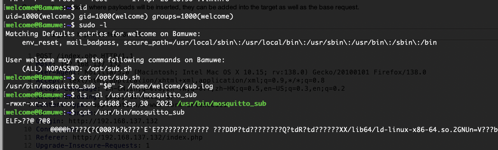  


## 提权

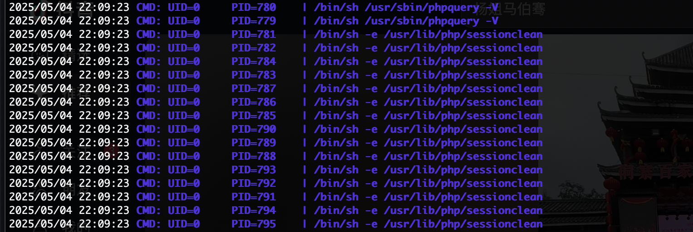  
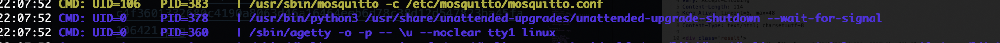  

>有个东西root运行
>

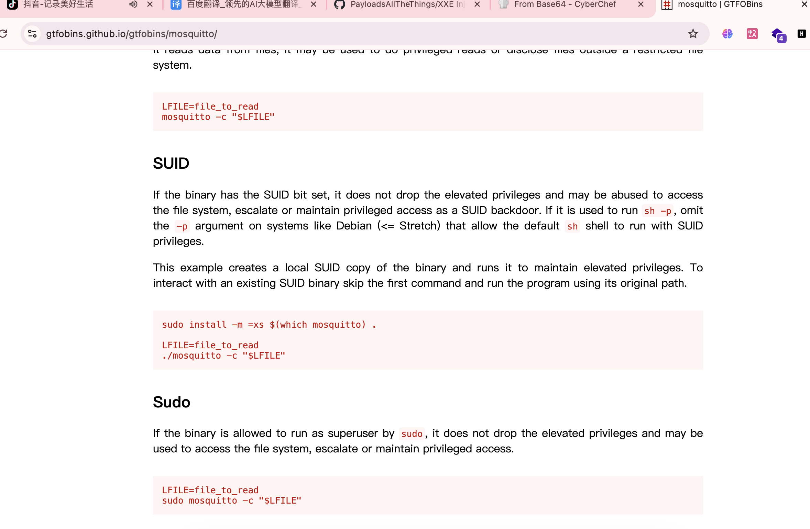  

>要是能劫持就结束了
>

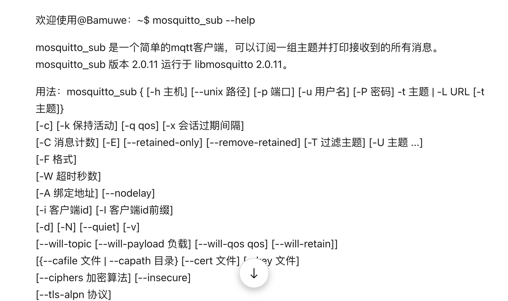  

>接受信息的话而且有文件在根目录选择软连接方式
>

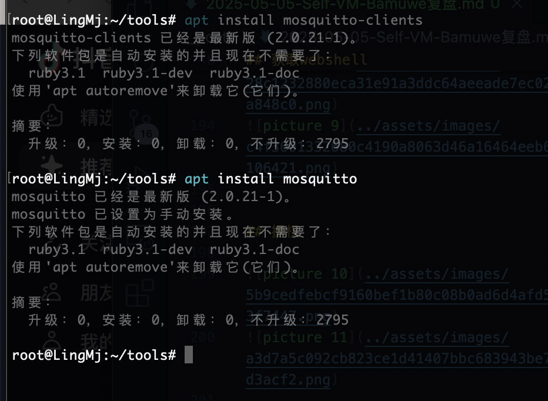  

>之前安装过了
>

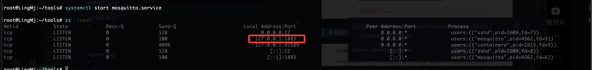  
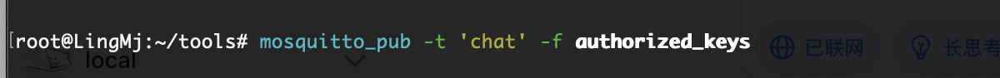  

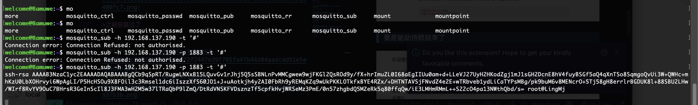  
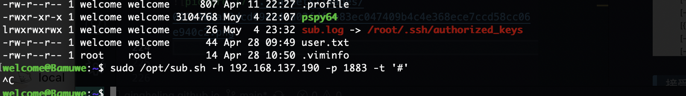  
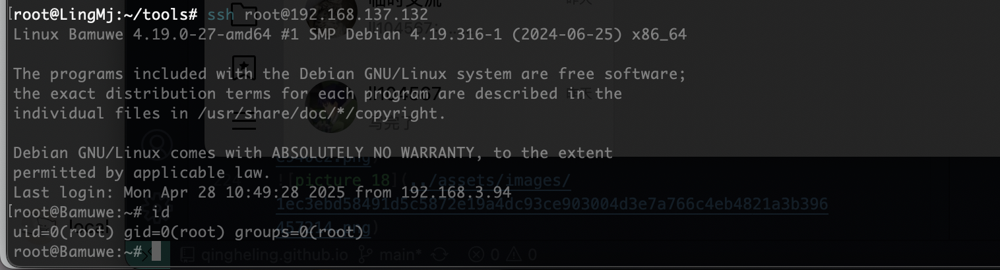  

>好了结束
>


>userflag:
>
>rootflag:
>