## 网段扫描
```
root@LingMj:~/tools# arp-scan -l
Interface: eth0, type: EN10MB, MAC: 00:0c:29:d1:27:55, IPv4: 192.168.137.190
Starting arp-scan 1.10.0 with 256 hosts (https://github.com/royhills/arp-scan)
192.168.137.1	3e:21:9c:12:bd:a3	(Unknown: locally administered)
192.168.137.59	a0:78:17:62:e5:0a	Apple, Inc.
192.168.137.84	3e:21:9c:12:bd:a3	(Unknown: locally administered)

8 packets received by filter, 0 packets dropped by kernel
Ending arp-scan 1.10.0: 256 hosts scanned in 2.036 seconds (125.74 hosts/sec). 3 responded
```

## 端口扫描

```
Starting Nmap 7.95 ( https://nmap.org ) at 2025-05-05 01:08 EDT
Nmap scan report for Kakeru.mshome.net (192.168.137.84)
Host is up (0.033s latency).
Not shown: 65533 closed tcp ports (reset)
PORT   STATE SERVICE VERSION
22/tcp open  ssh     OpenSSH 8.4p1 Debian 5+deb11u3 (protocol 2.0)
| ssh-hostkey: 
|   3072 f6:a3:b6:78:c4:62:af:44:bb:1a:a0:0c:08:6b:98:f7 (RSA)
|   256 bb:e8:a2:31:d4:05:a9:c9:31:ff:62:f6:32:84:21:9d (ECDSA)
|_  256 3b:ae:34:64:4f:a5:75:b9:4a:b9:81:f9:89:76:99:eb (ED25519)
80/tcp open  http    Apache httpd 2.4.62 ((Debian))
|_http-title: User welcome's password is here.
|_http-server-header: Apache/2.4.62 (Debian)
MAC Address: 3E:21:9C:12:BD:A3 (Unknown)
Service Info: OS: Linux; CPE: cpe:/o:linux:linux_kernel

Service detection performed. Please report any incorrect results at https://nmap.org/submit/ .
Nmap done: 1 IP address (1 host up) scanned in 17.50 seconds
```

## 获取webshell

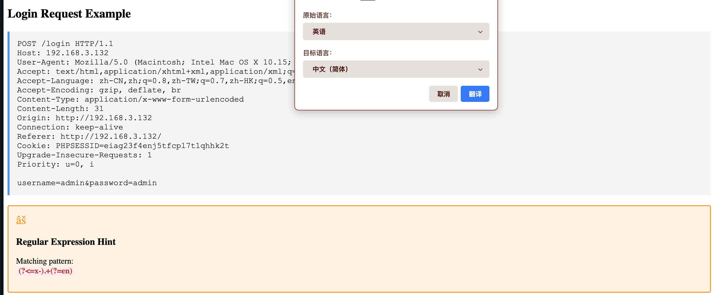  
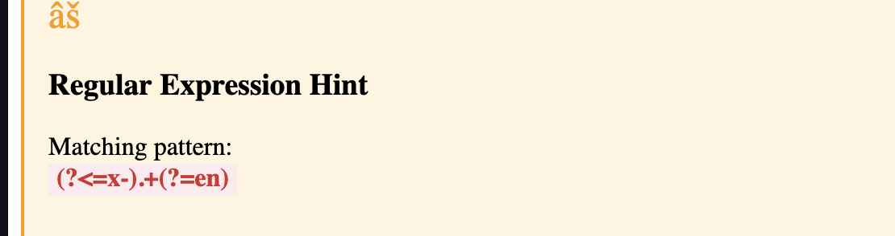  

>x-开头en结尾部分
>

  
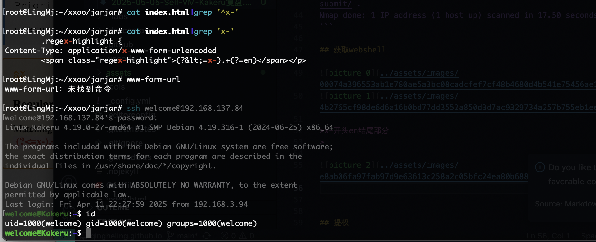  


## 提权


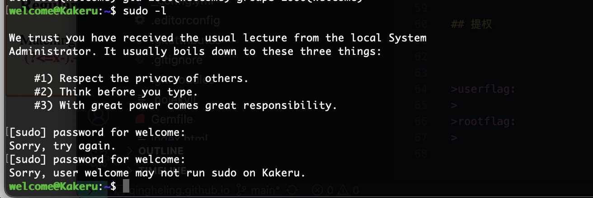  

  
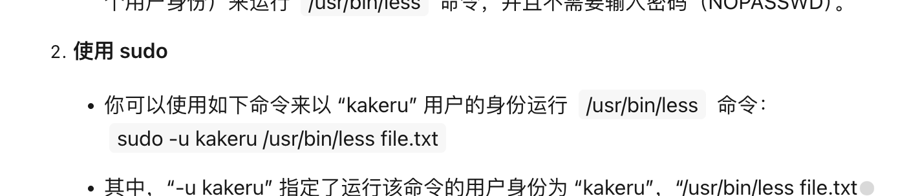  

>好吧gtp是dashazi了，压根没给我正确答案
>

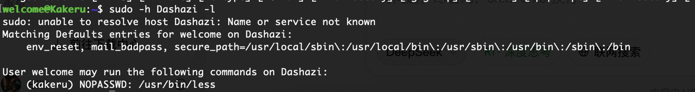  

>查了半天挨个试命令了
>

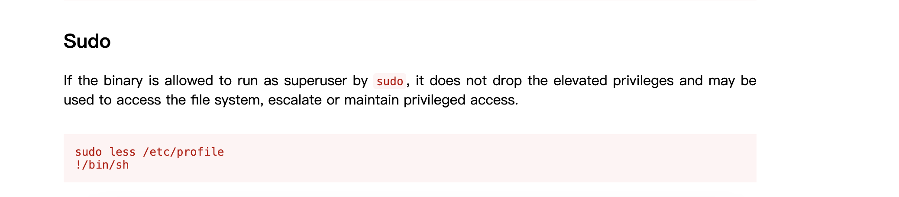  
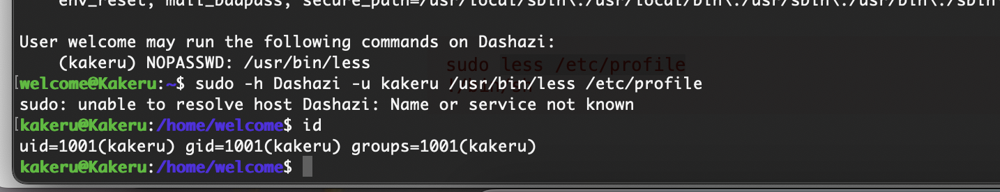  
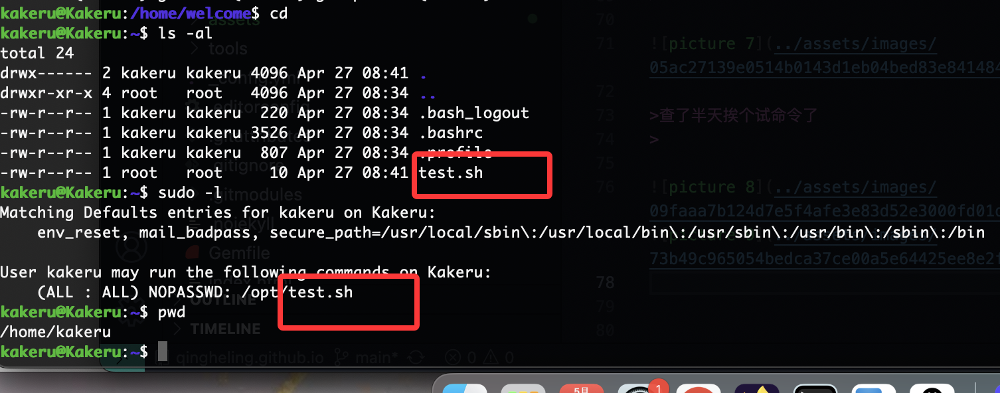  

>这是什么相同文件
>

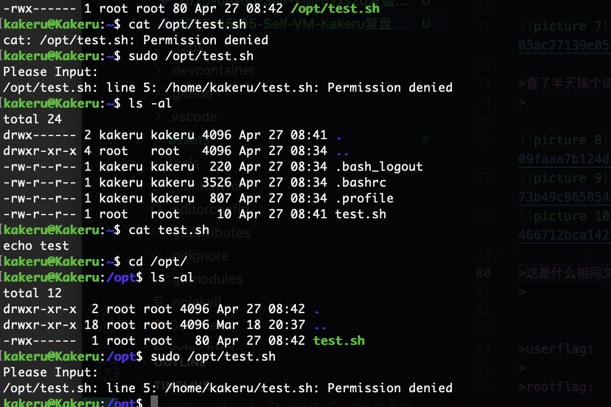  

>会自动停而且刷没权限
>

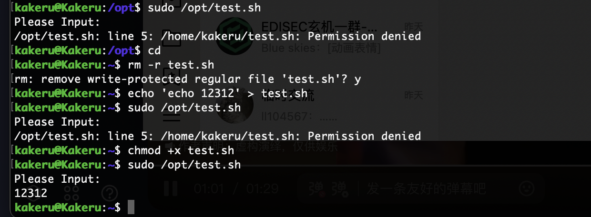  

>好像自己执行这个东西吧，主要没看到里面我也不知道输入啥，但是自己停了就执行里面的话大概率一个定时5秒吧执行home/test文件
>

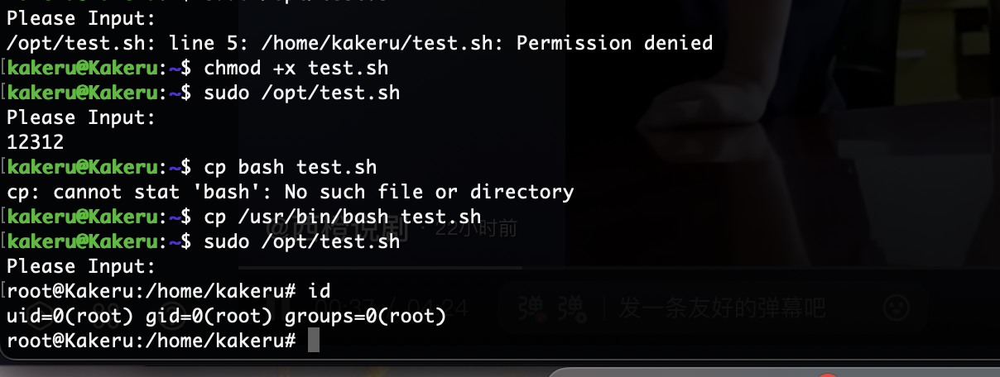  
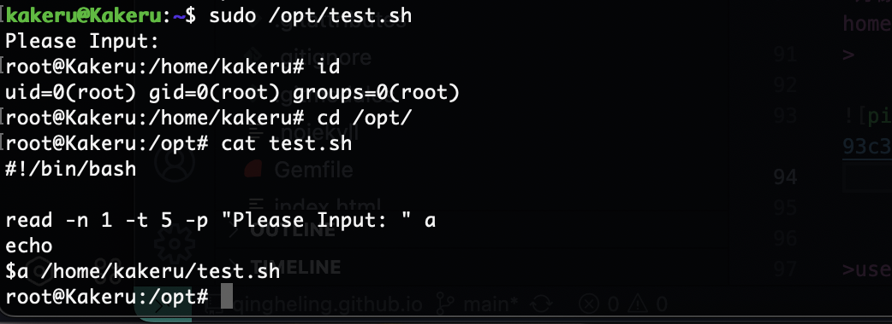  

>还真是，结束了
>


>userflag:
>
>rootflag:
>
