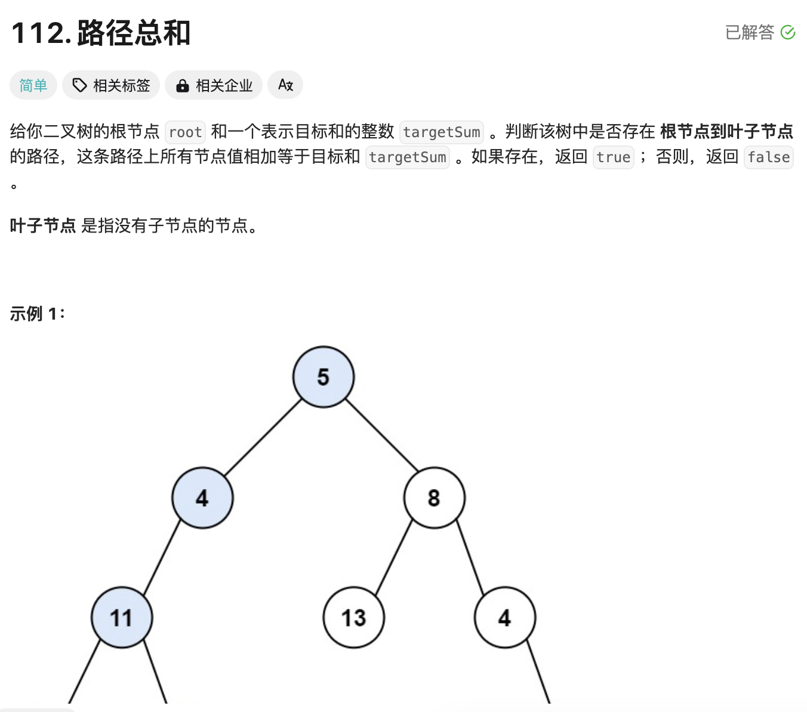
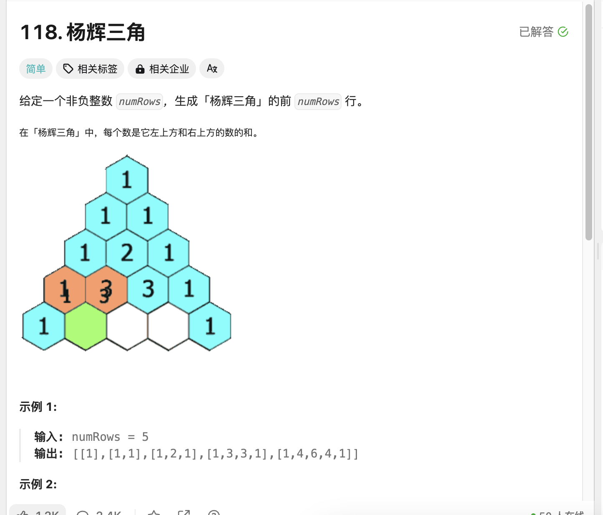
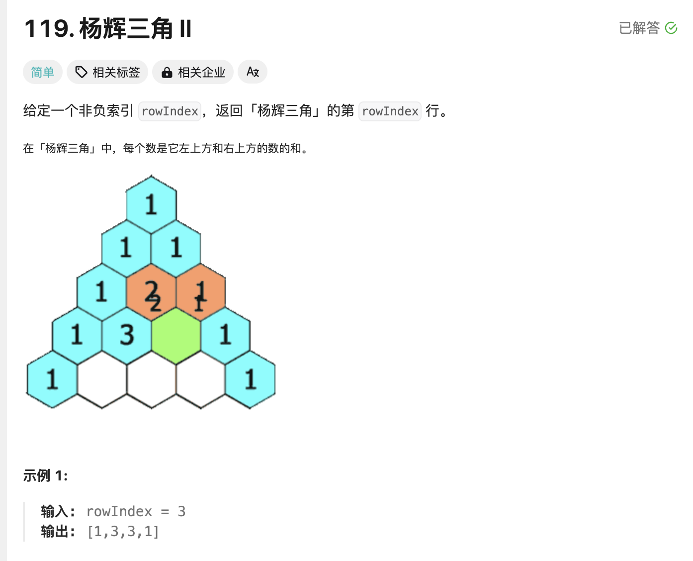
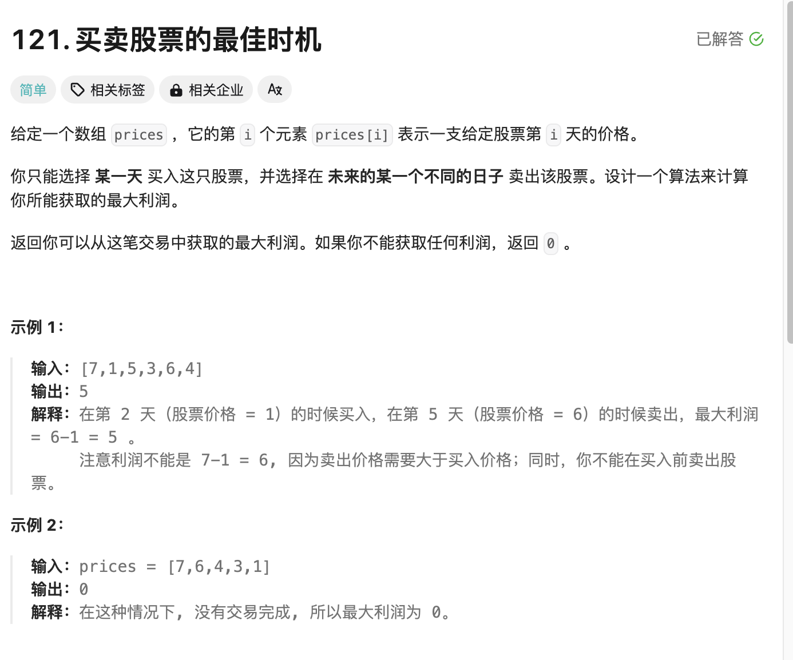
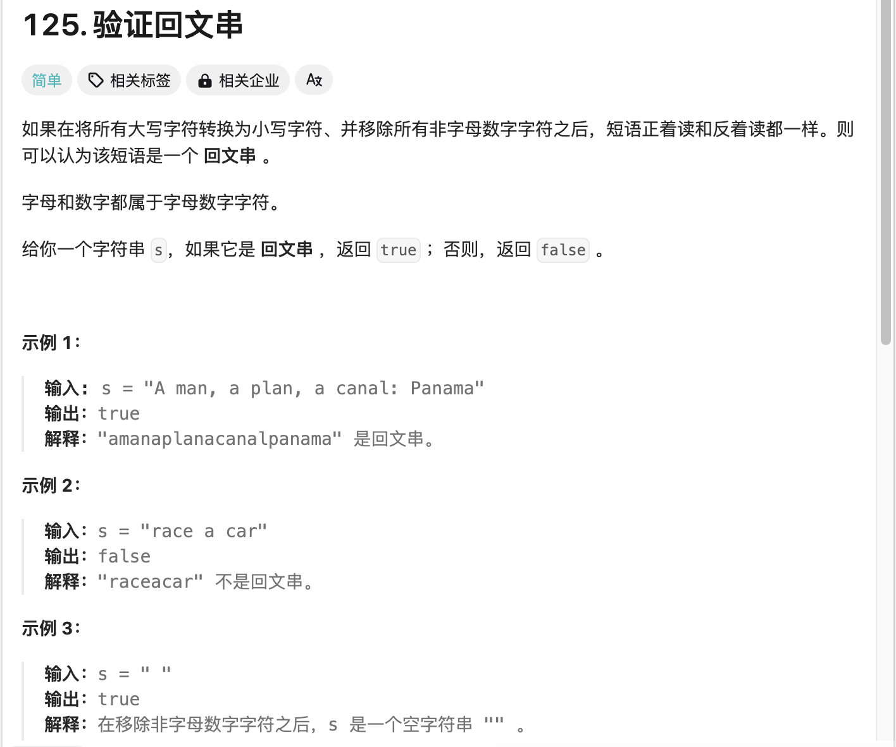
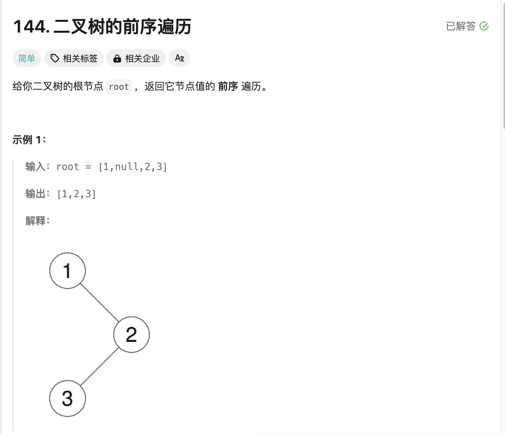
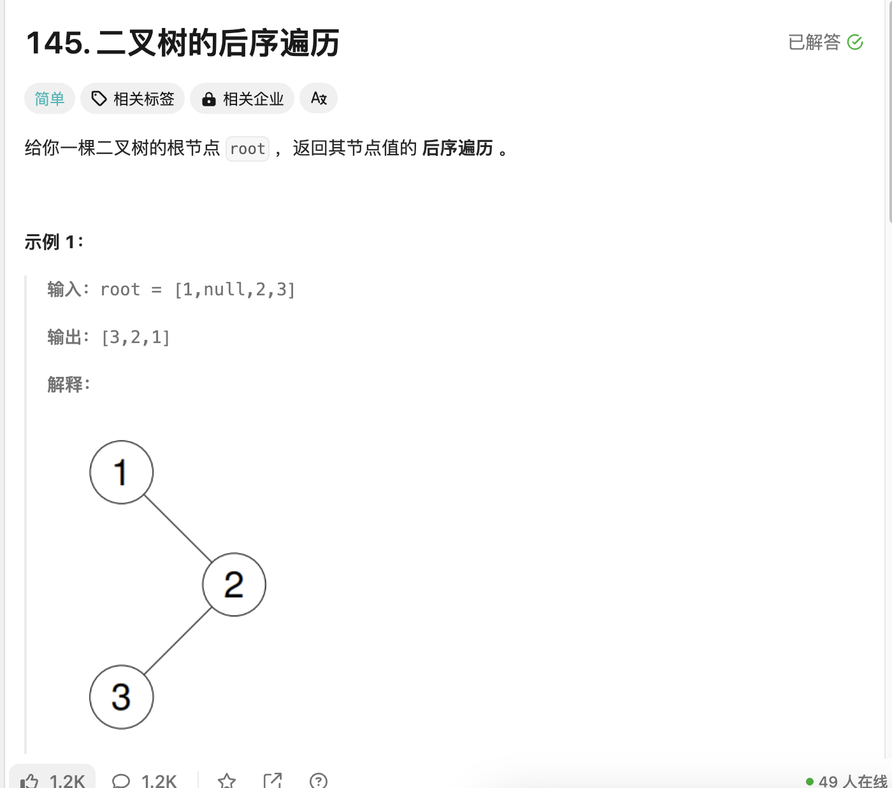

## LeetCode题目练习

>之前做了一些题没补充补充一下wp
>


## 第一题 路径总和

  

```
# Definition for a binary tree node.
# class TreeNode:
#     def __init__(self, val=0, left=None, right=None):
#         self.val = val
#         self.left = left
#         self.right = right
class Solution:
    def hasPathSum(self, root: Optional[TreeNode], targetSum: int) -> bool:
        if not root:
            return False
        
        remaining = targetSum - root.val

        if not root.left and not root.right:
            return remaining == 0
        
        return self.hasPathSum(root.left, remaining) or self.hasPathSum(root.right, remaining)
```

>这个主要判断的是左边路径或者右边的路径是否等于给定的数值，可以看到我用到递归的形式先判断root是否为空，空就false，不空情况当左右两边没有树叶看数值减去之前的树是否为0，0代表路径总长true
>

## 第二题 杨辉三角

  

```
class Solution:
    def generate(self, numRows: int) -> List[List[int]]:
        if numRows == 0:
            return [[]]
        
        target = [[1]]
        for i in range(1, numRows):
            pre_now = target[-1]
            new_now = [1]

            for j in range(1, i):
                new_now.append(pre_now[j-1] + pre_now[j])

            new_now.append(1)
            target.append(new_now)
        return target

```

>杨辉三角的话经典，不做解释
>

## 第三题 杨辉三角 II

  

```
class Solution:
    def getRow(self, rowIndex: int) -> List[int]:
        if rowIndex == 0:
            return [1]
        
        target = [[1]]
        for i in range(1, rowIndex+1):
            pre_now = target[-1]
            new_now = [1]
            for j in range(1, i):
                new_now.append(pre_now[j-1] + pre_now[j])

            new_now.append(1)
            target.append(new_now)

        return target[-1]       
```

>道理一样加1即可
>

## 第四题 买卖股票的最佳时机

  


```
class Solution:
    def maxProfit(self, prices: List[int]) -> int:
        min_price = float('inf')
        max_profit = 0
        for price in prices:
            min_price = min(min_price, price)
            max_profit = max(max_profit, price - min_price)
        return max_profit
```

>先设定无穷大的min和0值max，利用循环的形式找出最小的进货值，最大出货值，这样就能出最大利润
>


## 第五题 验证回文串

  


```
class Solution:
    def isPalindrome(self, s: str) -> bool:
        left, right = 0, len(s) - 1
        while left < right:
            while left < right and not s[left].isalnum():
                left += 1
            while left < right and not s[right].isalnum():
                right -= 1
            if s[left].lower() != s[right].lower():
                return False
            left += 1
            right -= 1
        return True
        
```

>利用左右指针去做，先定义左右指针，接着左指针必须小于右指针，如果左指针或者右指针出现空格，直接移动指针，判断左右指针大小写是否相同，循环结束返回true
>


## 第六题 二叉树的前序遍历

  

```
# Definition for a binary tree node.
# class TreeNode:
#     def __init__(self, val=0, left=None, right=None):
#         self.val = val
#         self.left = left
#         self.right = right
class Solution:
    def preorderTraversal(self, root: Optional[TreeNode]) -> List[int]:
        def preorder(root: TreeNode):
            if not root:
                return 
            res.append(root.val)
            preorder(root.left)
            preorder(root.right)
        
        res = list()
        preorder(root)
        return res
```

>还是使用递归方式操作，先定义一个当前树，利用res接收树当前值如果出现空跳过进行下一个，遍历左树，再遍历右树，返回即可
>

## 第七题 二叉树的后序遍历

  

```
# Definition for a binary tree node.
# class TreeNode:
#     def __init__(self, val=0, left=None, right=None):
#         self.val = val
#         self.left = left
#         self.right = right
class Solution:
    def postorderTraversal(self, root: Optional[TreeNode]) -> List[int]:
        def postorder(root: TreeNode):
            if not root:
                return 
            
            postorder(root.left)
            postorder(root.right)
            res.append(root.val)

        res = list()
        postorder(root)
        return res
```

>这个完全用的还是前序代码只需要改变的是先遍历树最后加上root当前值即可，遇到空节点返回
>

## 第八题 Excel 表列名称

  

```
class Solution:
    def convertToTitle(self, columnNumber: int) -> str:
        ans = list()
        while columnNumber > 0:
            a0 = (columnNumber - 1) % 26 + 1
            ans.append(chr(a0 - 1 + ord("A")))
            columnNumber = (columnNumber - a0) // 26
        return "".join(ans[::-1])

        
```


