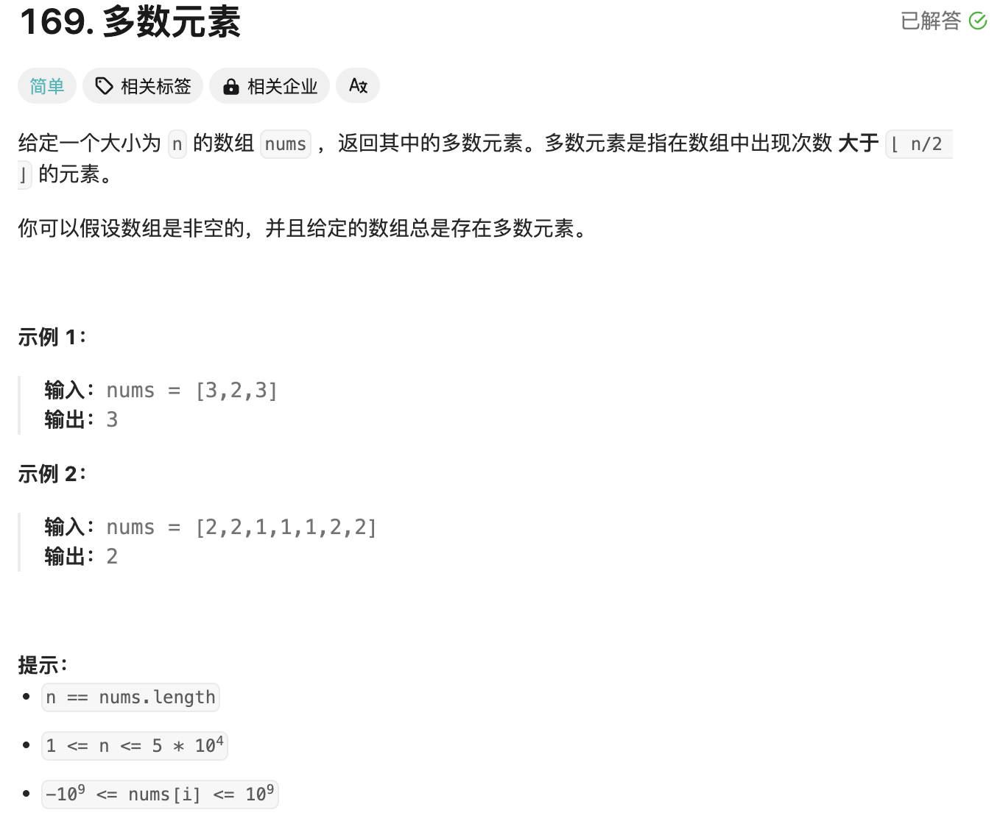
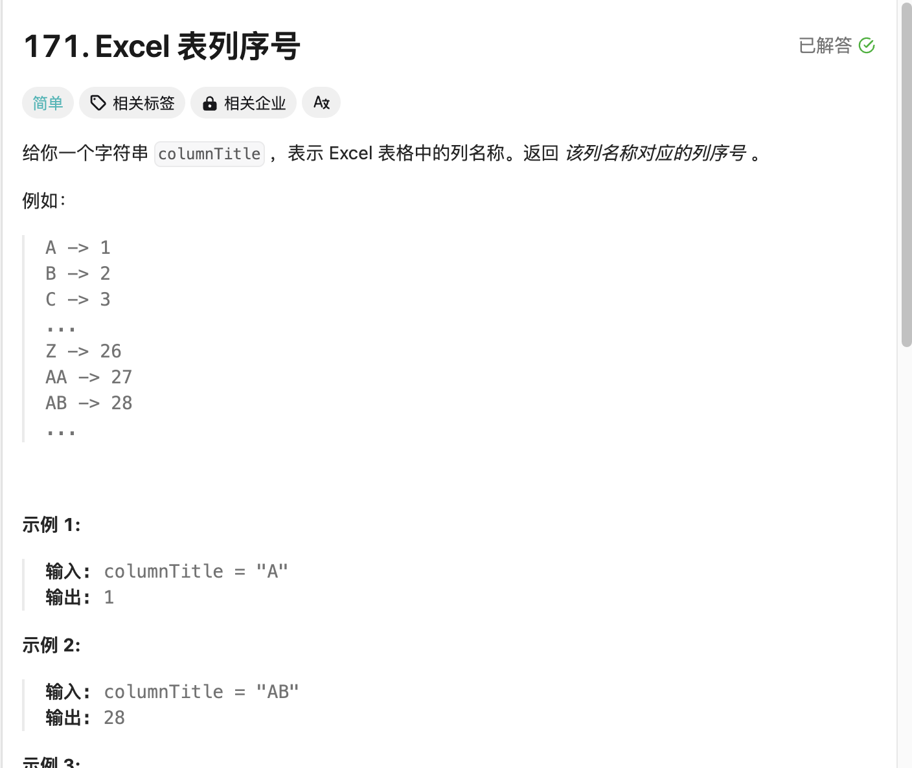
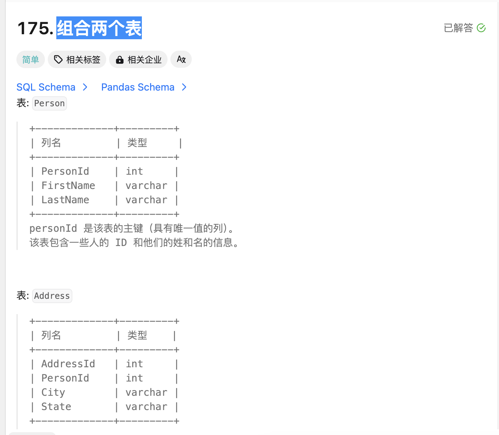
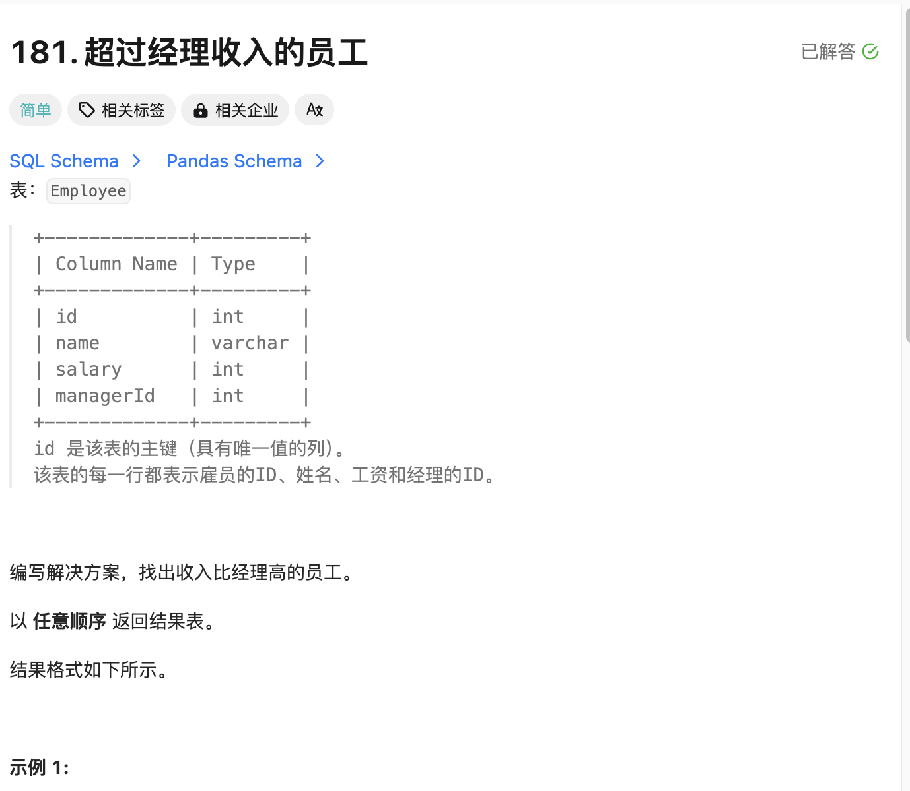
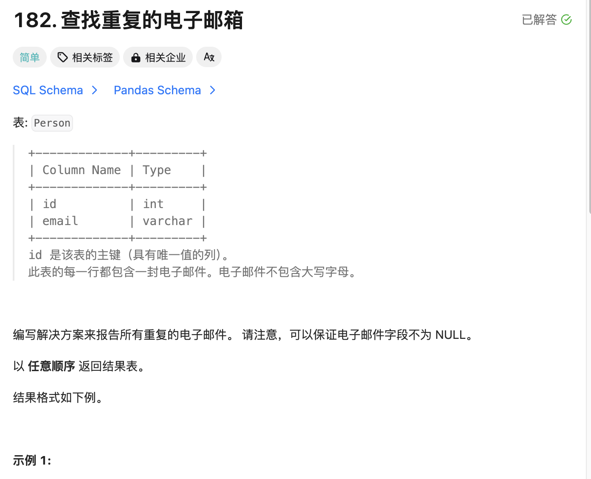
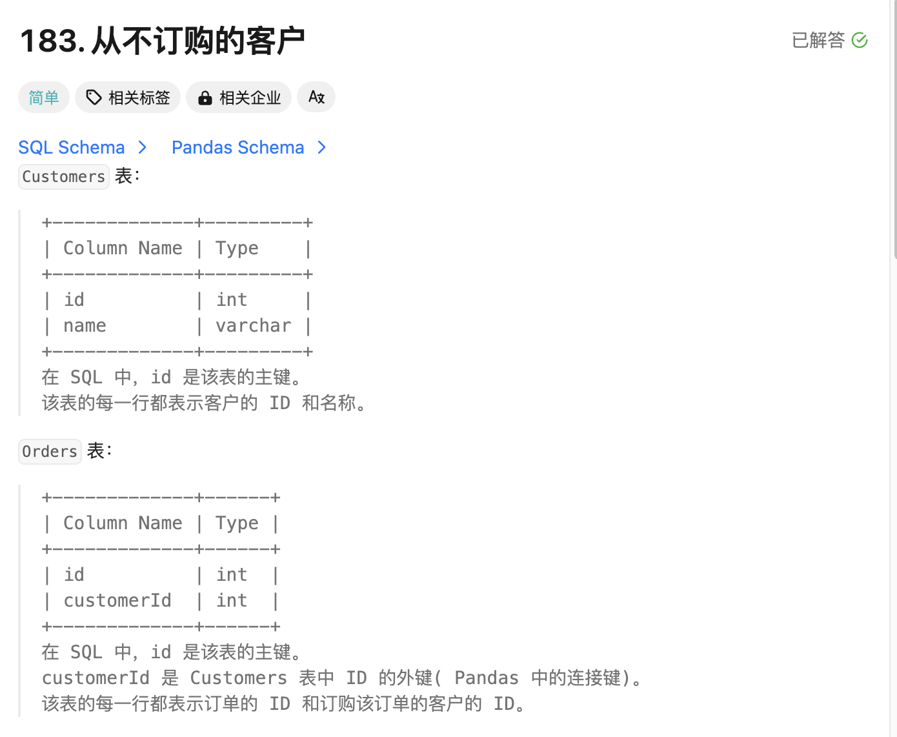
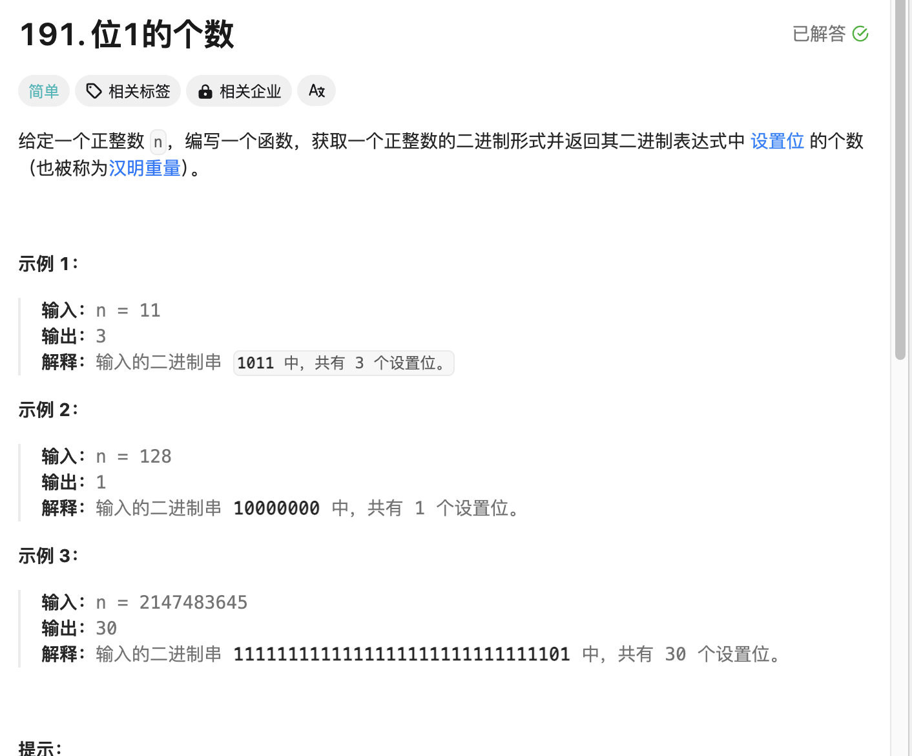

## 第一题 多数元素

  

```
class Solution:
    def majorityElement(self, nums: List[int]) -> int:
        counts = collections.Counter(nums)
        return max(counts.keys(), key=counts.get)
```

>用hash表法，使用collections.Counter 类对列表 nums 中的元素进行计数。Counter 会返回一个字典，其中键是列表中的元素，值是它们对应的出现次数。最后找出最大的值
>


## 第二题 Excel 表列序号

  

```
class Solution:
    def titleToNumber(self, columnTitle: str) -> int:
        number, multiple = 0, 1
        for i in range(len(columnTitle) - 1, -1, -1):
            k = ord(columnTitle[i]) - ord("A") + 1
            number += k * multiple
            multiple *= 26
        return number
        
```

>可能解释有点问题，他先定义0和1，将字符串从后往前进行遍历，k 值是当前字母的ascii-65的意思但是因为是某些问题只能ord - ord的形式，加1保证不多余减，number记录数字，k*1是数学式转换，mul* 26为移动下一位字母
>


## 第三题 组合两个表

  

```
# Write your MySQL query statement below
select FirstName, LastName, City, State
from Person left join Address
on Person.PersonId = Address.PersonId
;
```

>先选择表字段，选择person左加入的表address，输出即可
>


## 第四题 超过经理收入的员工

  


```
# Write your MySQL query statement below
SELECT
    a.Name AS 'Employee'
FROM
    Employee AS a,
    Employee AS b
WHERE
    a.ManagerId = b.Id
        AND a.Salary > b.Salary
;
```

>这个嘛，先选择需要查询员工的名字，定义a为员工，b为领导，当a用户管理id等于b的id说明b为a领导，接着判断利润是否大于，如果大于则输出对应用户名称
>


## 第五题 查找重复的电子邮箱

  

```
# Write your MySQL query statement below
select distinct email as Email from Person group by email having count(email)>=2;
```


>这个的话就是利用计数法，出现重复都输出出来
>

## 第六题 从不订购的客户

  


```
# Write your MySQL query statement below
select customers.name as 'Customers' from customers where customers.id not in (select customerid from orders);
```

>这个没啥注意点地方，先定义自己要输出的东西，接着判断id不在里面即可
>


## 第七题 位1的个数 

  

```
class Solution:
    def hammingWeight(self, n: int) -> int:
        ret = sum(1 for i in range(32) if n & (1 << i))
        return ret
```

>检查第 i 位时，我们可以让 n 与 2 i进行与运算，当且仅当 n 的第 i 位为 1 时，运算结果不为 0，也就是循环遍历n的二进制为1的数
>


