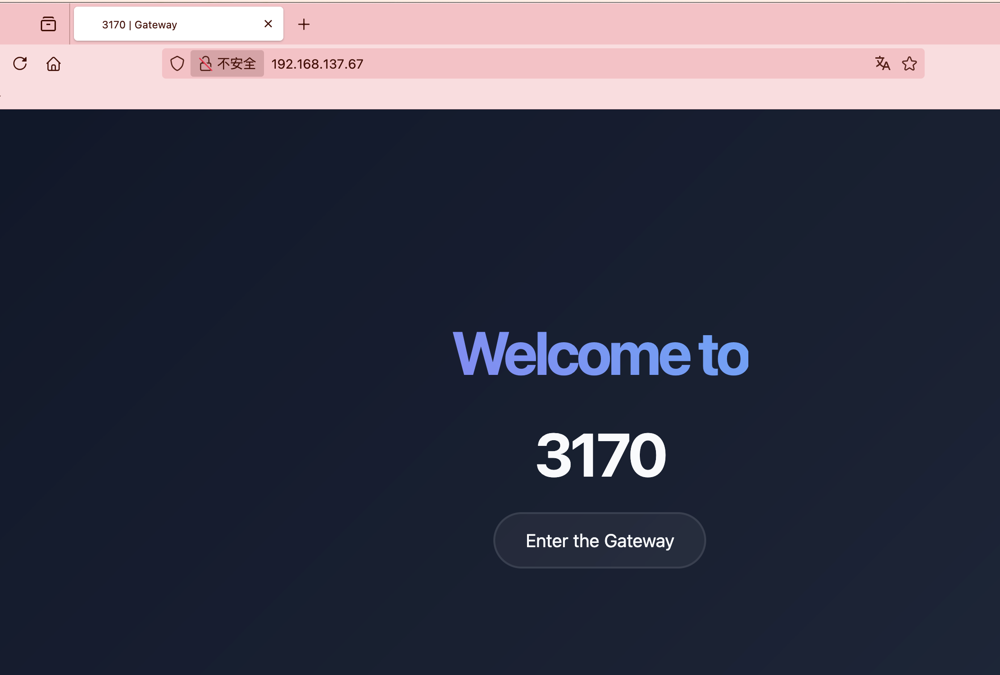
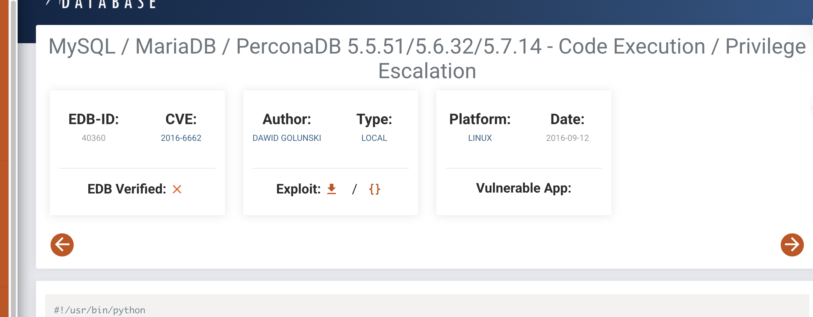
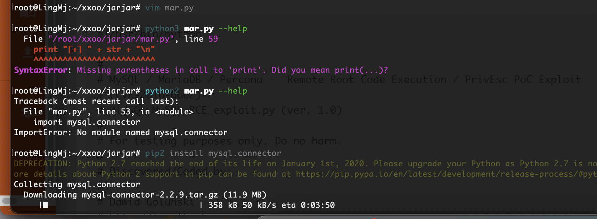
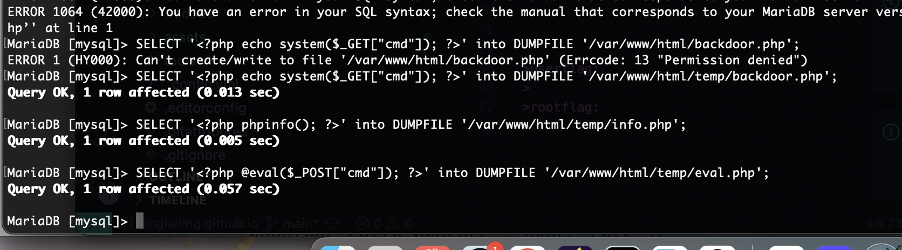
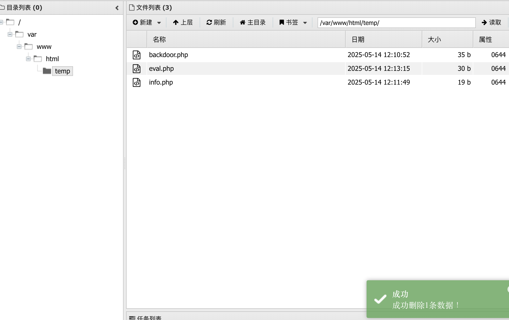
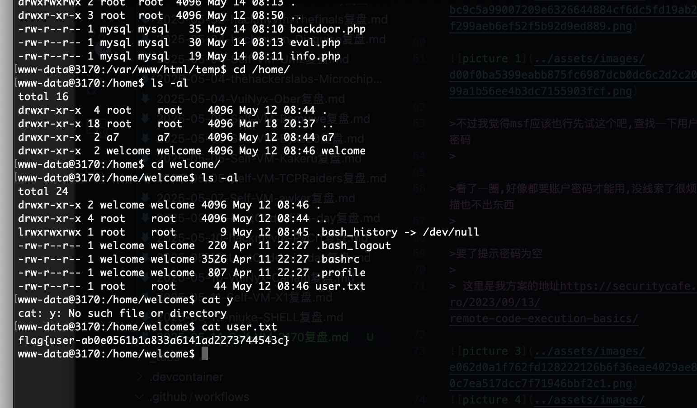
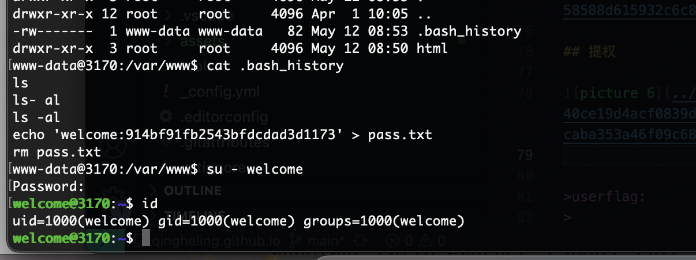
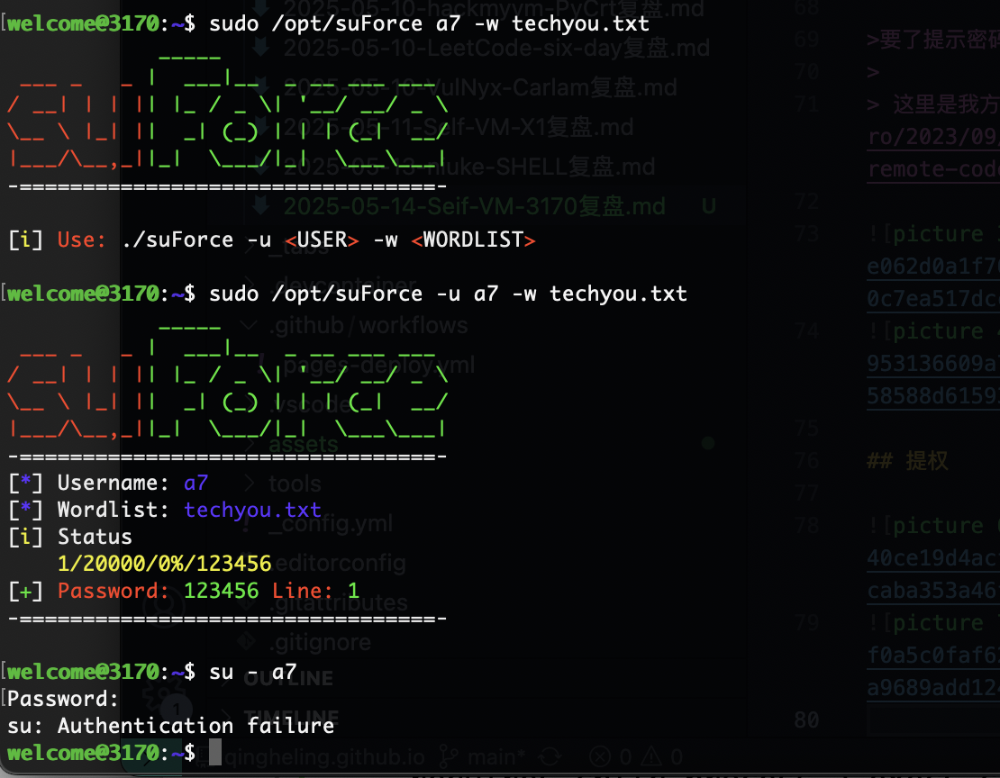
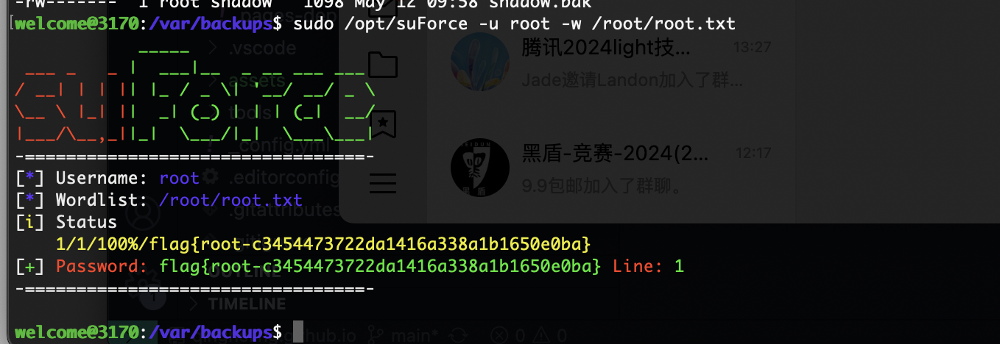

## 网段扫描
```
Interface: eth0, type: EN10MB, MAC: 00:0c:29:d1:27:55, IPv4: 192.168.137.190
Starting arp-scan 1.10.0 with 256 hosts (https://github.com/royhills/arp-scan)
192.168.137.1	3e:21:9c:12:bd:a3	(Unknown: locally administered)
192.168.137.64	a0:78:17:62:e5:0a	Apple, Inc.
192.168.137.67	3e:21:9c:12:bd:a3	(Unknown: locally administered)

6 packets received by filter, 0 packets dropped by kernel
Ending arp-scan 1.10.0: 256 hosts scanned in 2.136 seconds (119.85 hosts/sec). 3 responded
```

## 端口扫描

```
root@LingMj:~# nmap -p- -sV -sC 192.168.137.67 
Starting Nmap 7.95 ( https://nmap.org ) at 2025-05-13 19:47 EDT
Nmap scan report for 3170.mshome.net (192.168.137.67)
Host is up (0.038s latency).
Not shown: 65532 closed tcp ports (reset)
PORT     STATE SERVICE VERSION
22/tcp   open  ssh     OpenSSH 8.4p1 Debian 5+deb11u3 (protocol 2.0)
| ssh-hostkey: 
|   3072 f6:a3:b6:78:c4:62:af:44:bb:1a:a0:0c:08:6b:98:f7 (RSA)
|   256 bb:e8:a2:31:d4:05:a9:c9:31:ff:62:f6:32:84:21:9d (ECDSA)
|_  256 3b:ae:34:64:4f:a5:75:b9:4a:b9:81:f9:89:76:99:eb (ED25519)
80/tcp   open  http    Apache httpd 2.4.62 ((Debian))
|_http-title: 3170 | Gateway
3306/tcp open  mysql   MariaDB 5.5.5-10.5.23
| mysql-info: 
|   Protocol: 10
|   Version: 5.5.5-10.5.23-MariaDB-0+deb11u1
|   Thread ID: 32
|   Capabilities flags: 63486
|   Some Capabilities: FoundRows, InteractiveClient, Support41Auth, Speaks41ProtocolOld, IgnoreSigpipes, DontAllowDatabaseTableColumn, ODBCClient, SupportsTransactions, SupportsCompression, LongColumnFlag, SupportsLoadDataLocal, ConnectWithDatabase, IgnoreSpaceBeforeParenthesis, Speaks41ProtocolNew, SupportsMultipleResults, SupportsAuthPlugins, SupportsMultipleStatments
|   Status: Autocommit
|   Salt: Xa_;E)=9E/XQjAH&$#}q
|_  Auth Plugin Name: mysql_native_password
MAC Address: 3E:21:9C:12:BD:A3 (Unknown)
Service Info: OS: Linux; CPE: cpe:/o:linux:linux_kernel

Service detection performed. Please report any incorrect results at https://nmap.org/submit/ .
Nmap done: 1 IP address (1 host up) scanned in 21.22 seconds
```

## 获取webshell

  
  

  

>不过我觉得msf应该也行先试这个吧,查找一下用户和密码
>

>看了一圈,好像都要账户密码才能用,没线索了很烦扫描也不出东西
>

>要了提示密码为空
>
> 这里是我方案的地址https://securitycafe.ro/2023/09/13/remote-code-execution-basics/

  
  

## 提权

  
  
  

>这是什么东西,就是不运行看来应该是什么特殊问题
>

  


>userflag:https://mega.nz/file/erRTlTpJ#IyiEap4wYvD69Zmr54_XusVmmXyPHXu0Za7729tJNKU
>
>rootflag:
>