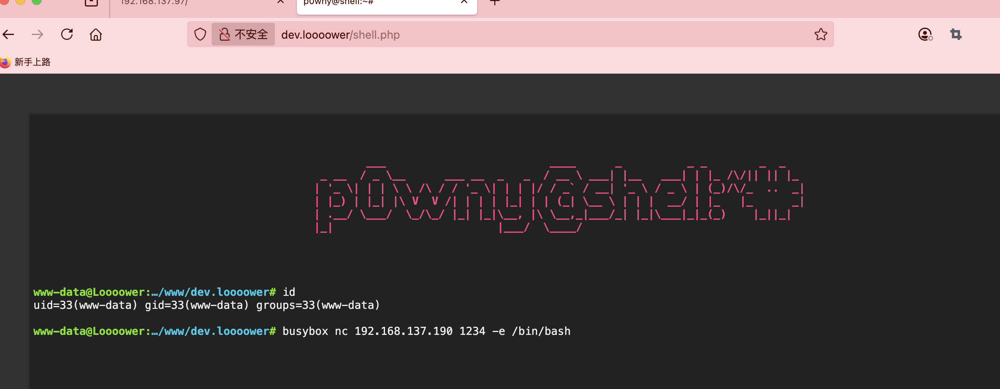
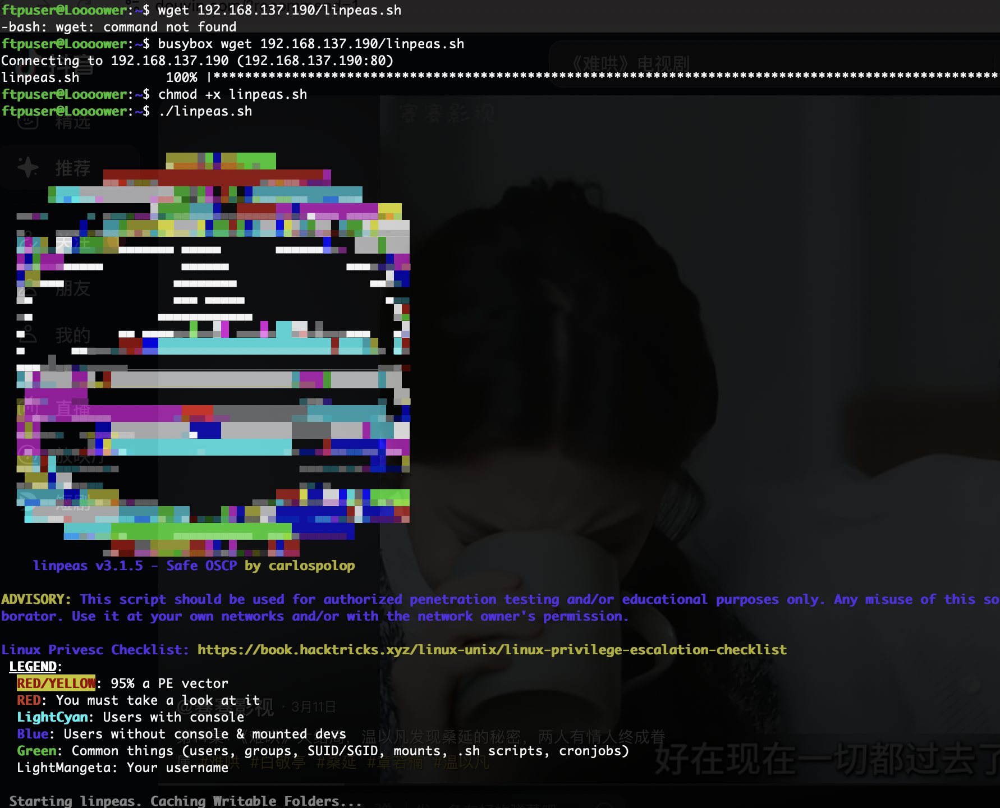
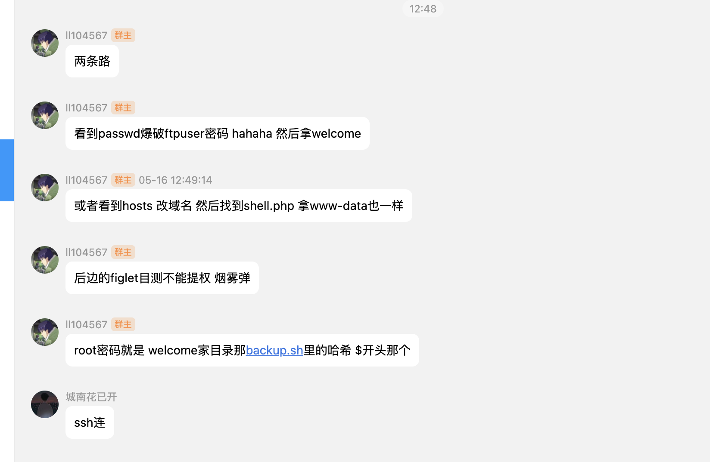
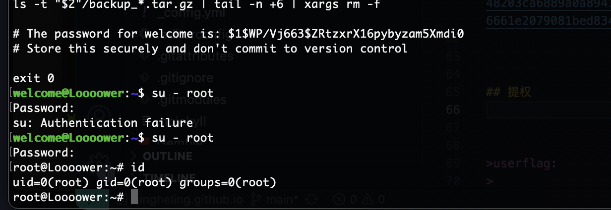

## 网段扫描
```
Interface: eth0, type: EN10MB, MAC: 00:0c:29:d1:27:55, IPv4: 192.168.137.190
Starting arp-scan 1.10.0 with 256 hosts (https://github.com/royhills/arp-scan)
192.168.137.1	3e:21:9c:12:bd:a3	(Unknown: locally administered)
192.168.137.64	a0:78:17:62:e5:0a	Apple, Inc.
192.168.137.97	3e:21:9c:12:bd:a3	(Unknown: locally administered)
192.168.137.114	62:2f:e8:e4:77:5d	(Unknown: locally administered)
```

## 端口扫描

```
Starting Nmap 7.95 ( https://nmap.org ) at 2025-05-15 22:43 EDT
Nmap scan report for Loooower.mshome.net (192.168.137.97)
Host is up (0.0071s latency).
Not shown: 65532 closed tcp ports (reset)
PORT   STATE SERVICE VERSION
21/tcp open  ftp     vsftpd 3.0.3
| ftp-anon: Anonymous FTP login allowed (FTP code 230)
| drwxr-xr-x    2 106      113          4096 May 15 08:03 confidential
|_drwxr-xr-x    2 106      113          4096 May 15 07:37 uploads
| ftp-syst: 
|   STAT: 
| FTP server status:
|      Connected to 192.168.137.190
|      Logged in as ftp
|      TYPE: ASCII
|      Session bandwidth limit in byte/s is 102400
|      Session timeout in seconds is 600
|      Control connection is plain text
|      Data connections will be plain text
|      At session startup, client count was 3
|      vsFTPd 3.0.3 - secure, fast, stable
|_End of status
22/tcp open  ssh     OpenSSH 8.4p1 Debian 5+deb11u3 (protocol 2.0)
| ssh-hostkey: 
|   3072 f6:a3:b6:78:c4:62:af:44:bb:1a:a0:0c:08:6b:98:f7 (RSA)
|   256 bb:e8:a2:31:d4:05:a9:c9:31:ff:62:f6:32:84:21:9d (ECDSA)
|_  256 3b:ae:34:64:4f:a5:75:b9:4a:b9:81:f9:89:76:99:eb (ED25519)
80/tcp open  http    Apache httpd 2.4.62 ((Debian))
|_http-server-header: Apache/2.4.62 (Debian)
|_http-title: Site doesn't have a title (text/html).
MAC Address: 3E:21:9C:12:BD:A3 (Unknown)
Service Info: OSs: Unix, Linux; CPE: cpe:/o:linux:linux_kernel
```

## 获取webshell
  

  

>标准的形式
>

  


## 提权
  

>结束
>


>userflag:
>
>rootflag:
>