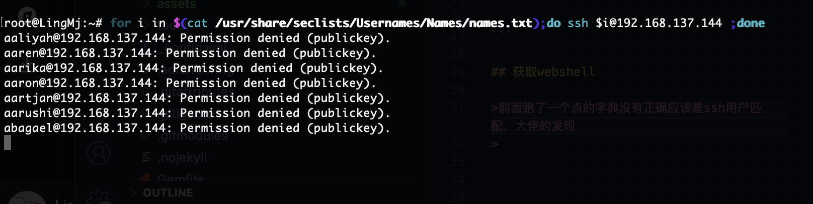
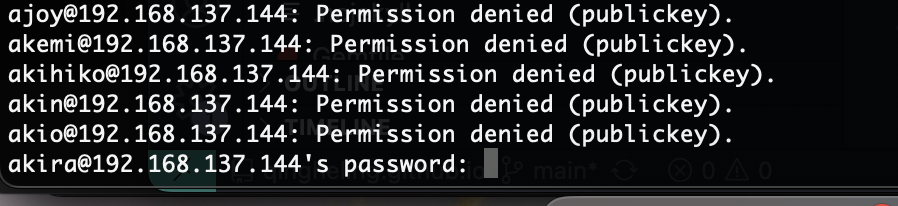
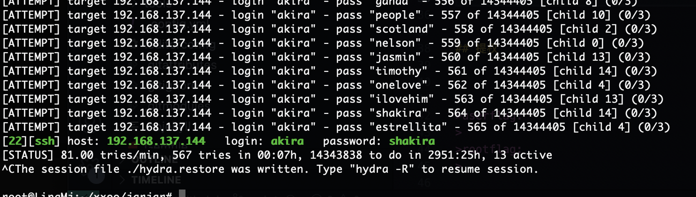
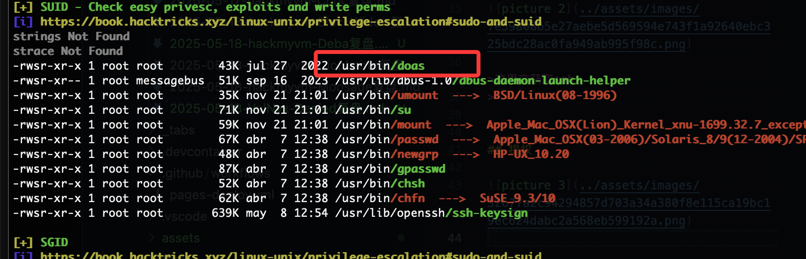
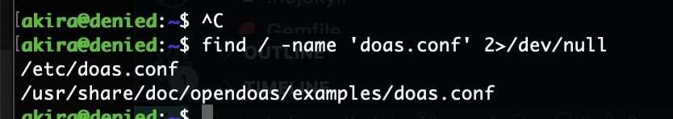
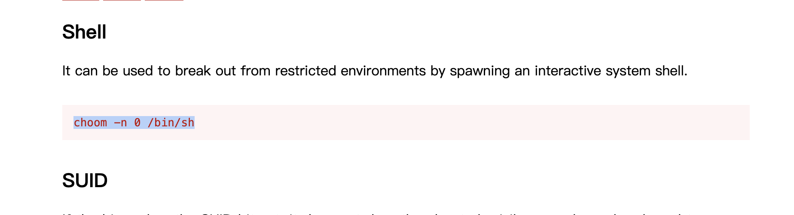
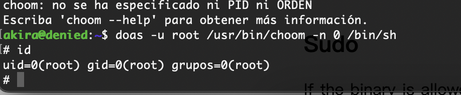

## 网段扫描
```
root@LingMj:~# arp-scan -l
Interface: eth0, type: EN10MB, MAC: 00:0c:29:d1:27:55, IPv4: 192.168.137.190
Starting arp-scan 1.10.0 with 256 hosts (https://github.com/royhills/arp-scan)
192.168.137.1	3e:21:9c:12:bd:a3	(Unknown: locally administered)
192.168.137.64	a0:78:17:62:e5:0a	Apple, Inc.
192.168.137.144	3e:21:9c:12:bd:a3	(Unknown: locally administered)

8 packets received by filter, 0 packets dropped by kernel
Ending arp-scan 1.10.0: 256 hosts scanned in 2.044 seconds (125.24 hosts/sec). 3 responded
```

## 端口扫描

```
22/tcp   open  ssh     OpenSSH 8.4p1 Debian 5+deb11u3 (protocol 2.0)
| ssh-hostkey: 
|   3072 f6:a3:b6:78:c4:62:af:44:bb:1a:a0:0c:08:6b:98:f7 (RSA)
|   256 bb:e8:a2:31:d4:05:a9:c9:31:ff:62:f6:32:84:21:9d (ECDSA)
|_  256 3b:ae:34:64:4f:a5:75:b9:4a:b9:81:f9:89:76:99:eb (ED25519)
80/tcp   open  http    Apache httpd 2.4.62 ((Debian))
```

## 获取webshell

>前面跑了一个点的字典没有正确应该是ssh用户匹配，大佬的发现
>
  
  
  

>这里交获取ssh
>


## 提权

  
  
  

>里面没有还是得爆破
>

  
  
  

>好了结束了，全是大佬思路
>

>userflag:
>
>rootflag:
>
