## 网段扫描
```
root@LingMj:~/tools# arp-scan -l                     
Interface: eth0, type: EN10MB, MAC: 00:0c:29:d1:27:55, IPv4: 192.168.137.190
Starting arp-scan 1.10.0 with 256 hosts (https://github.com/royhills/arp-scan)
192.168.137.1	3e:21:9c:12:bd:a3	(Unknown: locally administered)
192.168.137.41	3e:21:9c:12:bd:a3	(Unknown: locally administered)
192.168.137.64	a0:78:17:62:e5:0a	Apple, Inc.

8 packets received by filter, 0 packets dropped by kernel
Ending arp-scan 1.10.0: 256 hosts scanned in 2.060 seconds (124.27 hosts/sec). 3 responded
```

## 端口扫描

```
Starting Nmap 7.95 ( https://nmap.org ) at 2025-05-21 04:38 EDT
Nmap scan report for bunny.mshome.net (192.168.137.41)
Host is up (0.0071s latency).
Not shown: 65533 closed tcp ports (reset)
PORT   STATE SERVICE VERSION
22/tcp open  ssh     OpenSSH 7.9p1 Debian 10+deb10u2 (protocol 2.0)
| ssh-hostkey: 
|   2048 98:7a:07:5b:ed:f7:76:e3:f5:2e:10:16:ba:61:dd:77 (RSA)
|   256 bc:f8:11:12:e7:cb:20:c5:6c:87:00:b5:57:43:22:d3 (ECDSA)
|_  256 9a:61:00:d8:47:fb:7c:b1:a3:4d:4c:f6:8d:5e:40:59 (ED25519)
80/tcp open  http    Apache httpd 2.4.38 ((Debian))
|_http-title: Site doesn't have a title (text/html; charset=UTF-8).
|_http-server-header: Apache/2.4.38 (Debian)
MAC Address: 3E:21:9C:12:BD:A3 (Unknown)
Service Info: OS: Linux; CPE: cpe:/o:linux:linux_kernel

Service detection performed. Please report any incorrect results at https://nmap.org/submit/ .
Nmap done: 1 IP address (1 host up) scanned in 35.14 seconds
```

## 获取webshell

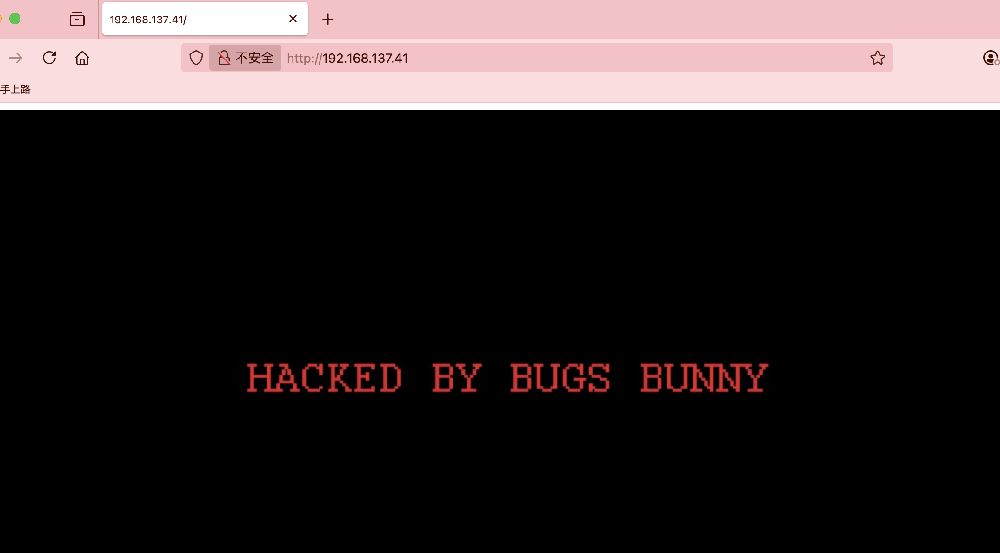  
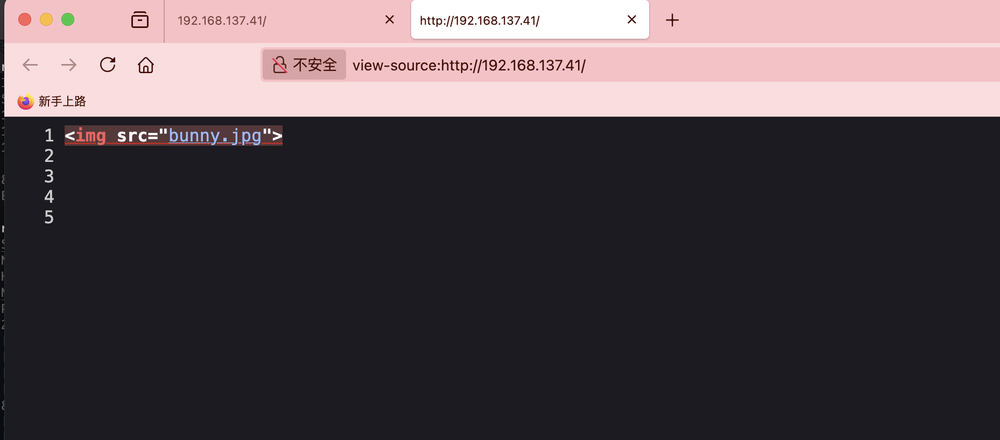  
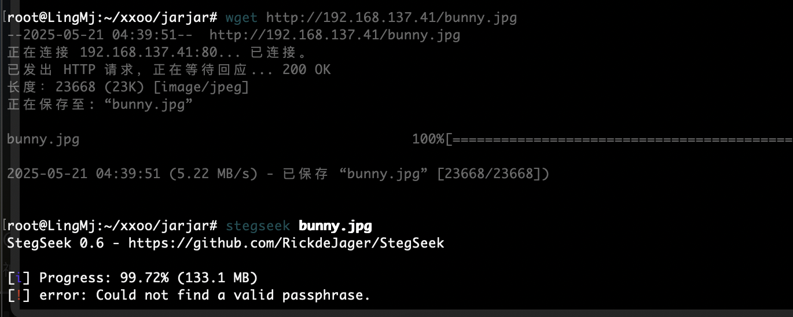  
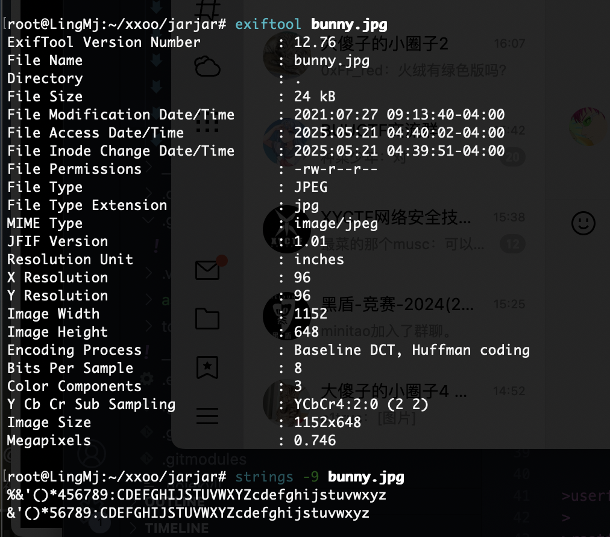  

>普通图片
>

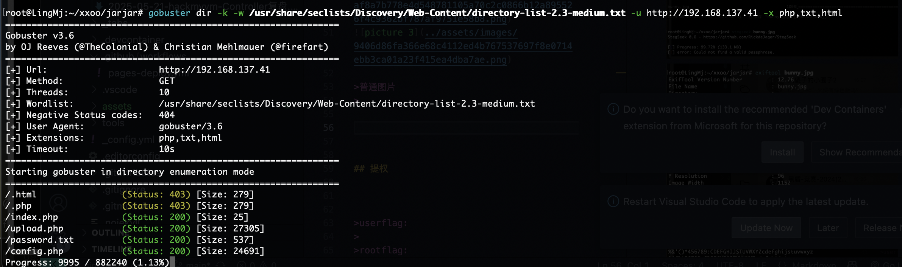  
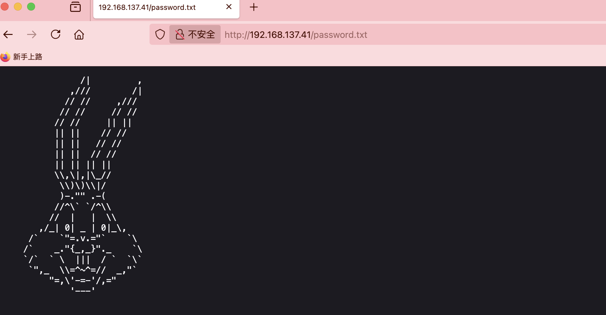  
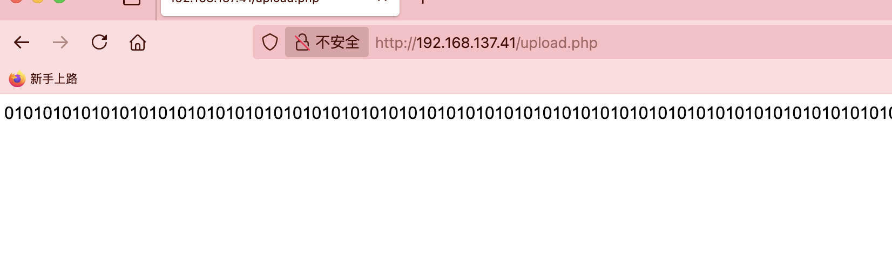  
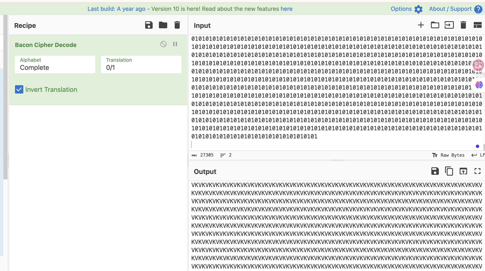  

>??? VK
>

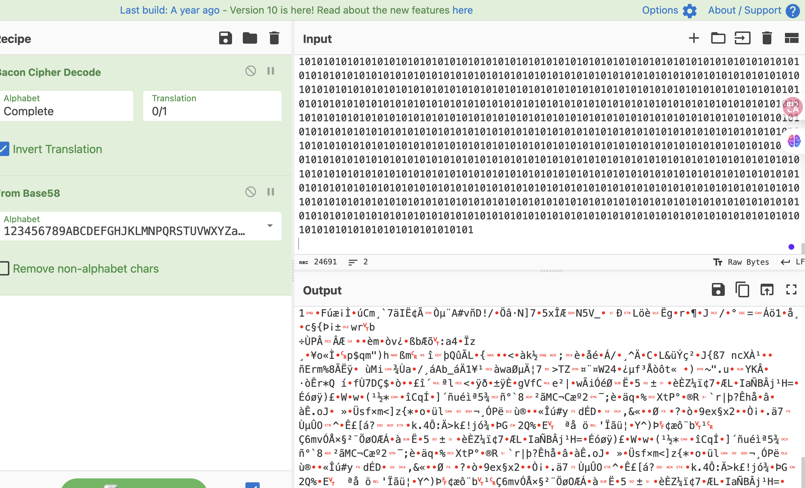  
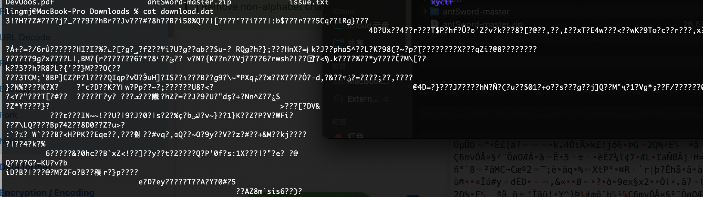  

>upload.php和config.php都是01他俩拼起来？
>

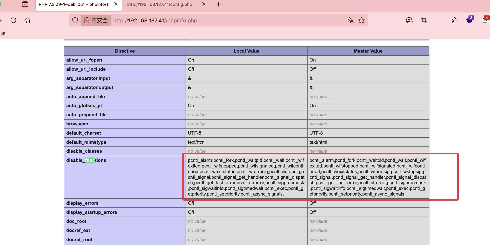  

>fuzz了反正都要的
>

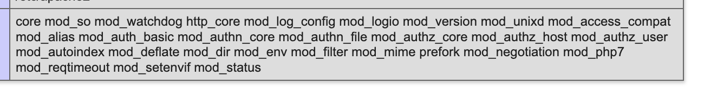  

>不知道有没有这部分
>

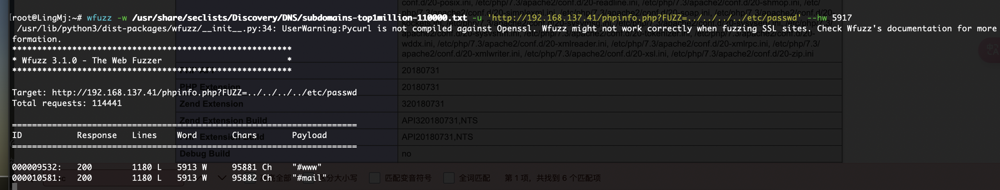  

>这个php没有
>

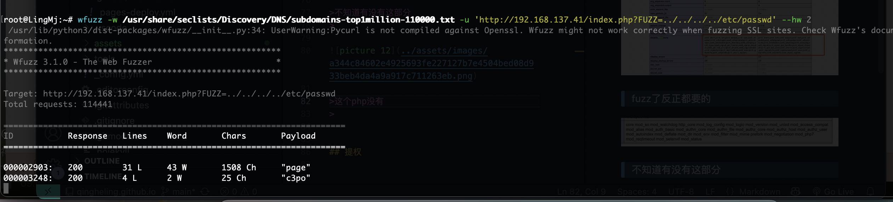  

>有了
>

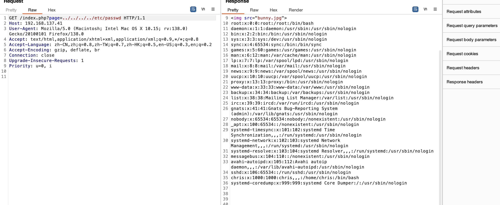  
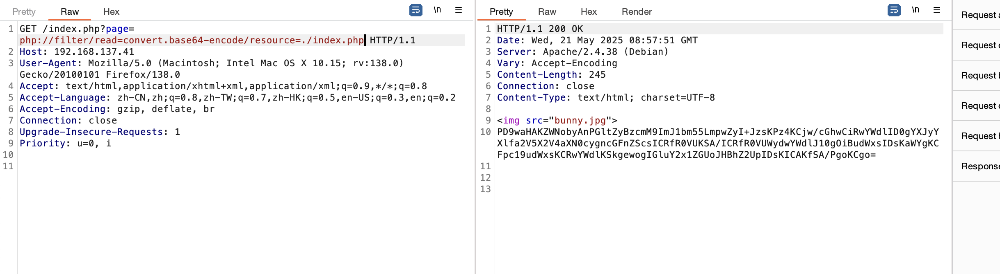  

>有php filter
>

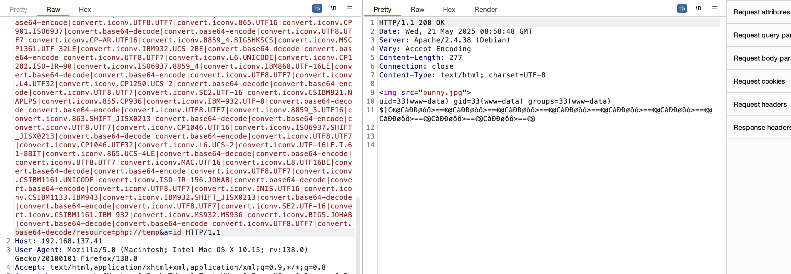  

>好了老方案拿shell
>

## 提权

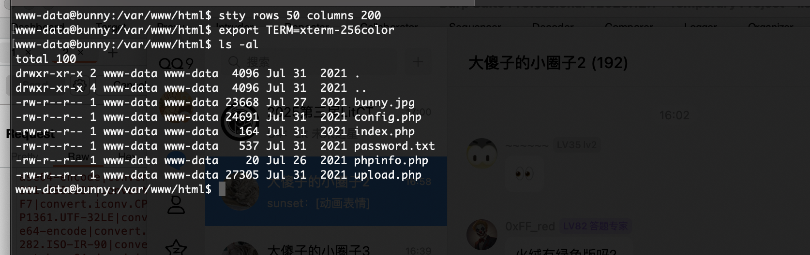  
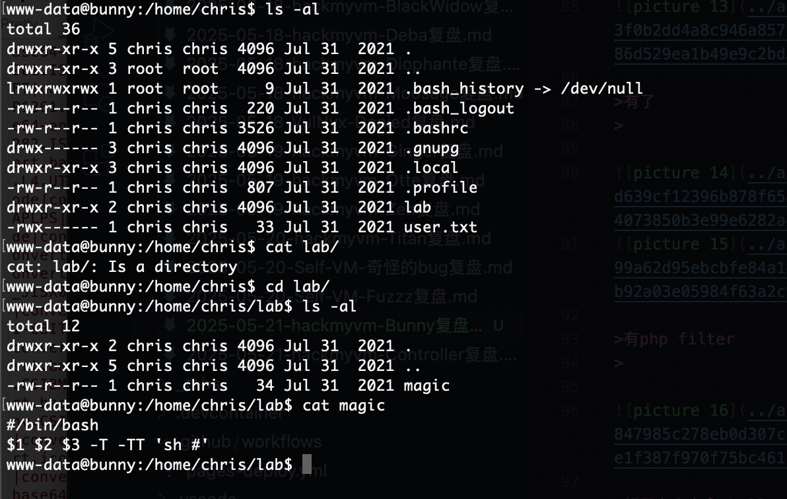  
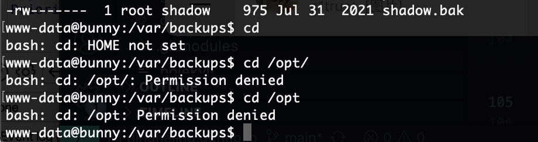  
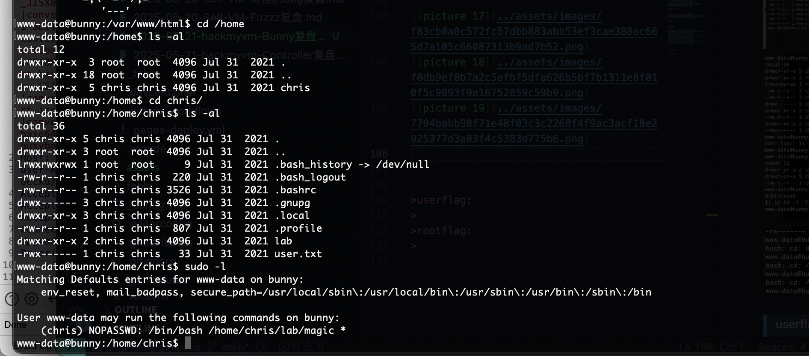  

>算了
>

 
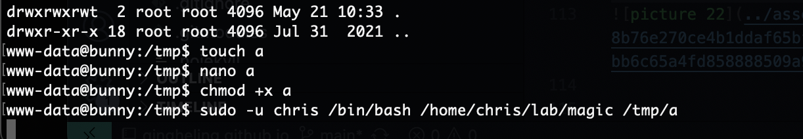  

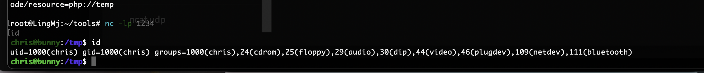  


>这个代码很好看直接输入位置即可
>

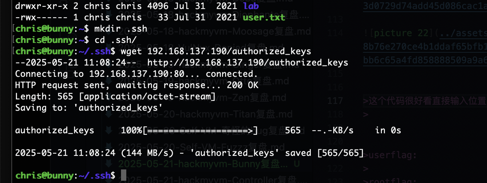  

```
www-data@bunny:/home/chris/lab$ cat magic 
#/bin/bash
$1 $2 $3 -T -TT 'sh #'
```

>直接注入奥
>

  

>发现内容看看是不是定时任务
>

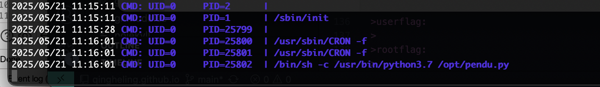  
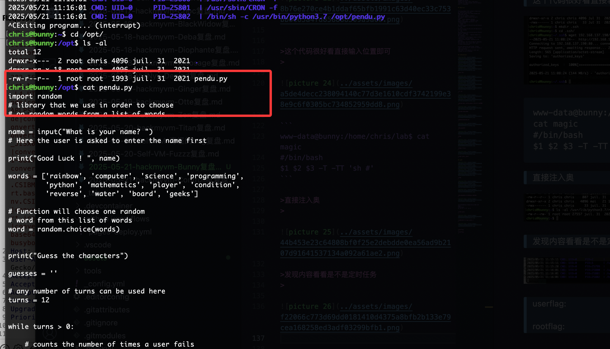  

>好了，直接搞触发就好了
>

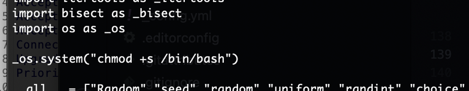  
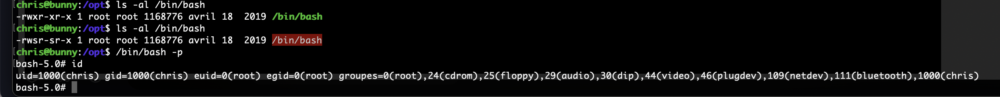  


>结束了
>

>userflag:b9c1575e8d8f934a4101fdbec2f711fe
>
>rootflag:536313923133fb4a628f8ddd5e0ed3e5
>
