## 网段扫描
```
root@LingMj:~/xxoo/jarjar# arp-scan -l
Interface: eth0, type: EN10MB, MAC: 00:0c:29:d1:27:55, IPv4: 192.168.137.190
Starting arp-scan 1.10.0 with 256 hosts (https://github.com/royhills/arp-scan)
192.168.137.1	3e:21:9c:12:bd:a3	(Unknown: locally administered)
192.168.137.15	62:2f:e8:e4:77:5d	(Unknown: locally administered)
192.168.137.64	a0:78:17:62:e5:0a	Apple, Inc.
192.168.137.132	3e:21:9c:12:bd:a3	(Unknown: locally administered)

9 packets received by filter, 0 packets dropped by kernel
Ending arp-scan 1.10.0: 256 hosts scanned in 2.018 seconds (126.86 hosts/sec). 4 responded
```

## 端口扫描

```
root@LingMj:~/xxoo/jarjar# nmap -p- -sV -sC 192.168.137.132
Starting Nmap 7.95 ( https://nmap.org ) at 2025-05-22 00:03 EDT
Nmap scan report for dance.mshome.net (192.168.137.132)
Host is up (0.013s latency).
Not shown: 65532 closed tcp ports (reset)
PORT   STATE SERVICE VERSION
21/tcp open  ftp     vsftpd 3.0.3
| ftp-syst: 
|   STAT: 
| FTP server status:
|      Connected to ::ffff:192.168.137.190
|      Logged in as ftp
|      TYPE: ASCII
|      No session bandwidth limit
|      Session timeout in seconds is 300
|      Control connection is plain text
|      Data connections will be plain text
|      At session startup, client count was 4
|      vsFTPd 3.0.3 - secure, fast, stable
|_End of status
|_ftp-anon: Anonymous FTP login allowed (FTP code 230)
22/tcp open  ssh     OpenSSH 8.4p1 Debian 5 (protocol 2.0)
| ssh-hostkey: 
|   3072 ff:f8:ef:1f:1b:a1:40:87:34:0c:3d:35:c7:29:b1:3d (RSA)
|   256 08:f5:fd:33:51:89:82:29:74:2d:44:c8:54:e7:f1:16 (ECDSA)
|_  256 53:c2:f0:6f:5d:2c:a1:da:7c:ad:c8:24:fd:85:d2:29 (ED25519)
80/tcp open  http    nginx 1.18.0
|_http-server-header: nginx/1.18.0
|_http-title: Site doesn't have a title (text/html).
MAC Address: 3E:21:9C:12:BD:A3 (Unknown)
Service Info: OSs: Unix, Linux; CPE: cpe:/o:linux:linux_kernel

Service detection performed. Please report any incorrect results at https://nmap.org/submit/ .
Nmap done: 1 IP address (1 host up) scanned in 27.25 seconds
```

## 获取webshell

  
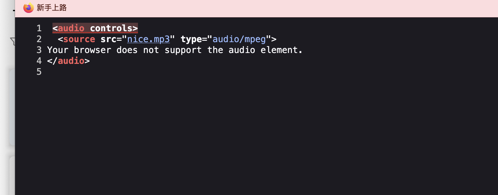  

>大概率有什么加密的然后解开不过这个得等一伙
>

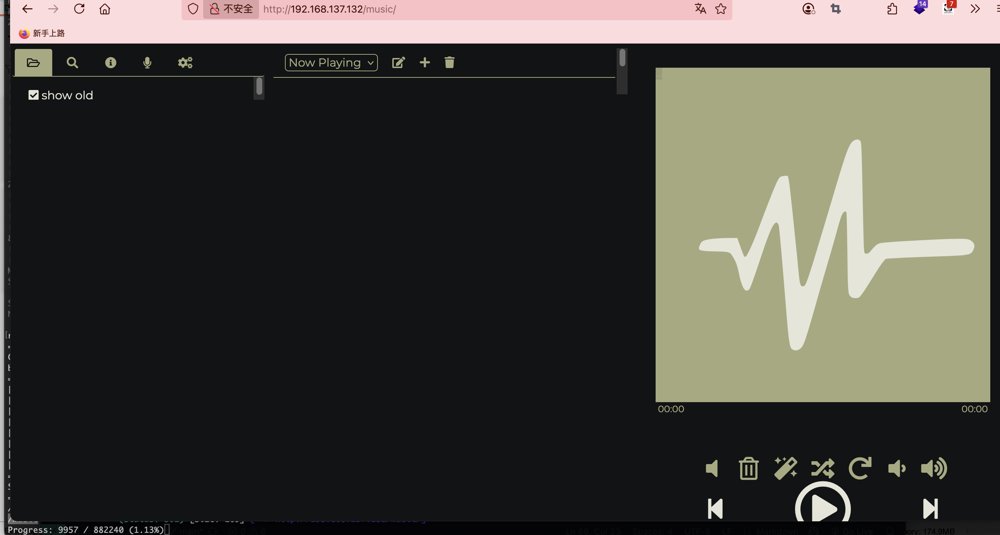  

>这个可以文件上传吧
>

  
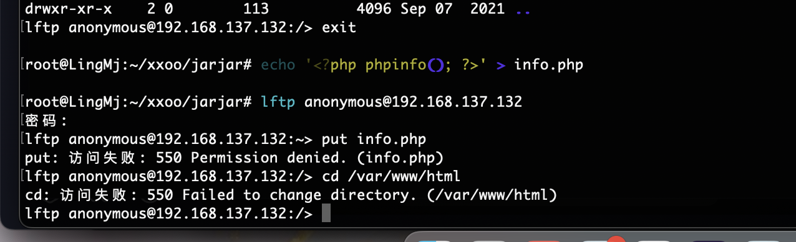  
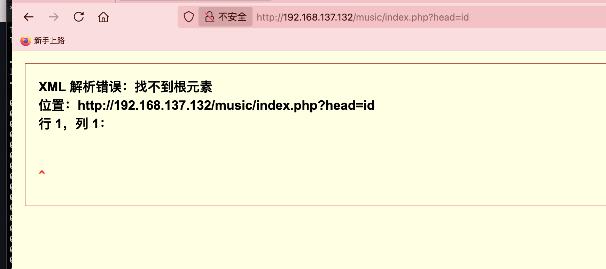  
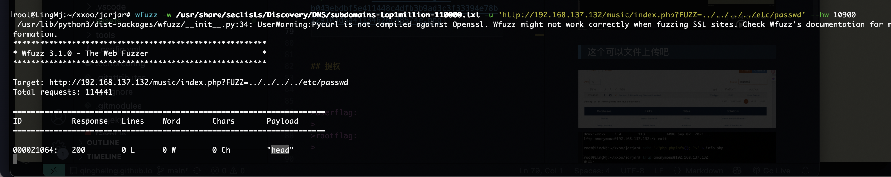  

>像xxe
>

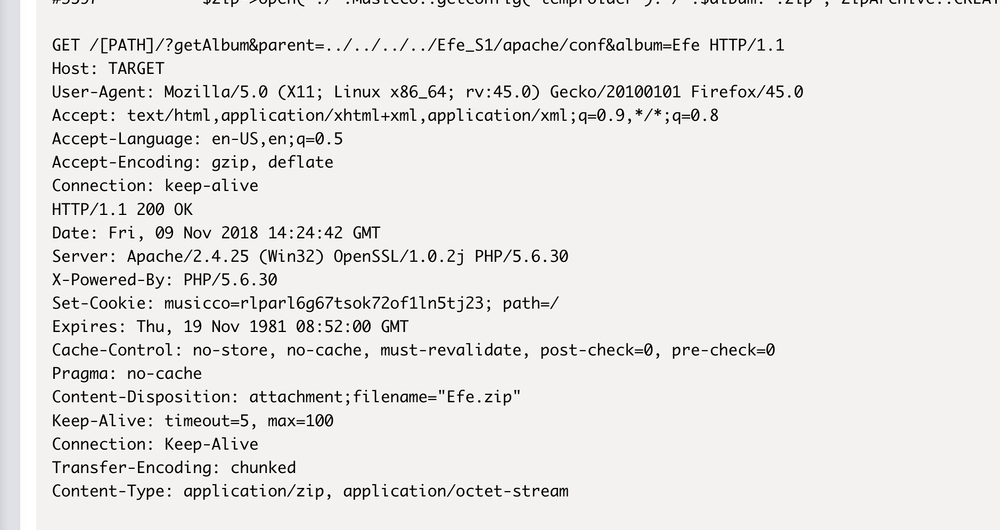  

>先试这个
>

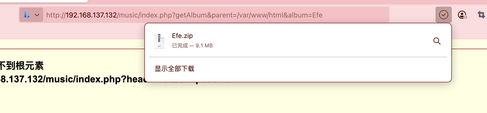  

>有东西
>

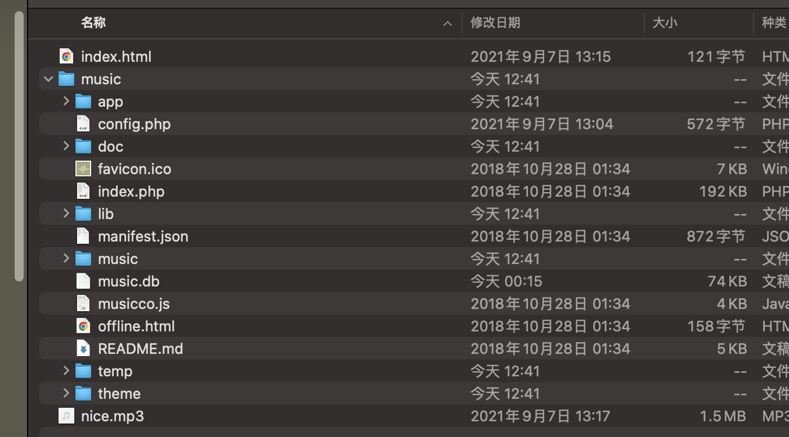  
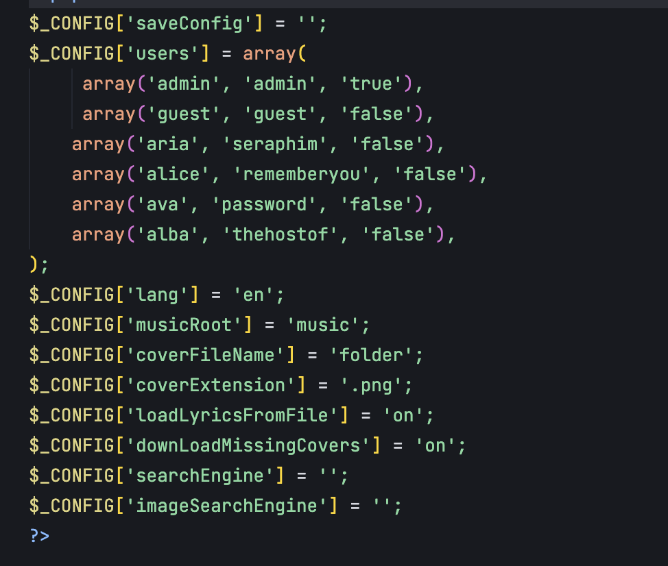  

>有账号密码直接拿来用
>

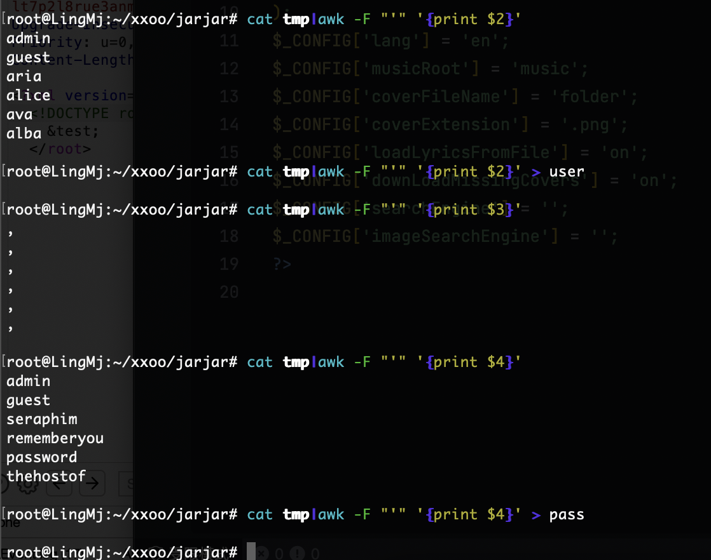  

>爆破一手
>

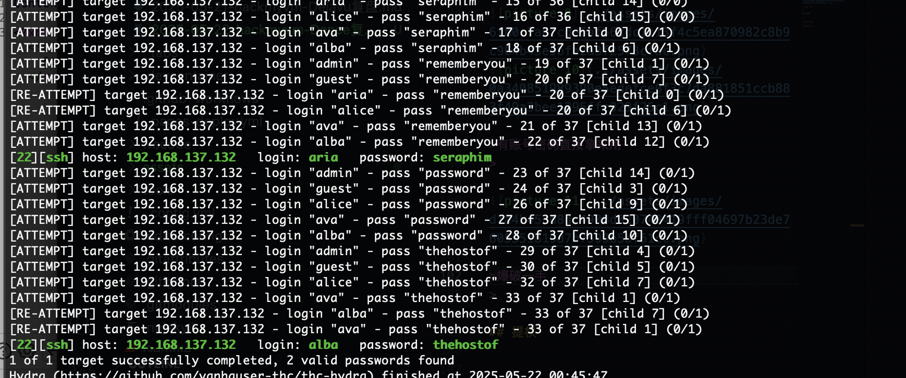  

>ssh的直接登录
>

## 提权

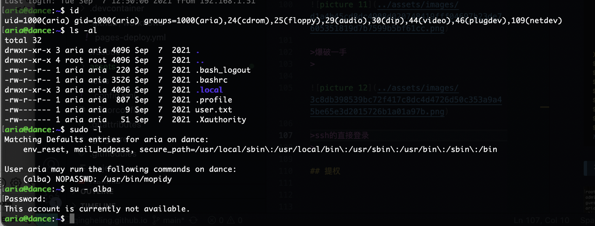  

>不能直接su有点意思
>

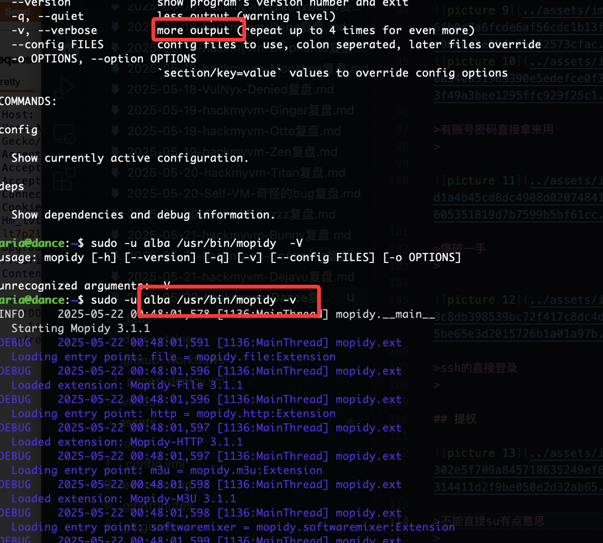  

>执行less和more
>

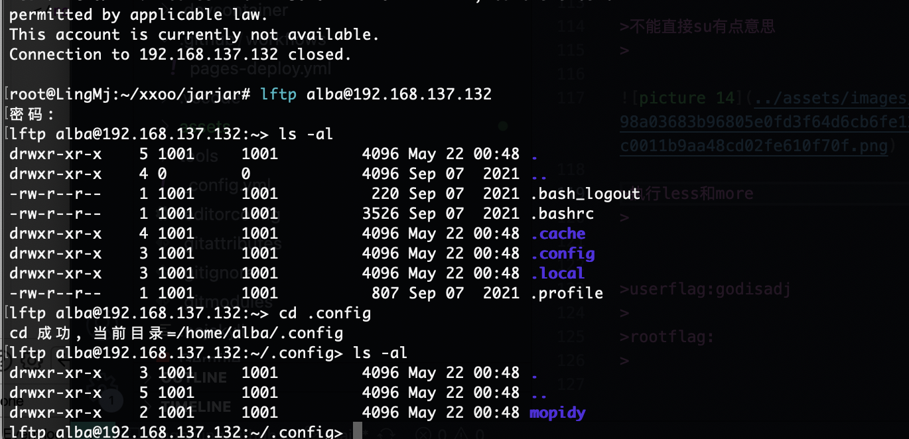  

>lftp可以进去把那个控制的删掉应该就行了,没看到，还是走sudo吧
>

```
lftp alba@192.168.137.132:~/.config/mopidy> cat mopidy.conf 
# For further information about options in this file see:
#   https://docs.mopidy.com/
#
# The initial commented out values reflect the defaults as of:
#   Mopidy 3.1.1
#   Mopidy-File 3.1.1
#   Mopidy-HTTP 3.1.1
#   Mopidy-M3U 3.1.1
#   Mopidy-SoftwareMixer 3.1.1
#   Mopidy-Stream 3.1.1
#
# Available options and defaults might have changed since then,
# run `mopidy config` to see the current effective config and
# `mopidy --version` to check the current version.

[core]
#cache_dir = $XDG_CACHE_DIR/mopidy
#config_dir = $XDG_CONFIG_DIR/mopidy
#data_dir = $XDG_DATA_DIR/mopidy
#max_tracklist_length = 10000
#restore_state = false

[logging]
#verbosity = 0
#format = %(levelname)-8s %(asctime)s [%(process)d:%(threadName)s] %(name)s\n  %(message)s
#color = true
#config_file =

[audio]
#mixer = software
#mixer_volume = 
#output = autoaudiosink
#buffer_time = 

[proxy]
#scheme = 
#hostname = 
#port = 
#username = 
#password = 

[file]
#enabled = true
#media_dirs = 
#  $XDG_MUSIC_DIR|Music
#  ~/|Home
#excluded_file_extensions = 
#  .directory
#  .html
#  .jpeg
#  .jpg
#  .log
#  .nfo
#  .pdf
#  .png
#  .txt
#  .zip
#show_dotfiles = false
#follow_symlinks = false
#metadata_timeout = 1000

[http]
#enabled = true
#hostname = 127.0.0.1
#port = 6680
#zeroconf = Mopidy HTTP server on $hostname
#allowed_origins = 
#csrf_protection = true
#default_app = mopidy

[m3u]
#enabled = true
#base_dir =
#default_encoding = latin-1
#default_extension = .m3u8
#playlists_dir =

[softwaremixer]
#enabled = true

[stream]
#enabled = true
#protocols = 
#  http
#  https
#  mms
#  rtmp
#  rtmps
#  rtsp
#metadata_blacklist = 
#timeout = 50001632 bytes transferred
```

>思考一下怎么利用
>

```
aria@dance:~$ cat /etc/passwd
root:x:0:0:root:/root:/bin/bash
daemon:x:1:1:daemon:/usr/sbin:/usr/sbin/nologin
bin:x:2:2:bin:/bin:/usr/sbin/nologin
sys:x:3:3:sys:/dev:/usr/sbin/nologin
sync:x:4:65534:sync:/bin:/bin/sync
games:x:5:60:games:/usr/games:/usr/sbin/nologin
man:x:6:12:man:/var/cache/man:/usr/sbin/nologin
lp:x:7:7:lp:/var/spool/lpd:/usr/sbin/nologin
mail:x:8:8:mail:/var/mail:/usr/sbin/nologin
news:x:9:9:news:/var/spool/news:/usr/sbin/nologin
uucp:x:10:10:uucp:/var/spool/uucp:/usr/sbin/nologin
proxy:x:13:13:proxy:/bin:/usr/sbin/nologin
www-data:x:33:33:www-data:/var/www:/usr/sbin/nologin
backup:x:34:34:backup:/var/backups:/usr/sbin/nologin
list:x:38:38:Mailing List Manager:/var/list:/usr/sbin/nologin
irc:x:39:39:ircd:/run/ircd:/usr/sbin/nologin
gnats:x:41:41:Gnats Bug-Reporting System (admin):/var/lib/gnats:/usr/sbin/nologin
nobody:x:65534:65534:nobody:/nonexistent:/usr/sbin/nologin
_apt:x:100:65534::/nonexistent:/usr/sbin/nologin
systemd-timesync:x:101:101:systemd Time Synchronization,,,:/run/systemd:/usr/sbin/nologin
systemd-network:x:102:103:systemd Network Management,,,:/run/systemd:/usr/sbin/nologin
systemd-resolve:x:103:104:systemd Resolver,,,:/run/systemd:/usr/sbin/nologin
messagebus:x:104:110::/nonexistent:/usr/sbin/nologin
sshd:x:105:65534::/run/sshd:/usr/sbin/nologin
aria:x:1000:1000:aria,,,:/home/aria:/bin/bash
systemd-coredump:x:999:999:systemd Core Dumper:/:/usr/sbin/nologin
ftp:x:106:113:ftp daemon,,,:/srv/ftp:/usr/sbin/nologin
mopidy:x:107:29::/var/lib/mopidy:/usr/sbin/nologin
alba:x:1001:1001:,,,:/home/alba:/usr/sbin/nologin
```

>这里竟然是nologin
>

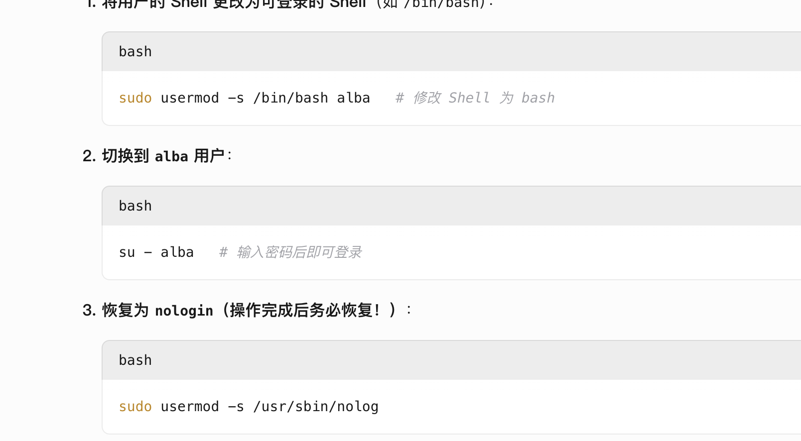
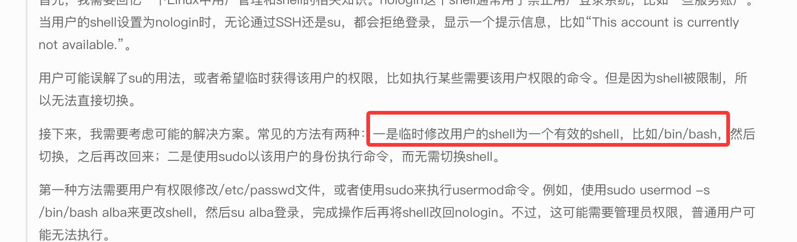  


```

Usage:
 su [options] [-] [<user> [<argument>...]]

Change the effective user ID and group ID to that of <user>.
A mere - implies -l.  If <user> is not given, root is assumed.

Options:
 -m, -p, --preserve-environment      do not reset environment variables
 -w, --whitelist-environment <list>  don't reset specified variables

 -g, --group <group>             specify the primary group
 -G, --supp-group <group>        specify a supplemental group

 -, -l, --login                  make the shell a login shell
 -c, --command <command>         pass a single command to the shell with -c
 --session-command <command>     pass a single command to the shell with -c
                                   and do not create a new session
 -f, --fast                      pass -f to the shell (for csh or tcsh)
 -s, --shell <shell>             run <shell> if /etc/shells allows it
 -P, --pty                       create a new pseudo-terminal

 -h, --help                      display this help
 -V, --version                   display version

```  

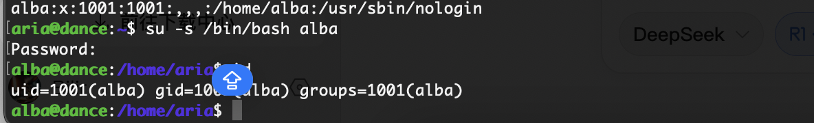  

```
alba@dance:/home/aria$ sudo -l
Matching Defaults entries for alba on dance:
    env_reset, mail_badpass, secure_path=/usr/local/sbin\:/usr/local/bin\:/usr/sbin\:/usr/bin\:/sbin\:/bin

User alba may run the following commands on dance:
    (root) NOPASSWD: /usr/bin/espeak
alba@dance:/home/aria$ /usr/bin/espeak --help

eSpeak text-to-speech: 1.48.15  16.Apr.15  Data at: /usr/lib/x86_64-linux-gnu/espeak-data

espeak [options] ["<words>"]

-f <text file>   Text file to speak
--stdin    Read text input from stdin instead of a file

If neither -f nor --stdin, then <words> are spoken, or if none then text
is spoken from stdin, each line separately.

-a <integer>
	   Amplitude, 0 to 200, default is 100
-g <integer>
	   Word gap. Pause between words, units of 10mS at the default speed
-k <integer>
	   Indicate capital letters with: 1=sound, 2=the word "capitals",
	   higher values indicate a pitch increase (try -k20).
-l <integer>
	   Line length. If not zero (which is the default), consider
	   lines less than this length as end-of-clause
-p <integer>
	   Pitch adjustment, 0 to 99, default is 50
-s <integer>
	   Speed in approximate words per minute. The default is 175
-v <voice name>
	   Use voice file of this name from espeak-data/voices
-w <wave file name>
	   Write speech to this WAV file, rather than speaking it directly
-b	   Input text encoding, 1=UTF8, 2=8 bit, 4=16 bit 
-m	   Interpret SSML markup, and ignore other < > tags
-q	   Quiet, don't produce any speech (may be useful with -x)
-x	   Write phoneme mnemonics to stdout
-X	   Write phonemes mnemonics and translation trace to stdout
-z	   No final sentence pause at the end of the text
--compile=<voice name>
	   Compile pronunciation rules and dictionary from the current
	   directory. <voice name> specifies the language
--ipa      Write phonemes to stdout using International Phonetic Alphabet
--path="<path>"
	   Specifies the directory containing the espeak-data directory
--pho      Write mbrola phoneme data (.pho) to stdout or to the file in --phonout
--phonout="<filename>"
	   Write phoneme output from -x -X --ipa and --pho to this file
--punct="<characters>"
	   Speak the names of punctuation characters during speaking.  If
	   =<characters> is omitted, all punctuation is spoken.
--sep=<character>
	   Separate phonemes (from -x --ipa) with <character>.
	   Default is space, z means ZWJN character.
--split=<minutes>
	   Starts a new WAV file every <minutes>.  Used with -w
--stdout   Write speech output to stdout
--tie=<character>
	   Use a tie character within multi-letter phoneme names.
	   Default is U+361, z means ZWJ character.
--version  Shows version number and date, and location of espeak-data
--voices=<language>
	   List the available voices for the specified language.
	   If <language> is omitted, then list all voices.
```

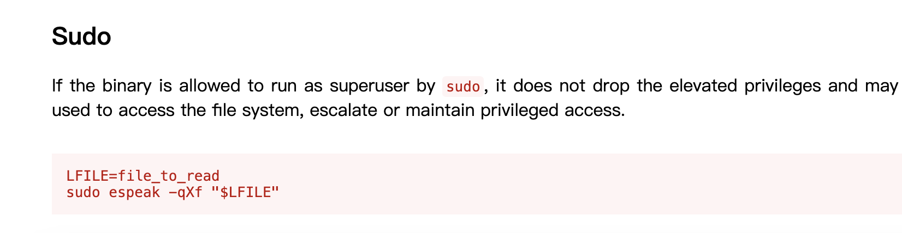  
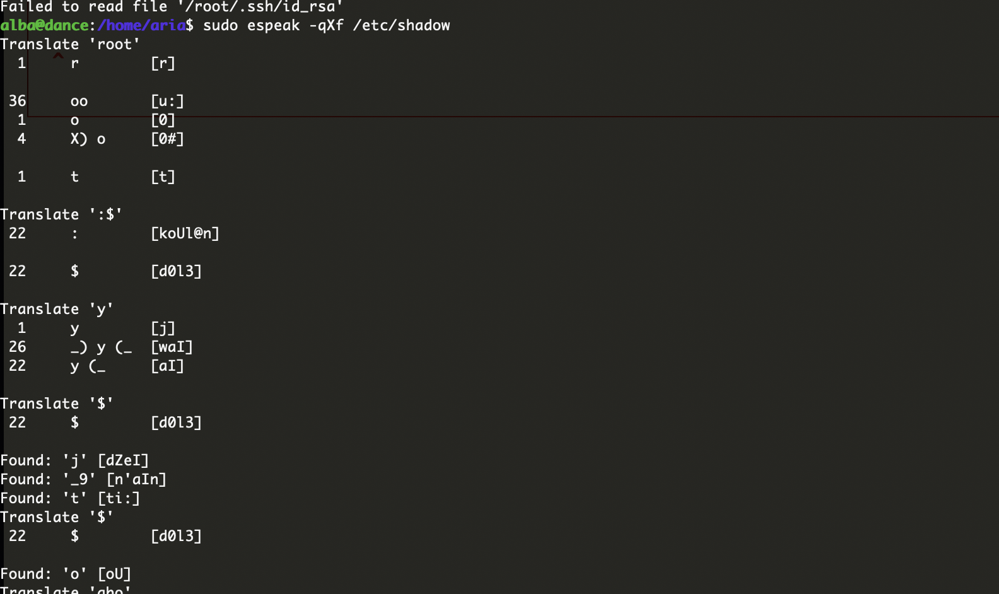  

>怎么难看
>

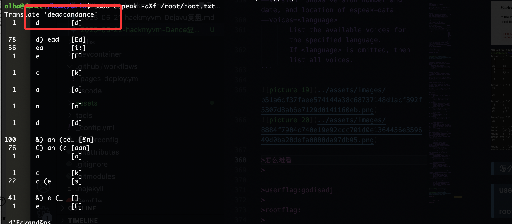  

>一行还是能读的没密码拿shell我不认可，哈哈哈
>

>y开头我觉得密码爆破好像不太行，看看wp有啥提root方案不，好了看到了走内核那我不打了，哈哈哈哈
>

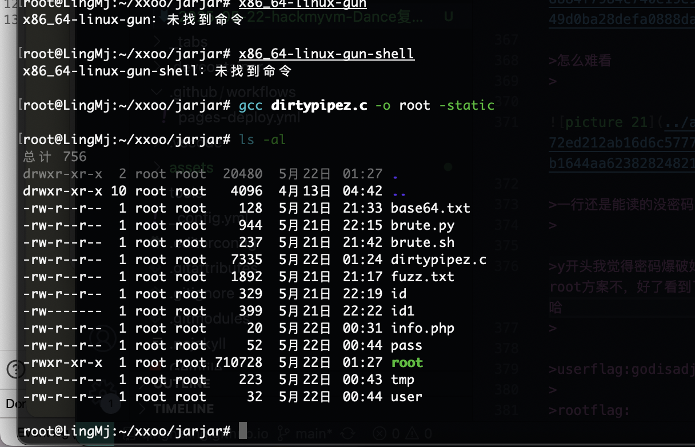  
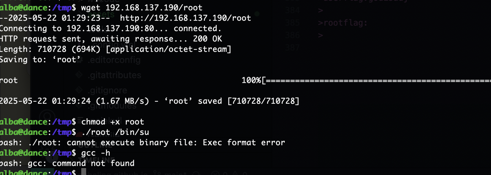  

>还是不行，算了这样先吧
>


>userflag:godisadj
>
>rootflag:
>
