## 网段扫描
```
root@LingMj:~# arp-scan -l
Interface: eth0, type: EN10MB, MAC: 00:0c:29:d1:27:55, IPv4: 192.168.137.190
Starting arp-scan 1.10.0 with 256 hosts (https://github.com/royhills/arp-scan)
192.168.137.1	3e:21:9c:12:bd:a3	(Unknown: locally administered)
192.168.137.55	3e:21:9c:12:bd:a3	(Unknown: locally administered)
192.168.137.64	a0:78:17:62:e5:0a	Apple, Inc.

8 packets received by filter, 0 packets dropped by kernel
Ending arp-scan 1.10.0: 256 hosts scanned in 2.056 seconds (124.51 hosts/sec). 3 responded
```

## 端口扫描

```
root@LingMj:~# nmap -p- -sV -sC 192.168.137.55 
Starting Nmap 7.95 ( https://nmap.org ) at 2025-05-25 04:46 EDT
Nmap scan report for Dayao.mshome.net (192.168.137.55)
Host is up (0.083s latency).
Not shown: 65533 closed tcp ports (reset)
PORT   STATE SERVICE VERSION
22/tcp open  ssh     OpenSSH 8.4p1 Debian 5+deb11u3 (protocol 2.0)
| ssh-hostkey: 
|   3072 f6:a3:b6:78:c4:62:af:44:bb:1a:a0:0c:08:6b:98:f7 (RSA)
|   256 bb:e8:a2:31:d4:05:a9:c9:31:ff:62:f6:32:84:21:9d (ECDSA)
|_  256 3b:ae:34:64:4f:a5:75:b9:4a:b9:81:f9:89:76:99:eb (ED25519)
80/tcp open  http    Apache httpd 2.4.62 ((Debian))
|_http-title: \xE2\x9C\xA7\xEF\xBD\xA5\xEF\xBE\x9F: *\xE2\x9C\xA7\xEF\xBD\xA5\xEF\xBE\x9F:* FILE TRANSFER *:\xEF\xBD\xA5\xEF\xBE\x9F\xE2\x9C\xA7*:\xEF\xBD\xA5\xEF\xBE\x9F\xE2\x9C\xA7
|_http-server-header: Apache/2.4.62 (Debian)
MAC Address: 3E:21:9C:12:BD:A3 (Unknown)
Service Info: OS: Linux; CPE: cpe:/o:linux:linux_kernel

Service detection performed. Please report any incorrect results at https://nmap.org/submit/ .
Nmap done: 1 IP address (1 host up) scanned in 23.97 seconds
```

## 获取webshell

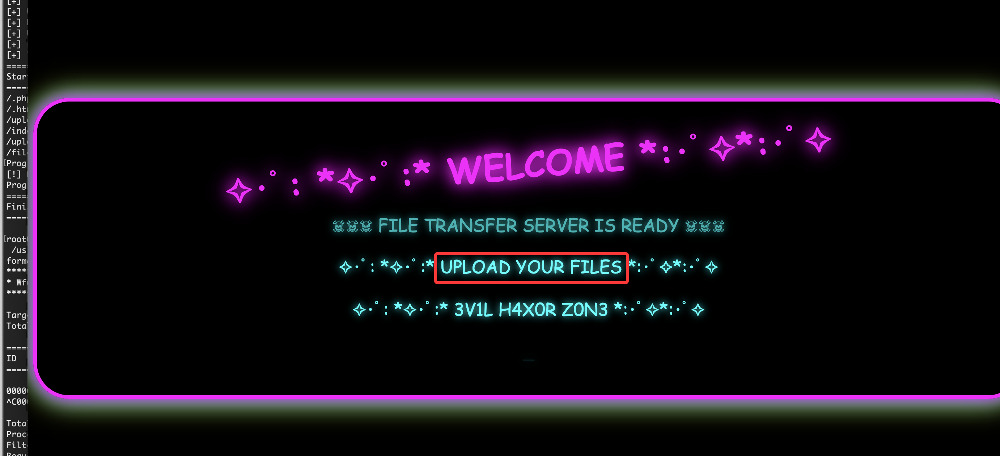  
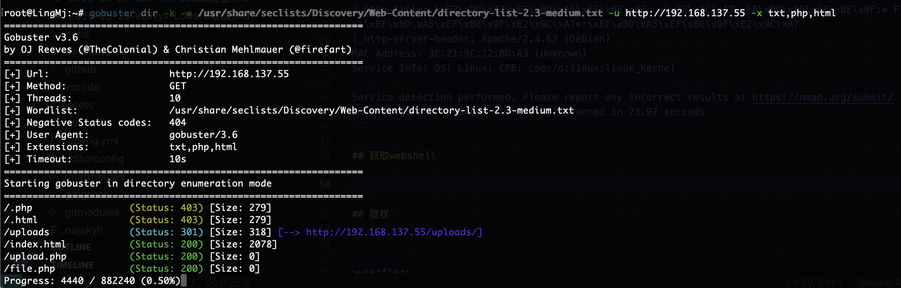  
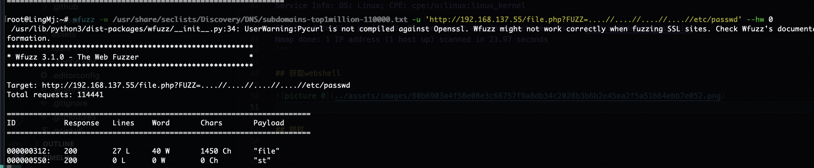  
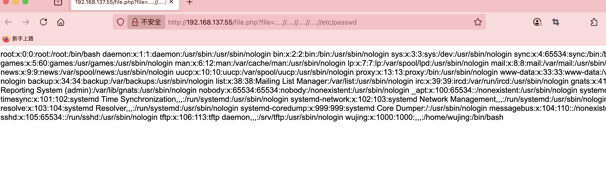  

>有LFI和upload的提示，主要看在那里上传文件
>

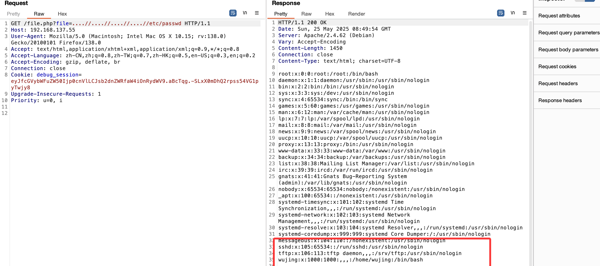  

>可以看到有tftp
>

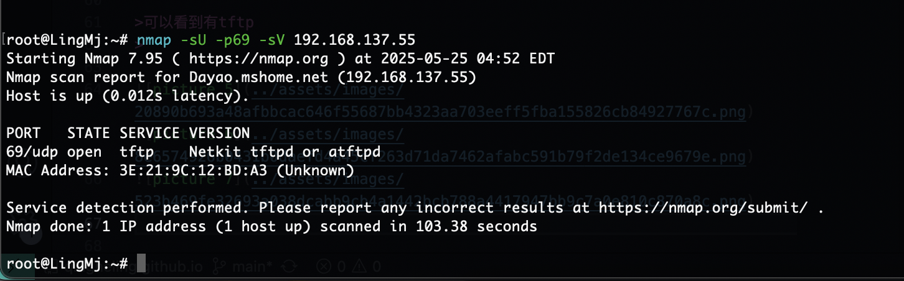  
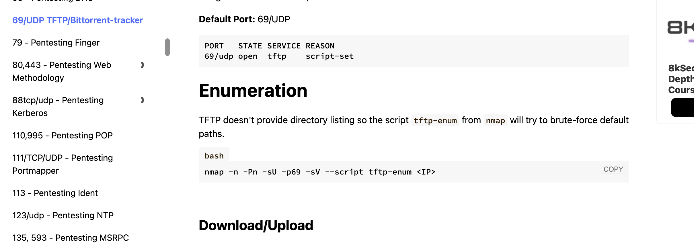  
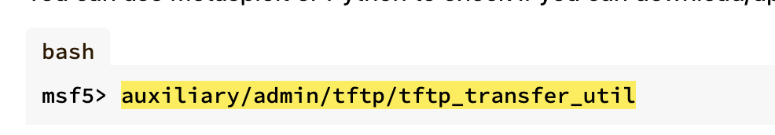  
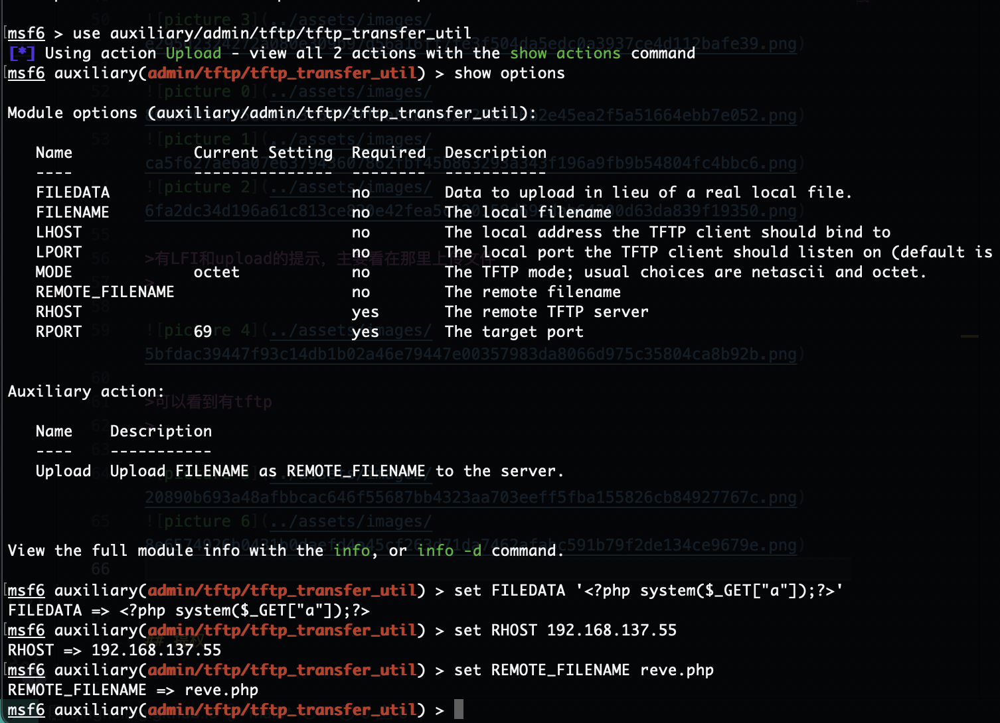  
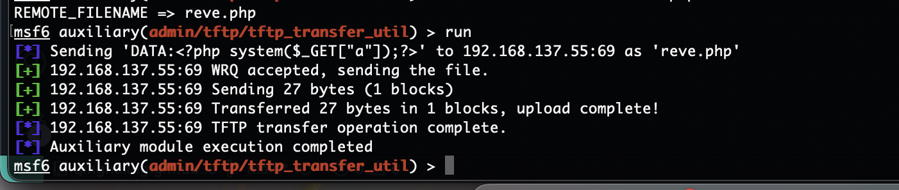  
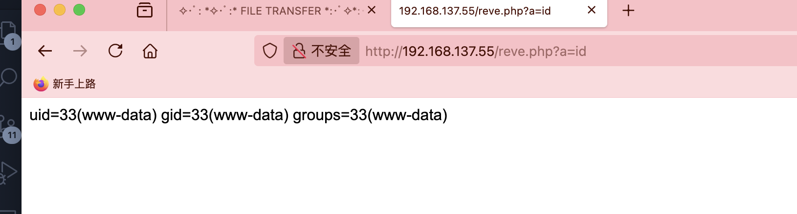  

>好了接下来就是busybox拿shell
>

## 提权

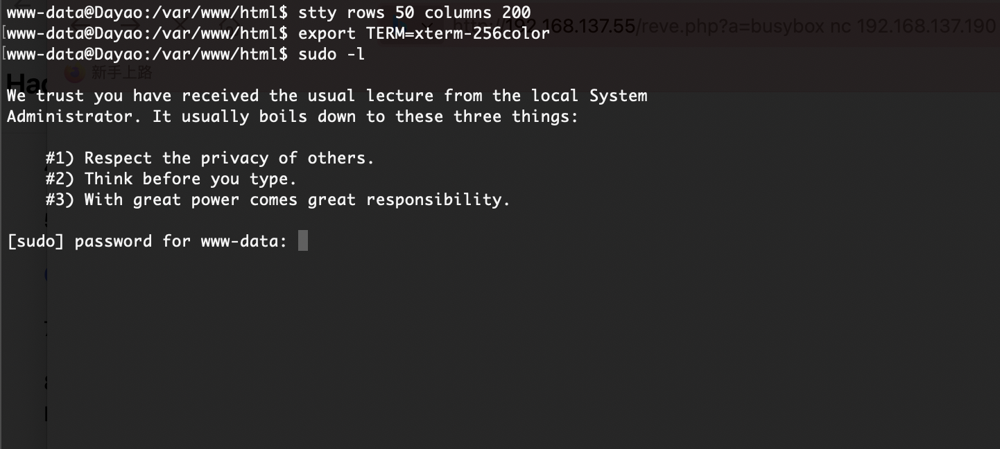  
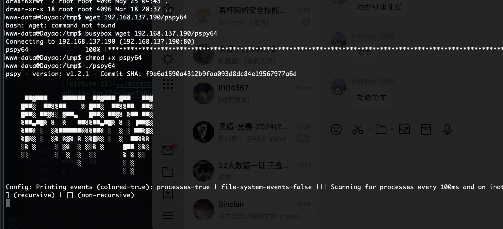  
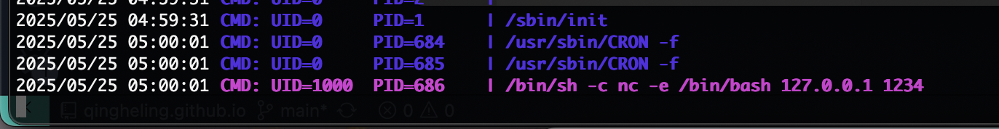  

>存在定时任务
>

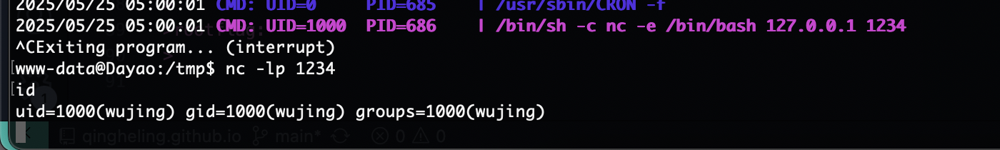  
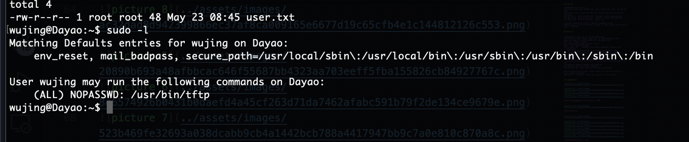  
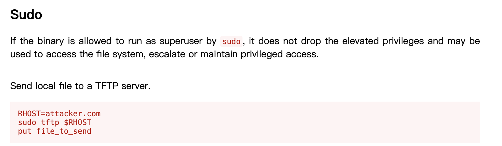  

>可以get也可以put
>

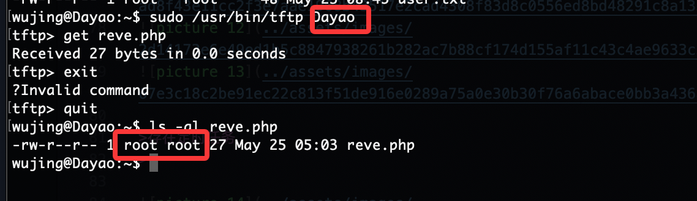  

>本地有tftp所以不用跑出去整，可以看到我们get文件权限是root，所以可以利用这个文件覆盖
>

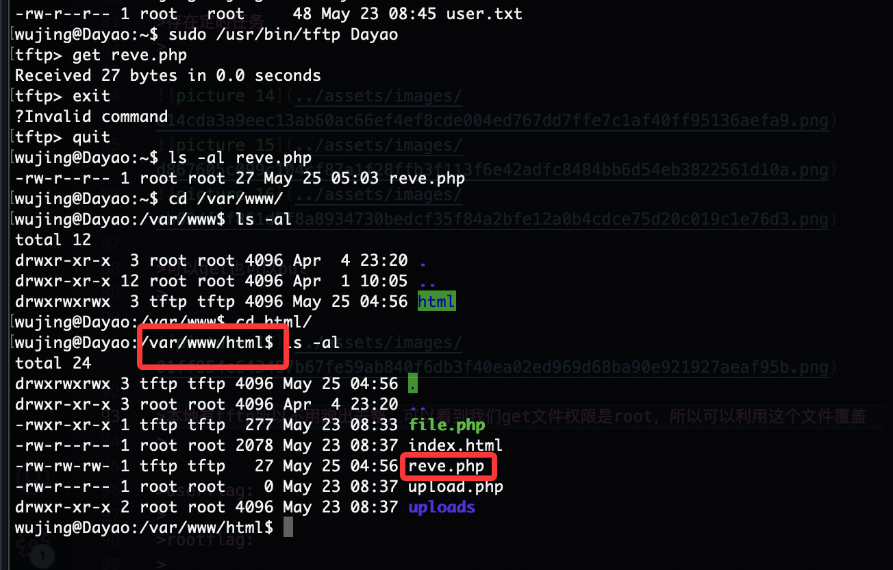  

>路径在www里所以我们写个给www即可
>

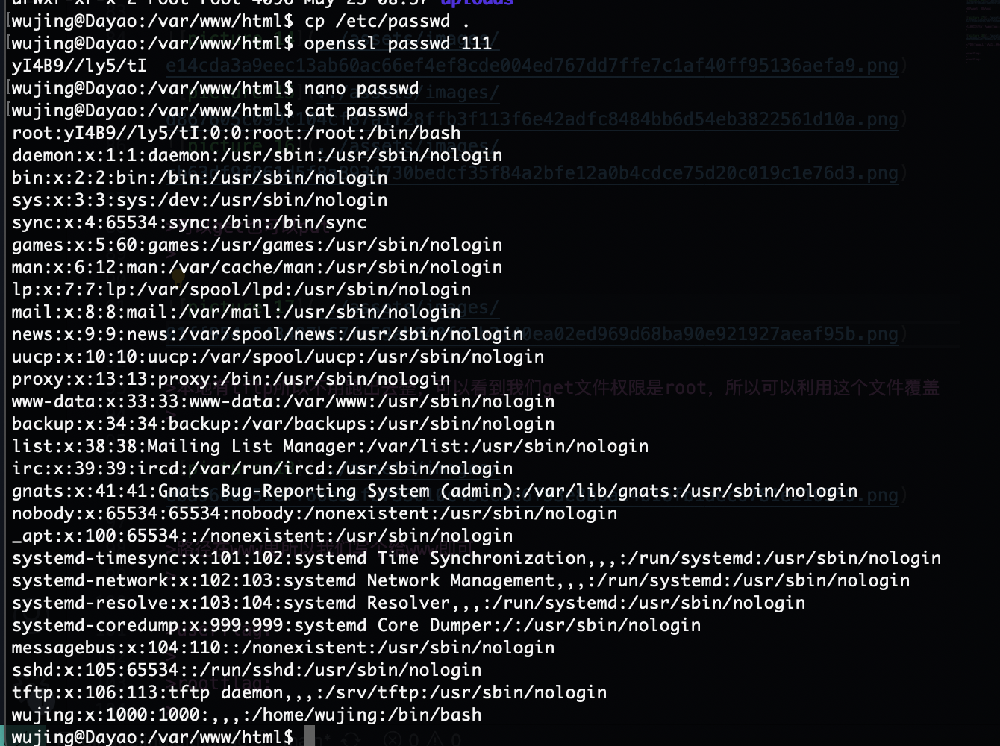  
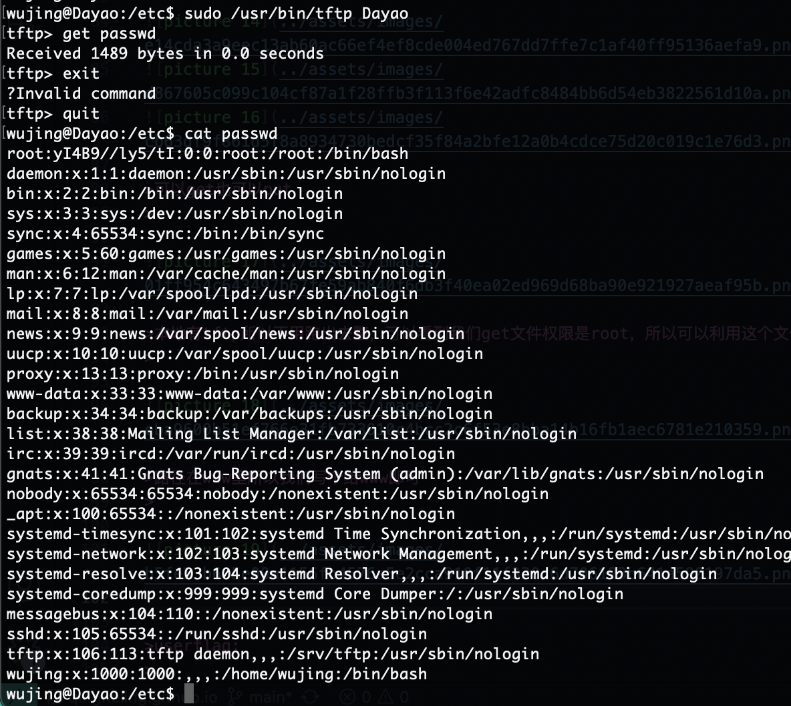  
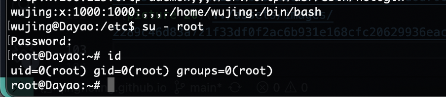  

>好了方案很多我就不复现了
>

>userflag:
>
>rootflag:
>
