## 网段扫描
```
root@LingMj:~/tools# arp-scan -l
Interface: eth0, type: EN10MB, MAC: 00:0c:29:d1:27:55, IPv4: 192.168.137.190
Starting arp-scan 1.10.0 with 256 hosts (https://github.com/royhills/arp-scan)
192.168.137.1	3e:21:9c:12:bd:a3	(Unknown: locally administered)
192.168.137.202	a0:78:17:62:e5:0a	Apple, Inc.
192.168.137.243	3e:21:9c:12:bd:a3	(Unknown: locally administered)

11 packets received by filter, 0 packets dropped by kernel
Ending arp-scan 1.10.0: 256 hosts scanned in 2.103 seconds (121.73 hosts/sec). 3 responded
```

## 端口扫描

```
root@LingMj:~/tools# nmap -p- -sC -sV 192.168.137.243
Starting Nmap 7.95 ( https://nmap.org ) at 2025-06-04 08:27 EDT
Nmap scan report for sales.nyx (192.168.137.243)
Host is up (0.029s latency).
Not shown: 65533 closed tcp ports (reset)
PORT   STATE SERVICE VERSION
22/tcp open  ssh     OpenSSH 9.2p1 Debian 2+deb12u6 (protocol 2.0)
| ssh-hostkey: 
|   256 dd:2c:11:05:8e:0a:ea:0b:df:52:60:ed:bf:b4:c2:92 (ECDSA)
|_  256 9d:5a:c5:8d:db:27:66:ca:35:30:05:1f:ad:25:40:3f (ED25519)
80/tcp open  http    Apache httpd 2.4.62
|_http-title: AksisDesign
|_http-server-header: Apache/2.4.62 (Debian)
MAC Address: 3E:21:9C:12:BD:A3 (Unknown)
Service Info: Host: localhost; OS: Linux; CPE: cpe:/o:linux:linux_kernel

Service detection performed. Please report any incorrect results at https://nmap.org/submit/ .
Nmap done: 1 IP address (1 host up) scanned in 33.75 seconds
```

## 获取webshell

  

>存在域名
>

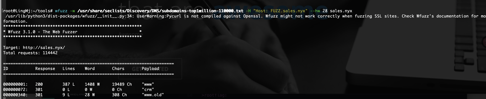  
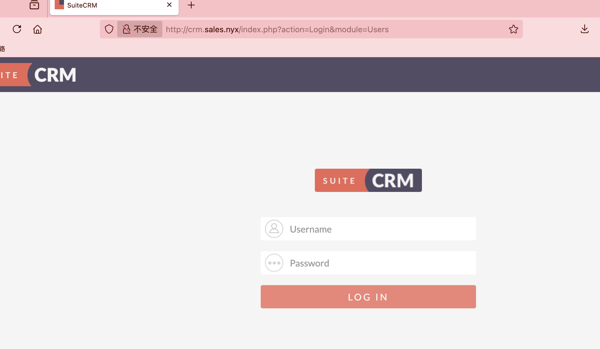  
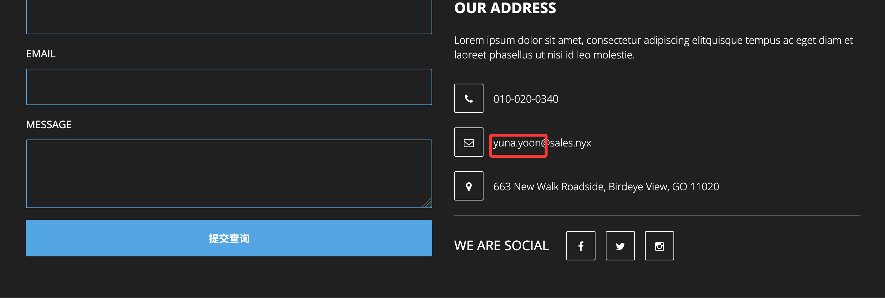  
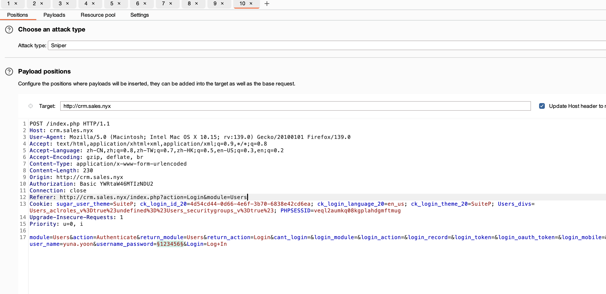  
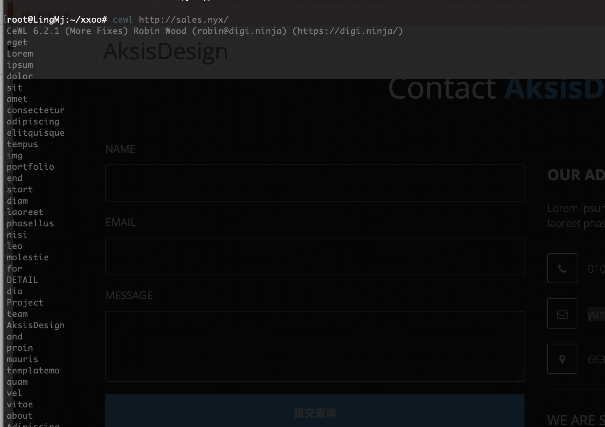  
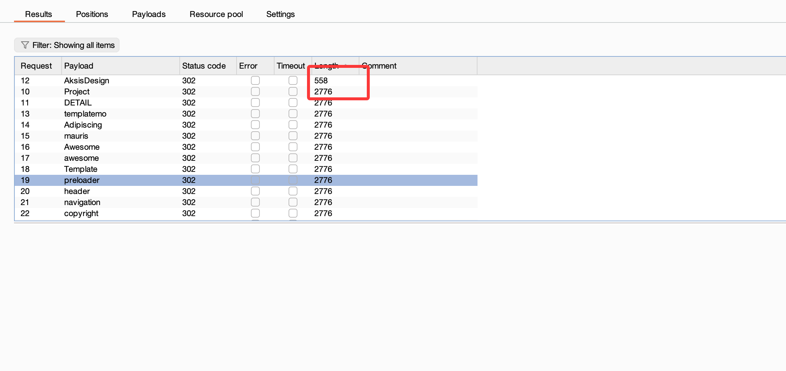  
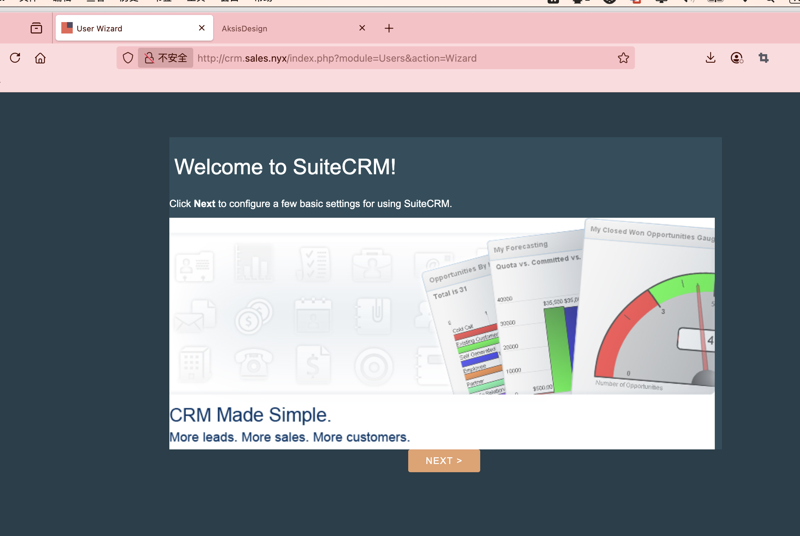  
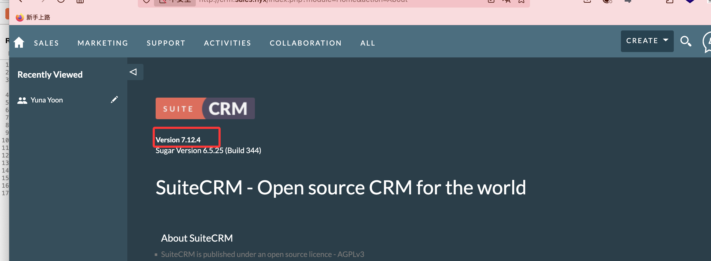  
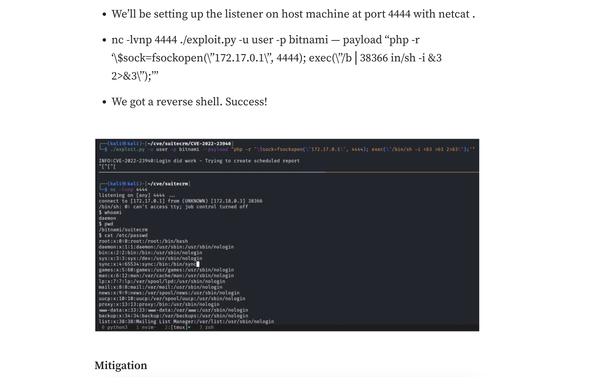  

>方案地址：https://medium.com/@_crac/cve-2022-23940-rce-in-suitecrm-90df53980d8c
>

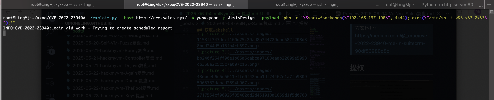  

>直接利用
>

## 提权

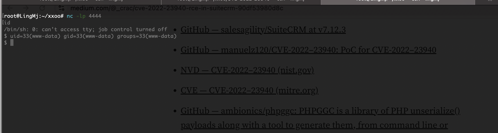  
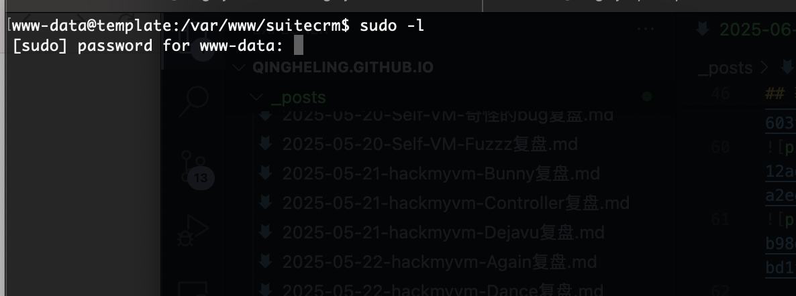  
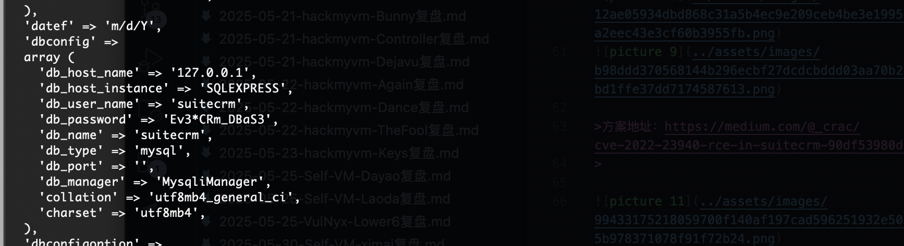  
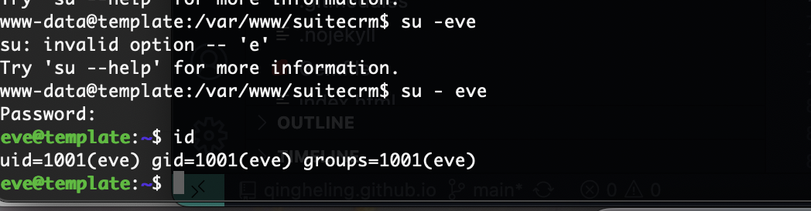  
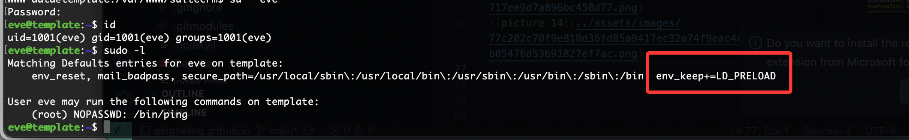  
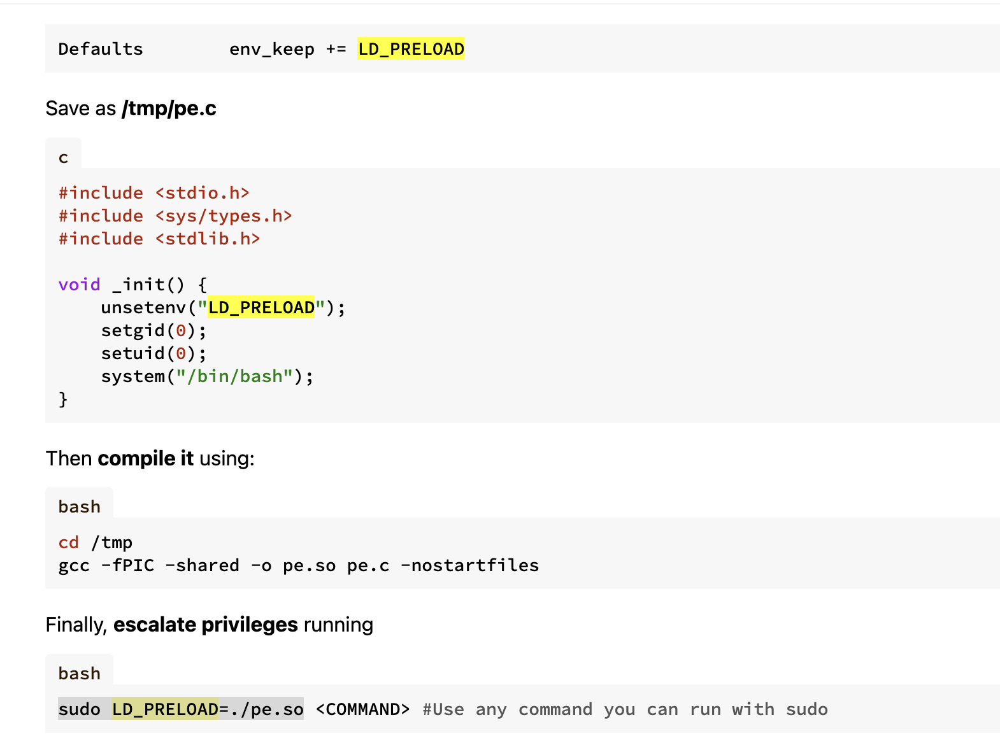  
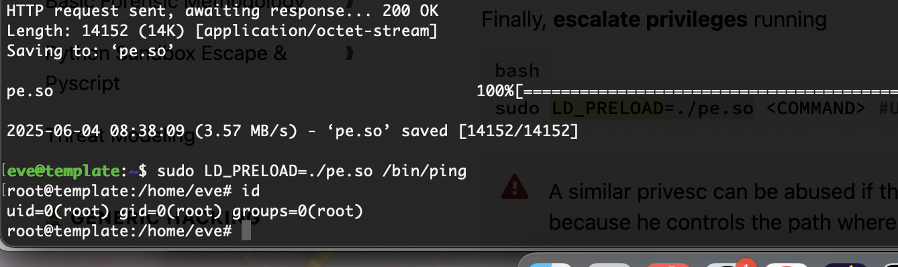  

>这样就结束了前面可能难一点
>

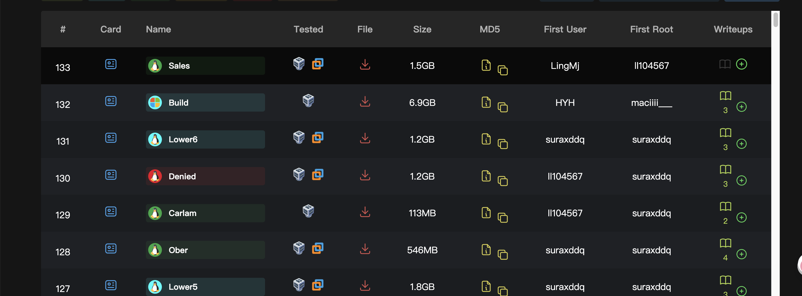  

>和大佬同框记录一下
>

>userflag:
>
>rootflag:
>