## 网段扫描
```
root@LingMj:~/xxoo# arp-scan -l
Interface: eth0, type: EN10MB, MAC: 00:0c:29:d1:27:55, IPv4: 192.168.137.190
Starting arp-scan 1.10.0 with 256 hosts (https://github.com/royhills/arp-scan)
192.168.137.1	3e:21:9c:12:bd:a3	(Unknown: locally administered)
192.168.137.64	3e:21:9c:12:bd:a3	(Unknown: locally administered)
192.168.137.206	a0:78:17:62:e5:0a	Apple, Inc.
192.168.137.132	2e:5c:af:d4:ea:c8	(Unknown: locally administered)

9 packets received by filter, 0 packets dropped by kernel
Ending arp-scan 1.10.0: 256 hosts scanned in 2.044 seconds (125.24 hosts/sec). 4 responded
```

## 端口扫描

```
root@LingMj:~/xxoo# nmap -p- -sC -sV 192.168.137.64
Starting Nmap 7.95 ( https://nmap.org ) at 2025-06-30 08:32 EDT
Nmap scan report for Honeypot.mshome.net (192.168.137.64)
Host is up (0.017s latency).
Not shown: 65533 closed tcp ports (reset)
PORT   STATE SERVICE VERSION
22/tcp open  ssh     OpenSSH 8.4p1 Debian 5+deb11u3 (protocol 2.0)
| ssh-hostkey: 
|   3072 f6:a3:b6:78:c4:62:af:44:bb:1a:a0:0c:08:6b:98:f7 (RSA)
|   256 bb:e8:a2:31:d4:05:a9:c9:31:ff:62:f6:32:84:21:9d (ECDSA)
|_  256 3b:ae:34:64:4f:a5:75:b9:4a:b9:81:f9:89:76:99:eb (ED25519)
80/tcp open  http    Apache httpd 2.4.62 ((Debian))
|_http-title: Honeypot - \xE7\xBD\x91\xE7\xBB\x9C\xE5\xAE\x89\xE5\x85\xA8\xE8\xAF\xB1\xE6\x8D\x95\xE7\xB3\xBB\xE7\xBB\x9F
|_http-server-header: Apache/2.4.62 (Debian)
MAC Address: 3E:21:9C:12:BD:A3 (Unknown)
Service Info: OS: Linux; CPE: cpe:/o:linux:linux_kernel

Service detection performed. Please report any incorrect results at https://nmap.org/submit/ .
Nmap done: 1 IP address (1 host up) scanned in 20.37 seconds
```

## 获取webshell

>难得的恶作剧靶机，我果然卡住了哈哈哈哈
>

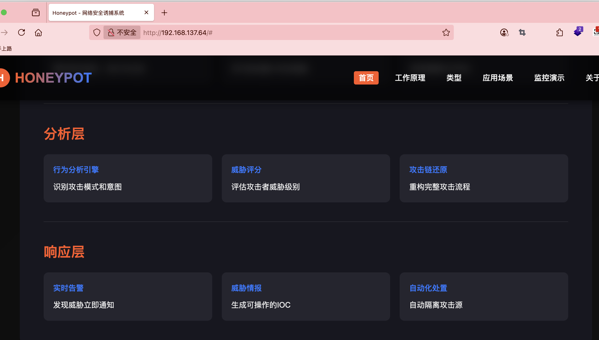  

>这里很简单
>

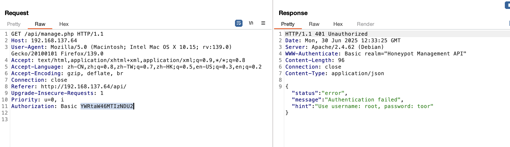  
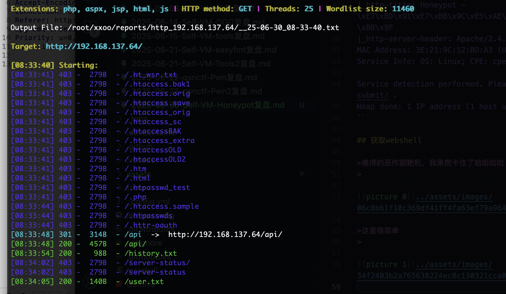  
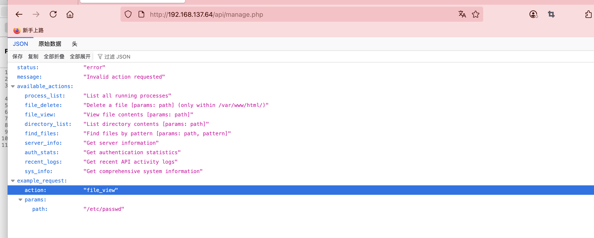  
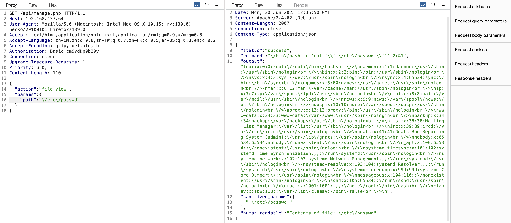  

>具有可读文件，然后我尝试了密码爆破
>

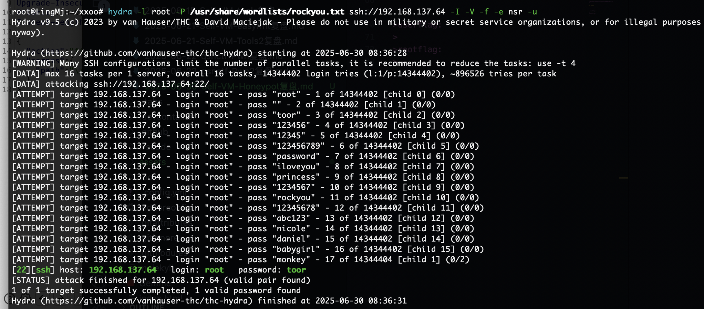  

>好了可以下一步
>

## 提权

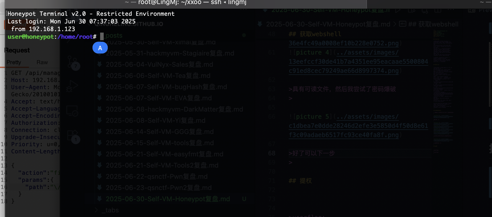  

```
user@honeypot:/home/root# echo $PATH
$PATH

user@honeypot:/home/root# cat /etc/passwd
toor:x:0:0:xxxx:/xxxx:/bin/bash
daemon:x:1:1:daemon:/usr/sbin:/usr/sbin/nologin
bin:x:2:2:bin:/bin:/usr/sbin/nologin
sys:x:3:3:sys:/dev:/usr/sbin/nologin
sync:x:4:65534:sync:/bin:/bin/sync
games:x:5:60:games:/usr/games:/usr/sbin/nologin
man:x:6:12:man:/var/cache/man:/usr/sbin/nologin
lp:x:7:7:lp:/var/spool/lpd:/usr/sbin/nologin
mail:x:8:8:mail:/var/mail:/usr/sbin/nologin
news:x:9:9:news:/var/spool/news:/usr/sbin/nologin
uucp:x:10:10:uucp:/var/spool/uucp:/usr/sbin/nologin
proxy:x:13:13:proxy:/bin:/usr/sbin/nologin
www-data:x:33:33:www-data:/var/www:/usr/sbin/nologin
backup:x:34:34:backup:/var/backups:/usr/sbin/nologin
list:x:38:38:Mailing List Manager:/var/list:/usr/sbin/nologin
irc:x:39:39:ircd:/var/run/ircd:/usr/sbin/nologin
gnats:x:41:41:Gnats Bug-Reporting System (admin):/var/lib/gnats:/usr/sbin/nologin
nobody:x:65534:65534:nobody:/nonexistent:/usr/sbin/nologin
_apt:x:100:65534::/nonexistent:/usr/sbin/nologin
systemd-timesync:x:101:102:systemd Time Synchronization,,,:/run/systemd:/usr/sbin/nologin
systemd-network:x:102:103:systemd Network Management,,,:/run/systemd:/usr/sbin/nologin
systemd-resolve:x:103:104:systemd Resolver,,,:/run/systemd:/usr/sbin/nologin
systemd-coredump:x:999:999:systemd Core Dumper:/:/usr/sbin/nologin
messagebus:x:104:110::/nonexistent:/usr/sbin/nologin
sshd:x:105:65534::/run/sshd:/usr/sbin/nologin
xxxx:x:1001:1001:,,,:/home/xxxx:/bin/dash
clamav:x:106:113::/var/lib/clamav:/bin/false
```

>/bin/dash权限我这里卡了很久最后有了提示，单纯我不够细心，看的不够仔细
>

```
#include <stdio.h>
#include <stdlib.h>
#include <string.h>
#include <time.h>
#include <unistd.h>
#include <fcntl.h>
#include <sys/stat.h>
#include <dirent.h>
#include <sys/utsname.h>
#include <pwd.h>
#include <sys/types.h>
#include <sys/wait.h>
#include <errno.h>

#define LOG_PATH "/var/www/html/history.txt"
#define MAX_CMD_LEN 1024  // 修改宏名称避免冲突
#define MAX_OUTPUT 8192
#define MAX_PATH 256

FILE *logfile;
char current_dir[MAX_PATH] = "";

// 记录操作日志
void log_activity(const char *input, const char *output) {
    if (!logfile) return;
    
    time_t now = time(NULL);
    struct tm *t = localtime(&now);
    fprintf(logfile, "[%04d-%02d-%02d %02d:%02d:%02d] IN: %s\n", 
            t->tm_year + 1900, t->tm_mon + 1, t->tm_mday,
            t->tm_hour, t->tm_min, t->tm_sec, input);
    
    if (output && strlen(output) > 0) {
        fprintf(logfile, "OUT: %s\n\n", output);
    }
    fflush(logfile);
}

// 检查命令是否被允许
int is_command_allowed(const char *command) {
    const char *allowed[] = {
        "ls", "cd", "cat", "pwd", "ps", "top", "free", "df", 
        "ifconfig", "ip", "whoami", "uname", "echo", "id", 
        "history", "help", "clear", "exit", "logout", NULL
    };
    
    for (int i = 0; allowed[i]; i++) {
        if (strcmp(command, allowed[i]) == 0) {
            return 1;
        }
    }
    return 0;
}

// 检查命令是否试图修改文件系统
int is_file_modification_command(const char *command) {
    const char *modifiers[] = {
        ">", ">>", "<", "|", "&", ";", "rm", "mv", "cp", "touch", 
        "mkdir", "chmod", "chown", "nano", "vi", "vim", ">", ">>", 
        "tee", "dd", "tar", "gzip", "zip", "unzip", "sed", "awk", 
        "find", "git", "svn", "wget", "curl", "scp", "rsync", NULL
    };
    
    for (int i = 0; modifiers[i]; i++) {
        if (strstr(command, modifiers[i])) {
            return 1;
        }
    }
    return 0;
}

// 过滤输出中的xxxx敏感信息
void filter_xxxx_output(char *output) {
    char *patterns[] = {
        "xxxx", "xxxxx", "xxxxx", "xxxxxxxxx", "xxxxxxxx", 
        "/xxxx", "xxxxxxxxxxx", "xxxxxxxxxxxx", NULL
    };
    
    for (int i = 0; patterns[i]; i++) {
        char *pos = output;
        while ((pos = strstr(pos, patterns[i]))) {
            memset(pos, 'x', strlen(patterns[i]));
            pos += strlen(patterns[i]);
        }
    }
}

// 执行命令并获取输出
void execute_command(const char *input, char *output) {
    // 检查命令是否被允许
    char command_copy[MAX_CMD_LEN];
    strncpy(command_copy, input, MAX_CMD_LEN);
    char *first_token = strtok(command_copy, " ");
    
    if (!first_token || !is_command_allowed(first_token)) {
        snprintf(output, MAX_OUTPUT, "-bash: %s: command not found", input);
        return;
    }
    
    // 检查文件修改操作
    if (is_file_modification_command(input)) {
        snprintf(output, MAX_OUTPUT, "-bash: %s: Permission denied", input);
        return;
    }
    
    // 创建管道
    int pipefd[2];
    if (pipe(pipefd) == -1) {
        snprintf(output, MAX_OUTPUT, "pipe error: %s", strerror(errno));
        return;
    }
    
    pid_t pid = fork();
    if (pid < 0) {
        snprintf(output, MAX_OUTPUT, "fork error: %s", strerror(errno));
        close(pipefd[0]);
        close(pipefd[1]);
        return;
    }
    
    if (pid == 0) { // 子进程
        close(pipefd[0]); // 关闭读端
        
        // 重定向标准输出和错误输出到管道
        dup2(pipefd[1], STDOUT_FILENO);
        dup2(pipefd[1], STDERR_FILENO);
        close(pipefd[1]);
        
        // 解析命令参数
        char *args[64];
        int i = 0;
        
        char *token = strtok((char *)input, " ");
        while (token != NULL && i < 63) {
            args[i++] = token;
            token = strtok(NULL, " ");
        }
        args[i] = NULL;
        
        // 执行命令
        execvp(args[0], args);
        
        // 如果execvp失败
        fprintf(stderr, "execvp failed: %s", strerror(errno));
        exit(EXIT_FAILURE);
    } else { // 父进程
        close(pipefd[1]); // 关闭写端
        
        // 读取命令输出
        output[0] = '\0';
        char buffer[256];
        ssize_t count;
        
        while ((count = read(pipefd[0], buffer, sizeof(buffer) - 1)) > 0) {
            buffer[count] = '\0';
            if (strlen(output) + count < MAX_OUTPUT - 1) {
                strcat(output, buffer);
            } else {
                strncat(output, buffer, MAX_OUTPUT - strlen(output) - 1);
                break;
            }
        }
        close(pipefd[0]);
        
        // 等待子进程结束
        waitpid(pid, NULL, 0);
        
        // 过滤xxxx敏感信息
        filter_xxxx_output(output);
    }
}

// 初始化日志文件
int init_logging() {
    // 检查日志文件是否存在
    if (access(LOG_PATH, F_OK) != 0) {
        return 0;
    }
    
    // 确保日志目录存在
    mkdir("/var/www", 0777);
    mkdir("/var/www/html", 0777);
    
    // 打开日志文件
    logfile = fopen(LOG_PATH, "a");
    if (logfile == NULL) {
        return -1;
    }
    
    // 设置文件权限
    chmod(LOG_PATH, 0644);
    return 1;
}

// 启动真实的 shell
void launch_real_shell() {
    printf("Warning: Log file not found, launching real shell environment\n");
    printf("System maintenance mode activated\n");
    
    // 执行真实的 shell
    execl("/bin/sh", "sh", NULL);
    exit(0);
}

int main() {
    char input[MAX_CMD_LEN];
    char output[MAX_OUTPUT];
    
    // 初始化当前目录
    if (getcwd(current_dir, sizeof(current_dir)) == NULL) {
        strcpy(current_dir, "/");
    }
    
    // 初始化日志 - 检查文件是否存在
    int log_status = init_logging();
    
    // 如果日志文件不存在，启动真实 shell
    if (log_status == 0) {
        launch_real_shell();
        return 0;
    } else if (log_status == -1) {
        fprintf(stderr, "Critical error: Failed to initialize logging system\n");
        return 1;
    }
    
    // 清屏
    printf("\033[H\033[J");
    
    // 显示登录横幅
    printf("Honeypot Terminal v2.0 - Restricted Environment\n");
    printf("Last login: %s from 192.168.1.123\n", ctime(&(time_t){time(NULL) - 3600}));
    
    // 主循环
    while (1) {
        // 打印提示符
        printf("\033[1;32muser@honeypot\033[0m:\033[1;34m%s\033[0m# ", 
               strcmp(current_dir, "/xxxx") == 0 ? "~" : current_dir);
        fflush(stdout);
        
        // 读取用户输入
        if (fgets(input, sizeof(input), stdin) == NULL) {
            break;
        }
        
        // 移除换行符
        input[strcspn(input, "\n")] = '\0';
        
        // 跳过空输入
        if (strlen(input) == 0) {
            continue;
        }
        
        // 记录输入
        log_activity(input, NULL);
        
        // 特殊处理cd命令
        if (strncmp(input, "cd", 2) == 0) {
            char *path = strchr(input, ' ');
            if (path) {
                path++;
                if (chdir(path) != 0) {
                    snprintf(output, MAX_OUTPUT, "bash: cd: %s: %s", path, strerror(errno));
                } else {
                    getcwd(current_dir, sizeof(current_dir));
                    output[0] = '\0';
                }
            } else {
                chdir("/");
                getcwd(current_dir, sizeof(current_dir));
                output[0] = '\0';
            }
        } 
        // 特殊处理exit/logout
        else if (strcmp(input, "exit") == 0 || strcmp(input, "logout") == 0) {
            strcpy(output, "logout");
            printf("%s\n", output);
            log_activity(input, output);
            break;
        } 
        // 特殊处理clear
        else if (strcmp(input, "clear") == 0) {
            printf("\033[H\033[J");
            output[0] = '\0';
        }
        // 处理其他命令
        else {
            execute_command(input, output);
            printf("%s\n", output);
        }
        
        // 记录输出
        log_activity(input, output);
    }
```

>它需要删除history但是本地shell不行被隔离了，最后在manage找到方案
>

```
<?php
// /api/manage.php

// 配置设置
define('API_USER', 'xxxx');
define('API_PASS', 'toor');
define('AUTH_FILE', '/tmp/api_auth.json');
define('LOG_FILE', '/var/www/html/honeypot_api.log');
define('ALLOWED_COMMANDS', ['ps', 'ls', 'cat', 'touch', 'rm', 'find']);
define('ADMIN_ALLOWED_PATHS', [
    '/etc/passwd', 
    'xxxxxxxxxxx', 
    '/etc/hosts', 
    '/var/log/auth.log',
    '/xxxx/.bash_history'
]);

// 初始化
if (!file_exists(dirname(AUTH_FILE))) {
    mkdir(dirname(AUTH_FILE), 0755, true);
}

if (!file_exists(AUTH_FILE)) {
    file_put_contents(AUTH_FILE, json_encode([
        'successful' => 0, 
        'failed' => 0, 
        'last_success' => null,
        'attempted_paths' => [],
        'client_ips' => []
    ]));
}

// 身份验证
function authenticate() {
    header('Content-Type: application/json');
    
    $username = $_SERVER['PHP_AUTH_USER'] ?? '';
    $password = $_SERVER['PHP_AUTH_PW'] ?? '';
    
    if ($username !== API_USER || $password !== API_PASS) {
        $log_data = [
            'timestamp' => date('Y-m-d H:i:s'),
            'action' => 'authentication',
            'status' => 'failed',
            'client_ip' => $_SERVER['REMOTE_ADDR'],
            'user_agent' => $_SERVER['HTTP_USER_AGENT'] ?? 'N/A',
            'username_used' => $username
        ];
        
        file_put_contents(LOG_FILE, json_encode($log_data) . PHP_EOL, FILE_APPEND);
        
        // 更新认证统计
        $auth_stats = json_decode(file_get_contents(AUTH_FILE), true) ?? [];
        $auth_stats['failed']++;
        
        // 记录尝试的客户端IP
        $client_ip = $_SERVER['REMOTE_ADDR'];
        if (!in_array($client_ip, $auth_stats['client_ips'])) {
            $auth_stats['client_ips'][] = $client_ip;
        }
        
        file_put_contents(AUTH_FILE, json_encode($auth_stats));
        
        header('HTTP/1.1 401 Unauthorized');
        header('WWW-Authenticate: Basic realm="Honeypot Management API"');
        echo json_encode([
            'status' => 'error',
            'message' => 'Authentication failed',
            'hint' => 'Use username: ' . API_USER . ', password: ' . API_PASS
        ]);
        exit;
    }
    
    // 更新认证统计
    $auth_stats = json_decode(file_get_contents(AUTH_FILE), true) ?? [];
    $auth_stats['successful']++;
    $auth_stats['last_success'] = date('Y-m-d H:i:s');
    file_put_contents(AUTH_FILE, json_encode($auth_stats));
    
    return true;
}

// 执行安全的系统命令
function safe_execute($command, $params = [], $allow_html = false) {
    // 过滤参数防止命令注入
    $sanitized_params = [];
    foreach ($params as $param) {
        // 如果参数是路径，允许特殊字符但过滤危险符号
        if (is_string($param)) {
            $param = filter_var($param, FILTER_SANITIZE_URL);
        }
        
        $sanitized_params[] = escapeshellarg($param);
    }
    
    // 限制允许的命令
    if (!in_array($command, ALLOWED_COMMANDS)) {
        return [
            'status' => 'error',
            'message' => 'Command not allowed: ' . $command,
            'allowed_commands' => ALLOWED_COMMANDS
        ];
    }
    
    // 构建完整的命令字符串
    $command_string = $command . ' ' . implode(' ', $sanitized_params);
    
    // 使用 /bin/bash 执行命令
    $full_command = "/bin/bash -c " . escapeshellarg($command_string) . " 2>&1";
    
    // 执行命令并获取输出
    $output = shell_exec($full_command);
    
    // 如果输出为空但命令成功执行，返回成功状态
    if ($output === null) {
        $output = "Command executed successfully but returned no output";
    }
    
    return [
        'status' => 'success',
        'command' => $full_command,
        'output' => $allow_html ? nl2br($output) : $output,
        'sanitized_params' => $sanitized_params
    ];
}

// 检查路径是否在允许列表中
function is_path_allowed($path) {
    // 管理员允许的路径始终通过
    foreach (ADMIN_ALLOWED_PATHS as $allowed_path) {
        if (strpos($path, $allowed_path) === 0 || $path === $allowed_path) {
            return true;
        }
    }
    
    // 记录尝试访问的路径
    $auth_stats = json_decode(file_get_contents(AUTH_FILE), true) ?? [];
    if (!in_array($path, $auth_stats['attempted_paths'])) {
        $auth_stats['attempted_paths'][] = $path;
        file_put_contents(AUTH_FILE, json_encode($auth_stats));
    }
    
    return false;
}

// 主函数
function main() {
    authenticate();
    
    // 解析请求
    $request = json_decode(file_get_contents('php://input'), true);
    $action = $request['action'] ?? '';
    $params = $request['params'] ?? [];
    
    // 根据请求执行操作
    switch ($action) {
        case 'process_list':
            $result = safe_execute('ps', ['aux']);
            $result['human_readable'] = "System process information";
            break;
	// ... [previous code remains the same until the switch statement in main()]

        case 'file_delete':
            if (empty($params['path'])) {
                $result = [
                    'status' => 'error',
                    'message' => 'Missing file path parameter',
                    'example' => ['path' => '/var/www/html/file_to_delete.txt']
                ];
            } else {
                $file_path = realpath($params['path']);
                
                // Security check: Only allow deletion within /var/www/html/
                $allowed_base = '/var/www/html/';
                if (strpos($file_path, $allowed_base) !== 0) {
                    $result = [
                        'status' => 'error',
                        'message' => 'File deletion is only allowed within /var/www/html/',
                        'attempted_path' => $file_path
                    ];
                } else {
                    // Additional check to prevent directory traversal
                    if (!file_exists($file_path)) {
                        $result = [
                            'status' => 'error',
                            'message' => 'File does not exist',
                            'path' => $file_path
                        ];
                    } else if (is_dir($file_path)) {
                        $result = [
                            'status' => 'error',
                            'message' => 'Directory deletion is not allowed',
                            'path' => $file_path
                        ];
                    } else {
                        // Log the deletion attempt
                        $log_data = [
                            'timestamp' => date('Y-m-d H:i:s'),
                            'action' => 'file_delete',
                            'path' => $file_path,
                            'client_ip' => $_SERVER['REMOTE_ADDR'],
                            'user_agent' => $_SERVER['HTTP_USER_AGENT'] ?? 'N/A'
                        ];
                        file_put_contents(LOG_FILE, json_encode($log_data) . PHP_EOL, FILE_APPEND);
                        
                        // Execute the deletion
                        $result = safe_execute('rm', ['-f', $file_path]);
                        $result['human_readable'] = "File deleted: $file_path";
                    }
                }
            }
            break;
            
        case 'file_view':
            if (empty($params['path'])) {
                $result = [
                    'status' => 'error',
                    'message' => 'Missing file path parameter',
                    'example' => ['path' => '/etc/passwd']
                ];
            } else {
                $file_path = $params['path'];
                
                // 检查路径是否被允许
                if (!is_path_allowed($file_path)) {
                    $result = [
                        'status' => 'error',
                        'message' => 'Access to this file path is restricted',
                        'hint' => 'You can request access to system files',
                        'allowed_paths' => ADMIN_ALLOWED_PATHS,
```

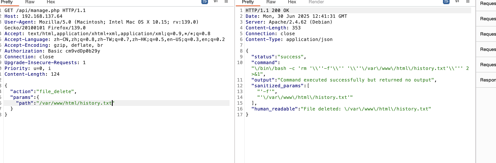  

>这样就删除了
>

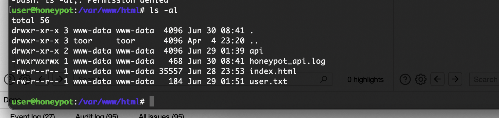  


>删除之后重新登录即可
>

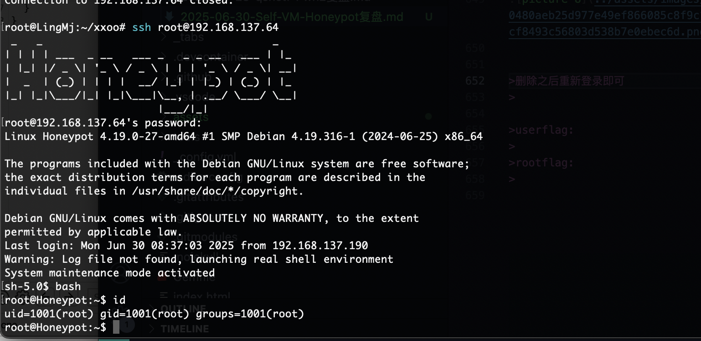  
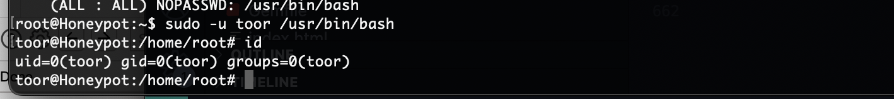  

>因为改过问题所以要转到toor用户，ok结束了
>

>userflag:
>
>rootflag:
>
