## 网段扫描
```
root@LingMj:~# arp-scan -l
Interface: eth0, type: EN10MB, MAC: 00:0c:29:d1:27:55, IPv4: 192.168.137.190
Starting arp-scan 1.10.0 with 256 hosts (https://github.com/royhills/arp-scan)
192.168.137.1	3e:21:9c:12:bd:a3	(Unknown: locally administered)
192.168.137.64	3e:21:9c:12:bd:a3	(Unknown: locally administered)
192.168.137.203	a0:78:17:62:e5:0a	Apple, Inc.

8 packets received by filter, 0 packets dropped by kernel
Ending arp-scan 1.10.0: 256 hosts scanned in 2.088 seconds (122.61 hosts/sec). 3 responded
```

## 端口扫描

```
root@LingMj:~# nmap -p- -sC -sV 192.168.137.64
Starting Nmap 7.95 ( https://nmap.org ) at 2025-07-01 19:58 EDT
Nmap scan report for Leak.mshome.net (192.168.137.64)
Host is up (0.0070s latency).
Not shown: 65533 closed tcp ports (reset)
PORT   STATE SERVICE VERSION
22/tcp open  ssh     OpenSSH 8.4p1 Debian 5+deb11u3 (protocol 2.0)
| ssh-hostkey: 
|   3072 f6:a3:b6:78:c4:62:af:44:bb:1a:a0:0c:08:6b:98:f7 (RSA)
|   256 bb:e8:a2:31:d4:05:a9:c9:31:ff:62:f6:32:84:21:9d (ECDSA)
|_  256 3b:ae:34:64:4f:a5:75:b9:4a:b9:81:f9:89:76:99:eb (ED25519)
80/tcp open  http    Apache httpd 2.4.62 ((Debian))
|_http-server-header: Apache/2.4.62 (Debian)
|_http-title: Kali Linux - \xE5\xAE\x89\xE5\x85\xA8\xE6\xB8\x97\xE9\x80\x8F\xE6\xB5\x8B\xE8\xAF\x95\xE5\xB9\xB3\xE5\x8F\xB0
MAC Address: 3E:21:9C:12:BD:A3 (Unknown)
Service Info: OS: Linux; CPE: cpe:/o:linux:linux_kernel

Service detection performed. Please report any incorrect results at https://nmap.org/submit/ .
Nmap done: 1 IP address (1 host up) scanned in 13.70 seconds
```

## 获取webshell

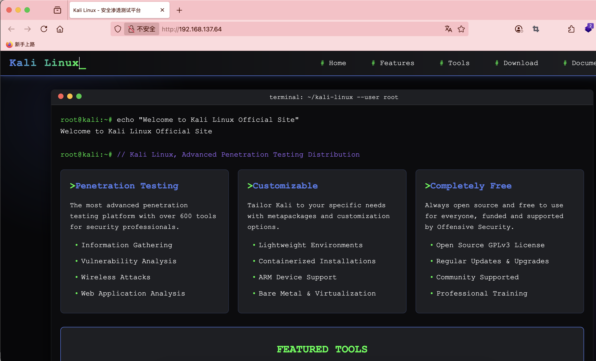  
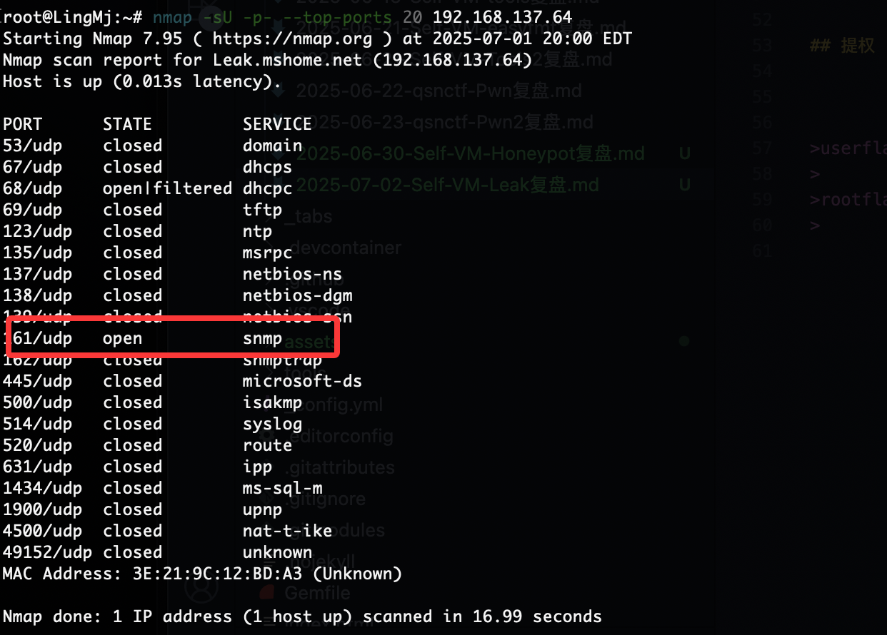  
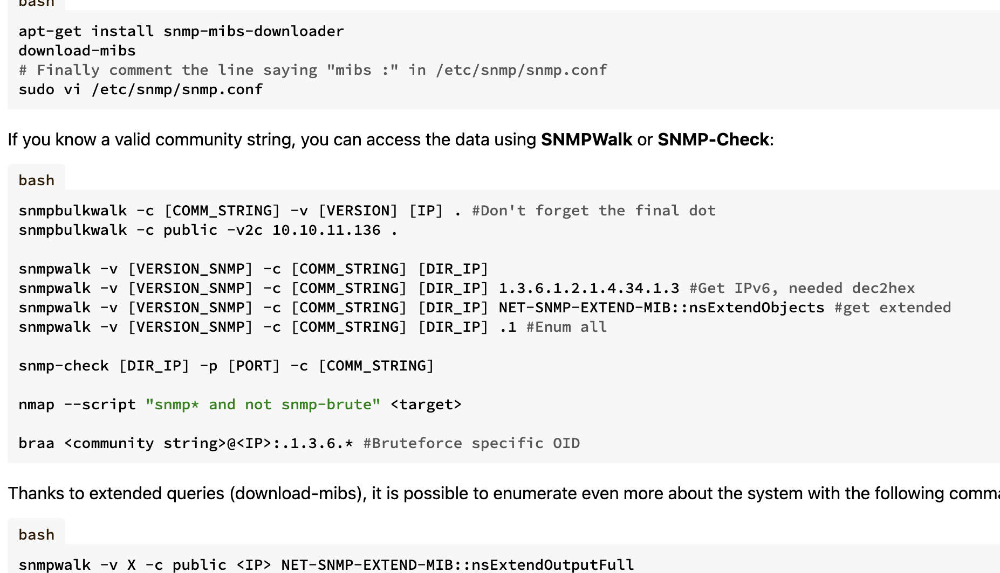  
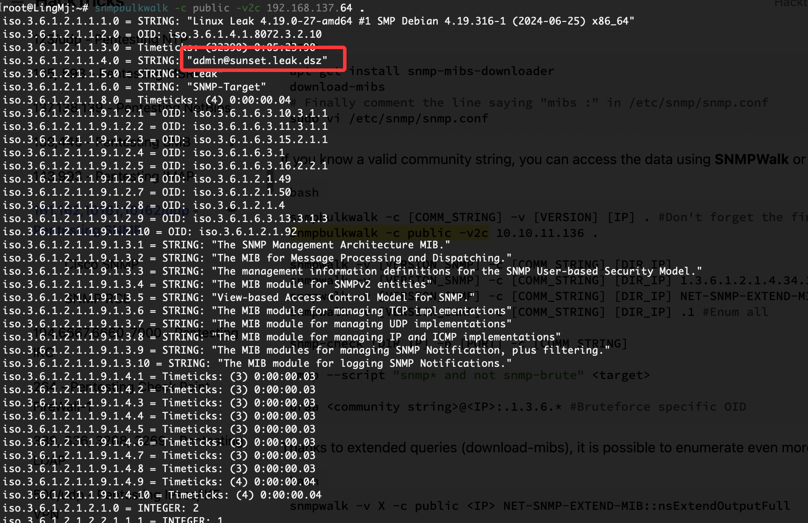  
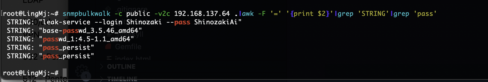  

>出现账号密码了，先填写域名
>

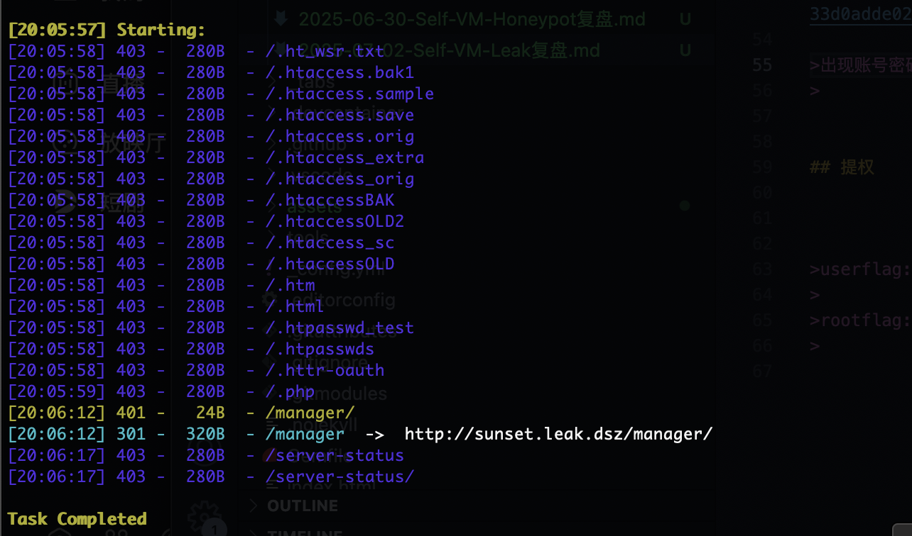  
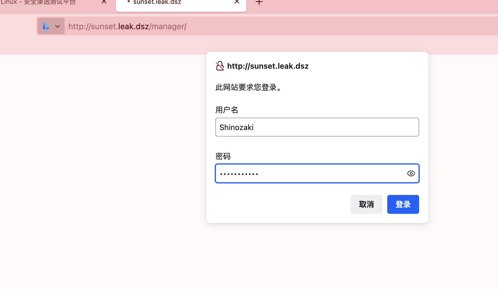  
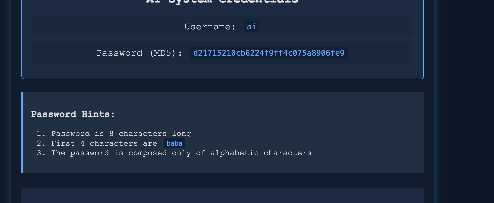  
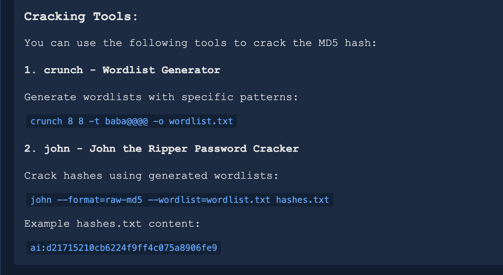  

>这里有如何构造这个密码的方案
>

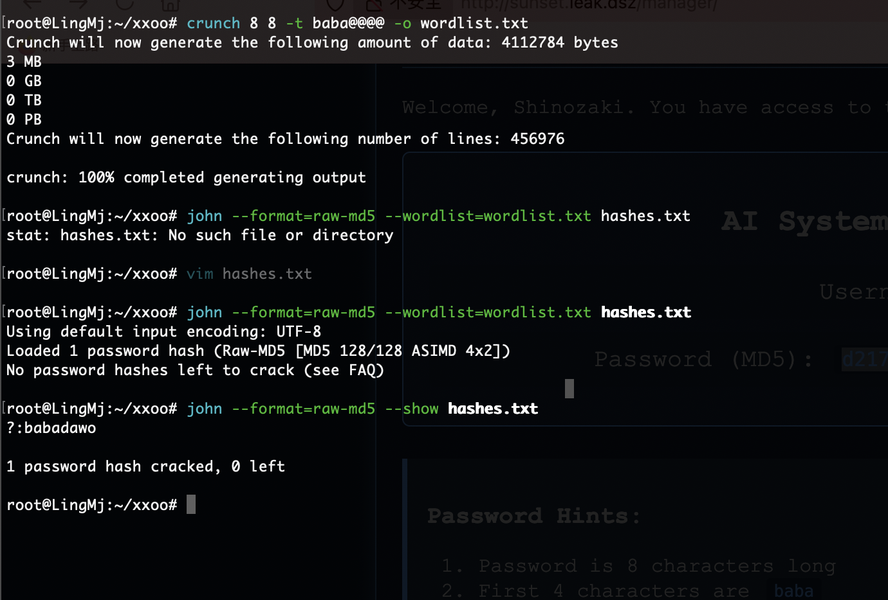  

>好了又密码了
>

## 提权

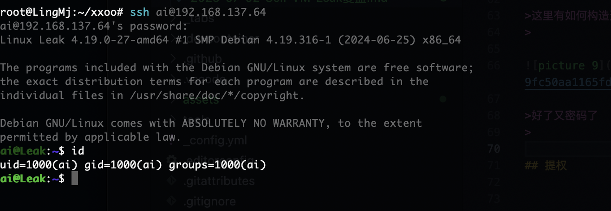  
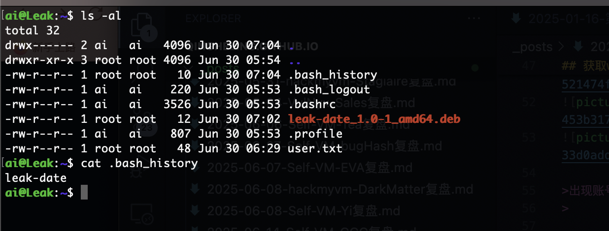  

>这个东西我查了很久，然后拿了提示包里面我以为构造deb包，但是没有sudo，suid所以我一直卡住
>

```
ai@Leak:~$ dpkg --help
Usage: dpkg [<option> ...] <command>

Commands:
  -i|--install       <.deb file name>... | -R|--recursive <directory>...
  --unpack           <.deb file name>... | -R|--recursive <directory>...
  -A|--record-avail  <.deb file name>... | -R|--recursive <directory>...
  --configure        <package>... | -a|--pending
  --triggers-only    <package>... | -a|--pending
  -r|--remove        <package>... | -a|--pending
  -P|--purge         <package>... | -a|--pending
  -V|--verify [<package>...]       Verify the integrity of package(s).
  --get-selections [<pattern>...]  Get list of selections to stdout.
  --set-selections                 Set package selections from stdin.
  --clear-selections               Deselect every non-essential package.
  --update-avail [<Packages-file>] Replace available packages info.
  --merge-avail [<Packages-file>]  Merge with info from file.
  --clear-avail                    Erase existing available info.
  --forget-old-unavail             Forget uninstalled unavailable pkgs.
  -s|--status [<package>...]       Display package status details.
  -p|--print-avail [<package>...]  Display available version details.
  -L|--listfiles <package>...      List files 'owned' by package(s).
  -l|--list [<pattern>...]         List packages concisely.
  -S|--search <pattern>...         Find package(s) owning file(s).
  -C|--audit [<package>...]        Check for broken package(s).
  --yet-to-unpack                  Print packages selected for installation.
  --predep-package                 Print pre-dependencies to unpack.
  --add-architecture <arch>        Add <arch> to the list of architectures.
  --remove-architecture <arch>     Remove <arch> from the list of architectures.
  --print-architecture             Print dpkg architecture.
  --print-foreign-architectures    Print allowed foreign architectures.
  --assert-<feature>               Assert support for the specified feature.
  --validate-<thing> <string>      Validate a <thing>'s <string>.
  --compare-versions <a> <op> <b>  Compare version numbers - see below.
  --force-help                     Show help on forcing.
  -Dh|--debug=help                 Show help on debugging.

  -?, --help                       Show this help message.
      --version                    Show the version.

Assertable features: support-predepends, working-epoch, long-filenames,
  multi-conrep, multi-arch, versioned-provides.

Validatable things: pkgname, archname, trigname, version.

Use dpkg with -b, --build, -c, --contents, -e, --control, -I, --info,
  -f, --field, -x, --extract, -X, --vextract, --ctrl-tarfile, --fsys-tarfile
on archives (type dpkg-deb --help).

Options:
  --admindir=<directory>     Use <directory> instead of /var/lib/dpkg.
  --root=<directory>         Install on a different root directory.
  --instdir=<directory>      Change installation dir without changing admin dir.
  --path-exclude=<pattern>   Do not install paths which match a shell pattern.
  --path-include=<pattern>   Re-include a pattern after a previous exclusion.
  -O|--selected-only         Skip packages not selected for install/upgrade.
  -E|--skip-same-version     Skip packages whose same version is installed.
  -G|--refuse-downgrade      Skip packages with earlier version than installed.
  -B|--auto-deconfigure      Install even if it would break some other package.
  --[no-]triggers            Skip or force consequential trigger processing.
  --verify-format=<format>   Verify output format (supported: 'rpm').
  --no-debsig                Do not try to verify package signatures.
  --no-act|--dry-run|--simulate
                             Just say what we would do - don't do it.
  -D|--debug=<octal>         Enable debugging (see -Dhelp or --debug=help).
  --status-fd <n>            Send status change updates to file descriptor <n>.
  --status-logger=<command>  Send status change updates to <command>'s stdin.
  --log=<filename>           Log status changes and actions to <filename>.
  --ignore-depends=<package>,...
                             Ignore dependencies involving <package>.
  --force-...                Override problems (see --force-help).
  --no-force-...|--refuse-...
                             Stop when problems encountered.
  --abort-after <n>          Abort after encountering <n> errors.

Comparison operators for --compare-versions are:
  lt le eq ne ge gt       (treat empty version as earlier than any version);
  lt-nl le-nl ge-nl gt-nl (treat empty version as later than any version);
  < << <= = >= >> >       (only for compatibility with control file syntax).

Use 'apt' or 'aptitude' for user-friendly package management.
```

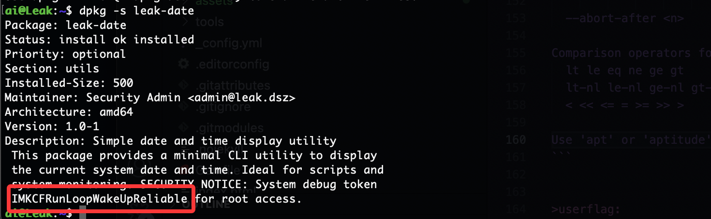  
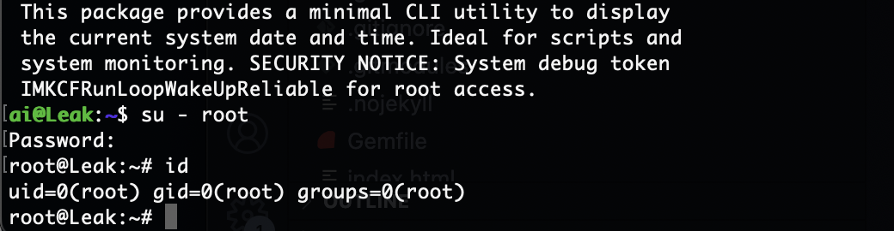  

>好了结束了
>

>userflag:
>
>rootflag:
>
