## 网段扫描
```
root@LingMj:~/xxoo# arp-scan -l
Interface: eth0, type: EN10MB, MAC: 00:0c:29:d1:27:55, IPv4: 192.168.137.190
Starting arp-scan 1.10.0 with 256 hosts (https://github.com/royhills/arp-scan)
192.168.137.1	3e:21:9c:12:bd:a3	(Unknown: locally administered)
192.168.137.23	3e:21:9c:12:bd:a3	(Unknown: locally administered)
192.168.137.203	a0:78:17:62:e5:0a	Apple, Inc.

8 packets received by filter, 0 packets dropped by kernel
Ending arp-scan 1.10.0: 256 hosts scanned in 2.072 seconds (123.55 hosts/sec). 3 responded
```

## 端口扫描

```
root@LingMj:~/xxoo# nmap -p- -sC -sV 192.168.137.23           
Starting Nmap 7.95 ( https://nmap.org ) at 2025-07-01 20:16 EDT
Nmap scan report for New.mshome.net (192.168.137.23)
Host is up (0.0064s latency).
Not shown: 65533 closed tcp ports (reset)
PORT   STATE SERVICE VERSION
22/tcp open  ssh     OpenSSH 8.4p1 Debian 5+deb11u3 (protocol 2.0)
| ssh-hostkey: 
|   3072 f6:a3:b6:78:c4:62:af:44:bb:1a:a0:0c:08:6b:98:f7 (RSA)
|   256 bb:e8:a2:31:d4:05:a9:c9:31:ff:62:f6:32:84:21:9d (ECDSA)
|_  256 3b:ae:34:64:4f:a5:75:b9:4a:b9:81:f9:89:76:99:eb (ED25519)
80/tcp open  http    Apache httpd 2.4.62 ((Debian))
|_http-server-header: Apache/2.4.62 (Debian)
|_http-generator: WordPress 6.8.1
|_http-title: Hi Maze
| http-robots.txt: 1 disallowed entry 
|_/wp-admin/
MAC Address: 3E:21:9C:12:BD:A3 (Unknown)
Service Info: OS: Linux; CPE: cpe:/o:linux:linux_kernel

Service detection performed. Please report any incorrect results at https://nmap.org/submit/ .
Nmap done: 1 IP address (1 host up) scanned in 19.33 seconds
```

## 获取webshell

  
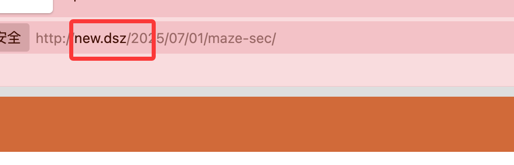  

>这里工具好可以使用wpscan，但是我工具坏了
>

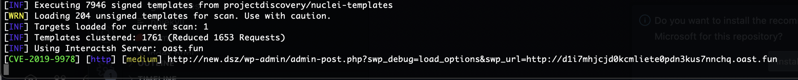  

>用nuclei就好了
>

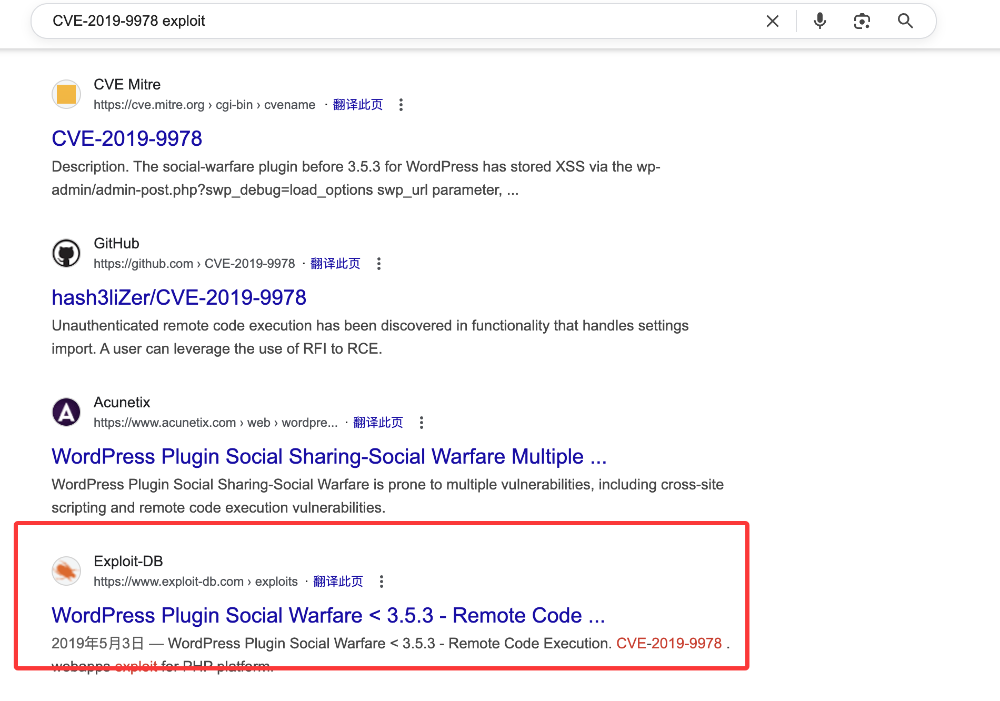  
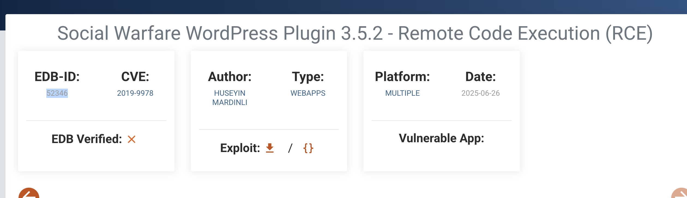  
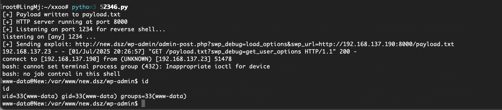  

>好了拿到shell
>

## 提权

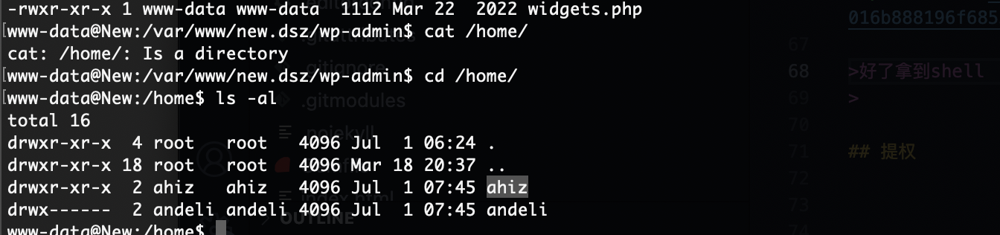  
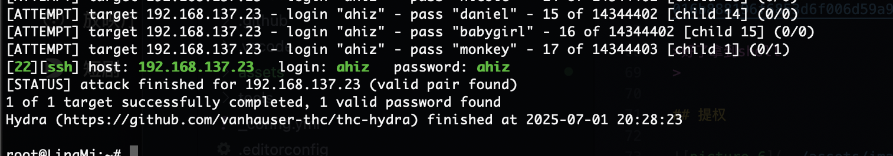  

>这里我研究了很久发现其实可以hydra
>

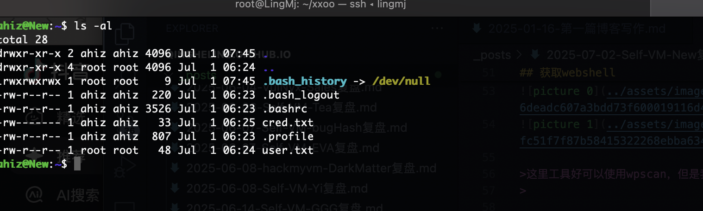  
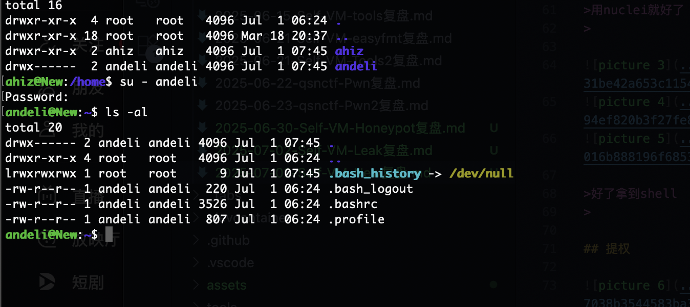  
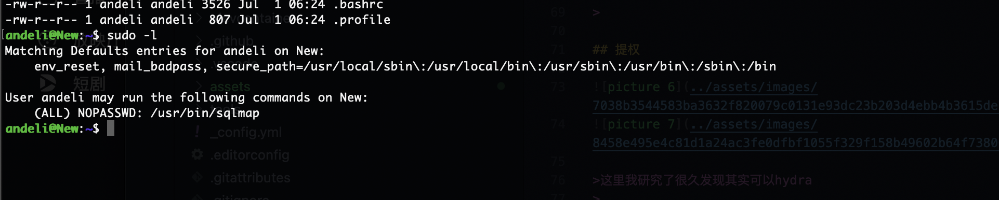  

>sqlmap可以命令执行
>

```
andeli@New:~$ sqlmap -h
        ___
       __H__
 ___ ___[.]_____ ___ ___  {1.5.2#stable}
|_ -| . ["]     | .'| . |
|___|_  [']_|_|_|__,|  _|
      |_|V...       |_|   http://sqlmap.org

Usage: python3 sqlmap [options]

Options:
  -h, --help            Show basic help message and exit
  -hh                   Show advanced help message and exit
  --version             Show program's version number and exit
  -v VERBOSE            Verbosity level: 0-6 (default 1)

  Target:
    At least one of these options has to be provided to define the
    target(s)

    -u URL, --url=URL   Target URL (e.g. "http://www.site.com/vuln.php?id=1")
    -g GOOGLEDORK       Process Google dork results as target URLs

  Request:
    These options can be used to specify how to connect to the target URL

    --data=DATA         Data string to be sent through POST (e.g. "id=1")
    --cookie=COOKIE     HTTP Cookie header value (e.g. "PHPSESSID=a8d127e..")
    --random-agent      Use randomly selected HTTP User-Agent header value
    --proxy=PROXY       Use a proxy to connect to the target URL
    --tor               Use Tor anonymity network
    --check-tor         Check to see if Tor is used properly

  Injection:
    These options can be used to specify which parameters to test for,
    provide custom injection payloads and optional tampering scripts

    -p TESTPARAMETER    Testable parameter(s)
    --dbms=DBMS         Force back-end DBMS to provided value

  Detection:
    These options can be used to customize the detection phase

    --level=LEVEL       Level of tests to perform (1-5, default 1)
    --risk=RISK         Risk of tests to perform (1-3, default 1)

  Techniques:
    These options can be used to tweak testing of specific SQL injection
    techniques

    --technique=TECH..  SQL injection techniques to use (default "BEUSTQ")

  Enumeration:
    These options can be used to enumerate the back-end database
    management system information, structure and data contained in the
    tables

    -a, --all           Retrieve everything
    -b, --banner        Retrieve DBMS banner
    --current-user      Retrieve DBMS current user
    --current-db        Retrieve DBMS current database
    --passwords         Enumerate DBMS users password hashes
    --tables            Enumerate DBMS database tables
    --columns           Enumerate DBMS database table columns
    --schema            Enumerate DBMS schema
    --dump              Dump DBMS database table entries
    --dump-all          Dump all DBMS databases tables entries
    -D DB               DBMS database to enumerate
    -T TBL              DBMS database table(s) to enumerate
    -C COL              DBMS database table column(s) to enumerate

  Operating system access:
    These options can be used to access the back-end database management
    system underlying operating system

    --os-shell          Prompt for an interactive operating system shell
    --os-pwn            Prompt for an OOB shell, Meterpreter or VNC

  General:
    These options can be used to set some general working parameters

    --batch             Never ask for user input, use the default behavior
    --flush-session     Flush session files for current target

  Miscellaneous:
    These options do not fit into any other category

    --sqlmap-shell      Prompt for an interactive sqlmap shell
    --wizard            Simple wizard interface for beginner users

[!] to see full list of options run with '-hh'
[20:30:57] [WARNING] your sqlmap version is outdated
```

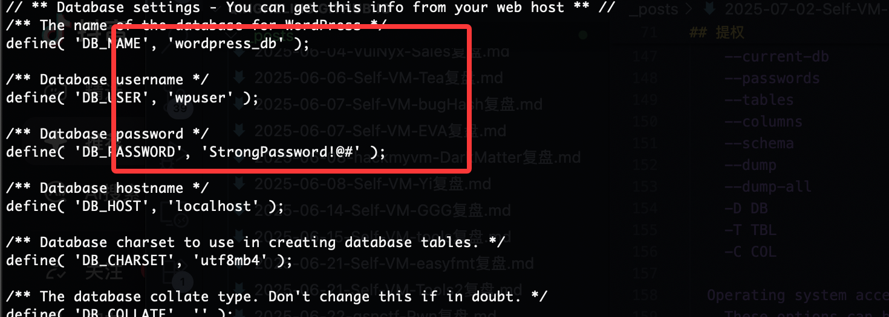  

>这个有用我们自己写一个存在sql注入的php
>

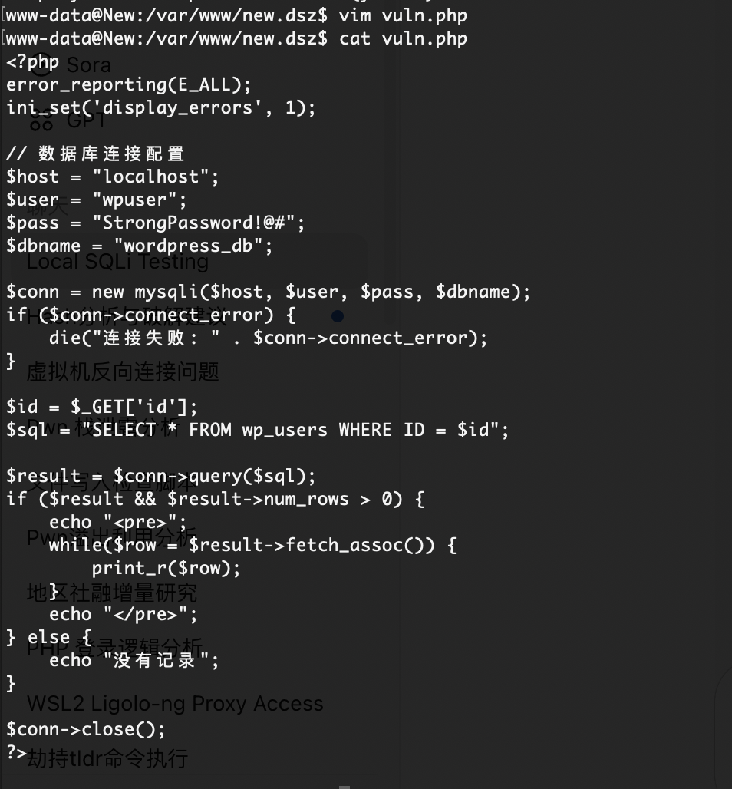  
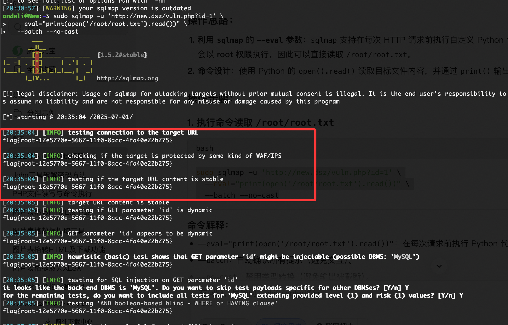  
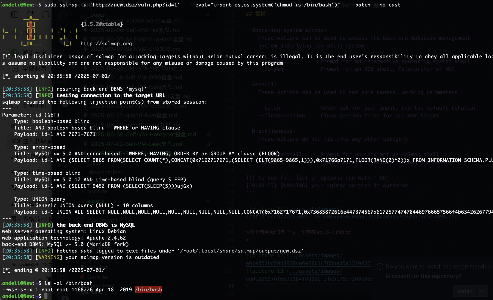  
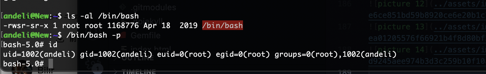  

>好了结束了，还是很简单的，非常常规没有猜谜和坑
>

>userflag:
>
>rootflag:
>
