## 第一题 BM1 反转链表

>给定一个单链表的头结点pHead(该头节点是有值的，比如在下图，它的val是1)，长度为n，反转该链表后，返回新链表的表头。 数据范围： 要求：空间复杂度 ，时间复杂度 。 如当输入链表{1,2,3}时， 经反转后，原链表变为{3,2,1}，所以对应的输出为{3,2,1}。 以上转换过程如下图所示：示例1 输入 {1,2,3} 输出 {3,2,1} 示例2 输入{} 输出 {}
>

```
# class ListNode:
#     def __init__(self, x):
#         self.val = x
#         self.next = None
#
# 代码中的类名、方法名、参数名已经指定，请勿修改，直接返回方法规定的值即可
#
# 
# @param head ListNode类 
# @return ListNode类
#
class Solution:
    def ReverseList(self , head: ListNode) -> ListNode:
        # write code here
        prev = None
        curr = head
        while curr:
            next_node = curr.next
            curr.next = prev
            prev = curr
            curr = next_node
            
        return prev
```

>代码解释：先定义2个变量，一个为prev上一个，一个为链表curr，链表curr存储第一个元素head，循环这个链表从左往右头端开始，当curr没有下一个为空终止循环，所以循环内部定义next_node = curr.next存储下一个节点，然后下一个节点curr.next = prev,此时从开始为空prev，进行赋值，下一次循环即可将值进行互换，prev = 等于当前节点，curr = next_node 下一个节点循环将节点往前移动
>

## 第二题 链表内指定区间反转 

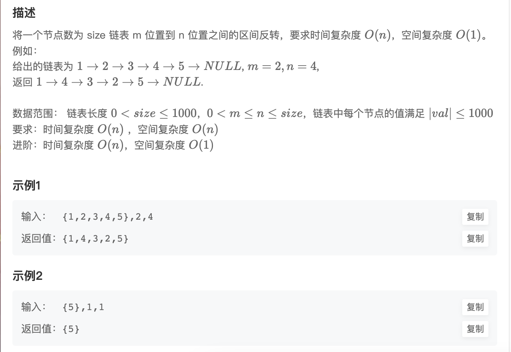  

```
# class ListNode:
#     def __init__(self, x):
#         self.val = x
#         self.next = None
#
# 代码中的类名、方法名、参数名已经指定，请勿修改，直接返回方法规定的值即可
#
# 
# @param head ListNode类 
# @param m int整型 
# @param n int整型 
# @return ListNode类
#
class Solution:
    def reverseBetween(self , head: ListNode, m: int, n: int) -> ListNode:
      #定义一个新的链表
      dummpy = ListNode(0)
      dummpy.next = head
      prev = dummpy

      for _ in range(1, m):
        prev = prev.next  # 这里步骤是保证我们可以设计前缀节点是开始节点得到上一个

      curr = prev.next  # 这样开始节点就是我们要的区间反转的第一个端值

      for _ in range(n - m):
        next_node = curr.next
        curr.next = next_node.next
        next_node.next = prev.next
        prev.next = next_node
      
      return dummpy.next   
```

>这个区间反转链表的话，先定义一个新的链表用于控制反转的，前缀用循环的方式进行移动，移动到我们开始反转链表的前一个值，需要进行反转链表的次数是区间值，反转链表没有特殊变换，区别在与区间prev.next对应反转整个连curr，区间反转链表next_node.next是反转整个链表的prev
>

## 第三题 链表中的节点每k个一组翻转

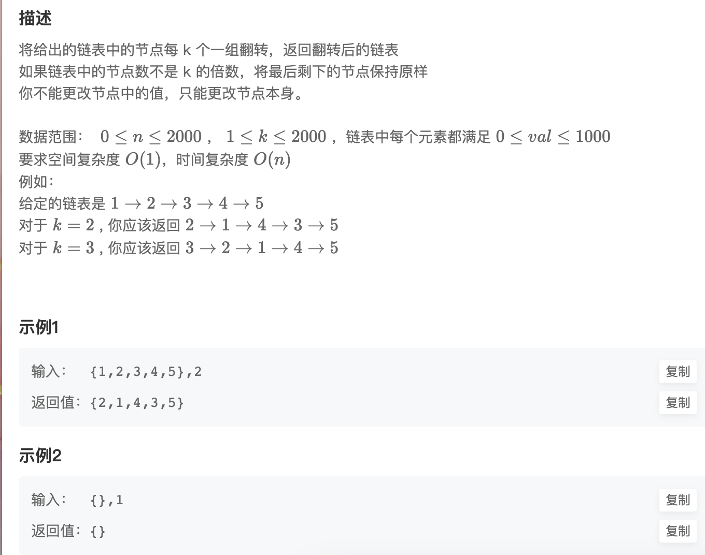  

```
# class ListNode:
#     def __init__(self, x):
#         self.val = x
#         self.next = None
#
# 代码中的类名、方法名、参数名已经指定，请勿修改，直接返回方法规定的值即可
#
# 
# @param head ListNode类 
# @param k int整型 
# @return ListNode类
#
class Solution:
    def reverseKGroup(self , head: ListNode, k: int) -> ListNode:
        temp = head

        for _ in range(k):
            if not temp:
                return head
            temp = temp.next
        
        prev = None
        curr = head

        for _ in range(k):
            next_node = curr.next
            curr.next = prev
            prev = curr
            curr = next_node
        
        head.next = self.reverseKGroup(curr, k)

        return prev
```

>这个的话和整个反转链表差不多，主要是利用递归的方式，先临时定义一个控制区间在k即可递归是下一个head是当前end的下一个
>

## 第四题 合并两个排序的链表 

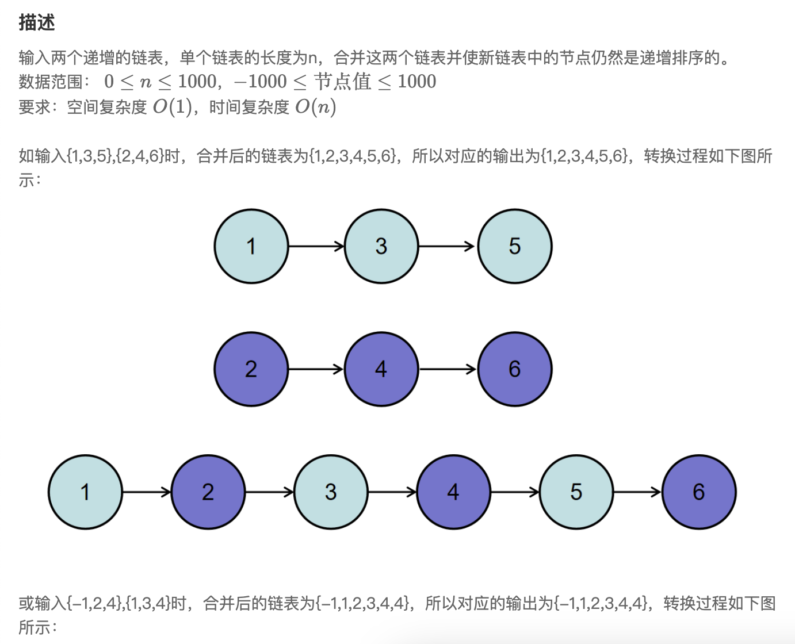  


```
# class ListNode:
#     def __init__(self, x):
#         self.val = x
#         self.next = None
#
# 代码中的类名、方法名、参数名已经指定，请勿修改，直接返回方法规定的值即可
#
# 
# @param pHead1 ListNode类 
# @param pHead2 ListNode类 
# @return ListNode类
#
class Solution:
    def Merge(self , pHead1: ListNode, pHead2: ListNode) -> ListNode:
        # write code here
        if not pHead1:
            return pHead2
        
        if not pHead2:
            return pHead1

        if pHead1.val <= pHead2.val:
            pHead1.next = self.Merge(pHead1.next, pHead2)
            return pHead1
        else:
            pHead2.next = self.Merge(pHead1, pHead2.next)
            return pHead2
```

>这个好像leetcode写过,先判断是否存在空链表，如果存在直接返回另外一个链表的节点，然后是判断链表的下一个节点应该跟那个那个节点进行对比并返回
>

## 第五题 合并k个已排序的链表

>这个明显难度比之前高，我选择2个方案解决一个是最小堆(优先队列)的方法，另一个是分治合并方法
>

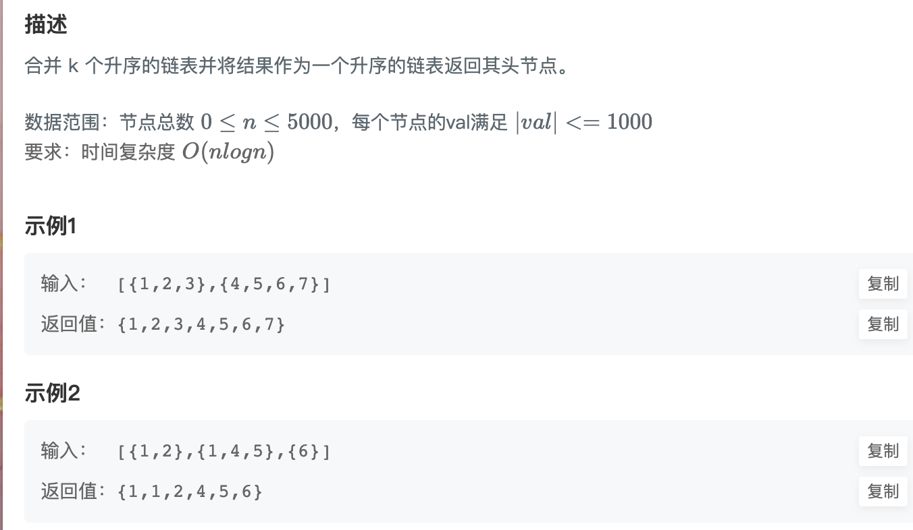  

```
# 最小堆方案

import heapq


class Solution:
    def mergeKLists(self , lists: List[ListNode]) -> ListNode:
        # write code here
        dummy = ListNode(0)
        curr = dummy
        heap = []

        counter = 0
        for node in lists:
            if node:
                heapq.heappush(heap, (node.val, counter, node))
                counter += 1
        
        while heap:
            val, cnt, node = heapq.heappop(heap)
            curr.next = node
            curr = curr.next
            if node.next:
                heapq.heappush(heap, (node.next.val, counter, node.next))
                counter += 1
        
        return dummy.next
```

>最小堆方案就是定义一个新的链表，从第一个链表开始不断弹出链表的最小节点加入堆直到堆为空用计数器比较节点
>

```
# 分治合并法

# class ListNode:
#     def __init__(self, x):
#         self.val = x
#         self.next = None
#
# 代码中的类名、方法名、参数名已经指定，请勿修改，直接返回方法规定的值即可
#
# 
# @param lists ListNode类一维数组 
# @return ListNode类
#

class Solution:
    def mergeKLists(self , lists: List[ListNode]) -> ListNode:
        temp_lists = [l for l in lists if l]
        if not temp_lists:
            return None

        if len(temp_lists) == 1:
            return temp_lists[0]

        lists = temp_lists

        while len(lists) > 1:
            new_lists = []
            for i in range(0, len(lists), 2):
                if i + 1 < len(lists):
                    merged = self.mergeTwo(lists[i], lists[i+1])
                    new_lists.append(merged)
                else:
                    new_lists.append(lists[i])
            
            lists = new_lists
        return lists[0] if lists else None

    def mergeTwo(self, lists1, lists2):
        if not lists1 and not lists2:
            return None
        if not lists1:
            return lists2
        if not lists2:
            return lists1
        
        dummy = curr = ListNode(0)
        while lists1 and lists2:
            if lists1.val < lists2.val:
                curr.next = lists1
                lists1 = lists1.next
            else:
                curr.next = lists2
                lists2 = lists2.next
            curr = curr.next

        curr.next = lists1 if lists1 else lists2
        return dummy.next 
```

>这个分治合并法原理不难但是写的时候对我很难，首先原理是先定义一个函数进行链表合并这个之前写过所以没有难度部分，主要是控制整个数组分成两组进行合并，剩单个直接加入链表，这里还有定义链表为空或者数组为空的时候，创建一个不断循环的新数组进行操作
>

## 第六题 判断链表中是否有环 

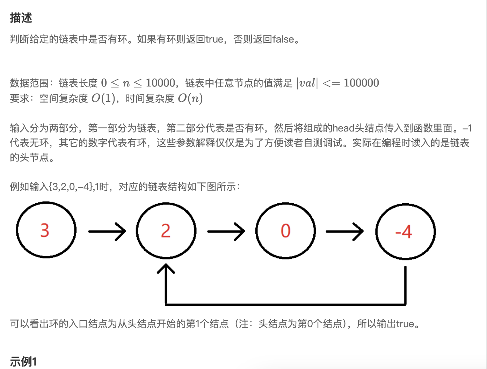  

```
from sys import float_repr_style
# class ListNode:
#     def __init__(self, x):
#         self.val = x
#         self.next = None

#
# 
# @param head ListNode类 
# @return bool布尔型
#
class Solution:
    def hasCycle(self , head: ListNode) -> bool:
        if not head or not head.next:
            return False
        
        slow = head
        fast = head

        while fast and fast.next:
            slow = slow.next
            fast = fast.next.next

            if slow == fast:
                return True
            
        return False
```

>这个考虑的是快慢指针节点是否相同相同为true其他为false，慢指针移动1格，快指针移动2格
>

## 第七题  链表中环的入口结点

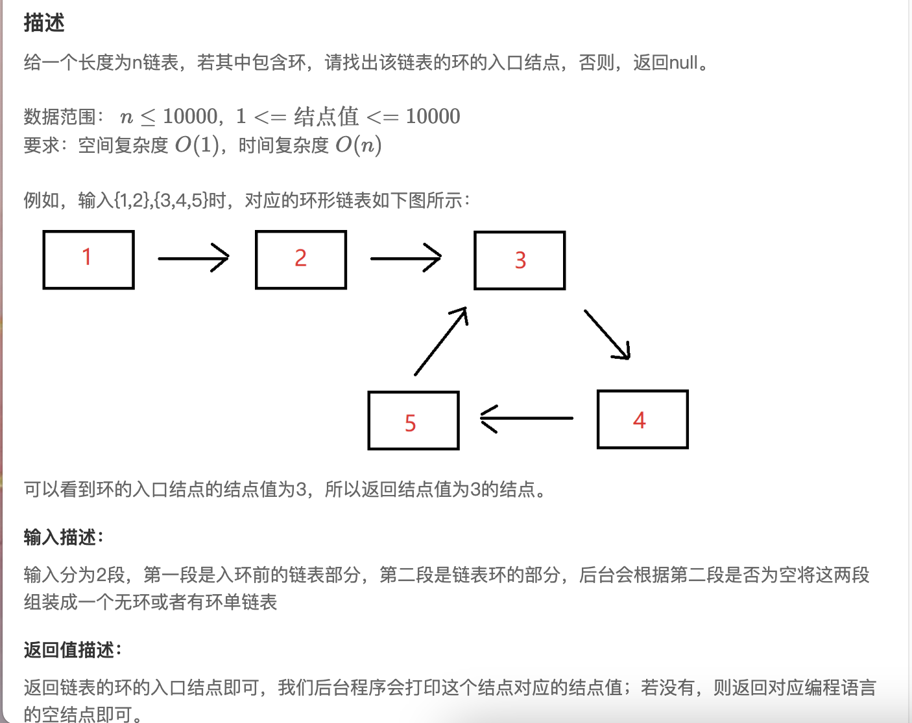  

```
# -*- coding:utf-8 -*-
# class ListNode:
#     def __init__(self, x):
#         self.val = x
#         self.next = None
class Solution:
    def EntryNodeOfLoop(self, pHead):
        # write code here
        if not pHead or not pHead.next:
            return None
        
        fast = slow = pHead

        while fast and fast.next:
            slow = slow.next
            fast = fast.next.next

            if slow == fast:
                break
        else:
            return None

        slow = pHead
        while slow != fast:
            slow = slow.next
            fast = fast.next
        
        return slow
```

>主要是先判断是否为有环，有环情况入口就是快慢指针相遇的位置，所以当第一次相遇时break此时我们得到的节点是为尾节点，慢指针从头开始进行当再次相遇的时候就说入口，此时指针第二次都是移动一格
>

## 第八题 链表中倒数最后k个结点

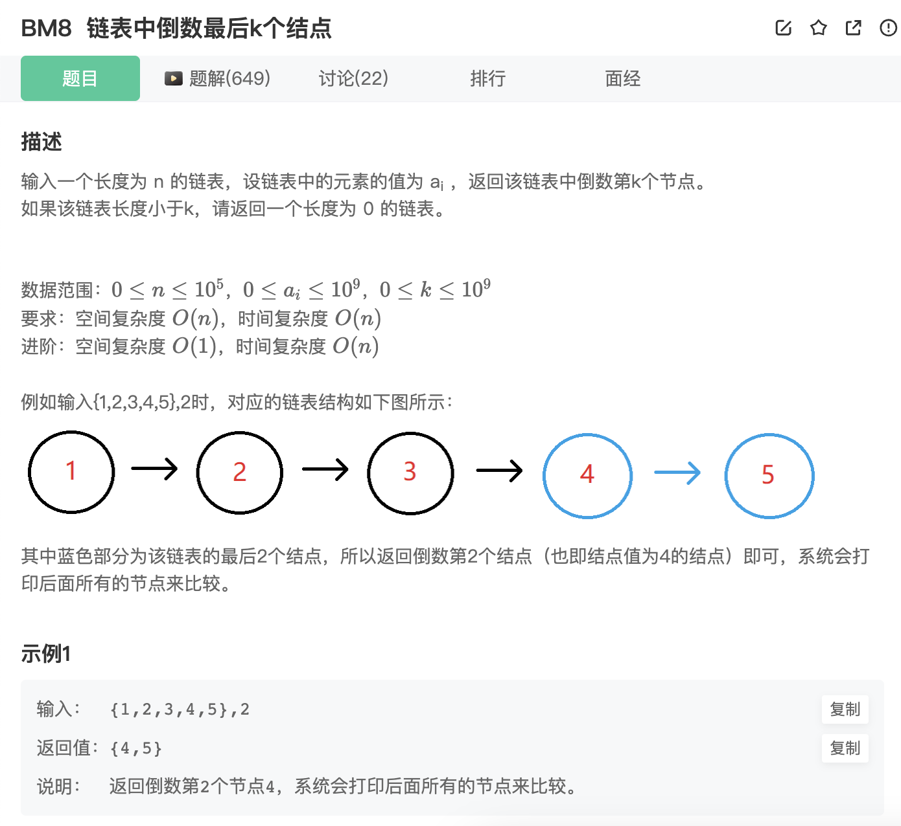  


```
# class ListNode:
#     def __init__(self, x):
#         self.val = x
#         self.next = None
#
# 代码中的类名、方法名、参数名已经指定，请勿修改，直接返回方法规定的值即可
#
# 
# @param pHead ListNode类 
# @param k int整型 
# @return ListNode类
#
class Solution:
    def FindKthToTail(self , pHead: ListNode, k: int) -> ListNode:
        # write code here
        if k <= 0 or not pHead:
            return None
        
        fast = slow = pHead

        for _ in range(k):
            if not fast:
                return None
            fast = fast.next
        
        while fast:
            fast = fast.next
            slow = slow.next

        return slow
```

>这个的话先看看k值和链表是否为空是直接none，还有快指针在移动k格的时候是否为空是也是none，最后当快指针为null时候代表指针已经移动完成，接着输出慢指针链表就是要的答案
>

## 第九题 删除链表的倒数第n个节点

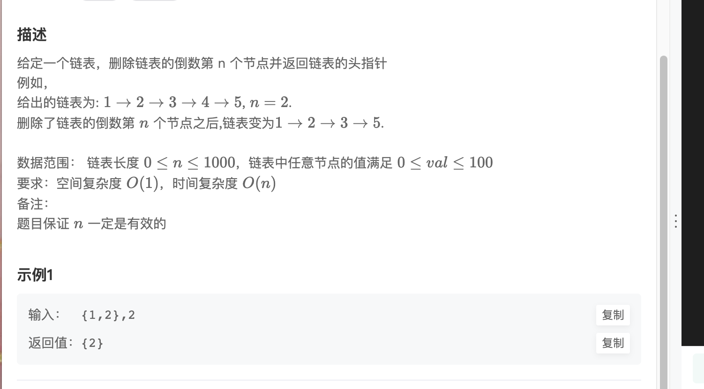  


```
# class ListNode:
#     def __init__(self, x):
#         self.val = x
#         self.next = None
#
# 代码中的类名、方法名、参数名已经指定，请勿修改，直接返回方法规定的值即可
#
# 
# @param head ListNode类 
# @param n int整型 
# @return ListNode类
#
class Solution:
    def removeNthFromEnd(self , head: ListNode, n: int) -> ListNode:
        # write code here

        dummy = ListNode(0)
        dummy.next = head

        fast = head
        slow = dummy

        for _ in range(n):
            fast = fast.next
        
        while fast:
            fast = fast.next
            slow = slow.next
        slow.next = slow.next.next

        return dummy.next
```

>这个的话就是先定义一个新链表用于输出，慢指针是新链表，然后和找倒是节点一样的方案利用快指针然后使用慢指针的下一个节点接到下下个就等于删除了那个节点
>

## 第十道 两个链表的第一个公共结点

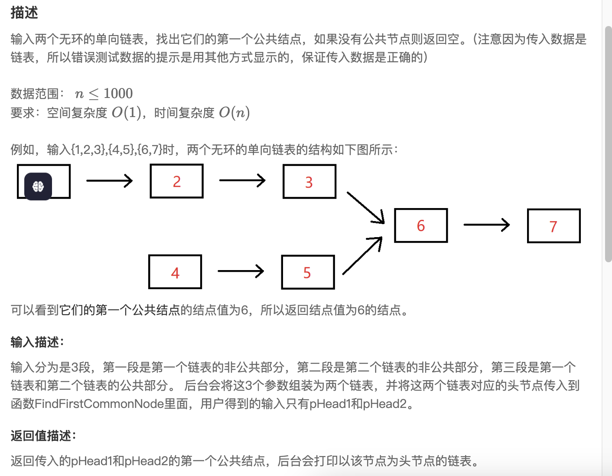  

```
import re
# class ListNode:
#     def __init__(self, x):
#         self.val = x
#         self.next = None

#
# 
# @param pHead1 ListNode类 
# @param pHead2 ListNode类 
# @return ListNode类
#
class Solution:
    def FindFirstCommonNode(self , pHead1 , pHead2 ):
        # write code here
        if not pHead1 or not pHead2:
            return None
        
        p1 = pHead1
        p2 = pHead2

        while p1 != p2:
            p1 = p1.next if p1 else pHead2
            p2 = p2.next if p2 else pHead1

        return p1
```

>这个的话就是设计这两个指针是否相同，在移动的时候判断指针是不是为空是则变成另外一个链表
>

## 第十一道 链表相加(二)

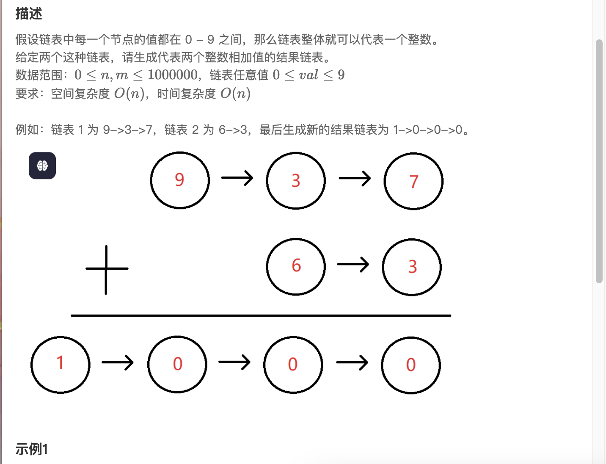  

```
# class ListNode:
#     def __init__(self, x):
#         self.val = x
#         self.next = None
#
# 代码中的类名、方法名、参数名已经指定，请勿修改，直接返回方法规定的值即可
#
# 
# @param head1 ListNode类 
# @param head2 ListNode类 
# @return ListNode类
#
class Solution:
    def addInList(self , head1: ListNode, head2: ListNode) -> ListNode:
        # write code here
        stack1 = []
        stack2 = []

        while head1:
            stack1.append(head1.val)
            head1 = head1.next
        
        while head2:
            stack2.append(head2.val)
            head2 = head2.next
        
        carry = 0
        result = None

        while stack1 or stack2 or carry:

            num1 = stack1.pop() if stack1 else 0
            num2 = stack2.pop() if stack2 else 0

            total = num1 + num2 + carry
            carry = total // 10
            digit = total % 10

            new_node = ListNode(digit)
            new_node.next = result
            result = new_node

        return result
```

>先创建2个栈用于存储当前位值，循环把链表值压入栈，设置结果和进位值，循环当所有值都位NULL，carry取进位值，digit取余值，将余值已链表形式存储在新链表上不断把链表节点赋予result，最后输出
>


## 第十二道 单链表的排序

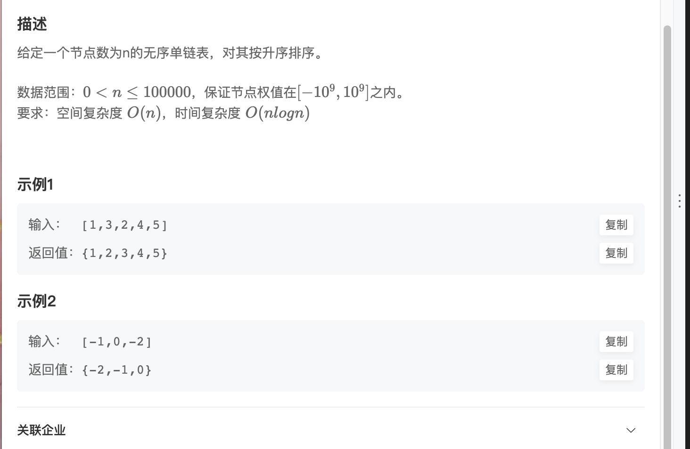  

```
# class ListNode:
#     def __init__(self, x):
#         self.val = x
#         self.next = None
#
# 代码中的类名、方法名、参数名已经指定，请勿修改，直接返回方法规定的值即可
#
# 
# @param head ListNode类 the head node
# @return ListNode类
#
class Solution:
    def sortInList(self , head: ListNode) -> ListNode:
        if not head or not head.next:
            return head
        
        # 计算链表长度
        length = 0
        cur = head
        while cur:
            length += 1
            cur = cur.next
        
        # 创建哑节点作为链表头前驱
        dummy_head = ListNode(0)
        dummy_head.next = head
        step = 1  # 初始步长
        
        # 自底向上归并排序
        while step < length:
            pre = dummy_head  # 已合并部分的尾节点
            cur = dummy_head.next  # 当前处理位置
            
            while cur:
                # 1. 分割第一段子链表
                head1 = cur
                head2 = self.split(head1, step)
                
                # 2. 分割第二段子链表
                next_head = None
                if head2:
                    next_head = self.split(head2, step)
                
                # 3. 合并两个子链表
                merged_head, merged_tail = self.merge(head1, head2)
                
                # 4. 连接已合并部分
                pre.next = merged_head
                pre = merged_tail  # 更新尾节点
                cur = next_head  # 处理剩余链表
            
            step *= 2  # 步长加倍
        
        return dummy_head.next
    
    def split(self, head, step):
        """分割链表：从head开始取step个节点，返回下段头节点"""
        if not head:
            return None
        
        # 遍历到step位置
        for _ in range(1, step):
            if head.next:
                head = head.next
            else:
                break
        
        # 保存下一段头节点并断开链表
        next_head = head.next
        head.next = None
        return next_head
    
    def merge(self, l1, l2):
        """合并两个有序链表，返回头节点和尾节点"""
        dummy_merge = ListNode(0)  # 合并用哑节点
        tail = dummy_merge
        
        # 遍历两链表，按顺序合并
        while l1 and l2:
            if l1.val <= l2.val:
                tail.next = l1
                l1 = l1.next
            else:
                tail.next = l2
                l2 = l2.next
            tail = tail.next
        
        # 连接剩余部分
        tail.next = l1 if l1 else l2
        
        # 找到实际尾节点
        while tail.next:
            tail = tail.next
        
        return dummy_merge.next, tail
```

>这个我觉得很难因为它使用归并排序多了好多步骤，思想的话设计一个链表结合函数按照顺序排列，不过要注意链表的head和tail头节点和尾节点，还有一个断开头节点的函数用于划分节点的，最后就是自上而下合并
>

## 第十三道 判断一个链表是否为回文结构

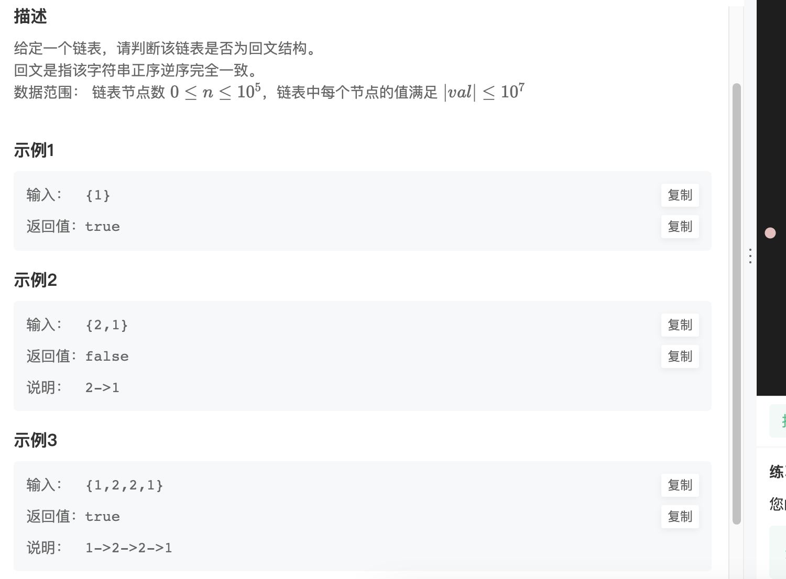  


```
# class ListNode:
#     def __init__(self, x):
#         self.val = x
#         self.next = None
#
# 代码中的类名、方法名、参数名已经指定，请勿修改，直接返回方法规定的值即可
#
# 
# @param head ListNode类 the head
# @return bool布尔型
#
class Solution:
    def isPail(self , head: ListNode) -> bool:
        # write code here
        if not head or not head.next:
            return True
        
        slow = fast = head

        while fast and fast.next:
            slow = slow.next
            fast = fast.next.next
        
        prev, curr = None, slow

        while curr:
            next_node = curr.next
            curr.next = prev
            prev = curr
            curr = next_node
        reverse_head = prev

        front, back = head, reverse_head
        result = True

        while back:
            if back.val != front.val:
                result = False
                break
            front = front.next
            back = back.next
        
        prev, curr = None, reverse_head
        while curr:
            next_node = curr.next
            curr.next = prev
            prev = head
            curr = next_node
        slow.next = prev

        return result
```

>这道题是先判断是否为空如果为空或者1都是回文直接true，下面定义快慢指针反转链表根据反转链表和原链表进行判断正序和逆序读结果相同为回文，当快指针到达末尾时，慢指针位于中点（奇数为中间，偶数为中间偏右），最后把链表反转回来即可
>

```
# class ListNode:
#     def __init__(self, x):
#         self.val = x
#         self.next = None
#
# 代码中的类名、方法名、参数名已经指定，请勿修改，直接返回方法规定的值即可
#
# 
# @param head ListNode类 the head
# @return bool布尔型
#
class Solution:
    def isPail(self , head: ListNode) -> bool:
        stack = []

        slow = fast = head
        while fast and fast.next:
            stack.append(slow.val)
            fast = fast.next.next
            slow = slow.next
        
        if fast:
            slow = slow.next

        while slow:
            if stack.pop() != slow.val:
                return False
            slow  = slow.next
        
        return True
```

>不反转的方案更简单，先定义一个栈，进行快慢指针移动当快指针走完，慢指针刚好到中间位置，然后慢指针移动值存入栈，处理奇数的情况，然后判断栈是否等于慢指针移动的值相同的话直接移动不然终止返回false
>

## 第十四道 链表的奇偶重排

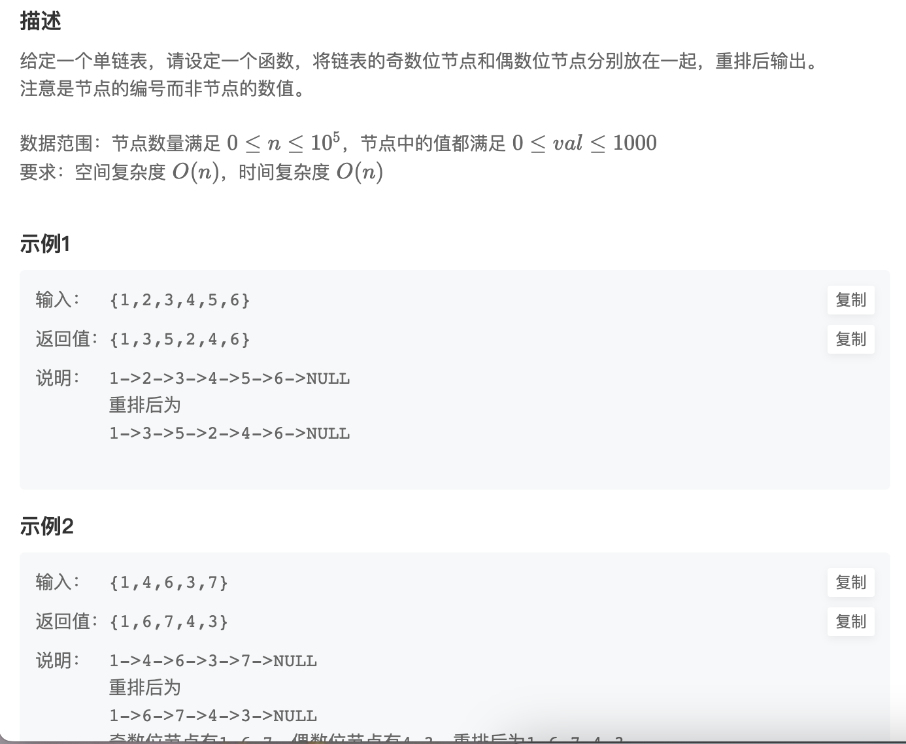  

```
import re
# class ListNode:
#     def __init__(self, x):
#         self.val = x
#         self.next = None
#
# 代码中的类名、方法名、参数名已经指定，请勿修改，直接返回方法规定的值即可
#
# 
# @param head ListNode类 
# @return ListNode类
#
class Solution:
    def oddEvenList(self , head: ListNode) -> ListNode:
        # write code here
        if not head or not head.next:
            return head
        
        odd = head
        even = head.next
        evenhead = even

        while even and even.next:
            odd.next = even.next
            odd = odd.next

            even.next = odd.next
            even = even.next
        
        odd.next = evenhead

        return head
```

>从排的话就是3号位移动到2号位，5号位移动移动到4号位原被移动位踢掉然后把它加到从新拍好的奇链表
>

## 第十五道 删除有序链表中重复的元素-I

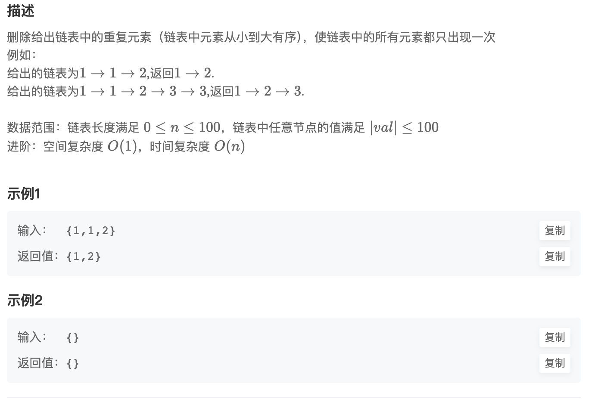  

```
# class ListNode:
#     def __init__(self, x):
#         self.val = x
#         self.next = None
#
# 代码中的类名、方法名、参数名已经指定，请勿修改，直接返回方法规定的值即可
#
# 
# @param head ListNode类 
# @return ListNode类
#
class Solution:
    def deleteDuplicates(self , head: ListNode) -> ListNode:
        # write code here
        curr = head
        while curr and curr.next:
            if curr.val == curr.next.val:
                curr.next = curr.next.next
            else:
                curr = curr.next
        
        return head
```

>这个很简单循环链表如果下一个等于当前直接跳过不断操作即可
>

## 第十六道 删除有序链表中重复的元素-II 

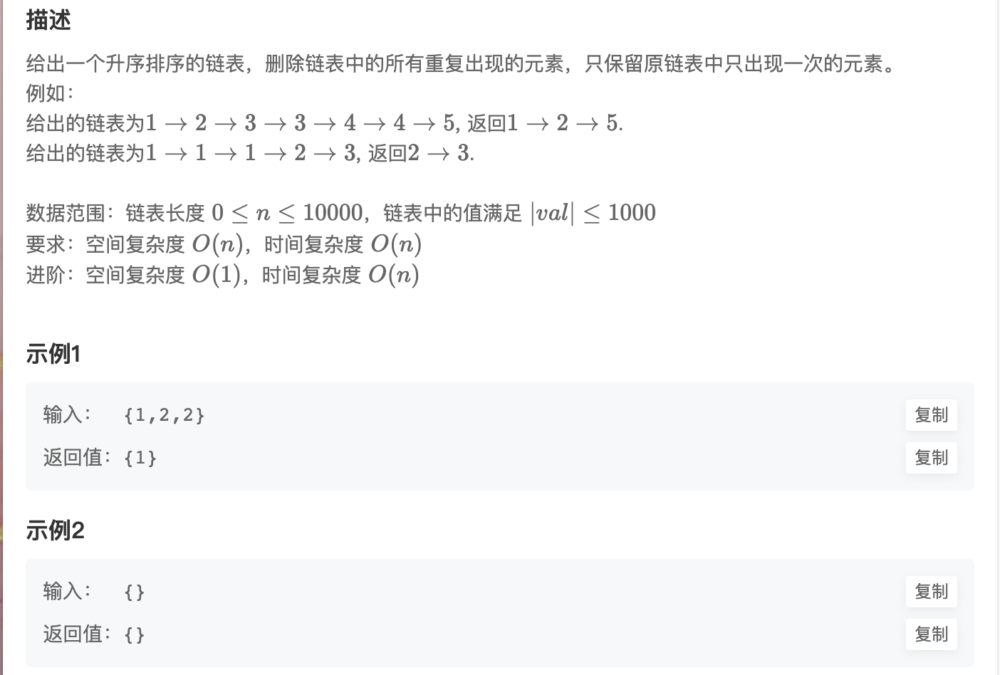 

```
# class ListNode:
#     def __init__(self, x):
#         self.val = x
#         self.next = None
#
# 代码中的类名、方法名、参数名已经指定，请勿修改，直接返回方法规定的值即可
#
# 
# @param head ListNode类 
# @return ListNode类
#
class Solution:
    def deleteDuplicates(self , head: ListNode) -> ListNode:
        # write code here
        dummy = ListNode(0)
        dummy.next = head

        prev = dummy
        curr = head

        while curr and curr.next:

            if curr.val == curr.next.val:
                while curr.next and curr.val == curr.next.val:
                    curr = curr.next
                
                prev.next = curr.next
            else:
                prev = curr

            curr = curr.next

        return dummy.next
```

>这个也挺简单 定义新链表，不断看当前值是否等于下个值是一直跳，并且最后前缀移动道没有重复的节点开始
>

