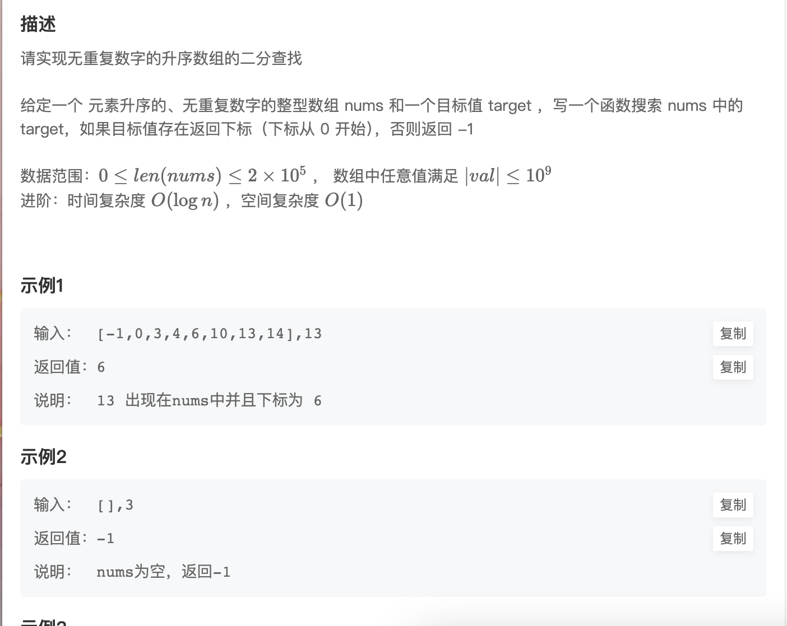
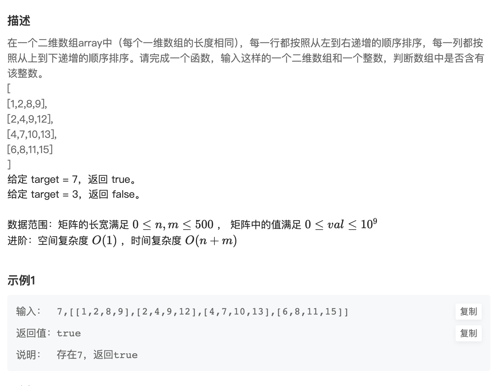
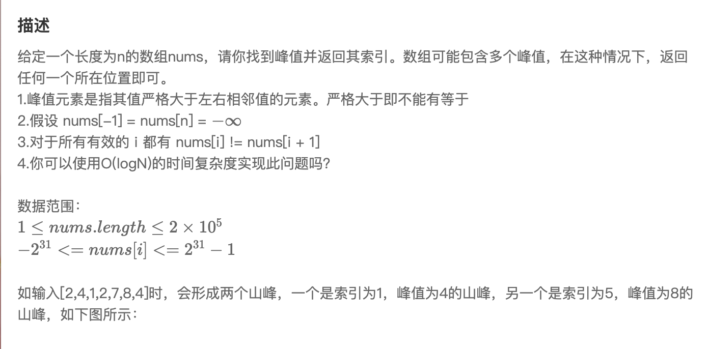
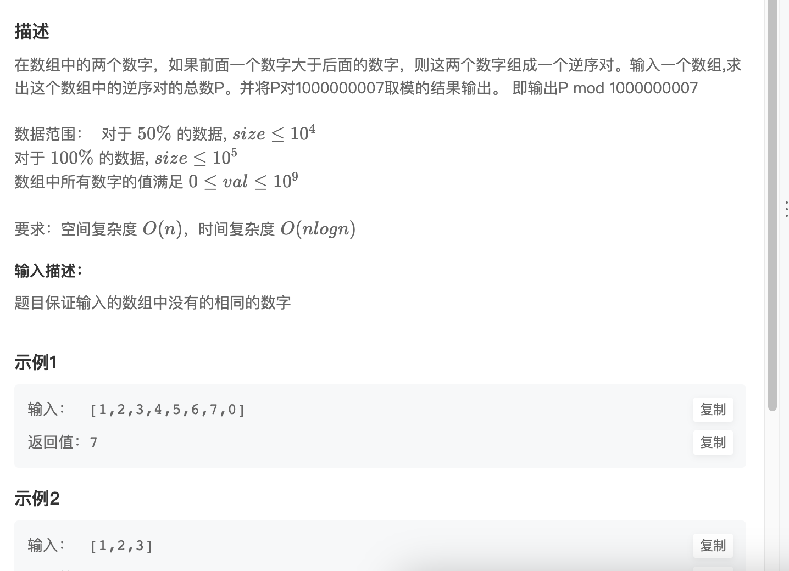
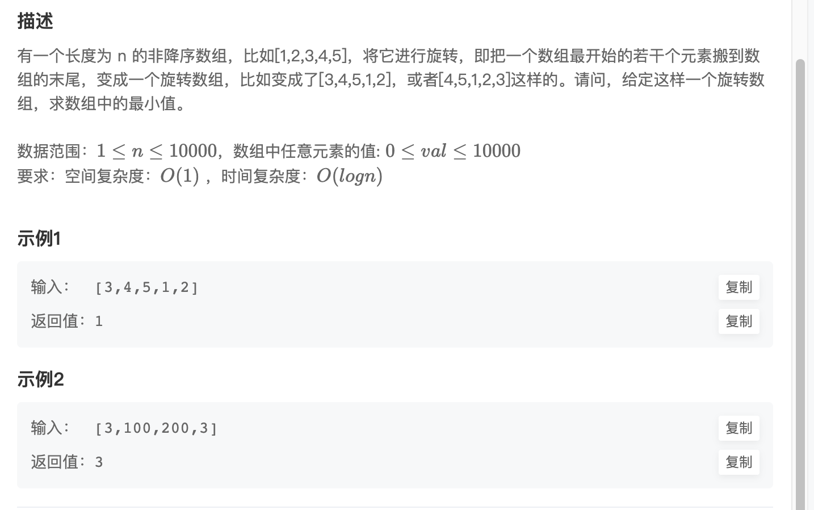
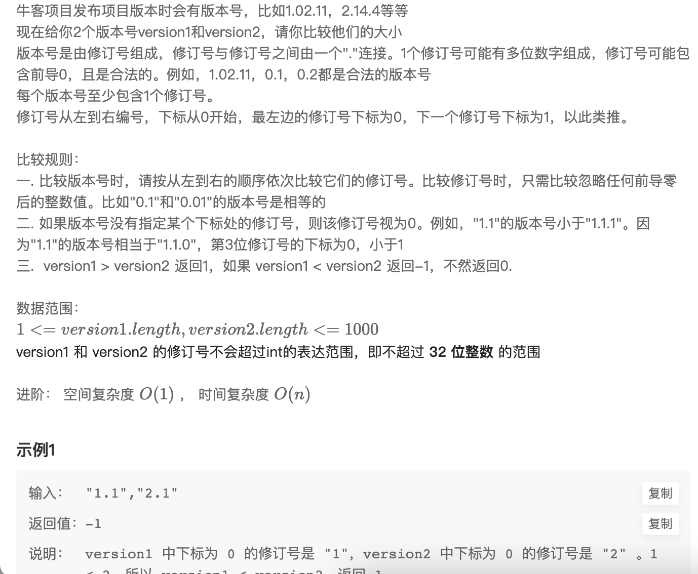

## 第一题 

  

```
#
# 代码中的类名、方法名、参数名已经指定，请勿修改，直接返回方法规定的值即可
#
# 
# @param nums int整型一维数组 
# @param target int整型 
# @return int整型
#
class Solution:
    def search(self , nums: List[int], target: int) -> int:
        # write code here
        left, right = 0, len(nums) - 1
        while left <= right:
            mid = (right + left) // 2
            if nums[mid] == target:
                return mid
            elif nums[mid] < target:
                left = mid + 1
            else:
                right = mid - 1
        return -1
```

>这个二分就是按照中位数的形式去弄即可
>

## 第二题 二维数组中的查找

  

```
#
# 代码中的类名、方法名、参数名已经指定，请勿修改，直接返回方法规定的值即可
#
# 
# @param target int整型 
# @param array int整型二维数组 
# @return bool布尔型
#
class Solution:
    def Find(self , target: int, array: List[List[int]]) -> bool:
        # write code here
        for i in range(len(array)):
            result = self.search(array[i], target)
            if result:
                return True
        
        return False


    def search(self, nums, target):

        left, right = 0, len(nums) - 1
        while left <= right:
            mid = (left + right) // 2
            if nums[mid] == target:
                return True
            if nums[mid] < target:
                left = mid + 1
            else:
                right = mid - 1
        return False
```

>直接多写个函数给二分即可就是时间复杂度有点大哈哈哈
>


## 第三题 寻找峰值

  

```
#
# 代码中的类名、方法名、参数名已经指定，请勿修改，直接返回方法规定的值即可
#
# 
# @param nums int整型一维数组 
# @return int整型
#
class Solution:
    def findPeakElement(self , nums: List[int]) -> int:
        # write code here
        left, right = 0, len(nums) - 1
        while left < right:
            mid = (left+right) // 2
            if nums[mid] < nums[mid + 1]:
                left = mid + 1
            else:
                right = mid
            
        return left
```

>这个的话就是将左节点为输出值，如果存在中位值小于下一个值向移动右否则不动输出
>

## 第四题 数组中的逆序对

  

```
#
# 代码中的类名、方法名、参数名已经指定，请勿修改，直接返回方法规定的值即可
#
# 
# @param nums int整型一维数组 
# @return int整型
#
import bisect

class Solution:
    def InversePairs(self , nums: List[int]) -> int:
        count = 0
        a = [nums[0]]
 
        for i in range(1, len(nums)):
            if nums[i] < a[-1]:
                p = bisect.bisect(a, nums[i])
                count += len(a) - p
                bisect.insort(a, nums[i])
            else:
                a.append(nums[i])
        return count % 1000000007  
```

>这里这个有点难，没写出来，这是别人答案
>

## 第五题 旋转数组的最小数字

  

```
#
# 代码中的类名、方法名、参数名已经指定，请勿修改，直接返回方法规定的值即可
#
# 
# @param nums int整型一维数组 
# @return int整型
#
class Solution:
    def minNumberInRotateArray(self , nums: List[int]) -> int:
        # write code here
        if not nums:
            return 0
        
        left, right = 0, len(nums) - 1

        while left < right:
            mid = (left + right) // 2
            if nums[mid] > nums[right]:
                left = mid + 1
            elif nums[mid] < nums[right]:
                right = mid
            else:
                right -= 1
        
        return nums[left]
```

>这个的话就直接选做为最小进行缩小右边指针。
>

## 第六题 比较版本号

  

```
        i, j, n, m = 0, 0, len(version1), len(version2)

        while i < n or j < m:
            nums1 = 0    
            while i < n and version1[i] != '.':
                nums1 = nums1 * 10 + int(version1[i])
                i += 1
            
            nums2 = 0 
            while j < m and version2[j] != '.':
                nums2 = nums2 * 10 + int(version2[j])
                j += 1
            
            if nums1 > nums2:
                return 1
            if nums1 < nums2:
                return -1
            
            
            i += 1
            j += 1

        return 0
```

>需要去掉前导0只保留整数值进行比较
>