## 第一题 二叉树的前序遍历

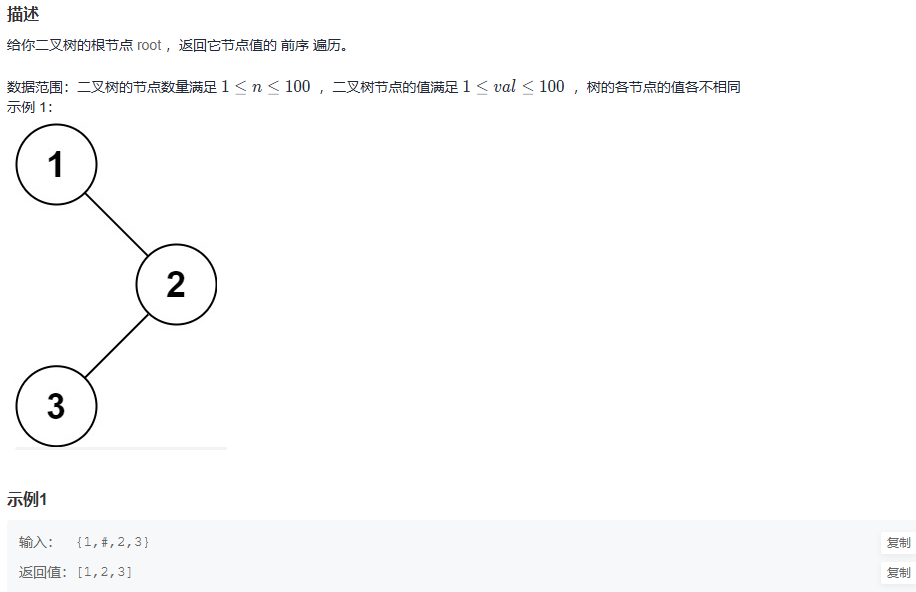  

```
# class TreeNode:
#     def __init__(self, x):
#         self.val = x
#         self.left = None
#         self.right = None
#
# 代码中的类名、方法名、参数名已经指定，请勿修改，直接返回方法规定的值即可
#
# 
# @param root TreeNode类 
# @return int整型一维数组
#
class Solution:
    def preorderTraversal(self , root: TreeNode) -> List[int]:
        # write code here
        def dfs(node, result):
            if not node: return
            result.append(node.val)
            dfs(node.left, result)
            dfs(node.right, result)
    
        res = []
        dfs(root, res)
        return res
```

>写一个遍历函数用于循环遍历左右子树
>

## 第二题 二叉树的中序遍历

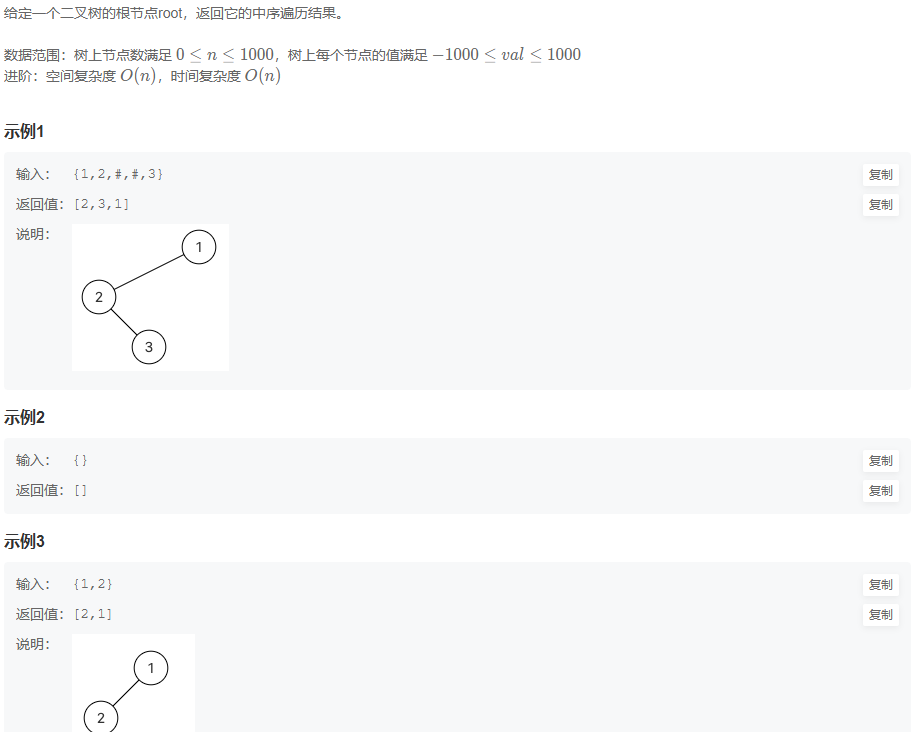  

```
# class TreeNode:
#     def __init__(self, x):
#         self.val = x
#         self.left = None
#         self.right = None
#
# 代码中的类名、方法名、参数名已经指定，请勿修改，直接返回方法规定的值即可
#
# 
# @param root TreeNode类 
# @return int整型一维数组
#
class Solution:
    def inorderTraversal(self , root: TreeNode) -> List[int]:
        # write code here
        def dfs(node, result):
            if not node: return
            dfs(node.left, result)
            result.append(node.val)
            dfs(node.right, result)
        
        res = []
        dfs(root, res)

        return res
```

>根前序差不多就是换一下位置
>

## 第三题 二叉树的后序遍历

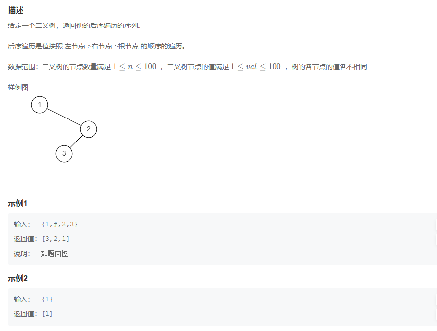  

```
# class TreeNode:
#     def __init__(self, x):
#         self.val = x
#         self.left = None
#         self.right = None
#
# 代码中的类名、方法名、参数名已经指定，请勿修改，直接返回方法规定的值即可
#
# 
# @param root TreeNode类 
# @return int整型一维数组
#
class Solution:
    def postorderTraversal(self , root: TreeNode) -> List[int]:
        # write code here
        def dfs(node, result):
            if not node: return
            dfs(node.left, result)
            dfs(node.right, result)
            result.append(node.val)

        res = []

        dfs(root,res)
        return res
```

>没啥好说一招吃遍天
>

## 第四题 求二叉树的层序遍历

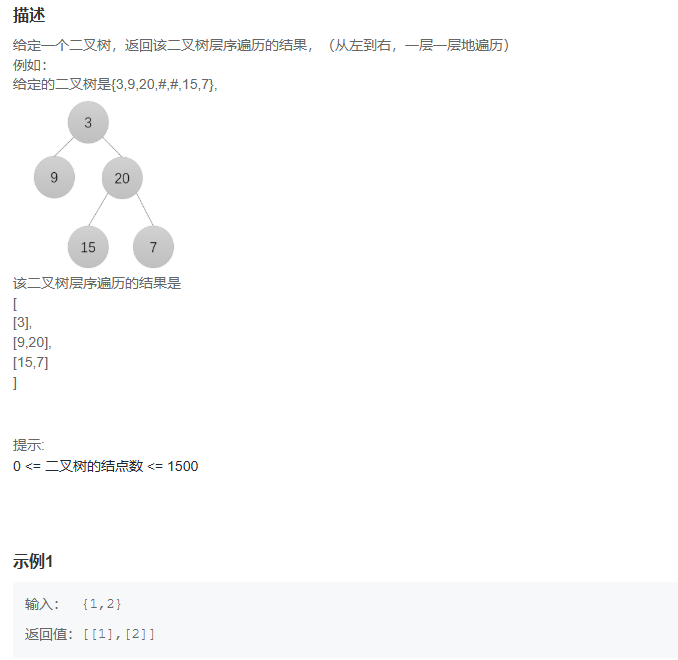  

```
import queue
# class TreeNode:
#     def __init__(self, x):
#         self.val = x
#         self.left = None
#         self.right = None
#
# 代码中的类名、方法名、参数名已经指定，请勿修改，直接返回方法规定的值即可
#
# 
# @param root TreeNode类 
# @return int整型二维数组
#

from collections import deque

class Solution:
    def levelOrder(self , root: TreeNode) -> List[List[int]]:
        # write code here
        if not root: return []
        queue = deque([root])
        result = []

        while queue:
            lever_size = len(queue)
            lever_vals = []

            for _ in range(lever_size):
                node = queue.popleft()
                lever_vals.append(node.val)
                if node.left: queue.append(node.left)
                if node.right: queue.append(node.right)
            
            result.append(lever_vals)
        
        return result
```


>这的话主要需要处理数的高，有了树高就好解决了，这里用了个包来处理数高
>

## 第五题 按之字形顺序打印二叉树

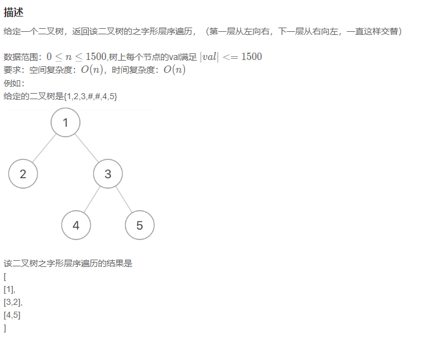  

```
# class TreeNode:
#     def __init__(self, x):
#         self.val = x
#         self.left = None
#         self.right = None
#
# 代码中的类名、方法名、参数名已经指定，请勿修改，直接返回方法规定的值即可
#
# 
# @param pRoot TreeNode类 
# @return int整型二维数组
#
class Solution:
    def Print(self , pRoot: TreeNode) -> List[List[int]]:
        # write code here
        s, res = [], []
        if not pRoot:
            return res
        
        s.append(pRoot)
        num = 1
        while s:
            n = len(s)
            temp = []
            for  i in range(n):
                node = s.pop(0)
                temp.append(node.val)

                if node.left:
                    s.append(node.left)
                if node.right:
                    s.append(node.right)
                
            if num%2 != 0:
                res.append(temp)
            else:
                res.append(temp[::-1])
            num += 1
            
        return res
```

>这个的话首先定义一个输出队列，一个栈，先判断是否为空，然后把数加入到栈中，定义一个数字判断是否为奇数如果是从左到右加入，否则从右到左加入，循环临时的temp作为树打印，先进行队列，加入节点值，如果左右节点存在节点入栈
>

## 二叉树的最大深度

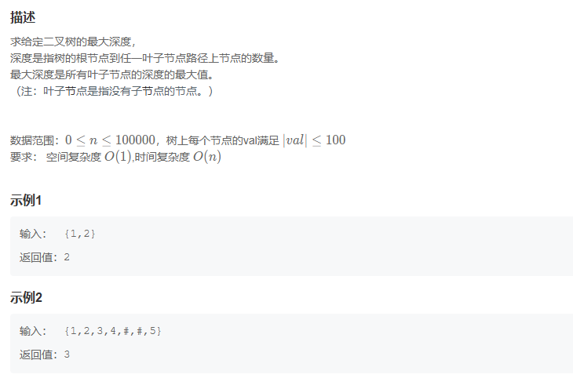  

```
# class TreeNode:
#     def __init__(self, x):
#         self.val = x
#         self.left = None
#         self.right = None
#
# 代码中的类名、方法名、参数名已经指定，请勿修改，直接返回方法规定的值即可
#
# 
# @param root TreeNode类 
# @return int整型
#
class Solution:
    def maxDepth(self , root: TreeNode) -> int:
        if not root:
            return 0
        ld = self.maxDepth(root.left)
        rd = self.maxDepth(root.right)

        return max(ld+1,rd+1)
```

>这个最大深度就是直接自动查找匹配然后找最大即可
>

## 二叉树中和为某一值的路径(一)

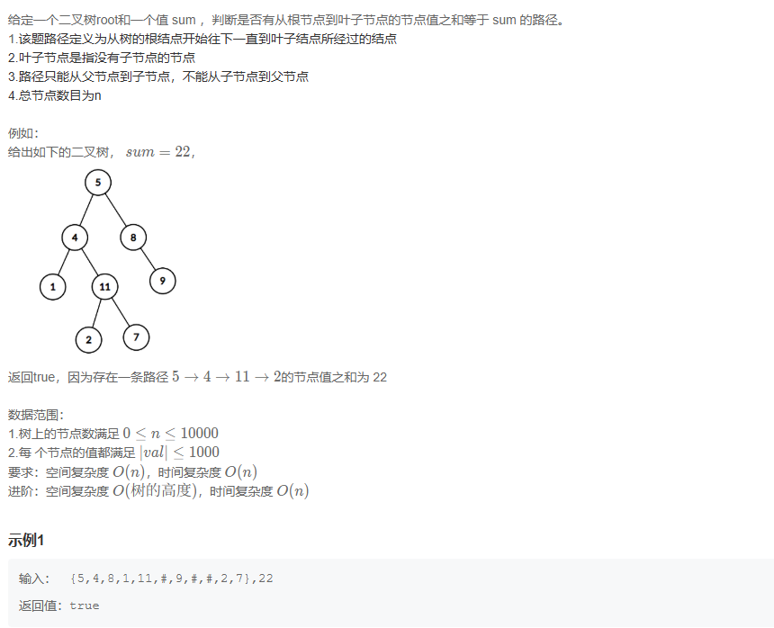  

```
import re
# class TreeNode:


#     def __init__(self, x):
#         self.val = x
#         self.left = None
#         self.right = None
#
# 代码中的类名、方法名、参数名已经指定，请勿修改，直接返回方法规定的值即可
#
# 
# @param root TreeNode类 
# @param sum int整型 
# @return bool布尔型
#
class Solution:
    def hasPathSum(self , root: TreeNode, sum: int) -> bool:
        # write code here
        if not root: return False

        sum -= root.val

        if sum == 0 and not root.left and not root.right: return True

        ld = self.hasPathSum(root.left, sum)
        rd = self.hasPathSum(root.right, sum)

        return ld or rd
```

>这个和最大树差不多就是查左路径或者右路径是否满足不满足就false了
>

## 二叉搜索树与双向链表

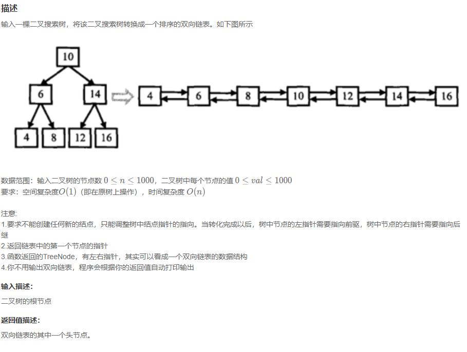  

```
#     def __init__(self, x):
#         self.val = x
#         self.left = None
#         self.right = None

#
# 
# @param pRootOfTree TreeNode类 
# @return TreeNode类
#
class Solution:
    def Convert(self , pRootOfTree ):
        # write code here
        def func(root):
            if not root: return None, None
            left1, left2 = func(root.left)
            right1, right2 = func(root.right)

            root.left = left2
            root.right = right1

            return_left, return_right = root, root

            if root.left:
                left2.right = root
                return_left = left1
            
            if root.right:
                right1.left = root
                return_right = right2
            
            return return_left, return_right

        l,r = func(pRootOfTree)

        return l
```

>这个的话还是有点难度和绕的，先定义一个双向链表连接函数，return 返回2个值，定义链表左右的头和尾，初始化左的为尾，右为头，判断是否存在左右值，存在尾连接节点，返回值为头右相反这样函数调用实现双向链表
>

## 对称的二叉树

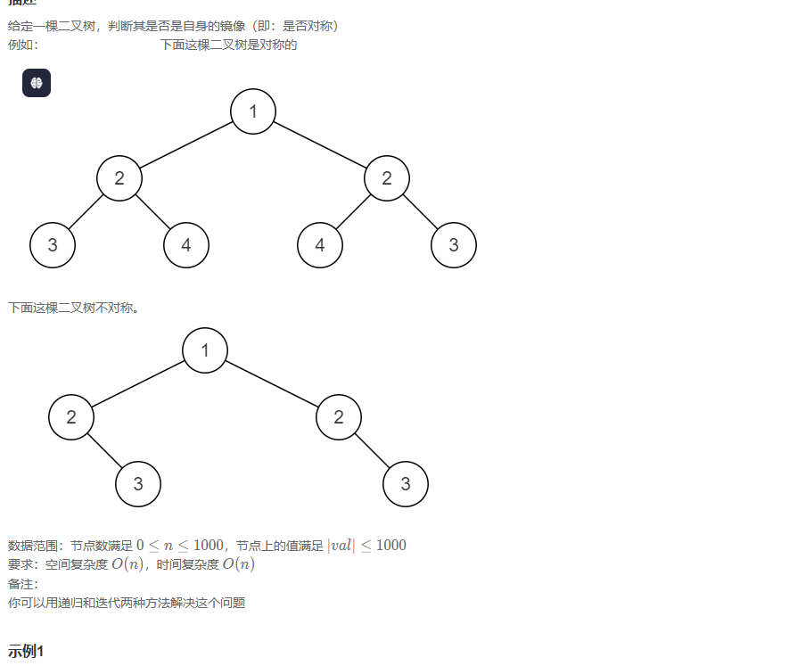  

```
from re import L
# class TreeNode:
#     def __init__(self, x):
#         self.val = x
#         self.left = None
#         self.right = None
#
# 代码中的类名、方法名、参数名已经指定，请勿修改，直接返回方法规定的值即可
#
# 
# @param pRoot TreeNode类 
# @return bool布尔型
#
class Solution:
    def isSymmetrical(self , pRoot: TreeNode) -> bool:
        # write code here
        if not pRoot: return True

        def isMirror(left, right):
            if not left and not right:
                return True
            
            if not left or not right:
                return False
            
            if left.val != right.val:
                return False
            
            return isMirror(left.left, right.right) and isMirror(left.right, right.left)
        return isMirror(pRoot.left, pRoot.right)
```

>还是要定义函数去判断只需要保证left == right 其他false即可，不过要用递归操作。
>

##  合并二叉树

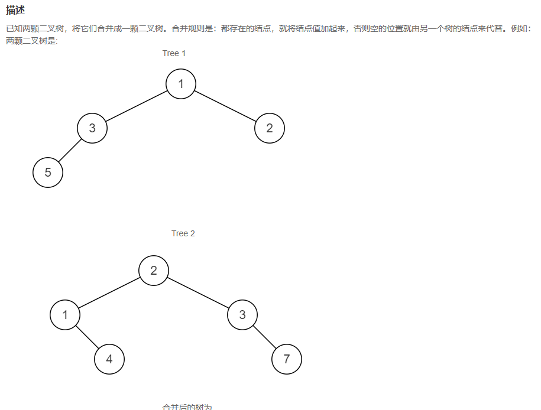  

```
# class TreeNode:
#     def __init__(self, x):
#         self.val = x
#         self.left = None
#         self.right = None
#
# 代码中的类名、方法名、参数名已经指定，请勿修改，直接返回方法规定的值即可
#
# 
# @param t1 TreeNode类 
# @param t2 TreeNode类 
# @return TreeNode类
#
class Solution:
    def mergeTrees(self , t1: TreeNode, t2: TreeNode) -> TreeNode:
        # write code here
        if not t1:
            return t2
        if not t2:
            return t1
        
        head = TreeNode(t1.val + t2.val)

        head.left, head.right = self.mergeTrees(t1.left, t2.left), self.mergeTrees(t1.right, t2.right)

        return head
```

>先判断是否2个数都在，头为值相加，返回头
>

## 二叉树的镜像

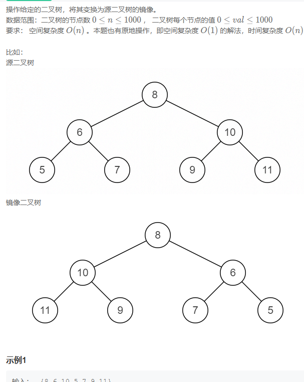  

```
# class TreeNode:
#     def __init__(self, x):
#         self.val = x
#         self.left = None
#         self.right = None
#
# 代码中的类名、方法名、参数名已经指定，请勿修改，直接返回方法规定的值即可
#
# 
# @param pRoot TreeNode类 
# @return TreeNode类
#
class Solution:
    def Mirror(self , pRoot: TreeNode) -> TreeNode:
        # write code here
        if not pRoot: return None
        temp = pRoot.right
        pRoot.right = pRoot.left
        pRoot.left = temp

        pRoot.left = self.Mirror(pRoot.left)
        pRoot.right = self.Mirror(pRoot.right)

        return pRoot
```

>交换即可没有什么特殊的难度
>

## 判断是不是二叉搜索树

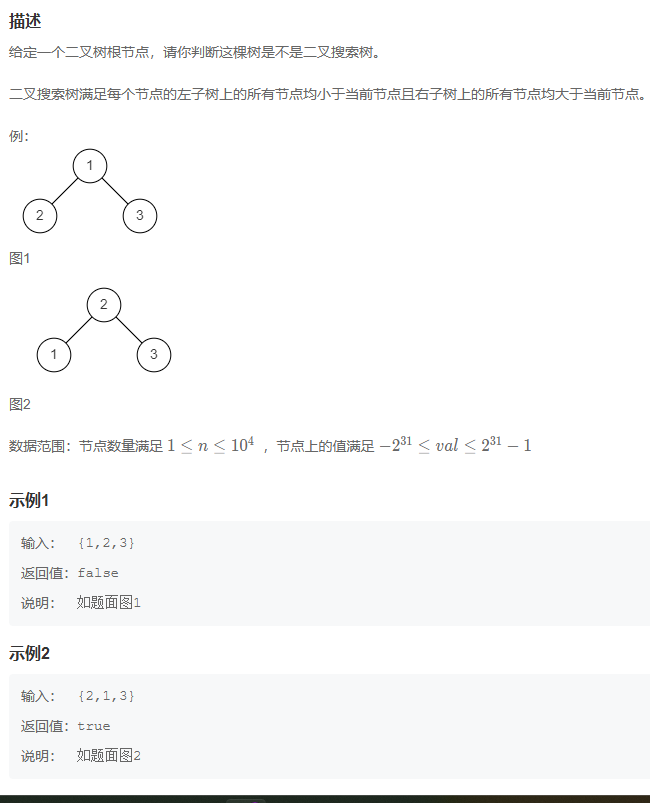  

```
# class TreeNode:
#     def __init__(self, x):
#         self.val = x
#         self.left = None
#         self.right = None
#
# 代码中的类名、方法名、参数名已经指定，请勿修改，直接返回方法规定的值即可
#
# 
# @param root TreeNode类 
# @return bool布尔型
#
class Solution:
    def isValidBST(self , root: TreeNode) -> bool:
        # write code here
        res = self.inOrder(root)

        if len(res) <= 1:
            return True
        
        for i in range(len(res) - 1):
            if res[i] >= res[i+1]:
                return False
        return True

    def inOrder(self, pRoot: TreeNode):
        if not pRoot:return []

        return self.inOrder(pRoot.left) + [pRoot.val] + self.inOrder(pRoot.right)
```

>定义函数把树值存入到数组，然后判断左边值如果大于右边值则false其他情况为true
>

## 判断是不是完全二叉树

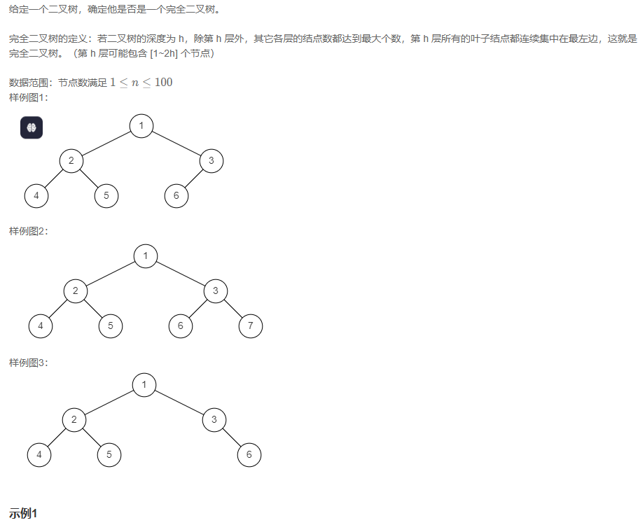  

```
# class TreeNode:
#     def __init__(self, x):
#         self.val = x
#         self.left = None
#         self.right = None
#
# 代码中的类名、方法名、参数名已经指定，请勿修改，直接返回方法规定的值即可
#
# 
# @param root TreeNode类 
# @return bool布尔型
#
class Solution:
    def isCompleteTree(self , root: TreeNode) -> bool:
        # write code here
        if not root: return True
        ret = [root]
        while ret:
            curr = ret.pop(0)
            if curr:
                ret.append(curr.left)
                ret.append(curr.right)
            else:
                break
        for i in ret:
            if i:
                return False
        return True
```

>用了队列的形式当然出现特殊字符则直接输出false，循环结束返回true
>

## 判断是不是平衡二叉树

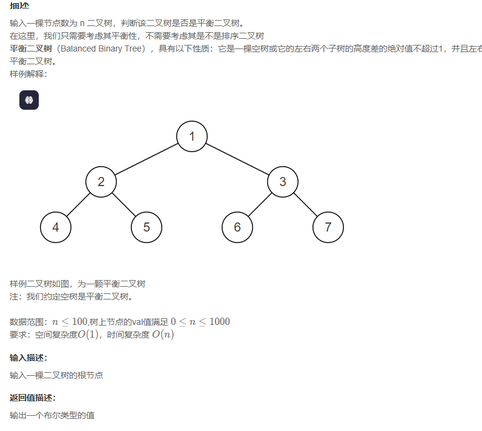  

```
# class TreeNode:
#     def __init__(self, x):
#         self.val = x
#         self.left = None
#         self.right = None
#
# 代码中的类名、方法名、参数名已经指定，请勿修改，直接返回方法规定的值即可
#
# 
# @param pRoot TreeNode类 
# @return bool布尔型
#
class Solution:
    def IsBalanced_Solution(self , pRoot: TreeNode) -> bool:
        # write code here
        if not pRoot: return True
        if abs(self.TreeDepth(pRoot.left) - self.TreeDepth(pRoot.right)) < 2:
            return self.IsBalanced_Solution(pRoot.left) and self.IsBalanced_Solution(pRoot.right)
        else:
            return False 
    
    def TreeDepth(self, rt):
        return 1 + max(self.TreeDepth(rt.left), self.TreeDepth(rt.right)) if rt else 0
```

>这个只需要判断树是否满足树是左右相减小于等于1
>

## 二叉搜索树的最近公共祖先

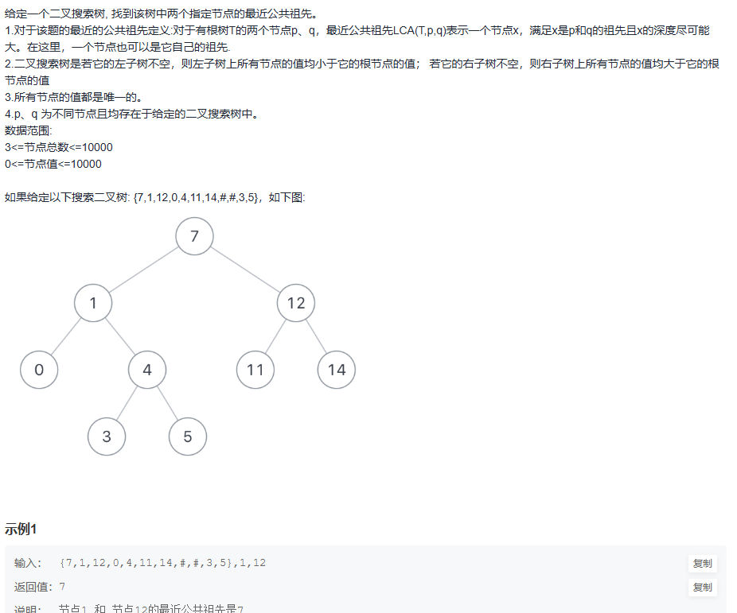  

```
# class TreeNode:
#     def __init__(self, x):
#         self.val = x
#         self.left = None
#         self.right = None
#
# 代码中的类名、方法名、参数名已经指定，请勿修改，直接返回方法规定的值即可
#
# 
# @param root TreeNode类 
# @param p int整型 
# @param q int整型 
# @return int整型
#
class Solution:
    def lowestCommonAncestor(self , root: TreeNode, p: int, q: int) -> int:
        # write code here
        if p < root.val and q < root.val:
            return self.lowestCommonAncestor(root.left, p, q)
        elif p > root.val and q > root.val:
            return self.lowestCommonAncestor(root.right, p, q)
        else:
            return root.val
```

>如果p和q小于当前节点说明节点在左节点上，p和q大于当前节点说明节点在右节点上，否则返回当前节点
>

## 在二叉树中找到两个节点的最近公共祖先

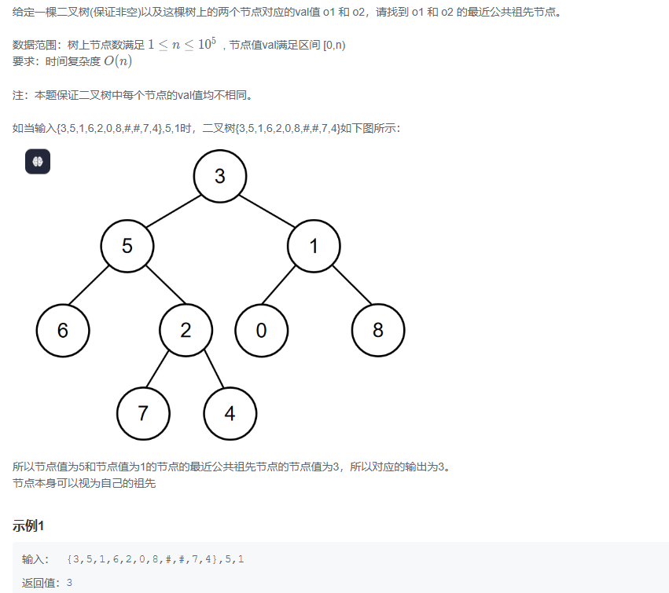  

```
# class TreeNode:
#     def __init__(self, x):
#         self.val = x
#         self.left = None
#         self.right = None
#
# 代码中的类名、方法名、参数名已经指定，请勿修改，直接返回方法规定的值即可
#
# 
# @param root TreeNode类 
# @param o1 int整型 
# @param o2 int整型 
# @return int整型
#
class Solution:
    def lowestCommonAncestor(self , root: TreeNode, o1: int, o2: int) -> int:
        # write code here
        if root == None:
            return -1
        if root.val == o1 or root.val ==o2:
            return root.val
        left = self.lowestCommonAncestor(root.left, o1, o2)
        right = self.lowestCommonAncestor(root.right, o1, o2)

        if left != -1 and right == -1: return left
        if right != -1 and left == -1: return right
        if left == -1 and right == -1: return -1
        return root.val
```

>先判断是否为空，如果o1或者o2等于当前节点返回当前节点，判断左不为空，右为空返回左，右不为空，作为空返回右节点，都为空返回当前节点
>

## 重建二叉树

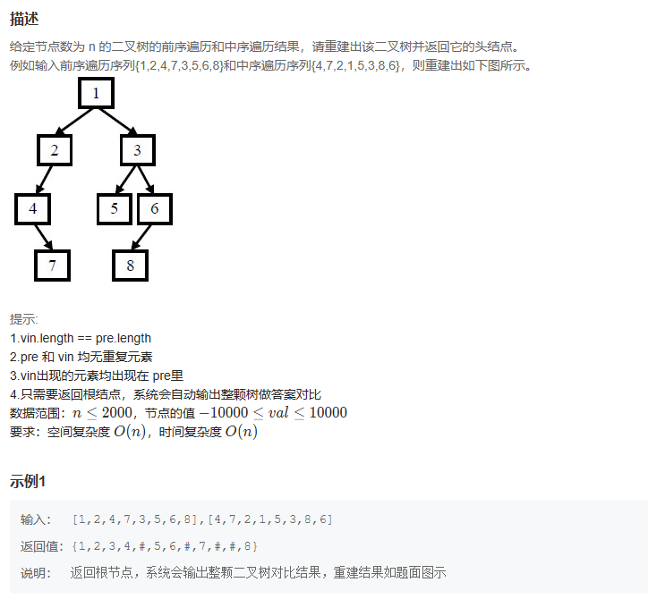  

```
# class TreeNode:
#     def __init__(self, x):
#         self.val = x
#         self.left = None
#         self.right = None
#
# 代码中的类名、方法名、参数名已经指定，请勿修改，直接返回方法规定的值即可
#
# 
# @param preOrder int整型一维数组 
# @param vinOrder int整型一维数组 
# @return TreeNode类
#
class Solution:
    def reConstructBinaryTree(self , preOrder: List[int], vinOrder: List[int]) -> TreeNode:
        # write code here
        if len(preOrder) == 0: return None

        root = TreeNode(preOrder[0])
        cur_root_index = vinOrder.index(preOrder[0])

        root.left = self.reConstructBinaryTree(preOrder[1:1+cur_root_index], vinOrder[0:cur_root_index])
        root.right = self.reConstructBinaryTree(preOrder[1+cur_root_index:],vinOrder[1+cur_root_index:])

        return root
```

>这个先判断前序是否为0如果为0直接返回None，然后找到切入点，通过切入点找左右节点位置
>

## 输出二叉树的右视图

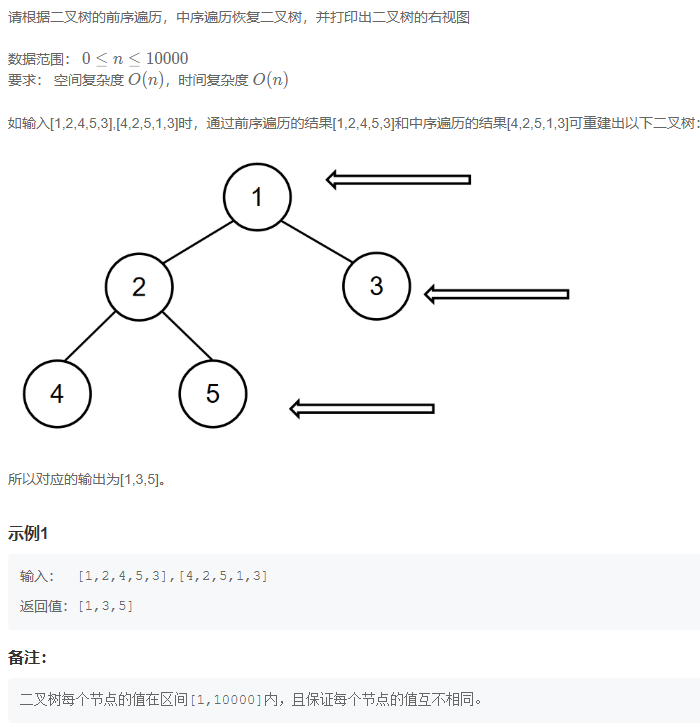  

```
#
# 代码中的类名、方法名、参数名已经指定，请勿修改，直接返回方法规定的值即可
#
# 求二叉树的右视图
# @param preOrder int整型一维数组 先序遍历
# @param inOrder int整型一维数组 中序遍历
# @return int整型一维数组
#
class Solution:
    def solve(self , preOrder: List[int], inOrder: List[int]) -> List[int]:
        # write code here
        if len(preOrder) == 0:return []

        res = [preOrder[0]]
        index = inOrder.index(preOrder[0])

        left = self.solve(preOrder[1:index+1], inOrder[:index])
        right = self.solve(preOrder[index+1:], inOrder[index+1:])
        return res + right + left[len(right):]
```

>跟重构差不多把树改数组即可，返回的话先返回右边最后返回左边 
>
