## 网段扫描
```
root@LingMj:~/xxoo# arp-scan -l
Interface: eth0, type: EN10MB, MAC: 00:0c:29:d1:27:55, IPv4: 192.168.137.190
Starting arp-scan 1.10.0 with 256 hosts (https://github.com/royhills/arp-scan)
192.168.137.1	3e:21:9c:12:bd:a3	(Unknown: locally administered)
192.168.137.50	a0:78:17:62:e5:0a	Apple, Inc.
192.168.137.118	3e:21:9c:12:bd:a3	(Unknown: locally administered)

8 packets received by filter, 0 packets dropped by kernel
Ending arp-scan 1.10.0: 256 hosts scanned in 2.053 seconds (124.70 hosts/sec). 3 responded
```

## 端口扫描

```
root@LingMj:~/xxoo# nmap -p- -sC -sV 192.168.137.118
Starting Nmap 7.95 ( https://nmap.org ) at 2025-07-12 06:13 EDT
Nmap scan report for moban.mshome.net (192.168.137.118)
Host is up (0.0089s latency).
Not shown: 65533 closed tcp ports (reset)
PORT   STATE SERVICE VERSION
22/tcp open  ssh     OpenSSH 8.4p1 Debian 5+deb11u3 (protocol 2.0)
| ssh-hostkey: 
|   3072 f6:a3:b6:78:c4:62:af:44:bb:1a:a0:0c:08:6b:98:f7 (RSA)
|   256 bb:e8:a2:31:d4:05:a9:c9:31:ff:62:f6:32:84:21:9d (ECDSA)
|_  256 3b:ae:34:64:4f:a5:75:b9:4a:b9:81:f9:89:76:99:eb (ED25519)
80/tcp open  http    nginx 1.18.0
| http-cookie-flags: 
|   /: 
|     PHPSESSID: 
|_      httponly flag not set
|_http-server-header: nginx/1.18.0
| http-title: MazeSec\xE9\x9D\xB6\xE6\x9C\xBA\xE6\xB5\x8B\xE8\xAF\x95
|_Requested resource was /index/login/login/token/eb97293ab07da8385711111076fe91b9.html
MAC Address: 3E:21:9C:12:BD:A3 (Unknown)
Service Info: OS: Linux; CPE: cpe:/o:linux:linux_kernel

Service detection performed. Please report any incorrect results at https://nmap.org/submit/ .
Nmap done: 1 IP address (1 host up) scanned in 23.44 seconds
```

## 获取webshell

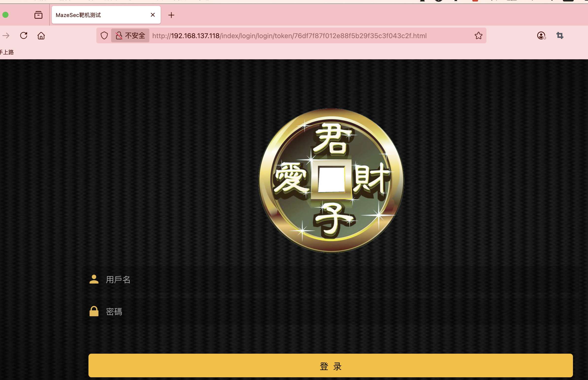  

>存在注册，注册什么都行，不过好像这不是重点
>

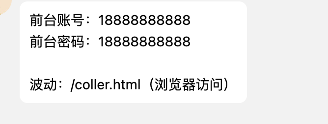  

>作者给的小游戏提示
>

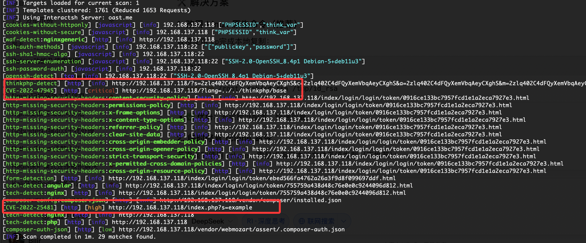  

>这里可以看到前面的路线是thinkphp
>

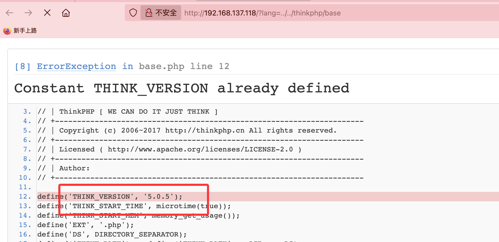  

>知道版本重点就在这里了，如果不知道怎做的我给个参考方案地址：https://blog.csdn.net/weixin_40643324/article/details/143920994
>
>诶我好像复现有点问题看看什么原因
>

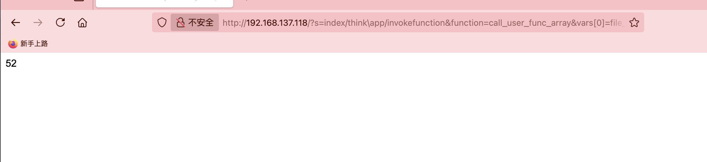  
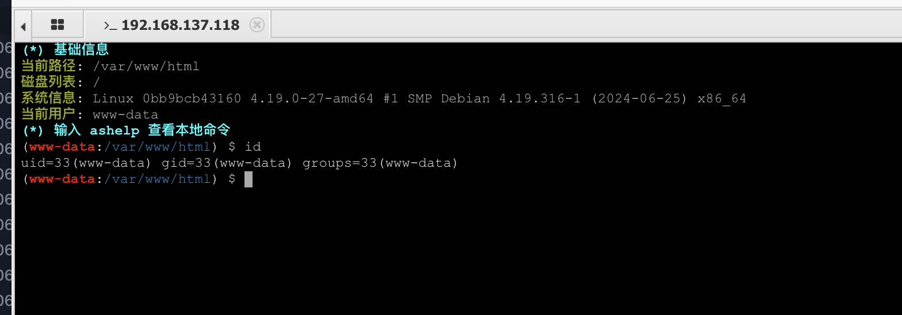  

>逻辑就是创建一个文件
>

## 提权

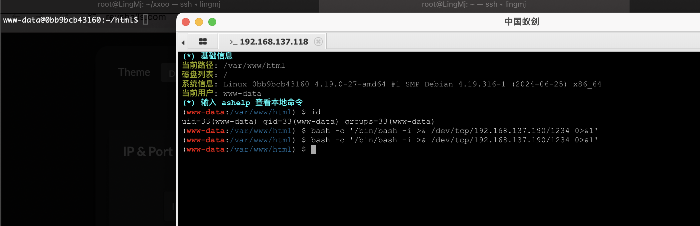  

>这样多开几个进行操作接下来就是最最重要的部分
>

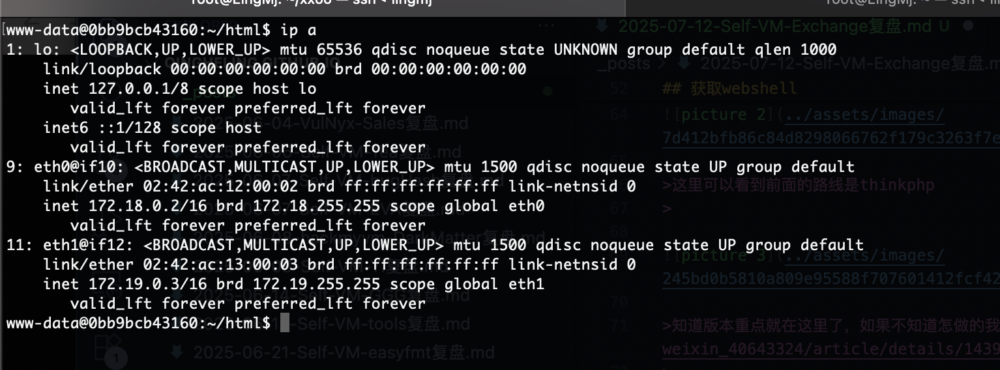  

>可以看到很多ip，我们需要查找其他ip有什么，这里是不能root提权的,因为靶机什么也没有我传一个busybox方便我操作
>

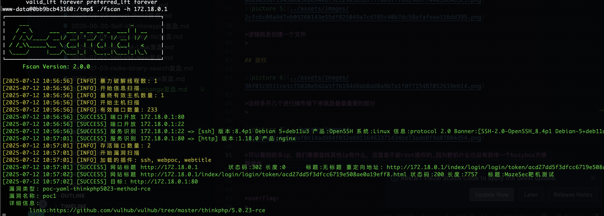  
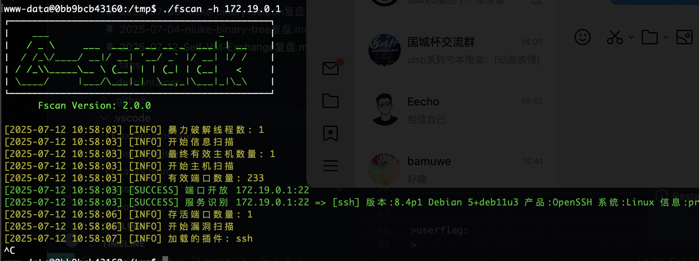  
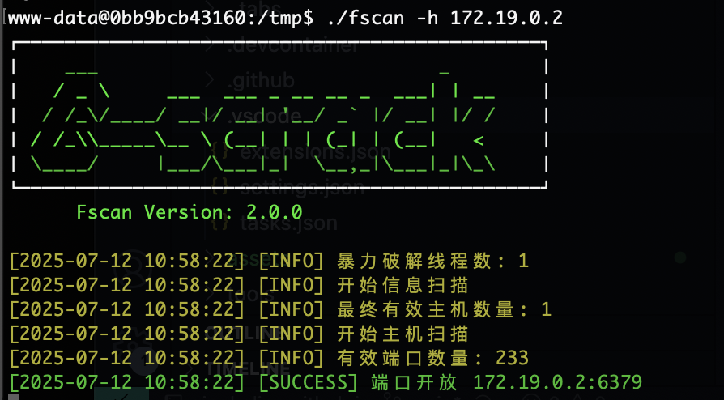  
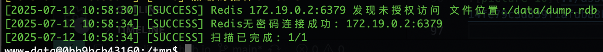  

>主要就是redis为授权主从复制漏洞
>

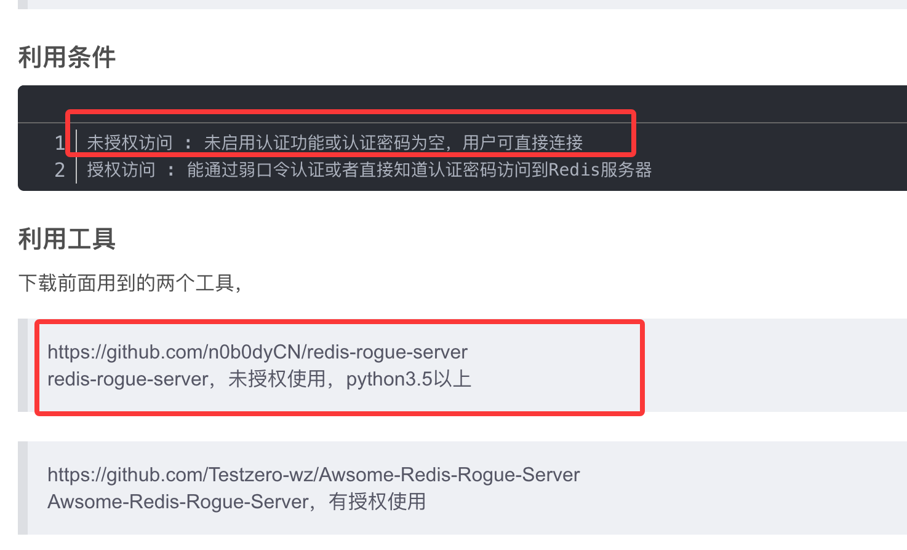  

>工具自行下载：https://github.com/n0b0dyCN/redis-rogue-server
>

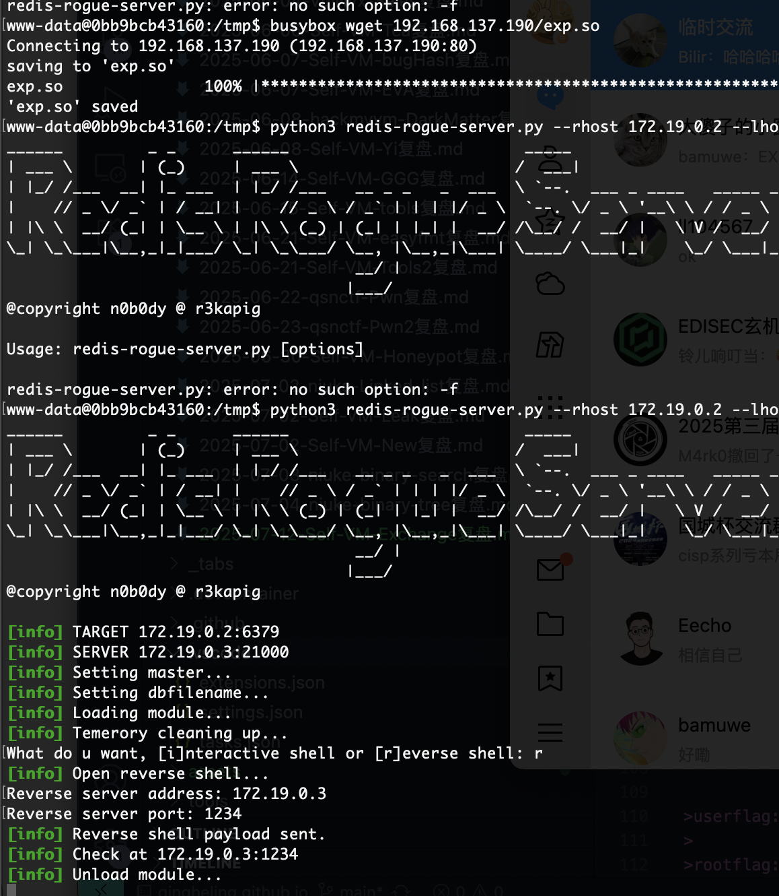  
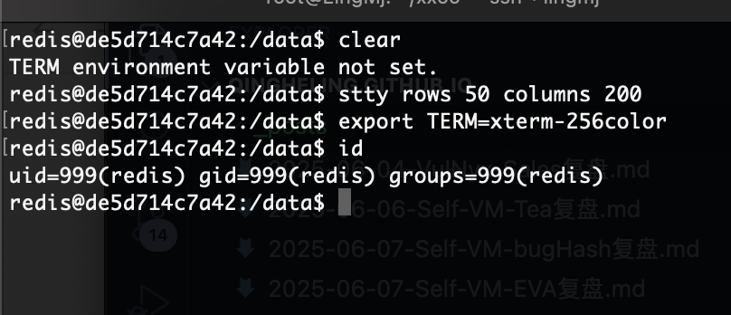  

>当然这里有一个小坑，不过对我没有影响
>

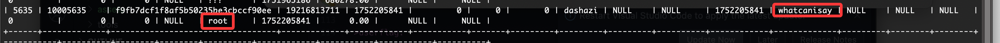  

>好了这个地方是有密码的，这个是第一个机器的，不过我顺序有点反了因为一拿到shell就应该看这个
>

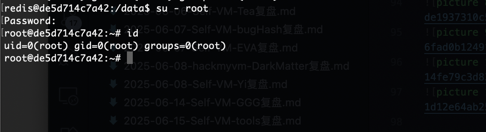  

>最后一个考点比较考验人
>

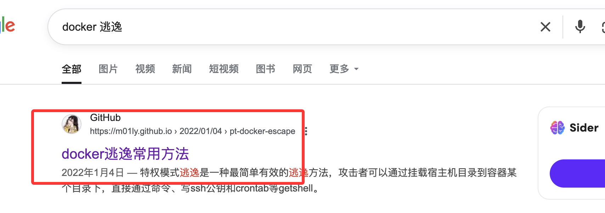  
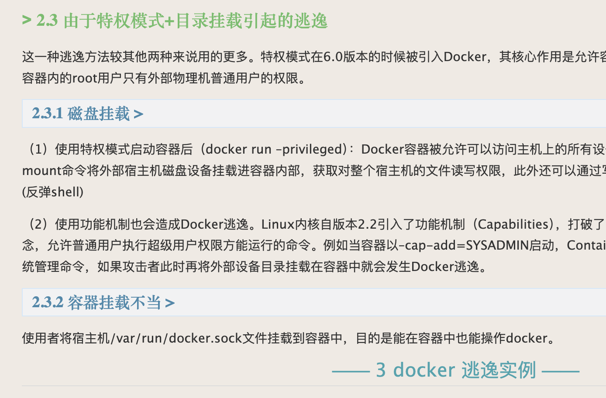  
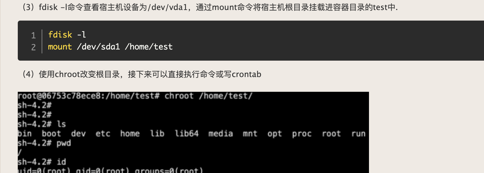  
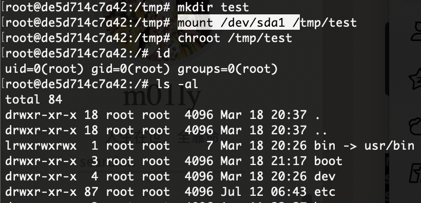  
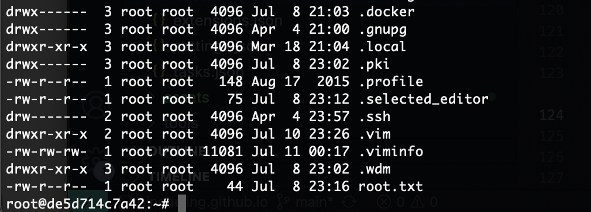  

>复盘结束，感谢bamuwe大佬出的有意思题目，非常有意思每一个知识点我都尽力去想和测试，虽然我是测试员但是还是在路线下学习每一个考点，是一个非常不错的靶机，推荐各位大佬去玩玩！！！
>


>userflag: flag{user-4f6311d4cf5776f0316c2f1b6526a653}
>
>rootflag: flag{root-6dbfaf239023f6da6ed2ffc59d3bcea5}
>