## 网段扫描
```
root@LingMj:~# arp-scan -l
Interface: eth0, type: EN10MB, MAC: 00:0c:29:d1:27:55, IPv4: 192.168.137.190
Starting arp-scan 1.10.0 with 256 hosts (https://github.com/royhills/arp-scan)
192.168.137.1	3e:21:9c:12:bd:a3	(Unknown: locally administered)
192.168.137.50	a0:78:17:62:e5:0a	Apple, Inc.
192.168.137.187	3e:21:9c:12:bd:a3	(Unknown: locally administered)

9 packets received by filter, 0 packets dropped by kernel
Ending arp-scan 1.10.0: 256 hosts scanned in 2.123 seconds (120.58 hosts/sec). 3 responded
```

## 端口扫描

```
root@LingMj:~# nmap -p- -sC -sV 192.168.137.187
Starting Nmap 7.95 ( https://nmap.org ) at 2025-07-12 15:39 EDT
Nmap scan report for Tree.mshome.net (192.168.137.187)
Host is up (0.0074s latency).
Not shown: 65533 closed tcp ports (reset)
PORT   STATE SERVICE VERSION
22/tcp open  ssh     OpenSSH 8.4p1 Debian 5+deb11u3 (protocol 2.0)
| ssh-hostkey: 
|   3072 f6:a3:b6:78:c4:62:af:44:bb:1a:a0:0c:08:6b:98:f7 (RSA)
|   256 bb:e8:a2:31:d4:05:a9:c9:31:ff:62:f6:32:84:21:9d (ECDSA)
|_  256 3b:ae:34:64:4f:a5:75:b9:4a:b9:81:f9:89:76:99:eb (ED25519)
80/tcp open  http    Apache httpd 2.4.62 ((Debian))
|_http-title: Site doesn't have a title (text/html; charset=UTF-8).
|_http-server-header: Apache/2.4.62 (Debian)
MAC Address: 3E:21:9C:12:BD:A3 (Unknown)
Service Info: OS: Linux; CPE: cpe:/o:linux:linux_kernel

Service detection performed. Please report any incorrect results at https://nmap.org/submit/ .
Nmap done: 1 IP address (1 host up) scanned in 17.49 seconds
```

## 获取webshell

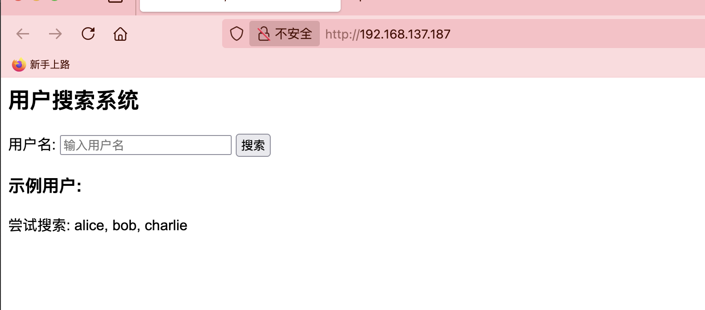  
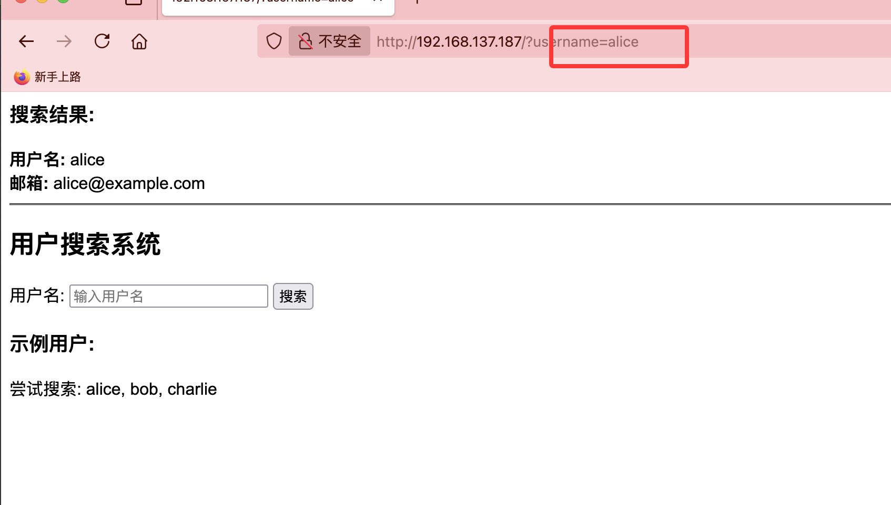  

>我一开始以为这里是sql注入
>

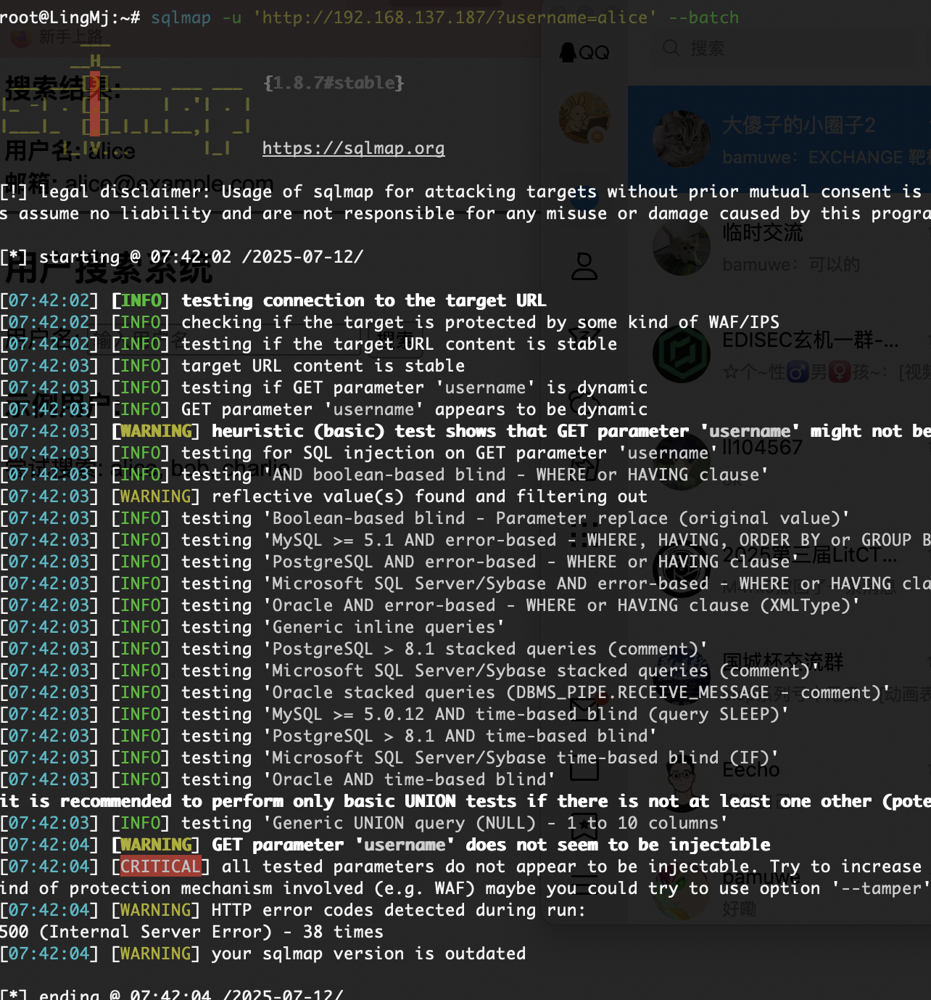  

>然后这里有一个考点，不过我一开始没用直接爆破，这里我一开始用user通常字典没爆破出来，我反其道而行之把fuzz的字典放上去了
>

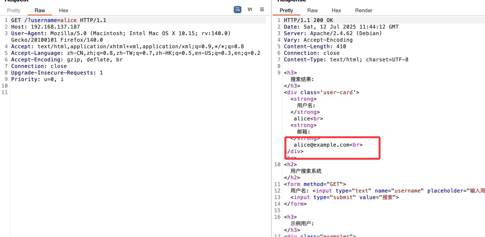  
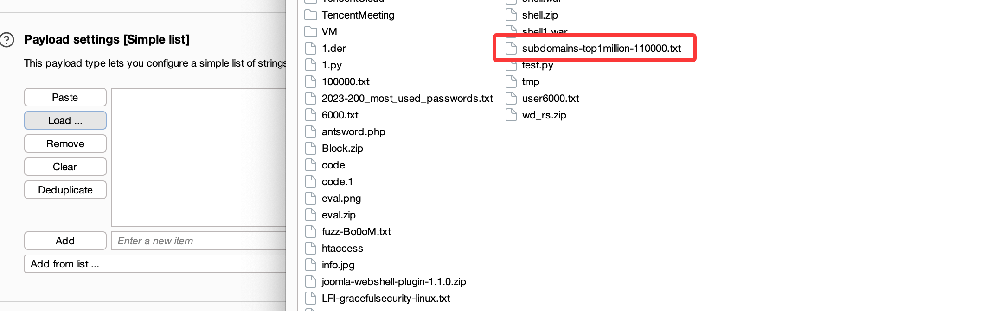  
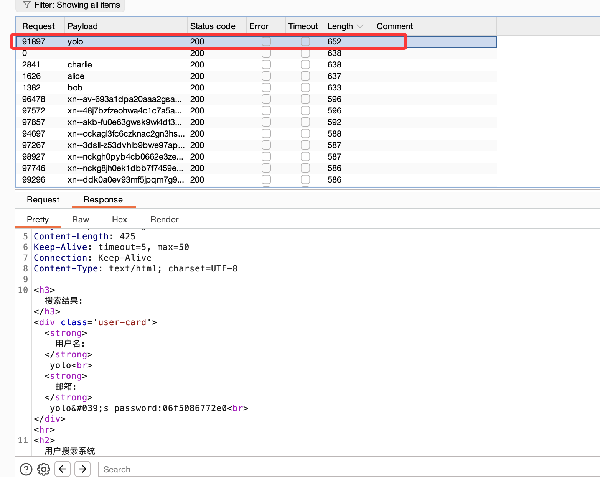  
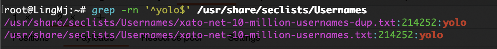  

>可以看到9万和21万的区别，然后我说一下考点考点是xpath
>
>不会的可以参考路径：https://xz.aliyun.com/news/7386
>

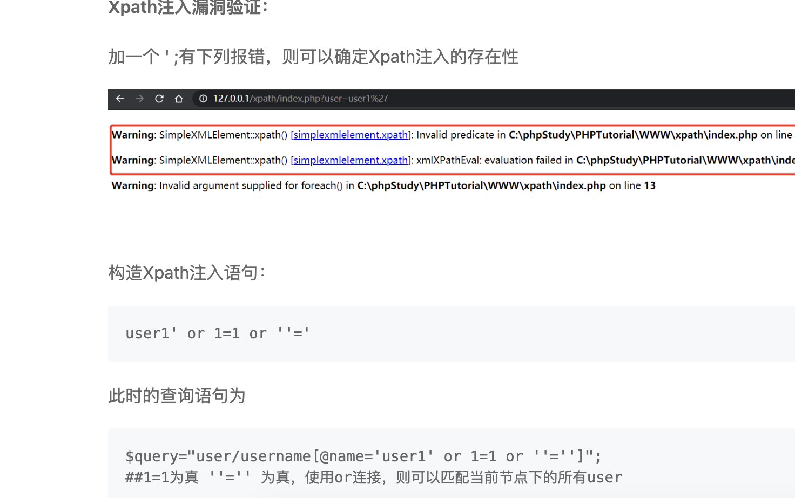  
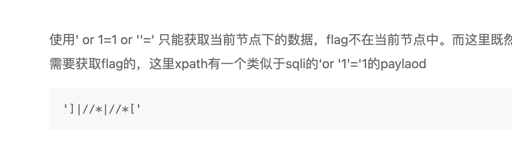  
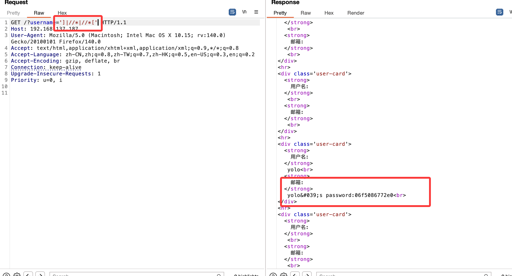  
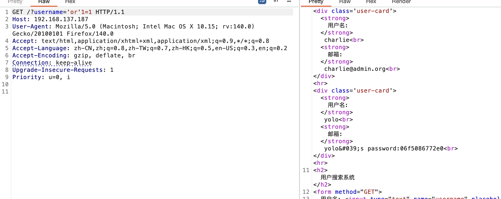  

>'or'1=1和']|//*|//*['
>

## 提权

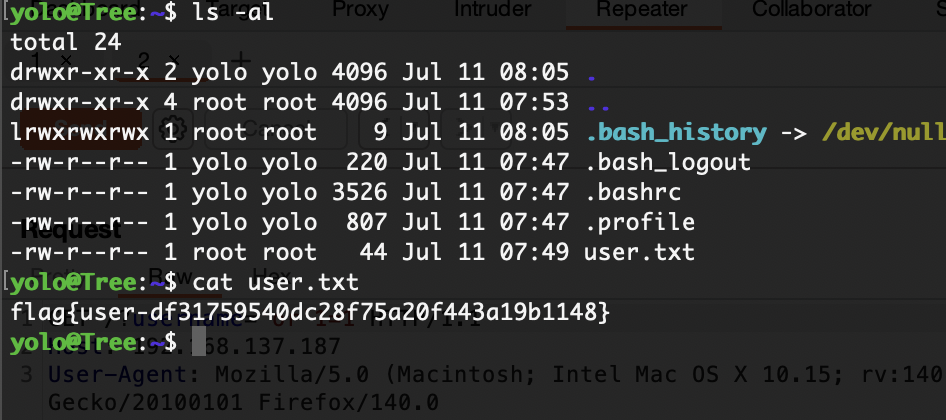  
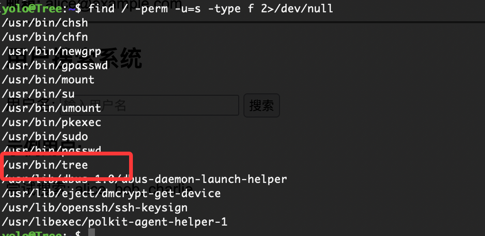  
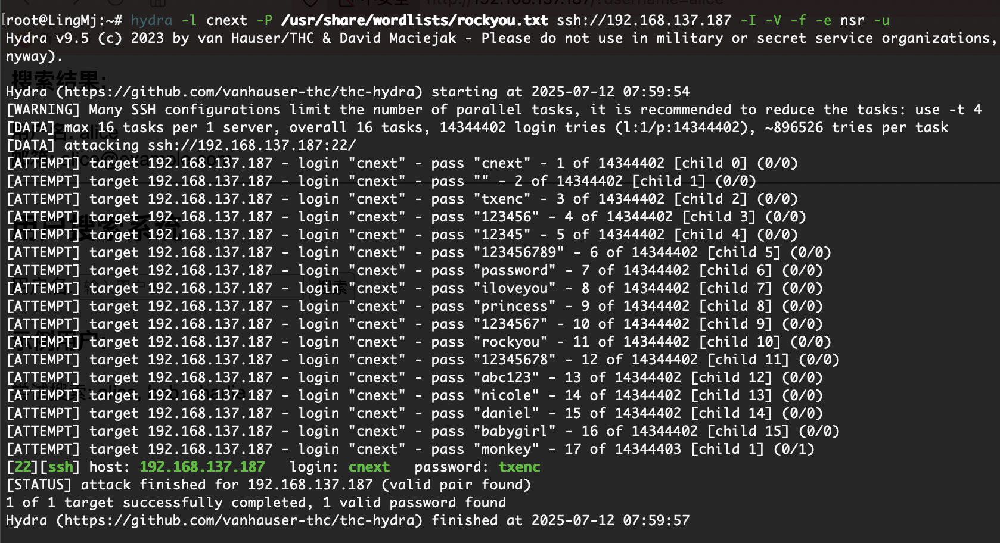  
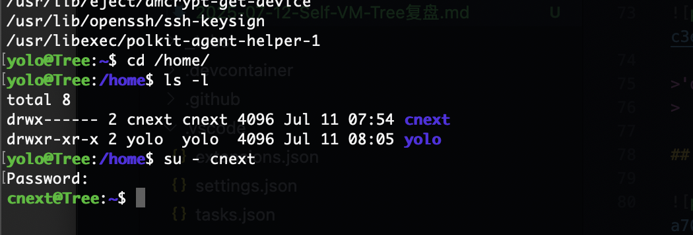  

>拿到另外一个用户不过拿不拿无所谓的
>

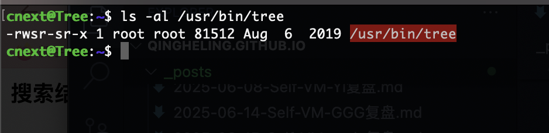  

>具有suid权限，这里有3个方案解决奥我会逐一给你们提供，先来最有可能卡住的
>

```
cnext@Tree:~$ /usr/bin/tree --help
usage: tree [-acdfghilnpqrstuvxACDFJQNSUX] [-H baseHREF] [-T title ]
	[-L level [-R]] [-P pattern] [-I pattern] [-o filename] [--version]
	[--help] [--inodes] [--device] [--noreport] [--nolinks] [--dirsfirst]
	[--charset charset] [--filelimit[=]#] [--si] [--timefmt[=]<f>]
	[--sort[=]<name>] [--matchdirs] [--ignore-case] [--fromfile] [--]
	[<directory list>]
  ------- Listing options -------
  -a            All files are listed.
  -d            List directories only.
  -l            Follow symbolic links like directories.
  -f            Print the full path prefix for each file.
  -x            Stay on current filesystem only.
  -L level      Descend only level directories deep.
  -R            Rerun tree when max dir level reached.
  -P pattern    List only those files that match the pattern given.
  -I pattern    Do not list files that match the given pattern.
  --ignore-case Ignore case when pattern matching.
  --matchdirs   Include directory names in -P pattern matching.
  --noreport    Turn off file/directory count at end of tree listing.
  --charset X   Use charset X for terminal/HTML and indentation line output.
  --filelimit # Do not descend dirs with more than # files in them.
  --timefmt <f> Print and format time according to the format <f>.
  -o filename   Output to file instead of stdout.
  ------- File options -------
  -q            Print non-printable characters as '?'.
  -N            Print non-printable characters as is.
  -Q            Quote filenames with double quotes.
  -p            Print the protections for each file.
  -u            Displays file owner or UID number.
  -g            Displays file group owner or GID number.
  -s            Print the size in bytes of each file.
  -h            Print the size in a more human readable way.
  --si          Like -h, but use in SI units (powers of 1000).
  -D            Print the date of last modification or (-c) status change.
  -F            Appends '/', '=', '*', '@', '|' or '>' as per ls -F.
  --inodes      Print inode number of each file.
  --device      Print device ID number to which each file belongs.
  ------- Sorting options -------
  -v            Sort files alphanumerically by version.
  -t            Sort files by last modification time.
  -c            Sort files by last status change time.
  -U            Leave files unsorted.
  -r            Reverse the order of the sort.
  --dirsfirst   List directories before files (-U disables).
  --sort X      Select sort: name,version,size,mtime,ctime.
  ------- Graphics options -------
  -i            Don't print indentation lines.
  -A            Print ANSI lines graphic indentation lines.
  -S            Print with CP437 (console) graphics indentation lines.
  -n            Turn colorization off always (-C overrides).
  -C            Turn colorization on always.
  ------- XML/HTML/JSON options -------
  -X            Prints out an XML representation of the tree.
  -J            Prints out an JSON representation of the tree.
  -H baseHREF   Prints out HTML format with baseHREF as top directory.
  -T string     Replace the default HTML title and H1 header with string.
  --nolinks     Turn off hyperlinks in HTML output.
  ------- Input options -------
  --fromfile    Reads paths from files (.=stdin)
  ------- Miscellaneous options -------
  --version     Print version and exit.
  --help        Print usage and this help message and exit.
  --            Options processing terminator.
```

>阅读手册也是很重要的
>

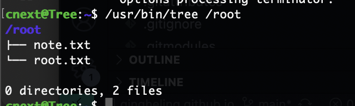  

>可以读flag
>

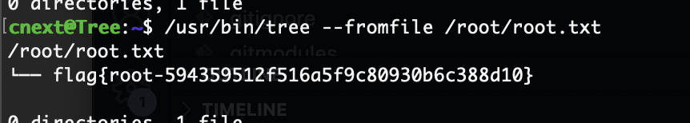  

>声明读flag不是方案，这个是留给新手的小孩模式，所以我们要做的是获取root shell
>

>第一方案是之前做过的/tmp/pe.so方案
>

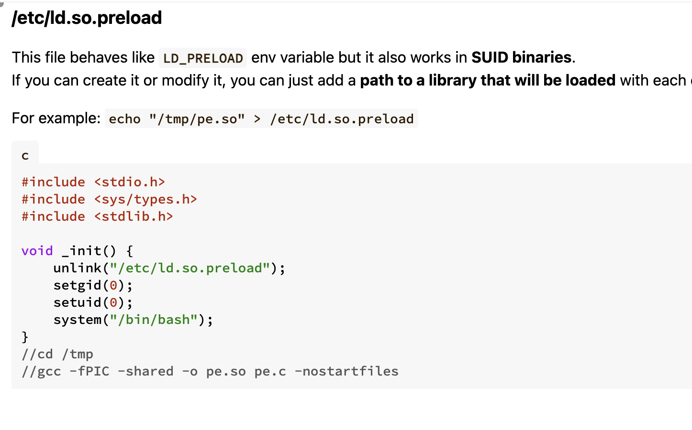  
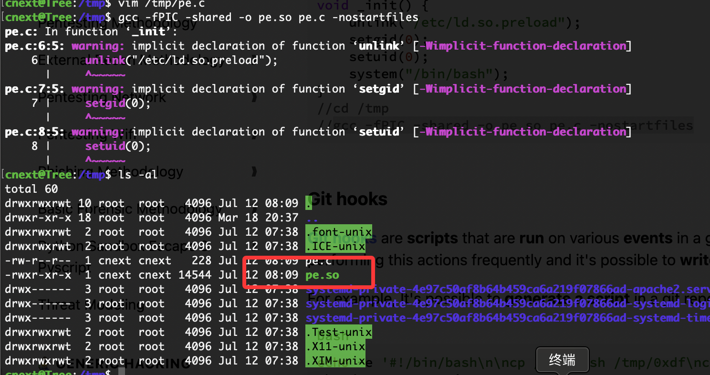  
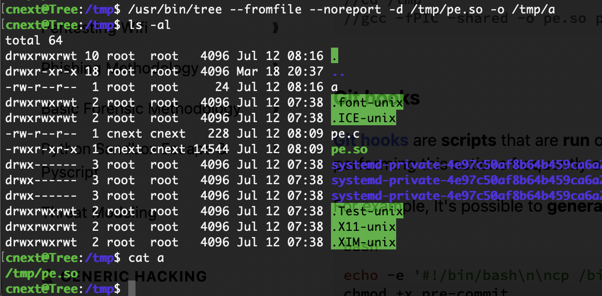  
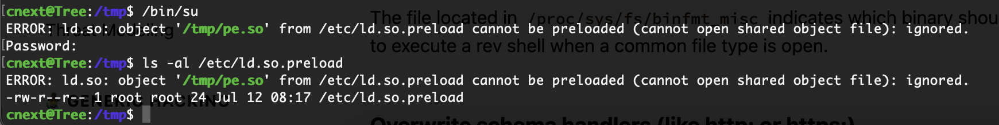  

>报错了
>

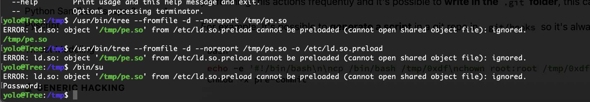  

>有点玄学奥先下一个操作
>

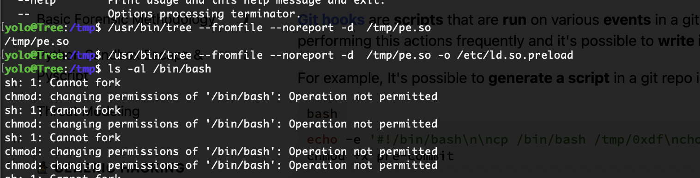  

>研究出来了是+x的问题去掉就可以了
>

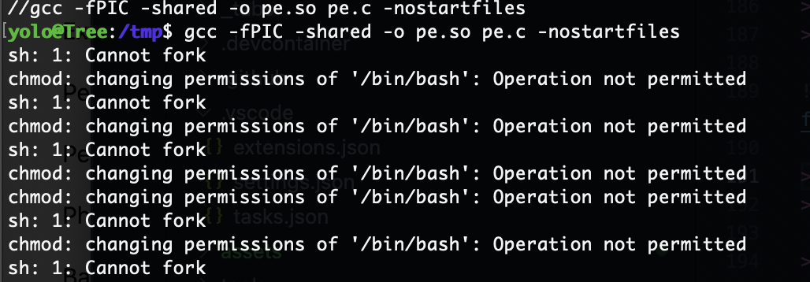  

>不过说我没权限是什么问题
>

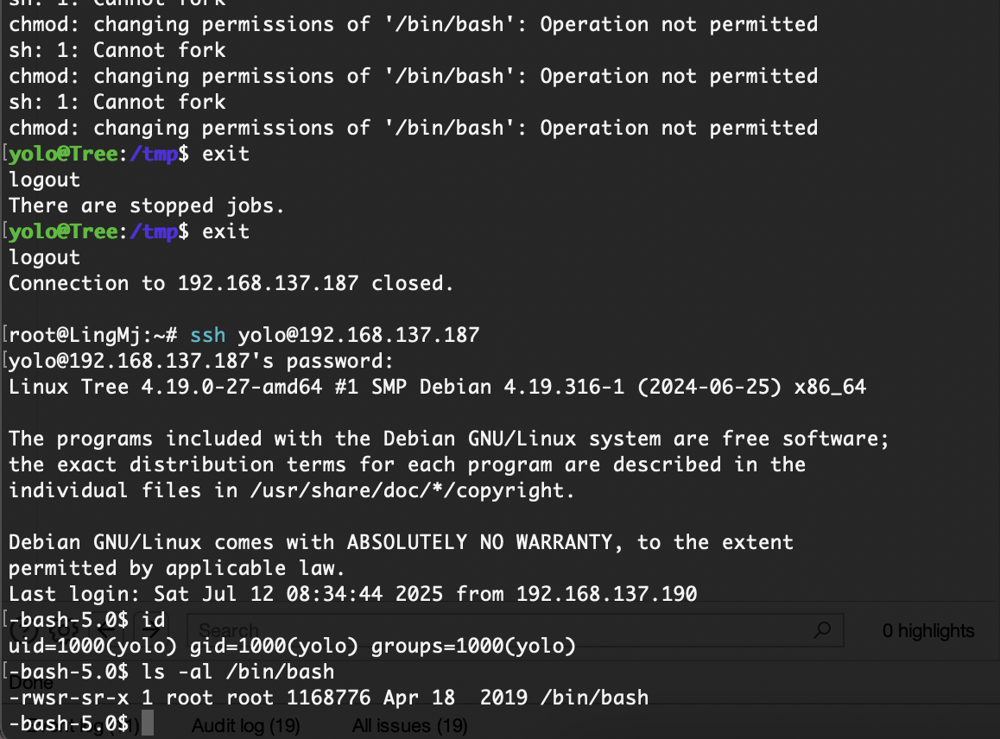  

>退出重新登录就好了
>

>下一个操作是sudoers的写入，因为是覆盖所以只有一次机会
>

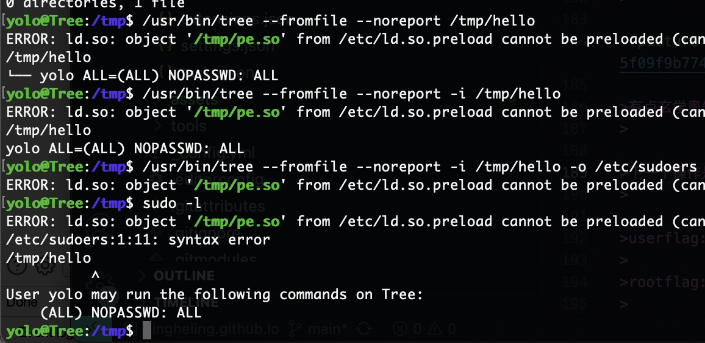  

>不过很简单所以小心一点就行
>
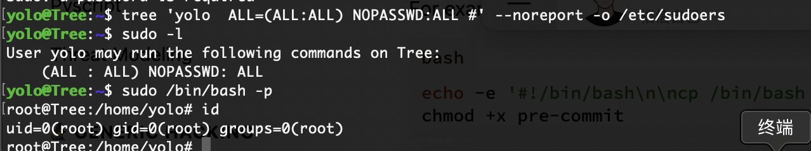  

>mkdir可以去掉空格问题
>

>进去把之前错误的删掉重新写入
>

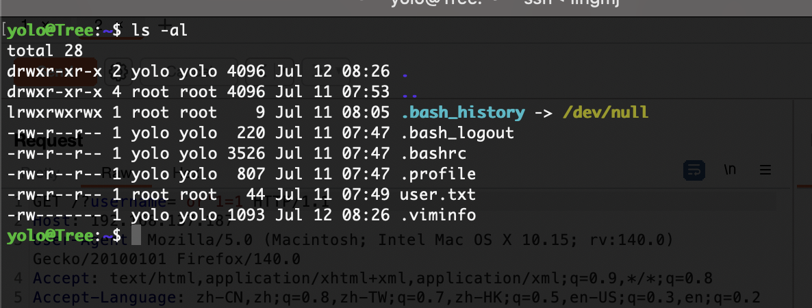  

>继续变回来奥，最后一个方案是找密码的
>

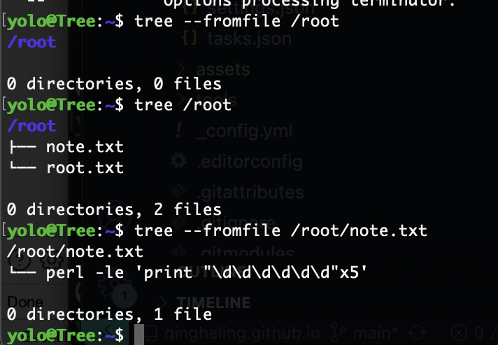  
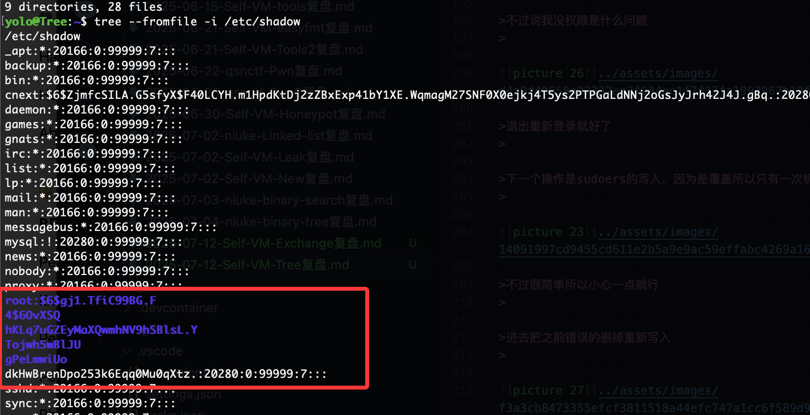  
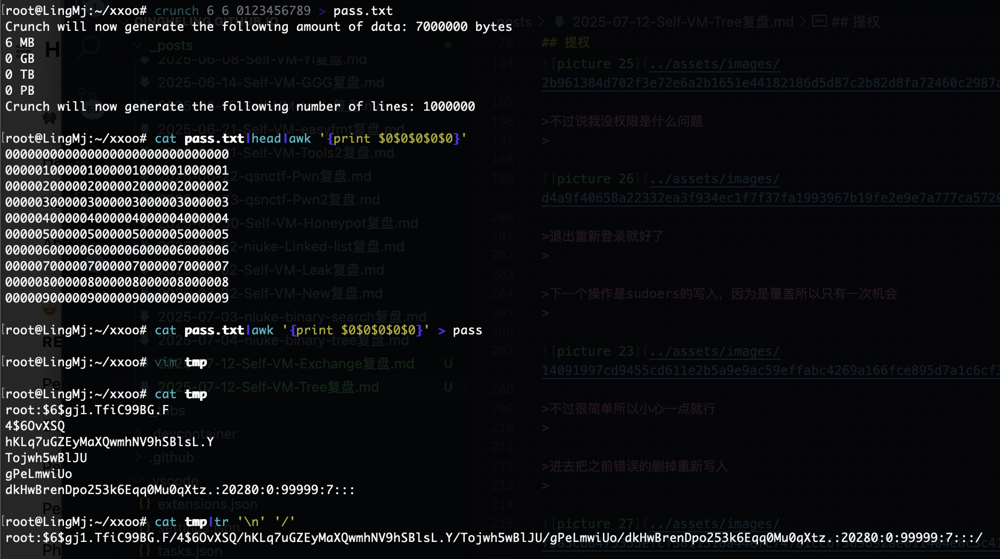  
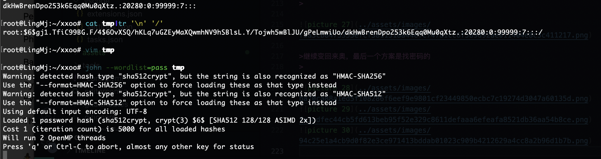  
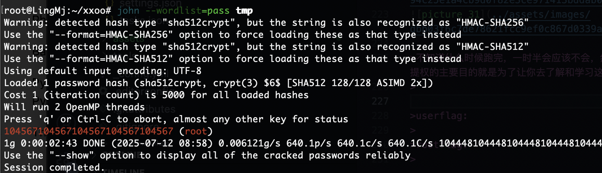  

>多加几个方案
>
>写私钥
>

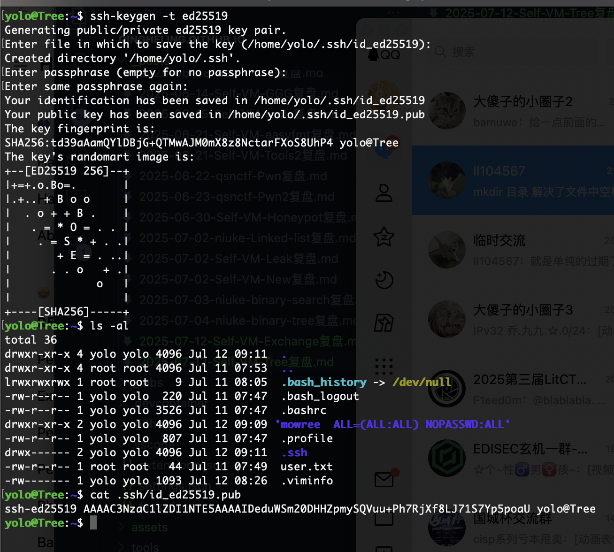  
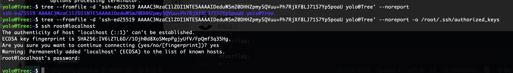  

>为啥没成功
>

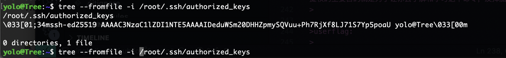  

>多了点东西
>

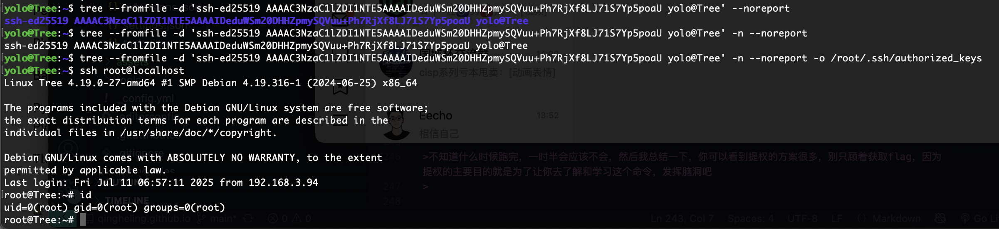  

>颜色问题加个-n即可
>


>不知道什么时候跑完，一时半会应该不会，然后我总结一下，你可以看到提权的方案很多，别只顾着获取flag，因为提权的主要目的就是为了让你去了解和学习这个命令，发挥脑洞吧
>

>userflag:
>
>rootflag:
>