## 网段扫描
```
root@LingMj:~# arp-scan -l         
Interface: eth0, type: EN10MB, MAC: 00:0c:29:fb:0f:16, IPv4: 192.168.137.194
Starting arp-scan 1.10.0 with 256 hosts (https://github.com/royhills/arp-scan)
192.168.137.1	3e:21:9c:12:bd:a3	(Unknown: locally administered)
192.168.137.202	a0:78:17:62:e5:0a	Apple, Inc.
192.168.137.239	3e:21:9c:12:bd:a3	(Unknown: locally administered)

6 packets received by filter, 0 packets dropped by kernel
Ending arp-scan 1.10.0: 256 hosts scanned in 2.095 seconds (122.20 hosts/sec). 3 responded
```

## 端口扫描

```
Not shown: 65521 closed tcp ports (reset)
PORT      STATE SERVICE       VERSION
80/tcp    open  http          Microsoft IIS httpd 10.0
|_http-title: IIS Windows
| http-methods: 
|_  Potentially risky methods: TRACE
|_http-server-header: Microsoft-IIS/10.0
135/tcp   open  msrpc         Microsoft Windows RPC
139/tcp   open  netbios-ssn   Microsoft Windows netbios-ssn
445/tcp   open  microsoft-ds?
5040/tcp  open  unknown
5985/tcp  open  http          Microsoft HTTPAPI httpd 2.0 (SSDP/UPnP)
|_http-title: Not Found
|_http-server-header: Microsoft-HTTPAPI/2.0
47001/tcp open  http          Microsoft HTTPAPI httpd 2.0 (SSDP/UPnP)
|_http-title: Not Found
|_http-server-header: Microsoft-HTTPAPI/2.0
49664/tcp open  msrpc         Microsoft Windows RPC
49665/tcp open  msrpc         Microsoft Windows RPC
49666/tcp open  msrpc         Microsoft Windows RPC
49667/tcp open  msrpc         Microsoft Windows RPC
49668/tcp open  msrpc         Microsoft Windows RPC
49669/tcp open  msrpc         Microsoft Windows RPC
49670/tcp open  msrpc         Microsoft Windows RPC
MAC Address: 3E:21:9C:12:BD:A3 (Unknown)
Service Info: OS: Windows; CPE: cpe:/o:microsoft:windows

Host script results:
| smb2-security-mode: 
|   3:1:1: 
|_    Message signing enabled but not required
|_nbstat: NetBIOS name: ADMIN, NetBIOS user: <unknown>, NetBIOS MAC: 08:00:27:63:5f:9d (Oracle VirtualBox virtual NIC)
|_clock-skew: 5h59m54s
| smb2-time: 
|   date: 2025-07-30T17:57:38
|_  start_date: N/A

Service detection performed. Please report any incorrect results at https://nmap.org/submit/ .
Nmap done: 1 IP address (1 host up) scanned in 576.25 seconds
```

## 获取webshell

>端口挺多，可以先尝试永恒之蓝漏洞先
>

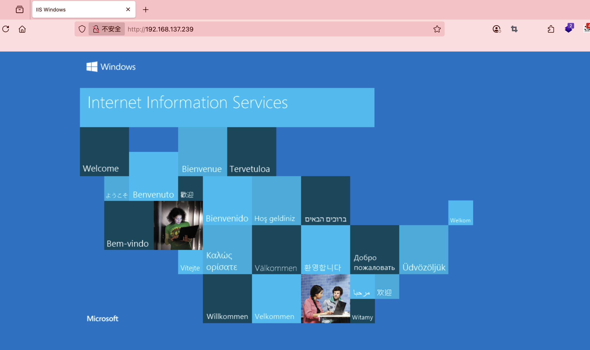  
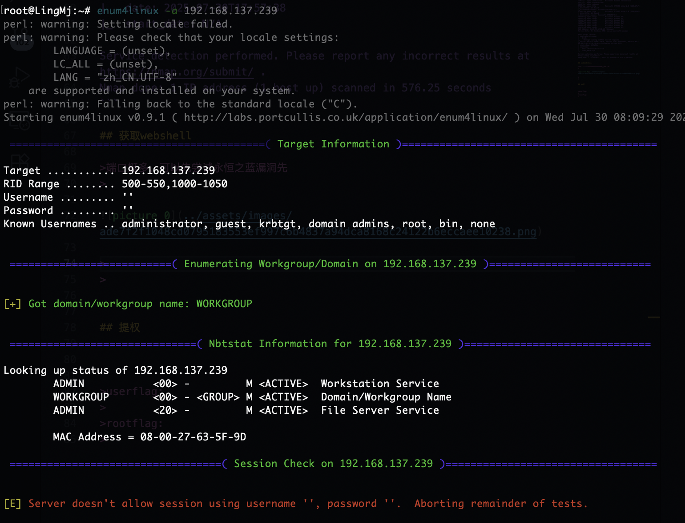  
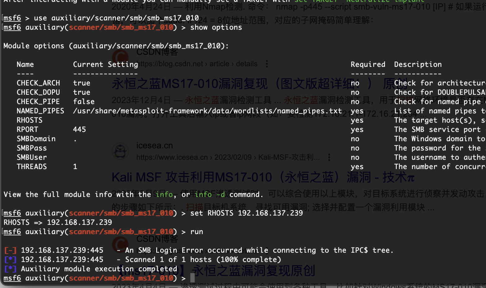  

>貌似不是这个看看网站信息
>

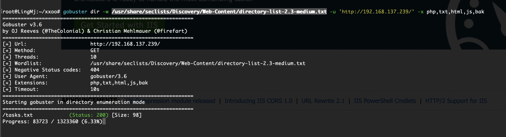  
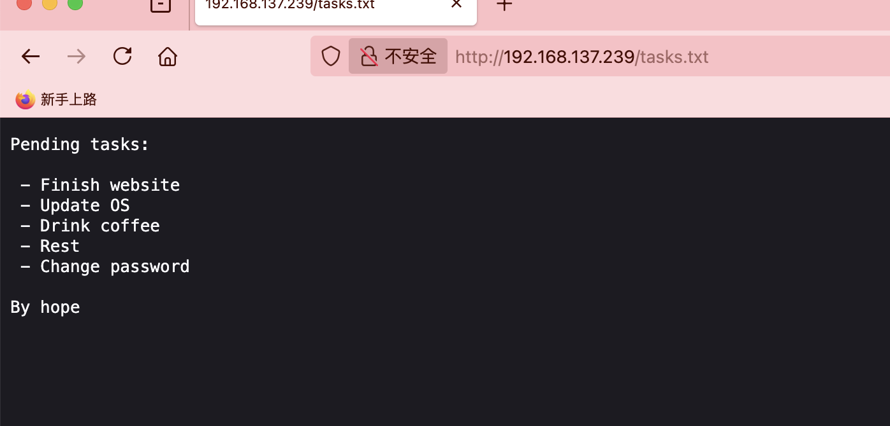  
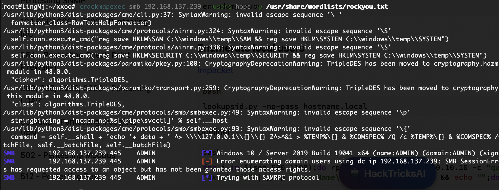  
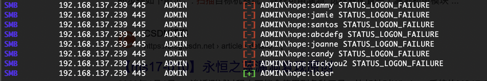  
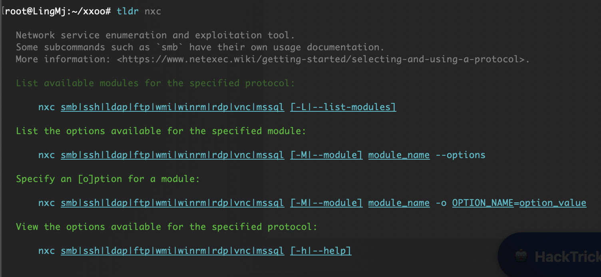  


```
crackmapexec smb 192.168.137.239 -u hope -p /usr/share/wordlists/rockyou.txt
nxc smb 192.168.137.239 -u "hope" -p "/usr/share/wordlists/rockyou.txt" --ignore-pw-decoding
```

>这里有2个形式爆破之前出现过crack没有怎么办，所以找了一下留下，他俩没有时间差异一样快
>

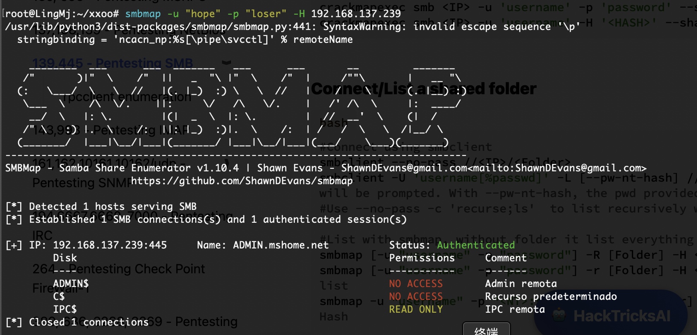  
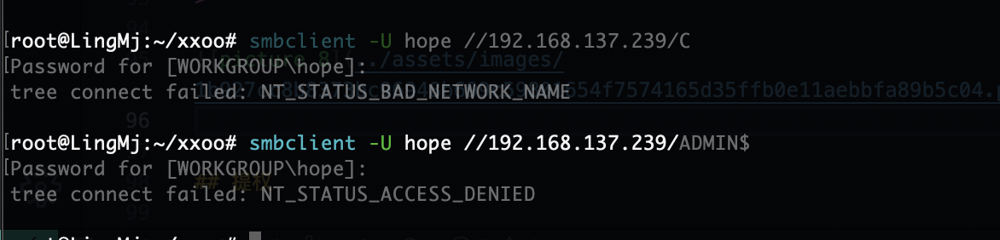  

>也不是得利用msf了
>

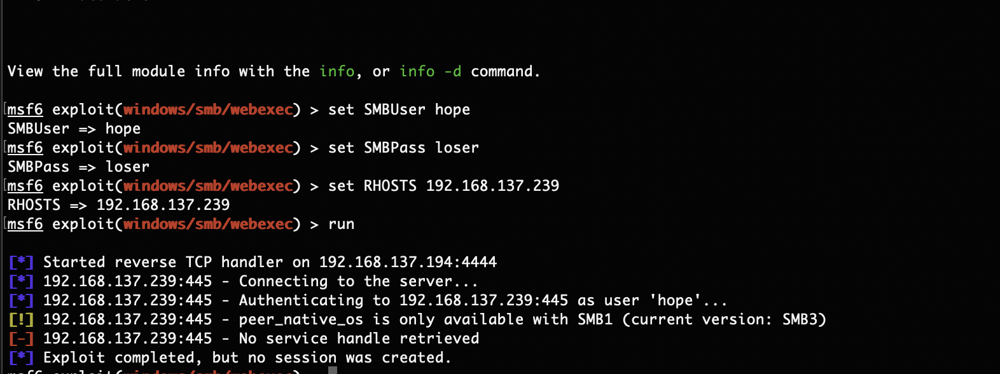  
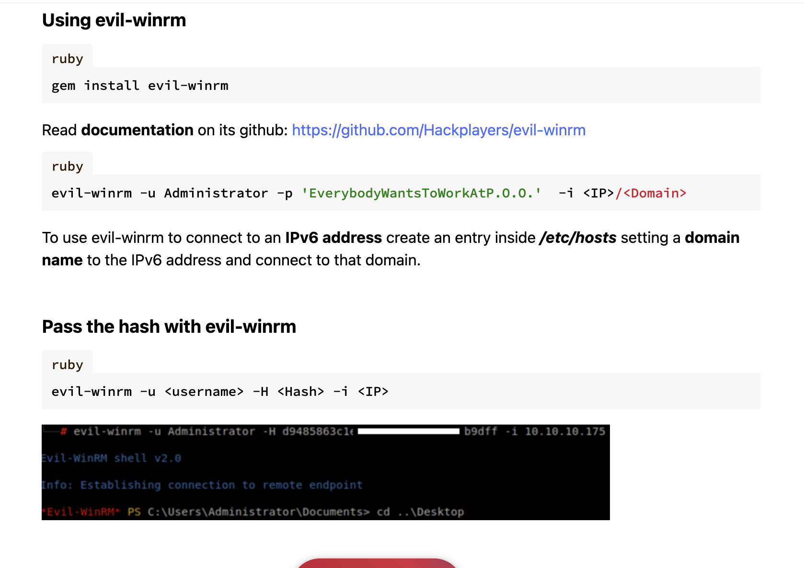  

>看端口查找winrm发现了可以直接连接的
>

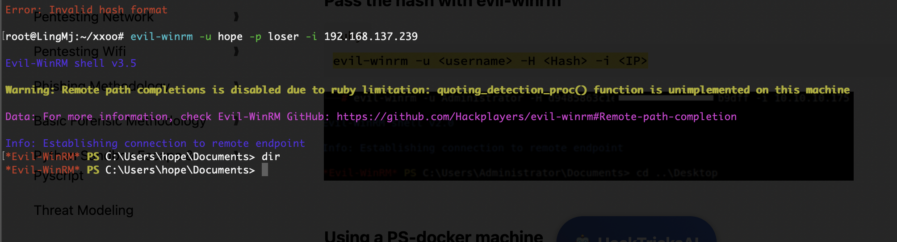  

>OK连接上了
>

## 提权

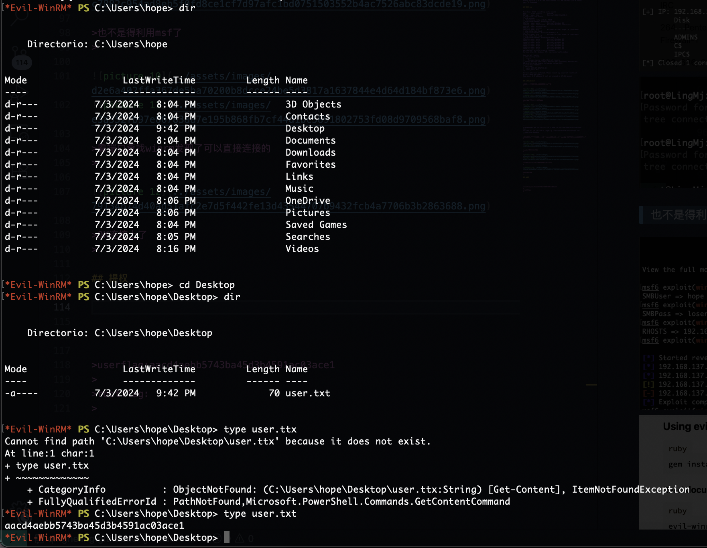  

>没有tab和基本命令打起来有点难受
>

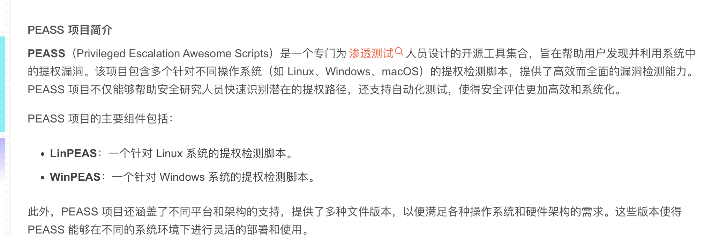  
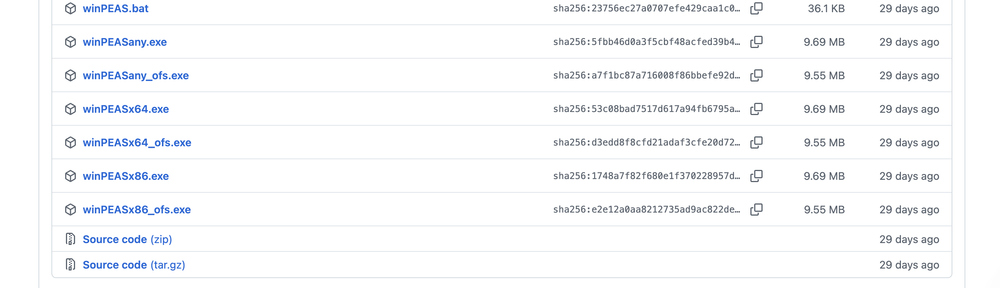  
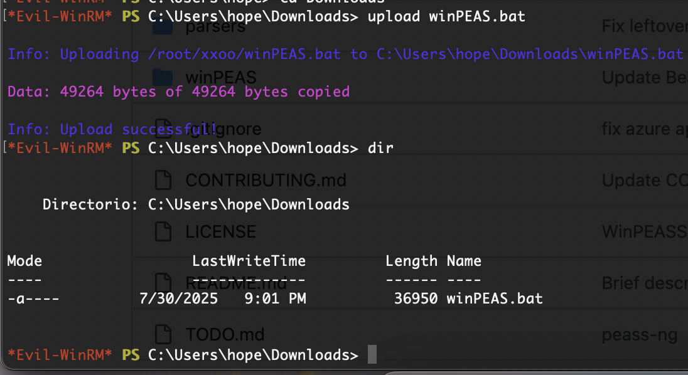  

>传一个上来主要是用于和linux一样的linpeas.sh扫描工具
>

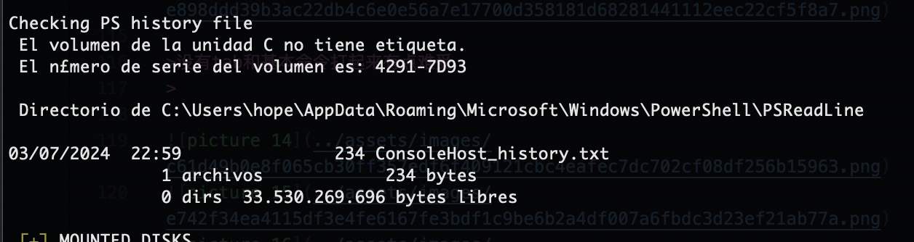  

>这里有一个历史文件
>

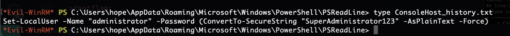  

>有密码了登录一下，先退出去
>

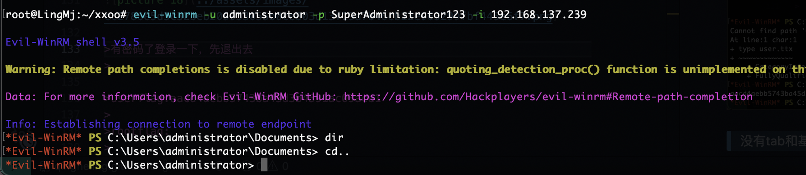  

>OK拿到权限
>

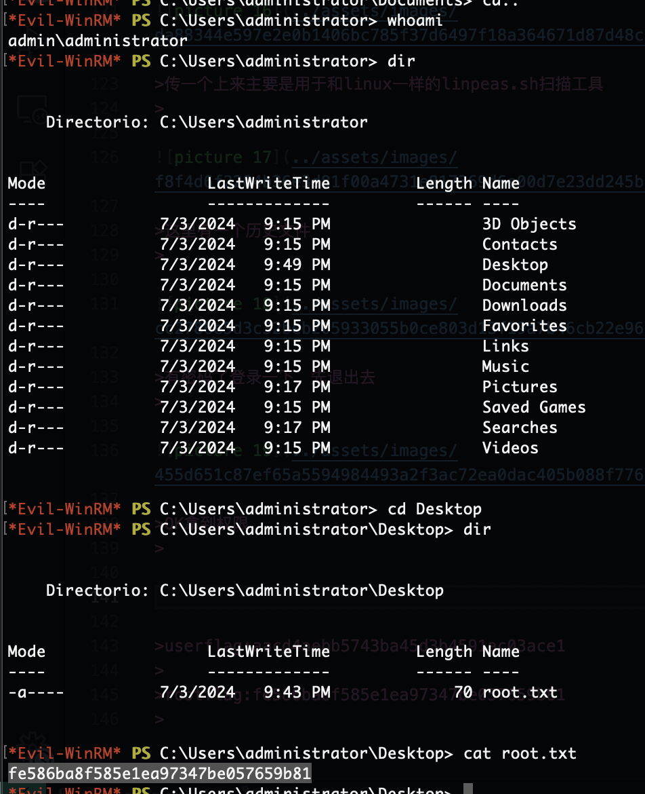  

>不过他能使用cat我是没想到的正常没有cat，OK结束了
>

>userflag:aacd4aebb5743ba45d3b4591ac03ace1
>
>rootflag:fe586ba8f585e1ea97347be057659b81
>