## 网段扫描
```
root@LingMj:~/xxoo# arp-scan -l
Interface: eth0, type: EN10MB, MAC: 00:0c:29:fb:0f:16, IPv4: 192.168.137.194
Starting arp-scan 1.10.0 with 256 hosts (https://github.com/royhills/arp-scan)
192.168.137.1	3e:21:9c:12:bd:a3	(Unknown: locally administered)
192.168.137.97	3e:21:9c:12:bd:a3	(Unknown: locally administered)
192.168.137.202	a0:78:17:62:e5:0a	Apple, Inc.
192.168.137.167	62:2f:e8:e4:77:5d	(Unknown: locally administered)

9 packets received by filter, 0 packets dropped by kernel
Ending arp-scan 1.10.0: 256 hosts scanned in 2.036 seconds (125.74 hosts/sec). 4 responded
```

## 端口扫描

```
root@LingMj:~/xxoo# nmap -p- 192.168.137.97 
Starting Nmap 7.94SVN ( https://nmap.org ) at 2025-07-30 09:24 EDT
Nmap scan report for Always-PC.mshome.net (192.168.137.97)
Host is up (0.0062s latency).
Not shown: 65522 closed tcp ports (reset)
PORT      STATE SERVICE
21/tcp    open  ftp
135/tcp   open  msrpc
139/tcp   open  netbios-ssn
445/tcp   open  microsoft-ds
3389/tcp  open  ms-wbt-server
5357/tcp  open  wsdapi
8080/tcp  open  http-proxy
49152/tcp open  unknown
49153/tcp open  unknown
49154/tcp open  unknown
49155/tcp open  unknown
49156/tcp open  unknown
49158/tcp open  unknown
MAC Address: 3E:21:9C:12:BD:A3 (Unknown)

Nmap done: 1 IP address (1 host up) scanned in 24.54 seconds
```

## 获取webshell

>目测没有80，有8080需要找点用户爆破
>

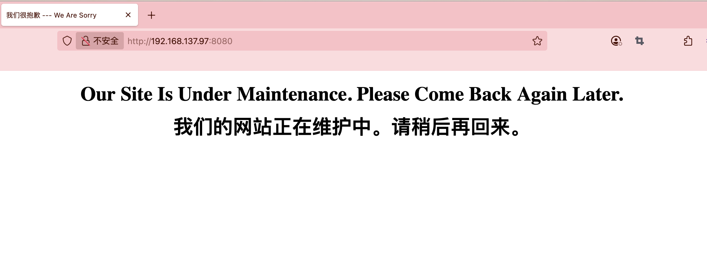  
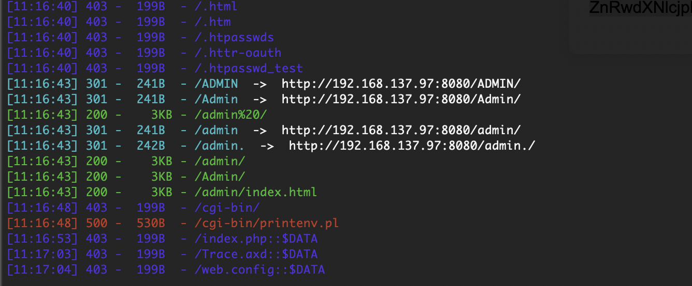  
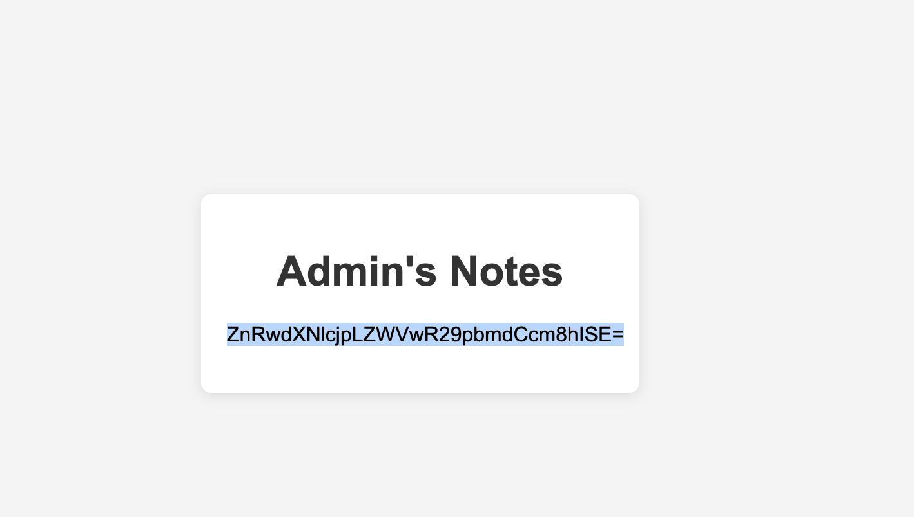  
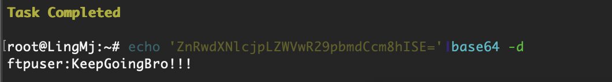  
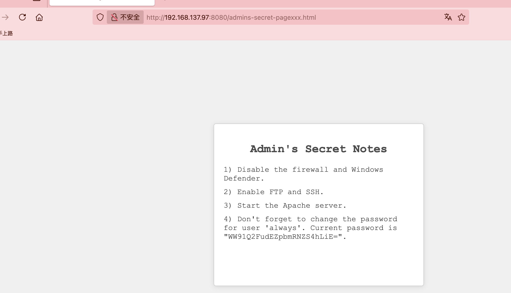  
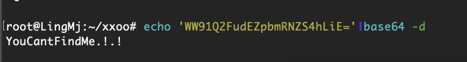  
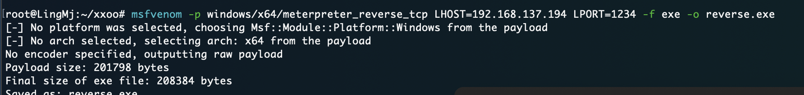  

>构建反弹shell
>

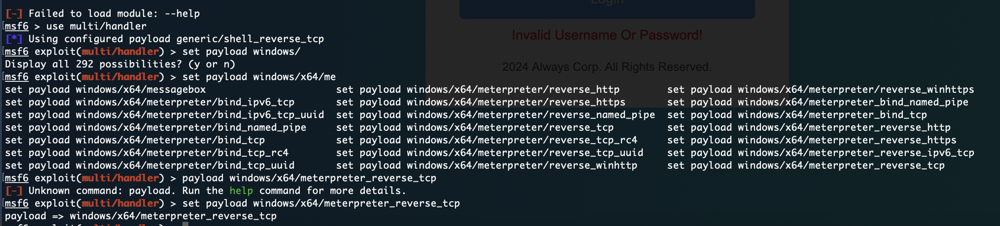  

>试了密码得用ftpuser登录
>

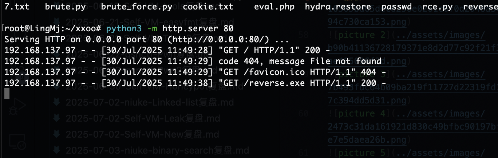  
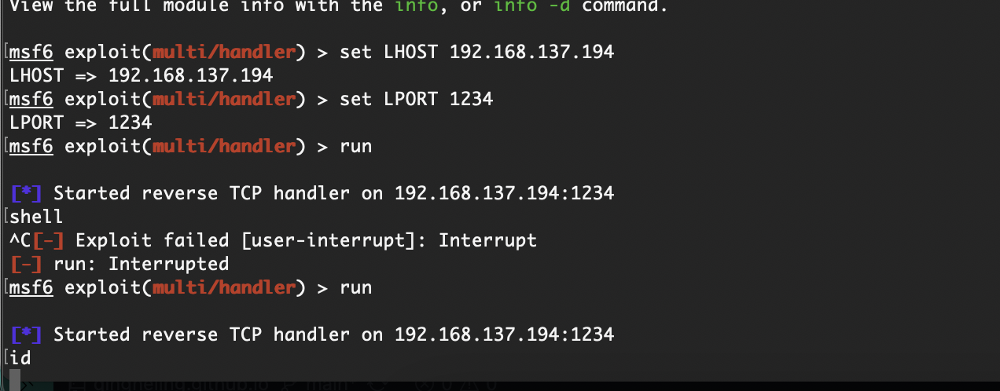  

>没弹回来我很好奇
>

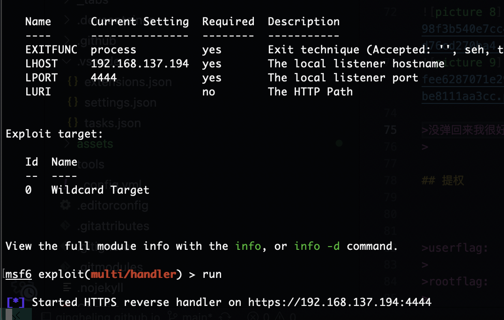  
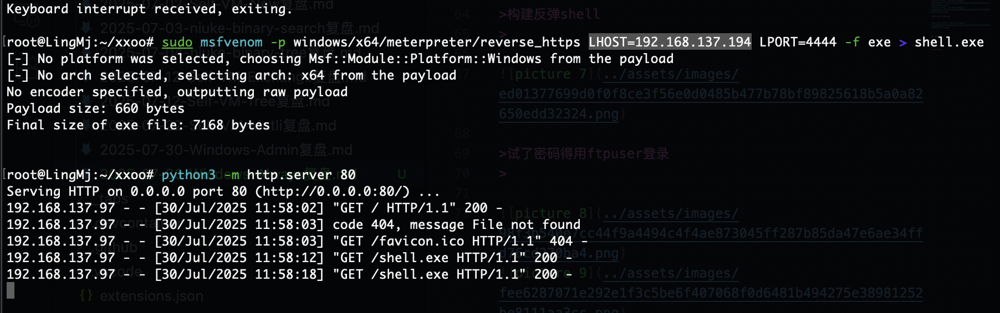  

>重新构造也弹不回来
>

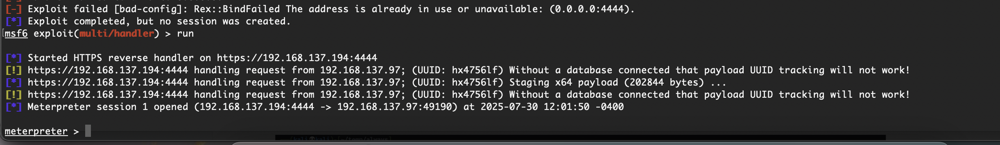  

>原来是我点错了点击左边右边是取消
>

## 提权

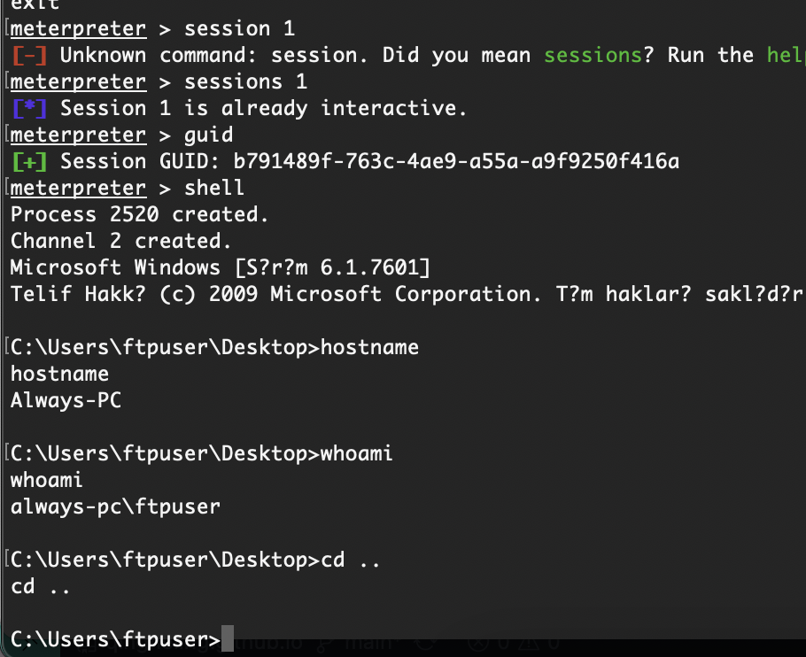  
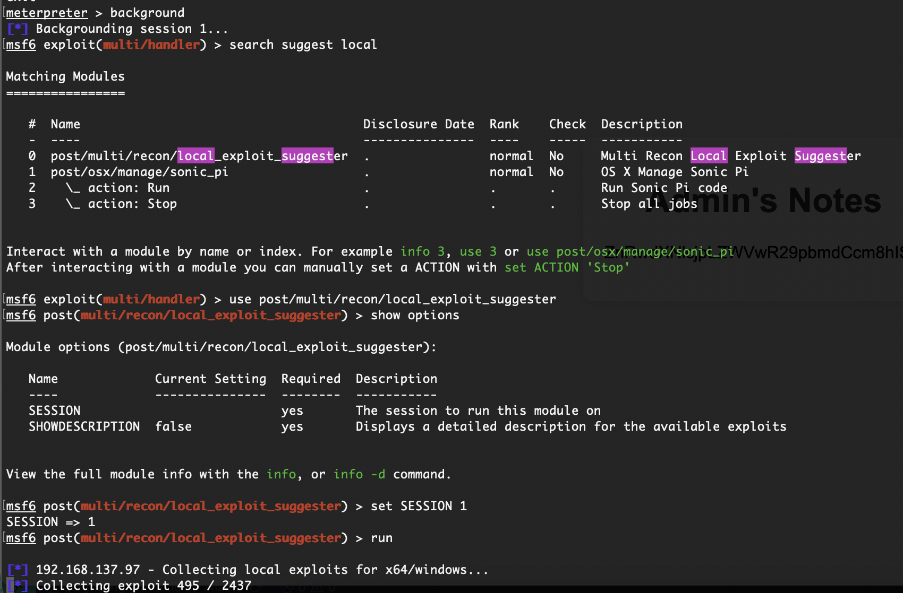  

>可以了利用msf进行漏洞库扫描
>

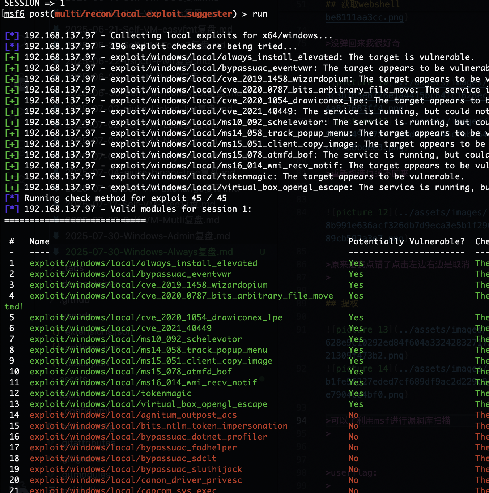  
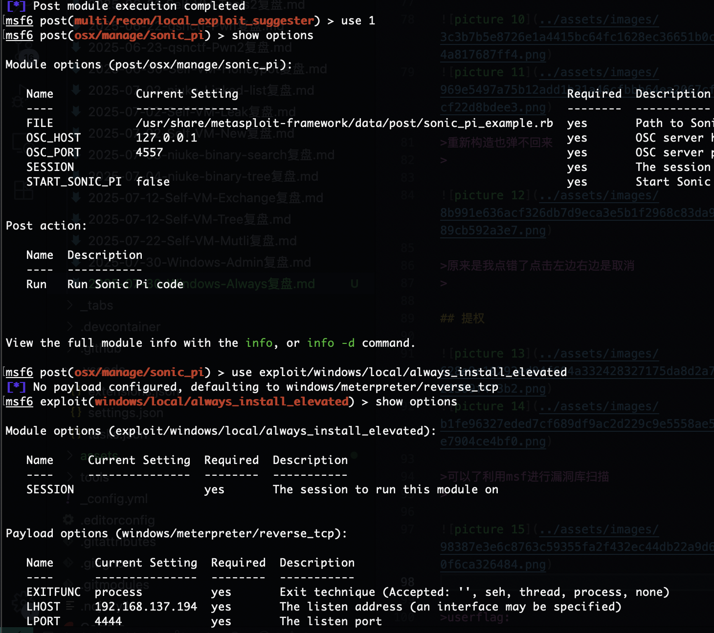  
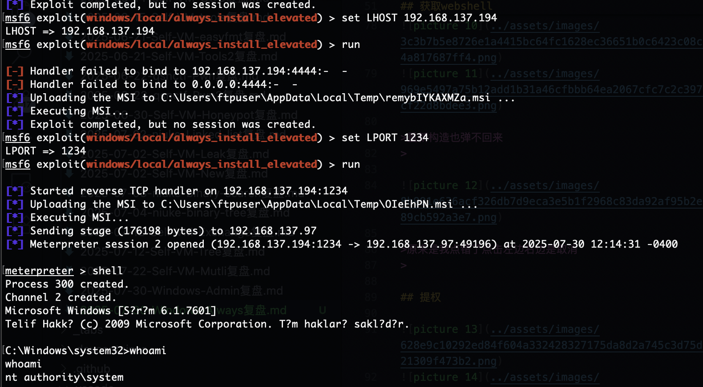  

>是root权限可以去找flag了，结束了感觉还是有点难度刚开始windows
>

>userflag:HMV{You_Found_Me!}
>
>rootflag:HMV{White_Flag_Raised}
>